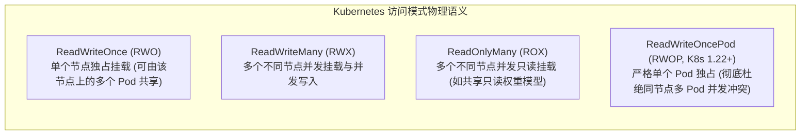
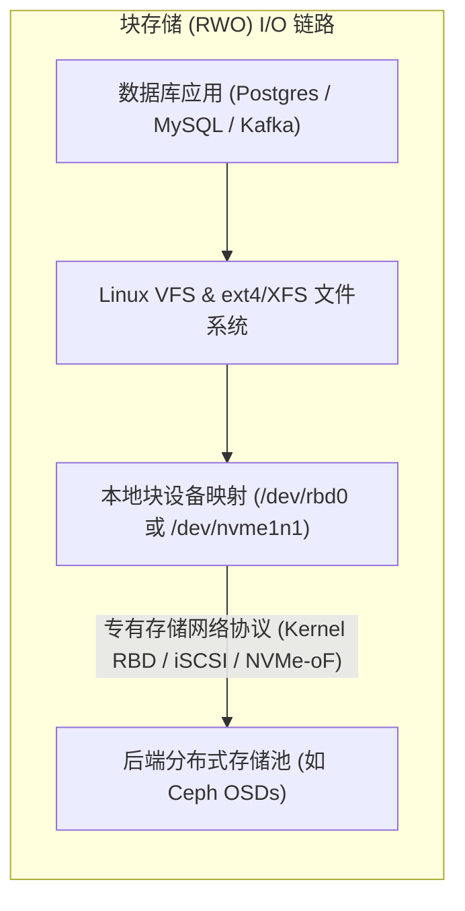
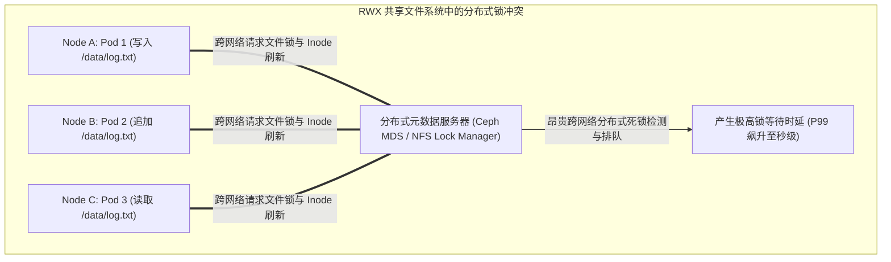
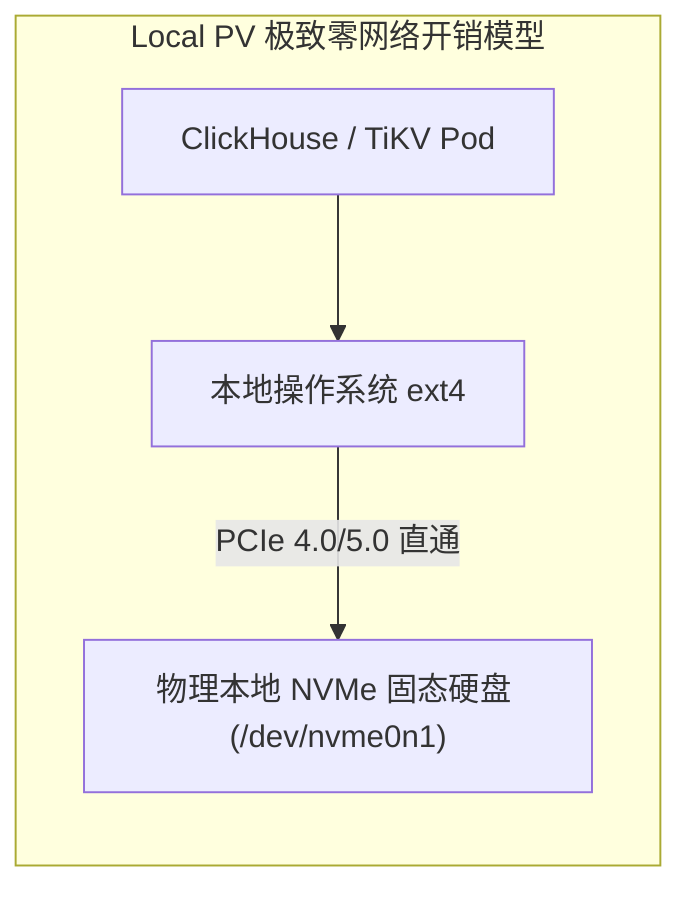
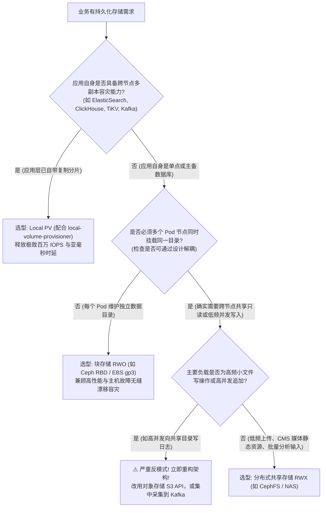

**TL;DR：** 许多对分布式存储缺乏深入理解的开发团队，往往倾向于将所有的 PVC 都申请为 **ReadWriteMany（RWX）** 模式——认为这样多个 Pod 副本就可以任意并发读写同一个目录，无需考虑状态拆分。然而在生产高并发压测下，这种“偷懒”的架构选择往往会迅速引发灾难性的性能崩塌：**千个并发写入 Pod 会将底层分布式文件系统的元数据服务器（MDS）瞬间打爆，引发剧烈的分布式锁（DLM）排队，导致 I/O 延迟从 2 毫秒骤升到数秒**。本文深度剖析 Kubernetes **RWO（独占块存储）**、**RWX（共享文件系统）** 与 **Local PV（本地高性能物理盘）** 三大存储接入模式的微观物理差异、锁机制与生产决策矩阵。

---

## 一、 核心概念澄清：访问模式（Access Modes）的本质

在 Kubernetes 中，`PersistentVolume` 的 `accessModes` 经常被初学者误解为“文件系统的读写权限”：

关键误区澄清：
- **`ReadWriteOnce` 中的 "Once" 指的是「单个工作节点（Single Node）」**，而不是「单个 Pod」！同一个物理主机上的两个 Pod，只要被调度到该节点，在技术上是可以共享挂载同一个 RWO 卷的（直到 Kubernetes 引入了更严苛的 `RWOP`）；
- **决定访问模式上限的是底层物理存储类型**：普通的块设备（如 AWS EBS、Ceph RBD、普通物理硬盘）天然只能是 RWO；只有具备网络文件系统协议（如 NFS、CephFS、GlusterFS、Samba）的分布式文件系统，才具备支持 RWX 的物理前提。

---

## 二、 模式一：块存储（RWO）——数据库与顺序写引擎的最佳拍档

块存储（Block Storage）对外暴露的是无文件系统的纯裸设备（Raw Block Device）接口，格式化后挂载到单个节点。

### 2.1 架构优势与极限性能
- **零外部元数据争用**：文件系统的目录树、Inode 校验和元数据完全由**挂载该卷的单个节点的本地操作系统内核（ext4 / XFS）**独立维护，不存在跨主机的元数据同步锁；
- **充分利用本地 PageCache**：操作系统的脏页回写与预读（Read-ahead）机制可以全力施展，随机 I/O 延迟通常在 **1~3 毫秒**级别；
- **工业首选**：关系型数据库（PostgreSQL、MySQL）、时序数据库、消息队列（Kafka Log 目录）**必须严格使用 RWO 模式**。

---

## 三、 模式二：共享文件系统（RWX）——元数据锁竞争与性能悬崖

分布式共享文件系统（如 CephFS、NFS、GlusterFS）允许多个位于不同物理机上的 Pod 同时挂载并并发读写同一份文件目录。

### 3.1 致命瓶颈：分布式锁管理器（DLM）与元数据风暴

在 RWX 场景下，文件系统的完整性保障极其沉重：
1. **Cache Invalidation（跨节点缓存失效）**：当节点 A 上的 Pod 1 向文件写入 4KB 数据时，为了保证节点 B 上的 Pod 2 能读到最新数据，分布式存储系统必须向全网所有挂载该目录的节点发送**缓存失效与刷新广播（Invalidate Cache Tokens）**；
2. **小文件与大并发写入雪崩**：当数百个微服务同时向同一个共享日志目录打日志，或者并发创建成千上万个小文件时，**中心元数据服务器（MDS）的 CPU 会瞬间被并发锁竞争占满**，引发全集群客户端挂起；
3. **NFS 经典幽灵：`Stale File Handle`（失效文件句柄）**：在基于传统 NFS 的 RWX 方案中，一旦节点 A 删除了某个文件而节点 B 的进程依然持有该文件的句柄，会永久抛出 `ESTALE (Stale file handle)` 异常，导致 Pod 无法自愈，必须重启整个节点。

---

## 四、 模式三：本地持久卷（Local PV）——物理性能的极限压榨

如果你的应用自身已经具备了分布式三副本或分片容灾能力（如 ClickHouse、Elasticsearch、Kafka、Cassandra、TiKV），上层存储再做三副本网络复制反而会造成**三次网络跳转的巨大浪费**。

**Local PV（本地持久卷）** 允许 Pod 直接独占挂载宿主机本地的物理 NVMe SSD：

### 4.1 物理特权与残酷代价的平衡木

| 核心维度 | Local PV（本地存储） | 云分布式块存储（RWO） | 分布式共享存储（RWX） |
| :--- | :--- | :--- | :--- |
| **底层硬件路径** | **本机 PCIe 物理总线直连** | 跨数据中心存储专用网络 | 跨数据中心网络 + 分布式文件协议 |
| **4K 随机写 IOPS**| **500,000 ~ 1,000,000+** | 3,000 ~ 64,000 (受云盘规格限制) | 500 ~ 5,000 (严重受制于网络与锁) |
| **P99 读写时延** | **< 100 微秒 (0.1ms)** | 1 ~ 3 毫秒 | 10 ~ 100+ 毫秒 (波动极大) |
| **宿主机宕机容灾**| **❌ 数据随单机损坏（需靠应用层副本）**| **✅ 云盘可被其他存活节点快速重新 Attach** | **✅ 任意存活节点均可直接读取** |
| **Pod 调度灵活性** | **极度受限（必须与单一物理机锁死）** | 灵活（在同一可用区内任意漂移） | 极度灵活（跨机房跨可用区任意漂移） |
| **典型适用场景** | **高性能分布式大数据、大模型缓存、TiDB** | **传统关系型数据库（PostgreSQL/MySQL）、MQ** | **Web 静态文件上传、批量批处理入参共享、日志汇总** |

---

## 五、 工业级选型决策树与反模式避坑指南

为了帮助团队在架构设计阶段做出绝对正确的决策，构建如下标准化技术决策树：

---

## 结论与演进思考

存储选型是一场严肃的物理规律与架构权衡之旅：
- **不要把 RWX 当作偷懒的万能银弹**：在没有解决分布式锁与元数据争用的前提下滥用 RWX，必将在生产高负载下遭遇灾难性的性能悬崖；
- **拥抱 RWO 与数据库分片**：让每个有状态 Pod 独占其私有的块设备，由应用层协议管理数据同步，是现代数据库和消息中间件的最优解；
- **善用 Local PV 榨干硬件红利**：对于原生分布式数据库，直接绕过分布式存储网络，释放裸物理 NVMe 的洪荒之力。

在明确了存储模式之后，我们必须面对生产运维的终极命题——**数据资产的容灾与备份**：**当勒索软件入侵、机房遭遇不可抗力物理火灾、或者人为失误执行了 `DROP DATABASE` 时，如何基于 Kubernetes 原生机制秒级恢复海量 PB 级数据？**

在下一篇文章中，我们将全面攻坚云原生容灾体系，深度拆解 **生产级卷快照（VolumeSnapshot）与 Velero 崩溃一致性备份恢复实战**。
