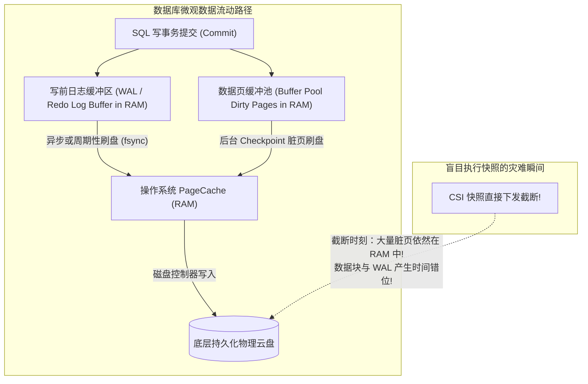
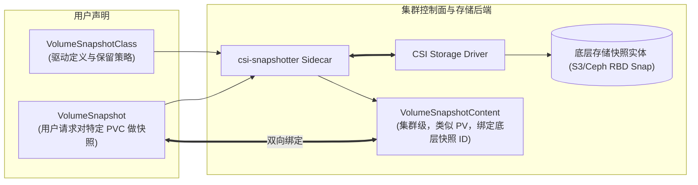
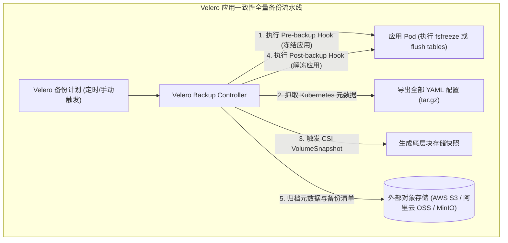

**TL;DR：** 许多团队将 Kubernetes 存储的“备份”简单理解为每天定时执行一次底层云盘快照。然而在真实的故障灾难恢复中，他们往往震惊地发现：**利用快照拉起的新 Pod 无法启动，PostgreSQL 报错 `WAL segment corrupted`，或者 MySQL 提示 `InnoDB: Database page corruption`**。本文深度剖析 Kubernetes 标准 **VolumeSnapshot CRD 架构**与 `csi-snapshotter` 的底层交互，详解写时复制（Copy-on-Write）指针快照与全量备份的本质区别；深入揭露**文件系统级崩溃一致性（Crash Consistency）**与**数据库应用级事务一致性（Application Consistency）**的鸿沟，并给出结合 **Velero** 与前后置生命周期钩子（Pre/Post Hooks）的工业级全自动容灾架构。

---

## 一、 致命幻觉：为什么“云盘快照”不等于“安全备份”？

在现代数据库（如 MySQL InnoDB、PostgreSQL、RocksDB）的微观运行机制中，为了保证极致的写性能，大量的事务数据处于**动态内存态**：



### 1.1 崩溃一致性 vs 应用一致性

1. **底层物理快照的局限（Crash Consistency，崩溃一致性）**：
   - CSI 驱动调用的底层快照（如 AWS EBS Snapshot 或 Ceph RBD Snapshot），其物理语义相当于**“在某一时刻突然直接拔掉服务器电源”**；
   - 物理磁盘上的数据虽然处于一个固定的时间点，但由于**大量的未提交事务、脏数据页依然残留在宿主机的内存 PageCache 和数据库进程的缓冲池（Buffer Pool）中**；
   - 恢复该快照拉起数据库时，数据库必须依赖 Crash Recovery 机制去重放 Redo Log。如果恰好遇到断页写（Torn Page Write）或 WAL 日志损坏，整个数据库将**直接宣告报废**。
2. **应用一致性（Application Consistency，事务一致性）**：
   - 在触发存储快照的**前一微秒**，通知数据库暂停写入、强制将内存中的全量脏页与 WAL 刷新（Flush/Fsync）至磁盘，并对表结构施加短暂读取锁；
   - 待底层存储瞬间建立快照指针后，**立即解除数据库锁定，恢复在线写入**。
   - 唯有这样生成的快照，才能在恢复时做到**数据零丢失、数据库秒级拉起无需痛苦的故障恢复校验**。

---

## 二、 Kubernetes VolumeSnapshot 核心 API 规范

从 Kubernetes 1.20 起，卷快照功能全面 GA，引入了三个核心 CRD：



- **`VolumeSnapshotClass`**：类似于 `StorageClass`，定义底层调用哪个 CSI 驱动（`driver: ebs.csi.aws.com`）以及快照的删除保留策略（`deletionPolicy: Retain` 或 `Delete`）；
- **`VolumeSnapshot`**：类似于 `PVC`，用户命名空间作用域的对象，声明对名为 `data-mysql-0` 的 PVC 执行一次快照；
- **`VolumeSnapshotContent`**：类似于 `PV`，集群作用域的全局资源，记录底层存储系统返回的物理快照唯一句柄（如 `snap-0123456789abcdef0`）。

### 2.1 从快照反向还原新 PVC

一旦快照就绪（`readyToUse: true`），开发者可以极其简单地声明一个新 PVC，直接以该快照作为数据源（`dataSource`）：

```yaml
apiVersion: v1
kind: PersistentVolumeClaim
metadata:
  name: restored-mysql-data-pvc
spec:
  storageClassName: fast-gp3
  # 关键点：声明基于快照极速克隆
  dataSource:
    name: mysql-hourly-snapshot
    kind: VolumeSnapshot
    apiGroup: snapshot.storage.k8s.io
  accessModes:
    - ReadWriteOnce
  resources:
    requests:
      storage: 100Gi # 允许容量大于等于原快照大小 (自动触发文件系统在线扩容)
```

---

## 三、 企业级整站容灾系统：基于 Velero 的架构落地

单独的 `VolumeSnapshot` 只能保护存储卷本身，但一个微服务或有状态应用还由大量的 **Deployment、StatefulSet、Service、ConfigMap、Secret、RBAC** 等 Kubernetes 元数据构成。如果只备份了磁盘而丢失了元数据，依然无法跨集群拉起服务。

**Velero** 是 CNCF 事实上的企业级 Kubernetes 灾备标准：



### 3.1 跨集群容灾恢复（Cross-Cluster Disaster Recovery）

当机房 A 遭遇毁灭性硬件灾难时，容灾恢复流程极为优雅：
1. 在备用机房 B 搭建一个干净的 Kubernetes 集群；
2. 安装配置 Velero，使其连接同一个远端 S3 存储桶；
3. 执行 `velero restore create --from-backup production-backup-20261203`；
4. Velero 自动从 S3 拉取元数据并在新集群重建全部 Secret/ConfigMap/Service，同时由备用机房的 CSI 驱动根据快照句柄瞬间拉起全新的 PV 存储卷，**RTO（恢复时间目标）被压缩到数分钟级**。

---

## 四、 生产实战：MySQL 应用一致性备份完整配置

以下为一个生产级声明，展示如何配置 Velero 钩子实现对高并发 MySQL 的安全事务级冻结快照：

```yaml
apiVersion: velero.io/v1
kind: Backup
metadata:
  name: mysql-consistent-backup
  namespace: velero
spec:
  includedNamespaces:
    - production-databases
  # 包含所有相关的持久卷
  snapshotVolumes: true
  storageLocation: s3-disaster-recovery-backup
  # 核心点：执行应用一致性钩子
  hooks:
    resources:
      - name: mysql-quiesce-hook
        includedNamespaces:
          - production-databases
        labelSelector:
          matchLabels:
            app.kubernetes.io/name: mysql
        pre:
          - exec:
              container: mysql
              command:
                - /bin/sh
                - -c
                # 刷新所有表脏页并施加全局读锁，保存 binlog 点位
                - mysql -u root -p$MYSQL_ROOT_PASSWORD -e "FLUSH TABLES WITH READ LOCK; FLUSH LOGS;"
              onError: Fail
              timeout: 10s
        post:
          - exec:
              container: mysql
              command:
                - /bin/sh
                - -c
                # 快照指针打上后，瞬间解锁，恢复线上业务写入
                - mysql -u root -p$MYSQL_ROOT_PASSWORD -e "UNLOCK TABLES;"
              onError: Abort
              timeout: 10s
```

---

## 结论与演进思考

容灾备份是云原生存储生命周期的终极护城河：
- **`VolumeSnapshot` 标准 API** 将千差万别的存储硬件底座抽象为统一的声明式规范；
- **破除崩溃一致性迷信**，引入预处理与后处理 Hook 刷脏锁定，守住了核心数据库资产的事务确定性；
- **Velero 编排流水线** 实现了元数据与数据卷的联合归档，完成了跨地域、跨集群秒级拉起的工业闭环。

然而，在面对现代复杂的生产级关系型数据库（如 PostgreSQL、MySQL）时，仅仅做每日快照依然是不够的：**快照只能防灾，无法解决日常的主备同步复制、读写分离、连接池优化以及最关键的——在主节点突发硬件宕机时，如何实现秒级自动无脑裂故障转移（Failover）？**

在下一篇（完结篇）中，我们将彻底攻坚云原生存储的最顶峰，深度拆解 **数据库容器化终局：CloudNative-PG 架构内核、WAL 物理隔离与无脑裂自动容灾实战**。
