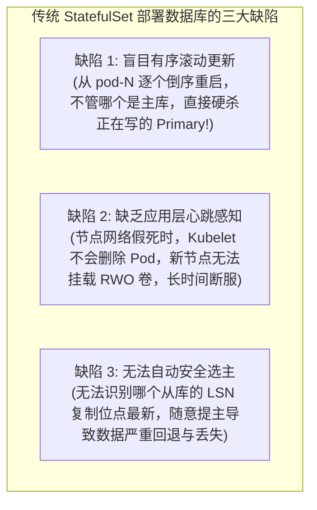
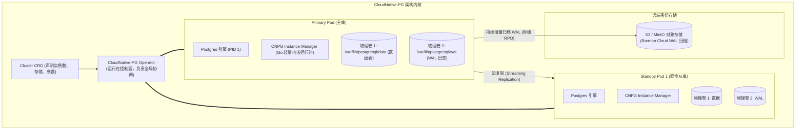
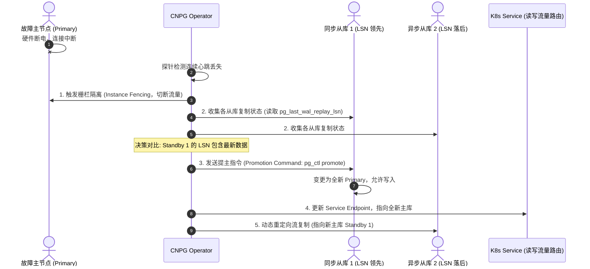
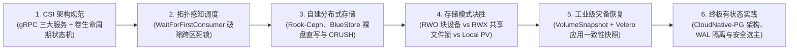

**TL;DR：** 曾几何时，在 Kubernetes 上运行核心关系型数据库（如 PostgreSQL、MySQL）被资深 DBA 视作大忌。早期的方案简单地套用原生 `StatefulSet` 配一个 Headless Service，一旦主节点所在物理机网络抖动或发生节点驱逐，系统极易引发致命的**脑裂双写（Split-Brain Double Writes）**或持久化存储强制挂起。**CloudNative-PG（CNPG）** 的出现彻底终结了这一争议，成为了将关键业务数据库搬上云原生的事实标准。本文系统拆解 CloudNative-PG 的卓越架构设计——从摒弃第三方外挂高可用组件（如 Patroni/Consul）全面拥抱原生 Kubernetes API 选主，到**WAL 预写日志与数据表的物理磁盘独立隔离**，全景解构基于云对象存储的持续归档（WAL Archiving）、零数据丢失自动提主与零停机滚动升级机制。

---

## 一、 为什么传统的 StatefulSet 无法驾驭核心数据库？

许多人试图直接用 Kubernetes 的 `StatefulSet` 部署 PostgreSQL，然而在生产压测中屡遭重创：



关系型数据库是**具有极其严苛应用层拓扑拓扑约束（Primary-Standby Topology）与日志序列号（LSN, Log Sequence Number）先后次序的强状态系统**。必须由专门的数据库 Operator 接管其全生命周期。

---

## 二、 CloudNative-PG 的架构革命：无额外守护进程（No-Daemon Architecture）

在早期的开源数据库 Operator 中，常见的做法是在容器内同时运行 Patroni、etcd、Consul 等复杂的外部仲裁组件。这造成了一个“在 Kubernetes 分布式共识之上再嵌套一套分布式共识系统”的臃肿怪胎。

**CloudNative-PG（CNPG）** 采取了纯粹的**云原生极简哲学**：



### 2.1 核心突破点

1. **零外部依赖（No Patroni / No Etcd）**：
   直接利用 Kubernetes 原生的 `client-go`、`Lease` 选主与 `Status` 子资源作为分布式共识状态机，消除了由于跨系统网络抖动引发的误判；
2. **轻量 Instance Manager 替代 Bash 脚本**：
   每个 Pod 的启动入口是一个纯 Go 编写的极简 `instance-manager`，它直接派生并托管 `postgres` 进程，提供精确的信号管理、存活探针（Liveness Probe）与优雅关闭；
3. **不可变容器镜像**：
   完全使用官方的标准 PostgreSQL 镜像，无需任何定制化的编译入侵。

---

## 三、 性能与稳定性基石：WAL 日志与数据卷的物理隔离

在关系型数据库中，**写前日志（Write-Ahead Logging, WAL）** 与 **数据表空间（Data Tablespace）** 的 I/O 特征存在根本性的物理冲突：
- **WAL 写入特征**：频繁的、强同步的、阻塞性的**顺序小块追加写（Sequential Append + fsync）**；
- **数据表写入特征**：后台异步执行的、随机的、批量的数据块刷脏（Random Page Flush）。

如果将 WAL 和数据存放在同一个挂载点（同一个物理 PV / 云盘）：
当后台 Checkpoint 触发大量数据页落盘时，会瞬间打满该云盘的 IOPS 上限，导致前台的 WAL `fsync` 发生严重排队，**整个数据库的事务提交延迟（Commit Latency）会从 1 毫秒暴增至几百毫秒，引发大面积应用超时**。

### 3.1 CNPG 的双卷物理隔离配置（`walStorage` + `storage`）

```yaml
spec:
  instances: 3
  # 数据表存储卷 (重视容量与综合吞吐)
  storage:
    size: 500Gi
    storageClass: gp3-standard
  # 关键设计：专为 WAL 分配独立的高性能物理卷
  walStorage:
    size: 100Gi
    storageClass: gp3-extreme-iops # 独占专用云盘，提供极低延时的 fsync 保障
```

通过这一物理隔离，即使数据库正在执行数十 GB 的数据导入或全表重构，WAL 的落盘通道依然畅通无阻，保证了严苛 SLA 下的低延时事务响应。

---

## 四、 零数据丢失自动容灾（Failover）与防脑裂状态机

当 Primary 节点突然断电或被 Kubelet 误杀时，CloudNative-PG 的容灾状态机如何在秒级实现安全切换？



### 4.1 零数据丢失的三重保障

1. **实例隔离栅栏（Fencing）**：在确认原主库失联后，Operator 首先修改其标签与路由，切断任何尝试发往该节点的连接，防止其在网络半开（Half-Open）状态下接收写请求；
2. **基于 LSN 的精准提主**：Operator 依次比对所有活跃从库的最新回放位点（`pg_last_wal_replay_lsn()`），**严格确保只提升那个持有最新事务记录的从库为主库**，杜绝任何历史数据回滚；
3. **与对象存储的持续归档协同（Barman Cloud）**：
   即便整个数据中心三副本同时瞬间损毁，CNPG 集成的 `Barman Cloud` 会在事务提交时以流式方式将 WAL 切片推向高可用的 S3 对象存储（RPO 通常小于 1 秒），支持秒级 Point-in-Time Recovery（PITR，时间点还原到任意历史微秒）。

---

## 五、 全系列总结与云原生存储全景图谱

通过本系列的六篇深度剖析，我们完成了从底层接口标准到高阶分布式数据库有状态实战的系统闭环：



| 架构分层 | 核心技术方案 | 攻克的生产核心痛点 |
| :--- | :--- | :--- |
| **标准解耦层** | **CSI 规范 + Sidecars** | 剥离 In-Tree 历史包袱，解耦存储驱动与 K8s 核心发版 |
| **多区调度层** | **WaitForFirstConsumer** | 以算力定存储，终结多可用区 VolumeNodeAffinityConflict 死锁 |
| **存储底座层** | **Rook-Ceph + BlueStore** | 绕过 Linux PageCache 双写惩罚，CRUSH 算法实现去中心化寻址 |
| **场景选型层** | **RWO vs RWX vs Local PV** | 识破分布式文件系统锁竞争陷阱，针对性压榨百万 NVMe IOPS |
| **数据防灾层** | **VolumeSnapshot + Velero** | 突破崩溃一致性局限，利用 Pre/Post Hook 确保真实事务可恢复性 |
| **应用落地层** | **CloudNative-PG 架构** | 摒弃多层共识嵌套，WAL 物理隔离保障金融级数据库高可用 |

---

## 结论与全系列终篇寄语

从无状态微服务走向以数据库为代表的核心有状态系统，是企业云原生基础设施演进的最艰难一步，也是最具商业价值的一步。

**存储不是孤立的磁盘，而是数据流动、计算拓扑、故障域与状态收敛算法的宏观交响**。唯有建立起从底层物理接口、网络协议到上层一致性状态机的立体化认知，我们才能在风云变幻的云原生时代，真正筑造起坚如磐石、永不宕机的数据底座。
