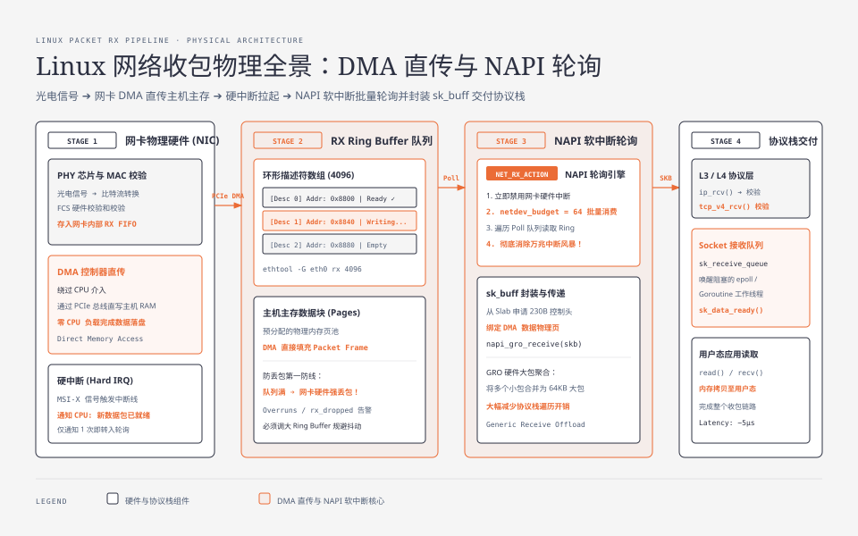
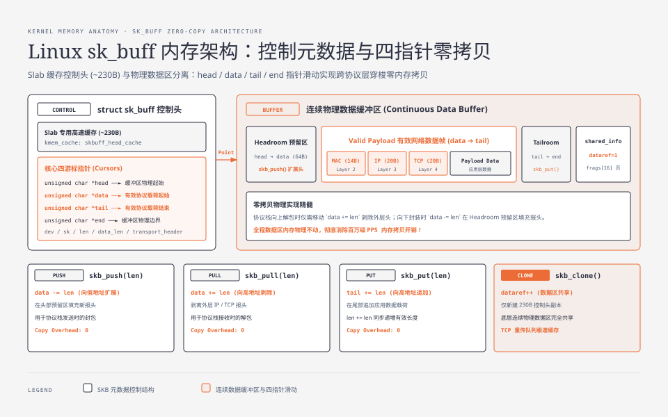
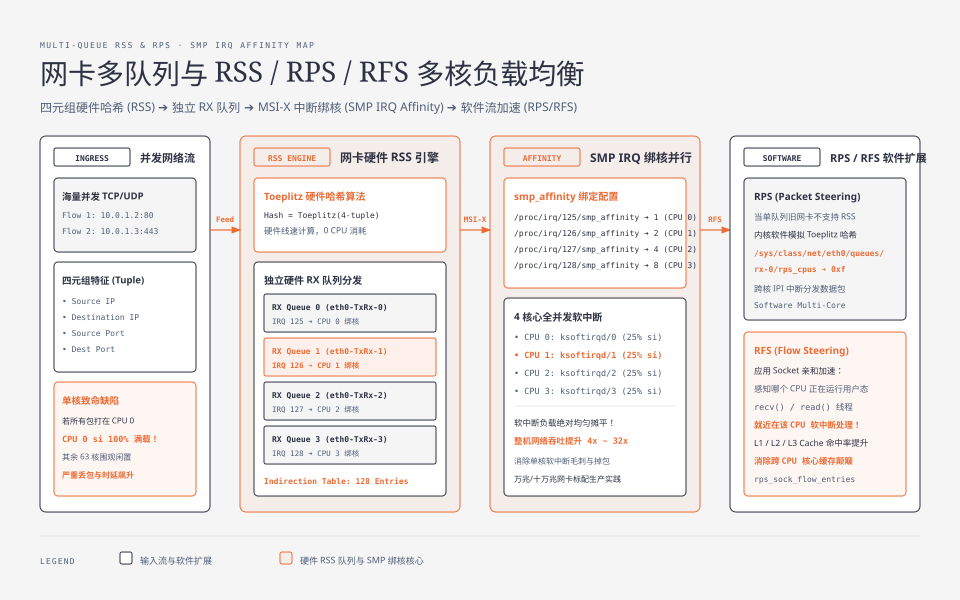

**TL;DR：** Linux 网络数据包从网卡物理芯片进入用户态应用的整个物理历程，本质是**一次基于硬件 DMA、环形描述符队列（Ring Buffer）与中断-轮询自适应状态机（NAPI）的高效流水线协作**。网卡通过直接内存访问（DMA）将数据包帧直接写入主存，通过硬中断触发 CPU 后迅速转入 **NAPI 软中断轮询（SoftIRQ `net_rx_action`）**，批量将数据封装为内核核心数据结构 **`sk_buff`（SKB）**。SKB 巧妙地将控制元数据（约 230B）与连续数据缓冲区进行解耦，通过 `skb_push` / `skb_pull` 四指针移动实现跨 L2/L3/L4 协议栈的**绝对零内存拷贝**；而在万兆/十万兆高并发场景下，Ring Buffer 溢出、CPU 软中断不均衡与协议栈单核瓶颈则是引发掉包与延迟抖动的头号物理根因。

---

## 一、 网络收包全景：从物理电信号到 Socket 缓冲区

在现代 Linux 服务器中，一个以太网数据帧从光纤/网线到达应用层 `socket.read()`，经历以下四个核心物理阶段：



### 1.1 阶段一：网卡物理硬件与 DMA 内存直传

1. **PHY 芯片与 MAC 层接收**：物理网卡上的 PHY 芯片将网线中的模拟光电信号转换为数字比特流，MAC 控制器校验以太网 FCS（帧校验序列），丢弃畸变损坏帧；
2. **DMA 控制器传输**：网卡内部的 DMA（Direct Memory Access）引擎根据驱动预先配置在主机 RAM 中的 **RX Ring Buffer（接收环形缓冲区）** 地址，直接将网络帧通过 PCIe 总线写入主机主内存；
3. **硬件中断（Hard IRQ）**：DMA 写入完成后，网卡向 CPU 发送硬件中断信号（MSI-X / MSI 中断），通知内核“RX 环形队列中已有新数据到达”。

---

## 二、 NAPI 机制：打破传统中断风暴的物理自适应

在早期的 Linux 内核（Linux 2.4 之前）中，网络收包采用纯硬件中断驱动模型：**每到达一个数据包就触发一次 CPU 硬件中断**。
- 在百兆网络时代（约 10 万 PPS），CPU 尚可承受；
- 但在万兆网络（10Gbps，包转发率高达 1488 万 PPS）下，如果每包中断一次，CPU 将在 1 秒内响应 1400 万次硬件中断，内核将 100% 陷入中断处理上下文切换与寄存器现场保存的**中断风暴（Interrupt Storm）**中，导致系统彻底瘫痪死锁！

为了解决这一物理死局，Linux 引入了 **NAPI（New API）机制**：

```
[ 网卡收到第 1 个包 ] ──► 触发 1 次硬中断 ──► CPU 执行硬中断处理函数
                                                │
                                    ┌───────────┴───────────┐
                                    ▼                       ▼
                            [ 立即关闭该网卡硬中断 ]   [ 触发 NET_RX_SOFTIRQ 软中断 ]
                                                            │
                                                            ▼
                                                [ ksoftirqd 线程批量轮询 ]
                                                net_rx_action(budget=64)
                                                从 RX Ring Buffer 连续消费 64 个包
                                                            │
                                           ┌────────────────┴────────────────┐
                                           ▼                                 ▼
                                  [ Ring 中还有剩余数据 ]           [ Ring 已被排空 ]
                                           │                                 │
                                   继续下一轮 SoftIRQ 轮询           [ 重新开启网卡硬件中断 ]
```

### 2.1 NAPI 的核心设计精髓

1. **中断引路，轮询干活**：仅用第 1 个包触发硬中断拉起软中断线程，随后**立即禁用网卡硬件中断**；
2. **预算制批量消费（Budgeting）**：内核软中断函数 `net_rx_action()` 在每个 CPU 周期内只连续轮询处理固定数量的数据包（由内核参数 `net.core.netdev_budget` 控制，默认 64 或 300），防止网络软中断饿死机器上的其他用户态应用线程；
3. **动态自适应切换**：
   - **低负载时**：数据包稀疏，每次处理完自动重开硬中断，保证极低时延响应；
   - **高负载时**：数据包源源不断，NAPI 保持禁用硬中断状态，以极高的单核吞吐批量轮询消费！

---

## 三、 RX / TX Ring Buffer 环形缓冲区与防丢包调优

Ring Buffer 并不是真实存储数据包内容的内存池，而是**一组指向物理内存块（Page / sk_buff 数据区）的描述符指针数组（Descriptor Array）**。

### 3.1 环形描述符工作机理

- 网卡驱动在初始化时，向内核申请一块连续物理内存作为环形数组（例如包含 4096 个 `struct rx_desc`）；
- 每个描述符包含一个 64 位的物理地址指针（DMA Buffer Address）和标志位（Ready / Done）；
- 网卡硬件维护一个写指针，内核驱动维护一个读指针，构成典型的单生产者单消费者环形队列。

### 3.2 真实生产丢包排查与软中断状态机监控

当高并发突发流量涌入时，若 CPU 软中断处理速度跟不上网卡 DMA 灌入速度，Ring Buffer 会在几毫秒内被完全填满。此时新到达的数据包将被网卡硬件直接丢弃（**Overruns / RX Drop**）！

```bash
# 1. 检查当前网卡 Ring Buffer 配置与硬件物理上限
$ ethtool -g eth0
Ring parameters for eth0:
Pre-set maximums:
RX:     4096
TX:     4096
Current hardware settings:
RX:     512    <-- 很多默认配置只有 512，极易在高并发下丢包！
TX:     512

# 2. 将 Ring Buffer 扩大到硬件物理极限 (4096)
$ sudo ethtool -G eth0 rx 4096 tx 4096

# 3. 监控 Linux 软中断健康状态：/proc/net/softnet_stat
# 每一行代表一个 CPU 核心，十六进制输出：
# - 第 1 列 (total_packets)：该 CPU 累计处理的数据包总数
# - 第 2 列 (squeezed_events)：软中断预算用尽被迫让出 CPU 的次数 (若持续增长说明 netdev_budget 过小)
# - 第 3 列 (dropped_packets)：因 netdev_max_backlog 队列已满而被丢弃的包数 (必须严格为 0！)
$ awk '{printf "CPU%d: processed=%d squeezed=%d dropped=%d\n", NR-1, strtonum("0x"$1), strtonum("0x"$2), strtonum("0x"$3)}' /proc/net/softnet_stat
CPU0: processed=24901840 squeezed=4120 dropped=0
CPU1: processed=25184021 squeezed=3980 dropped=0

# 4. 调优软中断轮询预算与待处理队列深度
$ sudo sysctl -w net.core.netdev_max_backlog=10000
$ sudo sysctl -w net.core.netdev_budget=600
$ sudo sysctl -w net.core.netdev_budget_usecs=4000
```

---

## 四、 `sk_buff` 内存架构：控制元数据与数据区分离

在 NAPI 软中断轮询中，网卡驱动会将从 Ring Buffer 取出的原始数据帧封装为 Linux 网络子系统最核心的数据结构：**`struct sk_buff`（常称为 SKB）**。



### 4.1 SKB 双重内存布局

为了在支持复杂网络协议栈的同时杜绝内存拷贝，Linux 将 SKB 严格拆分为两个独立的内存区域：

1. **SKB 控制头（Control Buffer）**：从内核专用的 `skbuff_head_cache` Slab 缓存池中分配，大小约 230 字节，包含链表指针（`next/prev`）、关联设备（`dev`）、关联 Socket（`sk`）以及核心的四个游标指针：
   - `head`：物理分配的数据缓冲区的内存起始绝对地址；
   - `data`：当前有效网络协议载荷的起始地址；
   - `tail`：当前有效载荷的结束地址；
   - `end`：物理数据缓冲区的结束边界绝对地址。
2. **数据缓冲区（Data Buffer）**：连续的物理内存页，存放实际的网络帧字节流。

### 4.2 零拷贝协议封装与解封装四剑客

```c
// Linux 内核 SKB 核心操作函数 (include/linux/skbuff.h)

// 1. skb_push(): 在头部预留区扩展空间 (用于下层协议封装)
// data 指针向低地址移动 len 字节，完全零内存拷贝！
static inline unsigned char *skb_push(struct sk_buff *skb, unsigned int len) {
    skb->data -= len;
    skb->len  += len;
    return skb->data;
}

// 2. skb_pull(): 剥离外层协议头 (用于向上层协议交付)
// data 指针向高地址移动 len 字节，跳过 IP/TCP 头
static inline unsigned char *skb_pull(struct sk_buff *skb, unsigned int len) {
    skb->len  -= len;
    return skb->data += len;
}

// 3. skb_put(): 在尾部追加载荷数据 (tail 指针向高地址移动)
static inline unsigned char *skb_put(struct sk_buff *skb, unsigned int len) {
    unsigned char *tmp = skb_tail_pointer(skb);
    skb->tail += len;
    skb->len  += len;
    return tmp;
}

// 4. skb_clone(): 零拷贝克隆
// 仅重新分配一个 230B 的 sk_buff 元数据头，共享同一个底层数据区，数据区引用计数 dataref++
struct sk_buff *skb_clone(struct sk_buff *skb, gfp_t gfp_mask);
```

---

## 五、 网卡多队列与 RSS / RPS / RFS 多核负载均衡

在多核 CPU 服务器上，如果所有网卡中断都打在 CPU 0 上，CPU 0 的软中断使用率（`si`）将迅速飙到 100%，成为整机网络的严重单核瓶颈。



### 5.1 硬件多队列与 RSS（Receive Side Scaling）

现代万兆网卡支持硬件多队列（如 16 或 32 个独立的 RX/TX 队列）：
- 网卡硬件解析网络帧的四元组（源 IP、源端口、目的 IP、目的端口），通过 Toeplitz 哈希算法计算出一个 Hash 值；
- 根据 Hash 值将网络帧均匀分发到不同的物理 RX 队列中；
- 每个 RX 队列绑定到独立的 CPU 核心（通过 MSI-X 独立中断号与 SMP IRQ Affinity），实现**纯硬件级的中断多核并行负载均衡**！

```bash
# 查看网卡硬件多队列与绑核中断
$ cat /proc/interrupts | grep eth0
 125:  142039402          0          0          0   PCI-MSI-Edge  eth0-TxRx-0
 126:          0  139402941          0          0   PCI-MSI-Edge  eth0-TxRx-1
 127:          0          0  145029301          0   PCI-MSI-Edge  eth0-TxRx-2
 128:          0          0          0  141094022   PCI-MSI-Edge  eth0-TxRx-3
```

---

## 六、 总结与物理认知升级

Linux 网络收发包路径绝非黑盒，它是一套精妙平衡了硬件特性与操作系统抽象的工业艺术品：

1. **硬件层**：DMA 直传 + Ring Buffer 环形队列消除了 CPU 参与字节搬运的开销；
2. **调度层**：NAPI 机制以自适应软中断轮询彻底化解了万兆网络的中断风暴；
3. **数据层**：`sk_buff` 游标指针体系实现了协议栈内穿梭的纯指针零拷贝；
4. **多核层**：RSS / RPS 硬件多队列将海量并发包均匀摊平到数十个 CPU 核心。

然而，无论 `sk_buff` 如何优化，它终究需要经历内核分配、锁操作与多层协议栈穿透。在下一篇中，我们将进入现代 Linux 内核最火热的性能利刃：**深入 eBPF 虚拟机内核：字节码指令集、Verifier 静态安全性验证与 JIT 编译**。
