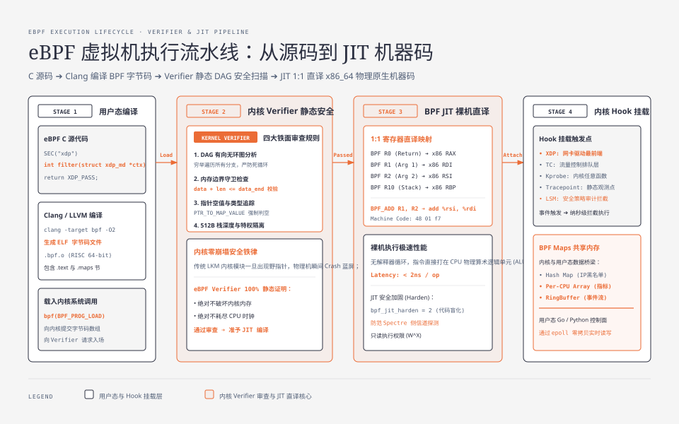
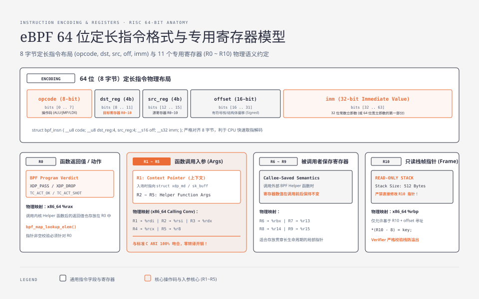
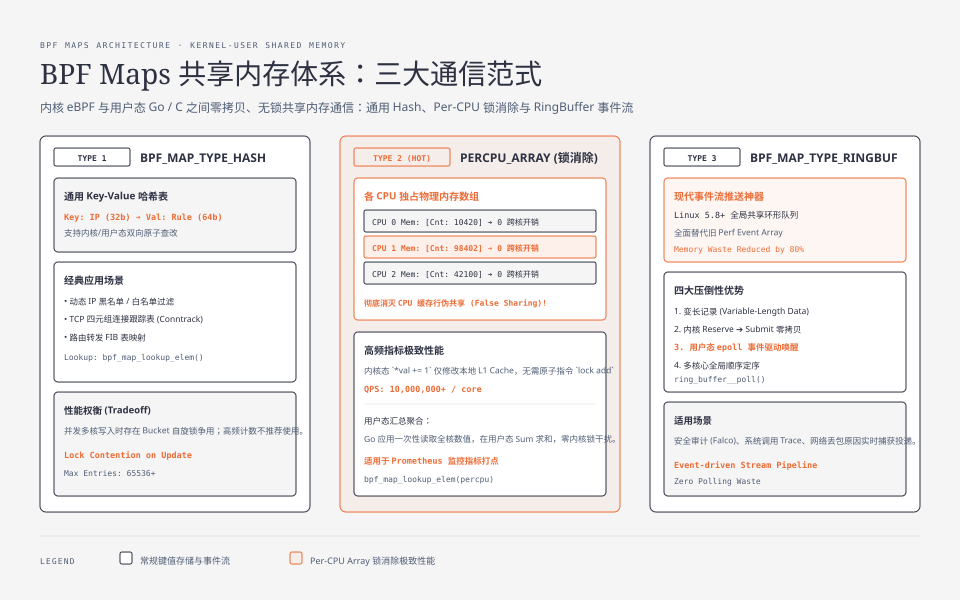

**TL;DR：** eBPF（Extended Berkeley Packet Filter）的物理本质是**驻留在 Linux 内核空间内的一个基于寄存器的 64 位精简指令集（RISC）虚拟机**。它允许开发者在无需修改内核源码、无需重新编译内核、无需插入内核模块（LKM）的前提下，向内核 Hook 点注入自定义逻辑。eBPF 安全性的终极防线是 **Verifier（静态验证器）**：通过构建程序的有向无环图（DAG），穷举遍历所有可能的执行路径，静态证明程序绝对不包含死循环、内存越界访问与未初始化指针；通过验证后，**JIT（即时编译器）将其 1:1 直译为物理 CPU 原生机器码**，并依托 **BPF Maps（如 BPF RingBuf）** 与用户态应用实现零拷贝、纳秒级的双向共享内存通信。

---

## 一、 为什么 eBPF 彻底重塑了 Linux 内核编程？

在 eBPF 普及之前，向 Linux 内核添加新功能或进行深度可观测性监控只有两条路：
1. **修改内核源码并提交社区**：从提出 RFC 到合并进入各大发行版主线，耗时长达 3~5 年；
2. **编写内核模块（LKM - Loadable Kernel Module）**：虽然可以动态加载，但内核模块运行在特权环 0（Ring 0）。一旦模块中存在空指针解引用或数组越界，将直接触发 **Kernel Panic**，导致整台物理服务器瞬间宕机蓝屏！



eBPF 的革命性在于：**它在内核特权空间内开辟了一个具备严格安全边界的“沙箱执行环境”**。无论是网络过滤（XDP/Cilium）、性能剖析（BCC/bpftrace）、还是安全审计（Falco），都能以接近裸机速度安全无虞地在内核中狂飙。

---

## 二、 eBPF 虚拟机体系架构与 64 位寄存器模型

eBPF 是一个高度精简、与现代 64 位硬件架构（x86_64 / AArch64）1:1 对应的寄存器型虚拟机。

### 2.1 11 个专用硬件级寄存器（R0 ~ R10）

| 寄存器 | 角色与物理语义 | 调用约定规则（Calling Convention） |
| :--- | :--- | :--- |
| **`R0`** | **函数返回值** / 退出码 | 存放 BPF 程序的返回状态（如 XDP 动作码 `XDP_DROP`）或辅助函数返回值 |
| **`R1 ~ R5`** | **函数调用入参**（Arguments） | 传递给 BPF Helper 辅助函数的参数；程序入口时 `R1` 指向上下文结构体（如 `xdp_md`） |
| **`R6 ~ R9`** | **被调用者保存寄存器**（Callee-saved） | 在调用外部辅助函数时，寄存器值保持不变 |
| **`R10`** | **只读栈帧指针**（Stack Frame Pointer） | 指向 eBPF 专属的 512 字节受保护栈内存空间（只读，严禁修改其指针值） |

### 2.2 64 位定长指令格式（Instruction Encoding）

每一条 eBPF 字节码指令均严格由 8 个字节（64-bit）组成：


- `opcode`：操作码（如加法、内存加载 `LDX`、分支跳转 `JEQ`）；
- `dst_reg` / `src_reg`：目标寄存器与源寄存器编号（各占 4 位，正好表示 0~10）；
- `offset`：16 位有符号偏移量（用于栈寻址或结构体字段偏移）；
- `imm`：32 位立即数常数。

---

## 三、 Verifier（静态验证器）：内核安全的铁面判官

任何 eBPF 程序在注入内核之前，必须通过 `bpf(BPF_PROG_LOAD)` 系统调用将字节码提交给内核 **Verifier**。如果 Verifier 发现任何一点安全隐患，程序将被断然拒绝加载并报错 `-EACCES`。

### 3.1 Verifier 的四大核心验证机制

1. **DAG 有向无环图分析（Control Flow Graph）**：
   - 检查程序的所有分支跳转指令，确保代码是一个有向无环图（DAG）；
   - **严防无限死循环**：在早期内核中绝对禁止循环；在现代内核（Linux 5.3+）中允许有限的 bounded loop，但 Verifier 会静态展开并计算最大执行步数（指令上限默认 100 万条），防止恶意程序耗尽 CPU；
2. **内存访问边界规约（Memory Access Checks）**：
   - 当读取网络包载荷时，必须显式编写边界守卫代码：
     ```c
     void *data = (void *)(long)ctx->data;
     void *data_end = (void *)(long)ctx->data_end;
     
     // 必须显式有这行判断，否则 Verifier 直接报错拒绝！
     if (data + sizeof(struct ethhdr) > data_end)
         return XDP_DROP;
     ```
3. **未初始化变量与空指针追踪**：
   - Verifier 追踪每个寄存器的“类型状态”（Type Tracking，如标记为 `PTR_TO_STACK`、`PTR_TO_MAP_VALUE_OR_NULL`）；
   - 从 Map 查询出来的指针必须显式判空（`if (!ptr) return 0;`），否则 Verifier 判定为存在解引用空指针风险，拒绝加载；
4. **特权访问隔离**：
   - 限制非特权用户调用敏感的 BPF Helper 函数（如不能直接修改内核内存）。

---

## 四、 JIT 编译：从字节码到裸机原生机器码

在 Verifier 安全盖章之后，内核中的 **BPF JIT（Just-In-Time）编译器**被触发：

```
[ eBPF 字节码指令: BPF_ALU64_REG(BPF_ADD, R1, R2) ]
                        │
                        ▼ (JIT 直译)
[ x86_64 原生物理机器码: 48 01 d7  -->  add %rdx, %rdi ]
```

由于 eBPF 的寄存器（R0~R10）与 x86_64（RAX, RDI, RSI, RDX, RCX, R8, RBX, R13, R14, R15, RBP）存在几乎一一对应的映射关系，JIT 编译的过程极其迅速高效，生成的机器码能够直接以 **硬件最高时钟频率全速执行，零虚拟机解释开销！**

```bash
# 在 Linux 中开启全局 eBPF JIT 优化
$ sudo sysctl -w net.core.bpf_jit_enable=1
$ sudo sysctl -w net.core.bpf_jit_harden=2  # 开启 JIT 代码盲化，防御 Spectre 侧信道攻击
```

---

## 五、 BPF Maps：内核态与用户态的无锁通信桥梁

eBPF 程序在内核中运行，用户态应用程序（如 Go、Python 控制面）如何与内核 eBPF 交换数据和监控指标？

答案是 **BPF Maps（键值共享内存体系）**。



### 5.1 常用 BPF Map 类型选型

| Map 类型 | 适用场景 | 物理特性 |
| :--- | :--- | :--- |
| **`BPF_MAP_TYPE_HASH`** | 通用键值存储（如 IP 黑名单过滤、连接跟踪） | 通用 Hash 表，支持内核/用户态原子增删查改 |
| **`BPF_MAP_TYPE_PERCPU_ARRAY`** | 高频指标计数（QPS、字节统计、延迟直方图） | **每个 CPU 独立独占物理内存数组**，彻底消除了多核原子锁争用与 CPU 缓存行伪共享（False Sharing） |
| **`BPF_MAP_TYPE_RINGBUF`** | 事件流推送（如网络包审计、系统调用日志） | **现代推荐**。全局单环形缓冲区，支持用户态 `epoll` 无阻塞事件驱动唤醒与零拷贝读取 |

### 5.2 生产级实战：用 Go 与 C 编写一个统计网络包的 eBPF 程序

#### 1. 内核态 C 代码 (`packet_counter.bpf.c`)

```c
#include <linux/bpf.h>
#include <bpf/bpf_helpers.h>

// 定义一个 Per-CPU Array Map 存放包计数
struct {
    __uint(type, BPF_MAP_TYPE_PERCPU_ARRAY);
    __type(key, __u32);
    __type(value, __u64);
    __uint(max_entries, 1);
} packet_cnt_map SEC(".maps");

// 挂载至 XDP 驱动入口
SEC("xdp")
int count_packets(struct xdp_md *ctx) {
    __u32 key = 0;
    __u64 *val = bpf_map_lookup_elem(&packet_cnt_map, &key);
    if (val) {
        *val += 1; // 极速 Per-CPU 本地自增，零跨核锁！
    }
    return XDP_PASS; // 正常放行网络包
}

char _license[] SEC("license") = "GPL";
```

#### 2. 用户态 Go 代码 (`main.go` - 使用 `cilium/ebpf`)

```go
package main

import (
	"fmt"
	"net"
	"time"

	"github.com/cilium/ebpf"
	"github.com/cilium/ebpf/link"
)

func main() {
	// 1. 加载并验证编译好的 eBPF 字节码
	spec, err := ebpf.LoadCollectionSpec("packet_counter.bpf.o")
	if err != nil {
		panic(err)
	}

	coll, err := ebpf.NewCollection(spec)
	if err != nil {
		panic(err)
	}
	defer coll.Close()

	// 2. 将 XDP 程序挂载到 eth0 网卡
	iface, _ := net.InterfaceByName("eth0")
	l, err := link.AttachXDP(link.XDPOptions{
		Program:   coll.Programs["count_packets"],
		Interface: iface.Index,
	})
	if err != nil {
		panic(err)
	}
	defer l.Close()

	fmt.Println("eBPF XDP Packet Counter loaded successfully on eth0!")

	// 3. 周期性从 BPF Map 读取 Per-CPU 数据并求和
	cntMap := coll.Maps["packet_cnt_map"]
	key := uint32(0)
	var perCPUValues []uint64

	for {
		time.Sleep(1 * time.Second)
		if err := cntMap.Lookup(key, &perCPUValues); err == nil {
			var totalPackets uint64
			for _, v := range perCPUValues {
				totalPackets += v
			}
			fmt.Printf("Total Packets Captured: %d\n", totalPackets)
		}
	}
}
```

---

## 六、 总结与架构演进认知

eBPF 绝不是一个简单的包过滤工具，而是**Linux 操作系统有史以来最伟大的可编程架构跃迁**：

1. **指令层**：64 位精简寄存器模型完美贴合物理 CPU；
2. **安全层**：Verifier 以极其严谨的静态形式化证明筑牢内核防线；
3. **执行层**：JIT 机器码编译让自定义逻辑拥有接近硬件极限的执行性能；
4. **数据层**：BPF Maps 提供了内核态与用户态解耦的无锁共享内存通信基石。

在下一篇中，我们将深入 eBPF 在网络性能领域的王牌杀手锏：**XDP（eXpress Data Path）极速网络旁路：驱动层线速包处理与 Tbps 级性能神话**。
