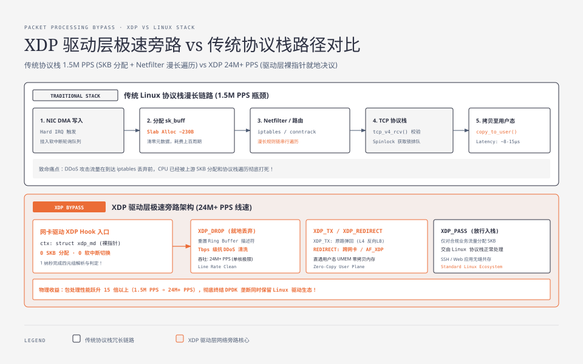
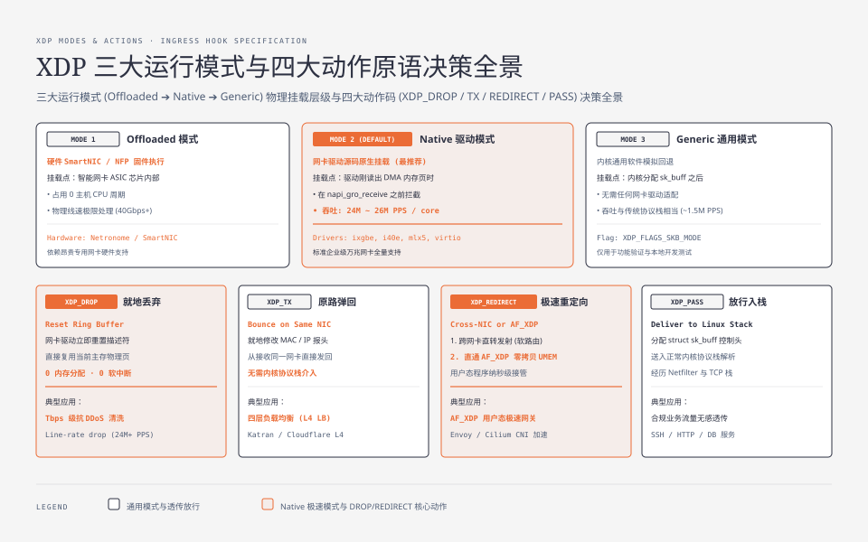
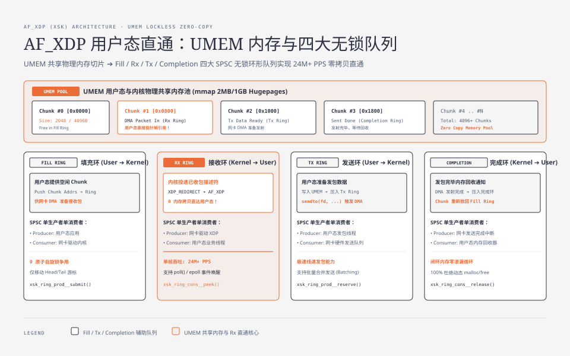

**TL;DR：** 传统 Linux 内核协议栈在面对每秒千万级数据包（10M+ PPS）的高吞吐场景（如 Tbps 级 DDoS 攻击、万兆四层负载均衡）时，由于高频的 `sk_buff` 内存分配、Netfilter 规则链遍历与软中断上下文切换，单核包转发率通常会被死死卡在 **1.5M PPS** 左右。**XDP（eXpress Data Path）** 的物理突破在于：**将 eBPF 程序直接挂载在网卡驱动层（DMA 刚刚写入主存、尚未分配任何 SKB 之前）**，以裸内存指针（`xdp_md`）的形式完成微秒级决策；结合 **AF_XDP（XSK）与用户态 UMEM 零拷贝共享内存架构**，单核包处理能力直接跃升至 **24M+ PPS（提升 15 倍以上）**，在彻底终结专用内核旁路框架（DPDK）垄断的同时，完美保留了 Linux 安全模型与标准驱动生态。

---

## 一、 传统 Linux 网络协议栈的吞吐天花板

在千兆网络时代，数据包传输速率较慢（64 字节小包满载仅 1.48M PPS），操作系统有充足的 CPU 周期为每个包分配完整结构体并遍历协议栈。

而在现代 100GbE / 400GbE 高速数据中心中，64 字节小包的物理到达速率高达 **1.48 亿包/秒（148.8M PPS）**：
- 每个数据包到达的时间间隔仅有 **6.7 纳秒**！
- 哪怕现代 CPU 运行在 3.0GHz 频率，6.7 纳秒仅仅相当于 **20 个 CPU 时钟周期**！



### 1.1 传统协议栈被打爆的三大物理瓶颈

1. **`sk_buff` 内存分配与释放开销**：
   - 每次收包必须从 Slab 缓存池申请 230 字节的 `sk_buff` 结构体，清零指针并填充元数据；
   - 单次分配与垃圾回收开销耗费上百个时钟周期，在 10M PPS 洪流下直接耗尽 CPU；
2. **多层协议栈与 Netfilter 漫长遍历**：
   - 数据包必须串行经过驱动层 $\to$ GRO 聚合 $\to$ `ip_rcv()` $\to$ iptables/conntrack 连接跟踪 $\to$ 路由决策 $\to$ `tcp_v4_rcv()`；
   - 绝大多数 DDoS 攻击流量在到达最后的 iptables 过滤规则之前，CPU 就已经被上游冗长的协议解析消耗殆尽；
3. **软中断调度与锁争用**：
   - 每个包排入 Socket Receive Queue 时都必须获取自旋锁（Spinlock），引发剧烈的多核总线锁争用。

---

## 二、 XDP 架构体系：在物理硬件最近的地方做减法

XDP 的设计哲学极其纯粹：**在网卡 DMA 数据刚落入主存、尚未分配任何 `sk_buff` 之前，以最快速度就地决议！**

### 2.1 XDP 的三种运行模式



1. **Offloaded 模式**：eBPF 字节码被编译并直接下发至智能网卡（SmartNIC / FPGA）芯片内部执行，**占用 0 个主机 CPU 周期**；
2. **Native 模式（最常用）**：网卡驱动源码原生支持 XDP（如 `ixgbe`、`i40e`、`mlx5`、`virtio_net`），在 `napi_gro_receive()` 之前直接拦截原始页帧；
3. **Generic 模式**：无需网卡驱动支持，内核在分配 SKB 后回退执行（性能较低，仅用于调试与非标准硬件）。

---

## 三、 XDP 四大动作原语（Action Codes）

每个挂载在 XDP 上的 eBPF 程序接收一个轻量级的上下文指针 `struct xdp_md *ctx`，其最终必须返回以下四个标准动作码之一：

### 3.1 动作原语深度解析

| 动作码 | 底层物理行为 | 核心应用场景 |
| :--- | :--- | :--- |
| **`XDP_DROP`** | **就地丢弃**：网卡驱动立即重置 Ring Buffer 描述符指针，**0 内存分配、0 软中断**，直接复用该内存页 | **Tbps 级抗 DDoS 攻击清洗**、无状态防火墙 |
| **`XDP_TX`** | **原路弹回**：修改网络包的 MAC/IP 头后，直接从接收该包的同一个网卡原路发回物理光纤 | **四层反向负载均衡（L4 LB）**、高吞吐 ICMP 应答 |
| **`XDP_REDIRECT`** | **极速重定向**：绕过内核栈，直接重定向至其他网卡（跨网卡转发）或 **AF_XDP 套接字（直通用户态）** | **高性能软路由**、用户态极速网络应用 |
| **`XDP_PASS`** | **正常放行**：分配 `sk_buff` 并将其向上交由传统 Linux 内核网络协议栈继续处理 | 正常的 SSH、Web 业务连接、本地监听应用 |

#### XDP 秒级丢弃特定 IP 流量实战（C 语言核心源码）

```c
#include <linux/bpf.h>
#include <linux/if_ether.h>
#include <linux/ip.h>
#include <linux/in.h>
#include <bpf/bpf_helpers.h>

// BPF Map 存放恶意 IP 黑名单
struct {
    __uint(type, BPF_MAP_TYPE_HASH);
    __type(key, __u32);   // IPv4 地址
    __type(value, __u8);  // 标记
    __uint(max_entries, 1000000);
} blacklist_map SEC(".maps");

SEC("xdp")
int xdp_ddos_firewall(struct xdp_md *ctx) {
    void *data = (void *)(long)ctx->data;
    void *data_end = (void *)(long)ctx->data_end;

    // 1. 解析以太网头 (L2)
    struct ethhdr *eth = data;
    if ((void *)(eth + 1) > data_end)
        return XDP_PASS;

    // 仅处理 IPv4 数据包
    if (eth->h_proto != __constant_htons(ETH_P_IP))
        return XDP_PASS;

    // 2. 解析 IP 头 (L3)
    struct iphdr *ip = (void *)(eth + 1);
    if ((void *)(ip + 1) > data_end)
        return XDP_PASS;

    // 3. 查表匹配黑名单
    __u32 src_ip = ip->saddr;
    __u8 *blocked = bpf_map_lookup_elem(&blacklist_map, &src_ip);
    if (blocked) {
        // 核心性能奇迹：1 纳秒就地销毁恶意包！
        return XDP_DROP;
    }

    return XDP_PASS;
}

char _license[] SEC("license") = "GPL";
```

---




## 四、 AF_XDP (XSK)：用户态与网卡直通的零拷贝革命

在 XDP 出现之前，追求极限性能的用户态网络开发几乎被 **DPDK（Data Plane Development Kit）** 垄断。但 DPDK 存在致命代价：
- **独占接管网卡**：必须解绑 Linux 内核网卡驱动，导致所有的 Linux 工具（`tcpdump`、`iptables`、`ethtool`、`ip route`）瞬间失效；
- **全核 100% 轮询（Poll Mode Driver）**：无论是否有流量，CPU 核心始终被 100% 打满，功耗极其恐怖。

Linux 4.18 引入的 **AF_XDP（XDP Sockets）** 终结了 DPDK 的垄断。

### 4.1 UMEM 共享内存与四大无锁队列

AF_XDP 在用户态应用程序与网卡硬件之间构建了一块共享内存区域：**UMEM（User Memory）**。

#### 四大 SPSC（单生产者单消费者）无锁环形队列

1. **Fill Ring（填充队列，用户态 $\to$ 内核）**：用户态向其中放入空闲的 UMEM 内存块地址（Chunk Addresses），供网卡 DMA 写入；
2. **Rx Ring（接收队列，内核 $\to$ 用户态）**：当网卡通过 XDP_REDIRECT 将数据包投递给 AF_XDP 时，内核将已填入数据的 Chunk 索引压入 Rx Ring，用户态应用程序直接指针解引用读取载荷，**零内核-用户态内存拷贝！**
3. **Tx Ring（发送队列，用户态 $\to$ 内核）**：用户态将准备发送的数据写入 UMEM，并将描述符压入 Tx Ring；
4. **Completion Ring（完成队列，内核 $\to$ 用户态）**：网卡 DMA 发送完毕后，内核通知用户态该 UMEM Chunk 可以重新回收复用。

### 4.2 AF_XDP vs DPDK 物理选型矩阵

| 维度 | 传统 DPDK 方案 | 现代 AF_XDP (XSK) 方案 |
| :--- | :--- | :--- |
| **单核吞吐能力** | $\approx 28\text{M PPS}$（极限裸机） | **$\approx 24\text{M ~ 26M PPS}$**（与 DPDK 处于同一物理量级） |
| **Linux 工具链兼容** | **0 兼容**（`tcpdump/iptables` 彻底失效） | **100% 兼容**（可按需选择部分流量进内核栈） |
| **CPU 功耗模型** | 必须全核 100% 盲轮询，电费昂贵 | **支持 `poll() / epoll` 事件驱动挂起**，无包时 0 CPU 占用 |
| **容器与云原生** | 难以在 Kubernetes 中实现标准 CNI 多租户共享 | **Cilium / Envoy 原生集成**，完美适配云原生标准接口 |

---

## 五、 生产架构总结与性能调优清单

要让 XDP 发挥千万级 PPS 的极限性能，请在生产环境中遵循以下优化配置：

1. **绑定网卡多队列与专用 CPU 核心**：确保每个 RX 队列的 XDP 程序在独占的 CPU 核心上运行，避免跨 NUMA 节点访问内存；
2. **关闭网卡 LRO（Large Receive Offload）**：XDP 需要处理未被硬件修改的原始数据帧，开启 LRO 会导致 XDP 驱动加载失败；
3. **开启 JIT 机器码优化**：`sysctl -w net.core.bpf_jit_enable=1` 确保字节码全速运行。

在下一篇中，我们将进入系统级可观测性与排障的最高殿堂：**eBPF 无侵入可观测性实战：Kprobe 动态插桩、Tracepoint 静态埋点与 Off-CPU 溯源**。
