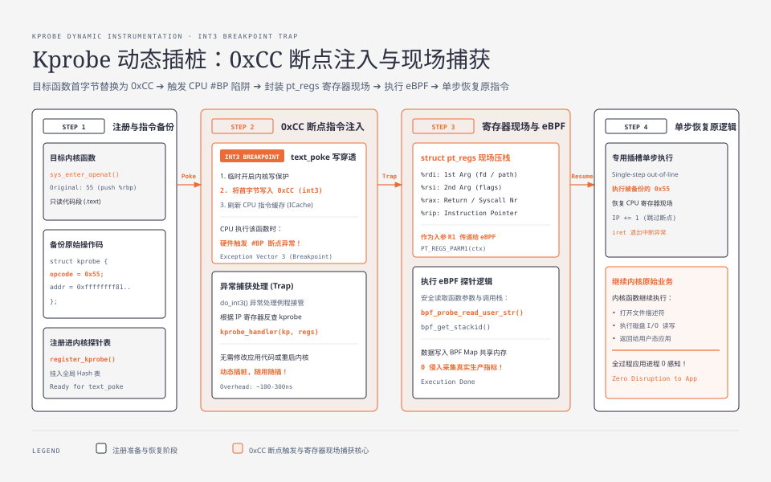
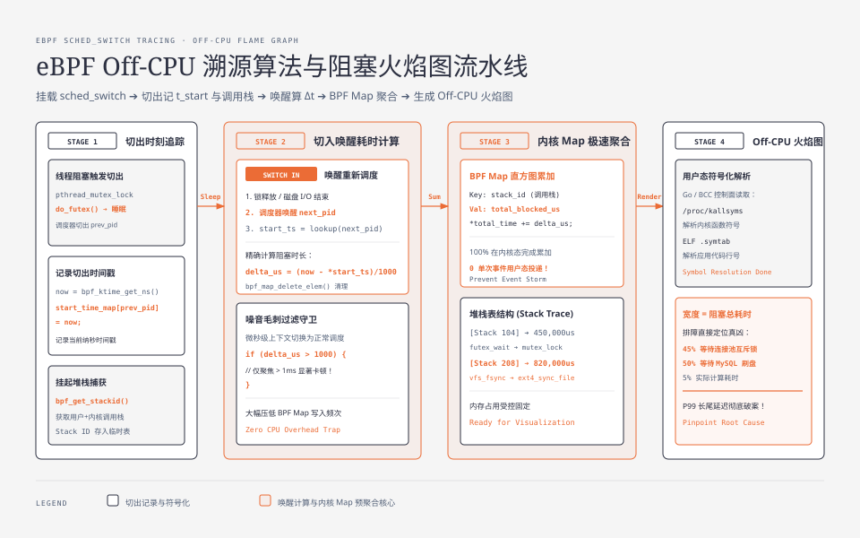

**TL;DR：** 传统 APM 链路追踪依赖代码埋点（SDK）或 Java Agent 字节码重写，对性能有侵入且无法观测内核层面的真实瓶颈。**基于 eBPF 的无侵入可观测性技术**打破了用户态与内核态的边界：**Kprobe/Kretprobe** 通过动态向任意内核函数入口写入 `0xCC`（`int3` 断点指令）捕获 CPU 物理寄存器上下文；**Tracepoint** 在内核编译期预埋静态探针，未激活时仅为单个空操作（NOP 指令，0 开销）。更为关键的是，传统 CPU 火焰图仅能展示“CPU 在忙什么”（On-CPU），无法解释“为什么程序 CPU 很低但响应极慢”；通过 eBPF 挂载内核调度器 **`finish_task_switch` 探针**，可以精准捕获线程因互斥锁争用（futex）、磁盘同步（fsync）或网络等待被切出 CPU 的完整调用栈与纳秒级 **Off-CPU 阻塞区间**，彻底终结长尾延迟盲区。

---

## 一、 为什么传统的性能排查工具在生产中频频失效？

当线上微服务发生 P99 延迟飙升或突发卡顿时，工程师通常会使用以下三板斧：
1. **`top` / `vmstat`**：只能看到机器宏观 CPU 使用率，无法定位到具体是哪个函数被阻塞；
2. **`pstack` / `gdb attach`**：直接暂停正在运行的应用进程，可能导致线上请求发生大规模超时雪崩；
3. **CPU 采样火焰图（`perf record -F 99`）**：**只能抓取正在占用 CPU 运算的函数**！如果一个线程因为等待数据库行锁或磁盘 I/O 挂起了 5 秒钟，它在 CPU 上占用的时间为 0，**CPU 火焰图上将完全看不到任何痕迹**！

为了穿透这种“黑盒盲区”，eBPF 提供了两套直达内核神经末梢的探针技术。

---

## 二、 Kprobe 动态插桩机理：软件断点与上下文捕获

Kprobe（Kernel Probe）允许开发者在**几乎任何内核函数的任意指令位置**动态挂载自定义 eBPF 探针，而无需重新编译内核。



### 2.1 Kprobe 底层物理执行四部曲

1. **注册与指令备份**：内核记录目标函数首地址的原指令字节，并保存至 `struct kprobe` 结构体；
2. **断点指令替换（`text_poke`）**：内核利用写保护覆盖机制，将目标函数首字节替换为 `0xCC`（x86 架构下的 `int3` 软件中断指令）；
3. **触发 CPU 异常与现场压栈**：
   - 当 CPU 执行到该函数时，硬件触发 `#BP`（Breakpoint Exception）陷阱；
   - Linux 中断处理程序立即将当前所有 CPU 物理寄存器状态封装为 `struct pt_regs` 压入内核栈；
   - 将 `pt_regs` 作为入参传递给绑定的 eBPF 字节码程序；
4. **单步恢复（Single-step out-of-line）**：
   - eBPF 逻辑执行完毕后，内核在一段专用的指令插槽中执行被备份的原指令；
   - 恢复寄存器现场，指令指针（IP）跳过断点位置，无感继续向下执行内核原逻辑。

> **Kretprobe 补充：** 用于在**函数返回（Return）时**捕获返回值与耗时。其原理是修改函数的返回地址指针（Trampoline），当函数执行 `ret` 时先跳入 eBPF 处理程序，记录结束时间戳后再跳回真正的调用者。

---

## 三、 Tracepoint 静态探针：零损耗的工业事实标准

虽然 Kprobe 极其灵活，但它依赖断点异常和单步执行，单次触发开销约为 **100~300 纳秒**，且函数入参可能随 Linux 内核小版本升级而发生变更。

为了在长期生产监控中追求**极致稳定与零损耗**，内核开发者在核心关键路径上预置了 **Tracepoint（静态跟踪点）**：

### 3.1 Tracepoint 架构与 NOP 指令设计

- 内核源码中通过 `TRACE_EVENT()` 宏在关键路径上预埋探针（如网络收包 `net:netif_receive_skb`、进程调度 `sched:sched_switch`、系统调用 `syscalls:sys_enter_openat`）；
- **未激活时**：该位置仅编译为一条简单的汇编 `NOP`（No-Operation 空操作）或静态跳转指令，**运行时 CPU 损耗为 0.000%**！
- **激活时**：内核动态将 `NOP` 改写为直接的函数跳转调用（Direct Call），单次触发开销仅需 **5~10 纳秒**！

```bash
# 查看当前 Linux 内核支持的全部静态 Tracepoint 列表
$ sudo perf list tracepoint | grep sched:
  sched:sched_switch          [Tracepoint event]
  sched:sched_wakeup          [Tracepoint event]
  sched:sched_process_fork    [Tracepoint event]
```

---

## 四、 Off-CPU 深度溯源实战：精准捕获系统阻塞盲区

### 4.1 什么是 Off-CPU 时延？

```
+-------------------------------------------------------------------------+
|                       进程物理执行时序对比图                              |
|                                                                         |
|  线程 A: [ On-CPU: 20ms ] ──► [ Off-CPU 挂起等待: 180ms ] ──► [ On-CPU ]  |
|                                         │                               |
|                                发生 futex 锁竞争 /                      |
|                                fsync 等待机械磁头 /                     |
|                                网络 Socket 等待数据到达                 |
+-------------------------------------------------------------------------+
```

一个请求的总延迟计算公式为：

$$\text{Total Latency} = \text{Time}_{\text{On-CPU}} + \text{Time}_{\text{Off-CPU}}$$

当业务出现 P99 长尾毛刺时，90% 以上的时间都消耗在 **Off-CPU 阻塞挂起** 阶段！

### 4.2 eBPF 捕获 `sched:sched_switch` 追踪算法



通过挂载内核调度器核心 Tracepoint `sched_switch`，算法逻辑极其纯粹：
1. **切出时刻（Switch Out）**：当进程从运行状态被切出 CPU 时，eBPF 记录当前时间戳 `t_start`，并抓取当前线程的完整**用户态 + 内核态调用栈 ID（Stack ID）**，存入 BPF Hash Map 中；
2. **切入时刻（Switch In）**：当该进程重新被操作系统调度唤醒时，eBPF 计算时间差 $\Delta t = t_{\text{now}} - t_{\text{start}}$；
3. **直方图累加**：将该阻塞耗时 $\Delta t$ 累加到对应的 Stack ID 桶中；
4. **生成 Off-CPU 火焰图**：将结果导出并渲染为火焰图，**火焰图宽度直接代表该调用栈导致进程阻塞的总时长**！

#### Off-CPU 分析 eBPF C 语言核心源码 (`offcpu.bpf.c`)

```c
#include <vmlinux.h>
#include <bpf/bpf_helpers.h>
#include <bpf/bpf_tracing.h>
#include <bpf/bpf_core_read.h>

// 存放每个 PID 被切出 CPU 的起始时间戳
struct {
    __uint(type, BPF_MAP_TYPE_HASH);
    __type(key, u32);   // PID
    __type(value, u64); // t_start
    __uint(max_entries, 10240);
} start_time_map SEC(".maps");

// 存放调用栈 ID 到累加阻塞时间的映射
struct {
    __uint(type, BPF_MAP_TYPE_STACK_TRACE);
    __uint(key_size, sizeof(u32));
    __uint(value_size, 128 * sizeof(u64));
    __uint(max_entries, 10000);
} stack_traces SEC(".maps");

struct {
    __uint(type, BPF_MAP_TYPE_HASH);
    __type(key, u64);   // Stack ID
    __type(value, u64); // 累加阻塞总微秒数
    __uint(max_entries, 10240);
} offcpu_counts SEC(".maps");

SEC("tp_btf/sched_switch")
int BPF_PROG(on_sched_switch, bool preempt, struct task_struct *prev, struct task_struct *next) {
    u32 prev_pid = BPF_CORE_READ(prev, pid);
    u32 next_pid = BPF_CORE_READ(next, pid);
    u64 now = bpf_ktime_get_ns();

    // 1. 记录切出进程的开始阻塞时间 (PID 0 为 idle 进程，跳过)
    if (prev_pid != 0) {
        bpf_map_update_elem(&start_time_map, &prev_pid, &now, BPF_ANY);
    }

    // 2. 检查切入进程是否之前被记录过切出
    u64 *start_ts = bpf_map_lookup_elem(&start_time_map, &next_pid);
    if (start_ts) {
        u64 delta_us = (now - *start_ts) / 1000; // 转为微秒
        bpf_map_delete_elem(&start_time_map, &next_pid);

        // 仅关注阻塞时间超过 1ms (1000us) 的显著等待
        if (delta_us > 1000) {
            u64 stack_id = bpf_get_stackid(ctx, &stack_traces, BPF_F_USER_STACK);
            if ((s64)stack_id >= 0) {
                u64 *total_time = bpf_map_lookup_elem(&offcpu_counts, &stack_id);
                if (total_time) {
                    *total_time += delta_us;
                } else {
                    bpf_map_update_elem(&offcpu_counts, &stack_id, &delta_us, BPF_ANY);
                }
            }
        }
    }
    return 0;
}

char _license[] SEC("license") = "GPL";
```

#### 极速实战：用 bpftrace 一行命令捕获线上进程的 Off-CPU 阻塞调用栈

如果无需编写复杂的 C 代码，在生产服务器上只需运行一行 `bpftrace` 脚本，即可实时输出耗时最长的阻塞调用栈直方图：

```bash
# 捕获 PID 12345 进程的 Off-CPU 阻塞时间并按用户态调用栈聚合输出
$ sudo bpftrace -e '
tracepoint:sched:sched_switch /args->prev_pid == 12345/ {
    @start[args->prev_pid] = nsecs;
}
tracepoint:sched:sched_switch /@start[args->next_pid]/ {
    $duration_ms = (nsecs - @start[args->next_pid]) / 1000000;
    delete(@start[args->next_pid]);
    if ($duration_ms > 5) {
        @[ustack, comm] = sum($duration_ms);
    }
}'
```

---

## 五、 探针技术对比与生产落地法则

| 探针类型 | 插桩位置 | 性能损耗 | 稳定性与兼容性 | 最佳应用场景 |
| :--- | :--- | :--- | :--- | :--- |
| **Kprobe / Kretprobe** | 任意内核函数入口 / 返回点 | 中（$\approx 100\text{ns}$，涉及断点异常） | 依赖内核特定函数名与签名 | 临时排查未预留静态点的隐蔽内核 Bug、TCP 内部状态追踪 |
| **Tracepoint** | 内核核心预埋静态宏 | **极低（$\approx 5\text{ns}$，直接跳转）** | **极高（内核 ABI 强保证，跨版本稳定）** | **生产长期指标监控**（调度延迟、网络收发包统计、I/O 追踪） |
| **USDT** | 用户态应用程序预埋探针 | 极低（基于 DTrace 风格） | 依赖应用二进制预先编译 | JVM、PostgreSQL、MySQL、Node.js 用户态无侵入追踪 |
| **Uprobe** | 任意用户态二进制代码指令 | 较高（涉及用户-内核-用户两次切态） | 依赖 ELF 符号表 | 零侵入抓取 HTTPS 握手明文、Go 协程调度函数耗时分析 |

掌握了从网卡到内核探针的全链路机制后，我们还需要掌控出口流量的调度与整形。在下一篇中，我们将进入 Linux 流量控制与拥塞调度的精髓：**Linux 流量控制（TC）与拥塞调度：qdisc 排队规则、HTB 分层令牌桶与 BBR 联动调优**。
