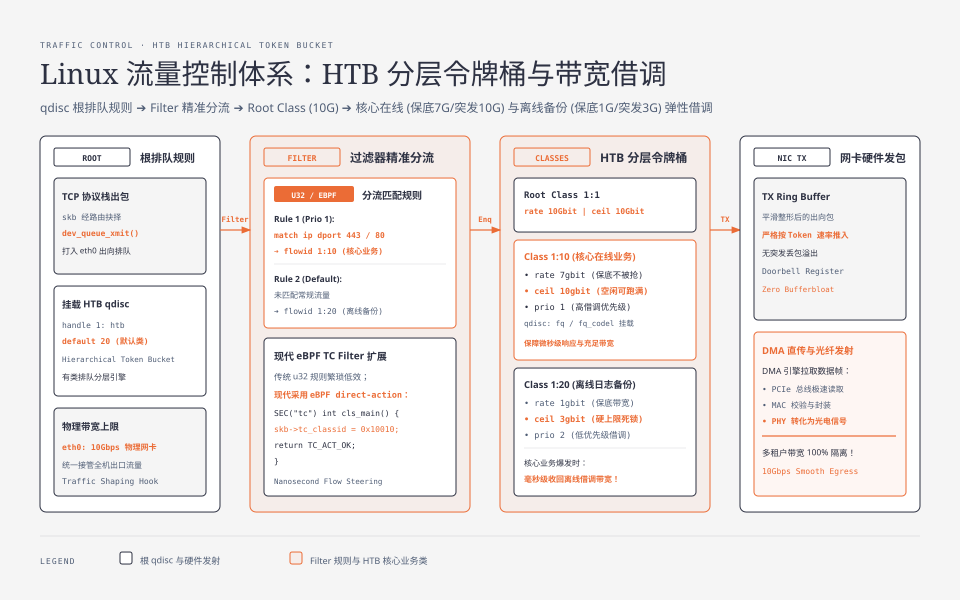
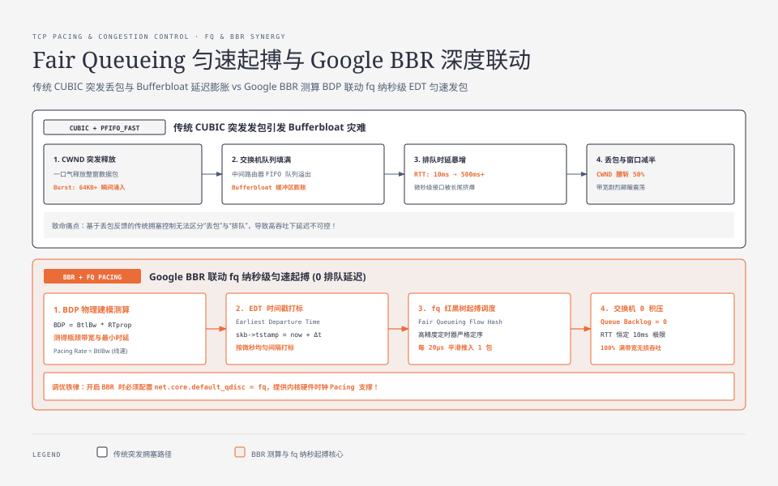
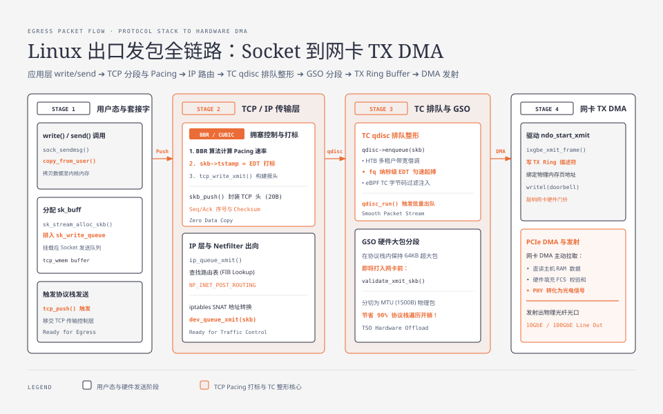

**TL;DR：** Linux 网络出口流量控制（Traffic Control, TC）的物理本质是**在网卡物理发送队列（TX Ring Buffer）前建立的一套分层排队与整形调度状态机**。TC 体系由三大要素构成：**qdisc（排队规则）、Class（分层类别）与 Filter（过滤器）**。面对多租户混部与带宽隔离，**HTB（分层令牌桶）** 通过 `rate`（保底带宽）与 `ceil`（突发借调上限）实现了弹性带宽复用；而在万兆单连接高吞吐场景下，传统 TCP 突发大包会瞬间填满交换机队列引发 **Bufferbloat（缓冲区膨胀）与高达数百毫秒的排队延迟**；现代 Linux 生产调优必须将默认排队规则切换为 **Fair Queueing（`fq`）**，配合 **Google BBR 拥塞控制算法** 实施纳秒级精确匀速发包（Pacing），彻底消灭突发丢包与长尾抖动。

---

## 一、 Linux 流量控制（TC）三大核心抽象

当应用程序调用 `send()` 或 `write()` 发送数据时，数据经过内核 TCP 协议栈封装后，并不会直接打入网卡物理硬件，而是**必须经过 Linux 流量控制（Traffic Control）子系统**。



### 1.1 TC 核心三要素

1. **qdisc（Queueing Discipline，排队规则）**：
   - 挂载在网络接口上的排队调度算法引擎，决定数据包的排队、重排、延迟发送或直接丢弃；
   - 分为**无类排队规则（Classless）**（如 `pfifo_fast`, `fq_codel`, `fq`）与**有类排队规则（Classful）**（如 `HTB`, `CBQ`, `HFSC`）；
2. **Class（类别，用于有类 qdisc）**：
   - 树状分层结构中的节点，每个 Class 可以配置独立的带宽保障（`rate`）、突发上限（`ceil`）与优先级（`prio`）；
3. **Filter（过滤器）**：
   - 分流中枢，根据 IP 地址、端口、TOS 优先级标记或 eBPF 字节码，将出向数据包精准路由分发至特定的子 Class 中。

---

## 二、 HTB（分层令牌桶）架构与带宽弹性借调实战

在云计算、Kubernetes 容器限速或多租户云主机环境中，核心诉求是：**“既要保证核心业务的保底带宽，又要允许低优先级任务在空闲时借调剩余带宽，且在高峰期能毫秒级收回！”**

### 2.1 HTB 核心参数物理语义

- **`rate`（保证带宽）**：该类别无论网络多拥堵都必定能获得的最小保障带宽；
- **`ceil`（借调上限带宽）**：该类别在父节点有空闲带宽时，最大允许向上借调达到的带宽硬上限；
- **`burst`（令牌桶容积）**：允许单次瞬间突发传输的字节数。

### 2.2 生产级 HTB 分层限速脚本实战

假设服务器拥有 10Gbps 网卡，需进行多租户流量隔离：
- **Class 1:10（核心在线业务）**：保底 7Gbps，最高可跑满 10Gbps，高优先级（`prio 1`）；
- **Class 1:20（离线日志/备份）**：保底 1Gbps，最高限制 3Gbps，低优先级（`prio 2`）。

```bash
# 1. 清空 eth0 历史出向 qdisc
$ sudo tc qdisc del dev eth0 root 2>/dev/null

# 2. 在根节点挂载 HTB 有类排队规则 (句柄 1:)
$ sudo tc qdisc add dev eth0 root handle 1: htb default 20

# 3. 创建总带宽根 Class 1:1 (10Gbps)
$ sudo tc class add dev eth0 parent 1: classid 1:1 htb rate 10gbit ceil 10gbit

# 4. 创建子 Class 1:10 (核心业务: 保底 7G, 突发 10G)
$ sudo tc class add dev eth0 parent 1:1 classid 1:10 htb rate 7gbit ceil 10gbit prio 1

# 5. 创建子 Class 1:20 (离线日志: 保底 1G, 突发上限 3G)
$ sudo tc class add dev eth0 parent 1:1 classid 1:20 htb rate 1gbit ceil 3gbit prio 2

# 6. 配置 Filter 分流规则：将 80/443 端口流量分流至 Class 1:10
$ sudo tc filter add dev eth0 protocol ip parent 1:0 prio 1 u32 \
    match ip dport 443 0xffff flowid 1:10
```

---

## 三、 Bufferbloat 灾难与 Fair Queueing（`fq`）匀速 Pacing

在传统的 TCP 拥塞控制（如 CUBIC）中，TCP 发送端会在短时间内一口气向网卡释放一个完整的拥塞窗口（CWND）数据包（**Burst 突发**）。



### 3.1 缓冲区膨胀（Bufferbloat）的物理形成机理

- 几十个数据包瞬间并发到达中间交换机；
- 交换机的出口物理带宽有限，多余的数据包被迫积压在交换机的 FIFO 缓冲区中排队；
- **排队时延暴涨**：网络 RTT 从正常的 10ms 飙升至 500ms（产生严重的 Bufferbloat）；
- 最终缓冲区溢出丢包，CUBIC 误判为网络极度拥塞，拥塞窗口腰斩减半，导致**带宽利用率剧烈颠簸震荡**！

### 3.2 Fair Queueing (`fq`) 匀速起搏（Pacing）技术

由 Linux 网络子系统维护者 Eric Dumazet 实现的 **`fq`（Fair Queueing）排队规则** 彻底解决了这一难题：
1. **流哈希分桶（Flow Hashing）**：将不同 TCP 连接的数据包分散到数千个独立的微型子队列中，杜绝大象流（Elephant Flow）挤死老鼠流（Mice Flow）；
2. **纳秒级匀速发包（Earliest Departure Time, EDT）**：
   - 内核在每个数据包的 `skb->tstamp` 字段上打上**最早允许发出时间戳**；
   - `fq` 借助红黑树与高精度定时器，将数据包严格均匀地按时间间隔（例如每 $20\mu\text{s}$ 发送 1 包）推入网卡 DMA 队列，**从物理根源上彻底消灭突发大包！**

<div class="interactive-sandbox" data-sandbox="tc-pacing"></div>

---

## 四、 BBR 算法与 `fq` 排队规则的强绑定调优

Google 提出的 **BBR（Bottleneck Bandwidth and RTT）** 拥塞控制算法彻底颠覆了基于丢包反馈的传统思路：
- BBR 持续通过最小 RTT 与最大交付速率精确测算当前物理链路的 **BDP（带宽时延乘积）**：

$$\text{BDP} = \text{BtlBw (瓶颈带宽)} \times \text{RTprop (最小物理时延)}$$

- BBR 核心依赖底层排队规则实施**精确发包速率起搏（Pacing Rate = BtlBw）**。

> **工业调优铁律：** 如果开启了 BBR 却仍然使用默认的 `pfifo_fast` 排队规则，由于缺乏内核级硬件时钟 Pacing 支持，BBR 的带宽测量精度与性能将大幅缩水！

#### 现代 Linux 生产级高性能网络内核参数模板

```bash
# /etc/sysctl.d/99-network-performance.conf

# 1. 默认排队规则强制切换为 Fair Queueing (fq)
net.core.default_qdisc = fq

# 2. 拥塞控制算法切换为 Google BBR
net.ipv4.tcp_congestion_control = bbr

# 3. 调优 TCP 发送与接收缓冲区自动伸缩上限 (最大 64MB)
net.ipv4.tcp_rmem = 4096 87380 67108864
net.ipv4.tcp_wmem = 4096 65536 67108864

# 4. 调优整机 TCP 内存物理水位 (页为单位: 4KB)
# [min, pressure, max]
net.ipv4.tcp_mem = 786432 1048576 1572864

# 5. 开启 TCP 窗口缩放 (Window Scaling) 与 SACK 选择性确认
net.ipv4.tcp_window_scaling = 1
net.ipv4.tcp_sack = 1

# 6. 开启 TCP 快速打开 (TFO)
net.ipv4.tcp_fastopen = 3
```

---

## 五、 全系列大结局：Linux 内核网络与 eBPF 全景拓扑



通过本专栏五篇硬核深度剖析，我们完整解构了 Linux 内核从物理网卡到用户态应用的整套性能工程拼图：

```
+-----------------------------------------------------------------------------------+
|                        Linux 内核网络与 eBPF 全景架构图谱                            |
|                                                                                   |
|                                [ 用户态应用程序 ]                                  |
|                                (Go / C++ / Envoy)                                 |
|                                         ▲                                         |
|                 ┌───────────────────────┴───────────────────────┐                 |
|                 │ (传统 Socket API)                             │ (AF_XDP UMEM)   |
|                 │ read() / write()                              │ 零拷贝直通      |
|                 ▼                                               │ 24M+ PPS        |
|        [ Socket 接收/发送队列 ]                                  │                 |
|                 ▲                                               │                 |
|        [ L3/L4 协议栈解析 ] ──► [ eBPF Kprobe / Tracepoint ]    │                 |
|        (TCP / BBR / IP 路由)   (Off-CPU 时延 / 调度器追踪)       │                 |
|                 ▲                                               │                 |
|        [ TC 流量控制系统 ]                                       │                 |
|        (qdisc: fq Pacing + HTB 分层令牌桶限速)                   │                 |
|                 ▲                                               │                 |
|        [ sk_buff 内存流转 ]                                     │                 |
|        (skb_push / skb_pull 零拷贝指针操作)                     │                 |
|                 ▲                                               │                 |
|        [ XDP 极速旁路挂载点 ] ──────────────────────────────────┘                 |
|        (驱动层原语: XDP_DROP / TX / REDIRECT)                                     |
|                 ▲                                                                 |
|        [ NAPI 软中断轮询 (net_rx_action) ]                                        |
|                 ▲                                                                 |
|        [ RX/TX Ring Buffer 环形描述符队列 ]                                       |
|                 ▲                                                                 |
|        [ 网卡 DMA 控制器直传主机内存 (PCIe) ]                                      |
|                 ▲                                                                 |
|        [ 物理网卡硬件 (PHY / MAC / 光纤电信号) ]                                  |
+-----------------------------------------------------------------------------------+
```

1. **物理收包（DMA & NAPI）**：以自适应软中断轮询彻底化解万兆网络中断风暴；
2. **微型沙箱（eBPF & JIT）**：以 Verifier 形式化安全证明与 JIT 机器码直译赋予内核动态编程能力；
3. **极速旁路（XDP & AF_XDP）**：在驱动层裸内存指针就地决议，实现 24M+ PPS 物理线速吞吐；
4. **深度观测（Kprobe & Off-CPU）**：以断点与调度器探针穿透系统黑盒，终结 P99 长尾延迟排障盲区；
5. **出口调度（TC & fq/BBR）**：以 HTB 分层令牌桶与 fq 毫秒级 Pacing 匀速发包根治 Bufferbloat 拥塞。

操作系统内核不再是不可逾越的物理高墙，而是**每一位追求极致性能的资深工程师手中最强大、最通透的可编程武器**！
