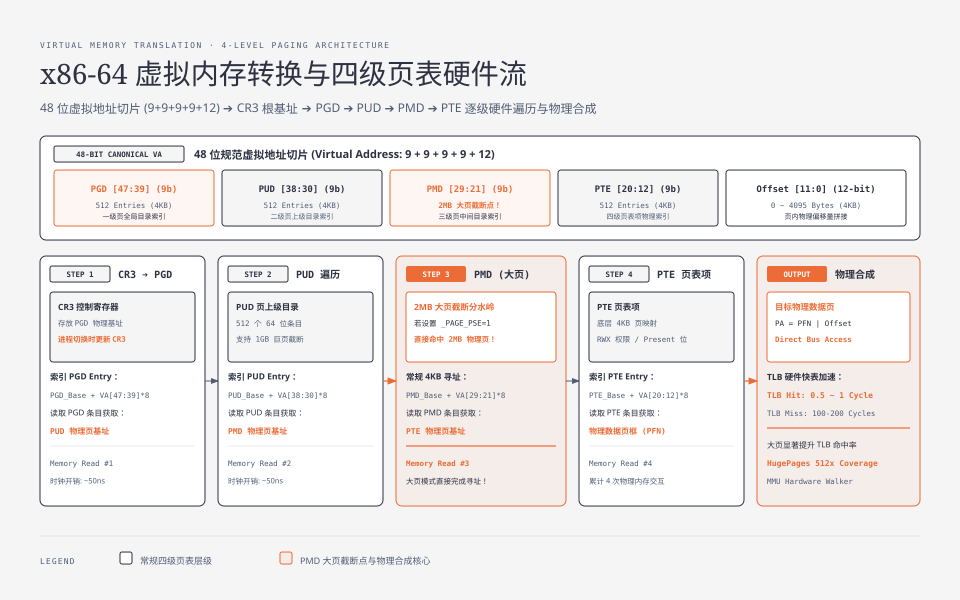
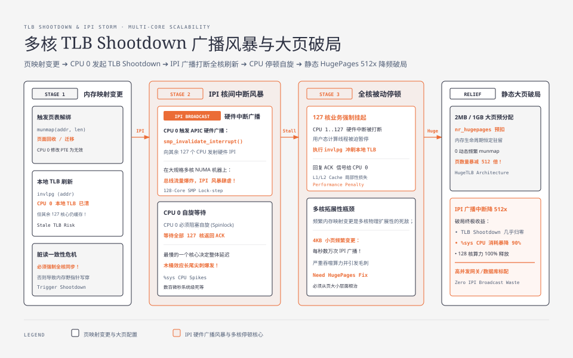
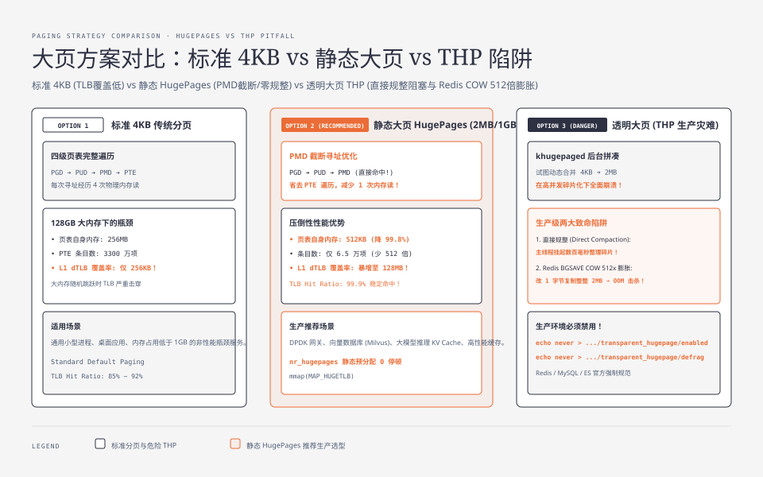

**TL;DR：** 许多后端工程师在编写高性能程序（如高吞吐网关、Redis 内存数据库、MySQL 存储引擎、大模型推理 KV Cache 管理）时，往往只关注算法复杂度，却忽视了操作系统与 CPU 硬件在**内存虚拟化寻址上的物理开销**：
1. **四级页表遍历代价**：在 64 位 Linux 体系下，一次未命中 TLB 的内存寻址需要 CPU 硬件 Page Table Walker 连续执行 **4 次物理内存访问（PGD $\to$ PUD $\to$ PMD $\to$ PTE）**，延迟从 1 个时钟周期骤增至 100~200 个周期；
2. **TLB 硬件快表瓶颈**：CPU L1 dTLB 仅有 64 个条目，在 4KB 标准分页下仅能覆盖 $64 \times 4\text{KB} = 256\text{KB}$ 的热点内存；当程序在 128GB 大内存中随机跳跃访问时，TLB 命中率会严重崩塌；
3. **静态大页（HugePages 2MB/1GB）的性能奇迹**：在 PMD 层级直接截断寻址，省去 PTE 级遍历，并将单条 TLB 条目的内存覆盖范围扩大 512 倍，页表本身占用的物理内存暴降 99.8%；
4. **透明大页（THP）的生产级灾难**：Linux 内核后台 `khugepaged` 线程在动态拼凑 2MB 大页时触发**直接内存规整（Direct Compaction）**阻塞主线程；在 Redis `BGSAVE` 写时复制（COW）时，改动 1 个字节会强制复制整整 2MB 物理大页，导致内存瞬间膨胀 512 倍并引发百毫秒级延迟尖刺与 OOM 崩溃！

---



---

## 一、 虚拟内存转换：48 位地址切片与四级页表硬件流

在现代 x86-64 架构下，为了兼顾硬件成本与寻址空间，Linux 普遍采用 **48 位规范虚拟地址（Canonical Address）**，寻址范围为 256TB。

### 1.1 48 位虚拟地址切片结构
48 位虚拟地址被 CPU 内存管理单元（MMU）精准切分为 **9 + 9 + 9 + 9 + 12** 的五段结构：

$$\text{Virtual Address [47:0]} = \underbrace{\text{PGD [47:39]}}_{9\text{ bits}} \mid \underbrace{\text{PUD [38:30]}}_{9\text{ bits}} \mid \underbrace{\text{PMD [29:21]}}_{9\text{ bits}} \mid \underbrace{\text{PTE [20:12]}}_{9\text{ bits}} \mid \underbrace{\text{Offset [11:0]}}_{12\text{ bits}}$$

每个 9 位切片对应 $2^9 = 512$ 个索引项，由于每个 64 位页表条目（Entry）占用 8 字节，因此每一级页表恰好占用 **$512 \times 8\text{B} = 4096\text{B} = 4\text{KB}$**，完美对齐一个标准物理页！

### 1.2 四级页表逐级遍历流程
当 CPU 访问一个虚拟地址时，硬件 Page Table Walker 的寻址路径如下：
1. **获取根基址**：CPU 从 **CR3 控制寄存器** 中读取当前进程顶级页目录 **PGD（Page Global Directory）** 的物理基地址；
2. **索引 PGD**：利用虚拟地址 `[47:39]` 找到对应的 PGD Entry，其中存放着下一级 **PUD（Page Upper Directory）** 的物理基地址；
3. **索引 PUD**：利用虚拟地址 `[38:30]` 找到对应的 PUD Entry，获取下一级 **PMD（Page Middle Directory）** 的物理基地址；
4. **索引 PMD**：利用虚拟地址 `[29:21]` 找到对应的 PMD Entry，获取底层 **PTE（Page Table Entry）** 的物理基地址；
5. **索引 PTE**：利用虚拟地址 `[20:12]` 找到对应的 PTE Entry，获取最终 **4KB 物理数据页（Page Frame）** 的物理基地址；
6. **物理合成**：将 PTE 中的物理基地址与低 12 位页内偏移量 `Offset [11:0]` 拼接，计算出真正的物理内存地址。

---




## 二、 TLB 快表与多核 TLB Shootdown 广播风暴

四级页表遍历虽然精妙，但代价极其昂贵——**读取一个简单的变量需要串行访问 4 次物理内存**。为了消除这数百个 CPU 周期的等待，CPU 硬件引入了 **TLB（Translation Lookaside Buffer，页表旁路转换快表）**。

### 2.1 TLB Hit vs TLB Miss 的物理性能鸿沟
- **TLB Hit（命中）**：MMU 仅需 **0.5 ~ 1 个时钟周期** 即可直接从 CPU 内部全相联缓存中读出物理页基址；
- **TLB Miss（缺失）**：MMU 触发硬件 Page Table Walk，连续发生 4 次内存总线交互，耗时暴增至 **100 ~ 200 个 CPU 时钟周期**！

### 2.2 TLB Shootdown 广播核间中断（IPI）风暴
当 Linux 内核修改了某个共享内存页的映射（例如内存回收、页面迁移、`munmap`）时，该页在所有 CPU 核心上的 TLB 缓存全部失效。

内核必须通过 **核间中断（Inter-Processor Interrupt, IPI）** 向所有其他 CPU 核心广播 `smp_invalidate_interrupt`，强制其他核心刷新本地 TLB。在大规格 NUMA 服务器（如 128 核）上，频繁的内存映射变更会引发严重的 **TLB Shootdown 风暴**，导致所有 CPU 核心被中断频繁打断，系统 CPU 自旋（`%sys`）飙升！

---



---

## 三、 静态大页（HugePages 2MB / 1GB）的性能奇迹

面对拥有 128GB ~ 512GB 物理内存的高性能服务（如 DPDK 网关、Redis、Vector DB），标准 4KB 分页会导致页表本身极度庞大且 TLB 严重不够用：

$$\text{128GB 内存所需的 4KB 页表项数} = \frac{128 \times 1024 \times 1024 \times 1024}{4096} = 33,554,432 \text{ 个 (3300万条目)}$$

仅存放这些 PTE 页表本身就需要消耗 **$33,554,432 \times 8\text{B} \approx 256\text{MB}$ 物理内存**，且 64 条目的 L1 dTLB 覆盖率仅为微不足道的 256KB！

### 3.1 2MB 大页的物理优化机理
当使用 **2MB 静态大页（HugePages）** 时：
1. **寻址路径直接在 PMD 层级截断**：PMD Entry 设置了 `_PAGE_PSE`（Page Size Extension）标志位，直接指向 2MB 连续物理大页，**彻底跳过了第四级 PTE 页表的遍历，省去 1 次内存访问**；
2. **页表项数量缩减 512 倍**：128GB 仅需 65,536 个条目，页表内存开销从 256MB 暴降至 512KB；
3. **TLB 覆盖率暴增 512 倍**：单条 TLB 条目覆盖 2MB 内存，32 个大页 TLB 条目即可覆盖 **64MB** 热点内存，TLB 命中率提升至 99.9% 以上！

### 3.2 静态大页配置与代码落地
在 Linux 系统中预分配 2MB 大页：
```bash
# 预分配 2048 个 2MB 大页 (共 4GB)
echo 2048 > /proc/sys/vm/nr_hugepages
```

在 C/C++ 或 Go 中通过 `mmap` 使用大页：
```c
// 使用 MAP_HUGETLB 标志申请 2MB 对齐的大页内存
void *ptr = mmap(NULL, 2 * 1024 * 1024, PROT_READ | PROT_WRITE,
                 MAP_PRIVATE | MAP_ANONYMOUS | MAP_HUGETLB, -1, 0);
```

---

## 四、 为什么 Redis / MySQL 生产环境强制禁用透明大页（THP）？

既然大页性能如此优异，Linux 内核在 2.6.38 引入了 **透明大页（Transparent Huge Pages, THP）**，旨在无需应用改动代码的前提下，由内核后台线程 `khugepaged` 自动将 4KB 连续页面合并为 2MB 大页。

**然而，THP 在高并发数据库与低延迟服务中几乎是万恶之源！**

### 4.1 陷阱 1：直接内存规整（Direct Compaction）阻塞主线程
当系统运行时间较长、内存出现碎片化时，应用线程调用 `malloc` 申请内存，THP 尝试为其分配 2MB 连续物理内存。由于找不到连续空间，内核会**挂起当前应用线程**，强制执行同步的直接内存规整（Direct Memory Compaction）：
- 扫描物理内存、移动已分配页面以拼凑 2MB 连续空闲块；
- 这会导致应用主线程发生 **数百毫秒甚至秒级的严重停顿（Latency Spikes）**！

### 4.2 陷阱 2：Redis `BGSAVE` 写时复制（COW）内存暴涨 512 倍
Redis 执行持久化快照（`BGSAVE`）或主从全量同步时，会 `fork()` 子进程利用操作系统的写时复制（Copy-on-Write, COW）机制。

- **标准 4KB 分页下**：父进程修改了 1 字节数据，仅触发复制对应的 **4KB 物理页**；
- **开启 THP（2MB 大页）下**：父进程修改 1 字节数据，内核被迫复制**整整 2MB 的物理大页**！

这直接导致 COW 内存放大 **512 倍**，Redis 内存占用在几秒钟内翻倍，瞬间触发 Linux 内核的 **OOM Killer**，将 Redis 进程直接物理击杀！

---

## 五、 生产级 Linux 内存调优最佳实践

为保证高并发、低延迟后端服务的极致稳定性，生产环境应当执行以下标准调优矩阵：

### 5.1 彻底禁用透明大页（THP）
在系统初始化脚本或 `/etc/rc.local` 中加入：
```bash
# 禁用 THP
echo never > /sys/kernel/mm/transparent_hugepage/enabled
# 禁用碎片整理拼凑
echo never > /sys/kernel/mm/transparent_hugepage/defrag
```

### 5.2 调优 Swappiness 与脏页刷盘比率
```ini
# /etc/sysctl.conf

# 降低 Swap 倾向，优先回收文件页缓存
vm.swappiness = 1

# 脏页达到物理内存 10% 时后台异步刷盘
vm.dirty_background_ratio = 10

# 脏页达到物理内存 20% 时阻塞应用写入强制刷盘
vm.dirty_ratio = 20

# 避免内存耗尽时触发死锁，保留最小空闲内存 (例如 1GB)
vm.min_free_kbytes = 1048576
```

---

## 六、 总结

Linux 内存管理是连接软件数据结构与硬件晶体管的关键中枢：
- 认识到四级页表遍历与 TLB Miss 的物理时钟代价，理解现代 CPU 寻址的第一性原理；
- 对于 DPDK、向量数据库与高性能大模型推理引擎，**主动使用静态 HugePages** 提升 TLB 覆盖率；
- 对于 Redis、MySQL、Elasticsearch 等传统内存密集型数据库，**坚决在生产环境禁用透明大页 THP**，彻底斩断由直接内存规整与 COW 放大引起的延迟抖动与 OOM 风险。
