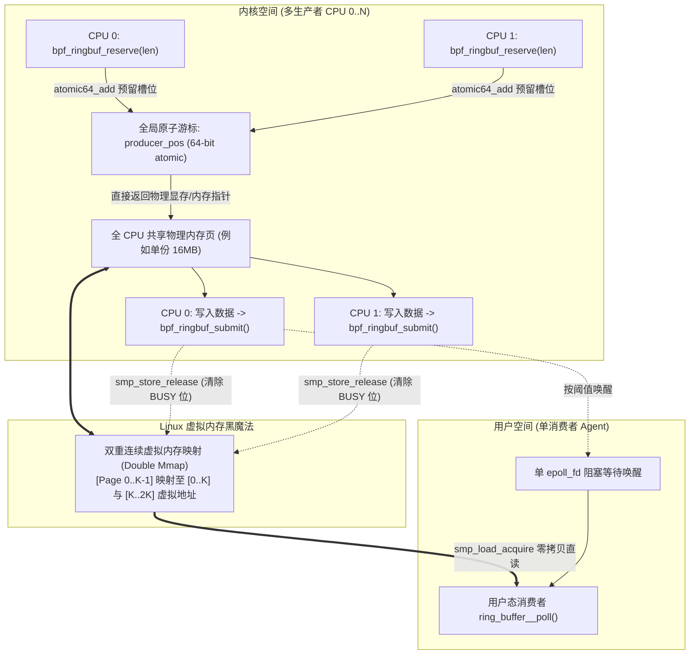
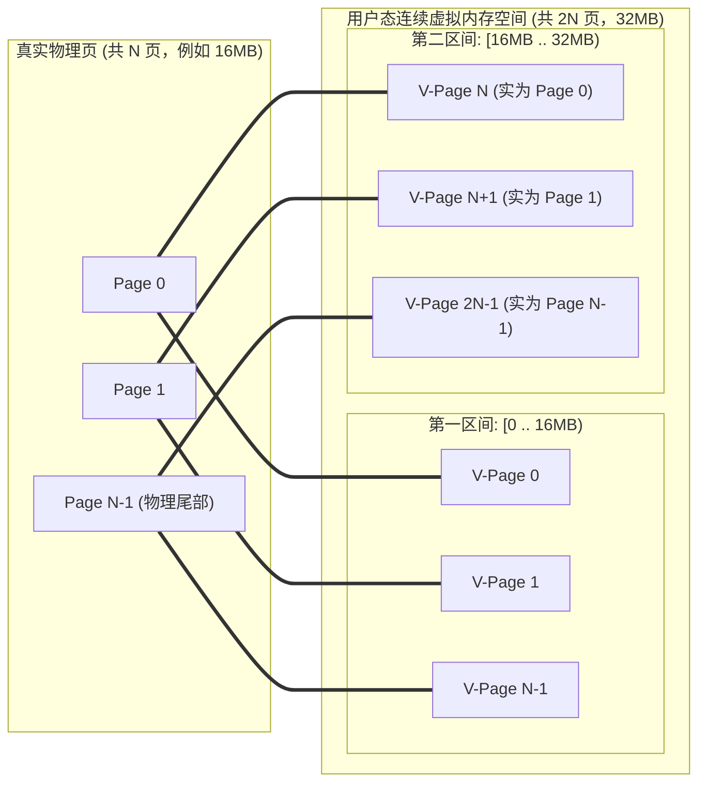

**TL;DR：** 在 Linux 5.8 引入 `BPF_MAP_TYPE_RINGBUF` 之前，eBPF 向用户态推送事件的标准通道是 **Perf Event Array（Perf Buffer）**。然而，Perf Buffer 的 **Per-CPU 隔离架构** 在现代多核服务器（如 128 核）上面临三大陆地级缺陷：**内存消耗随 CPU 核数呈 $O(N)$ 线性膨胀**（128 核配置 16MB 缓冲直接吃掉 2GB 内存）、**跨核事件因果序彻底被打乱**、以及必须依赖 `bpf_perf_event_output` 产生**内核栈向环形缓冲区的深拷贝**。由内核开发者 Andrii Nakryiko 设计的 **BPF Ring Buffer** 引入了多生产者单消费者（MPSC）无锁环形队列，将内存压缩为全核共享的恒定大小；通过巧妙的**双重连续虚拟内存映射（Double Mmap）** 彻底消除了数据跨环形折返点的分片拷贝；并基于 8 字节头部原子标志位与 `smp_store_release` / `smp_load_acquire` 内存屏障，实现了支持安全提前预留的真正**零拷贝写入（`bpf_ringbuf_reserve` / `submit`）**。

---

## 一、 历史的局限：Perf Buffer 的三道致命硬伤

在深入现代 Ring Buffer 的内部机制之前，我们必须先看清旧架构到底在什么场景下走向崩溃。

```text
传统 Perf Buffer 事件链路：
  BPF Hook 触发
    → 在 eBPF 栈上组装事件结构体（内存占用）
    → 调用 bpf_perf_event_output()
    → 内核将数据自栈内存 memcpy 拷贝进当前 CPU 专属的 perf_event 环形缓冲区
    → 触发唤醒 / 用户态 epoll
    → 用户态消费独立维护 128 个文件描述符，手动排序
```

### 1.1 内存浪费：Per-CPU 拓扑下的 $O(N)$ 膨胀与木桶失衡

`BPF_MAP_TYPE_PERF_EVENT_ARRAY` 采用的是典型的 Per-CPU 数据结构：内核为每个 CPU 逻辑核心独立分配一个专用的单生产者环形队列。这种设计在单核写入时天然避免了跨核自旋锁与缓存行颠簸（False Sharing），但在高密度服务器上代价极其高昂：

设单核分配的环形缓冲区容量为 $S = 16\text{ MB}$，服务器 CPU 核心数为 $N = 128$：
$$\text{Memory}_{\text{perf}} = N \times S = 128 \times 16 \text{ MB} = 2048 \text{ MB} = 2 \text{ GB}$$

光是一个监控探针的缓冲区就吃掉了 **2GB 的固定内存**！更严重的是**负载倾斜（Load Skew）**：在网络软中断（NAPI）绑定在 CPU 0~7 的场景下，这 8 个核心的 16MB 缓冲区在突发流量下迅速溢出丢包（Buffer Overflow），而其余 120 个 CPU 核心的缓冲区却处于 99.9% 闲置的冷冻状态。**资源池无法跨核共享，导致局部被打死、全局被浪费。**

### 1.2 全局时钟失序：乱序的因果追踪

分布式追踪与系统观测依赖于严格的因果时序（Happens-Before）。当事件分布在 128 个独立的 Per-CPU 队列中时：
- 每个核心的事件独立推进其内部局部时间戳；
- 用户态 Agent 必须通过 `epoll` 监听 128 个文件描述符，并在用户态应用层维护一个大根堆/优先队列进行跨流归并排序；
- 这种在用户态的“事后拼接”不仅增加了 CPU 排序开销，而且在面对不同 CPU 核心的时钟微小漂移（TSC Drift）时，极易产生逆序错觉。

### 1.3 两次拷贝开销：栈空间限制与 `memcpy` 惩罚

eBPF 虚拟机的栈空间被严格限制在 **512 字节**。当开发者需要向用户态输出一个较大的事件结构体（例如包含 HTTP 请求头或完整的网络包元数据，尺寸达 400 字节以上）时：
1. 开发者必须先在 eBPF 栈上初始化结构体，若超过 512 字节则必须借助 Per-CPU Array Map 作为临时中转堆空间；
2. 随后调用 `bpf_perf_event_output()`，内核底层执行内存拷贝，将数据由栈/临时 Map 复制进内核 Perf 物理页中。
在高频追踪场景（如每秒数十万次 syscall 调用），密集的内存拷贝不仅吞噬 L1/L2 数据缓存，更大幅拉长了探针函数的执行开销。

---

## 二、 架构破局：BPF Ring Buffer 的系统全景

为了彻底终结上述缺陷，Linux 5.8 引入了全新的 `BPF_MAP_TYPE_RINGBUF`。它在设计哲学上回归了计算机经典的 **MPSC（Multi-Producer Single-Consumer，多生产者单消费者）** 共享内存队列。



### 2.1 核心收益与物理指标对比

通过将拓扑由 Per-CPU 收敛为全核共享，BPF Ring Buffer 带来了质的飞跃：

| 关键特性 | Perf Event Array (`PERF_EVENT_ARRAY`) | BPF Ring Buffer (`RINGBUF`) | 架构优势来源 |
| :--- | :--- | :--- | :--- |
| **内存拓扑** | Per-CPU 独立环形缓冲区 | **全核共享单一环形缓冲区** | 内存开销从 $O(N)$ 降至 $O(1)$ 常数级 |
| **128 核内存消耗** | 16MB $\times$ 128 = **2048 MB (2GB)** | **16 MB (恒定)** | **节约 99.2% 的物理内存** |
| **事件时序保证** | 跨核无序，依赖用户态归并排序 | **全局绝对物理因果时序** | 单一原子 `producer_pos` 序列化分配 |
| **内存拷贝次数** | 至少 1 次完整内核 `memcpy` | **0 次（直接在目标物理页就地写）** | `bpf_ringbuf_reserve` 返回槽位直接指针 |
| **用户态消费接口** | 需对 $N$ 个文件描述符循环轮询 | **单一 `epoll_fd`** | 消除多路复用上下文切换与线程争用 |
| **内核版本要求** | Linux 4.3+ | **Linux 5.8+** | 需现代内核运行时支持 |

---

## 三、 隐藏的黑魔法：双重虚拟内存映射（Double Mmap）

环形缓冲区（Ring Buffer）在软件工程中最令人头疼的问题莫过于**环形边界折返（Wrap-Around）**：
当缓冲区大小为 16MB，生产者写入一个位于 15.99MB 位置的 32KB 事件时，该事件在物理上会被切断为两半：前 10KB 落在物理内存尾部，后 22KB 绕回物理内存头部。

在传统实现中，消费者若想读取一段连续内存，内核必须做两件事之一：
1. 强迫用户态进行二次内存拼接拷贝；
2. 禁止跨边界写入，将尾部 10KB 填充为无用的 Padding 空白，造成严重的内存碎片。

Andrii Nakryiko 在 `kernel/bpf/ringbuf.c` 中采用了一个极其精妙的**虚存折叠机制**：



### 3.1 虚拟地址空间的二次映射机理
- 当调用 `mmap()` 映射 BPF Ring Buffer 时，内核分配了大小为 $2 \times S$（即两倍物理大小）的连续**虚拟内存地址区间**；
- 紧接着，内核将这一份物理页帧（Physical Page Frames）**在页表中连续映射了两次**！
  - 虚拟地址 $[0, S)$ 映射到物理页 $[0, N-1]$；
  - 虚拟地址 $[S, 2S)$ **再次精准映射回同一个物理页 $[0, N-1]$**！

### 3.2 带来的工程奇迹：绝对平坦的零拷贝寻址
当生产者或消费者跨越边界 $S$ 时，指针无需做任何取模判断或折返包装，直接递增访问虚拟内存：
- 访问第 $S + 100$ 字节，硬件 MMU 的页表会自动将其翻译到物理页的第 100 字节！
- **无论是内核还是用户态代码，面对的永远是一段 100% 连续的线性内存空间**。所有变长结构体都可以毫无阻碍地进行单指针解引用，彻底消除了处理 Ring Buffer 环形断裂的全部边界逻辑与分支预测开销。

---

## 四、 内核级无锁并发：Reserve-Submit 状态机与内存屏障

BPF Ring Buffer 是如何做到在多核并发、甚至不可屏蔽中断（NMI）上下文下，不使用任何全局互斥锁（Spinlock）完成高吞吐数据写入的？

其奥秘在于 8 字节头部与两条 64 位原子游标：
- `producer_pos`：64 位全局单调递增生产者游标（内核维护）；
- `consumer_pos`：64 位全局单调递增消费者游标（用户态只读推进）。

### 4.1 记录头部定义（`struct bpf_ringbuf_hdr`）

每个存入 Ring Buffer 的数据项在物理上都由一个 8 字节的头部引导：

```c
/* Linux 内核 kernel/bpf/ringbuf.c 核心头部数据结构 */
struct bpf_ringbuf_hdr {
    u32 len;     /* 低 30 位表示真实长度，高 2 位承载状态标志 */
    u32 pg_off;  /* 内部元数据与对齐辅助字段 */
};

#define BPF_RINGBUF_BUSY_BIT    (1U << 31)  /* 最高位：正在写入标志 (Busy) */
#define BPF_RINGBUF_DISCARD_BIT (1U << 30)  /* 次高位：废弃跳过标志 (Discard) */
#define BPF_RINGBUF_LEN_MASK    (0x3FFFFFFF)/* 低 30 位：负载长度掩码 */
```

### 4.2 写入状态机流转流程

```mermaid
sequenceDiagram
    autonumber
    participant BPF as eBPF 程序 (CPU 0)
    participant RB as Ring Buffer 内存
    participant Pos as 全局 producer_pos
    participant User as 用户态消费者 Agent

    BPF->>Pos: bpf_ringbuf_reserve(len=32)
    Note over Pos: 8字节Header + 32字节对齐 = 48字节<br/>执行 atomic64_add(48, &producer_pos)
    Pos-->>BPF: 返回槽位起始指针 ptr
    Note over RB: 槽位 Header 写入:<br/>len = 32 | BPF_RINGBUF_BUSY_BIT (置忙)
    
    rect rgb(240, 248, 255)
        Note over BPF,RB: 零拷贝就地构造数据 (In-Place Construction)<br/>ptr->field_a = 123;<br/>ptr->field_b = 456;
    end
    
    alt 正常提交路径
        BPF->>RB: bpf_ringbuf_submit(ptr, flags)
        Note over RB: smp_store_release 清除 BPF_RINGBUF_BUSY_BIT<br/>数据对消费者正式可见！
        RB-->>User: 触发 epoll 唤醒 (根据水线与 flags)
    else 异常丢弃路径
        BPF->>RB: bpf_ringbuf_discard(ptr, flags)
        Note over RB: 清除 BUSY 位并打上 BPF_RINGBUF_DISCARD_BIT
        Note over User: 消费者读到该位直接跳过，不做业务处理
    end
```

### 4.3 内存屏障与乱序提交时的消费者阻断机制

并发系统中最精妙的问题是：**如果 CPU 0 先 Reserve，CPU 1 后 Reserve，但 CPU 1 却先写完并 Submit 了，消费者该怎么读？**

考虑如下时序：
1. **时刻 $T_1$**：CPU 0 调用 `reserve()`，拿到槽位 `[0 .. 48)`。其头部被打上 `BPF_RINGBUF_BUSY_BIT`；
2. **时刻 $T_2$**：CPU 1 调用 `reserve()`，拿到槽位 `[48 .. 104)`。其头部被打上 `BPF_RINGBUF_BUSY_BIT`；
3. **时刻 $T_3$**：CPU 1 迅速填充完数据，调用 `submit()`。CPU 1 执行 `smp_store_release`，清除 `[48 .. 104)` 头部的 BUSY 位；
4. **时刻 $T_4$**：用户态消费者被唤醒，开始从当前的 `consumer_pos = 0` 读取；
5. **核心判决**：消费者通过 `smp_load_acquire` 读取槽位 0 的头部，发现其最高位 `BPF_RINGBUF_BUSY_BIT` 依然为 1（CPU 0 还在写入）！
   - **消费者绝对不会跳过槽位 0 去读取已经就绪的槽位 1**；
   - 消费者立即终止当前批次的读取并退出。
   - **原因**：一旦跳过槽位 0，全局事件的时钟偏序就被破坏了！
6. **时刻 $T_5$**：CPU 0 完成写入并调用 `submit()`，清除 BUSY 位。
7. **时刻 $T_6$**：消费者再次被激活，一口气连续读出槽位 0 与槽位 1，**严格还原物理因果顺序**！

这个完整的因果屏障与乱序提交阻断逻辑，已在文末 `experiments/bpf-ringbuf/ringbuf_sim.py` 中经过代码严格复现验证。

---

## 五、 生产级 eBPF 编程实战：从内核到用户态

### 5.1 内核态 C 代码模板：`bpf_ringbuf_reserve` 实战

```c
// SPDX-License-Identifier: GPL-2.0
#include "vmlinux.h"
#include <bpf/bpf_helpers.h>
#include <bpf/bpf_core_read.h>

struct event {
    u32 pid;
    u32 uid;
    char comm[16];
    u64 timestamp_ns;
};

// 定义 BPF Ring Buffer Map
struct {
    __uint(type, BPF_MAP_TYPE_RINGBUF);
    __uint(max_entries, 16 * 1024 * 1024); // 必须是系统物理页大小的 2 的幂次倍 (例如 16MB)
} events SEC(".maps");

SEC("kprobe/sys_enter_execve")
int trace_execve(struct pt_regs *ctx)
{
    struct event *e;

    // 1. 预留槽位：直接在环形缓冲物理页中切分出空间，避免占用 eBPF 512B 栈
    e = bpf_ringbuf_reserve(&events, sizeof(*e), 0);
    if (!e) {
        // 缓冲区已满，事件丢失 (丢包指标计数在此统计)
        return 0;
    }

    // 2. 零拷贝就地写入数据 (In-place Write)
    e->pid = bpf_get_current_pid_tgid() >> 32;
    e->uid = bpf_get_current_uid_gid();
    e->timestamp_ns = bpf_ktime_get_ns();
    bpf_get_current_comm(&e->comm, sizeof(e->comm));

    // 3. 提交事件：释放 BUSY 位，交由用户态消费
    // 可选传参 BPF_RB_NO_WAKEUP 压抑频繁软中断唤醒，由后续批次或定时器合并通知
    bpf_ringbuf_submit(e, 0);
    return 0;
}

char LICENSE[] SEC("license") = "GPL";
```

### 5.2 唤醒节流（Wakeup Throttling）的调优合同

在高吞吐网络包监控或频繁系统调用追踪中，如果每次 `bpf_ringbuf_submit` 都向用户态发送唤醒通知，系统会因为极高的中断频率与上下文切换（Context Switch）而直接跑满单个 CPU 核心。

为此，BPF Ring Buffer 提供了精确的唤醒控制合同：
1. **`BPF_RB_NO_WAKEUP` 标志位**：
   显式通知内核本条记录提交后**绝不触发任何 epoll 唤醒**。适合用于高频小事件，配合周期性心跳事件或后续满阈值事件搭便车（Piggyback）唤醒。
2. **`BPF_RB_FORCE_WAKEUP` 标志位**：
   强行穿透一切内核节流机制，立即发出唤醒。适用于罕见的致命告警事件。
3. **自适应水位机制（Adaptive Notification）**：
   默认情况下，`bpf_ringbuf` 会监控用户态消费进度。如果消费者当前正在处于非睡眠的繁忙消费循环（Active Polling）中，内核会自动跳过唤醒通知，实现硬件级的零开销自适应批处理。

---

## 六、 本地确定性实验：MPSC 状态机与并发断言

我们在仓库中构建了 `experiments/bpf-ringbuf/ringbuf_sim.py`，完整复现了多核并发 Reserve、乱序 Submit、内存屏障锁定与 Discard 丢弃语义。

### 6.1 运行模拟实验

```bash
python3 experiments/bpf-ringbuf/ringbuf_sim.py
```

### 6.2 实验输出证据

```text
PASS Per-CPU Perf Buffer 内存开销为 128 倍膨胀 | Perf Buffer=2048MB vs RingBuf=16MB
PASS Busy 位掩码定义
PASS Discard 位掩码定义
PASS CPU 0 未提交时，消费者被 BUSY 位阻断，读取 0 条 | read=0
PASS CPU 0 提交后，消费者严格按预留顺序消费两条数据 | read=['CPU0_DATA', 'CPU1_DATA']
PASS Discard 记录被消费者自动跳过，仅返回有效数据 | read=['NORMAL_DATA']
============================================================
ALL CHECKS PASSED: True (Total checks: 6)
============================================================
```

### 6.3 证据边界
- **本实验证明**：基于 64 位单调递增游标与 BUSY 位标志的 MPSC 状态机，能够在多核并发无锁争用下保证全局时钟与因果绝对顺序；证明了跨核乱序提交必须在屏障点暂停消费。
- **本实验不证明**：在真实多路 NUMA 架构下，远端内存节点访问单一物理页可能造成的交叉总线延迟（QPI/UPI 互联总线开销）。在极度极端的极端写入吞吐下，Per-CPU 的无总线争用依然有其单一维度的吞吐优势。

---

## 七、 总结与工程选型法则

当你在新的性能工程或可观测项目中进行内核通道选型时，请以如下黄金法则为准绳：

1. **新系统无脑首选 Ring Buffer**：
   只要目标环境运行在 **Linux 5.8 及以上内核**，无论业务吞吐高低，一律优先采用 `BPF_MAP_TYPE_RINGBUF`。它能够为你节省 90% 以上的物理内存并直接消灭用户态多流排序带来的技术债。
2. **警惕栈空间超标，善用 Reserve-Submit 范式**：
   不要再在 eBPF 程序内通过局部变量组装几百字节的大结构体；优先使用 `bpf_ringbuf_reserve` 直接在环形缓冲物理页中开辟内存就地写入。如果条件校验失败，立即调用 `bpf_ringbuf_discard` 释放，实现性能最优的零拷贝。
3. **老旧内核的降级兜底**：
   如果软件必须兼容 CentOS 7 / Ubuntu 18.04 等运行低版本（< 5.8）内核的宿主机，采用 `libbpf` 的抽象层，以条件编译或运行时探测（Feature Probing）方式回退到 `perf_buffer`，但在配置 Per-CPU 尺寸时必须根据机器物理核心数动态缩小单核缓冲，防止撑爆整机显存与内存。

---

## 参考资料与内核源码依据

1. **Linux Kernel Source Code (kernel/bpf/ringbuf.c)** - BPF Ring Buffer 完整内核源码实现与内存映射逻辑。
2. **Andrii Nakryiko: BPF ring buffer: two years later (2022)** - 深入解析了设计 MPSC 环形缓冲区的最初动机与经验总结。
3. **LWN.net: BPF ring buffers (2020)** - 详细阐述了双重虚拟内存映射（Double Mmap）的设计原理。
4. **libbpf Documentation (src/ringbuf.c)** - 用户态消费者 API、epoll 包装器与自适应水位调优说明。
