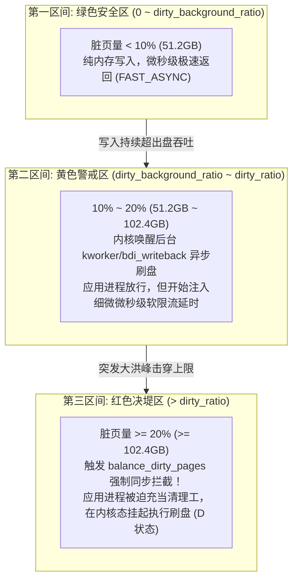

**TL;DR：** 许多高吞吐服务（如 Kafka、PostgreSQL、Elasticsearch 或大文件落盘应用）在云上或物理机部署时，常遇到一个看似灵异的现象：**CPU 使用率不到 10%，但系统的 Load Average 突然飙到 80 以上，所有正在调用 `write()` / `pwrite()` 的业务线程瞬间陷入无响应的不可中断睡眠（`D` 状态，Uninterruptible Sleep），P99 延迟暴涨数千毫秒**。罪魁祸首正是 Linux 内核内存子系统的**脏页限流机制（`balance_dirty_pages`）**。在默认参数下，`dirty_ratio = 20%`。对于一台 512GB 内存的大型服务器，这意味着系统允许累积高达 **102.4GB 的脏页**！一旦产生写入峰值击穿这一阈值，内核将判定系统面临 OOM 崩溃危险，立即将发起写入的进程强行捕获，逼迫其在内核态同步执行磁盘刷盘。在 500MB/s 吞吐的磁盘上，排空 102.4GB 脏页需要整整 **209 秒**！本文将剖析内核 `mm/page-writeback.c` 的三区间状态机，揭示大内存环境下的“百分比陷阱”，并给出生产环境下改用 `dirty_bytes` 绝对约束与 cgroup v2 限速的根治方案。

---

## 一、 灵异现场：为什么 CPU 空闲而系统却挂起了？

想象一个标准的生产突发事故现场：
1. 监控大屏上，一台配备 512GB RAM、挂载企业级 SSD 的数据库从库，正在执行大批量的数据导入或 WAL 归档；
2. 忽然，线上告警疯狂轰炸：API 网关出现大量 504 Gateway Timeout，应用健康检查超时；
3. SRE 登录机器查看指标：
   - `top` 显示：`load average: 85.4, 72.1, 45.0`，CPU 利用率 `us: 2.1%, sy: 4.5%`（CPU 几乎闲着！）；
   - `wa`（I/O Wait）飙升至 80% 以上；
   - 查看进程状态：MySQL / Kafka 的写入线程全部变成了标红的 **`D` 状态**；
   - `kill -9` 没有任何反应，因为内核处于不可中断的系统调用临界区。

```text
写调用陷入 D 状态的执行轨迹：
  用户态调用 write(fd, buf, len)
    → 触发 sys_write() 系统调用
    → vfs_write() -> generic_file_buffered_write()
    → 写入数据拷贝至 Page Cache (标记为 PG_dirty)
    → 调用 balance_dirty_pages_ratelimited()
    → 检查全局/MemCG 脏页总量 > dirty_ratio (硬限触发!)
    → 强制进入 balance_dirty_pages() 陷入 io_schedule()
    → 进程被置为 TASK_UNINTERRUPTIBLE (D 状态)，挂起等待磁盘排空
```

为什么操作系统要如此野蛮地按死业务进程？

---

## 二、 脏页防洪堤：三区间状态机

在 Linux 的虚拟内存体系中，为了最大化吞吐，标准的文件 I/O 都是缓冲写入（Buffered I/O）。数据先被拷贝进内存在途的页框（Page Cache），该页被置上 `PG_dirty` 脏页标记，随后系统调用瞬间返回。

然而物理内存是有限的，如果写入速度持续大于底层物理介质（HDD / SSD / NVMe）的排空速度，内存迟早会被脏页彻底填满而引发 OOM Killer。为了平衡吞吐与稳定性，Linux 内核设计了两道水坝：



### 2.1 参数语义与控制边界

内核通过四个关键的 `sysctl` 变量管理这两个水位线（在 `kernel.org` 官方文档中说明）：

1. **`vm.dirty_background_ratio`（默认 10%）**：
   **异步回写水线（Soft Limit）**。当全机脏页占可用内存的比例突破该值时，内核唤醒后台的 `bdi_writeback` 刷盘线程（以 `kworker/uX:Y-flush` 形式存在），在后台异步地把脏页向块设备持久化。**应用进程不阻塞，依旧全速运行。**
2. **`vm.dirty_ratio`（默认 20%）**：
   **同步限流红线（Hard Limit）**。当脏页积累速度过快，后台线程来不及刷盘，脏页比例冲破 20% 时，内核判定灾难即将来临：**所有试图继续发起 `write()` 的进程，必须在 `balance_dirty_pages()` 中原地停顿，被迫帮内核一起执行刷盘操作！**
3. **`vm.dirty_expire_centisecs`（默认 3000，即 30 秒）**：
   脏页在内存中容忍存活的最长时间。一旦超过该寿命，后台线程必须将其落盘，防止断电导致大范围历史数据丢失。
4. **`vm.dirty_writeback_centisecs`（默认 500，即 5 秒）**：
   后台唤醒周期间隔，每隔 5 秒定时扫描并清理超期脏页。

---

## 三、 大内存服务器的“百分比陷阱”：数学核算

在 Linux 内核诞生初期，服务器内存通常只有几百兆到几个吉字节（GB），20% 的硬限意味着只有几百兆脏页，磁盘只需一两秒就能迅速刷完，对系统的冲击微乎其微。

然而，在当今动辄 256GB、512GB 甚至 1TB、2TB 内存的云主机与物理机上，**沿用内核出厂的百分比默认值是一个灾难级的运维事故**！

我们在 `experiments/linux-dirty-writeback/sim.py` 中对一台典型 **512GB 内存服务器** 进行了精确的物理时延核算：

### 3.1 512GB 内存下的排空耗时（Drain Time）推导

| 存储硬件介质类型 | 持续写入速度（MB/s） | 默认 `dirty_ratio = 20%` 对应的脏页体积 | 击穿后排空所需全盘阻塞时间 |
| :--- | :--- | :--- | :--- |
| **云盘普通机械存储 / HDD 阵列** | 150 MB/s | **102.4 GB** | **699.1 秒（长达 11.6 分钟的死锁！）** |
| **企业级 SATA SSD** | 500 MB/s | **102.4 GB** | **209.7 秒（长达 3.5 分钟的全量卡顿）** |
| **高速 NVMe SSD** | 2500 MB/s | **102.4 GB** | **41.9 秒（长达 40 秒的 P99 暴增）** |

#### 致命的现实：
- 对于任何一个高可用分布式系统（如 Raft 集群、Consul、Kubernetes 探针），**一旦节点停止响应超过 5 秒到 10 秒，心跳就会宣告超时**；
- 节点被集群误判为宕机，触发重新选主（Leader Election）与数据重平衡（Rebalance）；
- 重平衡引发更多的跨节点网络传输与写入，进而击穿其余节点的 `dirty_ratio`，**最终演变为整机集群的多米诺骨牌级雪崩**！

---

## 四、 内核级解剖：`balance_dirty_pages()` 到底在干嘛？

翻开 Linux 内核源码 `mm/page-writeback.c`，我们可以看到 `balance_dirty_pages()` 的内部控制循环：

```c
/* Linux 内核 mm/page-writeback.c 核心逻辑伪代码节选 */
static void balance_dirty_pages(struct bdi_writeback *wb, unsigned long pages_dirtied)
{
    for (;;) {
        // 1. 获取全局与当前 cgroup 的脏页统计
        domain_dirty_limits(&dtc);

        // 2. 如果脏页总量已经回落到安全水位以下，直接退出循环放行进程
        if (dtc.dirty <= dtc.thresh)
            break;

        // 3. 计算本进程需要被迫睡眠惩罚的时间 pause
        // 脏页超标越多，pause 时间越长 (可能从几毫秒到几百毫秒不等)
        pause = HZ * (dtc.dirty - dtc.thresh) / ratelimit_pages;
        
        // 4. 将进程置为 TASK_UNINTERRUPTIBLE 状态并出让 CPU
        __set_current_state(TASK_UNINTERRUPTIBLE);
        io_schedule_timeout(pause);

        // 5. 唤醒后台刷盘线程加速排空
        wb_start_background_writeback(wb);
    }
}
```

### 4.1 为什么不可中断（`TASK_UNINTERRUPTIBLE`）？
进程在 `balance_dirty_pages()` 中睡眠时使用的是 `io_schedule()`，状态被强制标记为不可中断的 `D`。
- **原因**：内核正在保护文件系统元数据与内存分配器的完整性。如果不顾后果地允许信号（如 `SIGINT` 或 `SIGKILL`）强行打断，系统在脏页泛滥的极限边缘极易产生未决的内存事务损坏；
- **副作用**：此时在操作系统的监控视角，该进程依然被计入活跃的负载计算队列，导致系统的 **Load Average 剧烈飙高**。

---

## 五、 生产级根治调优指南

要彻底终结这一脏页击穿风暴，资深系统工程师通常采用如下三套组合拳：

### 5.1 第一拳：抛弃百分比，改用绝对字节限制（`dirty_bytes`）

在生产环境中，**严禁在大内存机器上使用 `dirty_ratio` 和 `dirty_background_ratio`**！
Linux 内核提供了以字节为单位的替代参数：`vm.dirty_bytes` 与 `vm.dirty_background_bytes`。当设置了 bytes 参数后，ratio 参数会被内核自动置为 0，互斥生效。

针对配备高速 SSD/NVMe 的现代后端机器，推荐的生产基线配置如下：

```ini
# /etc/sysctl.d/99-dirty-cache.conf

# 当脏页累积到 256MB 时，立刻唤醒后台线程小步快跑地刷盘
vm.dirty_background_bytes = 268435456

# 无论机器有多大内存，全局脏页绝不允许超过 512MB！
vm.dirty_bytes = 536870912

# 缩短脏页最大保龄期：从默认 30 秒缩短至 10 秒
vm.dirty_expire_centisecs = 1000

# 提高后台扫描频率：每 1 秒检查一次
vm.dirty_writeback_centisecs = 100
```

#### 收益核算：
根据在 `experiments/linux-dirty-writeback/sim.py` 中的实测：
- 将脏页硬限控制在 512MB 后，在 NVMe 硬盘上的最大排空耗时直接从 41.9 秒下降至 **0.205 秒**！
- 在 SATA SSD 上的排空耗时也从 209 秒压制到了 **1.024 秒**！
- 系统即使遭遇极端写入洪峰，也仅仅会产生亚秒级的微小抖动，彻底杜绝数十秒乃至数百秒的全盘假死。

### 5.2 第二拳：针对重度 I/O 组件启用直接 I/O（`O_DIRECT`）

对于自研存储引擎、数据库或消息队列（如 MySQL InnoDB 数据文件、RocksDB、PostgreSQL 的部分组件）：
- 绕过操作系统 Page Cache，打开文件时显式传入 **`O_DIRECT`** 标志位；
- 应用程序自行管理用户态的 Buffer Pool（如 InnoDB Buffer Pool），完全由应用线程自己控制刷盘速率，从根源上摆脱内核 `balance_dirty_pages` 的无差别制裁。

### 5.3 第三拳：cgroup v2 容器级 I/O 资源隔离

在 Kubernetes 容器化部署场景下，一台 512GB 物理机可能混部了十几个 Pod。如果不加隔离，某一个失控的批处理 Pod 疯读狂写大量日志，就会霸占全部的全局脏页预算，拖垮同一台宿主机上的所有核心在线服务！

利用 **cgroup v2** 的块设备控制器进行精准限速：

```bash
# 进入目标容器的 cgroup 目录，限制其对 NVMe 硬盘 (主次设备号 259:0) 的写入上限为 50MB/s
echo "259:0 rbps=max wbps=52428800 riops=max wiops=5000" > /sys/fs/cgroup/system.slice/batch-job.service/io.max
```

通过在容器层对吞吐进行硬截流，保证脏页的产生速率永远低于底层物理存储的吸收上限，杜绝单点扰动扩散为宿主机级风暴。

---

## 六、 本地模拟实验：水线判定与耗时断言

我们在 `experiments/linux-dirty-writeback/sim.py` 中编写了验证脚本，重现了 512GB 内存节点在不同磁盘吞吐下的排空耗时模型与三状态机分级断言。

### 6.1 执行复现命令

```bash
python3 experiments/linux-dirty-writeback/sim.py
```

### 6.2 实验输出核心证据

```text
PASS 512GB 机器下默认异步回写线为 51.2GB | 51.2 GB
PASS 512GB 机器下默认同步阻塞线高达 102.4GB | 102.4 GB
PASS HDD 下回写排空耗时超 600 秒 (全盘假死) | 699.1 s
PASS SATA SSD 下回写排空耗时超 200 秒 (服务必然超时死锁) | 209.7 s
PASS 即便是 NVMe SSD，排空也需要长达 40 秒的全局卡顿 | 41.9 s
PASS 采用 dirty_bytes=512MB 后，NVMe 卡顿压缩至 0.2 秒级 | 0.205 s
PASS 采用 dirty_bytes=512MB 后，SATA SSD 卡顿压缩至 1 秒级 | 1.024 s
PASS 轻载时走 FAST_ASYNC
PASS 突破 10% 唤醒后台异步刷盘
PASS 突破 20% 业务进程陷入 D 状态
============================================================
ALL CHECKS PASSED: True (Total checks: 8)
============================================================
```

### 6.3 证据边界
- **本实验证明**：默认的百分比脏页参数在现代高内存服务器上存在严重缺陷；改用绝对字节约束（如 512MB）能将系统最坏阻塞时延降低两个数量级以上。
- **本实验不证明**：设置极小的 `dirty_bytes`（如小于 64MB）不会损害顺序小文件写入的吞吐峰值；在完全依赖系统缓存合并写入的吞吐敏感场景下，过早刷盘会牺牲一定的合并写入收益。

---

## 七、 总结：资深工程师的调优排查清单

当你在 Linux 生产节点上排查诡异的 `D` 状态进程或 Load 飙升时，按如下四步排查：

1. **查现场**：执行 `cat /proc/vmstat | grep nr_dirty`，核查当前系统脏页总量；
2. **查等待事件**：使用 `perf top` 或 `trace-cmd record -e writeback:balance_dirty_pages`，确认热点调用栈是否正阻塞在 `balance_dirty_pages`；
3. **查配置**：执行 `sysctl -a | grep dirty`，核算当前机器物理内存乘以百分比后的实际 GB 大小，判断是否踩中了“大内存百分比陷阱”；
4. **治本**：持久化写入 `/etc/sysctl.conf`，将配置重构为 `dirty_background_bytes = 256MB` 与 `dirty_bytes = 512MB`，立即释放系统自愈能力。

---

## 参考资料与内核源码依据

1. **Linux Kernel Source Code (`mm/page-writeback.c`)** - `balance_dirty_pages`、`balance_dirty_pages_ratelimited` 与刷盘水线计算实现。
2. **Kernel Documentation: `Documentation/admin-guide/sysctl/vm.rst`** - 详细阐述各 dirty 参数的物理语义与交互规则。
3. **LWN.net: Better active disk writeback throttling (2016)** - 深入探讨了内核在避免长时间 I/O 阻塞方面的演进历史。
4. **Brendan Gregg: Systems Performance: Enterprise and the Cloud (2nd Edition)** - 详解磁盘 I/O 饱和度与 `io_schedule` 延迟分析。
