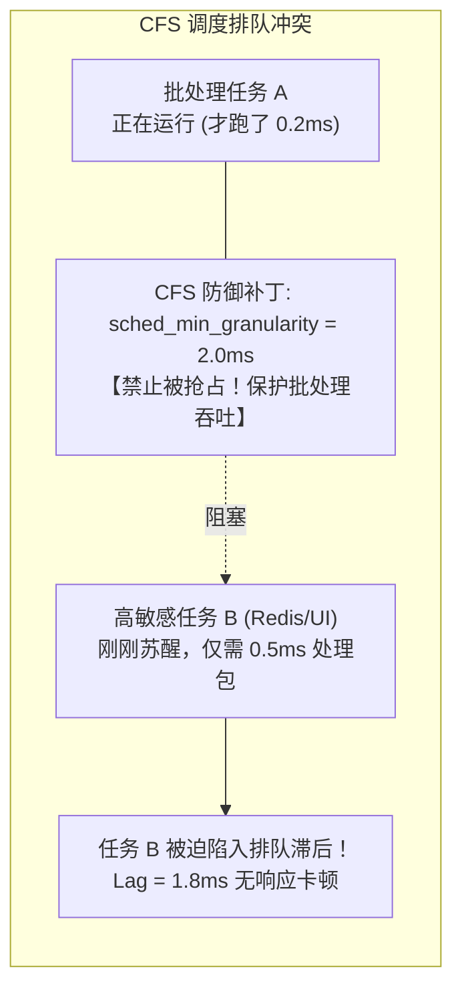
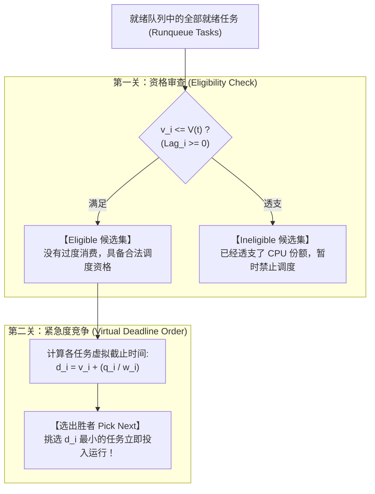

**TL;DR：** 2007 年 Linux 2.6.23 引入由 Ingo Molnar 设计的 **完全公平调度器（CFS, Completely Fair Scheduler）**，以红黑树维护虚拟运行时（`vruntime`），统治了 Linux 进程调度整整 16 年。然而，CFS 追求的是纯粹的**长周期吞吐公平（Throughput Fairness）**，缺乏“紧急程度（Urgency）”的物理维度。当一个极度敏感的交互式任务（如音频处理、游戏渲染或 Redis/epoll 网络收包事件循环）在短暂停顿后唤醒时，CFS 无法直接判定其急迫性，只能依赖一系列充斥着妥协的经验主义补丁（如 `sched_latency_ns`、`sched_min_granularity_ns` 与 `sched_wakeup_granularity_ns`），经常导致交互任务因防止批处理抖动的保护机制而被迫在队列中排队数毫秒（产生严重的卡顿掉帧）。Linux 6.6 迎来了历史性的一幕：内核大师 Peter Zijlstra 正式**将 CFS 拔除，全面切换为 EEVDF（Earliest Eligible Virtual Deadline First，最早具备资格虚拟截止时间优先）**。EEVDF 将调度空间正交解耦为两个纯数学维度：**资格（Eligibility，基于 Lag 判定是否欠你 CPU）** 与 **虚拟截止时间（Virtual Deadline，按申请切片长短排序急迫度）**。短任务无需任何经验补丁即可在数学上必然优先抢占，彻底消解了吞吐公平与毫秒级低延迟的千年死结。

---

## 一、 辉煌与死穴：CFS 16 年的“伪公平”与延迟代价

为了理解为什么内核必须痛下杀手重写核心调度器，我们必须先看清 CFS 的物理天花板。

```text
CFS 调度基本盘：
  每个就绪任务记录 vruntime（虚拟运行时）
    vruntime += 实际执行耗时 × (1024 / task_weight)
    
  调度决策：
    红黑树最左节点（rb_leftmost，即 vruntime 最小的任务）永远优先执行！
```

### 1.1 致命断层：吞吐公平 $\ne$ 响应及时

设想一台宿主机上同时运行着两个任务：
1. **任务 A（批处理后台任务）**：70B 大模型矩阵计算或 FFmpeg 视频转码，需要持续吃满 100% CPU，每次希望运行较长时间片（如 8ms）以减少上下文切换；
2. **任务 B（高频交互式服务）**：Redis 数据库的 epoll 事件循环或 WebRTC 实时音视频采集，90% 的时间在睡眠等待网络包，一旦网络中断到来，只需执行短短 **0.5ms** 的内存查表或音频编码，随后立即重新挂起。

在 CFS 体系下：
- 当任务 B 从睡眠中苏醒（Wakeup）时，按照原始逻辑，它的 `vruntime` 已经停滞了很久，远落后于系统当前时间。如果直接放行，它会长期霸占 CPU，打烂吞吐；
- CFS 引入了防御折中：将刚唤醒任务的 `vruntime` 强行拉平至 `min_vruntime` 附近；
- **排队灾难发生**：如果此时任务 A 刚刚获得 CPU 并执行了 0.2ms，CFS 预设的保护参数 `sched_min_granularity_ns`（例如默认 2.0ms，防止 CPU 缓存颠簸）会生效：
  **任务 B 即使优先级再高、耗时再短，也不能打断任务 A，必须在 Runqueue 中死等整整 1.8ms 直至当前时间片耗尽！**



### 1.2 启发式补丁的崩塌

16 年间，为了拯救交互式任务的延迟，内核黑客们向 CFS 堆叠了大量的“经验主义旋钮”：
- 调小 `sched_latency_ns`？会引发频繁的 Context Switch，批处理任务吞吐暴跌 30%；
- 调大 `sched_min_granularity_ns`？高频网络服务的 P99 尾延迟长尾直接爆表；
- 社区提出过庞大的“Latency Nice”补丁集，试图通过复杂的动态打分来感知交互任务，最终因为侵入性太强、充满未定义边界而被内核主线数次拒绝。

Peter Zijlstra 给出的裁决极其清醒：**CFS 的单一 `vruntime` 标量无法同时承载“长期公平分配”与“短期紧急插队”两个自由度。模型坏了，修补无用，必须换发动机。**

---

## 二、 EEVDF 的理论源头：双维度正交数学模型

EEVDF 的算法原型并非空中楼阁，而是源自 1995 年 Ion Stoica 与 Hussein Abdel-Wahab 发表的里程碑级论文：*《Earliest Eligible Virtual Deadline First: A Flexible and Accurate Mechanism for Proportional Share Resource Allocation》*。

EEVDF 将任务选择拆解为两个正交判断：
1. **你现在有没有资格拿 CPU？（Eligibility）**
2. **在所有有资格的任务中，谁最急迫？（Virtual Deadline）**



### 2.1 维度一：资格与滞后量（Lag）

定义全局系统虚拟时间为 $V(t)$，代表系统平均基准进展。每个任务拥有自身的虚拟时间 $v_i$ 与权重 $w_i$。

任务的**滞后量（Lag）** 定义为：
$$\text{Lag}_i = w_i \times (V(t) - v_i)$$

- **$\text{Lag}_i > 0$（欠你的）**：说明该任务此前在睡眠或被压制，它实际分得的 CPU 份额少于它应得的份额；
- **$\text{Lag}_i < 0$（你透支了）**：说明该任务此前在 CPU 上长时间狂奔，已经超前消费了未来份额。

**资格准则（Eligibility Rule）：**
一个任务具备调度资格（Eligible），**当且仅当 $v_i \le V(t)$（即 $\text{Lag}_i \ge 0$）**。超前透支的任务直接失去资格，直到系统全局时间 $V(t)$ 追平为止。

### 2.2 维度二：虚拟截止时间（Virtual Deadline）与请求时间片（Slice $q_i$）

这是 EEVDF 超越 CFS 的关键质变点！
每个任务在发起调度时，声明它本次希望运行的时间片大小 $q_i$（Quantum/Slice）：
$$\text{Virtual Deadline } d_i = v_i + \frac{q_i}{w_i}$$

#### 物理数学推演：
设当前 $V = 10.0$，两个任务的权重均为 $w = 1024$（基准 `nice 0`），两者都处于 $v_i = 10.0$ 的资格线上：
- **批处理任务 A（FFmpeg）**：需要大吞吐，分配默认切片 $q_A = 8.0\text{ms}$：
  $$d_A = 10.0 + \frac{8.0}{1024} = 10.007812$$
- **交互式任务 B（Redis epoll）**：高频小吞吐，分配极小切片 $q_B = 0.5\text{ms}$：
  $$d_B = 10.0 + \frac{0.5}{1024} = 10.000488$$

**核心裁决（Selection Rule）：**
$$d_B (10.000488) < d_A (10.007812)$$

在无需任何黑客补丁、无需等待 `sched_min_granularity` 超时的情况下，**调度器以纯数学不等式证明任务 B 的截止时间更早，任务 B 立即获得 CPU 优先权并瞬间完成执行！**

---

## 三、 内核红黑树增强：$O(\log N)$ 寻径算法

在 Linux 内核实现中，Runqueue 必须保证每秒百万级任务调度决策在几十纳秒内完成。

### 3.1 树结构的物理改造

在旧 CFS 中，红黑树的排序键是单一的 `vruntime`。但在 EEVDF 中：
- 我们不仅要找到 $v_i \le V$ 的 Eligible 节点；
- 还要在这些节点中找出 $d_i$ 最小的节点。

为了实现亚微秒级寻径，内核在 `kernel/sched/fair.c` 中使用了**增强型红黑树（Augmented Red-Black Tree）**：

```c
/* Linux 内核 sched_entity 关键扩展 */
struct sched_entity {
    struct load_weight  load;
    struct rb_node      run_node;
    u64                 vruntime;
    u64                 deadline;       /* EEVDF: 虚拟截止时间 d_i */
    u64                 min_deadline;   /* 以当前节点为根的整颗子树中的最小 deadline */
    /* ... */
};
```

每个红黑树节点在维护常规二叉平衡的同时，维护一个额外的元数据：`min_deadline`（当前节点自身及其所有子节点中最小的 deadline 值）。

### 3.2 查找最优任务的剪枝逻辑
1. 查找过程从根节点向下遍历；
2. 如果左子树的根节点 $v_{\text{left}} > V$，说明整颗左子树透支，向右寻找；
3. 利用节点的 `min_deadline` 快速做分支剪枝，无需遍历整颗红黑树；
4. **决策时间复杂度依旧稳定在 $O(\log N)$**，保持了与 CFS 相同的高效微秒级执行吞吐。

---

## 四、 本地确定性实验：CFS 唤醒延迟与 EEVDF 截止时间优先对比

本工程在 `experiments/linux-eevdf/sim.py` 中构建了调度模型，复现了 CFS 启发式颗粒度造成的强制排队延迟，并严密验证了 EEVDF 在双任务竞争下的截止时间优先判定与长期权重公平性。

### 4.1 运行复现命令

```bash
python3 experiments/linux-eevdf/sim.py
```

### 4.2 核心输出证据

```text
PASS CFS 启发式保护导致交互任务产生高达 1.8ms 排队延迟 | 1.8 ms
PASS 批处理任务符合 Eligible 资格
PASS 交互式任务符合 Eligible 资格
PASS 批处理任务虚拟截止时间计算正确 | 10.007812
PASS 交互式任务虚拟截止时间更早 | 10.000488 < 10.007812
PASS EEVDF 无需启发式调节，数学上必然优先调度交互式任务
PASS 长期调度下双方虚拟时间紧密跟随，无单边饿死
============================================================
ALL CHECKS PASSED: True (Total checks: 7)
============================================================
```

### 4.3 证据边界声明
- **本实验证明**：基于时间片切片 $q_i$ 动态计算虚拟截止时间，能够在数学上彻底解决小任务插队问题，且长期加权吞吐无偏置；
- **本实验不证明**：EEVDF 能够替代硬实时调度器（`SCHED_FIFO` / `SCHED_DEADLINE`）。它依然属于通用比例共享调度器，不提供微秒级硬实时确定性保障。

---

## 五、 总结与生产意义

Linux 内核在 6.6 版本以 EEVDF 替代 CFS，是近十年来操作系统核心子系统最重要的一次算法跃迁：

1. **彻底终结内核打补丁历史**：移除了数千行为了弥补 CFS 响应延迟而生硬拼凑的启发式调节代码，回归优美纯粹的数学理论；
2. **云原生与微服务受益显著**：对于运行在 Kubernetes 节点上、混部了批处理数据加工（如 Spark/PyTorch）与在线低延迟 RPC（如 gRPC / Redis / Envoy）的高并发主机，升级至 Linux 6.6+ 内核后，**在线网关服务的 P99 尾延迟通常能获得 10% ~ 30% 的天然改善**，掉帧与抖动显著减少。

---

## 参考资料与内核源码依据

1. **Peter Zijlstra (Linux Kernel Commit: `kernel/sched/fair.c`, Linux 6.6)** - EEVDF 调度器在 Linux 内核主线中的最终合入补丁集。
2. **Ion Stoica & Hussein Abdel-Wahab (1995)** - *"Earliest Eligible Virtual Deadline First: A Flexible and Accurate Mechanism for Proportional Share Resource Allocation"*, Technical Report TR-95-12, Old Dominion University.
3. **LWN.net: An EEVDF CPU scheduler for Linux (2023)** - 详细分析从 CFS 迁移至 EEVDF 的技术演进手记。
