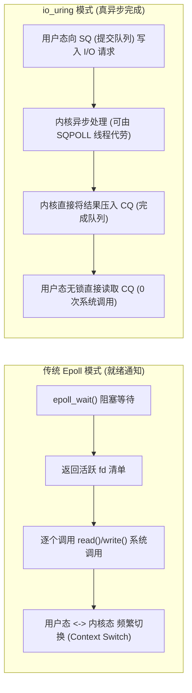
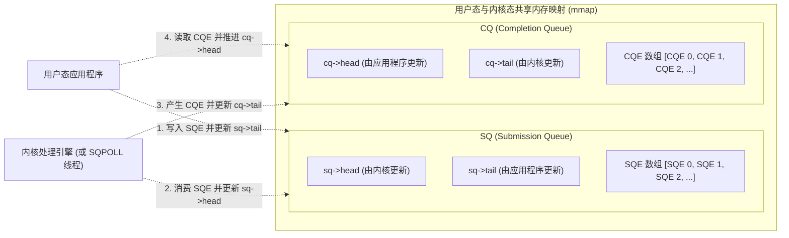
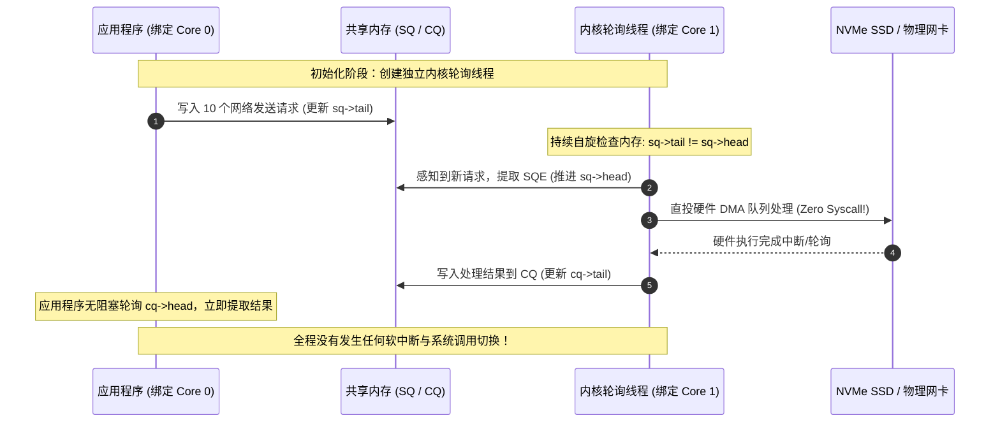
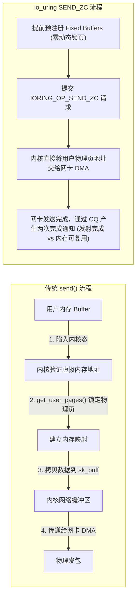

**TL;DR：** 2002 年引入的 `epoll` 统治了高性能 Linux 网络编程整整二十年，但它的本质是**同步就绪通知（Synchronous Readiness Notification）**：虽然能非阻塞通知套接字何时可读可写，但实际读取与写入依然必须通过 `read()` / `write()` 系统调用在用户态与内核态之间反复横跳，并在高频 I/O 下饱受 Spectre/Meltdown 硬件漏洞补丁带来的系统调用上下文切换惩罚。Linux 5.1 由 Jens Axboe 主导合并的 **io_uring** 彻底终结了这一范式，将模型彻底转向**真异步完成通知（True Asynchronous Completion）**。通过用户态与内核态共享的**单生产者单消费者（SPSC）无锁环形缓冲区**（提交队列 SQ 与完成队列 CQ），配合 **内核轮询线程（`IORING_SETUP_SQPOLL`）**，应用程序可以实现**“零系统调用（Zero-Syscall）”**的极致吞吐；而在 Linux 6.x 中演进的 **网络零拷贝发送（`IORING_OP_SEND_ZC`）** 与 **预注册固定缓冲区（Fixed Buffers）**，更是彻底绕过了内核页表锁定与中间内存拷贝，单核轻松突破数百万乃至千万级 IOPS。

---

## 一、面试切入：Epoll 这么强，为什么 Linux 还要造一个 io_uring？

> **面试高频考题：**  
> “Nginx、Netty、Redis 都是基于 Epoll 驱动的高并发典范。但在万兆网卡与 NVMe SSD 普及的今天，Epoll 模式在单机处理千万级 IOPS 时遭遇了哪些无法克服的物理瓶颈？io_uring 是如何通过共享内存无锁队列与 SQPOLL 从根本上终结系统调用开销的？”

回答这个问题的关键在于区分**“就绪模型（Readiness）”**与**“完成模型（Completion）”**的物理开销差距：



### 1.1 系统调用上下文切换的“沉重税收”
在 Epoll 架构中，一个完整的网络 I/O 至少需要两次跨特权级跳转：
1. 调用 `epoll_wait()` 获取就绪事件（用户态进入内核态，再返回用户态）；
2. 循环对就绪的 Socket 调用 `read()` 或 `write()`（每次都是一次完整的系统调用）。

自 2018 年 CPU 熔断（Meltdown）和幽灵（Spectre）硬件漏洞爆发后，操作系统开启了 KPTI（内核页表隔离）与分支预测隔离，**每次系统调用的开销从几十纳秒暴增至上百纳秒**。当面对每秒千万级的 I/O 请求时，CPU 有超过 60% 的时钟周期全部浪费在寄存器上下文保存、TLB 刷新与特权级切换上，真正处理业务逻辑的算力被严重挤压。

### 1.2 磁盘文件 I/O 的伪非阻塞陷阱
更致命的是，**Epoll 根本不支持常规磁盘文件的非阻塞异步操作**（对普通文件调用 `epoll_ctl` 会直接返回 `EPERM`）。在 Linux 原生 AIO（`io_submit`）极其挑剔（必须使用 `O_DIRECT`、严格内存对齐且不支持网络 Socket）的情况下，过去的 Web 服务器只能通过维持庞大的线程池来模拟异步磁盘读写，带来了高昂的线程上下文切换与内存开销。

**io_uring 的设计目标，就是提供一个统一磁盘与网络、统一读写与轮询、彻底消除系统调用壁垒的通用真异步运行时。**

---

## 二、双环形队列（SQ / CQ）的无锁共享内存拓扑

io_uring 的核心数据结构是两个建立在共享内存上的环形无锁队列（Ring Buffer）：
* **SQ（Submission Queue，提交队列）**：应用程序向其投递 I/O 请求条目（SQE, Submission Queue Entry）；
* **CQ（Completion Queue，完成队列）**：内核向其投递已完成的事件结果（CQE, Completion Queue Entry）。



### 2.1 为什么是单生产者单消费者（SPSC）？
在计算机并发理论中，多生产者多消费者（MPMC）队列需要极其复杂的 CAS 循环与内存屏障，开销巨大。
io_uring 巧妙地通过**所有权单向解耦**，将两个队列都设计为了 **单生产者单消费者（SPSC）** 模型：
* **SQ**：应用程序是唯一的生产者（更新 `sq->tail`），内核是唯一的消费者（更新 `sq->head`）；
* **CQ**：内核是唯一的生产者（更新 `cq->tail`），应用程序是唯一的消费者（更新 `cq->head`）。

因为生产者和消费者分别操作各自独立的游标变量，更新时**完全不需要加锁，只需配合轻量级的 CPU 内存屏障（Acquire/Release 语义）**，即可实现纳秒级的并发投递。

### 2.2 间接索引数组（SQ Array）的物理意义
细心的架构师会发现，应用程序更新 SQ 时，并不直接向环形数组填入 SQE，而是通过一个间接索引数组：
```c
struct io_sqring_offsets {
    __u32 head;
    __u32 tail;
    __u32 ring_mask;
    __u32 ring_entries;
    __u32 flags;
    __u32 array; // 间接索引数组偏移
};
```
* **原因**：为了让应用程序按任意顺序准备 SQE。SQE 本身可能是一个包含复杂缓冲区地址和文件描述符的 64 字节结构体，通过维护轻量级的 `array[index]`，应用可以零拷贝地复用预分配好的 SQE 槽位，避免在大块内存上发生数据复制。

---

## 三、SQPOLL 终极极速：零系统调用（Zero-Syscall）的黑魔法

在默认模式下，应用程序向 SQ 写入多个任务后，仍需调用一次 `io_uring_enter(fd, to_submit, min_complete, flags)` 通知内核开始干活。虽然相比传统模式（100 个请求需要 100 次系统调用）已经实现了百倍的微批聚合（Batching），但依然存在 1 次系统调用的开销。

如果追求极限的每秒千万级 IOPS，必须开启 **`IORING_SETUP_SQPOLL`** 特性。



### 3.1 SQPOLL 的工作机制
当配置了 `IORING_SETUP_SQPOLL` 标志位后，内核会在后台启动一个专用内核线程（名字形如 `iou-sqp-<pid>`）：
1. 该线程死循环自旋轮询（Spin-polling）共享内存中的 `sq->tail`；
2. 一旦应用程序在用户态写入新 SQE 并修改 `tail` 指针，内核线程**在纳秒级时间内直接捕获并提交给硬件**；
3. **应用程序无需调用任何 `io_uring_enter` 系统调用！** 生产端写内存，消费端读内存，系统调用次数直接降为绝对的 **0 次**。

### 3.2 节能与自旋超时（`sq_thread_idle`）
如果系统一直没有新 I/O，内核线程白白空转会烧死 100% 的单核 CPU。
因此，io_uring 引入了自旋空闲超时参数 `sq_thread_idle`（例如设为 2000 毫秒）：
* 若在规定时间内没有任何新请求写入，SQPOLL 线程会自动进入休眠状态；
* 此时共享内存中的 `flags` 会被标记为 `IORING_SQ_NEED_WAKEUP`；
* 应用程序在下次投递时检测到该标志，只需主动调用一次 `io_uring_enter(..., IORING_ENTER_SQ_WAKEUP)` 将其唤醒，随后系统再次进入纯内存零系统调用状态。

---

## 四、网络零拷贝演进：从 Fixed Buffers 到 IORING_OP_SEND_ZC

在万兆（10Gbps）乃至百兆（100Gbps）网络高并发场景下，内存拷贝与页表锁定的开销甚至超越了协议栈解析本身。



### 4.1 预注册固定缓冲区（Fixed Buffers）
传统 I/O 每次发起读写时，内核必须调用 `get_user_pages()` 临时将用户态虚拟内存锁死在物理内存中（Pinning Pages），防止被 OS 交换（Swap）或分页迁移，操作完成后再解封。
* **io_uring 的破局策略**：通过 `io_uring_register(ring, IORING_REGISTER_BUFFERS, ...)` 预先向内核注册一块长生命周期的固定内存池；
* 内核在初始化时**一次性完成物理页锁定与地址映射**；
* 后续所有的读写请求只需传递轻量级的缓冲区数组索引（Buffer Index），彻底消除了运行时的锁页与页表遍历开销。

### 4.2 真正的零拷贝发送：`IORING_OP_SEND_ZC`
Linux 6.0 引入了针对网络的真正零拷贝发送原语 `IORING_OP_SEND_ZC`：
1. **完全旁路内核拷贝**：数据不经过中间 `sk_buff` 内存池中转，网卡通过 DMA 散布收集（Scatter-Gather）直接从用户态物理内存拉取数据；
2. **两阶段 CQE 通知机制**：
   * **CQE 1（F_MORE 标志）**：通知应用层数据包已经成功封装并交给网卡驱动，应用可以继续处理逻辑；
   * **CQE 2（最终通知）**：网卡硬件发出 DMA 完成中断，确认该物理内存段已被网卡完全消费，应用层方可安全地覆写或释放该缓冲区内存。

---

## 五、生产级 C 语言极速回显服务实战

下面基于官方标准的 `liburing` 库，实现一个支持高并发、完全基于双环形队列驱动的异步 TCP 服务器核心框架。

```c
// io_uring_echo_server.c
#include <stdio.h>
#include <stdlib.h>
#include <string.h>
#include <unistd.h>
#include <netinet/in.h>
#include <liburing.h>

#define QUEUE_DEPTH 512
#define BUF_SIZE 2048

enum {
    EVENT_TYPE_ACCEPT = 0,
    EVENT_TYPE_READ,
    EVENT_TYPE_WRITE,
};

struct conn_info {
    int fd;
    int type;
    char buffer[BUF_SIZE];
    int len;
};

void add_accept(struct io_uring *ring, int server_fd, struct sockaddr_in *client_addr, socklen_t *client_len) {
    struct io_uring_sqe *sqe = io_uring_get_sqe(ring);
    io_uring_prep_accept(sqe, server_fd, (struct sockaddr *)client_addr, client_len, 0);
    
    struct conn_info *conn = malloc(sizeof(struct conn_info));
    conn->fd = server_fd;
    conn->type = EVENT_TYPE_ACCEPT;
    io_uring_sqe_set_data(sqe, conn);
}

void add_read(struct io_uring *ring, int client_fd) {
    struct io_uring_sqe *sqe = io_uring_get_sqe(ring);
    struct conn_info *conn = malloc(sizeof(struct conn_info));
    conn->fd = client_fd;
    conn->type = EVENT_TYPE_READ;
    
    io_uring_prep_recv(sqe, client_fd, conn->buffer, BUF_SIZE, 0);
    io_uring_sqe_set_data(sqe, conn);
}

void add_write(struct io_uring *ring, int client_fd, char *buf, int len) {
    struct io_uring_sqe *sqe = io_uring_get_sqe(ring);
    struct conn_info *conn = malloc(sizeof(struct conn_info));
    conn->fd = client_fd;
    conn->type = EVENT_TYPE_WRITE;
    memcpy(conn->buffer, buf, len);
    conn->len = len;

    // 使用高阶零拷贝发送原语（若内核不支持可回退到 prep_send）
    io_uring_prep_send_zc(sqe, client_fd, conn->buffer, len, 0, 0);
    io_uring_sqe_set_data(sqe, conn);
}

int main() {
    int server_fd;
    struct sockaddr_in server_addr, client_addr;
    socklen_t client_len = sizeof(client_addr);
    struct io_uring ring;

    // 1. 初始化 io_uring，请求 SQPOLL 特性绑定特定 CPU
    struct io_uring_params params;
    memset(&params, 0, sizeof(params));
    params.flags = IORING_SETUP_SQPOLL;
    params.sq_thread_idle = 2000; // 空闲 2s 后休眠
    
    if (io_uring_queue_init_params(QUEUE_DEPTH, &ring, &params) < 0) {
        perror("io_uring_queue_init_params failed, fallback to default");
        io_uring_queue_init(QUEUE_DEPTH, &ring, 0);
    }

    // 2. 创建监听 Socket
    server_fd = socket(AF_INET, SOCK_STREAM, 0);
    int opt = 1;
    setsockopt(server_fd, SOL_SOCKET, SO_REUSEADDR, &opt, sizeof(opt));
    
    memset(&server_addr, 0, sizeof(server_addr));
    server_addr.sin_family = AF_INET;
    server_addr.sin_addr.s_addr = INADDR_ANY;
    server_addr.sin_port = htons(8080);
    bind(server_fd, (struct sockaddr *)&server_addr, sizeof(server_addr));
    listen(server_fd, SOMAXCONN);

    // 3. 提交初始 Accept 事件
    add_accept(&ring, server_fd, &client_addr, &client_len);
    io_uring_submit(&ring);

    printf("io_uring 极速异步服务器已启动，监听端口 8080...\n");

    // 4. 事件主循环：纯用户态无锁消费 CQ
    while (1) {
        struct io_uring_cqe *cqe;
        int ret = io_uring_wait_cqe(&ring, &cqe);
        if (ret < 0) break;

        struct conn_info *conn = (struct conn_info *)io_uring_cqe_get_data(cqe);
        int res = cqe->res;

        if (conn->type == EVENT_TYPE_ACCEPT) {
            int client_fd = res;
            if (client_fd >= 0) {
                add_read(&ring, client_fd);
            }
            // 重新注册 Accept 循环监听
            add_accept(&ring, server_fd, &client_addr, &client_len);
            free(conn);
        } else if (conn->type == EVENT_TYPE_READ) {
            if (res > 0) {
                // 收到客户端数据，回写数据
                add_write(&ring, conn->fd, conn->buffer, res);
                free(conn);
            } else {
                // 客户端断开连接
                close(conn->fd);
                free(conn);
            }
        } else if (conn->type == EVENT_TYPE_WRITE) {
            // 写操作完成，重新开启读监听
            add_read(&ring, conn->fd);
            free(conn);
        }

        // 推进 CQ 队列游标，释放完成条目
        io_uring_cqe_seen(&ring, cqe);
        // 提交累积的 SQE（SQPOLL 激活时此调用近乎免系统调用）
        io_uring_submit(&ring);
    }

    io_uring_queue_exit(&ring);
    close(server_fd);
    return 0;
}
```

---

## 六、架构决策矩阵：Epoll vs Linux AIO vs io_uring

| 性能与功能指标 | 传统 Epoll 架构 | POSIX / Linux 原生 AIO | io_uring 异步架构（推荐） |
| :--- | :--- | :--- | :--- |
| **编程模型范式** | 同步就绪（Readiness） | 异步提交（仅限特定文件） | **全功能真异步（Completion）** |
| **网络 Socket 支持** | 完美支持（基于 fd 监听） | **不支持**（只能处理磁盘文件） | **完美支持（统一 Socket 与磁盘文件）** |
| **常规磁盘文件支持** | **不支持**（必须借由线程池）| 极其苛刻（必须 `O_DIRECT` + 对齐） | **原生支持（带 PageCache 异步读写）** |
| **系统调用开销** | 高（每轮 I/O 至少两次特权切换）| 中等（每次提交 `io_submit` 仍需切态）| **极限为 0（SQPOLL 内存轮询直投）** |
| **零拷贝支持能力** | 依赖 `sendfile`/`splice`（管道绑定）| 无（仅支持直接 I/O） | **原生 `SEND_ZC` + 注册固定内存池** |
| **单核极限吞吐能力** | ~ 80万 QPS (遭遇系统调用瓶颈) | ~ 120万 IOPS | **> 300万~500万 IOPS (万兆线速极限)** |

---

## 七、总结与生产排障 Checklist

io_uring 是 Linux 过去二十年在操作系统内核 I/O 领域发生的最深刻的革命。它不仅终结了系统调用的性能税，更将内核与用户态的交互范式由“被动请求”转变为“基于共享内存的高速流水线”。

在将 io_uring 引入高并发生产系统时，架构师必须牢记以下核心检查项：
- [ ] 宿主机 Linux 内核版本是否在 **5.10+（基础稳定）** 或 **6.1+（支持 SEND_ZC 与高级网络特性）**？
- [ ] 开启 `IORING_SETUP_SQPOLL` 时，是否对内核轮询线程进行了专用 CPU 核心绑定（Core Pinning），避免与应用业务线程发生 CFS/EEVDF 调度争用？
- [ ] 是否在高吞吐场景下使用 `IORING_REGISTER_FILES` 预注册文件描述符，避免高频加减引用计数（Atomic Refcount）锁争用？
- [ ] 是否根据最长并发网络连接数精确计算了 `QUEUE_DEPTH`，防止突发流量导致 SQ 队列溢出（返回 `-EBUSY`）？
- [ ] 使用 `IORING_OP_SEND_ZC` 时，内存管理是否严格遵循了两阶段 CQE 完成信令，坚决杜绝缓冲区被提前复写导致数据包损毁？

---

## 参考资料

1. **Jens Axboe**: *Efficient IO with io_uring (Kernel.org Documentation)*.
2. **Linux Kernel Source**: `fs/io_uring.c` & `include/uapi/linux/io_uring.h`.
3. **Pavel Begunkov (Meta)**: *Zero-copy networking with io_uring (Linux Plumbers Conference 2022)*.
4. **Brendan Gregg**: *Systems Performance: Enterprise and the Cloud (2nd Edition)*.
