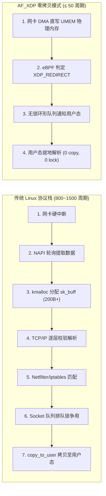
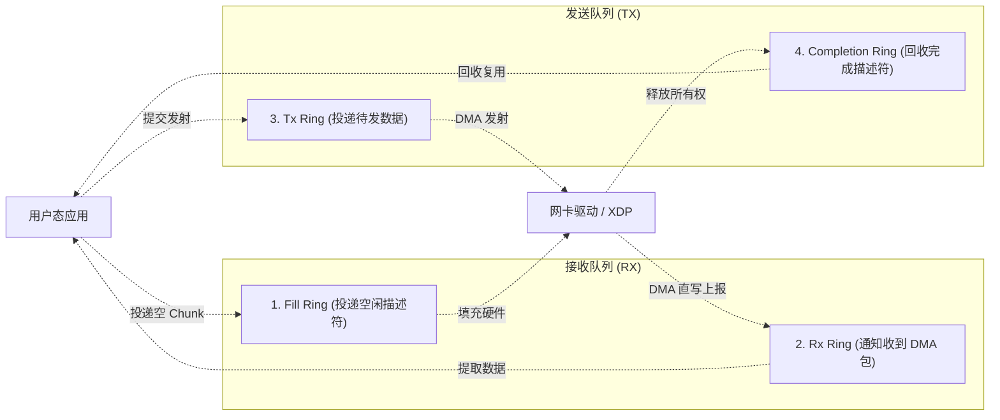
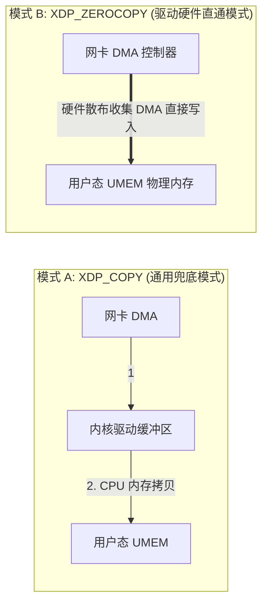

**TL;DR：** 在 40Gbps / 100Gbps 骨干网络中，当面临由 64 字节小包构成的极端流量洪峰时，线速包处理速率可高达数千万 PPS（Packet Per Second）。传统的 Linux 协议栈在此场景下会彻底崩溃：每秒数千万次的 `sk_buff` 内存分配、Netfilter 过滤、TCP/IP 协议栈分层解析以及用户态内存拷贝，会使 CPU 100% 锁死在软中断（`ksoftirqd`）与内存争用上。长期以来，工业界不得不拥抱 **DPDK（Data Plane Development Kit）** 进行完全的用户态内核旁路，但代价是彻底丢失了 Linux 丰富的工具链、容器网络与安全隔离生态。Linux 4.18 引入、并在 5.x/6.x 达到成熟的 **AF_XDP（XSK）** 是内核给出的终极破局方案：通过在网卡驱动层挂载 **eBPF `XDP_REDIRECT`** 动作，配合预分配的 **UMEM（用户态连续内存块）** 与 **四套单生产者单消费者（SPSC）环形队列**，数据包无需经过任何协议栈和内存拷贝，由网卡 DMA 直接送入用户态内存，兼顾了与 DPDK 旗鼓相当的千万级 PPS 线速处理能力与标准 Linux 的安全运维生态。

---

## 一、面试切入：面对 1500万 PPS 洪峰，为什么传统网络协议栈直接死锁？

> **面试高频考题：**  
> “在 10Gbps 网络下传输 1500 字节的大包，每秒仅需处理约 80 万个数据包；但在 100Gbps 数据中心互联或遭遇 64 字节小包 DDoS 攻击时，每秒包速率轻松突破 1400 万至 3000 万 PPS。通用 Linux 内核网络协议栈在此极限场景下的瓶颈究竟在哪里？为什么 DPDK 被逐渐冷落，而 AF_XDP 正在成为下一代高性能软交换机与网关（如 Cilium、Envoy）的标配？”

要回答这个问题，必须先算一笔**硬件时钟周期（CPU Cycles）的物理账**：

```text
算力预算精算：
  单核 CPU 主频：3.0 GHz = 每秒 3,000,000,000 个时钟周期
  目标吞吐：14.88 Mpps (10Gbps 下 64 字节线速全满)
  
  每个数据包允许消耗的最大时钟周期：
    3,000,000,000 / 14,880,000 ≈ 201 个 CPU 周期！
```

**201 个 CPU 周期意味着什么？**
一次主内存访问（DRAM Cache Miss）的延迟就高达 **150~200 个周期**！换句话说：**只要内核代码在处理一个包时发生了一次 CPU 缓存缺失（Cache Miss），或者执行了一次自旋锁争用，线速处理的物理预算就已消耗殆尽**。



### 1.1 `sk_buff` 内存元数据税
每个进入 Linux 协议栈的报文，必须由内核动态为其分配一个 `struct sk_buff`。该结构体包含数十个指针和标志位（体积超过 200 字节）。在千万级 PPS 下，`kmem_cache_alloc` 的高频分配与回收引发严重的 Slab 锁争用和缓存行抖动，直接将 CPU 拖垮。

### 1.2 软中断与上下文切换暴风雨
海量小包引发内核软中断 `ksoftirqd` 持续占满 100% CPU，用户态应用程序甚至根本无法获得调度时间片，导致网络接收队列（`netdev_max_backlog`）迅速溢出丢包。

---

## 二、AF_XDP 核心架构：UMEM 与四环协同的第一性原理

AF_XDP 的核心哲学是：**完全不碰 `sk_buff`，内存在初始化时一次性分配，控制流完全基于无锁环形队列**。

其底层由一块预先分配的物理连续内存池 **UMEM** 和四个无锁 SPSC（单生产者单消费者）环形队列构成。



### 2.1 连续内存池 UMEM
UMEM（User Memory）是应用程序通过 `malloc` 或 `mmap` 分配的一块大页连续内存，然后通过 `setsockopt(xsk_fd, SOL_XDP, XDP_UMEM_REG, ...)` 注册给内核。
* UMEM 被等分为数千个固定大小的 **Chunk**（通常为 2048 或 4096 字节，匹配一个网络帧的最大传输单元 MTU）；
* 在整个数据收发生命周期中，**内存永远不会被释放回操作系统，只是 Chunk 的使用权在用户态与内核之间流转**。

### 2.2 四大环形队列的协同拓扑

| 队列名称 | 方向（生产者 -> 消费者）| 队列内容 | 核心物理功能 |
| :--- | :--- | :--- | :--- |
| **Fill Ring** | 用户态应用 $\to$ 内核驱动 | UMEM 内存地址偏移（`__u64 addr`）| **向网卡“供粮”**：告诉网卡驱动当前有哪些空闲的 UMEM Chunk 可以用来接收下行数据。没有它网卡就会触发 OOM 丢包。 |
| **Rx Ring** | 内核驱动 $\to$ 用户态应用 | 帧元数据（`addr`、`len`、`options`）| **通知收包**：网卡 DMA 将网络数据写入特定 Chunk 后，通知应用层数据包已就绪，应用可就地解析。 |
| **Tx Ring** | 用户态应用 $\to$ 内核驱动 | 待发帧元数据（`addr`、`len`） | **提交发包**：应用层将业务数据填充在某个 Chunk 后，将描述符压入此队列，通知驱动准备硬件 DMA 发射。 |
| **Completion Ring** | 内核驱动 $\to$ 用户态应用 | 已完成的 Chunk 地址（`addr`） | **回收凭证**：网卡 DMA 发射完毕后，通知应用层该 Chunk 的内存已不再被硬件引用，可以重新投入使用。 |

---

## 三、驱动层零拷贝（Zero-Copy）vs 拷贝模式（Copy Mode）

AF_XDP 支持两种工作模式，其性能表现有数量级差距：



### 3.1 零拷贝驱动模式（Zero-Copy Mode）
* **物理机制**：网卡驱动直接将用户态 UMEM 的物理页地址配置到网卡硬件的 **Rx Descriptor Ring（接收描述符环）** 中。当物理信号到达网卡 PHY 芯片后，网卡板载 DMA 控制器**直接穿透 PCI-e 总线，将报文写入应用程序预设的 UMEM 物理页**！
* **性能表现**：CPU 完全不参与任何字节搬运，单核包处理吞吐可达 **1000万~1500万 PPS**（直接拉满硬件极限）。
* **驱动要求**：需要物理网卡驱动的原生支持（如 Intel `i40e`、`ice`、Mellanox `mlx5`、VirtIO-Net 等）。

### 3.2 拷贝模式（Copy Mode / SKB Mode）
* **物理机制**：如果服务器使用的是老旧网卡或驱动不支持 XDP 零拷贝，AF_XDP 会自动降级为拷贝模式。网卡先将报文 DMA 到内核驱动缓冲区，随后由内核 CPU 将数据通过 `memcpy` 拷贝进 UMEM。
* **性能表现**：受限于 CPU 内存带宽，吞吐量约为 **200万~400万 PPS**，但其优势是**能在任何虚拟化网卡或旧硬件上无痛开箱即用**。

---

## 四、eBPF 驱动层转发胶水：`XDP_REDIRECT`

要把进入网卡的数据包导入特定的 AF_XDP 套接字，必须在网卡驱动层挂载一段极简的 eBPF 程序：

```c
// xdp_redirect_kern.c
#include <linux/bpf.h>
#include <bpf/bpf_helpers.h>

// 定义一个 XSK（AF_XDP Socket）专用的 BPF Map
struct {
    __uint(type, BPF_MAP_TYPE_XSKMAP);
    __uint(max_entries, 64);
    __type(key, __u32);   // 网卡 RX 队列 ID
    __type(value, __u32); // AF_XDP 套接字的文件描述符
} xsks_map SEC(".maps");

SEC("xdp")
int xdp_sock_prog(struct xdp_md *ctx) {
    __u32 index = ctx->rx_queue_index;

    // 检查该网卡队列是否有绑定的 AF_XDP 监听套接字
    if (bpf_map_lookup_elem(&xsks_map, &index)) {
        // 直接触发零拷贝重定向！旁路后续所有内核协议栈
        return bpf_redirect_map(&xsks_map, index, 0);
    }

    // 未绑定的队列放行回内核传统协议栈
    return XDP_PASS;
}

char _license[] SEC("license") = "GPL";
```

这段 eBPF 字节码在网卡 NAPI 轮询中执行耗时仅需 **几个纳秒**。它直接从上下文提取网卡硬件队列 ID，查表后返回 `XDP_REDIRECT`，彻底截断了系统向 `sk_buff` 演进的路径。

---

## 五、生产级 C 语言极速软交换机实现（MAC 交换反发）

下面基于官方标准的 `libbpf` 与 `libxdp`，实现一个将收到的二层数据包快速交换源/目的 MAC 地址并原路回发的千兆/万兆软交换机内核。

```c
// af_xdp_softswitch.c
#include <stdio.h>
#include <stdlib.h>
#include <string.h>
#include <unistd.h>
#include <signal.h>
#include <poll.h>
#include <net/if.h>
#include <arpa/inet.h>
#include <linux/if_link.h>
#include <linux/if_xdp.h>
#include <xdp/xsk.h>
#include <xdp/libxdp.h>

#define NUM_FRAMES 4096
#define FRAME_SIZE XSK_UMEM__DEFAULT_FRAME_SIZE // 4096
#define BATCH_SIZE 64

struct xsk_umem_info {
    struct xsk_ring_prod fq;
    struct xsk_ring_cons cq;
    struct xsk_umem *umem;
    void *buffer;
};

struct xsk_socket_info {
    struct xsk_ring_cons rx;
    struct xsk_ring_prod tx;
    struct xsk_socket *xsk;
    struct xsk_umem_info *umem;
};

static volatile int global_exit = 0;
void sig_handler(int sig) { global_exit = 1; }

// 交换以太网帧头部的源 MAC 与目的 MAC
static void swap_mac_addresses(void *pkt_data) {
    unsigned char *eth = (unsigned char *)pkt_data;
    unsigned char tmp[6];
    memcpy(tmp, eth, 6);       // 保存目的 MAC
    memcpy(eth, eth + 6, 6);   // 源 MAC 覆写到目的 MAC
    memcpy(eth + 6, tmp, 6);   // 临时暂存覆写到源 MAC
}

int main(int argc, char **argv) {
    if (argc < 2) {
        printf("Usage: %s <ifname>\n", argv[0]);
        return 1;
    }
    const char *ifname = argv[1];
    int ifindex = if_nametoindex(ifname);

    // 1. 分配并注册 UMEM 连续内存池
    struct xsk_umem_info *umem_info = calloc(1, sizeof(*umem_info));
    size_t umem_size = NUM_FRAMES * FRAME_SIZE;
    posix_memalign(&umem_info->buffer, getpagesize(), umem_size);

    struct xsk_umem_config umem_cfg = {
        .fill_size = NUM_FRAMES,
        .comp_size = NUM_FRAMES,
        .frame_size = FRAME_SIZE,
        .frame_headroom = XSK_UMEM__DEFAULT_FRAME_HEADROOM,
        .flags = 0
    };
    xsk_umem__create(&umem_info->umem, umem_info->buffer, umem_size,
                     &umem_info->fq, &umem_info->cq, &umem_cfg);

    // 2. 初始化 Fill Ring：预先向内核填充所有空闲 Chunk
    uint32_t fq_idx;
    xsk_ring_prod__reserve(&umem_info->fq, NUM_FRAMES, &fq_idx);
    for (int i = 0; i < NUM_FRAMES; i++) {
        *xsk_ring_prod__fill_addr(&umem_info->fq, fq_idx++) = i * FRAME_SIZE;
    }
    xsk_ring_prod__submit(&umem_info->fq, NUM_FRAMES);

    // 3. 创建 AF_XDP Socket 并绑定网卡队列 0 (请求零拷贝模式)
    struct xsk_socket_info *xsk_info = calloc(1, sizeof(*xsk_info));
    xsk_info->umem = umem_info;

    struct xsk_socket_config xsk_cfg = {
        .rx_size = NUM_FRAMES,
        .tx_size = NUM_FRAMES,
        .libxdp_flags = XSK_LIBXDP_FLAGS__INHIBIT_PROG_LOAD,
        .xdp_flags = XDP_FLAGS_UPDATE_IF_NOEXIST | XDP_FLAGS_DRV_MODE, // 强制尝试驱动驱动零拷贝
        .bind_flags = XDP_USE_NEED_WAKEUP | XDP_ZEROCOPY
    };

    int ret = xsk_socket__create(&xsk_info->xsk, ifname, 0,
                                 umem_info->umem, &xsk_info->rx,
                                 &xsk_info->tx, &xsk_cfg);
    if (ret) {
        printf("无法开启驱动零拷贝模式，回退到 COPY 模式...\n");
        xsk_cfg.bind_flags = XDP_COPY;
        xsk_socket__create(&xsk_info->xsk, ifname, 0,
                           umem_info->umem, &xsk_info->rx,
                           &xsk_info->tx, &xsk_cfg);
    }

    signal(SIGINT, sig_handler);
    printf("AF_XDP 千万级线速交换机已就绪，绑定网卡: %s (Queue: 0)...\n", ifname);

    // 4. 高性能批处理主循环 (Batching Processing Loop)
    while (!global_exit) {
        uint32_t rx_idx, tx_idx;
        // 尝试从 Rx 队列批量提取数据帧
        unsigned int rcvd = xsk_ring_cons__peek(&xsk_info->rx, BATCH_SIZE, &rx_idx);
        if (!rcvd) {
            // 没有数据包到达时，按需调用 poll 让出 CPU 或等待唤醒
            struct pollfd pfd = { .fd = xsk_socket__fd(xsk_info->xsk), .events = POLLIN };
            poll(&pfd, 1, 10);
            continue;
        }

        // 向 Tx 队列申请相同批次的发送槽位
        while (xsk_ring_prod__reserve(&xsk_info->tx, rcvd, &tx_idx) < rcvd) {
            // 若 Tx 队列满，触发发送并等待内核回收
            sendto(xsk_socket__fd(xsk_info->xsk), NULL, 0, MSG_DONTWAIT, NULL, 0);
        }

        // 核心转发逻辑：内存就地 MAC 调换并重定向至 Tx
        for (unsigned int i = 0; i < rcvd; i++) {
            const struct xdp_desc *desc = xsk_ring_cons__rx_desc(&xsk_info->rx, rx_idx++);
            uint64_t addr = desc->addr;
            uint32_t len = desc->len;

            void *pkt = xsk_umem__get_data(umem_info->buffer, addr);
            swap_mac_addresses(pkt); // 极速就地修改

            // 填充待发送描述符
            struct xdp_desc *tx_desc = xsk_ring_prod__tx_desc(&xsk_info->tx, tx_idx++);
            tx_desc->addr = addr;
            tx_desc->len = len;
        }

        // 提交 Tx 与 Rx 消费进度
        xsk_ring_prod__submit(&xsk_info->tx, rcvd);
        xsk_ring_cons__release(&xsk_info->rx, rcvd);

        // 触发硬件网卡立刻发送
        sendto(xsk_socket__fd(xsk_info->xsk), NULL, 0, MSG_DONTWAIT, NULL, 0);
    }

    printf("安全退出并清理资源...\n");
    xsk_socket__delete(xsk_info->xsk);
    xsk_umem__delete(umem_info->umem);
    free(umem_info->buffer);
    return 0;
}
```

---

## 六、架构决策矩阵：标准 Linux Socket vs DPDK vs AF_XDP

| 评价维度 | 标准 Linux 套接字 (RAW/PACKET) | Intel DPDK 完全旁路架构 | AF_XDP (XSK) 混合旁路架构（推荐） |
| :--- | :--- | :--- | :--- |
| **小包极限吞吐 (64B)** | ~ 120万 PPS (内核协议栈瓶颈) | **> 1400万 PPS (全满线速)** | **> 1200万~1400万 PPS (贴近物理极限)** |
| **CPU 占用模式** | 随流量线性上升 (软中断高) | **100% 独占自旋 (极度耗电)** | **支持中断与 `NEED_WAKEUP` 弹性睡眠** |
| **Linux 生态与工具兼容** | 完美兼容 (`tcpdump`, `iptables`) | **彻底破坏 (网卡被独占，工具失效)**| **完美兼容 (基于标准网卡与 BPF 过滤)** |
| **驱动与硬件依赖性** | 无 (所有硬件通用) | 必须使用专有 PMD 轮询驱动 | **支持通用模式，且主流网卡自带零拷贝** |
| **容器与多租户隔离** | 良好 (依托 Linux 网络命名空间) | 极差 (内存难以安全切分给容器) | **优异 (XSK 套接字可直接传入 Pod 容器)** |

---

## 七、总结与生产调优 Checklist

AF_XDP 代表了 Linux 内核网络在超高速硬件时代的自我救赎。它既没有走向 DPDK 彻底抛弃操作系统的死胡同，也没有固步自封在缓慢的传统协议栈中，而是通过 eBPF 与 UMEM 无锁环形队列在驱动层开辟了一条“硬件直通”的高速通道。

在将 AF_XDP 应用于万兆软交换、极速四层负载均衡（L4LB）或网关时，必须核对以下核心调优指标：
- [ ] 物理网卡是否已开启 **多队列（RSS, Receive Side Scaling）**，并将网卡队列与 CPU 物理核心实现 1:1 亲和性绑定（Core Pinning）？
- [ ] 是否在生产配置中启用了 **大页内存（HugePages, 2MB）** 来分配 UMEM，减少高频大范围随机寻址带来的 TLB Miss？
- [ ] 检查网卡驱动日志，确保套接字成功工作在 `XDP_ZEROCOPY` 模式，而非意外降级为性能大幅缩水 70% 的 `XDP_COPY` 模式？
- [ ] 系统是否配置了 `XDP_USE_NEED_WAKEUP` 标志位，避免在无流量时无谓耗尽 CPU 周期？
- [ ] 网卡 Ring Buffer 大小（`ethtool -G eth0 rx 4096 tx 4096`）是否已调整至硬件最大值，防止极微突发（Microburst）导致网卡硬件丢包？

---

## 参考资料

1. **Björn Töpel & Magnus Karlsson (Intel)**: *Accelerating Linux Networking with AF_XDP (Linux Plumbers 2018)*.
2. **Linux Kernel Documentation**: `Documentation/networking/af_xdp.rst`.
3. **Cilium Project Architecture**: High-Performance Data Path with AF_XDP.
4. **IETF RFC 2544**: *Benchmarking Methodology for Network Interconnect Devices*.
