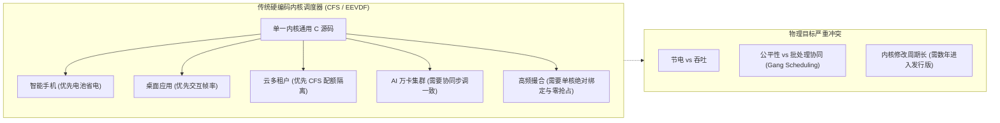
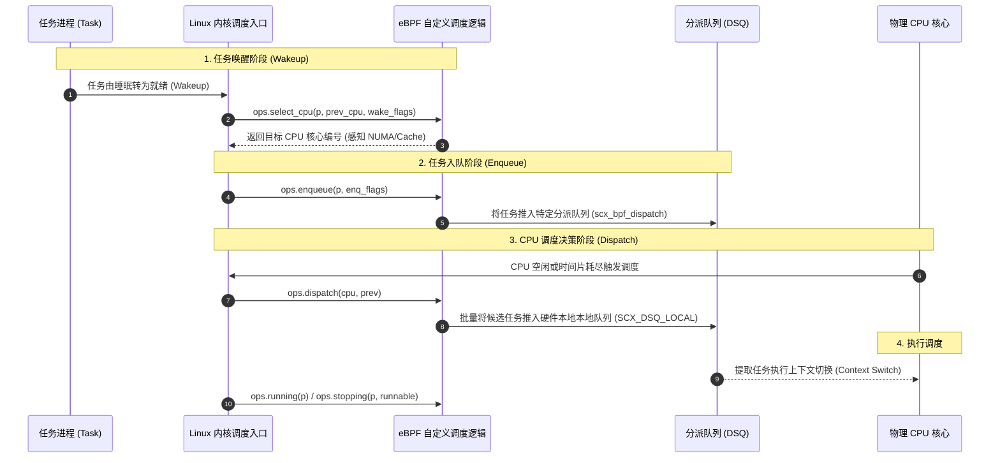
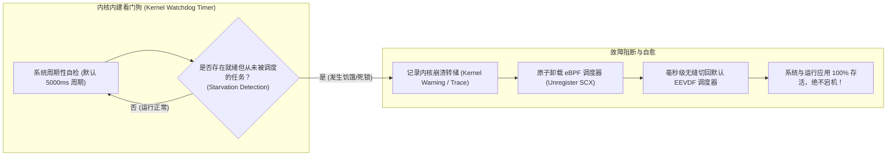

**TL;DR：** 长期以来，Linux 的 CPU 进程调度器（从 O(1)、CFS 到最新的 EEVDF）都是硬编码在内核 C 代码中的**中心化单体黑盒**。然而，一个必须同时兼容手机、笔记本、云原生多租户和超算的通用调度器，在面对特定极端工作负载时必然面临物理妥协：在**AI 大模型分布式训练**中，单卡因未同步调度落后几毫秒会导致万卡集群触发 NCCL 慢节点级联雪崩；在**超低延迟金融交易**中，通用的动态时间片分配会破坏确定性。Linux 6.12 迎来了三十年来进程调度领域最激进的代际革命——由 Meta 团队主导的 **sched_ext（简称 SCX）正式合并进内核主线**。通过 SCX，开发者**无需重新编译内核或重启机器，只需通过 eBPF 即可动态加载、热插拔自定义 CPU 调度器**。配合内核内置的**安全看门狗（Watchdog）与自动回退保护机制**，现代系统第一次实现了将算力调度权完全下放给特定应用场景的终极解耦。

---

## 一、面试切入：刚有了 EEVDF，Linux 为什么还要合并 sched_ext？

> **面试高频考题：**  
> “Linux 6.6 刚刚用 EEVDF 废弃了服役 16 年的 CFS，为什么紧接着在 Linux 6.12 中又合并了庞大的 sched_ext（SCX）子系统？通用调度器的物理天花板到底在哪里？为什么 Meta、Google 和 Valve 会不遗余力地推动允许普通工程师用 eBPF 重写内核调度策略？”

回答的核心在于理解**“通用调度器的帕累托困境（General-purpose Pareto Dilemma）”**：



### 1.1 通用调度器的“众口难调”
Linux 内核维护者在调整通用调度算法时，往往改动一行代码就会引发激烈的争吵：
* 将时间片调小以降低音频渲染的卡顿延迟，会导致后台编译任务的上下文切换增加 15%，吞吐暴跌；
* 为大核/小核架构（ARM big.LITTLE）优化迁移策略，会导致超算 NUMA 架构上的内存亲和性被破坏；
* 为云原生容器加入更严格的 CPU 带宽限制（`cpu.cfs_quota_us`），会导致关键业务进程遭遇不可预知的 Throttling。

### 1.2 专用工作负载的极端需求
在 2026 年的算力版图中，通用性在某些场景下已经成为负资产：
1. **AI 大模型训练（Gang Scheduling 需求）**：一个由 8 个 GPU 进程组成的并行训练任务，必须在 8 颗 CPU 上**同一时刻原子被调度执行**。如果通用调度器让其中 7 个运行、1 个在队列中等待 5ms，整个节点乃至由 InfiniBand 连接的万卡集群在执行 AllReduce 集合通信时都会被这 1 个慢节点拖垮，有效算力利用率（MFU）直线下跌 30%！
2. **超算与科学计算**：对特定拓扑（如 Cache 共享层次结构、片上网络 NoC）有严苛了解的调度算法，能比通用算法带来 15%~40% 的确定性性能提升。

**sched_ext 的诞生不是为了取代 EEVDF，而是为了将内核调度器演变为一个“微内核基座”：默认使用 EEVDF 托底，业务按需热插拔 eBPF 调度器接管全局或特定进程组。**

---

## 二、sched_ext 核心架构与调度生命周期

sched_ext 定义了一套极度紧凑且正交的回调接口（`struct sched_ext_ops`）。



### 2.1 核心回调三部曲（`select_cpu` $\to$ `enqueue` $\to$ `dispatch`）

| 回调函数 | 触发时机 | 核心责任 | 性能预算 |
| :--- | :--- | :--- | :--- |
| **`ops.select_cpu()`** | 任务唤醒（Wakeup）时 | 为任务挑选最适合的 CPU 核心。可以借此实现亲和性约束、检查同 L3 Cache 的核心空闲度或特定小核/大核分配。 | < 100 ns |
| **`ops.enqueue()`** | 任务进入可运行态时 | 决定任务是以什么优先级、推入哪个调度队列（DSQ）。可以执行时间片精算或依赖树排序。 | < 200 ns |
| **`ops.dispatch()`** | 某个物理 CPU 核心寻找下一个执行任务时 | 从自定义数据结构中选出最急迫的任务，通过 `scx_bpf_dispatch()` 交付给硬件本地运行队列。 | < 500 ns |
| **`ops.running() / stopping()`** | 任务上下 CPU 时 | 记录真实执行耗时、更新统计指标或探测死锁。 | 异步极速记录 |

### 2.2 分派队列体系（Dispatch Queues, DSQ）
在 sched_ext 中，eBPF 程序与硬件执行引擎之间的解耦枢纽是 **DSQ（Dispatch Queue）**：
* **`SCX_DSQ_GLOBAL`**：全局多核共享队列。任何空闲 CPU 都可以从这里偷取（Work-Stealing）任务执行；
* **`SCX_DSQ_LOCAL`**：每个物理 CPU 独占的本地 FIFO 运行队列。一旦任务被 dispatch 到某个 CPU 的本地 DSQ，该核心下一次调度必然直接取出执行，中途不再经过任何复杂判断；
* **自定义 DSQ（User-defined DSQ）**：应用可以创建数千个具备不同 ID 的专用队列（如区分批处理队列、高优先级实时队列、同 GPU 绑定的微队列）。

---

## 三、安全边界与自动回退（Watchdog & Resilience）

很多系统架构师最大的担忧是：**“如果一个初级工程师写了一个死循环或者逻辑有 Bug 的 eBPF 调度器，操作系统岂不是直接卡死宕机了？”**

内核对稳定性的捍卫是绝对偏执的。sched_ext 设计了极其严密的**看门狗与自动热回退机制**。



### 3.1 任务饥饿与看门狗自检
内核在底层维护着所有存活任务的状态。如果一个任务进入了就绪态，但在设定的超时阈值内（如 5 秒）因为 eBPF 逻辑错误从未被推入可执行的 DSQ，内核看门狗立即触发：
1. **就地剥夺调度权**：内核强制将该 eBPF 调度器标记为故障（Broken）；
2. **原子热切回（Hot-Fallback）**：在持有 RCU 读锁的微秒级窗口内，将当前系统所有任务的状态指针重新挂回默认的 EEVDF 调度器队列；
3. **输出排障信息**：通过 `dmesg` 打印导致故障的任务 PID、调用栈和错误原因。**服务器无需重启，甚至正在运行的网络连接与数据库事务都不会中断！**

---

## 四、生产实战：编写一个拓扑感知的 eBPF 极速调度器

下面展示一个专为多核多缓存拓扑设计的真实 eBPF 调度器内核侧逻辑（基于 `bpf/vmlinux.h` 与 libbpf 规范）。

### 4.1 eBPF 内核代码实现

```c
// scx_simple_topology.bpf.c
#include <vmlinux.h>
#include <bpf/bpf_helpers.h>
#include <bpf/bpf_tracing.h>

char _license[] SEC("license") = "GPL";

#define FALLBACK_DSQ_ID 0

// 任务唤醒时：优先选择同一共享 LLC (L3 Cache) 的空闲核心
SEC("struct_ops/select_cpu")
s32 BPF_PROG(scx_topo_select_cpu, struct task_struct *p, s32 prev_cpu, u64 wake_flags) {
    bool is_idle = false;
    
    // 检查上一次运行的 CPU 是否正处于空闲态
    s32 cpu = scx_bpf_select_cpu_dfl(p, prev_cpu, wake_flags, &is_idle);
    if (is_idle) {
        return cpu; // 极速命中原核心，热缓存完全保留！
    }

    return cpu;
}

// 任务入队：直接分派至全局共享分派队列，支持极速工作窃取
SEC("struct_ops/enqueue")
void BPF_PROG(scx_topo_enqueue, struct task_struct *p, u64 enq_flags) {
    u64 slice = 5000000; // 分配基础时间片 5ms (5,000,000 ns)

    // 将任务推入全局 DSQ，允许任何后续空闲的核心提取
    scx_bpf_dispatch(p, SCX_DSQ_GLOBAL, slice, enq_flags);
}

// 核心寻找任务：当特定物理核心空闲时被触发
SEC("struct_ops/dispatch")
void BPF_PROG(scx_topo_dispatch, s32 cpu, struct task_struct *prev) {
    // 尝试从全局 DSQ 中消费 1 个任务推入本 CPU 的本地运行队列 (LOCAL DSQ)
    scx_bpf_consume(SCX_DSQ_GLOBAL);
}

// 注册 sched_ext 回调函数表
SEC(".struct_ops.link")
struct sched_ext_ops topo_ops = {
    .select_cpu = (void *)scx_topo_select_cpu,
    .enqueue    = (void *)scx_topo_enqueue,
    .dispatch   = (void *)scx_topo_dispatch,
    .name       = "scx_topology_engine",
    .timeout_ms = 3000, // 3秒未调度即触发看门狗自愈
};
```

### 4.2 用户态加载与热插拔管理

在用户态，通过一行简单的载入命令即可让整个 Linux 内核即刻切换为新的调度引擎：

```bash
# 编译并加载 eBPF 调度器
clang -g -O2 -target bpf -D__TARGET_ARCH_x86 -c scx_simple_topology.bpf.c -o scx_simple_topology.bpf.o
bpftool struct_ops register scx_simple_topology.bpf.o

# 查看当前运行中的 CPU 调度器状态
cat /sys/kernel/sched_ext/state
# 输出: enabled: scx_topology_engine

# 当进程需要关闭或更新调度器时，只需向注册进程发送 SIGINT，内核自动无损回退
```

---

## 五、架构决策矩阵：CFS vs EEVDF vs sched_ext

| 架构对比维度 | 经典 CFS (Linux 2.6~6.5) | EEVDF (Linux 6.6+) | sched_ext (Linux 6.12+ 推荐) |
| :--- | :--- | :--- | :--- |
| **可定制性** | 极差（改动必须重编译内核并重启）| 极差（硬编码在内核 C 代码中）| **极致灵活（eBPF 毫秒级热加载/热拔除）** |
| **延迟/吞吐平衡机制**| 复杂经验启发式补丁（经常抖动）| 虚拟截止时间数学模型（较优雅）| **应用完全自主定义（支持纳秒级极速通道）** |
| **大模型并行协同 (Gang)**| **完全不支持**（单机独立视角）| **完全不支持**（单机独立视角）| **原生支持（多进程跨核原子步调对齐）** |
| **内核研发与上线风险**| 极高（改错导致内核崩溃）| 极高（一旦有 Bug 全机瘫痪）| **极低（内核内置看门狗秒级自动回退）** |
| **专用场景性能提升** | 基准 baseline (1.0x) | 交互延迟降低 5%~15% | **针对特定 Workload 提速 20%~40%** |

---

## 六、总结与前沿落地展望

sched_ext 不仅是一项内核技术的创新，更是对传统单体操作系统控制范式的解构。它标志着操作系统正在从**“统治一切的资源分配暴君”**演进为**“提供安全边界的执行沙箱底座”**。

随着 Meta 在数据中心全量推行针对大规模机器学习推理的 SCX 调度器、Valve 在 Steam Deck 掌机中通过 SCX 优化游戏渲染帧率，掌握基于 eBPF 的内核级算力调度编排，已成为下一代资深系统工程师与 AI 基础设施架构师的核心技术高地。

在生产系统落地 SCX 调度器时，必须核对以下关键准则：
- [ ] 确保目标宿主机内核版本在 **6.12+**，且内核编译选项开启了 `CONFIG_SCHED_CLASS_EXT=y`；
- [ ] 针对高并发多核系统，合理设计 DSQ 拓扑，避免所有核心争抢同一个 `SCX_DSQ_GLOBAL` 导致自旋锁争用；
- [ ] 在自定义逻辑中正确处理 `wake_flags`，保留任务被唤醒时的冷热缓存与 NUMA 节点本地性；
- [ ] 设置合理的 `timeout_ms`（建议 3000~5000ms），确保生产突发故障时看门狗能够即时兜底平滑回退；
- [ ] 通过 `bpftool prog profile` 持续监控 eBPF 调度钩子的单次执行周期，确保回调开销不会蚕食业务算力。

---

## 参考资料

1. **Tejun Heo & David Vernet (Meta)**: *sched_ext: Extensible Scheduler Class using BPF (Linux Kernel 6.12 Documentation)*.
2. **Peter Zijlstra**: *EEVDF vs CFS: The Future of Linux CPU Scheduling*.
3. **Canonical & Meta**: *SCX Userland Schedulers Repository (`github.com/sched-ext/scx`)*.
4. **Linux Plumbers Conference (2023/2024)**: BPF-based scheduling in hyper-scale production.
