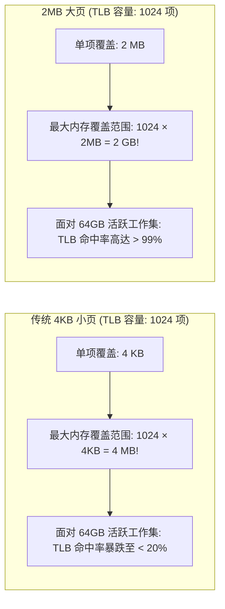
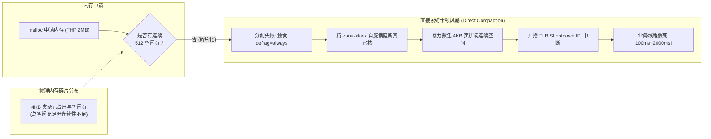
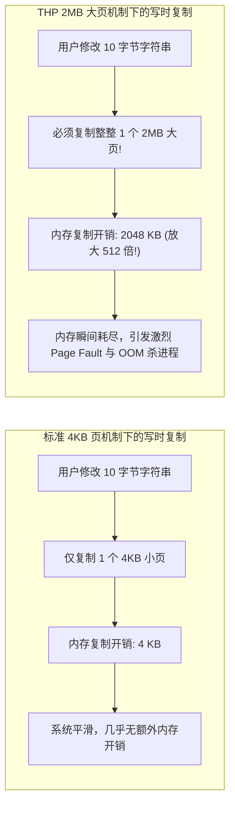
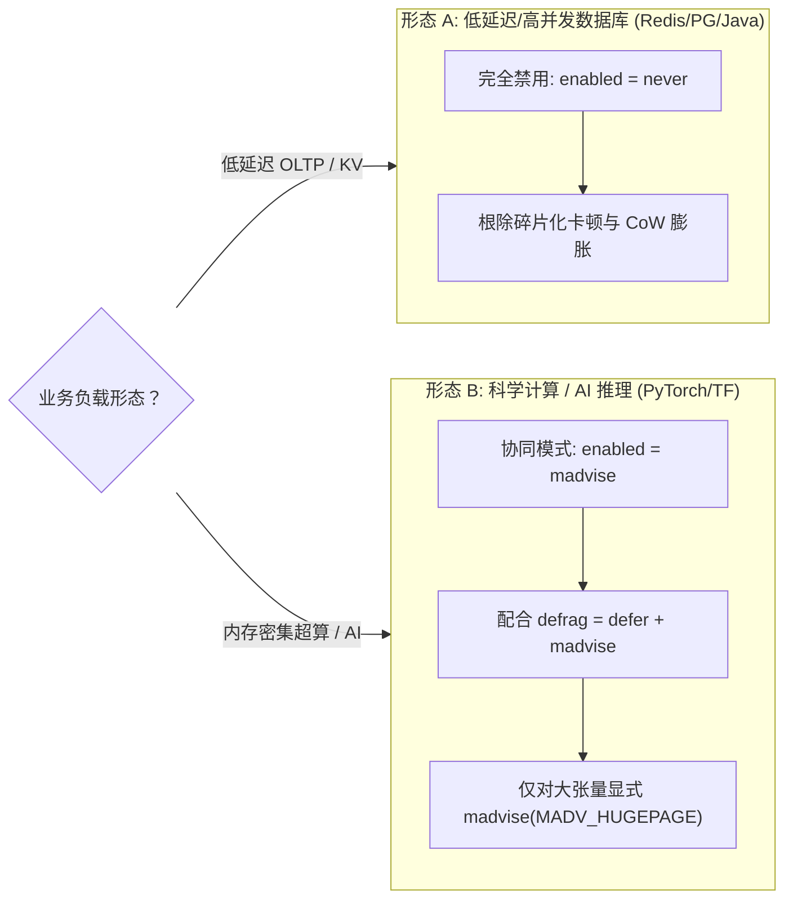

**TL;DR：** 在 Linux 内存管理体系中，**大页（HugePages）** 本是用于减少 CPU 转译后备缓冲区（TLB）缺失、提升大内存寻址效率的顶级硬件加速技术。然而，Linux 2.6.38 引入的 **透明大页（Transparent Huge Pages, THP）** 却由于其“自动化与透明化”的激进设计，成为了几乎所有低延迟系统与高性能数据库（Redis、PostgreSQL、MongoDB、Kafka、Cassandra）的头号噩梦。其核心死穴在于：2MB 大页要求底层必须具备连续 512 个 4KB 物理页；在长期运行产生外部碎片后，当应用发起普通内存申请时，默认的 `defrag=always` 策略会强行触发 **同步内存直接紧缩（Direct Compaction）**。当前执行业务的线程被内核强行挂起，陷入持有 `zone->lock` 自旋锁的物理页搬迁与 TLB 击落风暴中，引发高达数百毫秒乃至数秒的无响应假死。彻底根治该问题，必须从物理原理上透视伙伴系统阶数分配，并将生产系统的 THP 调优为 **`madvise` 显式申请模式** 或 **完全 `never` 禁用**。

---

## 一、面试切入：为什么所有顶级数据库的官方文档第一行都在骂 THP？

> **面试高频考题：**  
> “在我们的高并发 Redis / PostgreSQL 生产集群中，服务器硬件配置了 128GB 内存，CPU 平均利用率常年不足 30%。然而，线上每隔几小时就会突发一次持续 500ms 到 2 秒的 P99 延迟尖刺，慢查询日志里毫无记录，监控却显示系统态 CPU（sys%）瞬间飙升至 100%。DBA 排查后第一反应是执行 `echo never > /sys/kernel/mm/transparent_hugepage/enabled`，随后抖动彻底消失。请问：原本为了提升内存性能的大页技术，为什么会变成系统假死的罪魁祸首？Direct Compaction 的物理发生过程是怎样的？”

这个面试题直击 Linux 虚拟内存管理中**理想硬件模型与残酷物理现实的巨大鸿沟**。

绝大多数研发只知道“数据库官方让关就关”，却从不清楚为什么关、关了什么、以及在什么场景下大页依然是神丹妙药。

---

## 二、大页的初衷：TLB 缓存覆盖率的算术差距

在现代 x86_64 CPU 架构中，应用程序访问虚拟内存必须经过页表（Page Table）逐级转换为物理内存地址。

为了避免每次访存都要遍历 4 级页表（消耗多次 DRAM 访问），CPU 芯片内嵌了极速的硬件缓存——**TLB（Translation Lookaside Buffer，转译后备缓冲区）**。



### 2.1 4KB 页的“覆盖率困境”
以典型服务器 Intel Xeon 处理器为例，L1 D-TLB 包含 64 个条目，L2 TLB 包含 1536 个条目。
* 如果使用标准的 4KB 分页，L2 TLB 全满也只能覆盖：$1536 \times 4\text{KB} \approx 6\text{MB}$ 的内存！
* 如果一个 Redis 实例持有着 32GB 的键值对数据并高频随机读写，CPU 会频繁遭遇 **TLB Miss**，每一次查找都必须发生耗时上百纳秒的“页表漫步（Page Table Walk）”，硬件性能被大幅浪费。

### 2.2 2MB 大页的威力
如果切换为 2MB 大页：
* L2 TLB 可以轻松覆盖：$1536 \times 2\text{MB} \approx 3\text{GB}$ 乃至更大的内存！
* **TLB Miss 几乎被压缩到趋近于零**，在纯内存密集计算（如矩阵乘法、科学仿真）中，大页能直接带来 10%~30% 的性能飞跃。

### 2.3 为什么传统 HugeTLB 没惹祸，THP 却引发灾难？
早期的 **标准大页（HugeTLBfs）** 是静态的：系统启动时通过内核启动参数预留好（如固定划出 16GB 大页），应用程序必须显式调用 `mmap(MAP_HUGETLB)` 申请。由于是预分配且内存不可交换，它极其稳定。

但内核为了让普通程序不用修改代码就能享受大页红利，搞出了 **透明大页（THP）**：由操作系统在后台自动、透明地将连续的 4KB 小页合并为 2MB 大页，并在应用申请内存时默认尝试分配大页。**灾难恰恰始于这套自作主张的“透明自动化机制”。**

---

## 三、灾难的第一性原理：伙伴系统、内存碎片与直接紧缩

Linux 内核的物理内存分配依托于 **伙伴系统（Buddy System）**。

伙伴系统将内存划分为不同的阶数（Order）：从 **Order 0（1 个 4KB 页）** 到 **Order 9（512 个连续 4KB 页 = 2MB 大页）**，最高到 Order 10（4MB）。



### 3.1 外部碎片化的必然性
一台连续运行了数十天的服务器，伴随着频繁的网络收发、文件读取与进程创建销毁，物理内存就像被散弹枪击中一样：
* 系统总可用空闲内存可能还有 40GB；
* 但翻遍整个内存区，**连一块能容纳连续 512 个物理页（2MB）的整齐空间都找不到**！

### 3.2 致命诱因：`defrag=always` 与 Direct Compaction
当应用程序调用简单的 `malloc(1024)` 时，内核由于开启了 THP，会在缺页异常（Page Fault）处理流程中贪婪地尝试直接分配一个 2MB 的 Order 9 大页。
如果连续大页不存在，内核的 `/sys/kernel/mm/transparent_hugepage/defrag` 配置决定了系统的生死：

1. **`defrag=always`（Ubuntu 等多款发行版曾经的默认配置）**：
   * 内核认为：“为了保证性能，必须立刻为你把大页挤出来！”
   * **当前调用 `malloc` 的业务线程被就地挂起，进入同步的直接内存紧缩（Direct Compaction）流程**；
   * 线程在内核空间中启动极其沉重的双指针扫描算法：一个从低地址寻找不可移动的碎片页，一个从高地址寻找空闲槽位；
   * **内核持有全局 `zone->lock` 自旋锁**，将正在被其他进程使用的 4KB 物理页内容逐字节复制搬迁到高地址，并更新对应进程的页表；
   * 触发跨 CPU 核心的 **TLB Shootdown 处理器间中断（IPI）**，强制刷新所有核心的硬件缓存！
2. **后果**：本应耗时几微秒的普通内存分配，瞬间膨胀到 **数百毫秒甚至数秒**。在此期间，业务线程无法处理任何网络连接或请求，系统表现为全线超时假死。

---

## 四、写时复制（CoW）的毁灭性放大：以 Redis 为例

除了 Direct Compaction，THP 对依赖 **写时复制（Copy-on-Write, CoW）** 的系统更是毁灭性的打击。

Redis 持久化机制（`BGSAVE` 和 `AOF 重写`）依赖 Linux 的 `fork()` 系统调用：
* 父进程负责处理客户端读写；
* 子进程负责遍历全量内存数据并写入磁盘快照文件；
* 利用 CoW 机制，`fork()` 出的子进程并不立即复制内存，而是与父进程共享相同的物理页，只有当父进程修改某个键值时，内核才为被修改的页分配新物理页。



### 512 倍的写放大与 OOM 惨案
1. 当开启 THP 时，父子进程共享的页全部是 2MB 的大页；
2. 即使客户端仅仅修改了一个仅占 10 字节的计数器，内核在感知到写中断后，**必须强制分配并拷贝整整 2MB 的连续物理内存（放大 512 倍）**！
3. 在高写入并发下，Redis 会在快照期间发生严重的内存膨胀（Memory Doubling），原本 30GB 的实例会瞬间尝试申请超过 60GB 内存，直接触发 Linux OOM-Killer 将 Redis 进程残忍杀死。

---

## 五、生产级排查：利用 vmstat 与 eBPF 捕获卡顿元凶

如何实锤当前系统的延迟尖刺是由 THP 的 Direct Compaction 引起的？

### 5.1 查看全局紧缩指标：`/proc/vmstat`
运行以下命令检查自系统启动以来的累计紧缩事件：
```bash
grep -E 'compact|thp' /proc/vmstat
```
重点关注以下输出：
* **`compact_stall`**：**最关键的定罪指标！** 记录了应用程序由于内存碎片不足被迫挂起、陷入直接内存紧缩（Direct Compaction）的**总次数**。生产环境该值应当极为平稳，如果每分钟都在剧增，说明系统正在被 THP 持续挂起；
* **`compact_fail`**：直接紧缩耗费了数百毫秒努力后，依然未能拼凑出 2MB 大页并宣布失败的次数；
* **`thp_fault_fallback`**：尝试分配 2MB 大页失败后，被迫回退到 4KB 分配的次数。

### 5.2 用 eBPF 实时追踪 Direct Compaction 的延迟分布

通过 BCC 工具包中的 `funclatency`，我们可以直接量化内核紧缩函数的执行耗时：

```bash
# 追踪内核紧缩入口函数 compact_zone 的执行耗时分布 (微秒)
funclatency -u 'compact_zone'
```

输出示例（触目惊心）：
```text
     usecs               : count     distribution
         0 -> 1          : 0        |                                        |
         2 -> 3          : 12       |**                                      |
        64 -> 127        : 145      |****************                        |
       512 -> 1023       : 840      |****************************************|
      4096 -> 8191       : 210      |**********                              |
     32768 -> 65535      : 45       |**                                      |
    524288 -> 1048575    : 18       |*                                       | # 整整 1 秒处于挂起状态！
```
监控清晰地显示：部分线程调用 `compact_zone` 耗时高达 0.5 秒到 1 秒，直接与上层的 P99 抖动时间点严丝合缝！

---

## 六、生产级调优指南与终极解决方案

治理 THP 并不是简单粗暴地搞“一刀切”，而是要根据系统类型实施分级治理。



### 6.1 方案 A：针对数据库与低延迟系统的彻底禁用（推荐）

在系统引导阶段或运行时彻底关闭透明大页：

```bash
# 运行时即刻生效
echo never > /sys/kernel/mm/transparent_hugepage/enabled
echo never > /sys/kernel/mm/transparent_hugepage/defrag

# 持久化固化到系统引导参数 (推荐 /etc/default/grub)
# 在 GRUB_CMDLINE_LINUX 尾部追加:
transparent_hugepage=never
# 更新引导
update-grub
```

* 同时确认关闭后台大页扫描合并守护线程（Khugepaged）：
  ```bash
  echo 0 > /sys/kernel/mm/transparent_hugepage/khugepaged/defrag
  ```

### 6.2 方案 B：针对 AI 训练与超算系统的 `madvise` 优雅模式

如果宿主机承载着大模型推理服务（如 vLLM、SGLang），同时又不想承担全系统的 Direct Compaction 风险：
* 将配置设为 `madvise`：
  ```bash
  echo madvise > /sys/kernel/mm/transparent_hugepage/enabled
  echo defer+madvise > /sys/kernel/mm/transparent_hugepage/defrag
  ```
* **机制解析**：
  * **`enabled=madvise`**：系统默认依然使用安全的 4KB 小页，绝不自作主张为普通进程分配大页；
  * **`defrag=defer+madvise`**：即便显式申请大页遇到内存碎片，绝对不执行同步挂起的 Direct Compaction，而是异步唤醒内核后台线程 `kcompactd` 慢慢整理，前端立即先用 4KB 小页快速返回，兼顾了低延迟与长期大页覆盖率！

---

## 七、架构决策矩阵：标准 4KB vs 静态 HugeTLB vs 透明大页 THP

| 对比维度 | 标准 4KB 分页机制 | 静态大页 (HugeTLB) | 透明大页 (THP 默认配置) |
| :--- | :--- | :--- | :--- |
| **TLB 覆盖率与命中率**| 极低（大工作集频繁 TLB 缺失）| **极高（显著提升大内存寻址吞吐）**| 理论极高，实际受碎片化制约 |
| **内存分配确定性** | **绝对确定（极少发生长周期挂起）**| **绝对确定（启动预分配固定物理池）**| **极差（突发 Direct Compaction 卡顿）** |
| **写时复制（CoW）影响**| 开销最小（仅复制 4KB 局部页）| 不支持（通常用于不可变共享内存） | **灾难性放大（512 倍物理写放大）** |
| **应用程序接入成本** | 0 成本（操作系统原生默认） | 较高（需显式申请并在 OS 预留）| 0 成本（由操作系统透明尝试） |
| **推荐适用场景** | **所有通用微服务、Web 网关、低延迟 RPC** | **超大规模分布式数据库核心内存池** | **严禁在生产开启默认 `always`** |

---

## 八、总结与排障 Checklist

透明大页（THP）是操作系统试图用“通用自动化启发式策略”解决“专用硬件性能瓶颈”的典型反面教材。在算力与内存规模爆炸的今天，将关键资源的控制权清晰还给应用，是构建高可用高并发系统的底层铁律。

在部署任何高性能底层基础设施之前，务必按以下 Checklist 执行安全核查：
- [ ] 检查 `/sys/kernel/mm/transparent_hugepage/enabled` 是否被安全地配置为 `never` 或 `madvise`，杜绝出现危险的 `[always]`？
- [ ] 检查 `/sys/kernel/mm/transparent_hugepage/defrag` 是否禁用了激进的同步阻塞模式？
- [ ] 生产监控体系是否已将 `/proc/vmstat` 中的 `compact_stall` 和 `compact_fail` 纳入 P99 抖动的告警大盘？
- [ ] 宿主机如果是 Redis / MongoDB，是否已在系统 profile 中添加了开机自动关闭 THP 的 systemd 服务脚本？
- [ ] 采用 `jemalloc` 或 `tcmalloc` 的现代应用，是否结合了 `madvise(MADV_HUGEPAGE)` 实现了对特定无碎片内存池的定向大页加速？

---

## 参考资料

1. **Linux Kernel Documentation**: `Documentation/admin-guide/mm/transhuge.rst`.
2. **Andrea Arcangeli (Red Hat)**: *Transparent Hugepage Support (KVM Forum)*.
3. **Redis Official Administration Guide**: *Latency issues related to Transparent Huge Pages*.
4. **Mel Gorman**: *Understanding the Linux Virtual Memory Manager (Prentice Hall)*.
