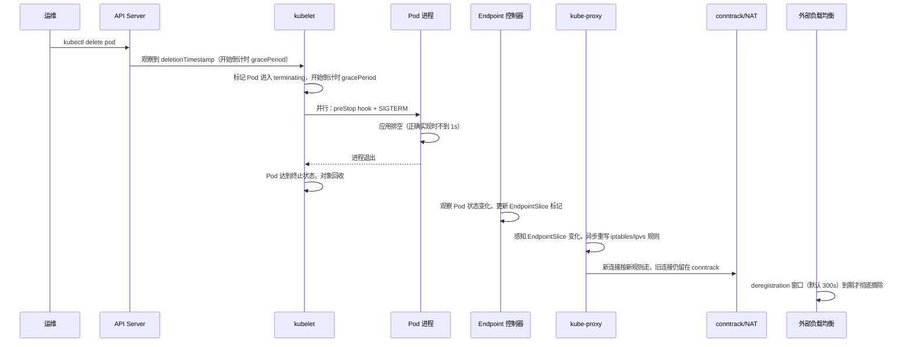

**TL;DR：** 优雅下线的难点不在应用侧，在数据面。即使进程收到 SIGTERM 后 1 秒内干净退出，流量也要再过 Endpoint 标记、kube-proxy 规则同步、conntrack 表项、外部负载均衡摘除这四层最终一致——十秒量级是这个链条里的保守估计。所以：**算延时的账，把 SIGTERM 到流量停止之间的每一层都当成一个独立预算**；conntrack 已建立的连接会把连接钉死在旧 Pod 上，直到连接真正关闭；外部 LB 的摘除窗口（NLB/ALB 默认 300s）是比 gracePeriod 大得多的隐藏预算。

## 一、事故现场：滚动发布的十秒

一次滚动发布：32 个副本，滚动更新分批替换。应用侧的优雅停机是"验证过"的——SIGTERM 后 1 秒内排空完成、进程干净退出、无 SIGKILL 记录。但发布窗口里，下游仍周期性收到一批超时，集中在每次 Pod 替换后的前十几秒。

监控图上，这批超时的形状和 Pod 生命周期高度吻合：它不是应用排空慢，而是**信号发出后，Pod 还继续"被打"了十秒左右**。于是问题不再是"进程有没有优雅退出"，而是：**从一个进程决定退出，到把它的流量真正清干净，中间发生了什么？**

## 二、SIGTERM 到连接消失，要穿过四层

先纠正一个直觉：`kubectl delete pod` 不是"点一下，Pod 消失"。它是一个 API 调用，随后一串分布式系统依次接力。从 SIGTERM 发出到流量彻底离开这个 Pod，链路是这样：

每一层都有自己的时延和语义，逐层拆：

**第一层，kubelet 与 Pod 对象。** API Server 收到 delete 后，kubelet 通过 watch 观察（毫秒到秒级），标记 Pod 为 terminating，开始倒计时 gracePeriod（默认 30s），并行执行 preStop 和投递 SIGTERM。进程退出后 kubelet 记录终态、对象被回收。这一层是秒级，若应用优雅停机实现正确（先关闸、再排空，见[SIGTERM 之后发生了什么：把优雅停机做成一件确定的事](/writing/graceful-shutdown-in-go)），这里占不到多少时间。

**第二层，EndpointSlice 的标记传播。** 进入 terminating 的 Pod 在 EndpointSlice 里被标记为 terminating（Kubernetes 1.22 起默认开启 EndpointSliceTerminatingCondition），`ready=false`。但**标记是控制器异步完成的**，API watch → EndpointSlice 控制器 → 更新对象，是一段毫秒到秒级的传播。在它生效前，负载均衡看到的是一个"依然健康"的后端。

**第三层，kube-proxy 的数据面同步。** 即使 EndpointSlice 更新了，kube-proxy 也要把它翻译成 iptables/ipvs 规则。iptables 模式按事件异步重写规则，另有周期性全量同步兜底（`--iptables-sync-period` 默认 30s）。这层异步，意味着**规则更新与标记之间、以及规则与同一批次的其他规则之间，都没有强一致**。

**第四层，conntrack 与外部负载均衡。** 这是"十秒"的真正来源。两个独立的机制：

1. 已建立的连接不走新规则。iptables 的 DNAT 只对"新建连接"生效；已经建立的连接由 conntrack 表项接着跑，`nf_conntrack_tcp_timeout_established` 默认长达 5 天。也就是说，只要客户端通过连接池复用连接，**这些连接在 TCP 层面根本感受不到规则的更新**，会继续打到旧 Pod，直到连接被某一边关闭。
2. 外部负载均衡有自己的摘除窗口。AWS ALB/NLB 的 deregistration delay 默认 300 秒，期间"已建立的连接不中断、新连接不再分发"。它比 K8s 自己的 30 秒 gracePeriod 长一个数量级，是整条链上最容易被忽略的预算。

## 三、三个反直觉的事实

**事实一：摘除是"标记"，不是"立即生效"。** 应用把 readiness 探针打成失败、Pod 进入 terminating，都不等于流量停下。后面还有 kube-proxy 的异步重写和 conntrack 的存量连接。"摘除完成"只能通过观察 EndpointSlice、iptables 规则和 conntrack 表同时确认，而这三个观察点各自有各自的时延。

**事实二：新连接何时停，取决于摘除语义的实现；老连接对规则更新完全无感。** 支持 terminating 条件的负载均衡（以及新版 kube-proxy）会停止为新连接选择正在终止的 Pod；不认这套语义的旧实现则继续转发，直到 Pod 从 EndpointSlice 里被移除。而无论哪一层，已建立的 TCP 连接都对规则更新无感——conntrack 表项把它们按原路径送走。所以"Pod 从流量中消失"不是一个瞬间，而是一个过程：新连接何时停取决于实现，旧连接只取决于连接寿命。短连接的业务在十秒量级内收敛，keep-alive 连接池的业务可能久久不收敛。

**事实三：外部负载均衡的窗口比 K8s 的 gracePeriod 更大。** 调度器给进程的 gracePeriod 只有 30 秒，但 L4/L7 负载均衡的 deregistration（比如 300 秒）在 Pod 消失后仍在"排空"。这个窗口内，Pod 已不存在，连接会在 NAT/ LB 层被切断然后重连到新 Pod——表现为"发布完成后仍偶发一次连接错误"，重复抓包才知道是摘除还没结束。

## 四、十秒的分解账

把这段时间摊开，逐项标价：

| 环节 | 时延量级 | 谁在消耗 | 能否优化 |
| :--- | :--- | :--- | :--- |
| API 观察到删除 + kubelet 开始 | 毫秒–秒级 | watch 与调度 | 不可见，可忽略 |
| 进程排空（应用侧） | 秒级 | 你的优雅停机 | **应该优化的唯一环节** |
| Endpoint 标记传播 | 毫秒–秒级 | EndpointSlice 控制器 | 只能观测，无法直接调 |
| kube-proxy 规则重写 | 毫秒–数秒 | 事件同步 + 周期兜底（30s） | 可观测，必要时换 ipvs/nftables |
| conntrack 存量连接 | 秒–数分钟 | 连接生命周期 | 治本：让连接短命或由 LB 结束 |
| 外部 LB deregistration | 默认 300s | ALB/NLB 配置 | 可调，但调小有取舍 |

关键结论就一句话：**gracePeriod 管的是进程的生死，管不了流量的收尾**。把 30 秒全给进程排空，流量侧可能还要几分钟才真正安静。

## 五、对策：每一层都有一件能做的事

| 层 | 做法 | 代价 |
| :--- | :--- | :--- |
| 应用 | 收到 SIGTERM 立即关闸拒绝新连接（`http.Server.Shutdown` 干的就是这件事），不等 LB 摘除——摘除与信号之间没有等待协议 | 无，标准做法 |
| Endpoint | 发布系统把各实例 readiness 手动打到失败 → 等 LB 摘除窗口（NLB 这类连接级 LB 有传播延迟）→ 再删 Pod | `kubectl get endpoints --watch` 确认摘除生效 |
| kube-proxy | 长连接业务的场景评估 ipvs/nftables 模式；缩短 `--iptables-sync-period` 适合规则敏感的场景 | `timeout 2 iptables -t nat -L -n` 前后对比 |
| conntrack | 这不是能"调"的：它对已建立的连接负责到底。要绕开它，只能让连接池主动关连接 | 抓包看 RST/FIN 时点 |
| LB | 明确 deregistration delay 并把超时调到与业务匹配（别默认 300s 也不核对） | 观察发布窗口超时消失 |

工程上的判断：**默认先不要调任何内核、LB 参数，先加观测**。把"SIGTERM 之后发生了什么"变成发布时可量化的指标：terminating 时长的 p50/p99、被 SIGKILL 的实例数（前一篇讲过）、发布窗口的 5xx 速率。然后逐层确认：是 kube-proxy 还没同步？是 conntrack 还挂着？还是 LB 还没摘除？看到具体是哪一层，再动哪一层。

## 结论

K8s 里优雅下线"为什么特别难"的答案，不在信号处理、不在排空时序，而在**它跨了应用自身、控制面与数据面三层**：进程能控制自己的行为，控制不了 kubelet、Endpoint 控制器与负载均衡。SIGTERM 到 Pod 消失的十秒，是四层最终一致的传播时间的下界；conntrack 的存量连接和 LB 的默认 300 秒窗口，则让它上不封顶。

对策：优雅停机正确实现（那是自己管得住的），然后不要想"调快"，而是把每一层变成可观测、可验证的账——SIGTERM 只是起点，不是结束。

## 参考资料

1. Kubernetes 文档：Pod Lifecycle（Terminating 流程、terminationGracePeriodSeconds、SIGKILL 兜底）—— https://kubernetes.io/docs/concepts/workloads/pods/pod-lifecycle/
2. Kubernetes 文档：Container Lifecycle Hooks（preStop 时序与 gracePeriod 预算）—— https://kubernetes.io/docs/concepts/containers/container-lifecycle-hooks/
3. Kubernetes 文档：Endpoint Slice 终止条件（terminating / serving 标记）—— https://kubernetes.io/docs/concepts/services-networking/endpoint-slices/
4. Kubernetes 文档：kube-proxy 配置（iptables-sync-period、proxy-mode）—— https://kubernetes.io/docs/reference/command-line-tools-reference/kube-proxy/
5. AWS 官方文档：NLB 目标组属性（deregistration 默认 300s、传播延迟）—— https://docs.aws.amazon.com/elasticloadbalancing/latest/network/edit-target-group-attributes.html
6. AWS 官方文档：ALB 目标组属性（deregistration delay）—— https://docs.aws.amazon.com/elasticloadbalancing/latest/application/load-balancer-target-groups.html
7. Linux 内核文档：nf_conntrack TCP 超时（established 默认 5 天）—— https://wiki.nftables.org/wiki-nftables/index.php/Conntrack_tools

> 延伸阅读：SIGTERM 之后应用侧的四步：关闸、排空、收尾、兜底，见[SIGTERM 之后发生了什么：把优雅停机做成一件确定的事](/writing/graceful-shutdown-in-go)；排空超时后客户端重试如何放大错误，见[重试会放大一切错误：幂等性工程的完整账本](/writing/idempotency-engineering)。