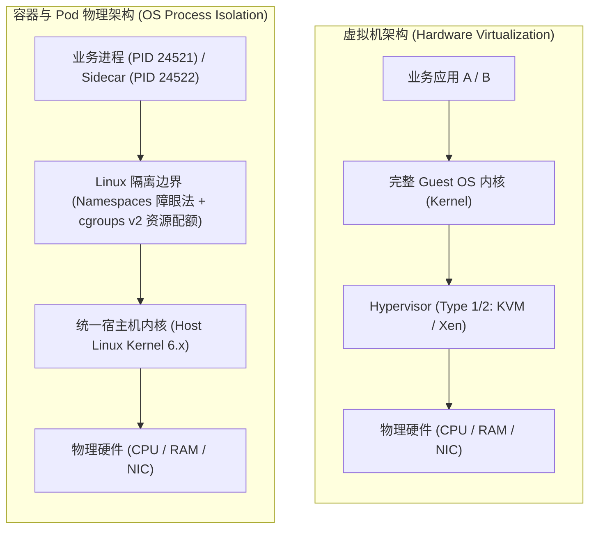
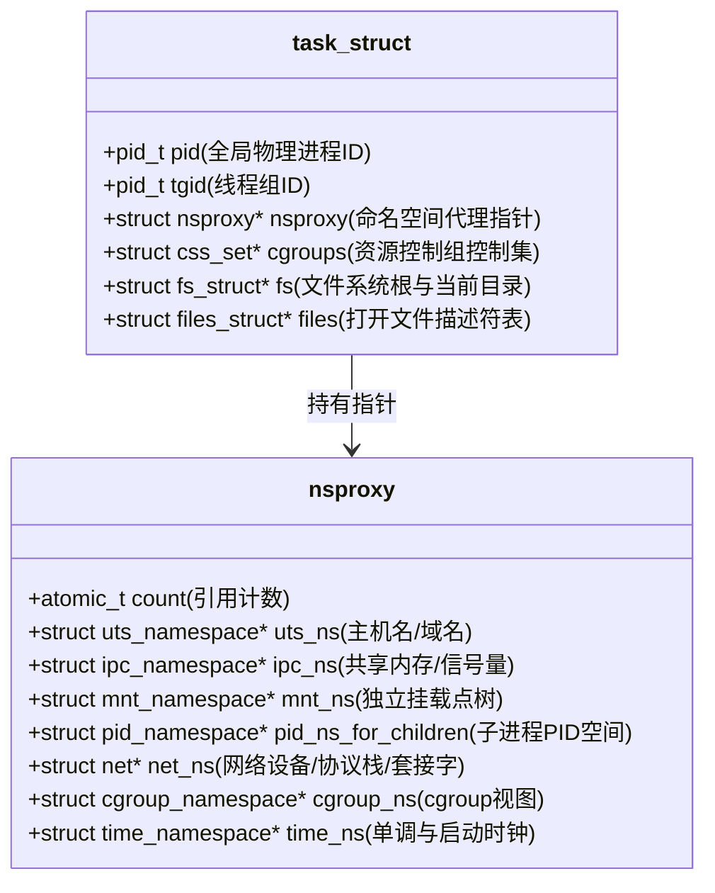
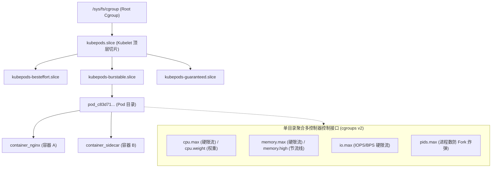
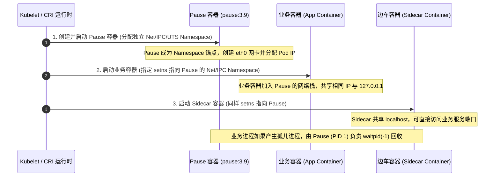
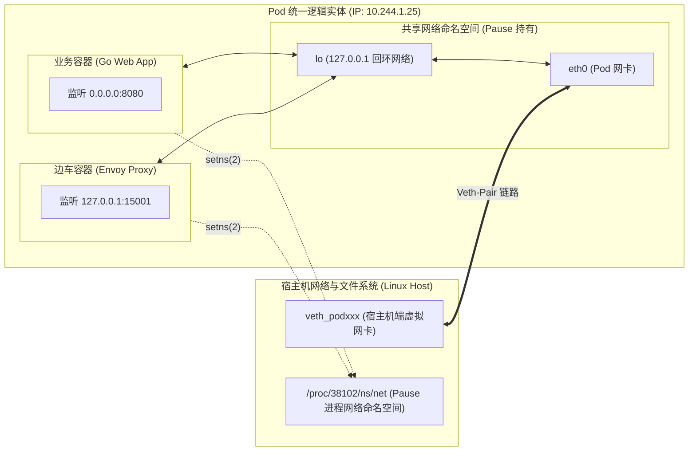
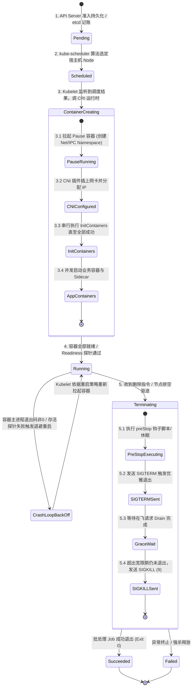
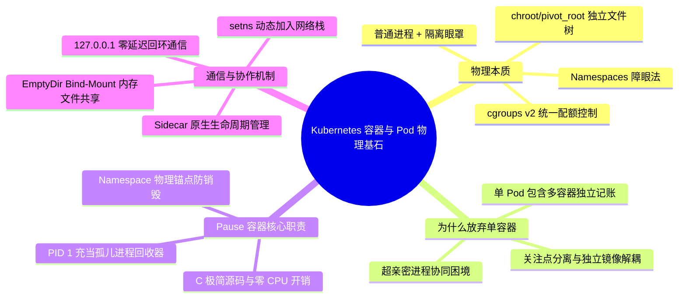

**TL;DR：** 绝大多数初学者乃至有数年经验的后端工程师，往往将容器误解为“轻量级虚拟机”，将 Pod 误解为“一组打成压缩包的进程”。这种认知模型在面对容器网络打通、资源毛刺限制（CPU Throttling）、内存 OOM 误杀以及多容器协同生命周期时，会引发一系列致命误判。**在 Linux 操作系统的物理视角下，根本不存在任何名为“容器（Container）”的独立实体。** 容器的物理本质，不过是**被 Linux Namespaces 遮蔽了系统视野、被 cgroups（控制组）戴上了资源枷锁、被 chroot/pivot_root 限制了文件系统视图的普通受限进程**。而 Kubernetes 之所以不将“单容器”作为最小调度原子，而是抽象出 **Pod**，是为了解决分布式操作系统中经典的“超亲密多进程协作”难题。通过一个极简的 **Pause 容器（`pause:3.9`）** 率先初始化并持有 `net`、`ipc` 等命名空间，业务容器得以通过 `setns(2)` 共享网络栈与 IPC 通道；同时 Pause 进程充当 PID 1 守门人，彻底兜底了容器内部僵尸孤儿进程的回收难题。

---

## 一、 面试现场：从“轻量级虚拟机”幻觉到连环死亡追问

```text
面试官提问：
  "在简历上看到你精通 Kubernetes 和容器底层原理。那请问：
   1. 在 Linux 操作系统的视角下，容器到底是不是一种独立的虚拟硬件或者沙箱实体？
   2. 既然 Docker 已经把单容器做得足够轻量了，Kubernetes 为什么还要多此一举搞出一个 Pod？
   3. 同一个 Pod 内的多个容器是如何共享网络与 IPC 的？Pause 容器到底承担了什么不可替代的物理职责？"
```

### 1.1 初级候选人的典型翻车点

很多初中级候选人在被问及“容器是什么”时，脱口而出：“容器就是轻量级虚拟机，每个容器包含自己裁剪后的精简操作系统内核。”
听到这个回答，面试官心中已经基本给出了“未深入理解操作系统”的评价：
- **致命误区一**：容器绝对没有独立的操作系统内核！容器内部的所有进程，物理上直接跑在宿主机的同一个 Linux 内核上；
- **致命误区二**：认为 Pod 是“一组打包压缩的进程”或“多个容器合体”。如果真是合体，为什么每个容器能够拥有独立的资源 limits 配额？为什么可以由不同团队维护不同的镜像？

资深工程师的回答，必须直击 Linux 操作系统的内核抽象、`task_struct` 进程描述符与命名空间锚点的物理演进。

### 1.2 认知分水岭：打破“轻量级虚拟机”的幻觉

在虚拟化技术（如 KVM、VMware ESXi）中，Hypervisor 向上模拟了完整的物理硬件指令集（CPU、内存条 MMU、网卡、磁盘控制器），每个虚拟机运行着自己独立的 Linux 内核、系统守护进程（systemd/init）与驱动栈。这种重型隔离带来了百毫秒级的上下文切换开销与数十 MB 的内存底噪。

而在 Linux 容器世界中，**所有容器内的进程，物理上都直接运行在宿主机的同一个内核之上**。你在宿主机执行 `ps -ef`，能够毫无阻碍地看到容器内跑着的 Go 二进制程序或 JVM 进程。



容器技术并没有发明任何新的内核硬件指令，它只是将 2000 年代初就逐步演进的 Linux 内核能力做了工业化封装：
1. **Linux Namespaces**：给进程戴上“障眼法眼罩”，让它误以为自己独占了全局 PID 空间、网卡、挂载点和主机名；
2. **Control Groups (cgroups)**：给进程戴上“紧箍咒”，限制其能够压榨的 CPU 时间片配额、物理内存上限与 I/O 带宽；
3. **chroot / pivot_root**：给进程划定“文件系统孤岛”，将其根目录 `/` 切换到由 OCI 镜像解压出的 Layer 联合挂载目录。

---

## 二、 Linux 6.x Namespaces：构建进程维度的障眼法

### 2.1 核心系统调用：从 `fork(2)` 到 `clone(2)`

在 Unix/Linux 体系中，创建新进程使用 `fork(2)` 系统调用。而容器运行时的底层核心，调用的是更加通用的 `clone(2)` 系统调用。通过传入一系列以 `CLONE_NEW*` 开头的比特位掩码，内核在创建 `task_struct` 进程描述符时，不再继承父进程的命名空间指针，而是动态分配全新的命名空间代理结构体（`nsproxy`）。

```c
#define _GNU_SOURCE
#include <sched.h>
#include <stdio.h>
#include <stdlib.h>
#include <sys/wait.h>
#include <unistd.h>

static int container_main(void* arg) {
    printf("[容器内部] 进程已在隔离命名空间中启动，PID: %d\n", getpid());
    // 此时通过 getpid() 拿到的是 1，但在宿主机上它是一个普通的大 PID（如 38921）
    system("mount -t proc proc /proc"); // 挂载专用 proc 文件系统
    system("hostname container-demo");
    execlp("/bin/sh", "/bin/sh", NULL);
    return 0;
}

int main() {
    printf("[宿主机] 准备基于 clone(2) 创建隔离进程...\n");
    char stack[1024 * 1024]; // 分配 1MB 栈空间
    
    // 传入 6 大 Namespace 隔离标记
    int clone_flags = CLONE_NEWPID  | // 独立 PID 空间
                      CLONE_NEWNET  | // 独立网络栈 (网卡/路由/iptables)
                      CLONE_NEWNS   | // 独立挂载点
                      CLONE_NEWUTS  | // 独立主机名与域名
                      CLONE_NEWIPC  | // 独立进程间通信 (共享内存/信号量)
                      CLONE_NEWUSER | // 独立用户与用户组 UID/GID
                      SIGCHLD;

    pid_t child_pid = clone(container_main, stack + sizeof(stack), clone_flags, NULL);
    if (child_pid == -1) {
        perror("clone 失败");
        exit(1);
    }

    printf("[宿主机] 容器子进程已创建，在宿主机物理 PID 为: %d\n", child_pid);
    waitpid(child_pid, NULL, 0);
    return 0;
}
```



### 2.2 八大 Namespaces 隔离全景

| 命名空间 | 内核标识位 | 隔离的物理与逻辑实体 | 生产故障典型场景 |
| --- | --- | --- | --- |
| **PID** | `CLONE_NEWPID` | 独立进程树编号。容器内第一个进程成为 PID 1 | PID 1 不具备默认信号处理机制，进程无法处理 `SIGTERM` 导致优雅停机超时强杀 |
| **Network** | `CLONE_NEWNET` | 独立网络设备、IPv4/v6 协议栈、端口范围、路由表、iptables/nftables 链 | 容器内绑定 `0.0.0.0:8080` 不会与宿主机或其他 Pod 产生端口冲突 |
| **Mount** | `CLONE_NEWNS` | 独立文件系统挂载点视图与挂载树 | 容器内挂载 `/tmp` 不影响宿主机，但未设置挂载传播（Shared Mount）会导致存储卷无法动态热插拔 |
| **UTS** | `CLONE_NEWUTS` | 主机名（Hostname）与 NIS 域名 | 允许每个 Pod 拥有独立的 DNS 主机名（StatefulSet 依靠此能力稳定寻址） |
| **IPC** | `CLONE_NEWIPC` | System V IPC 消息队列、POSIX 消息队列与共享内存（shm） | 同一 Pod 内多容器需显式共享 IPC 才能直接基于内存零拷贝通信 |
| **User** | `CLONE_NEWUSER` | 独立 UID/GID 映射映射表 | 容器内拥有 `root (UID 0)` 特权，但在宿主机上仅对应非特权用户（UID 10001），防范容器逃逸 |
| **Cgroup** | `CLONE_NEWCGROUP` | 进程视角的 `/proc/self/cgroup` 路径根化 | 防止容器感知宿主机全局 cgroups 拓扑，提供虚拟化视角 |
| **Time** | `CLONE_NEWTIME` (5.6+) | `CLOCK_MONOTONIC` 与 `CLOCK_BOOTTIME` 时钟偏移 | 允许容器在不更改宿主机硬件时钟的前提下，独立调整自身系统时间 |

### 2.3 文件系统隔离：OverlayFS 联合挂载与 `pivot_root`

命名空间解决了进程号、网络和主机名的障眼法，但容器启动时如果直接执行 `ls /`，看到的仍是宿主机的文件。容器如何拥有独立的操作系统文件系统（rootfs）？

在 Linux 工业生产中，容器使用 **OverlayFS** 联合文件系统与 **`pivot_root(2)`** 系统调用：

```mermaid
flowchart TD
    subgraph OverlayFS["OverlayFS 联合挂载物理层级 (Union Mount)"]
        direction TB
        Merged["merged 视图目录 (/var/lib/containerd/io.containerd.runtime.v2.task/...)<br/>容器进程看到的统一根文件系统 (/)"]
        
        Upper["upperdir (读写层 / Read-Write Layer)<br/>存储容器运行期间发生的所有新增、修改与删除标记 (Whiteout)"]
        Work["workdir (内核临时工作目录 / 原子事务保证)"]
        
        subgraph Lower["lowerdir (只读镜像层 / Read-Only Layers)"]
            direction TB
            L3["Layer 3: 业务 Go 应用二进制 (40MB)"]
            L2["Layer 2: 运行时依赖库 /glibc /ca-certificates (30MB)"]
            L1["Layer 1: Debian 基础镜像 (80MB)"]
            L3 --> L2 --> L1
        end

        Merged <== "联合呈现" == Upper
        Merged <== "联合呈现" == Lower
        Upper -. "事务依赖" .-> Work
    end
```

1. **写时复制（Copy-on-Write, CoW）**：容器读取文件时自顶向下查找；当修改只读层文件时，内核先将其完整拷贝到 `upperdir` 读写层，再在读写层执行写操作；删除文件时在读写层创建一个特殊的字符设备白障（Whiteout，主次设备号 0:0），遮蔽下层文件；
2. **`pivot_root` 彻底安全隔离**：早期容器使用 `chroot(2)`，但 `chroot` 只修改了当前进程的根路径指针，未分离挂载树，攻击者利用 `fchdir(2)` 与相对路径 `../../` 可轻松实现容器逃逸。现代 OCI 运行时全部使用 `pivot_root(new_root, put_old)`，将宿主机旧根目录彻底卸载（`umount2(put_old, MNT_DETACH)`），使进程从物理上永远无法越狱访问宿主机挂载点！

---

## 三、 cgroups v2 统一层级：彻底终结资源拓扑割裂

### 3.1 cgroups v1 的历史债务：多树割裂与 OOM 死锁

在 cgroups v1 时代，每种资源（CPU、Memory、blkio、pids）都拥有一棵**完全独立的目录树**（Hierarchy）。
这导致了一个灾难性的架构缺陷：**跨资源的联动与统计完全割裂**。
- **Page Cache 脏页回写陷阱**：在 v1 中，内存子系统（`memory`）限制了进程的 Page Cache 占用，但当内核脏页回写线程（`kworker`）将缓存刷入磁盘时，负责限速的却是块设备子系统（`blkio`）。由于两个子系统的树形组织完全无关，内核无法得知这些脏页到底属于哪个 cgroup，导致所有的 I/O 刷盘全部被记入根控制组（Root Cgroup），**I/O 限速（I/O Throttling）彻底形同虚设**！
- **OOM 归属裁决混乱**：当发生内存耗尽时，内存控制器无法跨树感知进程在 CPU 或线程层级的拓扑，经常误杀属于同一逻辑应用的其他关联子进程。

### 3.2 cgroups v2：单一统一层次结构（Unified Hierarchy）

Linux 4.5+ 引入并在 5.x/6.x 中成为标准基线（也是 Kubernetes 1.25+ 默认推荐并逐步强制）的 **cgroups v2**，打破了这种割裂，建立了**单一统一层次结构**。



在 cgroups v2 中：
1. **一个进程只能归属于叶子节点目录**，不再允许多个独立树交叉归属；
2. **多资源联合记账**：内存 Page Cache 的脏页回写被准确标记所有者，`memory.max` 与 `io.max` 协同生效；
3. **引入 `memory.high` 渐进式节流机制**：当内存触及 `memory.high` 时，内核开始主动回收冷页并对进程执行轻微的调度惩罚（Sleep 纳秒），而不是像 v1 一样只要越过边界就立即粗暴触发 OOM Killer 强杀进程。

---

## 四、 为什么单容器不够用？Pod 诞生的第一性原理

当业界普遍沉浸在 Docker 单容器的轻量级狂欢中时，Google Borg/Kubernetes 团队却坚定地选择了 **Pod** 作为最小调度和管理原子。这是为什么？

### 4.1 超亲密多进程协作的现实困境

在真实的工业级分布式架构中，一个业务系统的稳定运行绝不仅仅依赖单一的二进制可执行程序。我们常常需要以下“超亲密协作进程”：
1. **日志收集代理（Logging Agent）**：如 Fluent-bit / Vector，需要实时读取业务进程写在本地共享内存或共享目录下的日志盘；
2. **服务网格边车代理（Service Mesh Sidecar）**：如 Envoy / Istio-proxy，需要拦截业务应用的所有入站与出站 TCP 流量，执行 mTLS 加密、熔断与动态路由；
3. **配置热重载探测器（Config Reloader）**：监听 Git 仓库或配置中心变更，并向本地主进程发送 `SIGHUP` 信号；
4. **Init 容器预加载（Init Container）**：在业务启动前执行数据库 Schema 迁移、权限校验或依赖探测。

### 4.2 为什么不能把它们打进同一个 Docker 镜像？

有人会问：“既然需要多个进程，为什么不写一个 `supervisord` 或 `systemd` 脚本，把业务、Envoy、Fluent-bit 全打进一个 Docker 镜像里？”

这种做法在生产中会带来毁灭性灾难：
- **生命周期语义丧失**：Docker 只能监控容器入口进程（PID 1）。如果镜像里跑着 `supervisord`，当主业务进程崩溃退出、而 `supervisord` 依然存活时，Docker 守护进程会认为“容器运行正常”，不会触发重启或调度告警，系统沦为僵尸黑盒；
- **资源隔离与记账彻底失效**：如果日志组件出现内存泄漏，或者 Envoy 在高并发下跑满 CPU，宿主机 cgroups 无法将两者的资源开销解耦，导致日志组件挤死核心交易业务；
- **镜像职责与团队协作解耦破裂**：平台基础架构团队需要升级 Envoy 或日志搜集器，业务团队却必须跟着重新编译、打包、测试业务镜像，违背关注点分离原则。

**因此，Kubernetes 给出的哲学解法是：Pod 是一个“逻辑主机（Logical Host）”。容器之间保持独立的镜像构建、独立的资源 cgroup 记账，但共享网络、存储与 IPC 环境。**

---

## 五、 Pause 容器物理拆解：优雅的 PID 1 与命名空间锚点

每个 Pod 在被 Kubelet 创建时，启动的第一个容器永远不是用户编写的业务容器，而是一个名为 `pause`（镜像如 `registry.k8s.io/pause:3.9`）的极简容器。



### 5.1 Pause 容器的两大物理职责

#### 职责一：作为 Namespace 的物理锚点（Anchor）
在 Linux 内核中，只要一个命名空间中还有**至少一个进程存活**，该命名空间就会持续存在。
如果 Kubernetes 直接以业务容器作为网络命名空间的持有者：
一旦业务容器发生崩溃重启（CrashLoopBackOff），持有该 Net Namespace 的进程瞬间销毁，内核会立即回收网络命名空间（包括分配给该 Pod 的虚拟网卡 `eth0`、路由表与 iptables 规则）。当容器拉起时，必须重新走一遍繁重的 CNI 分配 IP 流程，网络彻底断连。
**而引入 Pause 容器后，Pause 从创建到整个 Pod 销毁前永不退出。即使业务容器重启 100 次，底层网络设备和 IP 依然纹丝不动，业务重启后瞬间重连！**

#### 职责二：充当 PID 1，回收孤儿僵尸进程（Zombie Reaping）
在 Unix 系统中，若子进程在其父进程退出前尚未退出，它将变成“孤儿进程”，内核会自动将其父进程重置为当前 PID Namespace 下的 **PID 1**。
如果 PID 1 没有实现信号处理逻辑并在子进程死亡时调用 `wait()` 或 `waitpid()`，这些已退出的子进程在进程表中留存的退出状态码和结构体将永远无法释放，演变为 **僵尸进程（Zombie Process, `<defunct>`）**。一旦系统 PID 耗尽，整台宿主机将再也无法创建任何新进程！

### 5.2 逆向解析 `pause.c` 官方源码

Kubernetes 官方的 Pause 容器镜像之所以只有几百 KB，是因为其源码完全由纯 C 语言编写，甚至没有任何动态链接库依赖。让我们阅读其精简核心源码：

```c
/*
 * Kubernetes Pause Container 核心物理实现 (基于 pause.c 官方逻辑)
 */
#include <signal.h>
#include <stdio.h>
#include <stdlib.h>
#include <sys/types.h>
#include <sys/wait.h>
#include <unistd.h>

// 信号处理回调：当子进程退出时，内核向父进程发送 SIGCHLD
static void sigchld_handler(int sig) {
    // 循环非阻塞调用 waitpid，必须带 WNOHANG，回收所有已退出的孤儿进程
    while (waitpid(-1, NULL, WNOHANG) > 0) {
        // 成功回收僵尸进程，释放 task_struct 资源
    }
}

// 信号透传：屏蔽并处理常见终止信号
static void sigterm_handler(int sig) {
    // 触发退出流程
    exit(0);
}

int main(int argc, char **argv) {
    struct sigaction sa;

    // 1. 注册 SIGCHLD 信号捕获器，彻底杜绝僵尸进程留存
    sa.sa_handler = sigchld_handler;
    sigemptyset(&sa.sa_mask);
    sa.sa_flags = SA_NOCLDSTOP | SA_RESTART;
    if (sigaction(SIGCHLD, &sa, NULL) < 0) {
        perror("sigaction SIGCHLD 失败");
        return 1;
    }

    // 2. 注册 SIGTERM 和 SIGINT 捕获器，支持 Pod 优雅停机
    sa.sa_handler = sigterm_handler;
    sigaction(SIGTERM, &sa, NULL);
    sigaction(SIGINT, &sa, NULL);

    // 3. 进入永久睡眠状态，让出 CPU，等待信号唤醒
    for (;;) {
        pause(); // 执行 Linux 内核 pause() 系统调用，原子挂起线程直至捕获信号
    }

    return 0;
}
```

代码极为优雅克制：
1. 注册 `SIGCHLD` 处理函数，使用 `waitpid(-1, NULL, WNOHANG)` 持续清理 Pod 内因父进程崩溃而被转移给 PID 1 的孤儿进程；
2. 循环调用 `pause(2)` 系统调用，使进程陷入不可中断或可中断的睡眠状态，CPU 使用率绝对为 0.000%，内存常驻仅数 KB。

---

## 六、 Pod 内部网络与多容器共享通信机制

### 6.1 `setns(2)`：业务容器如何借道加入 Pause 空间？

当容器运行时（如 containerd 或 CRI-O）启动 Pod 内部的业务容器时，它会执行以下系统调用序列：
1. 通过 `/proc/<pause_pid>/ns/net` 找到 Pause 容器的 Network Namespace 文件描述符；
2. 在新容器的主进程启动前，调用 `setns(fd, CLONE_NEWNET)`，将当前线程强制附加到 Pause 容器已经创建好的网络命名空间中；
3. 同理，对 `/proc/<pause_pid>/ns/ipc` 执行 `setns(fd, CLONE_NEWIPC)`。



### 6.2 共享通信特权带来的工程优势

1. **Localhost 零开销通信**：业务容器内的应用与 Sidecar 代理（如 Envoy）之间通信，可以直接向 `127.0.0.1:<port>` 发起请求，流量直接穿过 Linux 本地回环网卡（`lo`），避免了跨宿主机乃至跨 Pod 的封包和路由损耗；
2. **端口排他性占用**：在同一个 Pod 内，两个容器**不能监听同一个端口**。如果业务容器占用了 `8080`，Sidecar 尝试再次监听 `8080` 将直接收到内核抛出的 `EADDRINUSE (Address already in use)` 错误；
3. **共享存储卷（EmptyDir / PVC）**：通过在 Pod 声明中定义统一的 `volumes`，Kubernetes 使用 Linux 的 `mount(2)` 绑定挂载（Bind Mount），将同一个宿主机目录同时挂载到容器 A 的 `/var/log` 和容器 B 的 `/app/logs`，实现毫秒级的跨容器文件共享。

### 6.3 Pod 完整生命周期状态机

理解了底层命名空间与 Pause 容器的协作，我们才能真正推导出 Pod 在物理世界中的状态流转闭环：



### 6.4 共享 PID 命名空间：`shareProcessNamespace` 深度实操

默认情况下，Kubernetes 每个容器拥有独立的 PID 命名空间，业务容器无法看到 Sidecar 容器的进程。
但在一些高级可观测性或故障注入场景中，开启 `shareProcessNamespace: true` 可以带来极具威力的工程能力：

```yaml
spec:
  shareProcessNamespace: true # 开启 Pod 级共享 PID Namespace
  containers:
  - name: main-app
    image: my-web-app
  - name: debug-sidecar
    image: busybox
    securityContext:
      capabilities:
        add: ["SYS_PTRACE"] # 允许跟踪调试
```

**物理影响**：
1. **Pause 容器退居幕后成为绝对 PID 1**：业务容器的主进程不再是 PID 1，而是变成了大于 1 的普通子进程；
2. **跨容器进程全景可视**：在 `debug-sidecar` 中执行 `ps aux`，可以直接看到 `main-app` 的进程树和环境变量；
3. **跨容器信号穿透**：Sidecar 容器可以通过 `kill -HUP <pid>` 信号直接向业务应用发送热重载信号，无需跨网 RPC 调用！

---

## 七、 面试通关复盘与架构师高分回答模板



### 7.1 现场 2 分钟极速电梯演讲（高分答题模板）

> **面试官问：**“容器与虚拟机有什么本质区别？K8s 为什么不直接调度容器而要设计 Pod？”

**高分应答结构（递进式穿透）：**

> “**第一层（本质定性）：**
> 虚拟机基于 Hypervisor 虚拟化物理硬件，拥有独立的 Guest OS 内核和虚拟 BIOS，隔离性彻底但开销大（GB 级内存、分钟级冷启动）；而 Linux 容器的本质只是宿主机上的一个普通受限进程，通过 Linux 内核的 **Namespaces（提供隔离视图障眼法）**、**cgroups（限制物理资源用量）** 和 **rootfs/pivot_root（隔离文件系统根目录）** 拼装而成，与宿主机完全共享同一内核，毫秒级启停且零 Hypervisor 损耗。
>
> **第二层（设计推导）：**
> K8s 调度 Pod 而不是单容器，核心原因是为了解决**超亲密进程组（Colocated & Co-scheduled Processes）**的生命周期与通信协同难题。现实业务中存在大量强依赖组件（如 Envoy Sidecar 代理、日志实时采集 Filebeat、本地内存共享进程），如果分别调度为独立容器，调度器极难将它们原子绑定到同一台物理机；强行打包成一个大胖镜像又破坏了解耦与镜像复用。
>
> **第三层（内核落地）：**
> 因此 K8s 抽象出了 Pod，它是资源分配与原子调度的基本单元。在物理实现上，Kubelet 会先启动一个极简的 **Pause 容器**（仅百余字节 C 代码调用 `pause()` 挂起系统调用），由它创建并死锁住 Network/IPC 等 Namespaces，并作为 Pod 级 PID 1 回收孤儿进程。随后业务容器和 Sidecar 通过 Linux `setns()` 动态挂载加入 Pause 的网络与 IPC 空间，从而天然共享同一 Pod IP、同一 Port 范围和同一 `localhost` 回环，共享卷通过宿主机挂载点 Bind-Mount 直通，以极小内核开销完美实现了超亲密协作。”

### 7.2 生产面试关键避坑守则

1. **绝对不要说“容器是轻量级虚拟机”**：面试官听到这句话通常直接扣分。必须清晰点出“容器只是宿主机受限制的普通进程，没有虚拟硬件，共享 Host 内核”；
2. **切记 Pod 是调度器原子单位**：绝不可能同一个 Pod 里的容器 A 调度到 Node 1，容器 B 调度到 Node 2；
3. **解释清楚 PID 1 僵尸陷阱**：在自定义容器镜像中，如果你使用 Shell 脚本（如 `ENTRYPOINT ["/bin/sh", "-c", "run.sh"]`）启动应用，Shell 成为 PID 1 但它默认并不转发系统信号，导致应用在 Pod 销毁时无法感知 `SIGTERM`，直到 30 秒超时被 `SIGKILL` 暴力杀死；
4. **知晓 Native Sidecar（K8s 1.28+）**：早期 Init 容器与业务容器严格串行，导致 Sidecar 容器生命周期脱节。掌握 `restartPolicy: Always` 的 Native Sidecar 机制是体现技术跟进度的绝佳加分项。
---

## 参考资料与权威规范

1. **Linux Kernel Documentation**: *Namespaces and cgroups v2 (Unified Hierarchy)* (`Documentation/admin-guide/cgroup-v2.rst`).
2. **Linux Manual Pages**: `clone(2)`, `setns(2)`, `unshare(2)`, `namespaces(7)`, `cgroups(7)`.
3. **Kubernetes Source Code**: *Pause Container Implementation* (`pkg/kubelet/pause/pause.c` & `build/pause/`).
4. **Open Container Initiative (OCI)**: *Runtime Specification v1.0.2* (POSIX process & namespaces mapping).
5. **Borg, Omega, and Kubernetes**: *Lessons learned from three container management systems over a decade* (Burns et al., ACM Queue 2016).
6. **Kubernetes Documentation**: *Pods, Multi-Container Pods, and Sidecar Containers* (kubernetes.io/docs/concepts/workloads/pods/).
