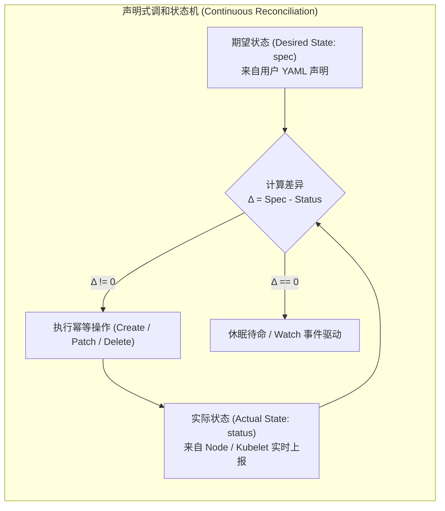
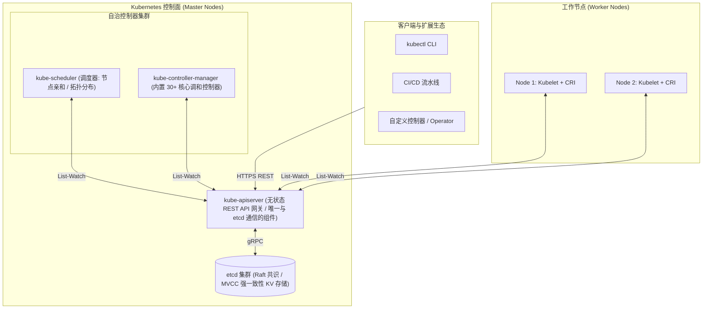
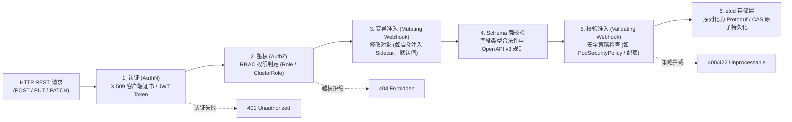
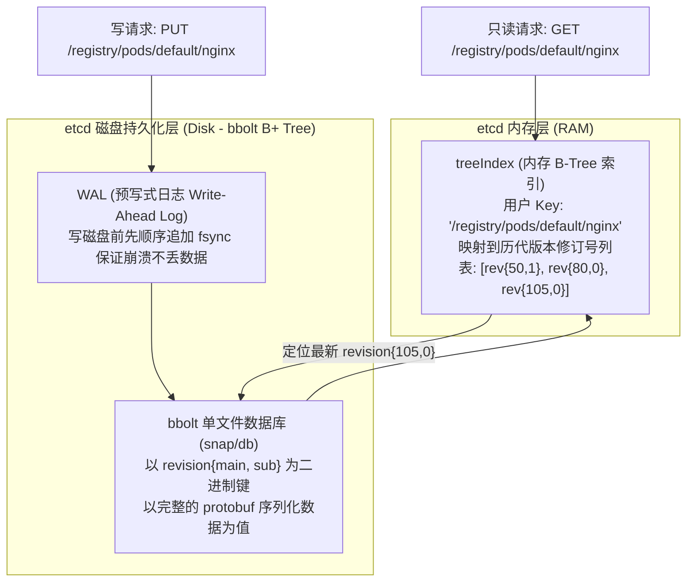
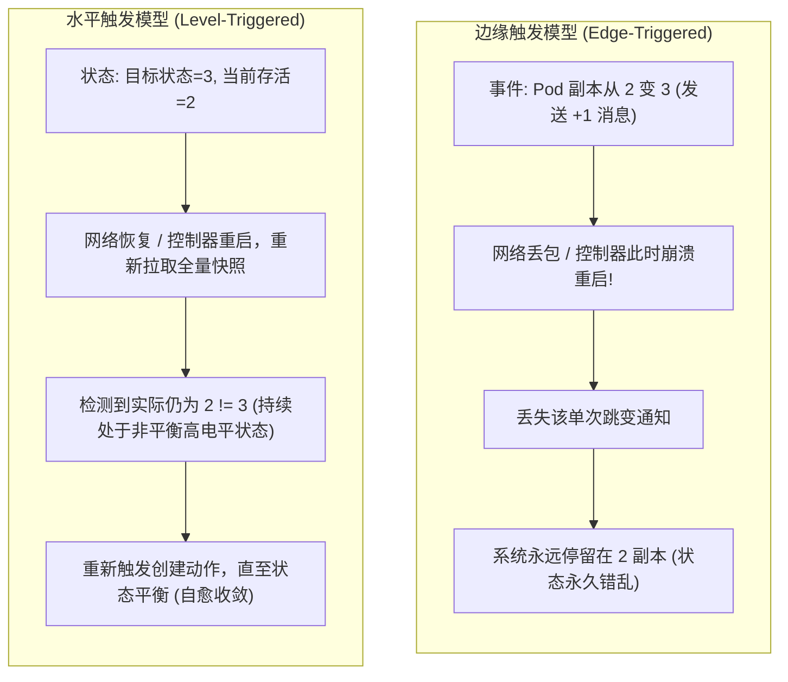
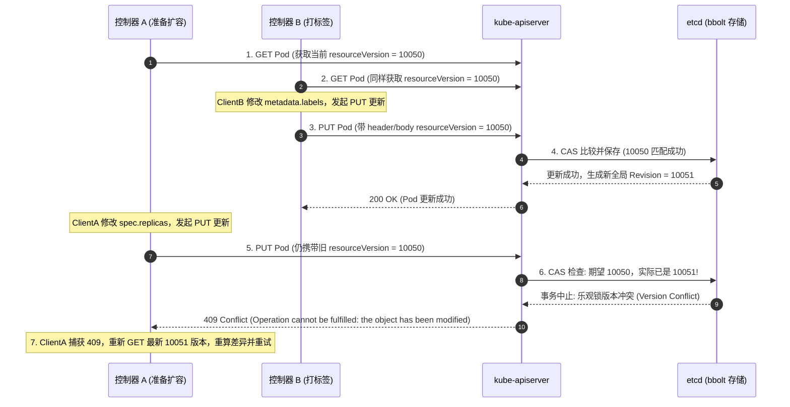
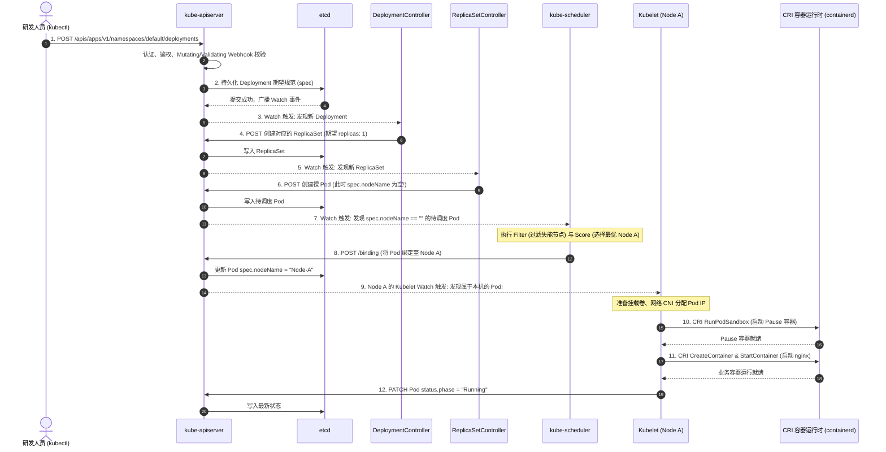
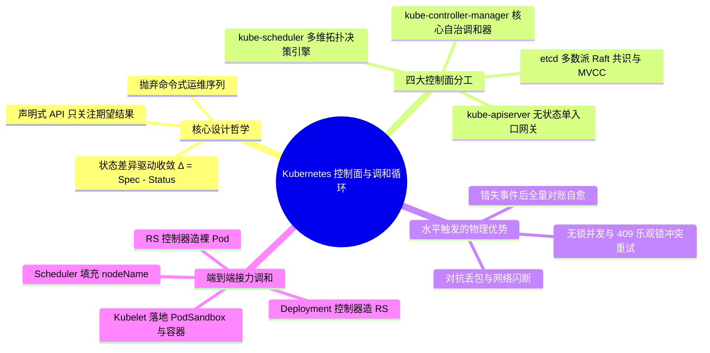

**TL;DR：** 传统运维自动化工具（如 Ansible、Fabric 或自定义 Shell 脚本）采用的是典型的**命令式（Imperative）**思维：“连上 10 台机器，安装软件，启动进程”。这种模式在小规模静态环境下运转尚可，但在数万台节点的动态大规模分布式集群中必然陷入“状态漂移（State Drift）”与“不可恢复的部分失败”深渊。Kubernetes 从第一天起就确立了**声明式 API（Declarative API）**与**水平触发调和循环（Level-Triggered Reconcile Loop）**的核心哲学：**用户只需在 YAML 中声明系统‘应当处于什么状态（Desired State）’，集群通过无数个独立运作的自治控制器，持续比对实际状态（Actual State）并驱动收敛，直到差分 $\Delta = 0$**。支撑这一哲学的控制面架构中，`kube-apiserver` 是唯一的无状态数据守门人，所有持久化状态由基于 Raft 共识协议与 MVCC 多版本控制的 `etcd` 强一致承载；而水平触发机制赋予了系统哪怕在遭遇严重网络分区、消息丢包或控制器崩溃重启后，依然能够瞬时自动对账并无缝自愈的硬核韧性。

---

## 一、 面试现场：从“命令式运维”到“声明式自愈收敛”的连环追问

```text
面试官提问：
  "以前我们用 Ansible 或 Shell 脚本运维几千台机器挺方便的，为什么 Kubernetes 必须采用声明式 API？
   如果集群控制器在执行过程中突发宕机、或者网络丢包导致事件丢失，Kubernetes 是如何做到自主恢复且不丢状态的？
   请从边缘触发 vs 水平触发，以及 etcd 的底层机制展开讲讲。"
```

### 1.1 初级候选人的典型翻车点

在遇到这类架构大题时，初级候选人往往陷入以下几个典型误区：
- **只会背定义，无法指出物理失效模型**：只回答“命令式是告诉系统怎么做，声明式是告诉系统要什么结果”，但当面试官追问“如果网络超时重试导致重复创建进程怎么办？部分机器失败如何回滚？”时哑口无言；
- **混淆边缘触发（Edge-Triggered）与水平触发（Level-Triggered）**：误以为“K8s 只要收到一个 AddPod 事件就去创建一个 Pod”，完全没有意识到事件在分布式网络中极易丢失或乱序，将 K8s 的调和循环当成了普通的消息队列消费器；
- **对控制面解耦一知半解**：误以为 `kube-controller-manager` 或 `kube-scheduler` 可以直接读写 `etcd`，不知道 `kube-apiserver` 充当唯一网关的并发锁保护与校验边界。

### 1.2 资深工程师的破局切入点

资深架构师面对这一问题，会以**“分布式状态漂移（State Drift）与不可调和的部分失败”**为第一性原理切入点：
1. **揭示命令式脚本的物理局限**：命令式操作在分布式网络下无法解决**部分失败（Partial Failures）**导致的中间态不确定性，且缺乏持续的自主纠偏（Anti-Drift）机制；
2. **抽象出声明式的核心数学模型**：通过状态机差分方程 $\Delta = \text{DesiredState} - \text{ActualState}$，结合**水平触发（Level-Triggered）与幂等调和（Idempotent Reconciliation）**，证明哪怕控制器崩溃、事件全丢，只要触发一次全量 List/Sync 对账，系统即可天然收敛；
3. **点明底层持久化防线**：基于 etcd 的 Raft 强一致共识与 MVCC 乐观并发控制（OCC），保证在没有全局互斥锁的情况下，高并发写操作依然绝对原子且无脏写。

### 1.3 命令式编排的死穴：部分失败与状态漂移

命令式操作关注的是**“动作序列（How to do）”**。例如，我们需要在集群中保持 3 个 Web 实例运行：
1. `ssh host-1 "docker run -d -p 80:80 nginx"`
2. `ssh host-2 "docker run -d -p 80:80 nginx"`
3. `ssh host-3 "docker run -d -p 80:80 nginx"`

如果在执行第 2 步时，`host-2` 突发网络抖动导致 SSH 超时，或者该节点物理机宕机，命令式脚本会面临两难困境：
- **重试陷阱**：重试可能会在已经启动成功但网络确认超时的节点上重复拉起冲突进程；
- **黑盒中断**：若脚本直接退出报错，集群实际留下了 1 个活着、1 个未知、1 个未启动的“半悬挂中间态”，没有任何自动化系统能知道下一步该继续还是回滚；
- **状态退化**：运行数天后，若 `host-1` 的进程遭遇硬件故障自发崩溃，命令式脚本由于已经执行完毕早已退出，根本无法感知并补位。

### 1.4 声明式 API 的第一性原理：只关心结果，让状态机自主收敛

声明式操作关注的是**“期望状态（What it should be）”**。
用户通过提交一份声明：
```yaml
apiVersion: apps/v1
kind: Deployment
metadata:
  name: nginx-deployment
spec:
  replicas: 3
  template:
    spec:
      containers:
      - name: nginx
        image: nginx:1.25
```

Kubernetes 并不存在一个所谓的“执行启动 Nginx 命令的脚本”。它只是将这份期望状态原子地存入 etcd。接下来，集群内部的控制器会启动一个无限循环：

$$\text{Reconcile}() \implies \Delta = \text{DesiredState} - \text{ActualState}$$

- 若 $\Delta > 0$（期望 3 个，当前存活 1 个）：控制器立即发起创建 2 个 Pod 的请求；
- 若 $\Delta = 0$（期望 3 个，当前存活 3 个）：控制器空转待命，不做任何危险的多余动作；
- 若 $\Delta < 0$（期望 3 个，当前有 5 个）：控制器主动发起缩容，删除多余的 2 个 Pod。



---

## 二、 控制面四大组件物理分工与全景拓扑

Kubernetes 控制面（Control Plane）的设计遵循极度纯粹的**松耦合、无状态计算与持久状态解耦**原则。



### 2.1 kube-apiserver：无状态流量网关与唯一数据守门人
`kube-apiserver` 是集群内部所有组件交互的中心枢纽。**其他任何组件（无论是 scheduler、controller-manager 还是节点上的 kubelet）都绝对不允许直接连接 etcd，必须通过 apiserver 暴露的 RESTful API 进行读写。**



由于 apiserver 本身不保存任何本地数据，它是完全**无状态（Stateless）**的。在生产环境中，我们可以水平横向扩容 3~5 台 apiserver，前置挂载 L4/L7 负载均衡器（如 HAProxy / F5），轻松承载数万 QPS。

### 2.2 etcd：基于 Raft 共识的强一致性元数据底座
etcd 是 Kubernetes 的“单一事实源（Single Source of Truth）”。它的物理架构保证了：
- **Raft 共识机制**：保证多数派（Quorum, $\lfloor N/2 \rfloor + 1$）节点存活即可对外提供高可用读写，杜绝脑裂；
- **MVCC（多版本并发控制）**：所有的更新不是原地覆盖（In-Place Update），而是追加生成新的全局递增版本号（`Revision`），旧版本保留在 B+ Tree 中，直至被 Compaction 机制回收；
- **Watch 机制**：客户端可以监听指定 Key 或目录的前缀变更，etcd 基于 HTTP/2 gRPC 流长连接，毫秒级将数据推送到监听者。



### 2.3 kube-scheduler：多维约束决策引擎
它的职责单一且纯粹：**在集群中寻找所有尚未分配物理节点（即 `spec.nodeName == ""`）的 Pod，经过一系列过滤（Filtering）与打分（Scoring）算法，为其选定一台最优 Node，并向 apiserver 发起绑定（Binding）请求。**

### 2.4 kube-controller-manager：大一统控制器进程
为了降低运维复杂度和减少网络连接开销，Kubernetes 将数十个独立的控制器线程打包进同一个名为 `kube-controller-manager` 的独立可执行二进制中。
内部包含：
- **DeploymentController**：负责根据 Deployment 生成和伸缩 ReplicaSet；
- **ReplicaSetController**：负责维持指定数量的 Pod 副本；
- **NodeController**：负责监控工作节点健康心跳，节点失联后发起驱逐；
- **EndpointSliceController**：负责将 Service 与后端活跃 Pod IP 建立映射切片。

---

## 三、 水平触发 vs 边缘触发：为什么 K8s 能对抗网络丢包？

在计算机通信和操作系统领域，事件驱动模型存在两大流派：**边缘触发（Edge-Triggered）** 与 **水平触发（Level-Triggered）**。深刻理解两者的区别，是吃透 Kubernetes 调和稳定性的关键。



### 3.1 边缘触发的脆弱性（Edge-Triggered）
边缘触发只在**状态发生跳变（Edge）的瞬间**发送通知（类似于“电平从低变高触发中断”）。
- 消息内容通常是 delta 增量：“增加 1 个副本”、“删除了 ID 为 12 的 Pod”。
- **致命弱点**：如果因为网络分区、消息队列丢包、或消费者正处于 GC 停顿/崩溃状态，**错过了这个单次跳变事件，消费者将永远不知道状态发生了改变，系统从此产生永久性状态偏差！**

### 3.2 水平触发的韧性（Level-Triggered）
水平触发关注的是**当前所处的稳态水平（Level）**，只要状态不平衡（电平持续为高），通知就会不断产生，或者系统随时可以通过一次主动拉取感知到全部现状。
- 在 Kubernetes 中，Controller 不仅监听 Watch 事件，还会定期进行全量重新同步（`resyncPeriod`，默认约 10~12 小时兜底一次，亦可通过本地 Informer 缓存随时主动比对）；
- 每次控制器被唤醒，它不是机械地执行“+1”动作，而是重新从本地缓存中读取完整资源视图：
  $$\text{Replicas}_{\text{desired}} = 3, \quad \text{Replicas}_{\text{actual}} = 2 \implies \text{执行补齐操作}$$
- **即便控制面断网 1 个小时，断网期间发生了 100 次状态变更，只要网络恢复，控制器只需观察当前最新状态，就能在一轮调和中直接将系统拉回到最终一致！**

---

## 四、 etcd MVCC 事务底座：版本号与并发安全机制

为什么多个 Controller 并发修改同一个资源时不会产生脏写？秘密隐藏在 etcd 的 MVCC 与 Kubernetes 的乐观并发控制（OCC）中。



### 4.1 etcd 物理存储模型：`main_revision` 与 `sub_revision`

etcd 底层基于纯 Go 语言编写的单文件嵌入式 B+ 树数据库 **bbolt** 实现。
在 bbolt 中，etcd 的 Key 并不是用户写入的 `/registry/pods/default/nginx`，而是一个 64 位的复合版本结构体：
```go
// etcd 内部存储键结构
type revision struct {
    main int64 // 全局事务单调递增版本号 (全局唯一)
    sub  int64 // 同一事务内发生多个操作时的子序号
}
```
而用户传入的字符串 Key（如 `/registry/pods/default/nginx`），被保存在内存中的红黑树索引（`treeIndex`）中。`treeIndex` 记录了每个用户 Key 对应的历史所有 revision 列表。

### 4.2 乐观并发控制（Optimistic Concurrency Control, OCC）

Kubernetes 资源对象元数据中的 `metadata.resourceVersion`，物理上直接映射为 etcd 的 `modified revision`。
1. 当任何客户端通过 `client-go` 尝试更新一个对象时，必须在 Payload 中包含它最初读取到的 `resourceVersion`；
2. apiserver 在向 etcd 提交事务时，执行底层的比较并交换指令（Compare-And-Swap）：
   ```text
   if target.mod_revision == request.resourceVersion {
       target.mod_revision = current_global_revision + 1
       commit()
   } else {
       abort(ConflictError)
   }
   ```
3. 这种设计彻底抛弃了重量级的数据库悲观排他锁（Pessimistic Row Lock），使得只读操作具备极高的无锁并发吞吐；写写冲突则通过 HTTP `409 Conflict` 反馈给客户端，由控制器框架进行无害的退避重试（Backoff Retry）。

---

## 五、 端到端物理时序：创建一个 Pod 的完整生命周期

当你在终端敲下 `kubectl apply -f nginx.yaml` 时，Kubernetes 控制面内部究竟发生了怎样精密的接力协作？



整个过程展现了极高水平的解耦美学：
- **没有一个中心化调度脚本**自顶向下协调这一切；
- 每个组件只专注监听自己负责的资源（DeploymentController 只盯 Deployment，ReplicaSetController 只管副本数，Scheduler 只管选 Node，Kubelet 只管本地 Pod 的启动）；
- 所有的状态流转完全依靠 **“Watch 异步通知 + etcd MVCC 事务持久化 + 本地调和循环”** 驱动自发收敛。

---

## 六、 面试通关复盘与架构师高分回答模板



### 6.1 现场 2 分钟极速电梯演讲（高分答题模板）

> **面试官问：**“Kubernetes 为什么放弃 Ansible 这种命令式运维而选择声明式 API？控制面调和循环是如何自愈的？”

**高分应答结构（递进式穿透）：**

> “**第一层（认知痛点与范式革命）：**
> Ansible/Shell 等命令式运维本质是‘执行动作指令’，在分布式系统中天然存在两大死穴：一是**部分失败（Partial Failure）**导致的不可预知中间态悬挂与重试风暴；二是**缺乏持续对账**，脚本执行完即退出，后续进程默默崩溃或配置被手工篡改（State Drift）时完全无法自愈。而 Kubernetes 的声明式 API 只要求用户提交‘期望状态（Desired State）’，将动作序列转化为持续收敛的数学差分方程 $\Delta = \text{Spec} - \text{Status}$。
>
> **第二层（控制面解耦与持久化底座）：**
> 在架构分工上，Kubernetes 控制面实现了彻底的计算与存储分离。`kube-apiserver` 是唯一与强一致存储 `etcd` 直连的无状态门面，通过基于 Raft 共识与 MVCC 的全局单调递增 Revision 机制提供无锁乐观并发控制（OCC）。其它所有组件（Controller Manager、Scheduler、Kubelet）全部作为 API Server 的客户端，通过 HTTP/2 长连接的 Watch 机制异步监听变更，职责完全内聚解耦。
>
> **第三层（水平触发与终态自愈）：**
> 最关键的韧性来自于**水平触发（Level-Triggered）**设计。与传统消息队列依赖‘事件流（Edge-Triggered）’不同，Kubernetes 控制器不依赖‘收到特定增量事件’来维持正确性。事件只是唤醒调和循环的提示信号；调和函数每次被唤醒，都会从本地缓存比对全局全量状态并幂等执行纠偏。哪怕控制器崩溃 1 小时、网络闪断丢弃了所有 Watch 事件，只要系统重新上线触发全量 List 对账，集群就会立即自主收敛至期望终态，具备极强的抗灾自愈能力。”

### 6.2 生产面试关键避坑守则

1. **绝对不要说“Controller Manager 直连 etcd 读写数据”**：所有组件必须且只能通过 `kube-apiserver` 交互，apiserver 是唯一的安全认证、Schema 校验与乐观锁控制点；
2. **阐明水平触发与边缘触发的本质区别**：边缘触发‘丢失一个消息就会永远失步’，而水平触发‘以终态对账为准’，这是 Kubernetes 抗网络不可靠性的基石；
3. **点明 Reconcile 函数必须严格幂等**：任何一次失败都会将对象放回 WorkQueue 延迟重试，不可在内存中残留中间脏状态；
4. **警惕 etcd MVCC 空间膨胀**：每个写事务都会生成新版本，必须配合 Compaction 和历史版本丢弃，否则会打满 2GB/8GB 配额导致集群只读。

---

## 参考资料与权威规范

1. **Kubernetes API Conventions**: *Declarative Management and Level-Triggered Design* (`kubernetes/community/contributors/devel/sig-architecture/api-conventions.md`).
2. **etcd Documentation**: *The etcd v3 Storage Engine, MVCC and Raft Implementation* (etcd.io/docs/v3.5/learning/data_model/).
3. **Borg: The Predecessor to Kubernetes**: *Large-scale cluster management at Google with Borg* (Verma et al., EuroSys 2015).
4. **Kubernetes Source Code**: *Controller Manager Architecture & Worker Loops* (`k8s.io/kubernetes/pkg/controller/`).
5. **Raft Consensus Protocol**: *In Search of an Understandable Consensus Algorithm* (Ongaro & Ousterhout, USENIX ATC 2014).
6. **Kubernetes Architecture Standards**: *Principles of Kubernetes API Design & Control Plane Components* (kubernetes.io/docs/concepts/overview/components/).
