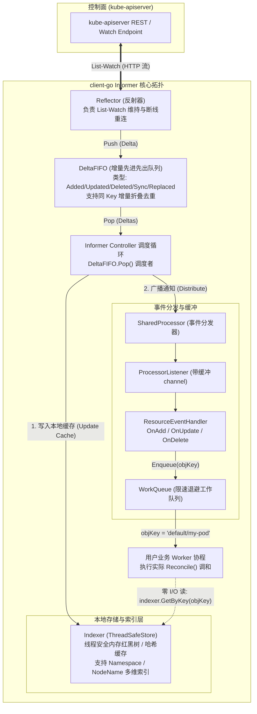
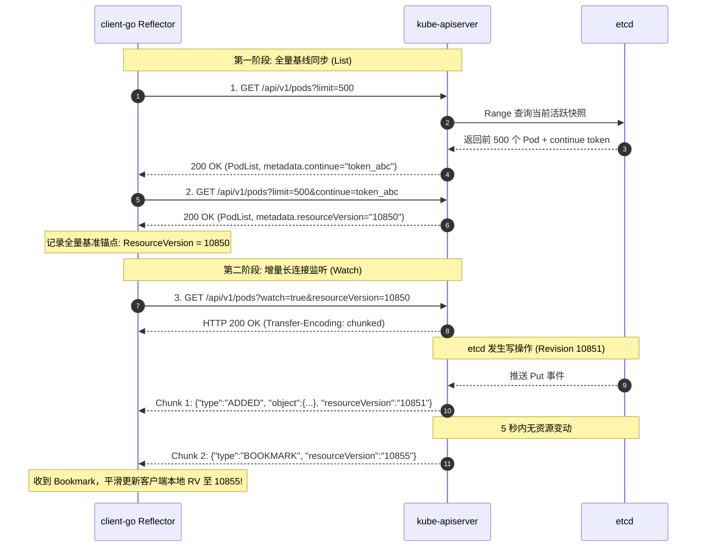
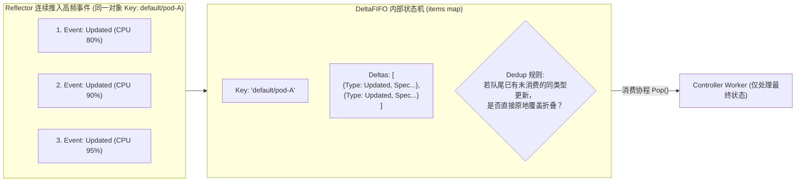
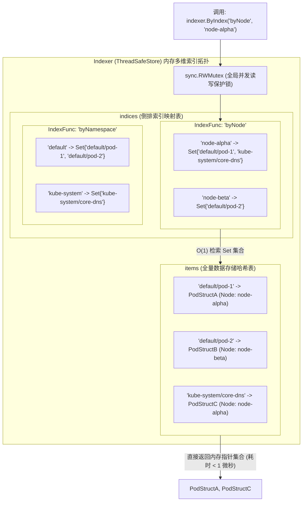
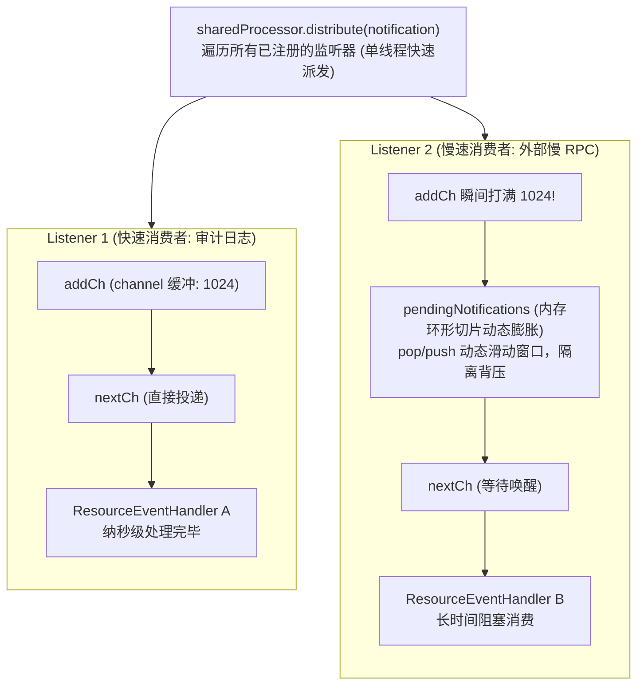
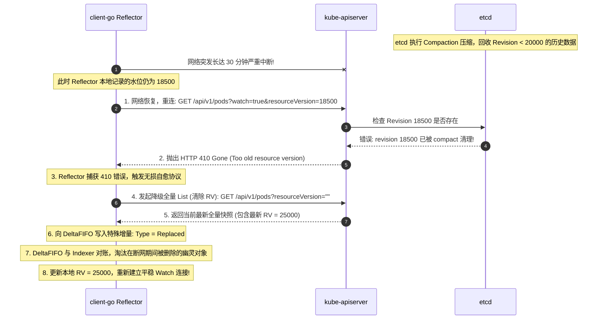
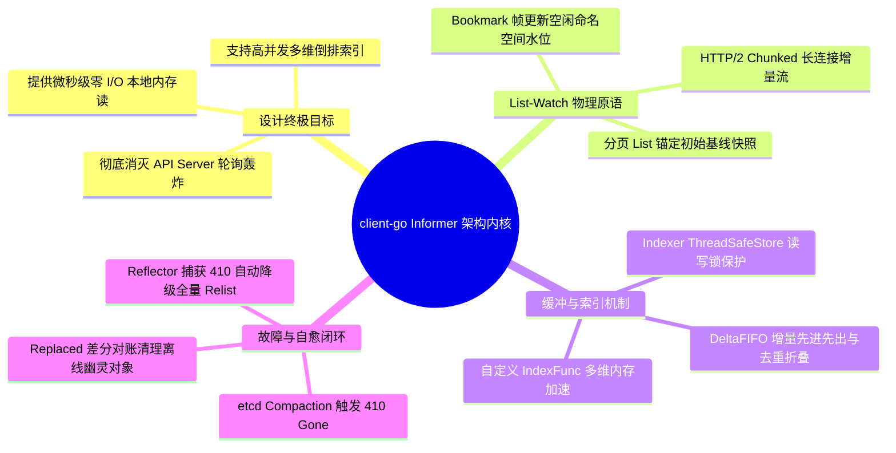

**TL;DR：** 在拥有 5,000 个节点、运行 150,000 个 Pod 的大规模生产集群中，若控制器、调度器、DaemonSet、监控 Agent 与 Kubelet 采用传统的 RESTful 定时轮询（Polling）机制读取资源，`kube-apiserver` 的吞吐和 `etcd` 的磁盘 I/O 将在数秒内被数十万 QPS 彻底打爆。Kubernetes 彻底终结轮询依赖的核心法宝，就是其官方 Go 客户端核心库 **client-go** 中的 **Informer 架构体系**。Informer 依靠底层 **List-Watch** 原语实现优雅通信：先通过一次分页 `List` 请求拉取全量基线快照并锚定当前 `resourceVersion`，随后立即切换为基于 HTTP 长连接的流式 `Watch` 增量推送；在客户端内部，**Reflector** 将增量事件压入具备并发去重能力的 **DeltaFIFO** 队列；**Indexer（ThreadSafeStore）** 则维护了一份线程安全的本地内存数据库，并构建多维倒排索引。所有业务调和读取直接命中本地内存，实现**真正的零网络 I/O 读**；而针对网络抖动与 etcd 历史压缩导致的 `410 Gone (ResourceExpired)`，Reflector 具备毫秒级无损重同步（Relist）的硬核自愈闭环。

---

## 一、 面试现场：从“万级客户端读崩 API Server”到“零 I/O 本地读”的连环追问

```text
面试官提问：
  "在几千个节点的生产集群中，如果有上万个控制器、组件和自定义 Operator 频繁读取 Pod 或 Node 状态，
   为什么 API Server 和 etcd 没有被瞬间打瘫痪？
   client-go 底层是如何实现‘零网络 I/O 读’的？
   如果在 Watch 期间发生网络闪断或者 etcd 发生了压缩导致 410 Gone，client-go 又是如何自愈恢复的？"
```

### 1.1 初级候选人的典型翻车点

在这道高频高难面试题面前，初级候选人常踩入以下误区：
- **只会说“用了缓存”，说不清数据流动与一致性保证**：简单回答“本地有 Cache”，但被追问“Cache 是什么时候初始化的？事件如何通知给业务？怎么保证读到的不是脏数据？”时细节全部断层；
- **误以为每一个 Controller 都独立向 API Server 发起连接**：不知道 `SharedInformerFactory` 的单例连接复用机制，以为写了 5 个 Controller 就会占用 5 条 Watch 长连接；
- **对 410 Gone 机制毫无认知**：以为断网后直接拿着老 `resourceVersion` 重新 Watch 即可，完全不知道 etcd 历史版本被 Compact 后的 410 报错机理及 Reflector 的降级对账全流程；
- **在自定义 Operator 中写出致命 Bug**：直接在 `Reconcile` 循环里调用 `client.DirectList()` 远程打崩 API Server，或者直接修改从本地缓存拿出来的对象指针引发并发数据错乱。

### 1.2 资深工程师的破局切入点

资深架构师面对此类问题，能够信手拈来绘制出 **client-go 完整生产流水线** 并层层拆解：
1. **揭示读风暴的物理根因**：传统 REST Polling 导致数据序列化雪崩、etcd 范围查询被打穿与 99.9% 的带宽浪费；
2. **三段式剖析 Informer 内核核心拓扑**：
   - **输入端**：`Reflector` 通过 `List-Watch` 双阶段流式协议（含 Bookmark 水位同步）保证事件不丢；
   - **缓冲层**：`DeltaFIFO` 增量先进先出队列，支持同对象 Key 的增量折叠与去重，削峰填谷；
   - **存储与消费端**：`Indexer（ThreadSafeStore）` 内存哈希倒排索引提供纳秒级无锁读，`WorkQueue` 提供指数退避防雪崩调和；
3. **闭环自愈状态机**：详细推演网络闪断及 `410 ResourceExpired` 异常时，Reflector 如何清空版本号、发起分页全量 Relist、利用 `DeltaFIFO.Replace` 与本地 Indexer 做差分对账并无缝切回增量 Watch。

### 1.3 为什么不能直接调 API Server？海量客户端的“读风暴”危机

在设计现代分布式控制系统时，一个最基础的架构考量是：**控制面如何向成千上万的客户端分发状态变更？**

```mermaid
flowchart TB
    subgraph Bad["反模式: 传统轮询 (HTTP Polling)"]
        direction TB
        C1["Controller 1"] -->|每秒 GET /api/v1/pods| APISrv1["kube-apiserver"]
        C2["Kubelet (Node 1..5000)"] -->|并发轮询 5,000 次/秒| APISrv1
        C3["自定义 Operator (20 个)"] -->|每秒轮询 1,000 次| APISrv1
        APISrv1 -->|高频全量范围扫描| ETCD1[("etcd 磁盘 I/O 爆表 / CPU 100% 瘫痪")]
    end

    subgraph Good["优雅模式: client-go Informer 架构"]
        direction TB
        C4["所有本地业务逻辑 / Reconcile()"] -->|读本地内存 (零网络 I/O / 纳秒级延迟)| LocalCache["本地 Indexer 缓存 (ThreadSafeStore)"]
        LocalCache <== "异步批量填充" == InformerArch["Informer (Reflector + DeltaFIFO)"]
        InformerArch <== "仅维持 1 条 HTTP/2 Watch 长连接<br/>增量事件流推送" ==> APISrv2["kube-apiserver"]
    end
```

如果每个客户端在编写调和逻辑时，直接调用 `clientset.CoreV1().Pods("default").List(...)`：
1. **数据序列化雪崩**：API Server 需要从 etcd 取出原始 protobuf/json 字节流，反序列化为 Go struct，再序列化为 JSON 写入 HTTP 响应。一次拉取 10,000 个 Pod 的开销高达数十 MB 内存和数百毫秒 CPU；
2. **etcd 范围查询（Range Query）被打穿**：并发全量 Range 查询直接占用 etcd 的 bbolt 只读事务锁，阻塞真正关键的写事务提交，导致心跳超时和 Raft 选主震荡；
3. **网络带宽浪费率高达 99.9%**：在 99% 的轮询周期内，集群中的 Pod 并没有发生任何变更，返回的数据是完全重复的。

**client-go 的核心使命，就是将“网络 I/O 密集型”的远程状态获取，转化为“事件驱动 + 本地内存只读缓存”的极致工程。**

---

## 二、 Informer 架构全景：数据流动拓扑拆解

`client-go` 的内部设计极其精巧，是一个多级生产者-消费者流水线。



整个架构包含六大物理环节：
1. **Reflector**：负责与 `kube-apiserver` 建立通信，利用 List-Watch 协议获取数据，并将事件转换为 `Delta` 放入 `DeltaFIFO`；
2. **DeltaFIFO**：专用的先进先出队列，以资源对象的唯一 Key（如 `namespace/name`）为标识，记录该对象发生的一系列增量动作；
3. **Controller/Informer 消费循环**：持续从 `DeltaFIFO` 中 `Pop()` 元素，优先将最新状态同步到本地内存数据库 `Indexer` 中；
4. **Indexer（ThreadSafeStore）**：底层由读写互斥锁 `sync.RWMutex` 和 Go 原生 `map` 构成，不仅缓存全量对象，还建立用户自定义索引；
5. **SharedProcessor & Listener**：将事件异步派发给所有注册的事件监听回调（`ResourceEventHandler`），并通过带缓冲的 channel 隔离慢消费者；
6. **WorkQueue**：带有速率限制、故障指数退避重试（Rate Limiting & Exponential Backoff）的工作队列，存放待调和对象的 Key。

---

## 三、 List-Watch 协议底层原语：流式传输与断点续传

List-Watch 并不是一个专有的私有二进制协议，而是建立在标淮 **HTTP/1.1 Chunked Transfer Encoding** 或 **HTTP/2 流式帧** 之上的 REST 原语组合。



### 3.1 第一阶段：分页 List 与快照锚定
为了防止一次性拉取海量数据挤爆网络，现代 Kubernetes 采用基于 **Continue Token** 的分页 List 机制：
1. 客户端发送 `GET /api/v1/pods?limit=500`；
2. API Server 从 etcd 读取第一批数据，在响应体 `metadata.continue` 中返回一个不透明游标，并在 `metadata.resourceVersion` 中返回当前集群的版本号（例如 `10850`）；
3. 客户端逐页请求，直至获取全量快照。全量加载完毕后，客户端将此时的 `resourceVersion = 10850` 作为后续增量监听的起始锚点。

### 3.2 第二阶段：增量 Watch 与流式推送
全量 List 完成后，Reflector 立即发起 Watch 请求：
`GET /api/v1/pods?watch=true&resourceVersion=10850`

此时，HTTP 连接保持长开，API Server 利用分块传输编码（Chunked Encoding），每当 etcd 有该资源的新版本产生，立即向长连接写入一段 JSON/Protobuf 数据包：
```json
{
  "type": "MODIFIED",
  "object": {
    "kind": "Pod",
    "metadata": {
      "name": "payment-service",
      "namespace": "prod",
      "resourceVersion": "10852"
    },
    "status": {
      "phase": "Running"
    }
  }
}
```
Reflector 收到该分块后，解析出新对象，提取出新的 `resourceVersion = 10852` 并推进本地内部计数器。

### 3.3 Bookmark 机制：治愈“静默命名空间”的断更绝症

在 Kubernetes 1.15 之前，存在一个隐蔽的生产性能陷阱：
假设客户端只 Watch `kube-system` 命名空间下的资源。而整个集群的业务频繁在 `default` 命名空间创建 Pod，集群的全局 `resourceVersion` 从 `10,000` 飙升到了 `50,000`。
但因为 `kube-system` 没有任何资源变动，API Server **一条消息都没有推送给客户端**，导致客户端本地的 `resourceVersion` 始终停留在 `10,000`！
此时若网络突发闪断 1 秒，客户端重连并发起：
`GET /api/v1/pods?watch=true&namespace=kube-system&resourceVersion=10000`
而 API Server 检查发现，etcd 的历史压缩（Compaction）已经清理了 `20,000` 以前的版本，因此直接向客户端抛出 `410 Gone (ResourceExpired)`！客户端被迫触发代价极高的全量重新 List！

**Bookmark 的破局机制**：
Kubernetes 引入了特殊的 `BOOKMARK` 事件类型。即便客户端监听的资源没有实际数据改动，API Server 也会定期向客户端推送一条空数据 Bookmark 帧，告知客户端：**“当前集群最新全局水位已达 50,000，请立刻将你的本地水位指针更新至 50,000！”** 这一设计使得客户端在断线重连时能以最新的集群版本断点续传，彻底杜绝了 95% 以上的不必要全量 Relist！

---

## 四、 DeltaFIFO 源码级机制：增量折叠与并发去重

当 Reflector 从网络长连接读取到事件后，并不会直接去修改本地缓存，而是将事件推入 **DeltaFIFO**。

```go
// client-go/tools/cache/delta_fifo.go 核心数据结构精简
type DeltaFIFO struct {
    lock sync.RWMutex
    cond sync.Cond

    // items 存储每个 Key 对应的一系列增量变动
    // 键为对象唯一标识，如 "default/order-pod"
    items map[string][]Delta

    // queue 保持 FIFO 消费顺序的 Key 列表
    queue []string
    
    // keyFunc 用于计算对象的唯一标识字符串
    keyFunc KeyFunc
    
    // knownObjects 指向底层已存在的本地缓存 (用于辅助去重与删除判定)
    knownObjects KeyGetter
}

type Delta struct {
    Type DeltaType   // Added, Updated, Deleted, Replaced, Sync
    Object interface{} // 具体的运行时资源对象
}
```



### 4.1 为什么要记录为 Delta 切片？
因为一个对象可能在极短时间内连续经历多次状态跳变（例如快速经历 `Added` $\to$ `Updated` $\to$ `Deleted`）。如果直接存单值，中间状态可能丢失。DeltaFIFO 以切片形式保留了这一因果链条：`[]Delta{Added, Updated, Deleted}`。

### 4.2 为什么必须具备折叠去重能力？
在控制器消费慢于生产的极端压力下，如果一个 Pod 频繁上报状态，DeltaFIFO 会利用内部机制：
- 如果最新追加的 Delta 属于重复冗余更新，或者在同一个同步周期内，旧的非终态可以被安全压缩；
- 当消费者执行 `Pop()` 时，它拿到的是该 Key 累积的整个 `Deltas` 切片，消费端直接取最后一个元素（最新快照）更新 `Indexer` 缓存，从而自动跳过中间无意义的高频抖动，极大减轻下游消费者的调和压力。

---

## 五、 Indexer 与 ThreadSafeStore：零网络 I/O 读的秘密

经过 Controller 从 DeltaFIFO 取出增量后，数据被持久化推入客户端本地的终极堡垒——**Indexer**。



### 5.1 索引器原理：IndexFunc 与 Indexers
在 client-go 中，`Indexer` 继承自 `Store` 接口，并增加了多维度索引能力：
- **IndexFunc**：计算索引键的函数。例如定义一个按宿主机节点索引的函数：
  ```go
  func PodNodeIndexFunc(obj interface{}) ([]string, error) {
      pod, ok := obj.(*v1.Pod)
      if !ok {
          return []string{}, nil
      }
      return []string{pod.Spec.NodeName}, nil
  }
  ```
- **Indexers**：注册的索引器字典 `map[string]IndexFunc`，如 `{"byNode": PodNodeIndexFunc}`；
- **Indices**：生成的二级倒排索引树 `map[string]Index`，物理上是 `map[string]sets.String`。

当你需要查询“运行在 `node-alpha` 上的所有 Pod”时，传统做法必须向 API Server 发起一次昂贵的网络过滤请求。
而在 client-go 中，只需执行：
```go
pods, err := indexer.ByIndex("byNode", "node-alpha")
```
底层的执行步骤全部在本地内存完成：
1. 获取 `RWMutex.RLock()` 共享读锁；
2. 在 `indices["byNode"]["node-alpha"]` 集合中查出相关的 Key 列表；
3. 根据 Key 从 `items` 哈希表中取出对应的 Pod 指针；
4. 释放读锁并返回。**整个过程耗时不到 1 微秒，且产生 0 字节的网络流量！**

### 5.2 慢消费者隔离：SharedProcessor 与 ProcessorListener 环形缓冲

在实际集群中，一个 `SharedIndexInformer` 通常会被多个不同的 Controller 共享监听（如一个负责更新路由，另一个负责写审计日志）。
如果其中一个 Controller 的事件回调函数处理极慢（如发生外部 RPC 阻塞），会不会把整个 Informer 的主循环拖死？

答案是：**绝对不会！client-go 设计了基于 `processorListener` 的双重缓冲与动态环形切片隔离架构**：



- 当 `addCh`（固定长度 1024）未满时，事件直接写入；
- 当慢消费者的 `addCh` 满载时，主分发线程并不阻塞等待，而是将新事件暂存入无界的动态环形切片 `pendingNotifications` 中；
- 这一精妙的解耦保证了主 Informer 永远以纳秒级流转，慢消费者只会占用自身的内存缓冲，绝不波及其他监听器！

### 5.3 生产核心监控：WorkQueue 关键 PromQL 指标

在生产环境中，监控控制器是否发生堆积，不能看 CPU，而必须看 `client-go` 的 WorkQueue 指标：

| 监控指标 (Metric) | 含义与物理警戒阈值 | 排障指导行动 |
| --- | --- | --- |
| `workqueue_depth{name="xxx"}` | 队列当前排队未处理的 Key 数量（深度）。若持续 $> 100$ 且上涨 | Worker 并发处理能力不足，需调大控制器并发 Worker 协程池 |
| `workqueue_queue_duration_seconds_bucket` | Key 在队列中等待出队的排队时间（P99 延迟）。若 $> 1s$ | 发生了严重调和拥塞，存在大量慢 I/O 阻塞了 Worker 执行 |
| `workqueue_work_duration_seconds_bucket` | 单次 `Reconcile()` 业务处理耗时。若 P99 $> 500ms$ | 调和代码中存在同步直连远程 API 的反模式，需优化为读本地缓存 |
| `workqueue_retries_total` | 发生错误触发指数退避重试的累计次数 | 系统遭遇高频乐观锁冲突（409 Conflict）或外部依赖持续不可用 |

---

## 六、 410 Gone (ResourceExpired) 故障链路与自愈全解

在真实的生产排障中，`410 Gone` 是 client-go 最常见但也最容易被误读的错误。



### 6.1 为什么会发生 410 Gone？
etcd 为了防止磁盘空间无限膨胀，默认会启用定期压缩（Compaction）。如果某个控制器因为自身卡死、长 GC 暂停、或者网络分区失联了较长时间，其本地记录的 `resourceVersion` 已经被 etcd 彻底抹去。API Server 无法再为其提供从该版本起的连续增量事件，只能如实返回 `410 Gone`。

### 6.2 Reflector 如何优雅自愈？
许多初级开发者误以为遭遇 410 之后控制器会永久停止工作。实际上，`Reflector` 在其核心循环 `ListAndWatch` 中专门设计了自愈状态机：
1. 捕获到 `apierrors.IsResourceExpired(err)`；
2. 清空当前的 `resourceVersion`，将其重置为空字符串 `""`；
3. 重新向 API Server 发起一次全量 `List` 请求；
4. 将拉取到的全量快照以 `Replaced` / `Sync` 的 Delta 类型灌入 `DeltaFIFO`；
5. DeltaFIFO 将快照与当前 Indexer 中已存在的对象执行**差分对账**：
   - 存在于 Indexer 但不存在于全量快照中的对象，被判定为“在断网期间已被删除”，向外抛出 `Deleted` 事件；
   - 存在于快照中的对象，更新为最新版本；
6. 重新锁定最新的 `resourceVersion`，平滑无缝恢复 Watch！整个过程对上层 Worker 完全透明，实现了最高级别的自治韧性。

---

## 七、 面试通关复盘与架构师高分回答模板



### 7.1 现场 2 分钟极速电梯演讲（高分答题模板）

> **面试官问：**“如果 10,000 个控制器频繁轮询 API Server，etcd 瞬间被打崩怎么办？client-go 底层是如何实现‘零网络 I/O 读’与 410 自愈的？”

**高分应答结构（递进式穿透）：**

> “**第一层（架构目标与反轮询设计）：**
> 传统 REST 轮询在大规模集群下会引发序列化雪崩、打穿 etcd 只读锁并浪费 99% 的带宽。Kubernetes 通过 `client-go` 的 **Informer 体系** 将网络 I/O 密集型拉取彻底转化为‘事件驱动 + 本地内存只读缓存’。
>
> **第二层（核心组件数据流与零 I/O 读）：**
> Informer 内部由三级流水线构成：
> 1. **Reflector**：负责底层网络通信。它先通过一次全量分页 `List` 拉取数据快照并锚定 `resourceVersion`，随后立即无缝切换为 HTTP/2 长连接增量 `Watch` 流式推送；
> 2. **DeltaFIFO**：专用的增量先进先出队列。Reflector 将网络事件封装为 Delta（Added/Updated/Deleted/Sync）压入队列，同 Key 的多个未处理增量会被自动折叠去重，实现极强的削峰抗压；
> 3. **Indexer（ThreadSafeStore）**：Controller 协程从 DeltaFIFO 消费并写入本地 Indexer 内存哈希表（读写锁保护并维护多维倒排索引），同时唤醒事件分发器将 Key 压入限速 WorkQueue。
> 上层业务调和逻辑（Worker）处理事件时，直接通过 `Lister.Get(key)` 查本地 Indexer 内存，**延迟在微秒级，物理网络 I/O 为绝对的零**。同时，同一进程内所有控制器通过 `SharedInformerFactory` 复用同一条底层 Watch TCP 连接。
>
> **第三层（410 Gone 自愈与差分对账）：**
> 当网络长时间闪断导致客户端的 `resourceVersion` 在 etcd 中被历史压缩（Compacted）清除时，API Server 会返回 `410 Gone (ResourceExpired)`。此时 Reflector 启动内置自愈闭环：自动清空版本号重新发起一次全量 List，以 `Replaced` 类型灌入 DeltaFIFO。DeltaFIFO 与 Indexer 进行**全量差分对账**（在 Indexer 中存在但在全量快照中不存在的对象立即触发 `Deleted` 事件补发清理），随后重新锁定最新版本号切回增量 Watch，整个过程无需人工介入，且对上层业务完全透明。”

### 7.2 生产面试关键避坑守则

1. **永远从 Cache（Lister）中读取，严禁在调和循环中调用 API Server 强读**：在编写 Reconcile 逻辑时，必须使用 `lister.Get()` 或 `mgr.GetClient().Get()`（Controller-Runtime 默认读本地 Informer 缓存），绝不能在每次循环中构建 Direct Client 向 API Server 直连读取；
2. **严禁直接修改从 Cache 拿出的对象指针**：由于 `Indexer` 返回的是内存中真实对象的**指针引用**，如果在业务代码中执行 `pod.Labels["test"] = "abc"`，会直接污染本地全局缓存，导致脏缓存并破坏并发安全性。必须使用 `pod.DeepCopy()` 获得深拷贝副本后再进行修改；
3. **善用 SharedInformerFactory 实现连接复用**：同一个进程内如果运行了 5 个不同的控制器，它们都需要监听 Pod 资源，必须通过同一个 `SharedInformerFactory` 创建单例 `SharedIndexInformer`。这样整个进程只对 API Server 维持一条 Watch TCP 连接，节省 80% 的网络与内存开销；
4. **澄清 ResyncPeriod 并不产生网络流量**：Resync 只是纯粹将**本地缓存**重新触发一次回调，完全不会向 API Server 发起任何网络请求。除非需要与外部物理设备对账，否则不建议设得过短（推荐 $\ge 10$ 小时）。
---

## 参考资料与权威规范

1. **Kubernetes client-go 官方源码仓库**: *Informer, Reflector, and DeltaFIFO implementation* (`k8s.io/client-go/tools/cache/`).
2. **Kubernetes API Machinery**: *Efficient Detection of Changes with ResourceVersion and Watch* (`k8s.io/apimachinery/pkg/watch/`).
3. **Kubernetes Enhancement Proposal (KEP)**: *KEP-541: Watch Bookmarks for Scalable Control Plane* (enhancements.k8s.io).
4. **Programming Kubernetes**: *Developing Cloud-Native Applications* (Hausenblas & Schimanski, O'Reilly Media 2019).
5. **Kubernetes Production Guidance**: *API Server Performance, Throttling and Priority and Fairness (APF)* (kubernetes.io/docs/concepts/cluster-administration/apf/).
