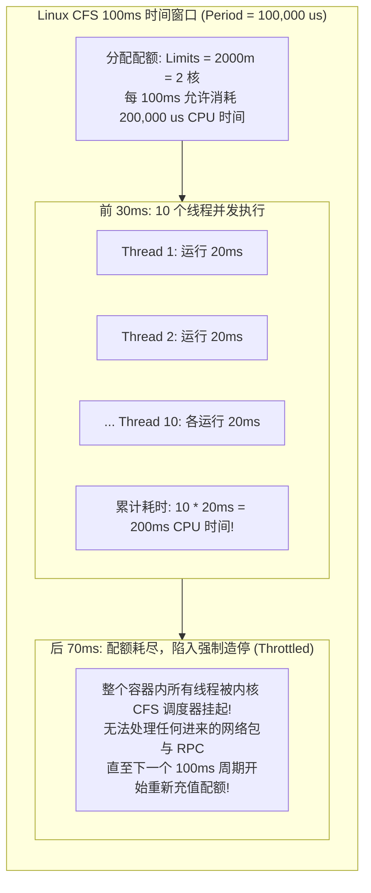
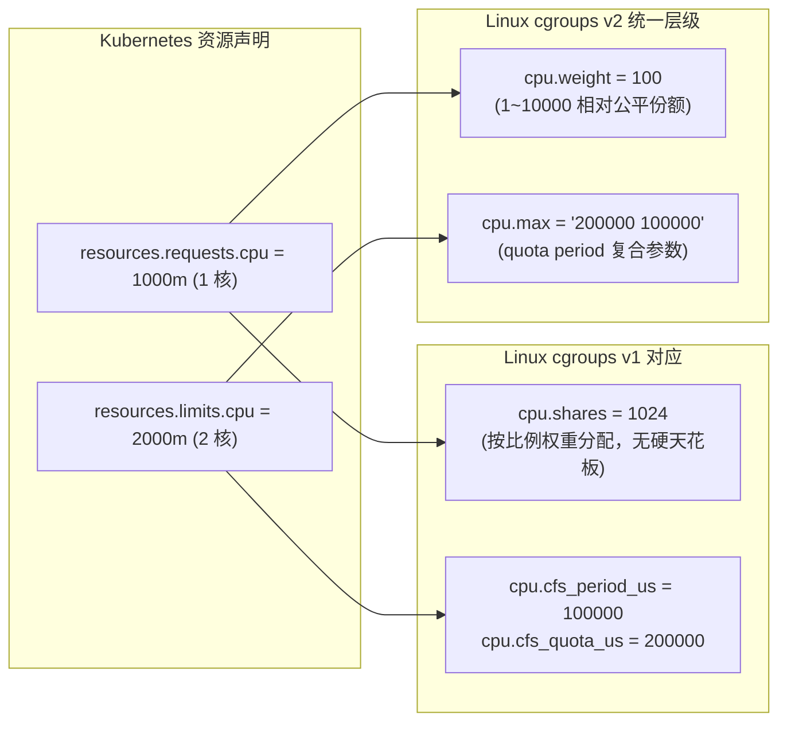
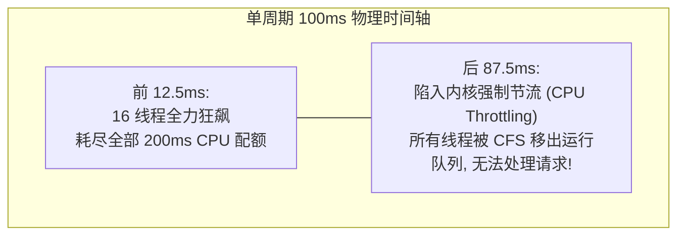
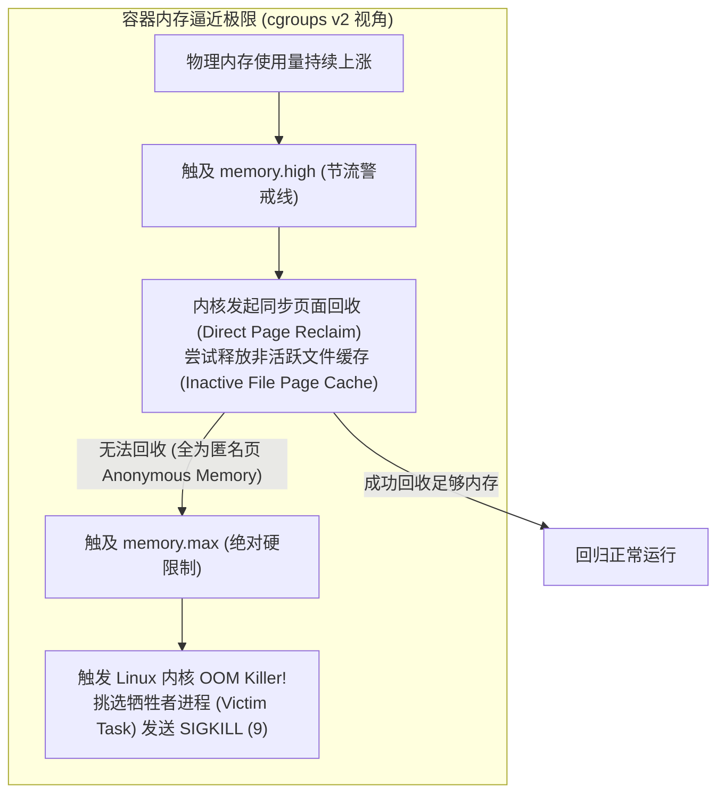
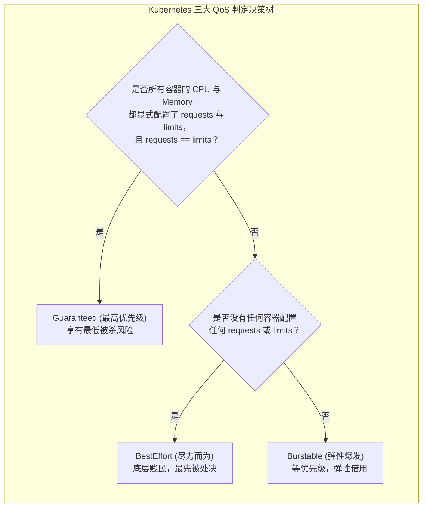
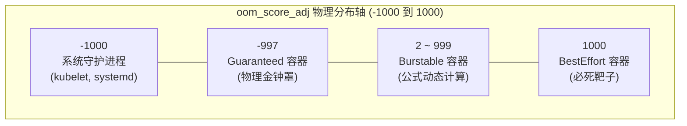
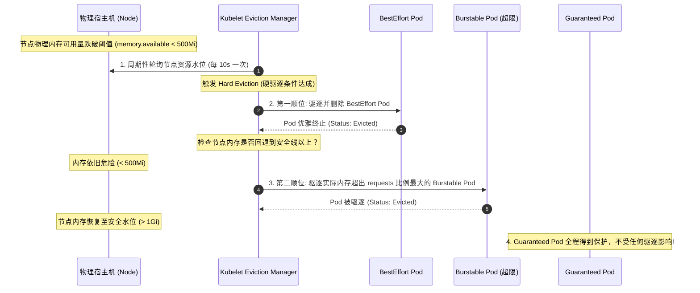
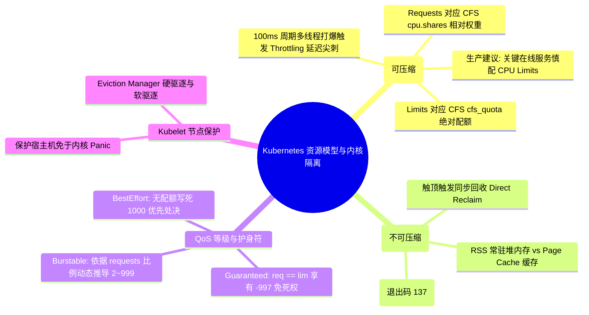

**TL;DR：** 在许多团队将微服务迁移到 Kubernetes 的初期，常常遭遇一个反直觉的诡异故障：**应用分配了充足的 CPU Limits（如 2 核），CPU 整体利用率才 30%，但接口的 P99 延迟却莫名飙升至数秒，甚至频繁发生 RPC 调用超时**。一旦将 `resources.limits.cpu` 彻底移除，延迟立刻恢复丝滑。这背后的物理根源在于**Kubernetes 的 CPU 与 Memory 在 Linux 内核层有着截然不同的资源映射本质**：CPU 是“可压缩资源（Compressible）”，`requests` 对应 CFS 完全公平调度器的相对权重分配（`cpu.shares` / `cpu.weight`），而 `limits` 对应 CFS 硬配额限制（`cpu.cfs_quota_us`）。在默认 100ms 的配额周期内，多线程突发流量会瞬间耗尽配额，导致容器被内核**强制冰冻暂停数十毫秒（CPU Throttling）**。相反，Memory 是“不可压缩资源（Incompressible）”，一旦触顶 `memory.max` 无法回收，内核将立即激活 **OOM Killer** 强杀进程。为了在资源紧缺时维持集群秩序，Kubernetes 划分了 **Guaranteed、Burstable、BestEffort** 三大 QoS 等级，并通过精密计算宿主机 `/proc/<pid>/oom_score_adj` 分数（-997 到 1000），决定了节点内存枯竭时的物理诛杀与 Kubelet 驱逐顺序。

---

## 一、 面试现场：从“配置 Limits 反致 P99 暴涨”到“内核诛杀驱逐”的连环追问

```text
面试官提问：
  "你们线上服务如果配置了 CPU Requests 和 Limits，为什么有时应用 CPU 利用率才 30%，P99 延迟却莫名暴涨数秒甚至超时？
   CPU 和 Memory 在 Linux 内核底层是如何被限额的？
   如果宿主机节点内存快用光了，Kubernetes 究竟根据什么决定先杀哪个 Pod？底层 oom_score_adj 是怎么算出来的？"
```

### 1.1 初级候选人的典型翻车点

在这道结合了内核调度、微服务延迟调优与故障排查的深水区面试题中，初级候选人极易暴露短板：
- **无法区分可压缩与不可压缩资源**：简单认为 CPU 和内存是一样的资源，以为配了 Limits 就是“设了个最大上限”，不知道 CPU 会 Throttling 而内存会直接触发 OOM 退出码 137；
- **误将整体利用率当成瞬时负载**：只看 Prometheus 上的 1 分钟平均 CPU 使用率（30%），完全不知道 CFS 是以 100ms 为微周期记账的，多线程突发在 20ms 内耗尽配额导致剩下 80ms 被内核强制定格挂起；
- **答不全 QoS 等级与 oom_score_adj 映射**：只记得 Guaranteed、Burstable、BestEffort 的名字，但说不清谁先被杀、为什么系统级守护进程有 `-997` 的免死金牌，以及 Burstable 的分数是如何根据 Request 占比动态推导的；
- **混淆 Linux 内核 OOM Killer 与 Kubelet Eviction**：分不清谁是容器内部超出内存限制的物理处决者，谁是宿主机节点承压保护全局的控制器。

### 1.2 资深工程师的破局切入点

资深架构师面对此类追问，会以**“物理内核资源记账模型与微周期调度抖动”**为脉络层层递进：
1. **解构 CFS 周期带宽控制（CFS Bandwidth Control）**：从 `cpu.cfs_period_us`（100ms）和 `cpu.cfs_quota_us` 入手，揭示多线程瞬时打爆配额引发 **CPU Throttling（强制造停）** 的物理全景，给出生产“No CPU Limits”或放大倍数的调优标准；
2. **对比内存层级与 OOM 诛杀**：拆解 RSS 常驻内存 vs Page Cache 缓存，说明 `memory.max` 触顶时内核先同步回收缓存，失败后进入 OOM Killer 杀死进程序列；
3. **推导 QoS 与 oom_score_adj 严密数学公式**：
   - Guaranteed: $req = lim \implies \text{oom\_score\_adj} = -997$（除系统核心守护进程外最安全）；
   - BestEffort: 无配额 $\implies \text{oom\_score\_adj} = 1000$（最高优先级诛杀）；
   - Burstable: 依据公式动态打分，超用比例越大越先被淘汰；
4. **对比内核级 cgroup OOM 与 Kubelet Eviction Manager 的防御纵深**。

### 1.3 生产谜案：配了 Limits 反而延迟雪崩的物理真相

在云原生微服务中，工程师习惯按照物理思维配置资源：
```yaml
resources:
  requests:
    cpu: "500m"
    memory: "1Gi"
  limits:
    cpu: "2000m"
    memory: "2Gi"
```
研发往往预期：该容器平时保底 0.5 核，突发峰值最高允许跑到 2 个整核。

然而，一旦应用是基于多线程模型（如 Java Web 服务启动了 64 个 Worker 线程，或 Go 启动了成百上千个 Goroutine），在遇到高并发瞬时打压时，监控指标中的 CPU 利用率可能显示仅为 40%，但请求却出现了数十毫秒的悬停停顿。查看内核指标发现，容器的 `nr_throttled`（节流周期数）高达 30%~50%！



这就是 **CFS 周期性限额算法（Completely Fair Scheduler Quota）** 的物理惩罚：
- 内核默认以 `100ms`（`100,000 微秒`）作为一个记账周期（Period）；
- `limits: 2000m` 意味着在每个 100ms 周期内，该容器内**所有线程在宿主机所有 CPU 核心上累加运行的时间上限是 200ms**；
- 若容器内有 10 个并发线程同时处理请求，仅需短短 `20ms` 的真实时间，累积 CPU 耗时就会打满这 200ms 配额；
- **在当前 100ms 窗口剩下的整整 80ms 内，内核将把该容器移出可运行队列，所有线程被硬生生冻结！直到下一个周期开启！** 在用户看来，这 80ms 表现为绝对的请求停顿与 P99 尖刺。

---

## 二、 CPU 资源深水区：Requests 与 Limits 的内核映射



### 2.1 Requests 的底层本质：`cpu.shares` 与 `cpu.weight`

`requests.cpu` 在操作系统层面的作用是：**当物理宿主机 CPU 处于资源争用（Contention）饱和状态时，当前进程组能够分到的 CPU 时间片相对权重。**
- 在 cgroups v1 中，`1000m`（1 核）对应 `cpu.shares = 1024`；
- 如果宿主机上运行着两个容器：
  - 容器 A: `requests: 1000m` $\to$ `cpu.shares = 1024`
  - 容器 B: `requests: 3000m` $\to$ `cpu.shares = 3072`
- 当宿主机 CPU 100% 满载争抢时，CFS 调度器会保证容器 A 获得 $1024 / (1024 + 3072) = 25\%$ 的 CPU 算力，而容器 B 获得 $75\%$；
- **最关键的是：如果宿主机 CPU 空闲，`requests` 绝不限制容器向上借用多余的空闲 CPU 算力！**

### 2.2 Limits 的底层本质：`cpu.cfs_quota_us`

与 Requests 截然相反，`limits.cpu` 是一道**绝对的物理天花板**：
- 它根本不管宿主机当前是否还有 90% 的 CPU 闲置在空转，只要当前容器在 100ms 周期内消耗完自身的 Quota，立刻被内核切断调度；
- 内核统计指标位于 `/sys/fs/cgroup/cpu/cpu.stat`（或 v2 的 `cpu.stat`）：
  - `nr_periods`：经历的总 CFS 周期数；
  - `nr_throttled`：被节流强制造停的周期数；
  - `throttled_time`：累积被冰冻的总纳秒数。

#### 多线程突发下的配额耗尽数学推导：

假设容器配置 `limits.cpu = 2000m`（即配额为 2 个整核，$\text{cfs\_quota\_us} = 200,000\,\mu\text{s}$，周期 $\text{period} = 100,000\,\mu\text{s}$）。
如果应用是高并发 Web 服务，启动了 $N = 16$ 个并发工作线程。当流量突发时，所有 16 个线程在宿主机不同 CPU 核心上同时运行：

$$T_{\text{exhaust}} = \frac{\text{cfs\_quota\_us}}{N_{\text{active\_threads}}} = \frac{200,000\,\mu\text{s}}{16} = 12,500\,\mu\text{s} = 12.5\,\text{ms}$$



**结论**：在整整 100ms 的窗口里，容器**只跑了 12.5ms 就把配额透支殆尽，剩下的 87.5ms 处于绝对的冰冻挂起状态！** 这就是为什么微服务 CPU 利用率仅显示 20%~30%，但 RPC 接口 P99 却经常出现 80ms~90ms 恐怖尖刺的微观物理真相！

### 2.3 cgroups v1 与 v2 内核接口对照速查

| 控制器功能 | cgroups v1 接口文件路径 | cgroups v2 统一文件路径 | 核心物理语义 |
| --- | --- | --- | --- |
| **CPU 相对权重** | `cpu/cpu.shares` (默认 1024) | `cpu.weight` (范围 1~10000) | 争用时的 CPU 时间片分配比率 |
| **CPU 周期上限** | `cpu/cpu.cfs_quota_us` / `cpu.cfs_period_us` | `cpu.max` (格式: `quota period`) | 绝对物理限额，触顶强制造停 |
| **内存软限制/节流** | `memory/memory.soft_limit_in_bytes` | `memory.high` | 跨过即触发渐进式回收与轻微 Sleep 惩罚 |
| **内存硬天花板** | `memory/memory.limit_in_bytes` | `memory.max` | 绝对物理内存上限，无法回收即触发 OOM Killer |
| **I/O 带宽限制** | `blkio/blkio.throttle.read_bps_device` | `io.max` (rbps/wbps/riops/wiops) | 单个控制组的块设备磁盘吞吐天花板 |

---

## 三、 内存资源深水区：Page Cache 与 OOM Killer 物理杀戮

与 CPU 这种可压缩资源不同，**物理内存是不可压缩的（Incompressible）**。CPU 超配只会带来排队和变慢，而内存超配一旦无法回收，系统将面临无法分配新内存页的死地。



### 3.1 内存的真实构成：Anonymous Memory vs Page Cache

很多工程师排查 Pod 内存时会问：“为什么 Java 堆内存配置了 `-Xmx1g`，但 Pod 内存监控显示占用了 1.8G，导致被 K8s 判定 OOM 强杀？”

容器所消耗的内存（`memory.usage_in_bytes` / `memory.current`）由两大板块构成：
1. **匿名内存（Anonymous Memory, RSS）**：
   - 包含进程代码执行的堆、栈、JVM 元空间（Metaspace）、线程栈、直接内存（DirectByteBuffer）；
   - **这部分内存无法直接丢弃**，除非系统配置了 Swap 交换分区并将其换出到磁盘（生产 K8s 绝大多数默认禁用 Swap）；
2. **页面缓存（Page Cache / File Cache）**：
   - 应用读取磁盘文件、写日志时，Linux 内核为了加速 I/O 自动在内存中建立的缓存映射；
   - 这部分属于“可回收内存”，当系统紧缺时内核可以丢弃。

### 3.2 OOM 发生的物理瞬间

当应用尝试通过 `brk(2)` 或 `mmap(2)` 分配新内存，导致内存总量跨过 `memory.max` 边界时：
1. 内核首先挂起申请内存的线程，执行**同步直接回收（Direct Page Reclaim）**，试图把所有的 Clean Page Cache 强行释放；
2. 如果应用大部分是常驻堆内存（RSS），回收后可用空间依然为 0；
3. 内核确认物理无解，激活 `mem_cgroup_out_of_memory()`；
4. 内核日志打印：`Memory cgroup out of memory: Kill process 29104 (java) score 950 and children`；
5. 内核向该容器内的目标进程无条件发送不可捕获的 **`SIGKILL` (信号 9)**，容器退出码为 **137**（$128 + 9$）。

### 3.3 2024~2026 前沿演化：Node Memory Swap GA 与单进程 OOM 精确诛杀

在近年的 Kubernetes 官方演进中，内存管理迎来了两大颠覆历史认知的重大突破：

#### 1. 终结 `swapoff -a` 教条：Node Memory Swap 正式 GA（K8s 1.31）
过去十年来，几乎所有 K8s 安装文档的第一步都是执行 `swapoff -a`，如果节点开启了 Swap，Kubelet 会直接拒绝启动（`failSwapOn: true`）。其历史原因在于：旧版 cgroups v1 无法将 Swap 交换分区精准计入单容器的配额，容易引发不可预测的性能退化。
而在 **Kubernetes 1.31** 中，基于 cgroups v2 的 **Node Memory Swap Support 正式宣告 GA**：
- 通过 Kubelet 配置 `memorySwap: { swapBehavior: "LimitedSwap" }`，集群管理员可以允许普通 Pod 在遭遇瞬时内存脉冲时，受控使用不超过其 `memory.limit` 比例的 Swap 空间；
- 避免了仅仅因为几 MB 的短暂毛刺就被 OOM Killer 瞬间诛杀，极大提升了批处理与 AI 预处理任务的存活率。

#### 2. 精确制导：`singleProcessOOMKill` 单进程处决模式（K8s 1.32）
在传统的 cgroups v2 架构下，一旦容器内部内存超标，内核默认会将整个 cgroup 的所有进程一锅端（Killing the whole container，退出码 137）。
**Kubernetes 1.32（KEP-4888）** 引入了革命性的 **`singleProcessOOMKill`** 门控：
- 启用后，Kubelet 会将 cgroups v2 的 `memory.oom.group` 标志位置为 0；
- 当容器内的某一个失控子进程（例如后台异步分析任务或泄漏的 Python 脚本）超出内存边界时，内核**仅精准处决该特定子进程，而容器的主进程（PID 1）与核心服务（如 Nginx/Go API）依然安然无恙地继续对外提供服务**！彻底终结了“一人犯错、全家陪葬”的历史困局。

---

## 四、 Kubernetes 三大 QoS 等级判定标准

Kubernetes 根据 Pod 内所有容器对 CPU 和内存的 `requests` 与 `limits` 的配置关系，在 Pod 准入时自动为其打上三个互斥的 **QoS 等级（Quality of Service）**。



| QoS 等级 | 判定严格条件 | 典型业务场景 | 内核保护力度 |
| --- | --- | --- | --- |
| **Guaranteed** | 1. 每一个容器（包括 Init 容器）都设置了 CPU 和 Memory 的 limits 和 requests<br/>2. 且对应值的数值**绝对相等** | 核心数据库、核心金融交易路由、毫秒级敏感服务 | **最高**（只有在整机内核濒临崩溃时才会考虑） |
| **Burstable** | 1. 不满足 Guaranteed<br/>2. 且至少有一个容器配置了 CPU 或 Memory 的 requests | 大多数常规 Web 微服务、API 服务 | **中等**（依据实际内存超配比例动态计算护身符） |
| **BestEffort** | 所有容器都**完全没有配置**任何 requests 和 limits | 离线计算批处理、低优先级日志转储、测试验证任务 | **最低**（宿主机一旦缺内存，第一时间处决） |

---

## 五、 `oom_score_adj` 数学推导与内核诛杀优先级

当整台宿主机发生严重内存枯竭时，Linux 内核的 OOM Killer 会扫描全局所有进程，并计算每个进程的综合死亡得分（`oom_score`）：

$$\text{oom\_score} = \text{BadnessScore}(\text{MemoryUsage}) + \text{oom\_score\_adj}$$

得分最高者（最高 1000 分）将被优先处决。
Kubernetes 的核心把控点，就在于利用 `/proc/<pid>/oom_score_adj`（取值范围：`-1000` 到 `1000`）强行干预内核的屠杀次序！



### 5.1 各 QoS 等级的计算公式

#### 1. Guaranteed Pod
Kubelet 直接将该 Pod 内所有进程的 `oom_score_adj` 硬编码写死为：
$$\text{oom\_score\_adj} = -997$$
为什么不是 `-1000`？因为 `-1000` 代表绝对免疫，是留给操作系统核心进程（如 `systemd`、`sshd`、`dockerd`、`kubelet`）专用的。`-997` 确保在任何普通应用死亡前，Guaranteed 应用享有最高特权。

#### 2. BestEffort Pod
Kubelet 将其直接写死为最大可能值：
$$\text{oom\_score\_adj} = 1000$$
当内存不足时，无需任何计算，BestEffort 容器瞬间被内核作为第一批牺牲品处死。

#### 3. Burstable Pod
Burstable Pod 的计算采用了极其精密的**反比例惩罚算法**：

$$\text{oom\_score\_adj} = \max\left(2, \; 1000 - \frac{1000 \times \text{requests.memory}}{\text{NodeAllocatable.memory}}\right)$$

**数学本质分析**：
- 如果一个 Burstable 容器在 64GB 内存的节点上，声明了高达 32GB 的 `requests.memory`（占节点容量 50%）：
  $$\text{oom\_score\_adj} = 1000 - (1000 \times 0.5) = 500$$
- 如果另一个 Burstable 容器只声明了 3.2GB 的 `requests.memory`（占节点容量 5%）：
  $$\text{oom\_score\_adj} = 1000 - (1000 \times 0.05) = 950$$
- **结论**：**声明的 Requests 越多，代表向平台承诺的底线越高，其 `oom_score_adj` 分数越低，在发生 OOM 时越安全！**

---

## 六、 Kubelet Eviction Manager：节点级优雅自愈驱逐

除了内核被动的 OOM Killer 强杀之外，Kubelet 内部还运行着一个主动防范灾难的守护者——**Eviction Manager（驱逐管理器）**。



### 6.1 硬驱逐（Hard Eviction）与软驱逐（Soft Eviction）
Kubelet 支持配置保护阈值（如 `--eviction-hard=memory.available<500Mi,nodefs.available<10%`）：
- **硬驱逐（Hard Eviction）**：一旦触发，Kubelet 不给任何缓冲宽限期，直接将 Pod 的 `status.phase` 改为 `Failed`，并立即强制杀掉容器，防止宿主机陷入死机；
- **软驱逐（Soft Eviction）**：允许配置宽限观察期（如持续 90 秒低于阈值才触发），并为应用保留正常的 `terminationGracePeriodSeconds` 优雅下线时间。

---

## 七、 面试通关复盘与架构师高分回答模板



### 7.1 现场 2 分钟极速电梯演讲（高分答题模板）

> **面试官问：**“为什么线上服务配了 CPU Limits 反而频繁遭遇 P99 延迟暴涨与超时？内核与 Kubelet 是如何处理 OOM 驱逐的？”

**高分应答结构（递进式穿透）：**

> “**第一层（内核限额物理机制与 CPU Throttling）：**
> CPU 是可压缩资源，在 Linux cgroups 中，`requests` 对应 CFS 调度器的相对权重（`cpu.shares` / `cpu.weight`），而 `limits` 对应 CFS 周期带宽配额（`cpu.cfs_quota_us`，默认以 100ms 为一个周期）。若为多线程服务（如 Java/Go）配置了 2 核的 Limits，则每个 100ms 周期最多消耗 200ms 的 CPU 累积时间。当突发并发到来时，10 个线程仅需 20ms 的物理时间就会将 200ms 配额耗尽；在当前周期的剩余 80ms 内，内核 CFS 调度器会将整个容器的所有线程直接挂起（Throttled），直到下一个周期重新充值配额，这直接导致服务 P99 延迟暴涨甚至 RPC 超时。因此在线核心业务推荐‘只配 Requests、不配 Limits’或将 Limits 放大 3~5 倍。
>
> **第二层（内存不可压缩与内核 OOM Killer）：**
> 内存是不可压缩资源，对应 cgroups 的 `memory.max`。容器内存由常驻 RSS 与 Page Cache 构成；当内存触顶时，内核首先触发同步回收（Direct Reclaim）尝试清理缓存；若回收后依然不足以分配新页，内核立即激活 **OOM Killer**，向容器主进程发送 `SIGKILL` 强制诛杀（进程退出码 137）。
>
> **第三层（QoS 等级、oom_score_adj 映射与双重防线）：**
> Kubernetes 基于 Requests 与 Limits 的关系划分为三大 QoS 等级，并直接计算宿主机 `/proc/<pid>/oom_score_adj` 分数：
> 1. **Guaranteed**（Req == Lim）：`oom_score_adj = -997`，除系统核心组件（-1000）外拥有绝对免死权；
> 2. **BestEffort**（无 Req/Lim）：`oom_score_adj = 1000`，宿主机承压时最优先被处决；
> 3. **Burstable**：根据公式 $\max(\lfloor 1000 - \frac{\text{req}}{\text{node}} \times 1000 \rfloor, 2)$ 动态打分，使用超额越多越先死。
> 在防线分工上，**cgroup OOM Killer** 是容器自身内存超额时的内核级处决；而 **Kubelet Eviction Manager** 则是宿主机物理内存濒临枯竭时（如低于 500MiB），为防止主机雪崩死机而主动由外向内发起的软/硬优雅驱逐。”

### 7.2 生产面试关键避坑守则

1. **在线核心微服务慎配 CPU Limits**：业界大厂（如 Google、Uber）在线低延迟核心微服务普遍推行‘No CPU Limits’策略，或者设置 3~5 倍弹性上限，避免 CFS 周期节流；
2. **严密监控 CPU Throttling 比例**：在 Prometheus 中监控 `container_cpu_cfs_throttled_periods_total / container_cpu_cfs_periods_total`，一旦节流周期占比超过 15%，必须立刻调优；
3. **关键基础设施锁定 Guaranteed QoS**：Envoy 网关、CoreDNS、注册中心等组件，必须将 CPU 与 Memory 的 Requests 和 Limits 设为完全一致，锁定 `-997` 的免死金牌；
4. **澄清 Java 容器内存参数**：Java 应用必须配置 `-XX:MaxRAMPercentage=75.0`，为堆外内存（Off-Heap）、Metaspace、线程栈以及 glibc 内存碎片预留出 25% 的安全缓冲，否则即使堆没满也会触发 cgroup OOM。
---

## 参考资料与权威规范

1. **Linux Kernel Documentation**: *CFS Bandwidth Control & Memory Resource Controller* (`Documentation/scheduler/sched-bwc.rst`, `cgroup-v2.rst`).
2. **Kubernetes Official Documentation**: *Configure Quality of Service for Pods & Node-pressure Eviction* (kubernetes.io/docs/tasks/configure-pod-container/quality-service-pod/).
3. **Kubernetes Source Code**: *Kubelet Eviction Manager and oom_score_adj calculation* (`k8s.io/kubernetes/pkg/kubelet/eviction/`, `k8s.io/kubernetes/pkg/kubelet/qos/`).
4. **Linux Manual Pages**: `oom-killer(2)`, `proc(5)` (/proc/[pid]/oom_score_adj).
5. **ACM Queue**: *CPU Throttling in Containerized Environments* (B. Gregg, 2021).
