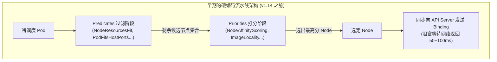
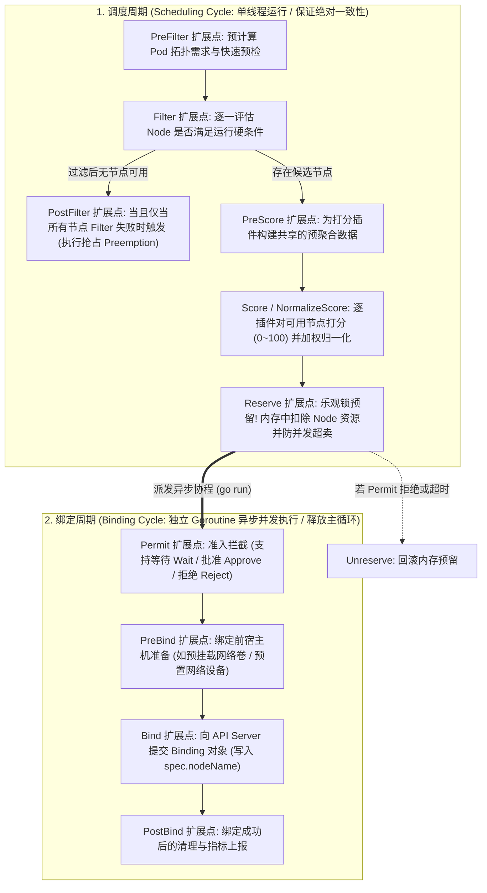
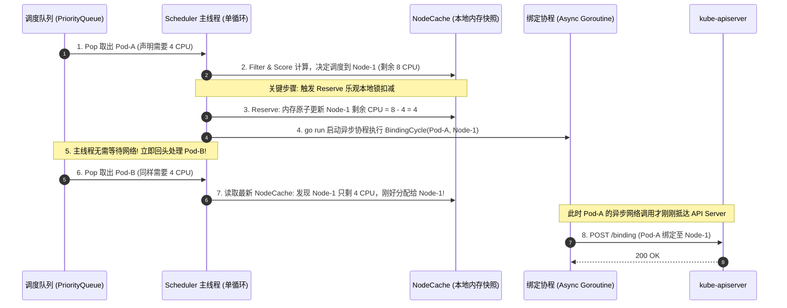
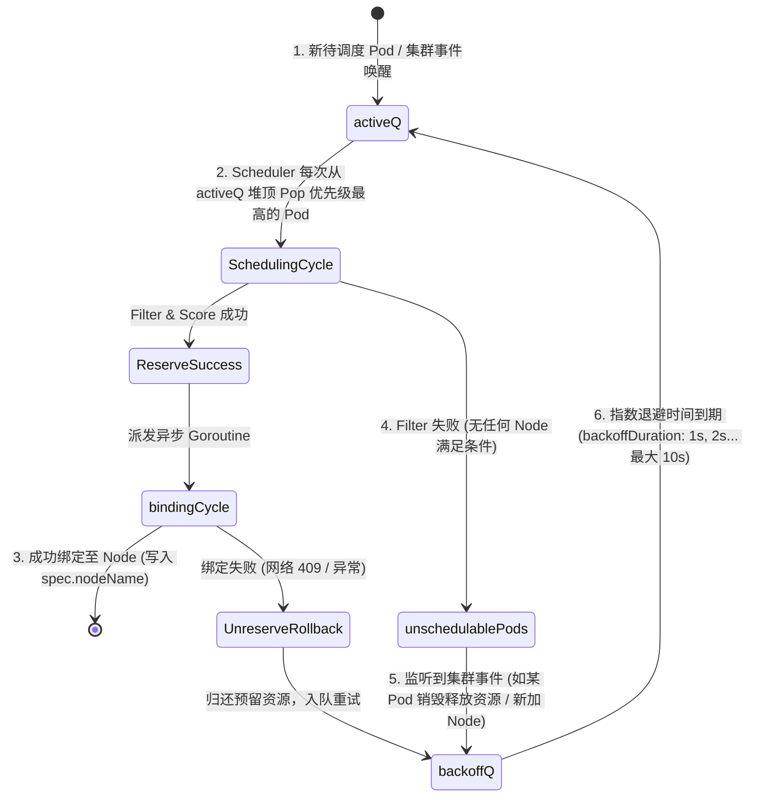
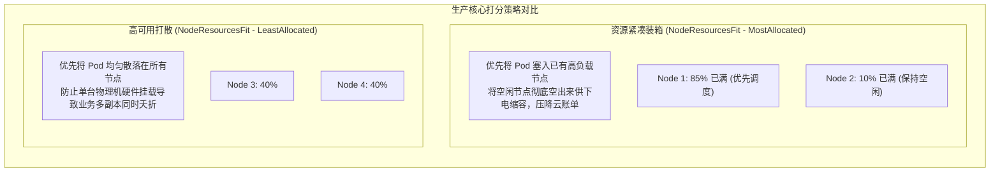
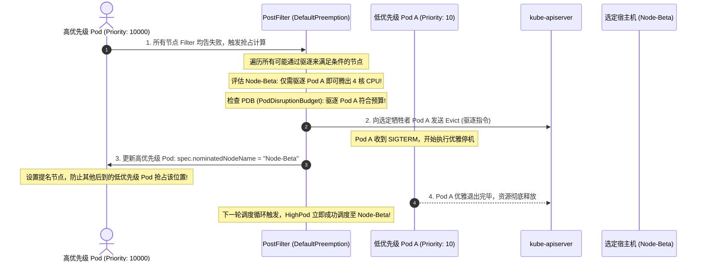
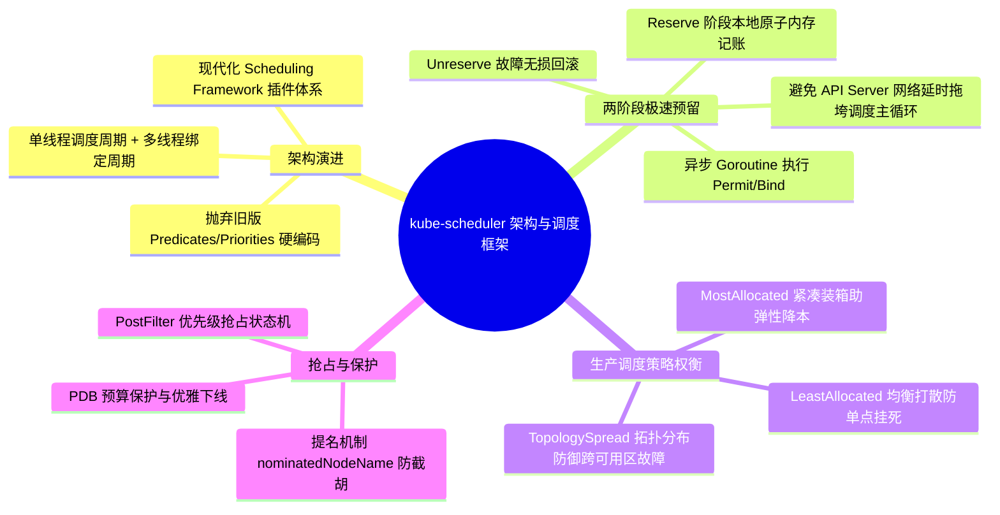

**TL;DR：** 在大规模生产集群中，`kube-scheduler` 必须在每秒处理数百个 Pod 的并发调度请求，并在数千台由普通 CPU、GPU 异构卡、不同可用区（AZ）与故障域交织的复杂节点拓扑中，毫秒级计算出最优分配。早期的 Kubernetes 调度器采用硬编码的 `Predicates`（断言过滤）与 `Priorities`（打分优选）管道，任何定制化逻辑（如深度学习分布式训练的 Gang Scheduling、拓扑感知调度）都必须侵入式修改官方源码重新编译。为了彻底解耦并释放极速性能，Kubernetes 演进出了 **Scheduling Framework（调度框架）**。它将调度过程严格划分为**单线程高速的调度周期（Scheduling Cycle）**与**异步并发执行的绑定周期（Binding Cycle）**，并在沿途开放了 **9 大扩展点（PreFilter 到 PostBind）**。通过在 **Reserve（预留阶段）** 采用乐观并发内存记账，调度器无需等待缓慢的 API Server 远程网络绑定返回，即可立即推进下一个 Pod 的计算，将单调度器实例的吞吐提升了数十倍；而在资源耗尽时，**PostFilter 抢占状态机**则以最小代价优雅驱逐低优先级 Pod，筑起高 SLA 业务的算力底盘。

---

## 一、 面试现场：从“万级 Pod 毫秒级决策”到“并发抢占截胡”的连环追问

```text
面试官提问：
  "在 5000 个节点的大规模异构集群中，kube-scheduler 是如何在几毫秒内为 Pod 选出最优节点的？
   为什么早期调度器每秒只能调度几十个 Pod，而现代 Scheduling Framework 吞吐提升了数十倍？
   如果在高负载下资源耗尽，高优先级的 Pod 是如何实施抢占的？如何防止释放出来的资源被其他 Pod‘半路截胡’？"
```

### 1.1 初级候选人的典型翻车点

在调度器架构这一高级系统设计考题中，初级候选人往往止步于表象：
- **只会背“预选（Filter）和优选（Score）”**：回答停留在两阶段过滤打分，完全不知道现代 Scheduling Framework 的九大扩展点，更不知道为什么调度逻辑要拆解为“调度周期（Scheduling Cycle）”和“绑定周期（Binding Cycle）”；
- **不理解调度吞吐瓶颈的物理本质**：不知道旧版调度器是被向 API Server 发起 `Binding` 的远程网络 I/O 阻塞死，以为调度器吞吐低纯粹是 CPU 算力不够；
- **答不出 Reserve 乐观锁与并发并发机制**：无法解释“为什么调度器能以单线程极速决策，同时并发异步发起 Bind，而不会发生资源并发超卖（Race Condition）”；
- **对抢占截胡毫无防御概念**：只知道把低优先级 Pod 杀掉，但不知道从发起删除到容器优雅退出的 30 秒窗口期内，如何防止新来的其他低优先级 Pod 将该节点的资源偷走。

### 1.2 资深工程师的破局切入点

资深架构师面对此类考题，能够站在**“高吞吐并发控制与两阶段乐观状态机”**的高度统领全场：
1. **对比架构演进**：点出旧版单体硬编码流水线因为同步等待 Binding 网络往返（50~100ms），吞吐被压制在 10~20 Pod/s；
2. **剖析 Scheduling Framework 的双周期与九大扩展点**：
   - **串行调度周期（Scheduling Cycle）**：PreFilter、Filter、PostFilter、PreScore、Score、Reserve 运行在极速单线程内存中，耗时仅数微秒；
   - **并发绑定周期（Binding Cycle）**：Permit、PreBind、Bind、PostBind 交由独立 Goroutine 异步并发执行；
3. **揭秘 Reserve 乐观预留与 Unreserve 回滚**：在选定节点后，主线程立即在内存缓存（NodeInfo）中原子扣减资源，随后立即开启下一个 Pod 的计算；若异步 Bind 失败，通过 Unreserve 优雅回滚，彻底解除了网络 I/O 对调度主循环的阻塞；
4. **深入抢占状态机与 `nominatedNodeName` 提名防截胡机制**：详细推导 PostFilter 贪心驱逐算法、PDB 预算保护，以及通过 `nominatedNodeName` 标记占位，彻底杜绝资源被第三方偷跑的死锁风险。

### 1.3 传统硬编码流水线的架构死局

在 Kubernetes 1.14 之前，调度器逻辑被固化在 `pkg/scheduler/core/generic_scheduler.go` 的一个巨型函数中：



这种单体设计存在三大难以忍受的生产痛点：
1. **二次开发成本极其昂贵**：企业如果想增加一个“优先调度到冷冷机柜”或“多 Pod 全开全闭（All-or-Nothing / Gang）”的自定义策略，必须 Fork 整个 Kubernetes 官方主干，修改核心源码并维护私有二进制；
2. **缺乏生命周期钩子**：打分之后、真正生效之前，没有办法给外部系统留出资源预占或安全审批的介入窗口；
3. **吞吐低下被同步网络 I/O 拖垮**：每调度一个 Pod，调度器都要同步调用 API Server 发起 `POST /api/v1/namespaces/default/pods/xxx/binding`，在网络往返和 etcd 写入完成之前，下一个 Pod 只能在内存中苦苦排队。

### 1.4 现代 Scheduling Framework 的设计哲学

从 Kubernetes 1.18 孵化、并在 1.25+ 全面成为生产唯一的标准体系是 **Scheduling Framework**。
它的核心设计哲学是：**将整个调度全生命周期抽象为一组有序的扩展点（Extension Points），所有的调度策略（包括官方自带的资源过滤、亲和性、污点）全部被重构为标准的插件（Plugins）实现。**

---

## 二、 九大扩展点全景：调度周期 vs 绑定周期

Scheduling Framework 将一个 Pod 的调度全生命周期划分为两个截然不同的物理阶段：



### 2.1 调度周期扩展点（Scheduling Cycle）
调度周期必须**串行、单线程极速运行**，因为任何资源的扣减决策必须依赖最新且确定的全局视图。
1. **PreFilter**：在遍历节点前，预先处理 Pod 的全局信息（如统计 Pod 声明的所有 PVC、检查亲和性拓扑键），避免在 Filter 遍历几千个节点时做重复运算；
2. **Filter**：核心硬约束过滤（相当于旧版 Predicates）。例如：`NodeResourcesFit` 检查 CPU/Memory 是否充足，`NodeName` 检查指定节点，`NodePorts` 检查端口冲突，`TaintsTolerations` 检查节点污点；
3. **PostFilter**：**兜底拯救阶段**。当 Filter 运行完后发现没有任何节点满足条件，调度器调用 PostFilter 扩展点。默认内置的实现是启动抢占状态机（Preemption）；
4. **PreScore**：为打分阶段做前置准备；
5. **Score & NormalizeScore**：给通过 Filter 的所有合格节点进行软性优选打分（0 到 100 分），并将各插件的分数乘上权重后归一化求和，分数最高者胜出；
6. **Reserve**：**核心分水岭**！一旦决定了获胜节点，立即触发 Reserve。

### 2.2 绑定周期扩展点（Binding Cycle）
一旦 Reserve 成功，调度主线程**立刻启动一个新的独立 Goroutine** 去执行绑定周期，而主调度循环立即回去调度队列里的下一个 Pod！
7. **Permit**：用于高级协同调度。Permit 可以返回三种状态：
   - `Success`：立即进入绑定；
   - `Reject`：拒绝调度并回滚；
   - `Wait`：挂起并等待指定超时（例如等待 60 秒）。**这正是 Gang Scheduling 的物理基石：10 个 Pod 必须全部到达 Permit 阶段且都处于 Wait，控制器才统一发出批准指令同时放行！**
8. **PreBind**：在 Pod 正式绑定前执行预备动作（如向网络控制器预先下发安全策略）；
9. **Bind**：将 `Binding` 结构体通过 REST 发送给 `kube-apiserver`，将 Pod 的 `spec.nodeName` 正式持久化到 etcd；
10. **PostBind**：清理临时上下文，通知 Prometheus 记录延迟。

---

## 三、 吞吐翻倍的秘密：Reserve 乐观预留与两阶段提交

为什么 Scheduling Framework 能够让 Kubernetes 调度器的吞吐从每秒十几个 Pod 跃升至每秒数百个 Pod？关键就在于 **Reserve 机制的两阶段设计**。



### 3.1 乐观并发控制的闭环
- 如果采用传统的同步绑定，调度器必须在每一次调度后停顿等待 API Server 和 etcd 耗时（通常 10ms~50ms）；
- 在 Reserve 架构下，调度器把向 API Server 的同步写变成了**纯内存的先斩后奏**：在本地 `NodeInfo` 结构体中先扣掉资源；
- **回滚兜底（Unreserve）**：如果在后续的 Permit 超时被 Reject、或者异步向 API Server 发送 Binding 时遭遇网络异常/409 冲突，调度器会立即触发 `Unreserve` 钩子，将本地内存快照中扣除的资源如数归还，状态彻底自愈。

### 3.2 调度内部三队列架构：activeQ、backoffQ 与 unschedulablePods

kube-scheduler 内部维护了一个极为精密的优先级队列管理器（`PriorityQueue`），它由三级子队列构成：



- **activeQ**：基于二叉堆实现的优先队列，按 `Pod.Spec.Priority` 降序排列。调度器主线程永远只从 `activeQ` 中取元素；
- **unschedulablePods**：当一个 Pod 遍历全集群节点都被 Filter 拒绝后，它不会被傻傻地放回 activeQ 空转，而是暂存到 `unschedulablePods` 哈希集合中；
- **集群事件驱动唤醒（Cluster Event Handler）**：调度器监听集群内的全部变动。一旦监听到相关事件（如 `AssignedPodDelete` 释放了算力、`NodeAdd` 新增了机器、`NodeUpdate` 修复了污点），调度器通过 `AssignedPodDeleteFunc` 精准把可能因此受益的 Pod 从 `unschedulablePods` 转移到 `backoffQ`；
- **backoffQ**：带冷却期的缓冲队列，防止因连续调度失败瞬间打崩 CPU，指数退避到期后平滑重返 `activeQ`。

### 3.3 实战：编写一个极简 Scheduling Framework 插件

```go
package sampleplugin

import (
    "context"
    v1 "k8s.io/api/core/v1"
    "k8s.io/apimachinery/pkg/runtime"
    "k8s.io/kubernetes/pkg/scheduler/framework"
)

const Name = "ZoneDisasterRecovery"

// 实现 FilterPlugin 与 ScorePlugin 双接口
type ZoneDisasterRecovery struct {
    handle framework.Handle
}

var _ framework.FilterPlugin = &ZoneDisasterRecovery{}
var _ framework.ScorePlugin = &ZoneDisasterRecovery{}

func (z *ZoneDisasterRecovery) Name() string { return Name }

// Filter: 硬性排斥处于维护中可用区的节点
func (z *ZoneDisasterRecovery) Filter(ctx context.Context, state *framework.CycleState, pod *v1.Pod, nodeInfo *framework.NodeInfo) *framework.Status {
    node := nodeInfo.Node()
    if node == nil {
        return framework.NewStatus(framework.Error, "NodeInfo 为空")
    }
    if node.Labels["topology.kubernetes.io/zone-status"] == "draining" {
        return framework.NewStatus(framework.Unschedulable, "可用区正在维护排空中")
    }
    return framework.NewStatus(framework.Success, "")
}

// Score: 优先打分到绿色节能可用区
func (z *ZoneDisasterRecovery) Score(ctx context.Context, state *framework.CycleState, p *v1.Pod, nodeName string) (int64, *framework.Status) {
    nodeInfo, err := z.handle.SnapshotSharedLister().NodeInfos().Get(nodeName)
    if err != nil {
        return 0, framework.NewStatus(framework.Error, err.Error())
    }
    if nodeInfo.Node().Labels["power-mode"] == "green-solar" {
        return 100, framework.NewStatus(framework.Success, "")
    }
    return 50, framework.NewStatus(framework.Success, "")
}
```

---

## 四、 核心过滤与打分算法实战

在众多的 Filter 与 Score 插件中，生产环境最重要的三类算法是：**资源装箱、亲和性/反亲和性、以及拓扑分布约束**。



### 4.1 节点打散（LeastAllocated）vs 节点装箱（MostAllocated）

官方 `NodeResourcesFit` 打分插件支持两种互斥的策略，通过配置文件自由切换：
- **LeastAllocated（默认均衡打散）**：
  $$\text{Score} = \frac{\left(\text{Capacity}_{\text{cpu}} - \text{Requested}_{\text{cpu}}\right) \times 100}{\text{Capacity}_{\text{cpu}}}$$
  得分与空闲率成正比，空闲最多的节点得分最高。**优势：最大化容灾安全；劣势：产生大量节点资源碎片。**
- **MostAllocated（大促与降本装箱）**：
  $$\text{Score} = \frac{\text{Requested}_{\text{cpu}} \times 100}{\text{Capacity}_{\text{cpu}}}$$
  利用率越高的节点得分越高，尽可能把一台机器塞满，剩下的机器可以被 Karpenter / Cluster Autoscaler 自动缩容关机，为企业节省 30% 以上的服务器成本。

### 4.2 拓扑分布约束（Topology Spread Constraints）

为了防止同一个 Deployment 的所有 Pod 意外全部分配在同一个机架或同一个可用区（AZ），Kubernetes 提供了原生的拓扑分布算法：

```yaml
spec:
  topologySpreadConstraints:
  - maxSkew: 1
    topologyKey: topology.kubernetes.io/zone
    whenUnsatisfiable: DoNotSchedule
    labelSelector:
      matchLabels:
        app: trading-engine
```

- `topologyKey`：根据节点的标签划分物理拓扑域（如按机柜、按可用区）；
- `maxSkew: 1`：任意两个拓扑域之间的该应用 Pod 数量差值，**绝对不允许大于 1**；
- 如果当前 `zone-a` 已经跑了 3 个 Pod，而 `zone-b` 只有 1 个 Pod，调度器会强行限制新 Pod 只能落在 `zone-b`，严密守护可用区级容灾底盘。

---

## 五、 抢占调度机制：PostFilter 与优先级抢占状态机

当集群在大促高峰或故障转移期间资源被彻底耗尽、一个高优先级（PriorityClass）的支付 Pod 进场却无法通过 Filter 阶段时，调度器如何破局？



### 5.1 挑选牺牲者（Victims）的最小代价准则

抢占算法的核心是**贪心最小代价选择**，调度器在计算牺牲者节点时必须满足四条铁律：
1. **优先级不可倒挂**：只能驱逐优先级严格低于当前 Pod 的对象；
2. **牺牲者数量最小化**：如果驱逐 1 个 8 核的批处理 Pod 就能满足需求，绝不驱逐 8 个 1 核的业务 Pod；
3. **严格遵守 PodDisruptionBudget（PDB）**：如果某个被驱逐候选者配置了 PDB 且当前存活副本数已经处于临界危险线，除非没有其他可行方案，否则调度器优先保护不破坏 PDB；
4. **提名保护（NominatedNodeName）**：在被驱逐者优雅退出（`terminationGracePeriodSeconds: 30s`）的等待期内，调度器将该节点记录在高优先级 Pod 的 `status.nominatedNodeName` 字段中。在此期间，其他优先级更低的 Pod 计算时，调度器会假定被提名的 Pod 已经占有了该节点的资源，从而坚决防止资源在真正释放前被第三者“半路截胡”！

---

## 六、 面试通关复盘与架构师高分回答模板



### 6.1 现场 2 分钟极速电梯演讲（高分答题模板）

> **面试官问：**“面对 5000 台异构节点与海量 Pod，kube-scheduler 如何毫秒级选出最优节点？抢占机制如何防截胡？”

**高分应答结构（递进式穿透）：**

> “**第一层（吞吐瓶颈与架构解耦革命）：**
> 早期调度器吞吐低下的根因，是向 API Server 发起 Binding 的网络 I/O 阻塞了调度主循环。现代 **Scheduling Framework** 将调度过程彻底拆分为两阶段：**极速串行的调度周期（Scheduling Cycle）** 与 **异步并发的绑定周期（Binding Cycle）**。
>
> **第二层（九大扩展点与 Reserve 乐观预留机制）：**
> 1. **调度周期（单线程毫秒级）**：按顺序执行 PreFilter $\to$ Filter（硬约束过滤） $\to$ PreScore $\to$ Score（多插件加权打分 0~100） $\to$ **Reserve（乐观预留）**。
>    在 Reserve 阶段，调度器一旦选定节点，立即在本地内存的 `NodeInfo` 中原子扣除 CPU/内存并记录 Pod 占位。此时无需等待任何网络响应，主循环立即推进下一个 Pod 的调度，**从而将单实例吞吐提升了数十倍**；
> 2. **绑定周期（多协程并发）**：由独立 Goroutine 异步执行 Permit（准入拦截等待） $\to$ PreBind $\to$ Bind（网络提交 API Server） $\to$ PostBind。若异步 Bind 失败或 Permit 超时，调度器自动调用 `Unreserve` 原子回滚本地内存预留。
>
> **第三层（抢占算法与 nominatedNodeName 提名防截胡）：**
> 当集群资源耗尽导致 Filter 阶段全灭时，进入 **PostFilter 抢占状态机**：
> 1. 调度器按贪心算法在各节点评估牺牲者集合（必须优先级低于当前 Pod、数量最少、优先保护 PDB 预算）；
> 2. 选定牺牲者节点后，调度器向 API Server 发送删除牺牲者 Pod 的请求，同时将该节点写入当前高优先级 Pod 的 `status.nominatedNodeName` 字段；
> 3. **核心防截胡（Anti-Theft）机制**：在牺牲者优雅退出的 30 秒窗口期内，后续到来的其他低优先级 Pod 进行 Filter 计算时，调度器会**假定被提名的 Pod 已经占用了该节点的资源**，从而坚决防止新来的 Pod‘半路截胡’偷跑算力，保障了抢占动作的最终确定性。”

### 6.2 生产面试关键避坑守则

1. **绝对不要说“调度器全流程都是多线程并发”**：调度周期（Filter/Score/Reserve）必须严格单线程串行，否则内存记账会发生严重的资源超卖；只有绑定周期（Bind）才是多 Goroutine 并发；
2. **点明 Reserve 与 Unreserve 的两阶段事务思想**：类似于分布式事务中的 Try-Confirm/Cancel 逻辑，内存先预扣，失败再回滚；
3. **深入 nominatedNodeName 的占位语义**：很多候选人只知道杀了低优先级 Pod，但解释不清优雅退出期间资源如何不被其他 Pod 抢走；
4. **澄清 PDB（PodDisruptionBudget）的防御底线**：即使高优先级 Pod 抢占，除非没有其他任何可行方案，否则调度器会竭尽全力不破坏业务设定的最小存活副本数。
---

## 参考资料与权威规范

1. **Kubernetes Enhancement Proposal (KEP)**: *KEP-624: Scheduling Framework* (enhancements.k8s.io).
2. **Kubernetes Source Code**: *Scheduling Framework Implementation and Plugins* (`k8s.io/kubernetes/pkg/scheduler/framework/`).
3. **Kubernetes Official Documentation**: *Pod Priority and Preemption & Topology Spread Constraints* (kubernetes.io/docs/concepts/scheduling-eviction/).
4. **ACM Symposium on Cloud Computing**: *Omega: flexible, scalable schedulers for large compute clusters* (Schwarzkopf et al., 2013).
5. **Kubernetes Production Best Practices**: *Scheduler Performance Tuning & Scheduling Queue Design* (kubernetes.io/docs/reference/scheduling/config/).
