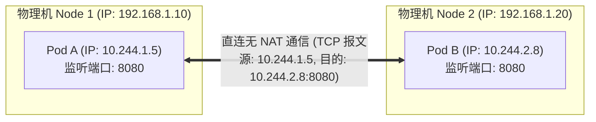
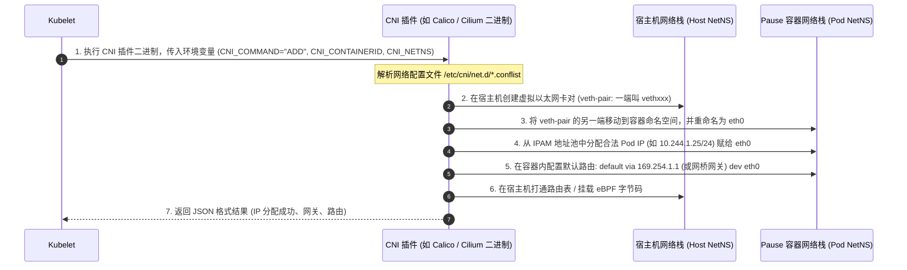
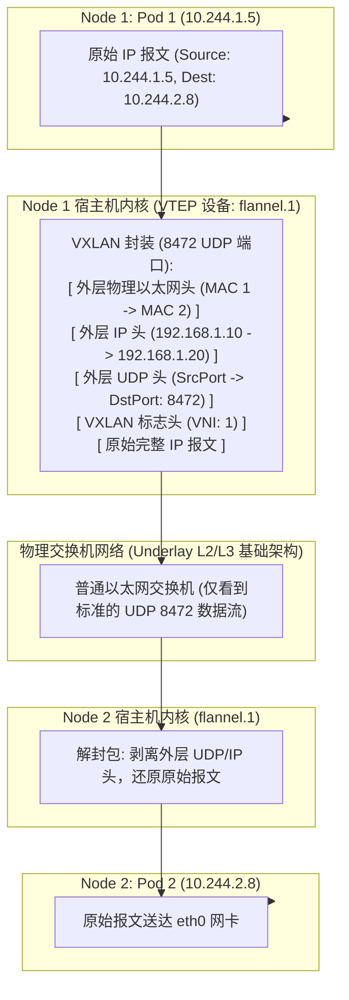
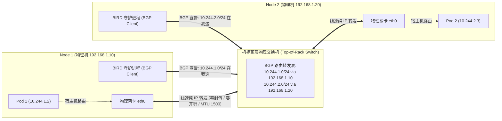
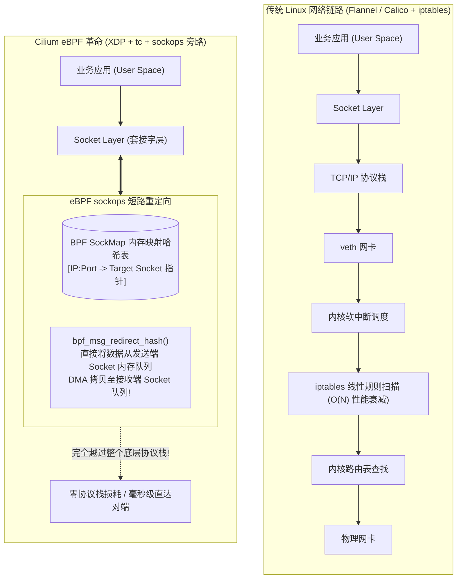
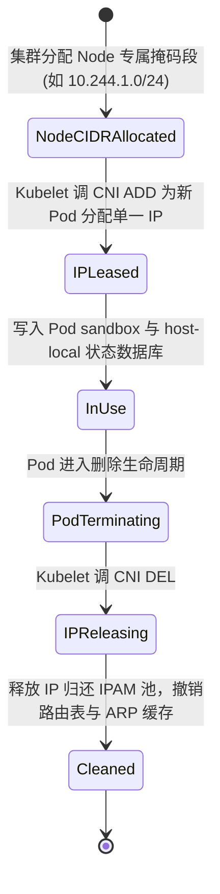
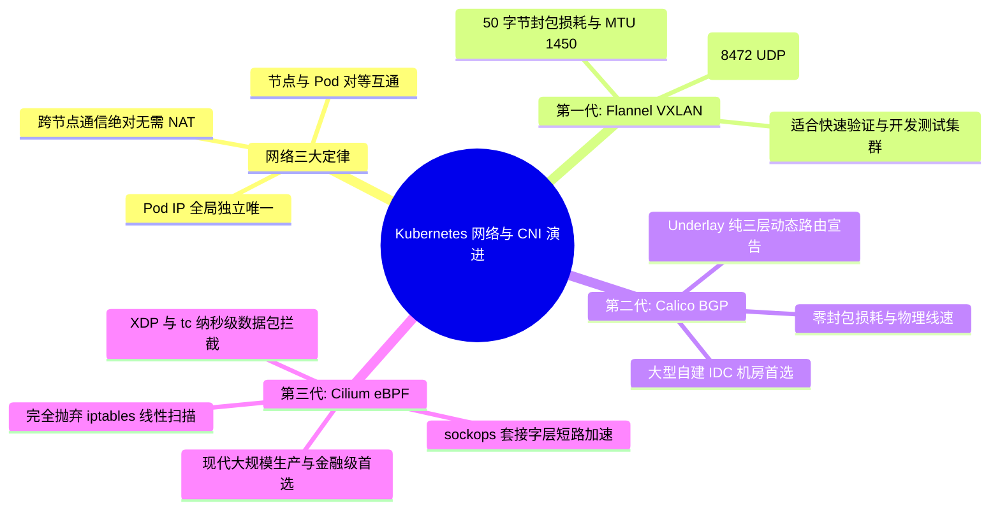

**TL;DR：** 在单机时代，Docker 默认的 Bridge 网络通过宿主机 iptables SNAT/DNAT 端口映射实现与外界通信，这一设计在数万个容器构成的跨主机集群中会导致“端口争抢”、“双向 IP 视野不一致”与“性能严重损耗”灾难。Kubernetes 彻底终结这一混乱，制定了**网络三大金科玉律：所有 Pod 拥有全局唯一独立 IP、任意两个 Pod 跨节点通信无需 NAT、宿主机与 Pod 通信亦无需 NAT**。为了践行这三大定律，业界诞生了不同代际的 CNI 插件：从初期的 **Flannel VXLAN** 采用 Linux 内核在 8472 端口封装 UDP 隧道（带来 20%~30% 的报文头开销与 CPU 拆装包损耗）；演进到 **Calico** 摒弃隧道、利用 BGP 动态路由协议将全网打造成纯三层路由扁平拓扑；最终收官于 **Cilium** 的云原生网络革命——**借助 eBPF 程序挂载在 Linux 内核 `tc`（流量控制）与 `sockops`（套接字操作）钩子，彻底越过笨重的 Linux 网络协议栈与 iptables 线性规则扫描，实现内核级套接字直连短路转发**，重构了云原生的网络性能天花板。

---

## 一、 面试现场：从“三大网络铁律”到“eBPF 旁路加速”的连环追问

```text
面试官提问：
  "Kubernetes 是如何实现跨主机容器通信不用做端口映射和 NAT 的？
   Flannel、Calico 和 Cilium 底层转发数据包的物理链路有什么根本区别？
   为什么在万级 Pod 的超大规模集群中，传统的 iptables 会成为网络性能杀手，而 Cilium 的 eBPF sockops 却能实现纳秒级套接字短路转发？"
```

### 1.1 初级候选人的典型翻车点

在网络与 CNI 底层这一大厂资深高频考点上，候选人常见问题如下：
- **只会背名字，说不清数据包物理链路**：只知道“Flannel 是 Overlay，Calico 是三层，Cilium 是 eBPF”，但被要求画出数据包从 Pod A 发出、穿过 veth-pair、到达宿主机、跨越物理交换机并落入 Pod B 的报文头时，完全卡壳；
- **不知道 VXLAN 封装的真实代价**：以为 Overlay 是免费的，不知道外层 8472 UDP 封装占用了 50 字节头部，如果不调整 MTU 到 1450 会引发静默丢包与分片性能雪崩；
- **误以为 iptables 适合大规模网络**：不知道 iptables 是内核中的线性链表，在 10,000 个 Service 下会有几十万条规则，每个网络包都要遍历扫描，且规则更新时需要加全局内核互斥锁引发网络毛刺；
- **对 Cilium eBPF 的理解浮于表面**：只知道“不用 iptables”，说不清 eBPF 挂载在哪个内核钩子（tc、XDP、sockops），更不知道同主机容器通信如何通过 `sockops` 直接修改套接字发送缓冲区短路跳过整个网络栈。

### 1.2 资深工程师的破局切入点

资深网络与系统架构师能够以**“网络代际演进与内核协议栈旁路”**为主线系统作答：
1. **重申三大网络物理金科玉律**：IP-per-Pod、双向无 NAT、扁平对等通信，解释 CNI 的 `ADD/DEL` 职责与 veth-pair 网卡插入原理；
2. **三代 CNI 转发机制横向对比**：
   - **第一代（Overlay 隧道：Flannel VXLAN）**：VTEP 设备封装二层报文为 UDP（8472 端口），零网络硬件依赖，但牺牲 50 字节 MTU 与 CPU 拆装包算力；
   - **第二代（Underlay 纯三层路由：Calico BGP）**：Felix 写入本地路由表，BIRD 守护进程通过 BGP 协议向局域网广播路由。零封包开销，物理线速转发，适合中大型私有云 IDC；
   - **第三代（eBPF 旁路革命：Cilium）**：抛弃 iptables/IPVS，利用 eBPF Map 实现 $O(1)$ 常数级无锁转发；同主机通信通过 `sockops` 在 socket 层直接短路重定向，跨越所有网络层级；
3. **点明大规模生产踩坑红线**：如 Overlay 的 MTU 必须适配、iptables 并发锁雪崩防范，以及 Cilium 在 Linux 5.10+ 内核下的生产选型。

### 1.3 Kubernetes 网络模型的物理底色：三大金科玉律

在设计跨主机容器网络之前，Kubernetes 官方定义了三条不可妥协的网络契约：
1. **所有 Pod 之间均可在不使用 NAT（网络地址转换）的前提下相互通信**；
2. **所有 Node 均可与所有 Pod 在不使用 NAT 的前提下相互通信**；
3. **Pod 看到自己的 IP，与外界其他 Pod 看到它的 IP 完全一致（IP-per-Pod 哲学）**。



这三大定律带来的巨大工程红利是：
- **终结端口冲突**：微服务不再需要复杂的动态端口分配与注册发现网关，两个独立的 Pod 都可以放心监听自己的 `8080` 端口；
- **真实源 IP 溯源**：服务排障与安全审计无需在应用层解析脆弱的 `X-Forwarded-For` HTTP 头，在 TCP 三次握手阶段就能精准获得对端的 Pod IP；
- **对等去中心化**：Pod 与物理机拥有对等的网络寻址地位，分布式集群系统（如 ZooKeeper、Kafka、Cassandra）可以直接在容器中原生集群化部署。

---

## 二、 CNI 插件规范：容器网卡是如何插进内核的？

当 Kubelet 创建 PodSandbox（即启动 Pause 容器）后，它自己并不直接调用 Linux 命令去配 IP，而是遵循 **CNI（Container Network Interface）** 行业规范。



CNI 规范本质上极其纯粹，核心只有四个标准的动作：
- `ADD`：将容器加入网络（创建网卡、配置 IP、连通链路）；
- `DEL`：将容器移出网络（释放 IP、销毁 veth 设备）；
- `CHECK`：健康巡检当前容器网络连通性；
- `VERSION`：汇报当前插件支持的 CNI 规范版本。

---

## 三、 第一代方案：Flannel VXLAN 封包解包的物理代价

为了跨越不同物理机之间可能存在的二层不可达障碍，以 **Flannel** 为代表的 Overlay（覆盖网络）方案诞生了。



### 3.1 VXLAN 的工作机制与 VTEP 转发
VXLAN（Virtual Extensible LAN）利用 Linux 内核的虚拟隧道端点设备 **VTEP（如 `flannel.1`）**，在标准的 UDP 报文中打通二层虚拟网络：
1. Pod 1 发出目的为 `10.244.2.8` 的原始 IP 报文；
2. 报文通过 veth pair 进入宿主机，根据宿主机路由表：`10.244.2.0/24 via 10.244.2.0 dev flannel.1`，交由 VTEP 设备 `flannel.1` 处理；
3. `flannel.1` 在内核层为该报文穿上一层“马甲”：外层添加 **VXLAN 头（8 字节）+ UDP 头（8 字节）+ 物理机 IP 头（20 字节）+ 物理以太网头（14 字节）**，整整增加了 **50 字节**的封包开销！
4. 报文通过宿主机的物理网卡以普通 UDP 单播形式发送到 Node 2 的 `8472` 端口；
5. Node 2 内核收到后拆掉外层 UDP 马甲，将原始报文投递给 Pod 2。

#### VXLAN 50 字节封装帧结构物理拆解：

| 协议层级 | 协议头名称 | 占用物理字节数 | 字段核心内容与作用 |
| --- | --- | --- | --- |
| **外层 L2** | Outer Ethernet Header | **14 字节** | 宿主机间下一跳物理 MAC 地址 (Src MAC $\to$ Dst MAC) |
| **外层 L3** | Outer IPv4 Header | **20 字节** | 宿主机节点物理 IP (192.168.1.10 $\to$ 192.168.1.20) |
| **外层 L4** | Outer UDP Header | **8 字节** | 目标端口硬编码为 Linux VXLAN 专用端口 **8472** |
| **隧道头** | VXLAN Header | **8 字节** | 包含 24 位虚拟网络标识符（VNI: 1）与标志位 |
| **内层 L2** | Inner Ethernet Header | 14 字节 | 原始容器虚拟以太网帧头 (Pod A MAC $\to$ Pod B MAC) |
| **内层 L3** | Inner IPv4 Header | 20 字节 | 原始业务源与目标 IP (10.244.1.5 $\to$ 10.244.2.8) |
| **内层 L4** | Inner TCP/UDP | 20 字节 | 原始业务端口与负载载荷 (Payload) |

$$\text{Overlay 开销} = 14\,\text{B (Outer MAC)} + 20\,\text{B (Outer IP)} + 8\,\text{B (UDP)} + 8\,\text{B (VXLAN)} = 50\,\text{字节}$$

$$\text{Pod 安全网卡 MTU} = \text{物理网卡 MTU} (1500) - 50 = 1450\,\text{字节}$$

### 3.2 为什么 VXLAN 存在性能硬伤？
- **CPU 密集型解封包**：万兆网络下，每秒数百万个数据包进出宿主机，内核不断进行内存拷贝、头部追加与剥离，严重吞噬 CPU；
- **MTU 碎片与丢包陷阱**：物理网卡的标准 MTU 是 1500 字节。由于 VXLAN 报头占用了 50 字节，**Pod 内虚拟网卡的 MTU 必须强行调小为 1450 字节**！如果网络配置不当导致 Pod 发送了 1500 字节且带有 `DF (Don't Fragment)` 标志的报文，物理网卡将直接丢包，引发线上连接卡死。

---

## 四、 第二代方案：Calico BGP 纯三层路由的无损直通

如果集群运行在自建机房、私有数据中心，且底层交换机支持动态路由，**Calico** 提供了性能极其彪悍的纯三层路由架构。



### 4.1 BGP 路由广播工作机制
Calico 将每台物理机变成了一个标准的 **BGP 虚拟路由器（Virtual Router）**：
1. 每台宿主机上运行着一个名叫 **BIRD** 的开源 BGP 客户端；
2. 宿主机在本地为分配给自己的 Pod 子网（如 `10.244.1.0/24`）维护一条内核路由表项；
3. BIRD 通过 BGP 协议，向机柜顶层物理交换机（ToR Switch）或其他宿主机宣告广播：“我是 `192.168.1.10`，如果要访问 `10.244.1.0/24` 的 IP，请直接发送给我！”；
4. 交换机学习到这些路由后，直接在硬件 ASIC 芯片的转发表中写入条目。

### 4.2 为什么 Calico BGP 性能卓越？
- **零封装解封开销**：数据包从 Pod 出来后，完全不需要套上任何 UDP 或 GRE 外壳，就是最纯正的原始 IP 报文；
- **全带宽线速转发**：MTU 保持标准的 1500（甚至可以开启 9000 巨型帧 Jumbo Frames），报文在宿主机和交换机之间完全以硬件物理线速狂飙；
- **BGP 路由反射器（Route Reflector, RR）**：当节点规模超过 100 台时，为了避免全互联（Full-Mesh, $N(N-1)/2$ 条 TCP 会话）拖垮网络，Calico 引入 RR 集中反射路由，轻松支持数千台节点的大规模网络。

---

## 五、 第三代革命：Cilium eBPF 性能巅峰与 sockops 旁路加速

尽管 Calico 解决了跨主机隧道的开销，但当数据包进入 Linux 宿主机后，依然要苦苦趟过一套庞大复杂的传统 Linux 网络协议栈：
`veth 设备` $\to$ `软中断 softirq` $\to$ `sk_buff 内存分配` $\to$ `Netfilter / iptables 过滤` $\to$ `路由查找` $\to$ `TCP 三次握手状态机`。

当万级 Service 产生数万条 iptables 规则链时，线性链式扫描会让单次网络延迟暴涨数百微秒。
**Cilium 彻底颠覆了这一切，它利用 Linux 内核的 eBPF（Extended Berkeley Packet Filter）黑科技，发动了一场云原生网络的“降维打击”。**



### 5.1 eBPF 终结 iptables：O(1) 哈希查询
Cilium 使用 BPF Map（内核高效哈希表）存储所有 Service 与 Endpoint 路由规则。
- 无论集群里有 10 个服务还是 50,000 个服务，eBPF 在数据包进入驱动层（XDP）或网络流量控制层（`tc`）的瞬间，**通过 O(1) 的原子哈希查找在纳秒级完成服务负载均衡与路由判定**；
- 彻底摒弃了导致内核全局锁竞争的 `xtables_lock`。

### 5.2 终极杀招：`sockops` 套接字层短路转发
在同一个节点内通信、或者通过 Envoy 边车拦截流量的 Service Mesh 场景中，Cilium 的 **`sockops`（Socket Operations）加速机制**展现了恐怖的物理加速能力：
1. 当客户端向服务端发起 `connect()` 时，挂载在 `sock_ops` 钩子上的 eBPF 程序被唤醒；
2. eBPF 将这对通信 Socket 的文件描述符与五元组信息记录在一个名为 `sock_hash` 的 BPF Map 中；
3. 后续当应用调用 `sendmsg()` 发送数据包时，挂载在 `sk_msg` 钩子上的 eBPF 拦截数据包，直接调用内核辅助函数 `bpf_msg_redirect_hash()`；
4. **数据包根本不往底层的 IP 协议栈走，也不经过任何虚拟网卡（veth），而是直接把数据内存从发送端 Socket 的发送缓冲区，原封不动推入目标端 Socket 的接收缓冲区！**

```c
/*
 * Cilium eBPF 套接字短路重定向关键源码模型 (bpf_sockops & sk_msg)
 */
#include <linux/bpf.h>
#include <bpf/bpf_helpers.h>

struct {
    __uint(type, BPF_MAP_TYPE_SOCKHASH);
    __uint(max_entries, 65535);
    __type(key, struct sock_key);
    __type(value, __u64);
} sock_hash SEC(".maps");

// 1. 在 TCP 三次握手建立完成时截获套接字指针
SEC("sockops")
int bpf_sockmap_handler(struct bpf_sock_ops *skops) {
    if (skops->family == AF_INET) {
        if (skops->op == BPF_SOCK_OPS_PASSIVE_ESTABLISHED_CB ||
            skops->op == BPF_SOCK_OPS_ACTIVE_ESTABLISHED_CB) {
            struct sock_key key = {};
            extract_key_from_ops(skops, &key);
            // 将 Socket 指针存入内核 Hash Map
            bpf_sock_hash_update(skops, &sock_hash, &key, BPF_NOEXIST);
        }
    }
    return 0;
}

// 2. 在应用层发包瞬间拦截并重定向
SEC("sk_msg")
int bpf_tcp_msg_redirect(struct sk_msg_md *msg) {
    struct sock_key key = {};
    extract_key_from_msg(msg, &key);
    // 直接将内存缓冲区透传至目标 Socket 接收队列，绕过整个 TCP/IP 协议栈!
    return bpf_msg_redirect_hash(msg, &sock_hash, &key, BPF_F_INGRESS);
}
```

在真实基准性能测试中，Cilium 的 sockops 使得本地通信的延迟降低了 **30%~50%**，吞吐量提升了将近 **1 倍**。

### 5.3 CNI IPAM 地址分配与回收状态机

无论是 Overlay 还是 BGP 路由，Pod IP 的租借都由 CNI 的 IPAM（IP Address Management）模块严格调度管理：



---

## 六、 生产主流 CNI 方案全维度决选矩阵

| 架构特性 | Flannel (VXLAN) | Calico (BGP 模式) | Calico (IPIP 模式) | Cilium (eBPF 纯内核) |
| --- | --- | --- | --- | --- |
| **网络物理拓扑** | Overlay (UDP 8472) | Underlay (纯三层路由) | Overlay (IP-in-IP) | 混合 (Overlay 或 Direct BGP) |
| **底层硬件依赖** | 零依赖 (只要三层 IP 通即可) | 需要物理交换机支持 BGP 互联 | 零依赖 (公有云/自建均可) | 需要 Linux 5.4+ (推荐 5.15/6.x) |
| **封包额外开销** | 50 字节报头，MTU 降为 1450 | **0 字节开销，标准 MTU 1500** | 20 字节报头，MTU 降为 1480 | **0 字节 (Direct 模式) 或最小开销** |
| **转发性能 (PPS)** | 较低 (CPU 拆包瓶颈) | 极高 (物理线速) | 中等 | **巅峰 (eBPF 旁路加速)** |
| **Service 负载均衡** | 依赖 kube-proxy (iptables/IPVS) | 依赖 kube-proxy (iptables/IPVS) | 依赖 kube-proxy | **完全替代 kube-proxy (无锁 O(1))** |
| **网络策略与安全** | 不支持 (需额外部署策略引擎) | 强 (基于 iptables/ipset) | 强 | **最强 (基于 eBPF L3/L4/L7 细粒度策略)** |
| **可观测性支持** | 基础指标 | 基础指标 (Prometheus) | 基础指标 | **Hubble 全链路网络拓扑可观测** |

---

## 七、 面试通关复盘与架构师高分回答模板



### 7.1 现场 2 分钟极速电梯演讲（高分答题模板）

> **面试官问：**“Flannel、Calico 与 Cilium 底层通信有什么本质区别？为什么 Cilium eBPF 性能远超 iptables？”

**高分应答结构（递进式穿透）：**

> “**第一层（网络三大金科玉律）：**
> Kubernetes 废弃了 Docker 传统的端口映射 NAT，确立了 **IP-per-Pod** 模型：所有 Pod 拥有全局唯一 IP，跨节点 Pod 与 Pod、Node 与 Pod 相互通信绝对无需 NAT。各大 CNI 的核心分歧在于‘如何将目标 Pod IP 的数据包路由送达对端宿主机’。
>
> **第二层（三代 CNI 转发机制横向对比）：**
> 1. **第一代（Flannel VXLAN：二层 Overlay 隧道）**：在宿主机创建 VTEP 设备（`flannel.1`），将容器发出的原始以太网帧封装进外层的宿主机 UDP 报文（8472 端口），在物理机网络透明传输。**优点是零硬件依赖，缺点是多了 50 字节头部开销（MTU 降至 1450）且 CPU 封解包损耗约 20%**；
> 2. **第二代（Calico BGP：三层扁平 Underlay 路由）**：摒弃隧道封装，Felix 组件向宿主机 Linux 内核写入明细路由，BIRD 守护进程通过 BGP 路由广播协议将每台物理机上的 Pod CIDR 宣告给机房 ToR 交换机。**报文以纯三层物理线速裸跑，零封装开销，保持标准 MTU 1500**；
> 3. **第三代（Cilium eBPF：内核级旁路转发）**：传统 kube-proxy 基于 iptables 在内核中线性链表扫描（万级 Service 下有数十万条规则且伴随全局锁卡顿）。Cilium 将 eBPF 字节码挂载到 Linux 内核的 `tc`（流量控制）与 `XDP` 钩子，通过哈希表（BPF Maps）实现 $O(1)$ 常数级无锁转发，彻底废黜 iptables。
>
> **第三层（sockops 套接字层短路黑科技）：**
> 在同节点 Pod 通信场景中，传统网络必须经历两次完整 TCP/IP 协议栈遍历（进入 veth $\to$ 宿主机网络栈 $\to$ 另一端 veth）。Cilium 利用 eBPF `sockops` 程序拦截 Socket 的连接建立，将发送方 Socket 的发包缓冲区（`sk_buff`）直接重定向并写入接收方 Socket 的接收队列，**在第四层套接字层直接短路短接，物理上跳过了整个 IP 层与二层网络协议栈**，延迟降至微秒级，PPS 突破千万级别。”

### 7.2 生产面试关键避坑守则

1. **绝对不要忽视 MTU 设置陷阱**：在使用 VXLAN 等 Overlay 方案时，物理网卡 MTU 若为 1500，容器内 MTU 必须显式下调为 1450（预留 50 字节报头）。否则大报文（如 SQL 大查询、文件流）会在物理链路被静默分片或丢弃，导致偶发性连接挂死；
2. **点明 iptables 并发写锁危机**：iptables 规则更新是非增量的，修改单条规则需要全量提取、替换内核内存并加互斥锁，万级 Service 下每次发布都会导致数十毫秒的网络转发冻结与抖动；
3. **分清 BGP 适用环境**：公有云 VPC（如 AWS/阿里云）由于底层 SDN 网络会过滤未知 MAC 和未在路由表中备案的 IP，因此 Calico 纯 BGP Direct 模式无法直接工作，必须开启 IPIP/VXLAN 模式，或直接采用云厂商原生 VPC-CNI（ENI 弹性网卡模式）；
4. **澄清 Cilium 部署依赖**：Cilium 全功能（Host-Routing、sockops、kube-proxy-replacement）需要 Linux 5.4+ 内核（推荐 5.15+），在老旧的 CentOS 7 (3.10 内核) 上强推 Cilium 会引发内核 Crash。
---

## 参考资料与权威规范

1. **CNI Specification**: *Container Network Interface Specifications v1.0.0* (github.com/containernetworking/cni).
2. **RFC 7348**: *Virtual eXtensible Local Area Network (VXLAN): A Framework for Overlaying Virtualized Layer 2 Networks over Layer 3 Networks*.
3. **RFC 4271**: *A Border Gateway Protocol 4 (BGP-4)*.
4. **Cilium Documentation**: *BPF and XDP Reference Guide & Sockops Acceleration* (docs.cilium.io/en/stable/bpf/).
5. **Project Calico Architecture**: *Calico Design Principles, Felix, and BIRD Routing* (docs.tigera.io/calico/latest/reference/architecture/).
6. **Linux Kernel Networking**: *Traffic Control (tc) and Socket Layer Redirection* (`Documentation/networking/filter.rst`).
