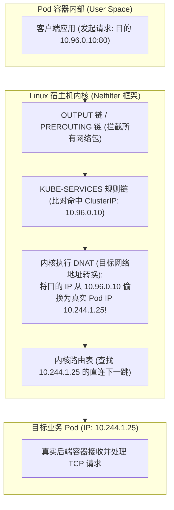
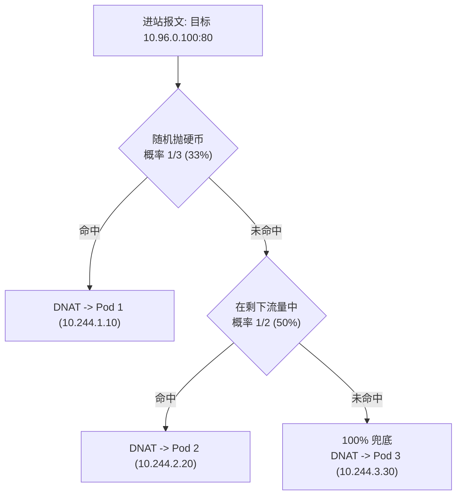
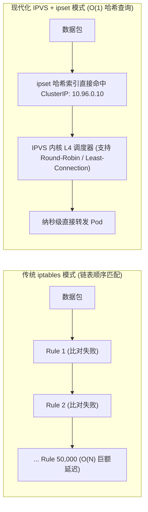
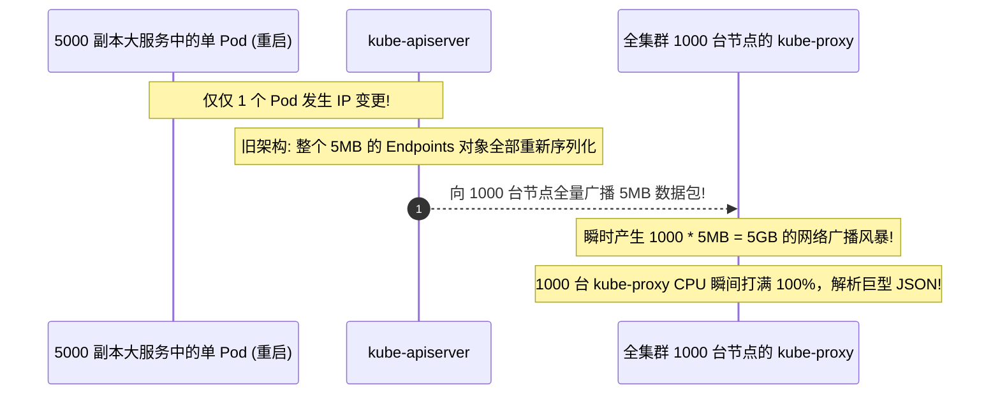
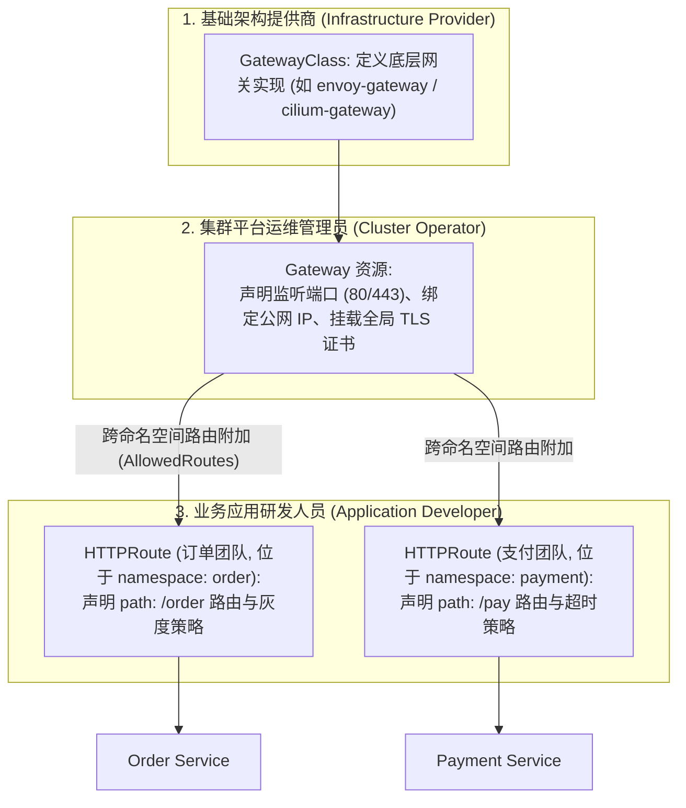
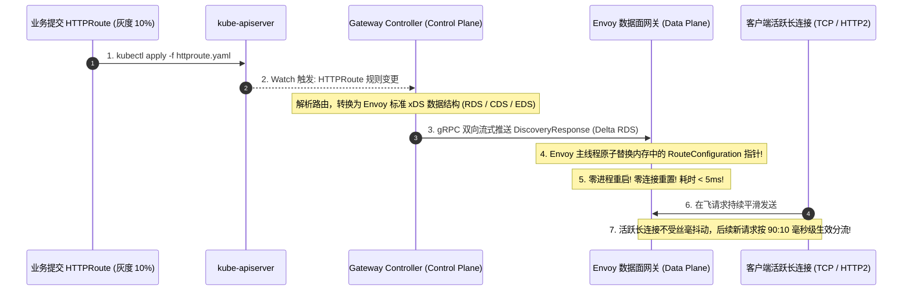

**TL;DR：** 在动态编排集群中，Pod 随时可能因为节点维护、弹性扩缩容或崩溃重启而发生 IP 漂移。如果业务直接连接 Pod IP，微服务将面临永无休止的失联雪崩。Kubernetes 通过 **Service** 抽象出了永不漂移的虚拟 IP（**ClusterIP**）。然而，在操作系统的物理视角下，**ClusterIP 根本不存在于任何真实的物理或虚拟网卡（Interface）之上，你通过 `ip addr` 永远搜不到这个 IP！** ClusterIP 的物理本质，是 `kube-proxy` 借由 Linux 内核 **Netfilter（iptables）** 或 **IPVS** 编织的一张精密的“数据包拦截与重定向蜘蛛网”。当报文途经内核 `PREROUTING` 或 `OUTPUT` 链时，内核通过 DNAT 强制将目的 IP 偷换为真实的活跃后端 Pod IP。为了解决传统 iptables 线性扫描在万级服务下的性能坍塌与 `xtables_lock` 全局锁死，架构演进出 **IPVS 哈希表** 与 **EndpointSlice 分片机制**；而在南北向流量接入层，新一代 **Gateway API v1** 则以三权分立的角色模型与无损 xDS 动态下发，终结了经典 Ingress 频发 Reload 的历史隐患。

---

## 一、 面试现场：从“物理网卡搜不到 ClusterIP”到“万级服务锁雪崩”的连环追问

```text
面试官提问：
  "我们在宿主机上用 ip addr 为什么根本搜不到 Service 的 ClusterIP？Ping 它为什么 100% 丢包却能通 TCP？
   kube-proxy 在 iptables 模式下是如何做负载均衡的？为什么后端有上万个服务时 iptables 会发生锁雪崩？
   从 Endpoint 到 EndpointSlice，再到南北向的 Gateway API，K8s 流量架构经历了怎样的重构？"
```

### 1.1 初级候选人的典型翻车点

在 Kubernetes 服务发现与流量接入的考核中，常见以下典型认知脱节：
- **误以为 ClusterIP 是绑在网卡上的 VIP**：以为像 Keepalived 那样绑定了物理网卡子接口（如 `eth0:1`），不知道 ClusterIP 是纯内核 Netfilter 规则劫持，根本没有实体设备也不响应 ICMP Ping；
- **答不出 iptables 负载均衡的物理实现**：不知道 iptables 是如何靠 `-m statistic --mode random --probability` 概率链来实现负载均衡的，更不知道第 1、2、3 个后端的概率为什么是 $1/n$、$1/(n-1)$、$1.0$；
- **对 iptables 的性能瓶颈认识浅薄**：只知道“慢”，说不清底层是内核线性链表扫描（$O(N)$ 复杂度），以及高频发布更新规则时争抢 `xtables_lock` 内核互斥锁导致的毛刺雪崩；
- **不理解 EndpointSlice 的分片价值**：以为 EndpointSlice 只是改了个名字，不知道单个巨型 Endpoints 达到 1.5MB 且单个 Pod 变更引发全节点广播更新打爆 API Server 的网络风暴危机。

### 1.2 资深工程师的破局切入点

资深架构师面对流量内核问题，能够从**“内核网络包流转生命周期与规模化演进瓶颈”**切入：
1. **揭秘 ClusterIP 的本质**：它是纯 Netfilter 规则伪装，在 `OUTPUT` 与 `PREROUTING` 链上执行内核级 DNAT，将逻辑虚拟 IP 原地篡改为目标 Pod IP 并走内核路由表直出；
2. **逆向分析 iptables vs IPVS 性能分水岭**：
   - iptables 模式：全量规则链表线性遍历，修改规则需加 `xtables_lock` 全局锁，规则数膨胀后（>5,000）CPU 软中断飙升；
   - IPVS 模式：基于内核 `ipset` 高性能哈希表，查表复杂度降为 $O(1)$，支持 Least Connections、Weighted 等高级调度算法；
3. **推导 EndpointSlice 分片机制**：将一个包含 5,000 个 Pod 的巨型 Endpoints 拆分为每个最多 100 个端点的 EndpointSlice，单个 Pod 状态变化仅需更新一个微型切片，将全集群广播数据量削减 98%；
4. **对比 Ingress 与 Gateway API**：指明经典 Ingress 的 Nginx Reload 缺陷，展现 Gateway API 基于角色分离与 Envoy xDS 内存热更新的现代架构优势。

### 1.3 ClusterIP 的物理真相：网卡上根本不存在的“幽灵 IP”

绝大多数初学者对 ClusterIP 的第一反应是：“K8s 肯定在宿主机或网桥上绑定了一个虚拟 IP（VIP）”。

让我们直接登录一台 Kubernetes 生产工作节点，执行网络排查命令验证：
```bash
# 假设集群中有一个 CoreDNS Service，其 ClusterIP 为 10.96.0.10
$ ip addr show | grep 10.96.0.10
# 输出: 空白！没有任何网络接口绑定该 IP！

$ ping -c 1 10.96.0.10
# 结果: 100% packet loss (Ping 根本 Ping 不通！)
```

既然物理和虚拟接口都不存在这个 IP，为什么容器内部向 `10.96.0.10:53` 发送 DNS 查询，却能秒级得到响应？



**物理真相只有一个：ClusterIP 是纯粹的逻辑概念，它只是一套存在于 Linux 内核 Netfilter 内存中的重定向规则！** 报文在刚刚离开套接字进入内核协议栈时，就被内核规则中途劫持，直接修改了 IP 头部的目标地址（DNAT），数据包最终飞往的是某个真实的 Pod 网卡。

---

## 二、 kube-proxy 工作内核：iptables 模式深度逆向

负责在每台工作节点上实时监听 Service 与 Endpoint 变动、并刷新内核规则的守护进程，就是 **`kube-proxy`**。

### 2.1 iptables 模式的随机负载均衡链

当采用默认的 iptables 模式时，`kube-proxy` 是如何实现将流量均匀负载均衡到多个 Pod 上的？
答案藏在 Linux iptables 的 **`statistic` 模块（随机概率匹配）** 中！

假设有一个名为 `order-service` 的 Service，后端挂载了 3 个 Pod 副本：
- Pod 1: `10.244.1.10:8080`
- Pod 2: `10.244.2.20:8080`
- Pod 3: `10.244.3.30:8080`

`kube-proxy` 会在内核中生成如下结构的规则链：

```text
-A KUBE-SERVICES -d 10.96.0.100/32 -p tcp --dport 80 -j KUBE-SVC-ORDER

# 规则 1: 1/3 的概率 (33.3%) 命中 Pod 1
-A KUBE-SVC-ORDER -m statistic --mode random --probability 0.3333333333 -j KUBE-SEP-POD1

# 规则 2: 在剩余的 2/3 流量中，以 1/2 的概率 (50%) 命中 Pod 2 (实际占总流量 2/3 * 1/2 = 33.3%)
-A KUBE-SVC-ORDER -m statistic --mode random --probability 0.5000000000 -j KUBE-SEP-POD2

# 规则 3: 剩下所有流量 (100%) 兜底命中 Pod 3 (占总流量 33.3%)
-A KUBE-SVC-ORDER -j KUBE-SEP-POD3

# 各 SEP 链执行真正的 DNAT
-A KUBE-SEP-POD1 -p tcp -j DNAT --to-destination 10.244.1.10:8080
-A KUBE-SEP-POD2 -p tcp -j DNAT --to-destination 10.244.2.20:8080
-A KUBE-SEP-POD3 -p tcp -j DNAT --to-destination 10.244.3.30:8080
```

通过这套巧妙的递减概率级联算法，iptables 在无状态的内核层面实现了近乎完美的等权重负载均衡！



### 2.2 iptables 模式的大规模性能灾难：$O(N)$ 扫描与 `xtables_lock`

当集群规模较小时（几十个服务），iptables 运行良好。但一旦集群迈入中大规模（如 5,000 个 Service，每个 Service 有 10 个 Pod）：
1. **$O(N)$ 线性链式扫描**：iptables 的规则在内核中以扁平链表（Linked List）存储。一个网络包必须逐条遍历规则直至匹配，平均查找耗时随着服务数量线性暴增；
2. **全局排他锁 `xtables_lock` 雪崩**：
   Linux 内核修改 iptables 规则不是增量添加的，而是**全量导出、在用户态修改、再全量刷回内核（iptables-restore）**！
   在刷写期间，必须持有全局内核锁 `xtables_lock`。当集群中不断有 Pod 启动、下线、就绪检测跳变时，`kube-proxy` 频繁高频抢锁，导致网络发包被锁阻塞，甚至引发节点出现长达数秒的网络黑洞！

---

## 三、 第二代救赎：IPVS 模式与 $O(1)$ 查找

为了从根本上化解 iptables 规则链膨胀带来的性能坍塌，Kubernetes 引入了 **IPVS（IP Virtual Server）** 模式。



### 3.1 IPVS 核心优势
1. **$O(1)$ 哈希索引（ipset）**：IPVS 将成千上万个 ClusterIP 和端口注册在专用的 `ipset` 内存哈希集合中。无论集群规模膨胀到 1 万还是 10 万个服务，内核查找耗时始终恒定在纳秒级；
2. **丰富的企业级负载均衡算法**：不再依赖脆弱的随机抛硬币，原生支持 `rr`（轮询）、`lc`（最少连接数）、`wlc`（加权最少连接）、`sh`（源地址哈希）；
3. **极速规则同步**：IPVS 规则具备细粒度的内核更新接口，不再需要像 iptables 那样全量拷贝刷盘，消除了 `xtables_lock` 锁竞争。

---

## 四、 架构减负关键跃迁：从 Endpoints 到 EndpointSlice

在 Kubernetes 1.21 之前，每个 Service 对应一个大一统的 `Endpoints` 资源对象。
当一个大型服务拥有 5,000 个 Pod 副本时，这个单个 `Endpoints` 对象包含了所有 5,000 个 Pod 的 IP 和端口，序列化后的 JSON 体积可能高达 **2MB~5MB**！



### 4.1 EndpointSlice 分片物理模型
Kubernetes 引入了 **`EndpointSlice`** 规范（默认将后端 Pod 按照 **每 100 个一组** 拆分为独立的切片对象）：
- 拥有 5,000 个 Pod 的服务，在控制面被自动切分为 50 个独立的 `EndpointSlice`；
- 当其中 1 个 Pod 发生漂移时，API Server **仅仅需要向外广播该 Pod 所在的那 1 个包含 100 个端点的轻量级切片（体积仅数 KB）**；
- 网络通信开销和客户端 JSON 反序列化压力瞬间降低了 **98% 以上**，彻底清除了超大规模集群下的“状态更新广播风暴”。

---

## 五、 南北向流量演进：从经典 Ingress 到现代 Gateway API v1

前面讨论的 Service 和 kube-proxy 主要解决的是集群内“东西向（East-West）”流量。而当外部公网用户需要访问集群内部服务时，必须经由“南北向（North-South）”流量接入层。

### 5.1 经典 Ingress 的先天不足与 Reload 痛点

经典的 Ingress 规范诞生于 2015 年，设计极为极简：
```yaml
apiVersion: networking.k8s.io/v1
kind: Ingress
metadata:
  name: web-ingress
spec:
  rules:
  - host: api.example.com
    http:
      paths:
      - path: /order
        pathType: Prefix
        backend:
          service:
            name: order-service
            port:
              number: 80
```

在大规模高频发布的企业级生产环境中，基于 Nginx 的经典 Ingress Controller 暴露出严重的架构缺陷：
1. **配置 Reload 导致性能毛刺与连接重置**：
   Nginx 官方架构是基于静态配置文件的。每当有新的 Ingress 增加、或者某个服务的 Pod 发生扩缩容，Ingress Controller 必须重新生成 `nginx.conf` 并向主进程发送 `nginx -s reload`。在高并发长连接场景下，频繁 Reload 会导致老 Worker 进程驻留内存导致内存泄漏（Worker Leak），甚至引发短暂的客户端 TCP 502 报错；
2. **职责混乱的单体配置**：
   在真实的研发团队中，集群管理员、安全团队和业务研发的权限是天然隔离的。但在 Ingress 规范中，域名、TLS 证书、路由路径、超时时间、重写注解（Annotations）全都塞在同一个 YAML 里，缺乏细粒度 RBAC 权限边界；
3. **高度依赖非标准 Annotations 方言**：
   为了实现灰度发布（Canary）、限流、Header 染色路由，各厂商 Ingress 实现（Nginx、Traefik、HAProxy）发明了五花八门的注解，跨平台迁移成本极高。

### 5.2 新一代 Gateway API v1：三权分立与现代解耦架构

Kubernetes 官方推出的 **Gateway API**（在 1.30+ 成为全面 GA 的黄金标准）彻底颠覆了这种单体模式，引入了清晰的**角色三权分立**：



### 5.3 Gateway API 的关键架构革新
1. **原生一等公民的金丝雀灰度权重（Weight-based Traffic Splitting）**：
   无需再写晦涩的注解，直接在 `HTTPRoute` 规范中声明权重分流：
   ```yaml
   rules:
   - matches:
     - path: { type: PathPrefix, value: /v2/checkout }
     backendRefs:
     - name: checkout-v1
       port: 8080
       weight: 90
     - name: checkout-v2
       port: 8080
       weight: 10
   ```
2. **基于 Envoy xDS 的真正零断连动态下发**：
   现代 Gateway API 实现（如 Envoy Gateway、Cilium Gateway、Higress）完全基于数据面动态配置协议（xDS）。所有的路由变更、证书更新全部通过 gRPC 流式热更新至数据面内存中，**完全彻底终结了配置 Reload 与连接断开**：



3. **跨命名空间安全隔离（ReferenceGrant）**：
   允许公共基础网关安全地路由到各团队独立的 Namespace，同时防止开发团队非法越权引用跨命名空间的 TLS 证书或私有凭据。

### 5.4 经典 Ingress 与现代 Gateway API 全景对比矩阵

| 架构维度 | 经典 Ingress (Nginx Controller) | 现代 Gateway API (Envoy Gateway / Cilium) |
| --- | --- | --- |
| **标准化级别** | 仅支持基础 Host/Path，其他依赖 Annotations 方言 | 官方统一规范 (GA v1.0)，消除厂商私有方言 |
| **团队协作模型** | 单体大 YAML，集群管理员与开发权限混杂 | 三权分立 (`GatewayClass` / `Gateway` / `HTTPRoute`) |
| **金丝雀灰度** | 依赖特定注解（如 `canary-weight`），脆弱易错 | 原生 `weight` 一等公民字段支持 |
| **配置生效时延** | 秒级（生成 `.conf` + `nginx -s reload`） | 毫秒级（基于 gRPC xDS 内存热更新） |
| **长连接与 502** | 频繁 Reload 导致连接重置与 Worker 泄漏风险 | **真正的零中断热切换，长连接永久平滑** |
| **协议支持** | 仅限 HTTP/HTTPS | 原生支持 HTTP, gRPC, TCP, UDP, TLS-Passthrough |

---

## 六、 面试通关复盘与架构师高分回答模板

```mermaid
mindmap
  root((Kubernetes 服务发现与流量接入))
    东西向服务发现 (ClusterIP)
      物理本质: 无实体网卡, 纯 Netfilter 规则劫持
      iptables 模式: 随机概率匹配, 存在锁雪崩与 O(N) 性能瓶颈
      IPVS 模式: ipset 哈希表 O(1) 查询, 高性能生产标配
      EndpointSlice: 分片机制粉碎广播风暴
    南北向外部接入 (Ingress -> Gateway API)
      经典 Ingress 缺陷: 单体配置, Reload 频繁, 注解方言割裂
      Gateway API 革命: 三权分立 (GatewayClass, Gateway, Route)
      无损 xDS 动态更新, 原生灰度权重
```

### 6.1 现场 2 分钟极速电梯演讲（高分答题模板）

> **面试官问：**“ClusterIP 虚拟 IP 真实存在于哪张网卡上？为什么万级服务下 iptables 模式会发生锁雪崩？EndpointSlice 和 Gateway API 带来了什么改进？”

**高分应答结构（递进式穿透）：**

> “**第一层（ClusterIP 的物理真相）：**
> ClusterIP 根本不存在于任何真实的物理或虚拟网卡上，执行 `ip addr` 查不到该 IP，Ping 也无法收到 ICMP 响应。它的本质是 `kube-proxy` 在宿主机内核 **Netfilter**（`PREROUTING` 与 `OUTPUT` 链）中注册的重定向规则。当数据包的目的 IP 是 ClusterIP 时，内核在协议栈中强制执行 **DNAT**，将目的 IP 瞬间篡改为真实后端 Pod IP，随后交由内核路由表发出。
>
> **第二层（iptables 负载均衡与锁雪崩根因）：**
> 在 iptables 模式下，`kube-proxy` 依靠 `statistic` 模块的概率链实现负载均衡（第 1 个 Pod 概率 $1/n$，第 2 个 $1/(n-1)$……最后一个 $100\%$）。这种模式在大规模集群下有两大致命缺陷：
> 1. **$O(N)$ 线性链表扫描**：每个网络包必须逐条匹配规则，万级 Service 对应数十万条规则，导致 CPU 软中断打满、延迟飙升；
> 2. **`xtables_lock` 全局写锁雪崩**：iptables 不支持增量刷新，任何一个 Pod 上下线，`iptables-restore` 都必须将全量规则导出到用户态修改再全量写回内核，全程持有全局互斥锁，高频发布时导致数据包转发严重卡顿甚至超时。
>
> **第三层（架构演进：IPVS、EndpointSlice 与 Gateway API）：**
> 1. **IPVS 模式**：基于内核 `ipset` 哈希表，将路由查表复杂度降为 $O(1)$，规则更新支持原子增量刷新，彻底抹平锁雪崩；
> 2. **EndpointSlice 分片机制**：打破以往将数千个 Pod IP 塞进单个巨型 Endpoints 对象的瓶颈，拆分为每个最多 100 个端点的微型切片，将单个 Pod 变更引发的全集群网络广播开销缩减 98% 以上；
> 3. **Gateway API 现代演进**：终结了经典 Ingress 依赖 Nginx Reload 导致的频繁长连接重置（502 隐患），通过标准三权分立模型与 Envoy 的 xDS 动态下发，实现真正无中断的毫秒级金丝雀灰度发布。”

### 6.2 生产面试关键避坑守则

1. **绝对不要回答“ClusterIP 绑定在 cbr0 或 docker0 网桥上”**：ClusterIP 纯属 Netfilter/IPVS 规则伪装，无任何网络接口；
2. **外部流量接入保留源 IP 的关键配置**：在 NodePort/LoadBalancer Service 中，必须掌握 `externalTrafficPolicy: Local`。若设为默认的 `Cluster`，首跳节点会将报文 SNAT 为本机节点 IP 转发给对端，导致真实客户端 IP 彻底丢失；配置为 `Local` 则禁止二次转发，保留真实源 IP 并避免跨机跳数；
3. **分清 Ingress Reload 与 Gateway API xDS 的代际差异**：Nginx Ingress 修改任何一个配置都会触发 Worker 进程热重载，在超高并发长连接下极易引发 Worker 进程泄漏与 502 Bad Gateway；而现代基于 Envoy/Cilium 的 Gateway API 采用 gRPC xDS 内存热更新，连接完全不断；
4. **澄清 IPVS 模式下仍需依赖少量 iptables**：IPVS 只负责流量分发与转发（LVS 逻辑），SNAT（伪装包源 IP 绕回）以及针对 NodePort 的部分重定向仍需少量 iptables 规则兜底。
---

## 参考资料与权威规范

1. **Kubernetes Gateway API 官方规范**: *Gateway API v1.0 GA Specification & Role-oriented Design* (gateway-api.sigs.k8s.io).
2. **Kubernetes Enhancement Proposal (KEP)**: *KEP-752: EndpointSlice API* (enhancements.k8s.io).
3. **Linux Kernel Documentation**: *Netfilter Architecture and IP Virtual Server (IPVS)* (`Documentation/networking/netfilter.rst`).
4. **Kubernetes Official Documentation**: *Virtual IPs and Service Proxies* (kubernetes.io/docs/concepts/services-networking/service-virtual-ips/).
5. **Envoy Proxy Architecture**: *Dynamic Configuration and xDS Protocol* (www.envoyproxy.io/docs/envoy/latest/intro/arch_overview/operations/dynamic_configuration).
