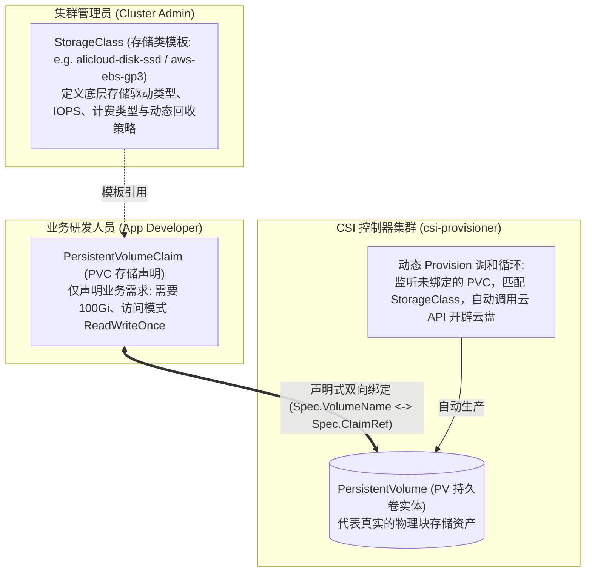
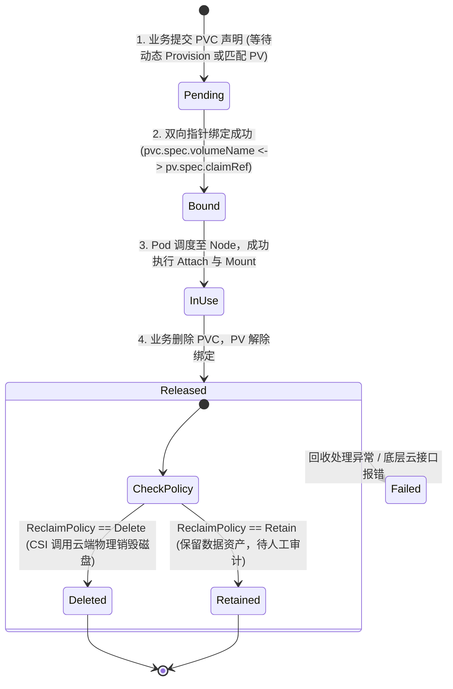
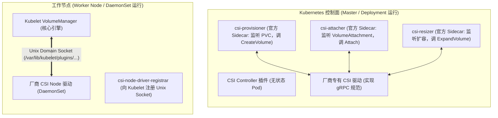
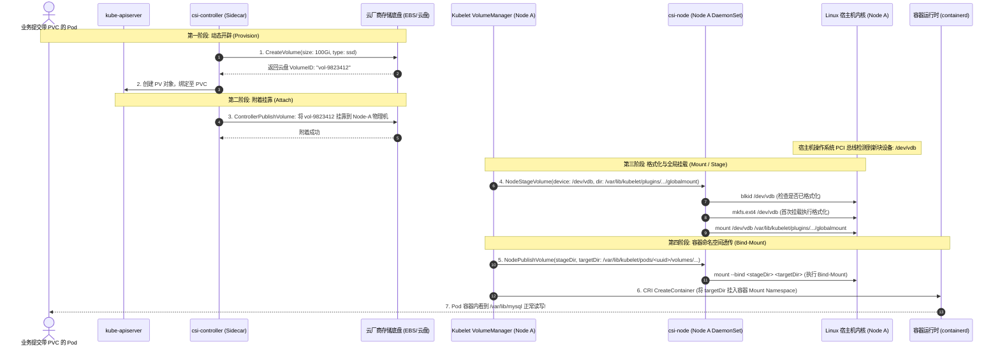
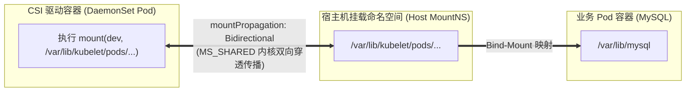
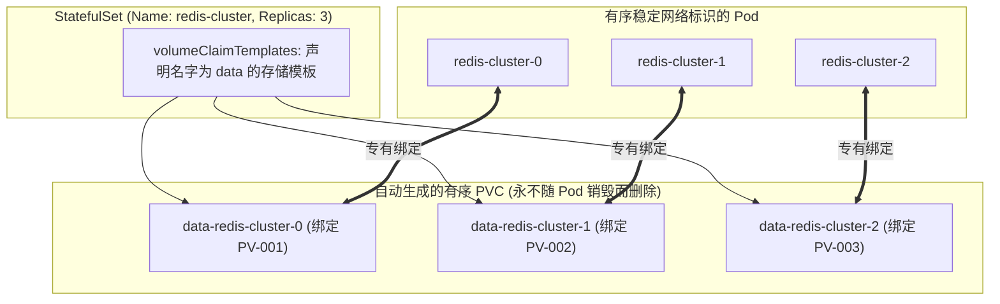
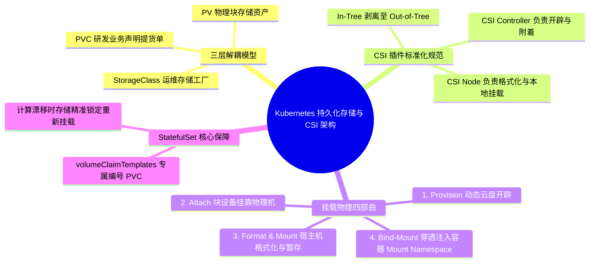

**TL;DR：** 容器天然具备“易失性（Ephemeral）”：容器内的只读镜像层之上仅叠加了一层薄薄的读写层（Copy-on-Write），一旦容器被删除，其本地产生的脏数据将随之灰飞烟灭。对于 MySQL、PostgreSQL、Kafka、Elasticsearch 等有状态核心资产，Kubernetes 必须保证**即便 Pod 在物理宿主机之间随意漂移，底层存储块也必须精准跟随迁移且数据分毫不差**。为了实现这一目标，Kubernetes 构建了 **PV（持久卷）、PVC（持久卷声明）与 StorageClass（存储类）** 三权分立的存储抽象模型；并联合行业制定了 **CSI（Container Storage Interface）规范**，彻底将专有存储驱动移出 Kubernetes 核心代码仓库。数据卷从无到有挂进容器的物理过程，严格遵循清晰的 **“挂载四部曲”：Provision 动态云端分配 $\to$ Attach 块设备挂靠物理机 $\to$ Format & Mount 宿主机格式化与全局暂存 $\to$ Bind-Mount 借由 Linux Mount 命名空间透传进容器内部**。

---

## 一、 面试现场：从“有状态 Pod 故障漂移”到“存储挂载四部曲”的连环追问

```text
面试官提问：
  "如果运行 MySQL 的节点硬件损坏宕机了，Kubernetes 把 Pod 漂移到另一台机器，底层数据是如何做到分毫不差的？
   PV、PVC 和 StorageClass 到底是什么关系？
   一块云盘从在云厂商开辟出来，到最终能被容器内的业务进程读写，底层经历了哪些物理步骤？Linux 内核是如何做到的？"
```

### 1.1 初级候选人的典型翻车点

在考察容器持久化存储时，初级候选人常暴露以下技术短板：
- **混淆本地目录挂载与集群持久化存储**：误以为生产上的持久化就是 `docker run -v` 挂载宿主机目录，完全没有意识到节点宕机漂移后，新节点的本地目录是空目录的致命破绽；
- **分不清 PV 与 PVC 的职责边界**：只知道“申请存储用 PVC”，但说不清底层是如何通过指针进行双向绑定的，更不知道 StorageClass 充当的动态存储工厂角色；
- **答不全存储挂载的物理全链路**：以为 Kubelet 直接把远程云盘“塞给”容器，根本不知道操作系统的真实链路分工（云平台 Attach 挂靠 $\to$ 操作系统 mkfs 格式化与 mount $\to$ Linux 命名空间 Bind-Mount）；
- **对生产可用区割裂与存储死锁毫无防御概念**：不知道默认配置的 StorageClass 在多可用区集群下会导致 PVC 与 Pod 调度到不同可用区导致永久挂死，也不知道 RWO 块存储在跨节点漂移时因旧节点未 Detach 导致的 Multi-Attach 锁死。

### 1.2 资深工程师的破局切入点

资深云原生存储架构师面对这一系列追问，会以**“存储计算解耦与内核级挂载流水线”**为主线严密展开：
1. **推导存储三权分立**：StorageClass（运维定义工艺规范） $\to$ PVC（开发提交需求提货单） $\to$ PV（集群物理资产实体），结合 StatefulSet 的 `volumeClaimTemplates` 阐明有状态 Pod 永久锁定唯一存储的漂移自愈机制；
2. **解密 CSI（Container Storage Interface）Out-of-Tree 解耦规范**：
   - 控制面组件（CSI Controller Plugin）：调用云 API 负责远端 Provision 与 Attach；
   - 节点级组件（CSI Node Plugin）：在宿主机负责本地 Format、Mount 与 Bind-Mount；
3. **推导挂载物理四部曲的底层系统调用**：
   - Step 1: **Provision**（云厂商创建块存储卷）；
   - Step 2: **Attach**（将云盘作为裸块设备附着到宿主机 `/dev/vdb`）；
   - Step 3: **Format & Mount**（检测文件系统、执行 `mkfs.ext4` 并挂载至全局目录 `/var/lib/kubelet/plugins/...`）；
   - Step 4: **Bind-Mount**（通过 Linux `mount --bind` 将全局目录透传映射至容器自身的 Mount Namespace）；
4. **输出高可用落地守则**：强调 `volumeBindingMode: WaitForFirstConsumer` 彻底化解可用区错位，以及 `reclaimPolicy: Retain` 构筑数据防误删最后防线。

### 1.3 为什么有状态应用不能只靠普通容器挂载？

在单机 Docker 时代，持久化数据通常依靠本地目录挂载：`docker run -v /data/mysql:/var/lib/mysql mysql`。
这种方式在多节点集群中面临致命破绽：
1. **强耦合本地宿主机硬件**：数据存储在 `Node-1` 的本地磁盘 `/data/mysql`。当 `Node-1` 发生硬件故障宕机，调度器将 Pod 重新拉起到 `Node-2` 时，`Node-2` 的 `/data/mysql` 目录完全是空的，数据库瞬间报废；
2. **缺乏存储资源的声明式抽象**：研发在写部署脚本时，必须知道每台物理机到底挂了哪块硬盘、磁盘阵列叫什么路径，破坏了环境一致性；
3. **并发读写竞争无防护**：多个 Pod 同时挂载同一个非共享文件系统时，缺乏统一的状态机防止数据脏写损坏。

---

## 二、 存储三权分立：StorageClass、PV 与 PVC 哲学

为了让开发人员无需关心底层存储硬件、让集群运维人员无需手工逐个切分硬盘，Kubernetes 建立了分层的三权分立模型：



### 2.1 三大核心抽象的分工
- **StorageClass（存储类）**：运维人员定义的“存储工厂流水线”。它指定了由哪个 CSI 插件（`provisioner`）去制造存储、传入哪些云盘参数（如 SSD、加密密钥、快照策略）；
- **PVC（持久卷声明）**：开发人员开出的“存储提货单”。业务只需在 YAML 中声明：“我需要一块 100Gi 的存储，要求独占读写（ReadWriteOnce）”，完全不关心它背后是 AWS EBS、Ceph RBD 还是 NetApp NAS；
- **PV（持久卷）**：集群中真实分配出来的“存储现货”。包含具体的云盘 VolumeID、容量大小与状态。

### 2.2 存储卷访问模式（Access Modes）与生命周期状态机
- **`ReadWriteOnce` (RWO)**：卷只能被**单一节点**以读写方式挂载（典型的块存储如 AWS EBS、阿里云 ESSD，无法被两台物理机同时挂载，否则文件系统元数据必然损坏）；
- **`ReadOnlyMany` (ROX)**：卷可以被多个节点以只读方式共享挂载；
- **`ReadWriteMany` (RWX)**：卷可以被**多个节点**同时以读写方式挂载（典型的共享分布式文件系统如 NFS、CephFS、GlusterFS）。



---

## 三、 CSI 架构全景：ControllerPlugin vs NodePlugin

在早期的 Kubernetes 中，所有的存储驱动代码（如 AWS EBS、GCE PD、Ceph）都写在官方代码仓库的 `pkg/volume/` 目录下（被称为 In-Tree 插件）。任何存储厂商修复一个 Bug，都必须伴随 Kubernetes 核心版本发版，维护灾难深重。

**CSI（Container Storage Interface）** 行业规范的落地，将存储插件彻底剥离出 K8s 核心二进制（Out-of-Tree）：



### 3.1 控制面：CSI Controller Plugin
通常以高可用 Deployment 运行在集群中。它利用官方提供的通用 Sidecar 容器监听 Kubernetes API 变动，并通过 gRPC 协议调用存储厂商编写的驱动服务：
- **`CreateVolume` / `DeleteVolume`**：向云厂商管控 API 发起 REST 调用，真实开辟或销毁一块云盘；
- **`ControllerPublishVolume` / `ControllerUnpublishVolume`**：向云厂商发送“挂载到物理机”指令（即 Attach 阶段）。

### 3.2 节点面：CSI Node Plugin
以 DaemonSet 形式运行在每一台工作节点上，直接暴露 Unix Domain Socket 给宿主机上的 `Kubelet VolumeManager`：
- **`NodeStageVolume`**：将物理机识别到的原始裸块设备（如 `/dev/vdb`）格式化并临时挂载到宿主机的一个全局暂存目录；
- **`NodePublishVolume`**：将宿主机全局暂存目录，通过 Linux Bind-Mount 挂载到目标 Pod 的专用运行目录下。

---

## 四、 存储卷挂载内核物理四部曲

当一个声明了 PVC 的 Pod 被调度器选定分配到 `Node-A` 时，从云端存储块到容器内部看到文件的全链路，物理上必须严格跨越以下四大阶段：



### 4.1 第一步：Provision（动态制造）
如果对应 PV 尚不存在，`csi-provisioner` 监听到 PVC 进入 `Pending` 状态，调用 CSI 接口 `CreateVolume`。云底层 SAN 存储阵列或公有云存储引擎原子划分出 100Gi 扇区空间，并赋予全局唯一的存储 ID。

### 4.2 第二步：Attach（块设备挂靠）
调度器确定了 Pod 运行在 `Node-A` 后，`csi-attacher` 监听到调度结果，向云平台存储控制器发送 `ControllerPublishVolume` 指令。
云平台底层的 Hypervisor 接收到指令后，将虚拟磁盘映射到 `Node-A` 虚拟机的虚拟 PCI 接口上。
此时，登录 `Node-A` 运行 `lsblk`，即可看到宿主机内核多出了一块裸设备盘：`/dev/vdb` 或 `/dev/nvme1n1`。**注意：此时磁盘还没有文件系统，也没有挂载到任何目录。**

### 4.3 第三步：Format & Mount（格式化与全局挂载）
宿主机上的 Kubelet VolumeManager 被触发，调用本机 CSI 插件的 `NodeStageVolume`：
1. 运行 `blkid /dev/vdb` 探查磁盘头部签名；
2. 若为空白盘，立即在宿主机上执行 `mkfs.ext4 -F /dev/vdb` 写入 Superblock、Inode 表和日志区；
3. 执行 Linux 挂载系统调用 `mount("/dev/vdb", "/var/lib/kubelet/plugins/kubernetes.io/csi/.../globalmount", "ext4", ...)`。
这一步被称为“全局挂载”，确保无论该节点上有几个 Pod 共享该卷，设备只被物理挂载一次。

### 4.4 第四步：Bind-Mount（穿透进入容器命名空间）
这是将存储送入容器的终极关键动作！
在 Linux 中，容器拥有自己独立的 Mount Namespace。Kubelet 调用 `NodePublishVolume`，执行 Linux **绑定挂载（Bind Mount）**：
```bash
mount --bind /var/lib/kubelet/plugins/.../globalmount /var/lib/kubelet/pods/<pod-uuid>/volumes/kubernetes.io~csi/pvc-data/mount
```
紧接着，容器运行时（containerd）在创建业务容器时，将该目录作为挂载源，通过 OCI 规范直接映射进业务容器的根目录挂载树（如容器内的 `/var/lib/mysql`）。业务应用在容器内部对该目录的所有 `write(2)` 系统调用，直接绕过容器层，直达底层块存储阵列！

### 4.5 深度解密 `mountPropagation: Bidirectional`：双向挂载传播物理机制

很多平台研发在编写 CSI DaemonSet 部署清单时，会看到这样一段配置：
```yaml
volumeMounts:
- name: mountpoint-dir
  mountPath: /var/lib/kubelet/pods
  mountPropagation: Bidirectional # 核心关键!
```

**为什么 CSI 节点插件必须声明 `Bidirectional`（双向挂载传播）？**
在 Linux 内核 Mount Namespace 体系中：
- 默认情况下，容器的挂载传播属性是 `private`（私有）或 `rslave`（从属）；
- 当 CSI Node 插件（它本身运行在容器中）执行 `mount(2)` 将磁盘挂载到 `/var/lib/kubelet/pods/...` 时，**如果处于默认的单向隔离模式，这个挂载点仅仅对 CSI 容器自己可见，宿主机以及其他 Pod 根本看不见这个目录！**
- 声明 `Bidirectional` 使得容器内部与宿主机的挂载点成为 **`MS_SHARED`（对等共享对）**：CSI 容器在内部执行的任何 `mount` 操作，内核都会**双向穿透反射回宿主机根命名空间**，进而使得 Kubelet 与最终的业务容器能够感知并访问真实的块设备！



---

## 五、 StatefulSet 存储编排：有序性与存储绑定防线

为什么生产环境部署分布式有状态集群（如 Redis 集群、MySQL 主从），必须使用 **StatefulSet** 而不能使用 Deployment？



### 5.1 `volumeClaimTemplates` 的专属绑定
在 Deployment 中，所有副本共享同一个 PVC 声明，导致多个 Pod 争抢挂载同一个块存储造成挂载冲突。
而在 StatefulSet 中：
- `volumeClaimTemplates` 会为每一个 Pod 副本生成一个以编号结尾的唯一专属 PVC：`data-redis-cluster-0`、`data-redis-cluster-1`；
- 每个 PVC 独立绑定一块专属的底层云盘。

### 5.2 故障漂移时的存储持久锁定
假设运行在 `Node-1` 上的 `redis-cluster-1` 遭遇物理机宕机：
1. StatefulSet 控制器感知后，在健康的 `Node-3` 上重新拉起一个同名 Pod `redis-cluster-1`；
2. **Kubelet 会精准重新寻找名为 `data-redis-cluster-1` 的历史专属 PVC**；
3. CSI 控制器先在故障的 `Node-1` 上执行 `Detach`，随后将该历史云盘重新 `Attach` 到 `Node-3`；
4. 新拉起的 Pod 挂载上旧磁盘，读取已有的 RDB/AOF 数据文件，毫秒级恢复业务状态，**真正做到了存储与计算分离的无损漂移！**

---

## 六、 面试通关复盘与架构师高分回答模板



### 6.1 现场 2 分钟极速电梯演讲（高分答题模板）

> **面试官问：**“Pod 跨节点故障漂移时，底层存储是如何做到数据永不丢失的？CSI 挂载经历哪四个物理阶段？”

**高分应答结构（递进式穿透）：**

> “**第一层（持久化三层抽象与漂移绑定机制）：**
> Kubernetes 通过 **StorageClass（管理员定义的存储工厂流水线）**、**PVC（业务研发开具的容量与模式提货单）** 和 **PV（真实开辟出来的存储资产）** 实现了职责解耦。在 StatefulSet 中，每个 Pod 拥有专属的 `volumeClaimTemplates`，即使计算节点宕机导致 Pod 漂移到新节点，新拉起的 Pod 仍会精确绑定旧的 PVC，从而实现存储与计算分离的无损漂移。
>
> **第二层（CSI 插件架构分工）：**
> CSI 规范将专有存储逻辑彻底移出核心代码仓库（Out-of-Tree），划分为两组组件：
> 1. **CSI Controller 插件（无状态中心组件）**：通过外部 Sidecar（如 `csi-provisioner`、`csi-attacher`）监听 PVC/VolumeAttachment 资源，调用云厂商 OpenAPI 负责远端块设备的生命周期；
> 2. **CSI Node 插件（每台工作节点的 DaemonSet）**：配合 `csi-node-driver-registrar`，负责宿主机本地文件系统的格式化与挂载。
>
> **第三层（挂载物理四部曲）：**
> 一块云盘最终被容器内进程读写，严格经历以下四个物理阶段：
> 1. **Provision（动态分配）**：`csi-provisioner` 调用云 API 创建一块独立的远程块存储卷（生成 PV 资产）；
> 2. **Attach（附着挂靠）**：当 Pod 被调度到特定节点后，`csi-attacher` 调用云 API 将该云盘挂载到目标物理宿主机，在宿主机内核 `/dev/` 下生成裸块设备（如 `/dev/vdb`）；
> 3. **Format & Mount（格式化与全局暂存）**：宿主机节点上的 Kubelet 和 CSI Node 插件被唤醒，通过 `blkid` 探测文件系统；若是新盘则调用 `mkfs.ext4` 格式化，并执行 `mount /dev/vdb /var/lib/kubelet/plugins/.../globalmount` 挂载到宿主机全局目录；
> 4. **Bind-Mount（容器命名空间映射穿透）**：Kubelet 在创建容器时，调用 Linux 内核系统调用 `mount(source, target, NULL, MS_BIND, NULL)`，将宿主机上的全局目录以 **Bind-Mount** 方式单向映射透传进容器专属的 Mount Namespace，容器内的 MySQL 即可像访问本地目录一样进行读写。”

### 6.2 生产面试关键避坑守则

1. **可用区错位规避：必须配置 `WaitForFirstConsumer`**：默认 StorageClass 的 `volumeBindingMode: Immediate` 会在 PVC 创建瞬间就在随机可用区买盘。必须配置为 `WaitForFirstConsumer`，让买盘动作延迟到调度器选定 Node 之后，确保磁盘与 Pod 严格同属一个可用区；
2. **生产环境存储回收策略严禁设为 `Delete`**：生产环境核心数据库的 StorageClass 必须指定 `reclaimPolicy: Retain`。若误删 PVC，PV 只会标记为 `Released`，不会连带在云厂商处销毁物理磁盘；
3. **块存储 Multi-Attach 锁死防范**：当旧节点网络断联但并未真正关机时，旧节点可能仍持有块设备的 Attach 锁，导致新节点无法 Attach 挂载。需通过合理配置污点容忍度与云厂商强制 Detach 策略进行止血；
4. **澄清 Bind-Mount 的内核本质**：Bind-Mount 不涉及任何数据拷贝，它只是让同一个文件系统 dentry 目录项在两个不同的 Mount Namespace 挂载树中同时出现。
---

## 参考资料与权威规范

1. **Container Storage Interface (CSI) 官方规范**: *CSI Spec v1.5.0* (github.com/container-storage-interface/spec).
2. **Kubernetes CSI Documentation**: *Kubernetes CSI Developer Documentation & Sidecar Containers* (kubernetes-csi.github.io/docs/).
3. **Linux Manual Pages**: `mount(2)`, `mount(8)` (--bind semantics), `blkid(8)`.
4. **Kubernetes Official Documentation**: *Persistent Volumes, Storage Classes, and StatefulSets* (kubernetes.io/docs/concepts/storage/).
5. **Storage Architecture in Cloud-Native Systems**: *Design patterns for persistent storage in distributed orchestrators* (ACM SIGOPS, 2020).
