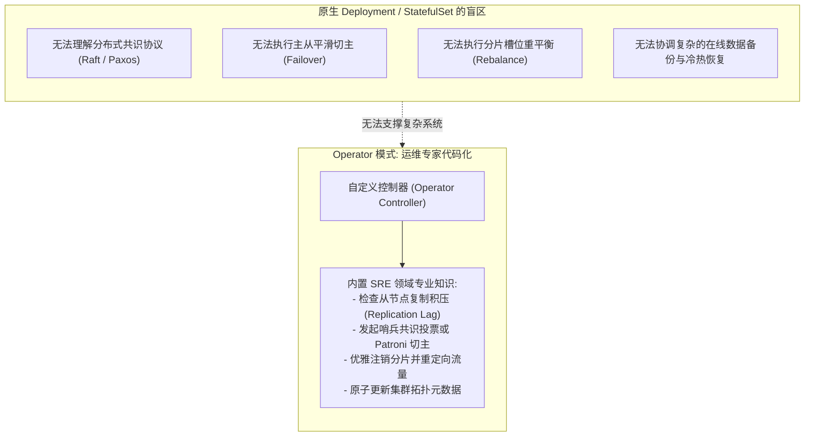
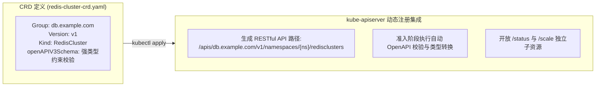
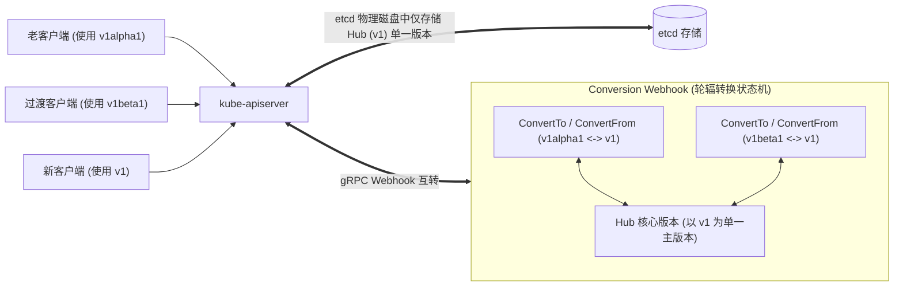
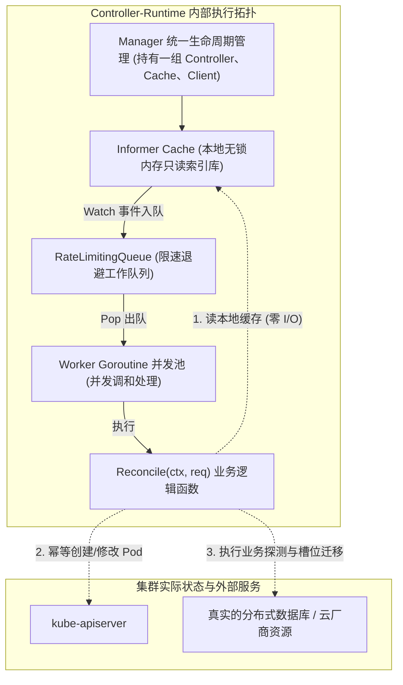
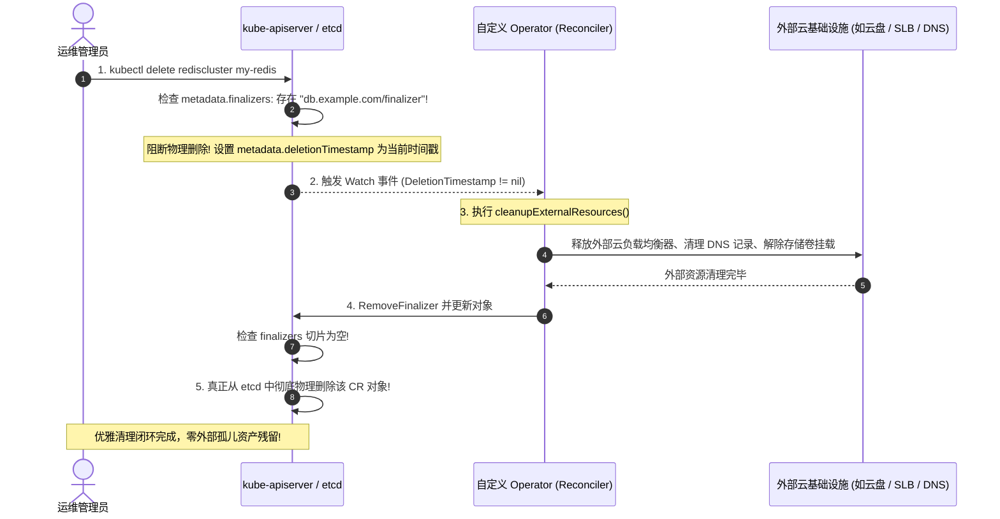
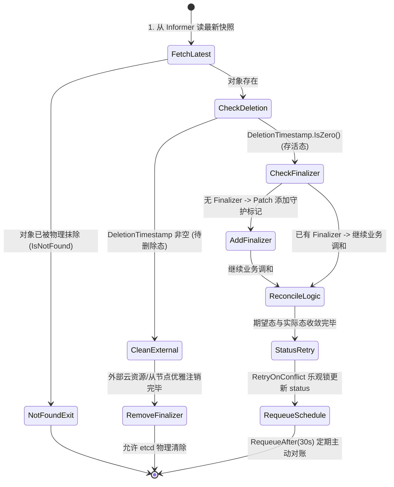
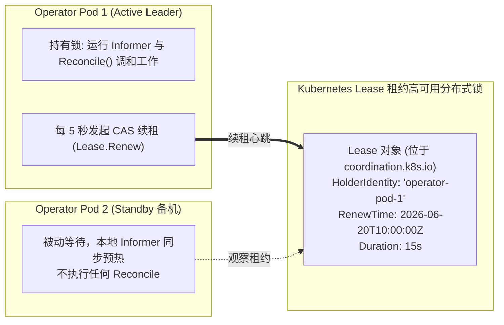
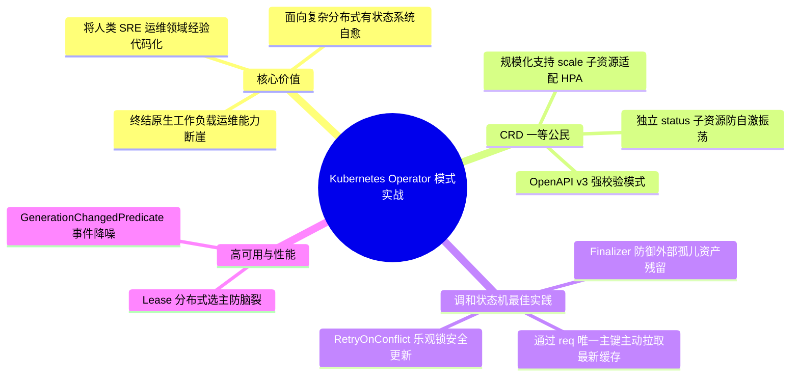

**TL;DR：** Kubernetes 内置的原生工作负载（Deployment、StatefulSet、Job）只理解非常通用的“进程与容器副本”概念，完全缺乏对分布式复杂中间件内部深层协议的感知能力。当一个分布式数据库（如 Redis Cluster、PostgreSQL Patroni、Kafka、TiDB）遭遇网络分区主从切换、哈希槽迁移重平衡、或者在线无损数据恢复时，原生控制器除了无脑重启 Pod 之外别无他法，往往直接导致主备双写脑裂或集群元数据彻底损坏。为了将人类 SRE 的运维领域智慧代码化，CoreOS 在 2016 年提出了 **Operator 模式：CRD（自定义资源定义）+ 自定义控制器（Custom Controller）**。通过 CRD 将业务领域概念提升为 Kubernetes 一等公民；借助工业级框架 **Kubebuilder / Controller-Runtime**，在核心调和函数 `Reconcile()` 中构建严密的幂等状态机；利用 **Finalizer** 拦截对象删除、优雅回收外部云资产；通过 **Predicate 事件过滤** 阻断死循环热空转；并依靠 **Lease 租约分布式选主** 保障高可用多活容灾，构筑起云原生平台工程的最高进阶护城河。

---

## 一、 面试现场：从“原生工作负载能力断崖”到“生产级 Operator 架构”的连环追问

```text
面试官提问：
  "既然 Kubernetes 已经有了 Deployment 和 StatefulSet，为什么我们在云原生上跑 Redis Cluster、Kafka 或 TiDB 时，还必须自己写 Operator？
   用 Kubebuilder 开发一个生产级 Operator，核心 Reconcile 循环应该怎么设计？
   如何防止删除 CR 时外部云资源泄漏？高并发下更新 Status 遇到 409 Conflict 怎么破？Operator 自身如何实现高可用选主？"
```

### 1.1 初级候选人的典型翻车点

在考察云原生平台开发与二次定制时，初级候选人常暴露以下软肋：
- **只会背“Operator = CRD + Controller”八股公式**：根本讲不清楚 StatefulSet 到底缺了什么，无法举出“扩缩容槽位迁移、主从拓扑感知、物理备份热恢复”等具体协议层面的能力断崖；
- **误以为 Reconcile 接收的是完整的变更事件**：不知道调和函数入参只有一个微型的 `reconcile.Request{NamespacedName}`，业务必须每次主动去本地 Cache 取最新对象，误将 Operator 当成处理传统 MQ 增量消息的消费线程；
- **不知道 Finalizer 的拦截原理**：以为在控制器里监听 `Delete` 事件就能做清理，完全不知道此时 CR 可能早已在 etcd 中被抹除，导致外部云盘、负载均衡器成为无人认领的孤儿资产并持续扣费；
- **写出死循环振荡与 409 崩溃代码**：在 `Reconcile` 中更新 `Status` 时没有配置 Predicate 事件过滤，导致自己更新 Status 又触发新的 Reconcile 事件，陷入 CPU 100% 的无限死循环；更新冲突时直接抛错而不是用 `RetryOnConflict` 优雅重试。

### 1.2 资深工程师的破局切入点

资深平台研发架构师能够从**“领域特定运维（Domain-Specific Operations）的代码化落地”**系统作答：
1. **点明能力断崖的物理分界线**：Deployment/StatefulSet 只能管理通用容器 Pod 的生死，不理解 MySQL Replication Lag、Redis Cluster Meet 与 Raft 仲裁。Operator 的使命是将人类 SRE 的 Runbook 转化为 24 小时运行的自治软件；
2. **手绘 Kubebuilder 生产级调和标准骨架**：
   - 入参只传 Key，调和函数必须保持**绝对幂等性与可重入性**；
   - 区分 Spec（期望意图）与 Status（实际观测），通过 `GenerationChangedPredicate` 过滤纯 Status 触发的无效事件；
3. **深入 Finalizer 生命周期防线**：展示如何通过 `metadata.finalizers` 锁死对象的物理删除，在外部资源（如云厂商 SLB、安全组）释放完毕后再原子移除 Finalizer 字符串放行 GC；
4. **化解并发与高可用**：使用 `clientgo/retry.RetryOnConflict` 抹平乐观锁并发冲突，依赖 `coordination.k8s.io/v1` 的 Lease 机制实现多副本 Active-Passive 热备选主，确保零脑裂。

### 1.3 为什么需要 Operator？原生工作负载的能力断崖

在面对无状态 Web 微服务时，Deployment 的滚动更新（RollingUpdate）与自动扩缩容（HPA）堪称完美。
但面对以下分布式有状态拓扑，原生工作负载瞬间跌入能力断崖：



- **Redis 集群扩容**：StatefulSet 可以把副本从 3 变成 6，但新加进来的 3 个 Pod 只是孤立运行的空实例，**StatefulSet 根本不知道如何执行 `CLUSTER MEET` 与哈希槽（Hash Slots）的均匀迁移**；
- **PostgreSQL 主节点宕机**：StatefulSet 观察到 Pod 退出，只会原地重新拉起一个新 Pod，但新 Pod 启动前该谁担任主节点？如何防止旧主节点死灰复燃造成“双主裂脑（Split-Brain）”？StatefulSet 毫无概念。

**Operator 的第一性原理：将运维人员写在 Runbook 运维手册里的复杂排障与变更步骤，翻译为用 Go 语言编写的、24 小时不知疲倦持续对账的自动化控制器。**

---

## 二、 CRD 架构内核：将业务语义升格为 K8s 一等公民

在 Kubernetes 中，`CustomResourceDefinition`（CRD）允许用户在不需要修改任何一行 Kubernetes 核心代码的前提下，向 API Server 动态注册全新的资源类型。



### 2.1 生产级 CRD 声明的核心要素
```yaml
apiVersion: apiextensions.k8s.io/v1
kind: CustomResourceDefinition
metadata:
  name: redisclusters.db.example.com
spec:
  group: db.example.com
  names:
    kind: RedisCluster
    plural: redisclusters
    singular: rediscluster
    shortNames: ["rc"]
  scope: Namespaced
  versions:
  - name: v1
    served: true
    storage: true
    schema:
      openAPIV3Schema:
        type: object
        required: ["spec"]
        properties:
          spec:
            type: object
            required: ["replicas", "version"]
            properties:
              replicas:
                type: integer
                minimum: 3
                maximum: 9
              version:
                type: string
                pattern: "^[0-9]+\\.[0-9]+$"
          status:
            type: object
            properties:
              clusterState:
                type: string
              healthyReplicas:
                type: integer
    subresources:
      status: {}
      scale:
        specReplicasPath: .spec.replicas
        statusReplicasPath: .status.healthyReplicas
```

### 2.2 为什么必须显式开启 `status` 子资源？
这是编写高质量 Operator 的绝对红线：
- **避免并发冲突**：开启 `subresources.status: {}` 后，修改状态必须通过专用的 `/status` REST 端点；
- **隔离控制面关注点**：更新 `status` 字段时，**不会递增对象的 `metadata.generation` 版本号**！
- 如果没有开启该子资源，每次控制器更新 `status` 都会导致对象的全局版本增加，进而再次触发自身监听到新事件，引发**灾难性的死循环自激振荡**！

### 2.3 多版本演进：Conversion Webhook 与轮辐（Hub-Spoke）转换

当业务演进需要升级 API 版本（从 `v1alpha1` $\to$ `v1beta1` $\to$ `v1`）时，不能粗暴破坏老客户端的向下兼容。
Kubernetes 提供了 **Conversion Webhook** 机制，采用优雅的**轮辐（Hub-and-Spoke）设计模式**：



- **单版本持久化**：在 etcd 中，无论有几个 API 版本对外暴露，**物理存储永远只存一个标记为 `storage: true` 的 Hub 版本（如 `v1`）**，彻底杜绝数据冗余与格式混乱；
- **双向无损转译**：当老客户端使用 `v1alpha1` 读取或写入时，API Server 在内存中调用 Conversion Webhook 进行 `ConvertFrom` 或 `ConvertTo` 双向换算，让不同代际的客户端无感协同。

---

## 三、 基于 Kubebuilder 的控制器架构与调和模型

在现代云原生开发中，**Kubebuilder** 与其底层依赖的 **Controller-Runtime** 是工业级 Operator 的事实标准基座。



### 3.1 核心调和入口 `Reconcile` 签名之谜

```go
func (r *RedisClusterReconciler) Reconcile(ctx context.Context, req ctrl.Request) (ctrl.Result, error)
```

仔细观察入参：`req` 仅仅包含一个 `reconcile.Request` 结构体：
```go
type Request struct {
    types.NamespacedName // 仅包含: Namespace 和 Name
}
```
**为什么不直接把发生变动的对象完整指针传给调和函数？**
这再次体现了 Kubernetes **水平触发（Level-Triggered）**的极致哲学：
1. 事件在队列里排队时，对象可能已经发生了多次剧烈变动；
2. 传递完整对象会导致控制器处理过期甚至已经作废的历史快照；
3. **只传唯一主键（Namespace/Name），逼迫控制器在被唤醒的第 1 行代码，主动从本地最新缓存中拉取当前实时快照！**

---

## 四、 生产实战：核心状态机与防御性编程红线

让我们拆解一个生产级 Operator 在执行 `Reconcile` 时必须贯彻的防御性代码范式：

```go
package controllers

import (
    "context"
    "time"

    apierrors "k8s.io/apimachinery/pkg/api/errors"
    "k8s.io/client-go/util/retry"
    ctrl "sigs.k8s.io/controller-runtime"
    "sigs.k8s.io/controller-runtime/pkg/client"
    "sigs.k8s.io/controller-runtime/pkg/controller/controllerutil"

    dbv1 "example.com/api/v1"
)

const redisFinalizer = "db.example.com/finalizer"

type RedisClusterReconciler struct {
    client.Client
}

func (r *RedisClusterReconciler) Reconcile(ctx context.Context, req ctrl.Request) (ctrl.Result, error) {
    // 1. 获取最新对象快照 (直接走 Informer 本地缓存)
    var rc dbv1.RedisCluster
    if err := r.Get(ctx, req.NamespacedName, &rc); err != nil {
        if apierrors.IsNotFound(err) {
            // 对象已被物理删除，安全退出，无需重试
            return ctrl.Result{}, nil
        }
        // 读取本地缓存异常，抛出错误触发指数退避
        return ctrl.Result{}, err
    }

    // 2. Finalizer 优雅清理逻辑判断
    if rc.ObjectMeta.DeletionTimestamp.IsZero() {
        // 对象存活：确保已经打上 Finalizer 守护标记
        if !controllerutil.ContainsFinalizer(&rc, redisFinalizer) {
            controllerutil.AddFinalizer(&rc, redisFinalizer)
            if err := r.Update(ctx, &rc); err != nil {
                return ctrl.Result{}, err
            }
        }
    } else {
        // 对象正处于 Terminating 待删除状态：执行物理外部清理
        if controllerutil.ContainsFinalizer(&rc, redisFinalizer) {
            if err := r.cleanupExternalResources(ctx, &rc); err != nil {
                // 清理未完成，返回错误继续阻断删除并重试
                return ctrl.Result{}, err
            }
            // 外部资源清理彻底，安全摘除 Finalizer，允许 etcd 物理抹除记录
            controllerutil.RemoveFinalizer(&rc, redisFinalizer)
            return ctrl.Result{}, r.Update(ctx, &rc)
        }
        return ctrl.Result{}, nil
    }

    // 3. 核心领域调和：驱动期望态与实际态收敛
    if err := r.reconcileClusterTopology(ctx, &rc); err != nil {
        return ctrl.Result{}, err
    }

    // 4. 更新 Status 子资源 (使用乐观锁 Conflict 重试保护)
    err := retry.RetryOnConflict(retry.DefaultRetry, func() error {
        var latest dbv1.RedisCluster
        if err := r.Get(ctx, req.NamespacedName, &latest); err != nil {
            return err
        }
        latest.Status.ClusterState = "Healthy"
        latest.Status.HealthyReplicas = rc.Spec.Replicas
        return r.Status().Update(ctx, &latest)
    })

    // 5. 稳定态巡检：定期 30 秒主动对账防配置漂移
    return ctrl.Result{RequeueAfter: 30 * time.Second}, err
}
```



### 4.2 调和生命周期状态机

整个 `Reconcile` 执行逻辑在物理上可以严格建模为有限状态机（FSM）：



---

## 五、 高可用架构：Predicate 事件降噪与 Lease 分布式选主

### 5.1 Predicate 事件过滤：阻断 90% 的无效空转

在真实集群中，Pod 频繁上报高频的 CPU、内存或健康检查心跳。这会导致 Controller 监听到的事件流量极度膨胀。
如果在注册 Controller 时不加过滤，每次 Pod 的 Status 改动都会将 Controller 唤醒一次，引发严重的 CPU 饥饿。

```go
// 使用 Predicate 过滤掉只有 Status 变动、但 Spec 无实质更改的冗余事件
func (r *RedisClusterReconciler) SetupWithManager(mgr ctrl.Manager) error {
    return ctrl.NewControllerManagedBy(mgr).
        For(&dbv1.RedisCluster{}).
        Owns(&corev1.Pod{}).
        WithEventFilter(predicate.GenerationChangedPredicate{}). // 仅当 metadata.generation 递增时触发
        Complete(r)
}
```
`GenerationChangedPredicate` 确保：只有当用户真正修改了 YAML 里的 `spec` 规范时才唤醒 Reconcile，直接拦截了 95% 以上无意义的空转。

### 5.2 基于 Lease 租约的高可用分布式选主（Leader Election）

为了防范单点崩溃，生产级 Operator 通常部署为多副本（如 3 副本）。但同一时刻**绝对只能有一个主控实例执行 Reconcile**，否则两个实例并发下发对冲的集群调整指令，会导致系统雪崩。



Controller-Runtime 原生集成了基于 Kubernetes `coordination.k8s.io/v1` 的 **Lease 机制**：
1. 多个 Pod 启动时，利用 etcd 的 CAS（Compare-And-Swap）原子争抢创建或更新同一个 Lease 对象；
2. 抢锁成功者成为 Leader，正式启动 Worker 协程池执行 Reconcile；
3. 备机实例进入待命循环，持续监听 Lease 状态；
4. Leader 必须在租约到期前（如 15 秒）周期性心跳续租；
5. 一旦 Leader 所在物理机宕机断网、租约超时，备机瞬间感知并安全接管领导权，无缝承接集群自治调和，彻底杜绝脑裂。

---

## 六、 面试通关复盘与架构师高分回答模板



### 6.1 现场 2 分钟极速电梯演讲（高分答题模板）

> **面试官问：**“原生 Deployment 为什么管不好分布式数据库？如何基于 Kubebuilder 开发生产级 Operator？”

**高分应答结构（递进式穿透）：**

> “**第一层（原生工作负载能力断崖与模式本质）：**
> Deployment 和 StatefulSet 只理解通用的‘进程副本生命周期’，完全不理解分布式中间件协议（如 Redis 哈希槽迁移、Kafka 分区重分配、PostgreSQL 复制积压与 Raft 投票选主）。Operator 模式的第一性原理，就是**通过 CRD 将领域业务模型升格为 Kubernetes 一等公民，用自定义控制器将 SRE 的运维 Runbook 代码化为 24 小时运行的自治软件**。
>
> **第二层（Kubebuilder 生产级调和状态机构建）：**
> 1. **入参设计与幂等对账**：调和函数 `Reconcile(ctx, req)` 入参仅包含对象的命名空间与名称。Worker 每次主动从本地 Informer Cache 拉取最新快照，对比期望 Spec 与实际 Status，驱动系统向终态收敛。**调和逻辑必须具备绝对的幂等性与可重入性**；
> 2. **Finalizer 物理安全拦截**：当 CR 被下发删除命令时，`metadata.deletionTimestamp` 被填充，但只要 `metadata.finalizers` 列表中仍有值，etcd 就绝不会物理抹除该对象。控制器捕获后，先优雅清理外部关联的云存储、安全组或负载均衡器，确认释放无误后再原子移除 Finalizer 字符串，放行 GC，彻底杜绝孤儿云资产泄漏；
> 3. **事件防抖与并发冲突规避**：配置 `GenerationChangedPredicate`，过滤掉由 Status 自身更新引发的虚假事件，规避 CPU 100% 振荡死循环；更新 Status 时必须使用 `k8s.io/client-go/util/retry.RetryOnConflict` 优雅化解乐观锁 409 冲突。
>
> **第三层（高可用选主与脑裂防御）：**
> 生产级 Operator 通常部署为多副本容灾。通过 Controller-Runtime 原生集成的 Kubernetes **Lease 租约分布式锁**（基于 etcd CAS 原子争抢），同一时刻严格保证仅有 1 个 Active Leader 启动 Worker 执行 Reconcile，Standby 备机待命监听。一旦 Leader 宕机超时，备机瞬间接管，在保证零脑裂的前提下实现秒级故障转移。”

### 6.2 生产面试关键避坑守则

1. **必须区分 Spec 与 Status 子资源**：CRD 必须开启 `/status` 子资源。这样更新状态时调用 `r.Status().Update()` 不会递增 `metadata.generation`，再配合 `predicate.GenerationChangedPredicate` 即可彻底消灭死循环；
2. **严防删除对象时的“空指针”Panic**：在 `Reconcile` 第一步 `r.Get()` 时，若返回 `apierrors.IsNotFound(err)`，必须立刻返回 `ctrl.Result{}, nil` 退出，绝不能继续往下执行，因为该对象在 etcd 中已经彻底消失；
3. **设置 OwnerReference 实现自动垃圾回收**：创建 Pod、Service 等衍生子资源时，务必调用 `ctrl.SetControllerReference(parent, child, r.Scheme)`，将当前 CR 设为其父级，实现原生级联删除；
4. **业务级强校验务必外挂 Admission Webhook**：CRD 的 OpenAPI Schema 只能校验字段类型与简单正则，无法校验业务逻辑（如“节点数必须为奇数”）。必须部署 Validating Webhook 在创建和修改的第一时间进行拦截。
---

## 参考资料与权威规范

1. **Kubebuilder 官方开发指南**: *The Kubebuilder Book & Controller-Runtime Architecture* (book.kubebuilder.io).
2. **Kubernetes API Conventions**: *Custom Resource Definitions & Subresources* (`kubernetes/community/contributors/devel/sig-architecture/api-conventions.md`).
3. **CoreOS Operator Framework**: *Introducing Operators: Putting Operational Knowledge into Software* (coreos.com/blog/introducing-operators.html).
4. **Kubernetes Source Code**: *Controller-Runtime Manager and Leader Election with Leases* (`sigs.k8s.io/controller-runtime/pkg/leaderelection/`).
5. **Programming Kubernetes**: *Developing Cloud-Native Applications with Custom Controllers* (Hausenblas & Schimanski, O'Reilly Media 2019).
