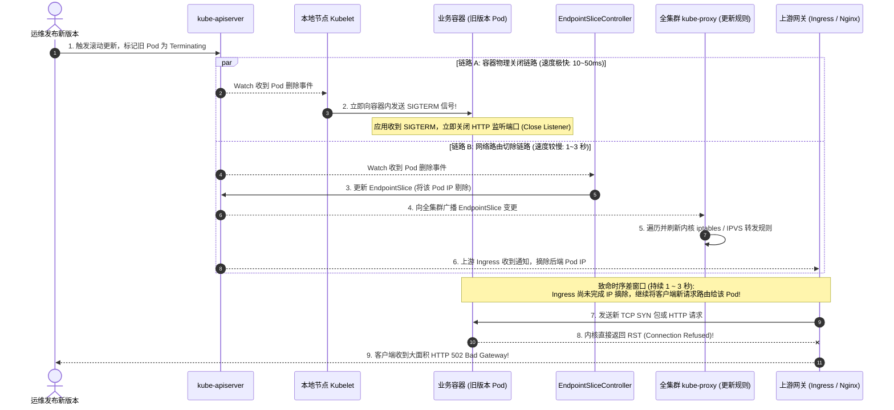
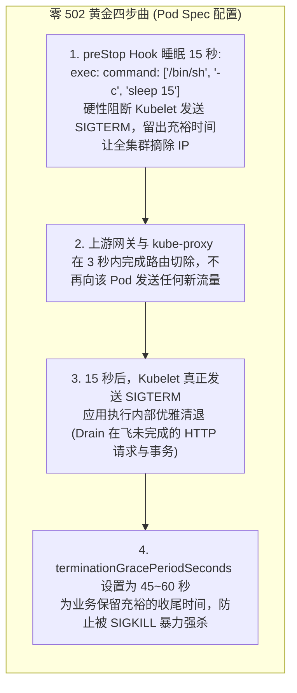
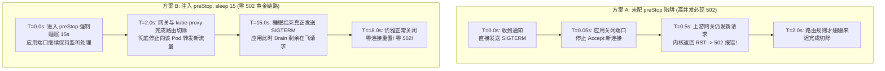
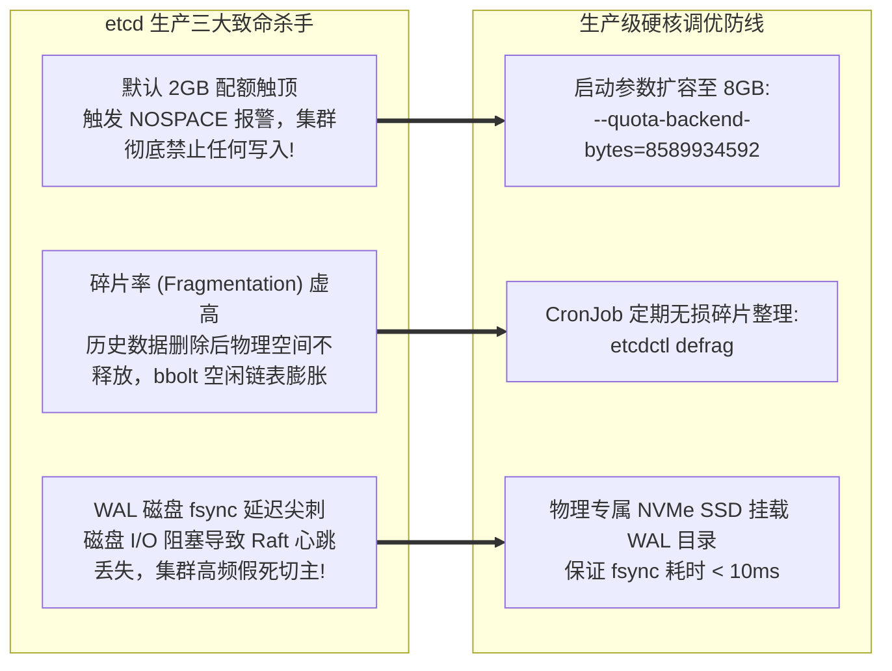
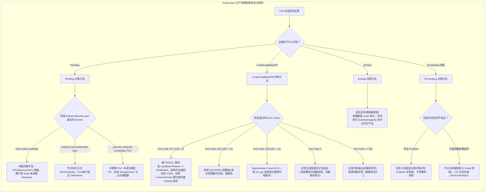
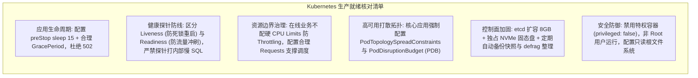
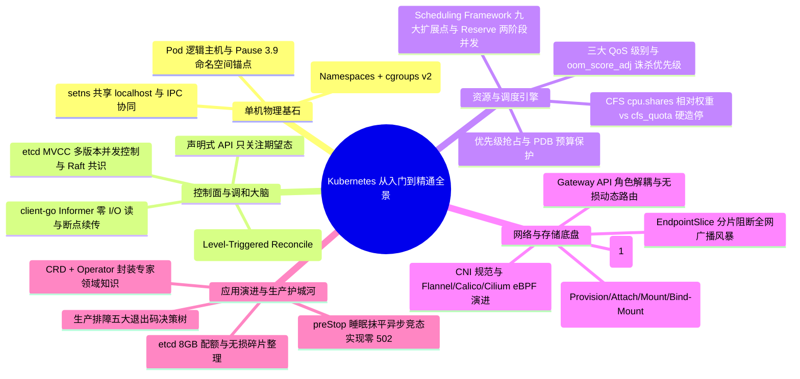

**TL;DR：** 许多开发团队在微服务上线 Kubernetes 后，自以为配置了 RollingUpdate 滚动发布就能高枕无忧，却在每次业务发版时频繁遭遇客户端监控爆出大量的 **HTTP 502 Bad Gateway 与连接重置（Connection Reset）**。这背后的物理根源在于**容器销毁信号与控制面网络规则下发之间存在致命的异步并行竞态（Race Condition）**：Kubelet 在向容器发送 `SIGTERM` 的那一刹那，EndpointSlice 控制器才刚刚感知到 Pod 下线，跨越全集群数千台节点的 iptables/IPVS 规则刷新需要 1~3 秒的时延，导致在这 1~3 秒内上游网关依然在向正在自杀的 Pod 发送新请求。消除 502 的唯一科学解法，是**在 Pod 生命周期中注入 `preStop: sleep 15`，强行对齐网络下线与进程终结的时序差**。而在控制面底座，etcd 的 8GB 物理配额扩容、定期无损碎片整理（`etcdctl defrag`）与独立 NVMe 盘隔离 WAL fsync，是防范控制面雪崩的生命线；结合对退出码 137（OOM）、143、Terminating 假死的全景排障决策树，彻底筑牢企业生产稳定性护城河。

---

## 一、 面试现场：从“滚动发布频发 502”到“全景排障决策树”的连环追问

```text
面试官提问：
  "你们生产上配置了 Deployment 滚动更新，为什么每次发版客户端依然能监控到大量的 502 Bad Gateway 报错？
   底层到底发生了什么异步竞态？如何设计才能做到真正的‘零 502’发布？
   生产 etcd 遭遇容量打满报警和 WAL fsync 延迟抖动时如何调优？
   如果线上 Pod 出现 CrashLoopBackOff、Terminating 假死或退出码 137，你的完整排查决策链路是什么？"
```

### 1.1 初级候选人的典型翻车点

在考察生产大考与稳定性攻防时，初级候选人常暴露以下实战断层：
- **只会怪“业务代码没写优雅停机”**：以为业务框架处理了 `SIGTERM` 并在 30 秒内 Drain 请求就够了，完全不知道在 Kubelet 发出 `SIGTERM` 的瞬间，上游网关和全网节点根本还没来得及摘除 Pod IP，直接将锅甩给业务；
- **不知道 preStop 睡眠的物理必要性**：无法解释“为什么必须在 preStop 里 `sleep 15` 秒”，甚至以为 sleep 是在无谓地拖慢发布流水线；
- **对 etcd 生产运维两眼一抹黑**：不知道 etcd 默认配额仅 2GB，更不知道高频更新后产生的空洞必须靠 `etcdctl defrag` 整理碎片，否则会出现“虽然执行了 Compaction 但 db 物理文件依然打满爆盘”的离奇故障；
- **排查线上故障毫无章法**：看到 Pod 异常只会盲目 `kubectl delete pod` 重启，分不清退出码 137（OOM Killer 诛杀）与退出码 143（正常 SIGTERM），对 Terminating 假死只会 `--force --grace-period=0` 强删，不知道是底层存储卷卸载失败或 Finalizer 阻塞。

### 1.2 资深工程师的破局切入点

资深 SRE 架构师面对此类稳定性灵魂追问，能够以**“时序竞态对齐与物理分层排障决策”**从容应对：
1. **揭示 502 并行竞态模型**：画出链路 A（容器进程秒级退出的短路径）与链路 B（控制面跨节点同步刷新 iptables/IPVS 的长路径），证明 1~3 秒的时差必然导致流量打向已关端口的容器并触发 TCP RST；
2. **给出工业级“零 502”黄金方案**：
   - `preStop: sleep 15`：硬性挂起容器销毁，等待链路 B 摘除路由；
   - 业务捕获 `SIGTERM` 优雅清退在飞请求；
   - `terminationGracePeriodSeconds: 45~60`：为收尾提供充裕时间；
3. **输出 etcd 调优三大铁律**：
   - 存储配额提升至 `--quota-backend-bytes=8589934592`（8GB）；
   - 物理盘隔离，采用 NVMe SSD 保证 WAL fsync 延时稳定在 10ms 以内；
   - 周期性执行自动化 `etcdctl defrag` 消除空间碎片；
4. **全景排障决策树**：分类秒杀 CrashLoopBackOff（查退出码与 OOMKilled）、Pending（查资源配额与污点容忍）、Terminating 假死（查 Finalizers 与 CSI Volume 卸载状态）。

### 1.3 致命的并行竞态：为什么直接 SIGTERM 必然导致 502？

当你在 Kubernetes 中更新一个 Deployment 时，API Server 会将旧版本 Pod 的 `metadata.deletionTimestamp` 设置为当前时间。
此时，系统内部兵分两路，启动了两条**完全并行、互不等待的异步执行链路**：



**物理矛盾推导**：
- **链路 A（杀进程）耗时极短**：Kubelet 收到通知后，几十毫秒内就会向容器主进程发送 `SIGTERM`。主流框架（如 Spring Boot、Gin、Node.js）收到信号后，第一步动作就是立即 `listener.Close()` 停止接受新的 TCP 连接；
- **链路 B（摘路由）链条极长**：从 Controller 发现、修改 EndpointSlice、广播到所有节点、`kube-proxy` 刷新 iptables，通常需要 **1 到 3 秒**；
- **在两者并行的 1~3 秒空窗期内，上游网关（Ingress）和集群内部其他客户端的路由表里，该 Pod 依然是活跃的！** 流量源源不断涌入已关闭端口的容器，Linux 内核直接回复 TCP RST（连接被拒绝），上游网关直接向终端用户抛出惨烈的 `502 Bad Gateway`。

### 1.2 零 502 优雅停机的完整标准解法

要想彻底抹平这个时间差，必须通过强制介入 Pod 的生命周期，让**链路 A 故意停顿等待链路 B 彻底执行完毕**。



#### 生产黄金配置模板：
```yaml
apiVersion: apps/v1
kind: Deployment
metadata:
  name: order-service
spec:
  replicas: 3
  template:
    spec:
      # 留出 45 秒宽限期: 15s preStop + 30s 业务内部优雅停机
      terminationGracePeriodSeconds: 45
      containers:
      - name: order-service
        image: order-service:v2.1
        lifecycle:
          preStop:
            exec:
              # 关键核心: 强制休眠 15 秒，确保 EndpointSlice 广播与网络切除已在全网彻底生效
              command: ["/bin/sh", "-c", "sleep 15"]
        ports:
        - containerPort: 8080
        readinessProbe:
          httpGet:
            path: /healthz/ready
            port: 8080
          initialDelaySeconds: 5
          periodSeconds: 3
```



---

## 二、 控制面底盘：etcd 生产调优与容量防线

在大规模高并发集群中，几乎所有的控制面崩溃，最终都会追溯到 **etcd** 的性能瓦解。



### 2.1 为什么删了数据 etcd 物理文件（`db`）还是不缩小？

许多工程师发现，使用脚本清理了集群中数万个无用的 Job 和 Pod 后，etcd 的数据库物理文件大小（`/var/lib/etcd/member/snap/db`）依然居高不下。
这是由 etcd 底层的 **bbolt 存储引擎** 原理决定的：
- 当旧版本数据因 Compaction 被逻辑删除后，bbolt 只是将对应的 B+ 树叶子节点页标记为“空闲（Free List）”；
- **这些空闲页面并不会归还给 Linux 操作系统**，而是留存下来复用给后续的新写入；
- 当碎片率超过 50% 时，不仅浪费宝贵的内存和磁盘，还会导致二分查找变慢。

### 2.2 生产核心 Prometheus 告警规则清单

```yaml
groups:
- name: etcd-production-alerts
  rules:
  # 1. WAL fsync 延迟超过 10ms 告警 (可能导致 Raft 选主震荡)
  - alert: EtcdHighFsyncLatency
    expr: histogram_quantile(0.99, rate(etcd_disk_wal_fsync_duration_seconds_bucket[5m])) > 0.010
    for: 2m
    labels:
      severity: critical
    annotations:
      summary: "etcd 磁盘 WAL fsync P99 延迟突破 10ms，磁盘 I/O 瓶颈严重"

  # 2. 数据库配额使用率超过 80%
  - alert: EtcdDatabaseQuotaFillingUp
    expr: (etcd_mvcc_db_total_size_in_bytes / etcd_server_quota_backend_bytes) > 0.80
    for: 5m
    labels:
      severity: warning
    annotations:
      summary: "etcd 空间配额使用率超过 80%，需尽快执行 defrag 碎片整理"

  # 3. 集群丧失 Leader
  - alert: EtcdNoLeader
    expr: etcd_server_has_leader == 0
    for: 1m
    labels:
      severity: critical
    annotations:
      summary: "etcd 集群无 Leader，控制面已陷入只读或不可用状态!"
```

### 2.3 在线无损碎片整理（Defragmentation）

```bash
# 1. 检查当前 etcd 集群成员的状态与碎片率
$ etcdctl endpoint status --write-out=table \
  --cacert=/etc/kubernetes/pki/etcd/ca.crt \
  --cert=/etc/kubernetes/pki/etcd/healthcheck-client.crt \
  --key=/etc/kubernetes/pki/etcd/healthcheck-client.key \
  --endpoints=https://127.0.0.1:2379

# 若 DB SIZE 远大于 IN USE SIZE，说明碎片极其严重!

# 2. 逐节点执行无损碎片整理 (必须一个节点整理完毕健康后再整理下一个!)
$ etcdctl defrag --endpoints=https://127.0.0.1:2379 \
  --cacert=/etc/kubernetes/pki/etcd/ca.crt \
  --cert=/etc/kubernetes/pki/etcd/healthcheck-client.crt \
  --key=/etc/kubernetes/pki/etcd/healthcheck-client.key
```
整理完成后，物理磁盘文件会瞬间压缩到真实数据大小，消除空间报警隐患。

---

## 三、 生产排障大杀器：常见物理故障全景决策树

在面对线上突发告警时，优秀的云原生工程师能够根据 Pod 的状态码与底层物理成因，建立条件反射级的诊断链路。



### 3.1 容器退出码（Exit Codes）的物理含义备查表

| 退出码 | 物理成因 | 典型生产排查路径 |
| --- | --- | --- |
| **0** | 应用主动正常退出 | 容器没有常驻前台主进程。例如执行了后台命令 `service nginx start`，脚本执行完即退出，容器跟随销毁。改用前台启动：`nginx -g 'daemon off;'` |
| **1 / 2** | 应用程序运行时抛出致命异常 | 环境变量缺失、配置文件格式错误、数据库连线超时。查看 `kubectl logs <pod> --previous` 观察上次崩溃堆栈 |
| **137** ($128+9$) | 进程收到操作系统 **`SIGKILL` (信号 9)** | 1. 查看 `kubectl describe pod`，若包含 `OOMKilled: true`，说明触顶 `limits.memory`，需调大内存或修复内存泄漏；<br/>2. 若无 OOM 记录，查看存活探针（`livenessProbe`）是否因业务卡死连续失败超时触发 Kubelet 物理处决 |
| **139** ($128+11$) | 进程触发 **`SIGSEGV` (段错误)** | 内存越界访问、野指针解引用。通常发生在包含 CGo、JNI 本地代码或底层 C/C++ 共享库损坏的场景，需提取 Core Dump 文件分析 |
| **143** ($128+15$) | 进程收到操作系统 **`SIGTERM` (信号 15)** | Pod 正在被正常销毁或滚动更新，但业务关闭耗时超过了 `terminationGracePeriodSeconds`，最终被系统强杀 |

---

## 四、 疑难杂症攻坚：Terminating 卡死与僵尸 Finalizer 清理

在生产排障中，最让运维头疼的一个场景是：
执行 `kubectl delete pod my-pod` 后，Pod 状态停留在 `Terminating` 长达数小时甚至数天，任凭怎么重试都删不掉。

```mermaid
flowchart LR
    subgraph Stuck["Pod 为什么会卡死在 Terminating？"]
        direction TB
        Reason1["原因 A: 存储卷在宿主机陷入 D-State (不可中断休眠)<br/>CSI 无法完成 Detach，Kubelet 阻断删除"]
        Reason2["原因 B: 资源打了 Finalizers 守护标记<br/>负责清理的外部 Controller 已经挂掉，无人摘除 Finalizer"]
    end

    subgraph Solution["安全且彻底的解套流程"]
        direction TB
        Fix1["第一步: 优先排查并恢复挂载节点网络"]
        Fix2["第二步: 若确定物理无害，Patch 强力清空 Finalizers:<br/>kubectl patch pod my-pod -p '{\"metadata\":{\"finalizers\":null}}'"]
        Fix3["第三步: 终极强制删除 (慎用，仅作为最后防线):<br/>kubectl delete pod my-pod --force --grace-period=0"]
    end

    Reason1 --> Fix1
    Reason2 --> Fix2
    Fix1 -. "仍无法释放" .-> Fix3
```

### 生产解套三步法：
1. **先看存储与节点状况**：
   运行 `kubectl describe pod my-pod`，如果看到 `Failed to unmount volume`，登录所在 Node 查看是否有进程占用挂载目录（`fuser -m /var/lib/kubelet/pods/...`）或 CSI 节点异常；
2. **清除僵尸 Finalizer**：
   若该 Pod 或关联 CRD 打了 Finalizer 标记，直接执行原子置空：
   ```bash
   kubectl patch pod my-pod -p '{"metadata":{"finalizers":null}}'
   ```
   etcd 感知到 Finalizer 列表归零后，立即将其从存储中彻底物理抹除！
3. **强制清除（Force Delete）**：
   ```bash
   kubectl delete pod my-pod --force --grace-period=0
   ```
   这会直接告知 API Server 强制从 etcd 摘除对象，跳过等待 Kubelet 汇报的步骤（注意：在有状态数据库中强制删除前务必确认旧节点没有在继续双写数据）。

---

## 五、 全景生产就绪与容量规划核对清单（Checklist）

在将核心业务正式推向 Kubernetes 生产环境之前，请对照以下黄金核对清单（Production Readiness Checklist）逐一闭环：



---

## 六、 面试通关复盘与架构师高分回答模板



### 6.1 现场 2 分钟极速电梯演讲（高分答题模板）

> **面试官问：**“生产集群滚动发布频繁爆出 502 报错，如何做到真正‘零 502’发布？线上 Pod 异常退出的排查思路是什么？”

**高分应答结构（递进式穿透）：**

> “**第一层（502 异步并行竞态物理根因）：**
> 滚动发布频繁 502 的根本原因不是应用没做优雅停机，而是**容器关闭与网络路由切除之间存在不可抗拒的异步并行时差**。当 Pod 被标记为 Terminating 时，系统并发启动了两条独立链路：
> - 链路 A（杀进程）：Kubelet 收到通知后几十毫秒内便向容器发送 `SIGTERM`，主流应用立即关闭监听端口（`Close Listener`），拒绝接收新连接；
> - 链路 B（摘路由）：EndpointSlice 控制器发现 Pod 变更、更新对象、广播到全网千台节点、各节点 `kube-proxy` 刷新 iptables/IPVS，通常存在 **1~3 秒的物理传播延迟**。
> 在这 1~3 秒的空窗期内，上游网关（Ingress）和客户端依然会把新请求路由给该 Pod，内核直接回复 TCP RST，网关返回 502 Bad Gateway。
>
> **第二层（工业级‘零 502’破局组合拳）：**
> 彻底消灭 502 必须强行对齐时钟，让链路 A 停顿等待链路 B：
> 1. **配置 `preStop: sleep 15`**：在 Kubelet 发送 SIGTERM 之前硬性挂起 15 秒，留出足够时间让全集群各节点的 kube-proxy 和 Ingress 网关将该 Pod IP 从后端列表中彻底摘除；
> 2. **应用层优雅处理 `SIGTERM`**：15 秒后收到 SIGTERM，应用停止接受新请求，并留出时间消费完毕当前正在处理的在飞（In-Flight）长连接与事务；
> 3. **放大宽限期**：将 `terminationGracePeriodSeconds` 调大至 45~60 秒，确保应用有充裕时间完成退出，坚决不被超时的 `SIGKILL` 暴力强杀。
>
> **第三层（生产 etcd 加固与五大故障秒级定位）：**
> 1. **etcd 防御底座**：默认 2GB 配额必须扩容至 `--quota-backend-bytes=8589934592`（8GB），独立 NVMe 盘隔离 WAL fsync 消除刷盘毛刺，搭配定时任务自动执行 `etcdctl defrag` 回收空间空洞；
> 2. **排障决策树**：
>    - `CrashLoopBackOff`：查退出码。`137` 必然是 OOM（查内核 `dmesg` 与 `OOMKilled` 标识），`143` 是正常 SIGTERM，`1/2` 是应用启动代码报错；
>    - `Pending`：看 Events 事件，区分是 CPU/内存不足、还是可用区 PVC 拓扑冲突、或是节点污点未容忍；
>    - `Terminating 假死`：重点排查是否有残留的 `Finalizers` 阻塞未释放，或底层 CSI 存储卷在云端 Detach 失败。”

### 6.2 生产面试关键避坑守则

1. **绝对不要随意使用 `--force --grace-period=0` 强删 Pod**：强制删除只会直接在 etcd 中抹掉 Pod 记录，但宿主机上的真实容器、孤儿进程或底层 CSI 挂载卷可能依然在运行，极易引发底层数据块并发双写损坏；
2. **警惕 `etcdctl compact` 之后的虚假释放**：Compaction 只会将旧版本标记为墓碑（Tombstone），但底层 bbolt 数据库文件不会自动缩小。必须紧接着在每个 Member 节点上执行 `etcdctl defrag` 才能真正将磁盘空间归还给操作系统；
3. **区分 Liveness 与 Readiness 探针的职责边界**：Readiness 失败只会把 Pod 从 EndpointSlice 踢出，不杀容器；Liveness 失败会直接重启容器。严禁在 Liveness 探针中去执行慢 SQL 或依赖外部第三方接口，否则第三方抖动会导致全集群容器被反复重启雪崩；
4. **深入掌握全链路优雅发布**：通过 preStop 延迟、应用优雅 Drain、Service 路由预摘除三者结合，才构成金融级稳定性的‘零 502’金科玉律。
---

## 参考资料与权威规范

1. **RFC 9110**: *HTTP Semantics - Graceful Connection Teardown & 502 Bad Gateway* (datatracker.ietf.org/doc/html/rfc9110).
2. **Kubernetes Official Guidance**: *Container Lifecycle Hooks, PreStop, and Graceful Termination* (kubernetes.io/docs/concepts/containers/container-lifecycle-hooks/).
3. **etcd Production Operations**: *Maintenance, Defragmentation, and Space Quota Tuning* (etcd.io/docs/v3.5/op-guide/maintenance/).
4. **Google Cloud Architecture Center**: *Best practices for terminating pods and graceful node shutdown in Kubernetes*.
5. **Kubernetes Production Troubleshooting**: *Debugging Pods and Exit Code Specifications* (kubernetes.io/docs/tasks/debug/debug-application/debug-pods/).
