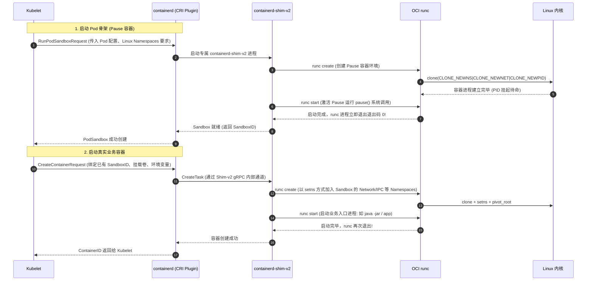
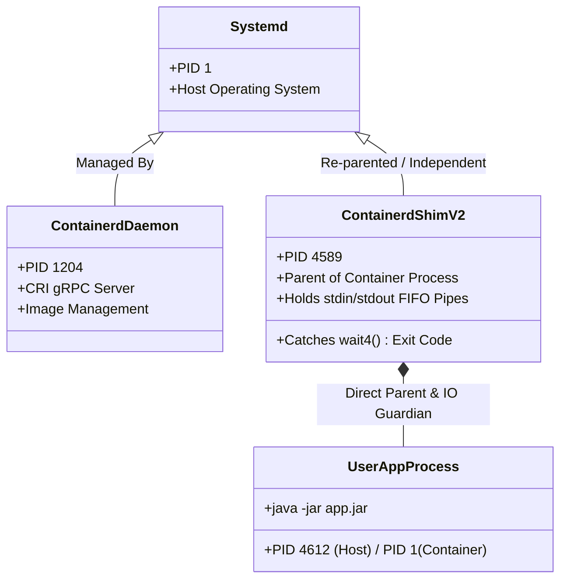
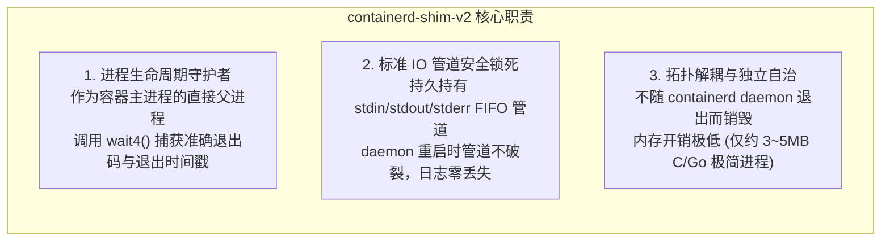
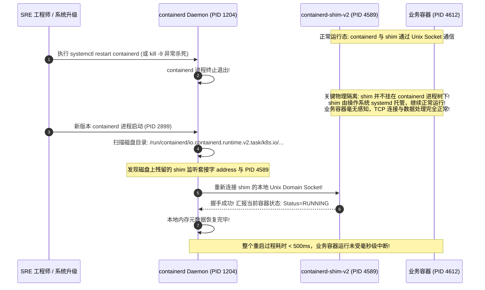
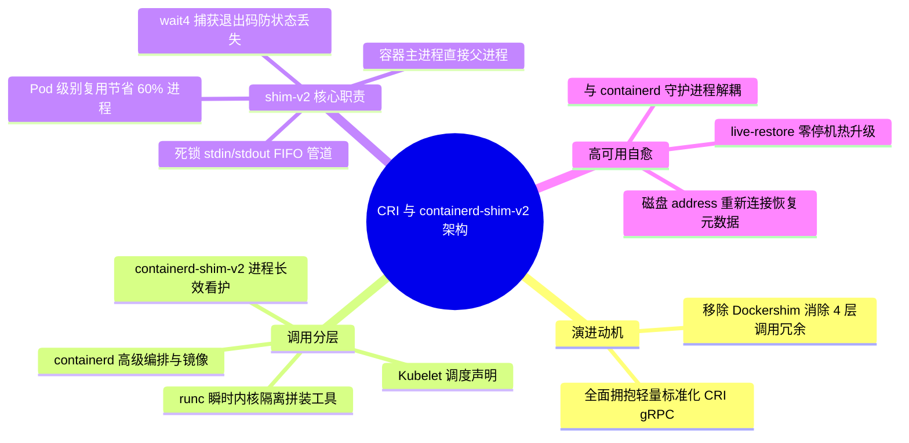

**TL;DR：** 许多工程师误以为 Kubernetes 放弃 Docker 是一次纯粹的生态政治站队，却忽略了其背后极其沉重的架构性能债务：早期 Kubelet 必须通过内置的 **Dockershim** 转换为 Docker HTTP API，再由 Docker Daemon 转换为 containerd，链路冗长且带来高额内存膨胀与延迟损耗。Kubernetes 制定 **CRI（Container Runtime Interface）gRPC 接口** 并剥离 Dockershim 后，直连标准的轻量运行时 **containerd**。在容器创建过程中，低级运行时 **runc** 仅负责调用内核系统调用拼装好 Namespaces 与 cgroups 后便立刻退出销毁；而真正默默常驻在后台、守护每个 Pod/容器的守护神是 **`containerd-shim-v2`**。它充当容器主进程的直接父进程，死锁住标准流 FIFO 管道并接管退出状态码。正是因为 shim 进程在操作系统层级与 containerd 守护进程彻底解耦脱钩，才使得生产节点在进行 containerd 核心升级或遭遇 Daemon 异常崩溃时，宿主机上的所有业务容器得以凭借 **`live-restore`** 机制毫发无损地持续运行。

---

## 一、 面试现场：从“Dockershim 彻底移除”到“shim 进程树存亡”的连环追问

```text
面试官提问：
  "Kubernetes 在 1.24 彻底移除了 Dockershim，现在主流生产集群都使用 containerd。
   请问当 Kubelet 启动一个 Pod 时，从 CRI 调用到业务进程跑起来，底层到底经历了哪几层调用？
   为什么每个 Pod 或容器都要单独拉起一个 containerd-shim-v2 进程？runc 执行完去哪了？
   如果线上某台物理机上的 containerd 守护进程被运维不小心 kill -9 强杀了，上面的业务容器会瞬间死亡吗？为什么？"
```

### 1.1 初级候选人的典型翻车点

在考察容器运行时与进程生命周期这一硬核考题时，初级候选人常暴露以下技术断层：
- **只会背政治口号，不懂架构链路**：以为废弃 Docker 只是因为 Docker 公司商业化变动，完全讲不出“Kubelet $\to$ Dockershim $\to$ Docker Daemon $\to$ containerd $\to$ runc”长达 4 层的调用冗余与内存开销；
- **分不清高级运行时与低级运行时**：把 containerd 和 runc 混为一谈，以为 containerd 直接去调用 Linux `clone(2)` 创建容器，不知道 OCI 规范定义了什么；
- **对 shim 进程的存在意义毫无概念**：在宿主机上执行 `ps aux | grep shim` 看到一堆 `containerd-shim-v2` 进程，误以为是无意义的垃圾残留进程，甚至以为杀掉 shim 容器依然能正常工作；
- **断言 Daemon 挂了容器必死**：认为“containerd 都被 kill -9 强杀了，容器肯定瞬间跟着挂掉”，完全不知道进程树解耦（re-parenting）与 `live-restore` 机制。

### 1.2 资深工程师的破局切入点

资深云原生架构师面对这一连串追问，能够以**“进程父子拓扑演进与生产零停机高可用”**为主线严密拆解：
1. **逆向推导 Dockershim 架构劣势**：Docker 引入了庞大的卷管理、网络、Swarm 等无关组件，API 转换链路导致节点 Pod 启停吞吐被卡死，切换为直连 CRI containerd 抹平了中间层；
2. **分层绘制容器创建物理调用链**：
   - 调度指令层：Kubelet 通过 Unix Domain Socket 向 containerd 发起 CRI gRPC（`RunPodSandbox` / `CreateContainer`）；
   - 编排控制层：containerd 派生出 `containerd-shim-v2` 进程；
   - 物理落地层：shim 调用低级运行时 CLI `runc create` 拼装 Namespaces/cgroups，业务进程拉起后 runc 闪电退出；
3. **揭秘 shim-v2 的三大不可替代物理职责**：
   - 充当容器主进程的父进程，调用 `wait4(2)` 回收子进程并捕获退出码；
   - 独占管理 stdin/stdout/stderr 的 FIFO 命名管道，解耦日志流；
   - 彻底解除业务进程与 containerd 主进程的生命周期强绑定；
4. **深入推导 `live-restore` 生产容灾状态机**：详细推演 containerd 重启后，如何根据宿主机 `/run/containerd/io.containerd.runtime.v2.task/...` 目录下的 Unix 套接字与 PID 记录，在几毫秒内重新接管存活的 shim 进程，实现真正的无损热升级。

### 1.3 容器运行时架构演进史：从巨石 Docker 到轻量 containerd

```mermaid
flowchart TB
    subgraph LegacyArch["旧版 Kubernetes (v1.24 之前): 冗长臃肿的 Dockershim 架构"]
        direction TB
        Klet1["Kubelet"] -->|CRI gRPC| DShim["Dockershim (内置于 Kubelet 源码中)"]
        DShim -->|HTTP REST API| DockerD["Docker Daemon (dockerd: 庞大的单体服务)"]
        DockerD -->|gRPC| Ctrd1["containerd"]
        Ctrd1 -->|系统调用| Runc1["runc"]
        Runc1 --> C1["业务容器进程"]
    end

    subgraph ModernArch["现代 Kubernetes (v1.24+ 生产标配): 极致轻量的纯 CRI 架构"]
        direction TB
        Klet2["Kubelet"] -->|CRI gRPC (/run/containerd/containerd.sock)| Ctrd2["containerd (唯一高级运行时)"]
        Ctrd2 -->|启动| Shim2["containerd-shim-v2 (每个 Pod 独立常驻)"]
        Shim2 -->|短命调用| Runc2["runc (创建完成后瞬时退出)"]
        Shim2 ==>|父子进程守护与 IO 管道| C2["业务容器进程"]
    end
```

在旧架构中，每一次 Pod 的启动或状态查询，都要在内存中跨越 3 种协议（gRPC、REST、Unix Socket）并经历 4 次序列化与反序列化，极大拖慢了集群调和吞吐。现代架构将链路精简到极致：**Kubelet 直接与 containerd 对话，containerd 专心负责镜像拉取与生命周期管理，底层彻底标准化。**

---

## 二、 CRI 规范解密：Kubelet 与 Runtime 的 gRPC 契约

Kubernetes 官方定义的 **CRI（Container Runtime Interface）** 是一套严密的 gRPC 协议，Kubelet 是客户端，运行时（如 containerd、CRI-O）是服务端。



CRI 接口规范清晰地拆分为两个独立的服务：
1. **`RuntimeService`**：负责生命周期管理，包括 `RunPodSandbox`、`StopPodSandbox`、`CreateContainer`、`StartContainer`、`StopContainer`、`Exec` 等；
2. **`ImageService`**：负责镜像操作，包括 `ListImages`、`PullImage`、`RemoveImage`、`ImageStatus`。

---

## 三、 OCI 规范与 runc 短暂的一生

在容器技术栈中，必须严格区分**高级运行时（High-Level Runtime）**与**低级运行时（Low-Level Runtime）**：

| 运行时级别 | 代表组件 | 核心物理职责 |
| --- | --- | --- |
| **高级运行时 (High-Level)** | `containerd`, `CRI-O` | 接收 CRI gRPC 请求、管理镜像下载解压、处理网络 CNI 挂载、管理存储卷、调度与看护容器进程 |
| **低级运行时 (Low-Level)** | `runc`, `crun`, `kata-containers` | 遵循 OCI Runtime Spec 规范，解析 `config.json`，直接调用 Linux 内核系统调用创建受限进程 |

### 3.1 runc 为什么不能一直活着？

`runc` 是由 Go 语言编写的轻量级 CLI 工具。
如果一个工作节点上运行了 500 个容器，若 `runc` 全程驻留后台：
1. **内存浪费巨甚**：每个 Go 编译的常驻进程至少消耗 15~30MB 内存，500 个容器仅守护进程就要吞噬 10GB 以上内存；
2. **系统调用开销**：常驻的高层进程若发生内存泄漏或 GC 抖动，会严重影响系统。

因此，**`runc` 被设计为一个瞬时命令（Ephemeral CLI Tool）**：
- `runc run <container-id>` 被调用；
- 它读取当前目录下的 `config.json`（由 containerd 生成的 OCI 标准配置文件）；
- 它调用 Linux 的 `clone(2)`、`unshare(2)`、`setns(2)`、`pivot_root(2)` 创建并配置好容器进程；
- **任务达成后，`runc` 进程立刻调用 `exit(0)` 自行销毁退出，生命周期仅有数十毫秒！**

但这立即引发了一个灾难性的操作系统物理难题：**runc 死了，新创建出来的容器主进程的父进程（Parent PID）是谁？**

---

## 四、 containerd-shim-v2 的物理职责与进程拓扑

如果让新创建的容器进程直接挂在操作系统 `PID 1`（systemd/init）之下，或者挂在 `containerd` 主进程之下，会引发严重后果：
1. **`PID 1` 孤儿回收危机**：若挂在 systemd 下，容器崩溃时其退出状态码（Exit Code）会被 systemd 自动回收，上层的 containerd 将永远无法精准捕获应用到底是 `0` 正常退出、`137` OOM 还是 `139` 段错误；
2. **Daemon 故障强耦合**：若挂在 containerd 下，一旦 containerd 守护进程升级或重启，操作系统内核会向其所有子进程发送 `SIGHUP` 信号，导致整台物理机上成百上千个业务容器在几秒内全军覆没！

为了从根本上解决这一物理断层，**`containerd-shim-v2`** 应运而生。



### 4.1 shim-v2 的三大核心物理使命



1. **退出状态码与信号转发（Exit Code Harvesting）**：
   shim 进程作为容器主进程的直接父进程，通过调用内核系统调用 `wait4(pid, &status, WNOHANG, &rusage)` 持续监听子进程退出。当业务进程终止时，shim 第一时间拿到退出码，并将其缓存在本地内存中，等待 containerd 随后拉取；
2. **标准输入输出管道守护（FIFO Holding）**：
   容器的日志采集与控制台交互依赖宿主机上的 FIFO 命名管道。如果直接接在 containerd 主进程上，containerd 一旦重启，FIFO 管道就会遭遇 `Broken Pipe`（管道破裂）并向容器抛出 `SIGPIPE` 导致应用闪退。shim 进程死死持有这些管道，充当了缓冲区护城河；
3. **一个 Pod 一个 Shim（Shim-v2 相比 Shim-v1 的革命）**：
   在早期的 shim-v1 中，每个容器都必须启动一个 shim 进程。如果一个 Pod 内有 Pause + 业务容器 + 2 个 Sidecar，一台机器就会多出 4 个 shim 进程。现代 **shim-v2 API** 实现了以 **Pod（Sandbox）为粒度复用**：同一个 Pod 内的所有容器共享同一个 `containerd-shim-v2` 进程，宿主机进程数直接减少 60% 以上！

---

## 五、 生产大考：containerd 守护进程崩溃或热升级，业务容器会死吗？

在生产运维中，SRE 最常面临的操作是**节点运行时补丁升级（如修复 containerd 高危 CVE 漏洞）**。
如果重启 containerd 会导致上面的所有业务 Pod 漂移重启，集群升级将是一场灾难。

### 5.1 守护神：`live-restore` 机制深度逆向

在 `/etc/containerd/config.toml` 中，有一条至关重要的生产配置项：
```toml
[plugins."io.containerd.grpc.v1.cri"]
  # 开启无损存活恢复
  [plugins."io.containerd.grpc.v1.cri".containerd]
    # 允许守护进程重启时不杀业务容器
```

当开启 `live-restore`（默认在现代 Kubernetes 发行版中均处于激活状态）后，containerd 的重启对业务容器是**完全零感知**的：



### 5.2 状态恢复的物理文件根基

containerd 在重启后，之所以能精准找回宿主机上的所有存活容器，依靠的是 Linux 运行目录 `/run/containerd/io.containerd.runtime.v2.task/` 下持久化的状态文件：

```text
/run/containerd/io.containerd.runtime.v2.task/k8s.io/
└── 4f7c8b2a19.../ (容器唯一 ID 目录)
    ├── address     # 记录该 shim 进程监听的 Unix Domain Socket 绝对路径
    ├── config.json # OCI 标准启动参数快照
    ├── init.pid    # 记录容器主进程在宿主机上的真实物理 PID
    ├── log.json    # shim 进程日志配置
    └── shim.pid    # 记录 containerd-shim-v2 自身的物理 PID
```

新启动的 containerd 进程只需要遍历这个目录，读取 `address` 文件并重新发起 `connect()`，即可与每一个正在看护容器的 `shim` 重新恢复心跳同步，实现了极致优雅的架构解耦。

---

## 六、 面试通关复盘与架构师高分回答模板



### 6.1 现场 2 分钟极速电梯演讲（高分答题模板）

> **面试官问：**“从 Docker 废弃到 containerd 时代，Pod 启动时 containerd-shim-v2 究竟在干什么？containerd 重启容器会挂吗？”

**高分应答结构（递进式穿透）：**

> “**第一层（架构演进与链路精简）：**
> Kubernetes 废弃 Dockershim 的核心驱动力是消除架构冗余。旧架构中 Kubelet 需要经过 Dockershim $\to$ Docker Daemon $\to$ containerd $\to$ runc 长达 4 级转换，内存与序列化开销巨大。现代 Kubernetes 通过标准的 **CRI（gRPC 接口）** 直接与 **containerd** 对话，分工明确：containerd 负责高层编排与镜像分发，底层由低级运行时负责容器落地。
>
> **第二层（runc 瞬时退出与 shim-v2 的三大物理职责）：**
> 在容器启动时，底层的 **runc** 只是一个短暂的 CLI 工具，它通过系统调用拼装完 Namespaces 和 cgroups 之后便立即调用 `exit(0)` 自行销毁，生命周期仅几十毫秒。如果直接让容器主进程挂在操作系统 PID 1 下，其退出码会被 systemd 吃掉，且标准 IO 管道会随着 daemon 重启而破裂。
> 因此，containerd 会在创建容器前先派生出 **`containerd-shim-v2`** 进程，充当容器进程的直接父进程：
> 1. **捕获状态码**：调用 `wait4()` 精准回收容器主进程并记录退出码；
> 2. **锁定 IO 管道**：持续持有 stdin/stdout/stderr FIFO 管道，避免向应用产生 `SIGPIPE`；
> 3. **Pod 级复用**：shim-v2 支持单 Pod 共享同一个 shim 实例，大幅降低操作系统进程数。
>
> **第三层（高可用解耦与 live-restore 生产热升级）：**
> shim 进程在 Linux 进程树上脱钩独立运行，不受 containerd 守护进程的生命周期制约。在配置了 `live-restore` 的生产集群中，即使 containerd 被 `kill -9` 强杀或执行二进制在线热升级，**宿主机上的业务容器绝对不会死亡**。新启动的 containerd 会通过扫描 `/run/containerd/...` 下保留的套接字地址文件，在毫秒级重新连回存活的 shim 进程恢复纳管，实现真正的零停机稳定性保障。”

### 6.2 生产面试关键避坑守则

1. **绝对不要混淆 containerd 与 runc 的职责**：containerd 是遵循 CRI 的高级运行时，不直接接触底层系统调用；runc 是遵循 OCI 的低级运行时，建完容器即刻退出；
2. **切记 shim-v2 是以 Pod 为单位复用的**：很多老工程师还停留在 Docker/shim-v1 时代，误以为一个容器配一个 shim。在现代 K8s 中，同一个 Pod 内的 Pause、主业务容器和 Sidecar 共享同一个 `containerd-shim-v2`；
3. **解释清楚 live-restore 的局限性**：虽然 containerd 重启不影响容器运行，但在重启期间，**节点无法响应新的 Pod 调度与创建请求**，因为 CRI gRPC 接口处于短暂中断状态；
4. **熟记排障关键路径**：排查容器启动假死或僵尸进程时，直接前往 `/run/containerd/io.containerd.runtime.v2.task/k8s.io/<id>/` 查看 `init.pid` 与 `shim.pid`，是体现一线硬核排障能力的杀手锏。

---

## 参考资料与权威规范

1. **Kubernetes Enhancement Proposal (KEP)**: *KEP-2221: Removal of Dockershim from kubelet* (enhancements.k8s.io).
2. **Open Container Initiative (OCI)**: *OCI Runtime Specification v1.0.2* (opencontainers.org).
3. **containerd Architecture Documentation**: *Containerd Shim v2 Architecture & Runtime Design* (github.com/containerd/containerd/blob/main/docs/).
4. **Linux Manual Pages**: `wait4(2)`, `pipe(7)`, `fifo(7)`, `clone(2)`.
5. **CRI Specification**: *Kubernetes Container Runtime Interface (CRI) proto definitions* (`k8s.io/cri-api/pkg/apis/runtime/v1/`).
