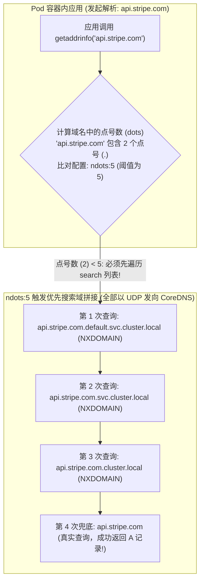
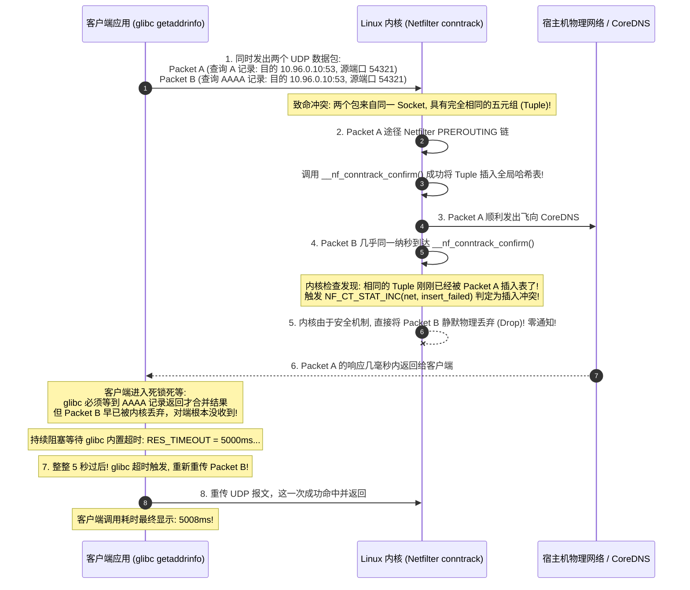
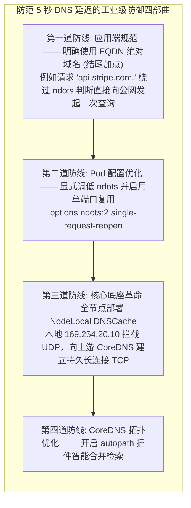
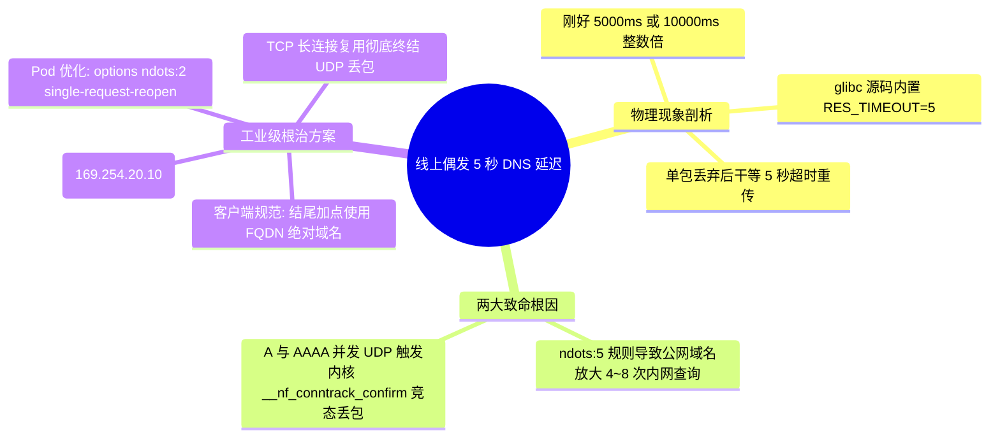

**TL;DR：** 在微服务全面上云后，许多团队在 Prometheus 延迟监控中会捕捉到一个幽灵般的现象：**原本耗时仅几毫秒的 HTTP/RPC 调用，会在长尾（P99/P999）指标中极具规律性地偶发飙升至整整 5 秒（5000ms）或 10 秒**。这绝非偶然，而是 **Kubernetes 的默认 DNS 配置与 Linux 内核网络协议栈在超高并发下遭遇的经典“双重暗礁”**。一方面，Pod 默认的 `/etc/resolv.conf` 配置了 `ndots:5`，导致只要请求的域名点号少于 5 个（如 `api.stripe.com` 仅 2 个点），glibc 解析器会强制先在 `default.svc.cluster.local` 等 4 个集群内部 search 域逐一尝试拼接并向 CoreDNS 狂发无效查询；另一方面，glibc 默认同时以 UDP 并发发起 IPv4（A 记录）与 IPv6（AAAA 记录）查询，这两个报文穿越内核 Netfilter 模块时，在 **`__nf_conntrack_confirm`** 阶段极易发生连接跟踪元组（Tuple）插入竞态，导致后到的数据包被内核**静默丢弃（Drop）**。由于 glibc 的 UDP 超时重传时间写死为 **5 秒**，直接导致了 5000ms 的长尾停顿。彻底根治该问题必须推行：应用末尾加点（FQDN）、Pod 调整 `ndots:2`、并部署 **NodeLocal DNSCache** 以本地 TCP 链路彻底终结内核竞态。

---

## 一、 面试现场：从“偶发 5000ms 延迟谜案”到“内核丢包竞态”的连环追问

```text
面试官提问：
  "线上 Java/Go 服务在调用第三方微信支付或阿里云接口时，P99 耗时偶尔会出现刚好 5000ms（或者 10000ms）的诡异尖刺，
   但抓包看应用本身处理只需 10ms，网络链路也是通的。
   为什么延迟刚好是 5 秒整数倍？这背后的底层物理根因到底在 glibc、CoreDNS 还是 Linux 内核？
   你在生产架构上是如何排查并彻底根治这一经典灾难的？"
```

### 1.1 初级候选人的典型翻车点

面对这一大厂 SRE 与高并发云原生架构师面试的“试金石”考题，初级候选人往往陷入以下误区：
- **只会甩锅给第三方接口或 CoreDNS“性能差”**：简单回答“CoreDNS 扛不住了，应该给 CoreDNS 扩容加副本”，但压测发现即便把 CoreDNS 扩到 100 核，5 秒毛刺依然顽固存在；
- **不知道“5 秒”这个神奇数字的操作系统出处**：误以为 5 秒是 Spring Cloud 或 Go http.Client 的默认超时，完全不知道这是 Linux glibc 解析器（`resolv.conf`）内置的 UDP 超时重传时间窗口；
- **看不懂 `ndots:5` 的放大灾难**：不知道为什么访问一个普通公网域名会在 CoreDNS 上产生 4~8 次无效解析，以为 Kubernetes 的 DNS 和普通物理机一模一样；
- **对内核 conntrack 竞态一无所知**：不知道 Linux 内核在处理同一 Socket 并发发送的 A 与 AAAA 报文时，Netfilter 会因为源端口和目的端口完全相同而引发冲突丢包。

### 1.2 资深工程师的破局切入点

资深架构师面对此类问题，能够从**“操作系统用户态解析器行为 $\to$ 内核连接跟踪协议栈 $\to$ 集群本地旁路架构”**三层递进深度破局：
1. **点明 5000ms 的物理溯源**：直接指出 Linux glibc 的 `res_send.c` 源码中默认宏定义 `RES_TIMEOUT = 5`（5 秒）。一旦首发 UDP 报文丢弃，客户端必须干等 5000ms 才会触发第一次重传；
2. **推导 `ndots:5` 的流量放大模型**：分析 Pod 内 `/etc/resolv.conf` 的拼接逻辑，解释为什么访问 `api.github.com` 会先疯狂查询 `api.github.com.default.svc.cluster.local` 等内网后缀，将集群 DNS 负载放大 500%；
3. **深入内核 Netfilter 连接跟踪竞态（The conntrack Race）**：
   - 拆解 A 记录与 AAAA 记录并发飞出；
   - 解释内核为两个包计算出相同的 conntrack tuple；
   - 揭秘首个包成功确认后，第二个包在 `__nf_conntrack_confirm()` 触发 `NF_CT_STAT_INC(net, insert_failed)` 并被内核静默物理丢弃；
4. **输出工业级生产治本方案**：不仅说明如何在应用层配置 FQDN 绝对域名，更系统讲解在每台 Node 节点以 DaemonSet 运行 **NodeLocal DNSCache**，利用虚 IP 169.254.20.10 本地就近解析、并将外部转发转为可靠 TCP 协议的终极架构。

---

## 二、 Linux glibc 域名解析与 ndots:5 放大灾难

每个进入 Kubernetes 的 Pod，Kubelet 都会自动在其容器内挂载一份 `/etc/resolv.conf`：

```text
nameserver 10.96.0.10
search default.svc.cluster.local svc.cluster.local cluster.local
options ndots:5
```



### 2.1 为什么 Kubernetes 默认将 `ndots` 设为 5？

`ndots` 的定义是：**当一个待解析域名中的点号（Dot）数量小于设定阈值时，解析器必须优先将其与 `search` 列表中的各个后缀拼接进行内网解析；只有当拼接全部返回 `NXDOMAIN`（域名不存在）或点号数量 $\ge ndots$ 时，才会直接按原样向外部 DNS 查询**。

Kubernetes 设立 `ndots:5` 的初衷是为了支持同集群内微服务的跨跨命名空间极简调用：
- 比如在 `default` 命名空间下调用 `orders.prod.svc.cluster.local`，由于包含 4 个点，需要 `ndots:5` 才能让开发人员简写为 `orders.prod`！
- **但付出的惨烈代价是**：公网上绝大多数 API 域名（如 `m.jd.com` 2 个点，`api.wechat.com` 2 个点，`gateway.alipay.com` 2 个点），全部由于点号数 $< 5$，在向外查询前必须在集群内部遭遇整整 3~4 次完全无意义的内网查询轮询！

如果再加上大多数现代应用运行时（Java、Node.js、cURL）会**并发查询 A 记录（IPv4）和 AAAA 记录（IPv6）**，一次普通的外网请求瞬间膨胀为 **$4 \times 2 = 8$ 次 UDP 数据包往返**，直接造成网络与 CoreDNS 的 8 倍洪峰放大！

---

## 三、 内核深水区：Netfilter conntrack 插入竞态与 5 秒丢包真相

如果仅仅是 8 次查询，在千兆局域网内虽然浪费 CPU，但耗时最多也只有几毫秒，断然不至于引起 5 秒停顿。
真正将请求拖入 5000ms 深渊的，是 **Linux 内核网络底层的连接跟踪表（conntrack）锁竞争机制**。



### 3.1 内核源码级根因剖析

在 Linux 内核 `net/netfilter/nf_conntrack_core.c` 中，当一个 UDP 数据包经过 SNAT/DNAT 并准备离开内核时，会调用 `__nf_conntrack_confirm` 函数：

```c
/* Linux 内核源码简化伪代码 */
int __nf_conntrack_confirm(struct sk_buff *skb) {
    // 1. 获取当前数据包的原始元组与响应元组
    struct nf_conntrack_tuple hash;
    // ...
    // 2. 加自旋锁检查全局连接跟踪表
    spin_lock_bh(&nf_conntrack_locks[hash]);
    if (!nf_ct_is_confirmed(ct)) {
        // 检查表中是否已经存在相同 tuple 的连接
        if (__nf_conntrack_find_get(net, zone, &tuple, hash)) {
            // 发生插入冲突！
            NF_CT_STAT_INC(net, insert_failed);
            spin_unlock_bh(&nf_conntrack_locks[hash]);
            return NF_DROP; // 直接丢弃数据包！
        }
        // 正常插入表
        __nf_conntrack_hash_insert(ct, hash, repl_hash);
    }
    spin_unlock_bh(&nf_conntrack_locks[hash]);
    return NF_ACCEPT;
}
```

- 由于应用层的多线程或 glibc 异步设计，A 记录和 AAAA 记录使用同一个 UDP Socket 在极短时间间隔（微秒级）内连续发出；
- 它们的五元组（源 IP、源 Port、目的 IP、目的 Port、协议 UDP）完全相同；
- 当内核处理 SNAT 或 DNAT 转换时，两个报文并发进入确认流程，后确认的报文因为检测到元组冲突，直接被内核执行 `NF_DROP` 丢弃；
- **UDP 是不可靠协议，内核不会返回任何 ICMP 差错报文；glibc 只能依靠自己的重传计时器硬等 5 秒，从而在监控曲线上划出一道道精准的 5000ms 尖刺！**

---

## 四、 工业级治本四部曲：从客户端调优到 NodeLocal DNSCache

要彻底消灭这令人窒息的 5 秒延迟，企业生产环境必须构筑分层防御体系。



### 4.1 方案 1：应用层使用 FQDN 绝对域名（最轻量零成本）
在微服务代码、配置文件或数据库连接串中，将所有外部依赖域名末尾显式追加一个英文句点 `.`：
```text
# 改造前 (触发 ndots 补全):
https://api.stripe.com/v1/charges

# 改造后 (FQDN 绝对域名，直接查公网，零内网无效查询):
https://api.stripe.com./v1/charges
```
解析器识别到末尾的 `.`，会判定该域名已经是绝对完整的全局域名，立即跳过所有 `search` 列表的拼接，一次命中！

### 4.2 方案 2：在 Pod Spec 中显式重写 DNS 配置
如果业务代码无法随意修改，可以在 Deployment YAML 中覆盖默认的 DNS 参数：
```yaml
spec:
  template:
    spec:
      dnsConfig:
        options:
        # 将阈值降为 2: 绝大多数常规域名直接访问公网，同 namespace 服务不受影响
        - name: ndots
          value: "2"
        # 强制 glibc 为 A 与 AAAA 记录使用不同的套接字端口，物理避开内核 conntrack 竞态
        - name: single-request-reopen
```
- `single-request-reopen`：告诉 glibc 在发送完 A 记录查询后，先关闭 Socket 重新打开一个分配了新源端口的 Socket 再发 AAAA 查询，彻底消除五元组相同导致的内核冲突；
- `ndots: 2`：只要域名包含 2 个以上的点（如 `api.wechat.com`），直接原样发起查询，消除了前 3 次内网无用查询。

### 4.3 方案 3：生产终极底座 —— 部署 NodeLocal DNSCache

上述客户端方案需要每个业务方配合改造，容易遗漏。**平台工程的最强终极解法，是在每台 Kubernetes 工作节点上部署 NodeLocal DNSCache**！

```mermaid
flowchart TD
    subgraph WorkerNode["Kubernetes 物理工作节点 (Worker Node)"]
        direction TB
        
        subgraph PodSandbox["业务容器 Pod"]
            App["业务微服务"]
        end

        subgraph LocalDNS["NodeLocal DNSCache (DaemonSet)"]
            NodeCache["node-local-dns (轻量级 CoreDNS 实例)<br/>监听本地虚拟网卡 IP: 169.254.20.10"]
            MemCache[("本地高频热点内存缓存")]
        end

        App -->|"1. 局域网 UDP 极速查询 (延迟 < 0.1ms / 永远不走宿主机物理网卡)"| NodeCache
        NodeCache <--> MemCache
    end

    subgraph ClusterPlane["集群核心控制面"]
        MasterCoreDNS["集群中心 CoreDNS 集群 (2~5 副本)"]
    end

    subgraph InternetDNS["公网递归 DNS (如 8.8.8.8 / 114.114.114.114)"]
        PublicDNS["公网 DNS 解析服务"]
    end

    NodeCache ==="2. 缓存未命中时: 强制采用可靠 TCP 协议复用长连接 (零丢包 / 彻底根绝 conntrack 竞态)"===> MasterCoreDNS
    MasterCoreDNS === InternetDNS
```

**NodeLocal DNSCache 的物理工作机制**：
1. 它以 DaemonSet 形式运行在每个节点上，在宿主机上创建一个特殊的虚拟哑接口（Dummy Interface），绑定高可用本地链路 IP：`169.254.20.10`；
2. Kubelet 将 Pod 的 DNS 地址自动指向本机的 `169.254.20.10`；
3. **消除本地丢包**：Pod 发给本机的 DNS 查询不跨物理网络，延迟低于 100 微秒，且 80% 以上的高频解析直接命中本机内存；
4. **终结 conntrack 竞态**：当本机缓存未命中时，`node-local-dns` 会与集群中心 CoreDNS 之间建立**长连接 TCP 通道**转发查询。**TCP 拥有内核 ACK 确认与可靠重传，且协议状态机完全避开了 UDP 的无状态 conntrack 插入冲突**，从根源上将 5 秒延迟彻底归零！

---

## 五、 CoreDNS 生产容量规划与监控告警

除了协议层面的竞态之外，在大规模集群中，还必须防范 CoreDNS 自身被瞬间打爆引发的超时。

### 5.1 生产级 Prometheus 监控签名
当线上出现疑似 DNS 延迟与故障时，必须在 Grafana 中直接观察以下关键指标：

```promql
# 1. 监控 DNS 请求延迟分布 (重点排查 > 4s 的长尾毛刺)
histogram_quantile(0.99, sum(rate(coredns_dns_request_duration_seconds_bucket[5m])) by (le))

# 2. 监控各类型错误码占比 (关注 SERVFAIL 与 NXDOMAIN 激增)
sum(rate(coredns_dns_responses_total{rcode=~"SERVFAIL|NXDOMAIN"}[5m])) by (rcode)

# 3. 监控 Linux 宿主机内核因为连接跟踪表满而丢弃数据包的计数
rate(node_netfilter_conntrack_events_total{type="drop"}[5m])
```

---

## 六、 面试通关复盘与架构师高分回答模板



### 6.1 现场 2 分钟极速电梯演讲（高分答题模板）

> **面试官问：**“线上服务偶发遭遇整整 5 秒 DNS 延迟尖刺，怎么排查和彻底根治？”

**高分应答结构（递进式穿透）：**

> “**第一层（5 秒物理根因与 glibc 超时常数）：**
> 5000ms（或 10000ms）是一个极其特殊的数字，它的物理源头是 Linux glibc 解析器（`res_send.c`）中写死的宏定义 `RES_TIMEOUT = 5`（5 秒）。一旦客户端发出的 DNS UDP 查询报文在网络链路或操作系统内核中被丢弃，glibc 不会立刻重试，而是必须严格挂起等待 5 秒超时后才触发下一次重发。
>
> **第二层（ndots:5 放大与内核 conntrack 竞态）：**
> 导致丢包的物理机制来自于 Kubernetes 与 Linux 内核在超高并发下的两个交织陷阱：
> 1. **`ndots:5` 的放大灾难**：Pod 默认配置了 `ndots:5`，当微服务请求公网域名（如 `api.stripe.com` 仅 2 个点）时，解析器会先将其与 `default.svc.cluster.local` 等 4 个集群内部后缀强行拼接，向 CoreDNS 发送大量无意义的内网查询，瞬间将 DNS 流量放大数倍；
> 2. **Netfilter conntrack 插入竞态**：应用并发查询 A 记录（IPv4）和 AAAA 记录（IPv6）时，由同一个 Socket 同时发出的两个 UDP 报文具有完全相同的五元组。它们穿过 Linux 内核 Netfilter 模块执行 `__nf_conntrack_confirm()` 时，后到的报文因元组冲突触发 `insert_failed`，被内核**静默直接丢弃（Drop）**，造成客户端 5 秒重传。
>
> **第三层（生产体系化治本闭环）：**
> 彻底解决该问题不能只靠扩容 CoreDNS，必须实施三级防御架构：
> 1. **研发侧**：在外部 API 域名后显式追加根点（如 `api.stripe.com.` 成为 FQDN 绝对域名），绕过 ndots 内网补全；
> 2. **部署侧**：在 Deployment 中注入 `options ndots:2 single-request-reopen`，降低补全门槛并强制为 A/AAAA 分配独立端口消除内核元组碰撞；
> 3. **架构终局底座**：全集群以 DaemonSet 落地 **NodeLocal DNSCache**。通过虚 IP `169.254.20.10` 实现本地微秒级内存缓存，缓存未命中时使用 **TCP 长连接复用** 向上游 CoreDNS 转发，从网络协议栈物理层彻底终结 UDP 丢包与 5 秒毛刺。”

### 6.2 生产面试关键避坑守则

1. **绝对不要只回答“CoreDNS 性能不足需要扩容”**：5 秒毛刺是内核级丢包与 glibc 超时机制导致的，盲目给 CoreDNS 加 CPU 副本无法解决单机内的 conntrack 竞态；
2. **切记区分 A 记录与 AAAA 记录**：很多候选人不知道为什么会发出两条请求，必须点出多数现代语言（Java/Go/Node）默认双栈解析，并发发包是触发内核 tuple 冲突的直接诱因；
3. **解释清楚 NodeLocal DNSCache 为什么必须用 TCP**：如果 NodeLocal DNSCache 向上游依旧用 UDP 转发，跨节点的链路依然有微小的丢包可能；只有配置 `forward . /etc/resolv.conf { force_tcp }` 强制走 TCP，才能做到 100% 免疫；
4. **警惕 `options single-request-reopen` 在不同发行版中的支持度**：Alpine Linux（基于 musl libc）在早期版本并不支持该参数，在基于 Alpine 构建的基础镜像中需优先依赖 NodeLocal DNSCache。

---

## 参考资料与权威规范

1. **Linux Glibc Resolver Source Code**: *res_send.c RES_TIMEOUT specification* (sourceware.org/git/glibc.git).
2. **Weaveworks Engineering Blog**: *Racy conntrack and DNS lookup timeouts* (weave.works/blog/racy-conntrack-and-dns-lookup-timeouts).
3. **Kubernetes Official Guidance**: *Using NodeLocal DNSCache in Kubernetes Clusters* (kubernetes.io/docs/tasks/administer-cluster/nodelocaldns/).
4. **Linux Kernel Documentation**: *Netfilter Connection Tracking Architecture* (`Documentation/networking/nf_conntrack-sysctl.rst`).
5. **RFC 1035**: *Domain Names - Implementation and Specification* (datatracker.ietf.org/doc/html/rfc1035).
