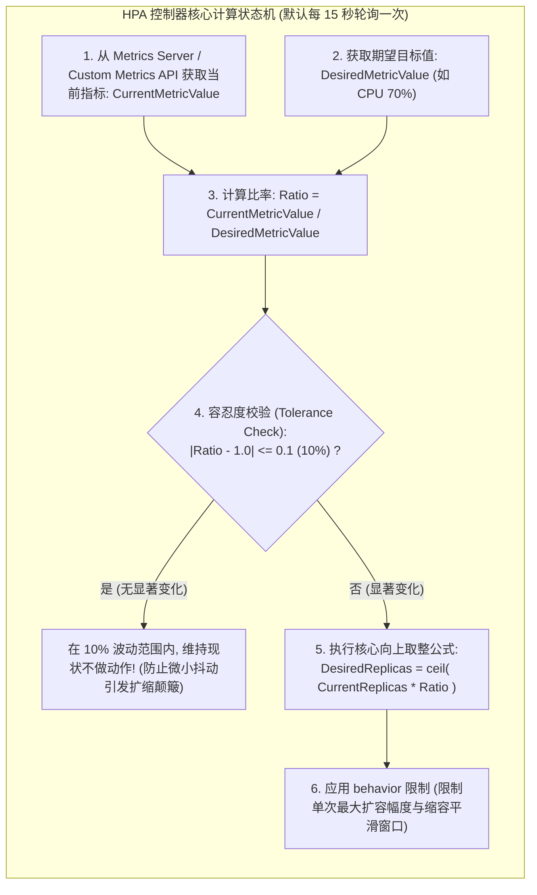
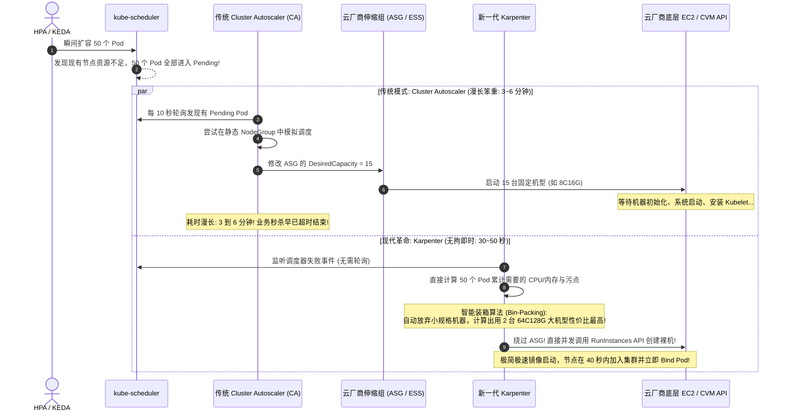
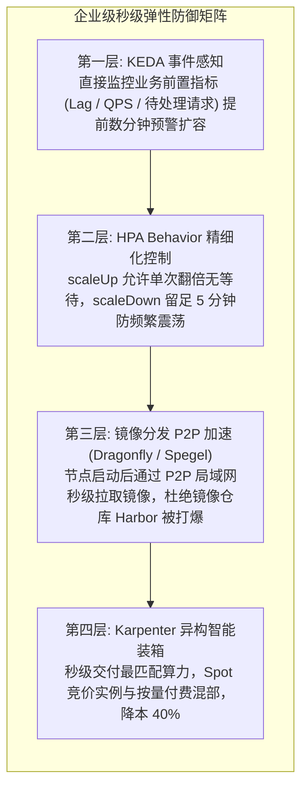
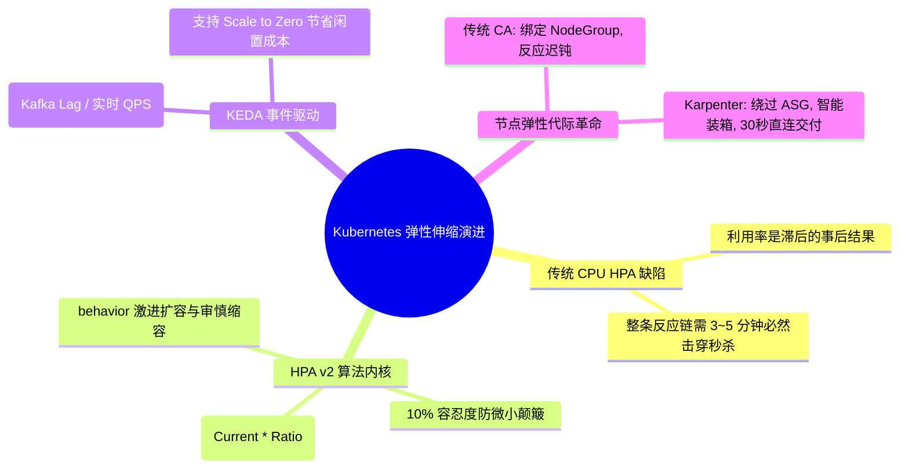

**TL;DR：** 许多工程师认为只要给微服务配置了 `HorizontalPodAutoscaler`（HPA）就能轻松抗住突发业务峰值，但在现实生产中，**突发大促秒杀或消息队列瞬时堆积时，基于 CPU/内存利用率的传统 HPA 几乎必然导致服务雪崩**。其物理根因在于**利用率是指标的“滞后结果”而非“前置原因”**：从流量涌入、CPU 升高、Metrics-Server 周期性拉取、HPA 算法计算出期望副本、发起创建 Pod，再到新容器拉取镜像、冷启动与就绪探针通过，整条物理链路耗时往往长达 **3~5 分钟**，而此时数据库和现有 Pod 早已被瞬时洪峰彻底打穿。更严重的是，当新 Pod 扩出来却因集群算力不足陷入 **Pending** 时，传统的 **Cluster Autoscaler（CA）** 依赖云厂商僵化的弹性伸缩组（ASG）拉起整机，扩容极其迟钝。彻底打破这一僵局的现代云原生架构是**“KEDA 事件驱动前置弹性 + Karpenter 即时异构装箱交付”**：KEDA 依据消息队列 Lag、QPS 等业务指标在流量击穿前主动拉起算力，支持从 0 到 1 的秒级弹性；Karpenter 则彻底摒弃 NodeGroup 概念，根据待调度 Pod 的硬性拓扑与算力需求，直接调用云 API 毫秒级生成最优性价比的异构节点组合并执行智能压缩。

---

## 一、 面试现场：从“CPU HPA 秒杀被击穿”到“秒级事件弹性”的连环追问

```text
面试官提问：
  "线上微服务配置了 HPA（Target CPU 70%，最小 5 副本，最大 50 副本）。
   但在突发大促秒杀打压的那一瞬间，整个服务接口依然发生了全链路超时崩溃，为什么？
   HPA v2 计算期望副本数的底层数学公式是什么？为什么它有严重的滞后性？
   如果 Pod 扩容出来后由于节点资源不足进入 Pending，传统 Cluster Autoscaler 与新一代 Karpenter 在节点交付效率上有何本质区别？"
```

### 1.1 初级候选人的典型翻车点

在弹性伸缩与容量规划的系统设计中，初级候选人常暴露以下经验盲区：
- **把“后验指标”当成“先验信号”**：以为只要 CPU 达到 70% 就会立刻自动弹上去，完全没有意识到 CPU 升高到能够被控制器采集到需要时间，流量瞬间涌入时老 Pod 早已不堪重负触发健康探针失败被杀；
- **答不出 HPA 核心数学公式与防抖机理**：不知道 HPA 是如何根据当前实际值与期望值计算副本数的，不知道容忍度（Tolerance 10%）与缩容冷却窗口（Stabilization Window）的防颠簸算法；
- **不知道“Pod 扩容成功”与“能接流量”是两码事**：忽略了 Java/Go 应用自身冷启动（如 JVM 类加载、Spring 容器初始化、本地缓存预热）所需的数十秒时间，误以为创建 Pod 就等于能抗流量；
- **对节点弹性层一无所知**：只知道应用层 HPA，当面试官追问“宿主机没 CPU 资源了怎么办”时，只能含糊回答“云厂商会自动加机器”，说不清 Cluster Autoscaler 为什么需要 5 分钟以及它是如何与云厂商 ASG 交互的。

### 1.2 资深工程师的破局切入点

资深平台架构师面对此类大促高可用设计考题，能够从**“时间线物理滞后推导 $\to$ HPA 数学状态机 $\to$ KEDA 业务前置弹性 $\to$ Karpenter 即时装箱”**层层穿透：
1. **绘制秒杀崩溃时间线**：精确拆解传统 HPA 在指标采集（15s）、HPA 对账（15s）、节点申请（180s）、容器冷启动（60s）中的累积物理延迟（3~5 分钟），证明基于 CPU/内存利用率的伸缩在秒级突发场景下必然失效；
2. **手推 HPA 核心数学模型**：
   $$\text{DesiredReplicas} = \left\lceil \text{CurrentReplicas} \times \frac{\text{CurrentMetricValue}}{\text{DesiredMetricValue}} \right\rceil$$
   剖析 `behavior.scaleUp`（激进倍增）与 `behavior.scaleDown`（平滑冷却）策略对避免频繁震荡的控制学价值；
3. **架构升级：KEDA 事件驱动前置化**：将伸缩指标从“滞后的系统资源”升级为“前置的业务信号”（如 Kafka Consumer Group Lag、RabbitMQ 堆积量、网关实时 Ingress QPS），并在流量真正进入业务前完成算力预热与 Scale to Zero；
4. **底层破局：Karpenter 颠覆性即时交付**：
   - 对比 Cluster Autoscaler（受限于 NodeGroup 静态模板，多轮调度评估，耗时数分钟）；
   - 剖析 Karpenter（直接监听 Pending Pod，绕过 NodeGroup，动态匹配数百种 EC2/物理机规格，毫秒级直接调用云底层 API 交付最优算力，并具备 Consolidation 缩容自动装箱削减 40% 成本）。

---

## 二、 HPA v2 算法内核与防抖动状态机

Kubernetes 控制面中的 `HorizontalPodAutoscaler` 由 `kube-controller-manager` 中的 HPA 控制器驱动。



### 2.1 核心数学公式深度推导

HPA 的期望副本数计算严格遵循公式：

$$\text{DesiredReplicas} = \left\lceil \text{CurrentReplicas} \times \frac{\text{CurrentMetricValue}}{\text{DesiredMetricValue}} \right\rceil$$

**实战案例推演**：
- 假设当前有 4 个 Pod（`CurrentReplicas = 4`）；
- 目标 CPU 为 50%（`DesiredMetricValue = 50%`）；
- 突发流量涌入，当前平均 CPU 飙升至 85%（`CurrentMetricValue = 85%`）；
- 计算比率：$\frac{85}{50} = 1.7$；
- 期望副本数：$\lceil 4 \times 1.7 \rceil = \lceil 6.8 \rceil = 7$。HPA 控制器立即将 Deployment 副本数更新为 7。

### 2.2 生产级防颠簸：Behavior 行为控制

在没有限制的情况下，若指标急剧下跌，HPA 可能会在下一秒将 100 个副本瞬间缩容到 5 个，紧接着下一波流量又把它打死，这称为**“系统震荡（Thrashing）”**。

Kubernetes 引入了精细化的 `behavior` 配置，打造了**“激进扩容、极度审慎缩容”**的生产标准模板：

```yaml
apiVersion: autoscaling/v2
kind: HorizontalPodAutoscaler
metadata:
  name: order-service-hpa
spec:
  scaleTargetRef:
    apiVersion: apps/v1
    kind: Deployment
    name: order-service
  minReplicas: 5
  maxReplicas: 100
  metrics:
  - type: Resource
    resource:
      name: cpu
      target:
        type: Utilization
        averageUtilization: 70
  behavior:
    # 扩容策略: 极度激进，允许秒级翻倍
    scaleUp:
      stabilizationWindowSeconds: 0 # 扩容无需等待观察，立即生效
      policies:
      - type: Percent
        value: 100 # 允许单次直接增加 100% (翻倍)
        periodSeconds: 15
      - type: Pods
        value: 10 # 允许至少增加 10 个 Pod
        periodSeconds: 15
      selectPolicy: Max # 选择扩容幅度最大的策略执行
    # 缩容策略: 极度审慎，5 分钟冷静观察
    scaleDown:
      stabilizationWindowSeconds: 300 # 必须持续 5 分钟低负载才允许缩容
      policies:
      - type: Percent
        value: 10 # 每分钟最多缩容 10% 副本
        periodSeconds: 60
```

---

## 三、 KEDA 事件驱动弹性：将业务指标前置

即使配置了激进的 HPA，**基于系统利用率的伸缩本质上仍是“事后诸葛亮”**。
以消息消费服务为例：Kafka 中如果突然涌入了 100 万条订单消息，但在消费者还没开始消费前，消费者的 CPU 利用率是 **0%**！等到消费者一条条拉取把 CPU 打满到 100% 时，消息早已严重超时堆积。

**KEDA（Kubernetes Event-driven Autoscaling）彻底改变了这一逻辑：它将伸缩的触发源从“滞后的资源监控”前置为“实时的事件源”**。

```mermaid
flowchart LR
    subgraph EventSources["外部事件源 (Event Sources)"]
        Kafka[("Kafka 集群: 订单主题<br/>Consumer Group Lag: 150,000 条")]
        RabbitMQ[("RabbitMQ 队列深度: 50,000")]
        Prometheus[("Prometheus 实时 QPS: 12,000")]
    end

    subgraph KEDAController["KEDA 核心弹性引擎"]
        direction TB
        KedaOperator["keda-operator (事件监听与 CRD 控制器)"]
        MetricsAdapter["keda-metrics-apiserver (注册外部指标路由)"]
        KedaOperator <--> MetricsAdapter
    end

    subgraph K8sControlPlane["Kubernetes 控制面"]
        HPAControl["HPA 控制器"]
        Dep["业务 Deployment"]
    end

    EventSources == "1. 实时拉取事件深度 (Lag/Depth)" ==> KedaOperator
    MetricsAdapter == "2. 暴露 Custom Metrics API" ==> HPAControl
    HPAControl == "3. 毫秒级根据 Lag 扩缩容" ==> Dep
    Dep == "4. 极速从 0 唤醒并扩至 50 副本" ==> Workers["消费 Worker 集群"]
```



### 3.1 零副本极速唤醒（Scale to Zero）

传统 HPA 的 `minReplicas` 最低只能设置为 1。对于内部批处理、异步导出、离线转换任务，平时 0 流量时依然必须常驻 1 个 Pod 浪费算力。
KEDA 具备 **Scale to Zero** 的杀手级能力：
- 平时消息队列为空时，KEDA 将 Deployment 的副本数缩容为 **0**，完全不占任何内存与 CPU；
- 一旦 Kafka 中产生第 1 条消息（`Lag > 0`），KEDA 立即拦截事件并瞬间将副本从 0 激活拉起到 1；
- 随后将控制权交由标准 HPA 机制，根据每 1 个 Pod 负责 1000 条 Lag 的阈值自动弹性扩容至最大副本数。

---

## 四、 节点级弹性大考：Cluster Autoscaler vs Karpenter

当应用层通过 HPA 或 KEDA 成功发出了扩容 50 个 Pod 的指令后，生产环境中往往立刻遭遇最致命的**二级瓶颈：物理集群资源耗尽，新 Pod 全部处于 `Pending` 状态！**

此时，必须依赖节点自动扩缩容引擎向公有云（AWS、阿里云、腾讯云）申请物理机/虚拟机。



### 4.1 传统 Cluster Autoscaler（CA）与 Karpenter 核心对比矩阵

| 架构维度 | 传统 Cluster Autoscaler (CA) | 新一代 Karpenter (现代化推荐) |
| --- | --- | --- |
| **底层节点管理模型** | 必须绑定云厂商 **NodeGroup / ASG** 静态模板 | **彻底摆脱 NodeGroup**，面向 Pod 需求动态声明 |
| **机型决策能力** | 只能按 NodeGroup 预设的单一机型扩容，易产生算力碎片 | 智能装箱（Bin-Packing），在几百种机型中自动选**最省钱最优解** |
| **扩容响应时延** | 轮询机制 + ASG 伸缩，耗时通常 **3 ~ 6 分钟** | 事件监听 + 云底层 API 直连，耗时通常 **30 ~ 50 秒** |
| **弹性缩容与重排** | 只能删除完全空闲的节点，无法跨节点搬迁碎片 | **Consolidation（主动压缩）**：主动腾挪 Pod 并将大机型降配变小 |
| **异构算力（GPU/ARM）** | 需要为 GPU、ARM、不同可用区分别建立几十个 NodeGroup | 单一 `NodePool` 统一声明，全自动跨 AZ 与跨架构自适应 |

---

## 五、 生产级全链路秒级弹性架构实战

为了在生产大促或突发流量中做到真正万无一失，企业云原生平台团队应当构建 **“KEDA 业务前置 + HPA 激进扩张 + 镜像预拉取 + Karpenter 即时装箱”** 的四重防御矩阵。



---

## 六、 面试通关复盘与架构师高分回答模板



### 6.1 现场 2 分钟极速电梯演讲（高分答题模板）

> **面试官问：**“CPU/内存 HPA 为什么无法应对秒杀突发？KEDA 与 Karpenter 是如何实现秒级弹性与即时交付的？”

**高分应答结构（递进式穿透）：**

> “**第一层（传统利用率 HPA 的物理滞后性）：**
> 传统基于 CPU/内存利用率的 HPA 在秒杀大促场景下必然失效，因为资源利用率是典型的**事后滞后指标**。从瞬时流量涌入、CPU 升高、Metrics-Server 周期性轮询采集、HPA 算法计算出期望副本，再到拉起新容器和等待就绪探针通过，整条物理链路耗时高达 **3~5 分钟**。而在流量到来的前 30 秒内，现有 Pod 早已因队列打满而触发限流崩溃。
>
> **第二层（HPA v2 算法与 KEDA 事件驱动前置化）：**
> 1. **HPA 核心公式**：基于 $\text{DesiredReplicas} = \lceil \text{CurrentReplicas} \times \frac{\text{CurrentMetricValue}}{\text{DesiredMetricValue}} \rceil$ 向上取整计算，并通过 `behavior` 策略配置‘扩容立即生效、缩容 5 分钟冷静观察’以防止系统频繁震荡；
> 2. **KEDA 架构革命**：将弹性指标从‘事后资源’前置为‘业务原因’。KEDA 直接对接 Kafka Lag、RabbitMQ 队列深度或实时网关 QPS。在消息堆积但 CPU 还没升高的毫秒级瞬间，KEDA 就能提前发出扩容指令，并原生支持 **Scale to Zero**，极大压降空闲成本。
>
> **第三层（节点弹性代际突破：CA vs Karpenter）：**
> 当 Pod 扩容超出集群容量陷入 Pending 时：
> 1. **传统 Cluster Autoscaler** 依赖云厂商的 NodeGroup 与 ASG 静态模板，机型固定、评估链路长，新节点交付需要 3~6 分钟；
> 2. **新一代 Karpenter** 彻底摆脱 NodeGroup 束缚。它直接监听 Pending Pod 的实际资源请求、拓扑分布与亲和性，通过**智能装箱算法（Bin-Packing）**直接在云厂商数百种机型中挑出性价比最优的规格组合，绕过 ASG 直接调用云 API 直连拉起，**将节点交付时间压缩至 40 秒以内**，并具备 Consolidation 自动碎片重排缩容能力，构成了现代云原生秒级弹性的终局架构。”

### 6.2 生产面试关键避坑守则

1. **绝对不要说“HPA 扩容时可以瞬间拉起 1000 个 Pod”**：必须点明 API Server 的并发限流、Harbor 镜像仓库的带宽瓶颈、以及宿主机节点 CNI 分配 IP 的串行锁。不配置 P2P 镜像加速（如 Dragonfly）的超大规模并发拉取会瞬间打垮容器镜像仓库；
2. **切记配置应用 Readiness 就绪探针**：若没有就绪探针，Pod 一启动就会被 EndpointSlice 挂上 Service 承接流量，此时应用内部连接池和缓存尚未建立完毕，新来的流量会直接遇到 502/连接重置；
3. **解释清楚 Karpenter 与 Cluster Autoscaler 的本质区别**：核心是‘声明式驱动计算机型’ vs ‘被动触发云厂商 ASG 模板扩容’；
4. **澄清指标容忍度（Tolerance）**：HPA 默认具备 10%（0.1）的死区容忍。若利用率从 70% 波动到 74%，HPA 是不会触发任何扩容的，必须知道这一避震防抖设计的存在。

---

## 参考资料与权威规范

1. **Kubernetes Official Documentation**: *Horizontal Pod Autoscaler & Algorithm Details* (kubernetes.io/docs/tasks/run-application/horizontal-pod-autoscale/).
2. **KEDA (Kubernetes Event-driven Autoscaling) 官方规范**: *KEDA Architecture, Scalers, and Specification* (keda.sh/docs/).
3. **Karpenter Documentation**: *Karpenter Architecture, NodePools, and Consolidation* (karpenter.sh/docs/).
4. **Kubernetes Autoscaling SIG**: *Cluster Autoscaler Design and FAQ* (github.com/kubernetes/autoscaler).
5. **ACM Symposium on Cloud Computing**: *Resource Autonomics in Cloud Orchestration Frameworks* (2022).
