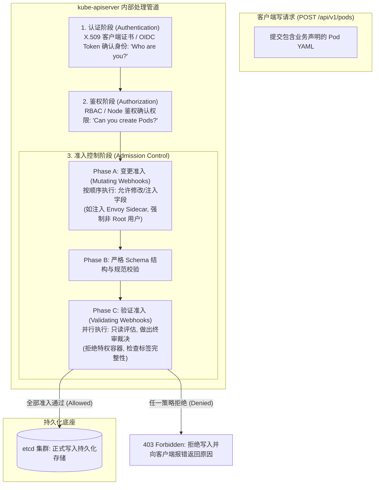
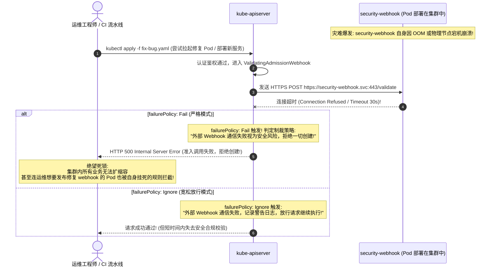
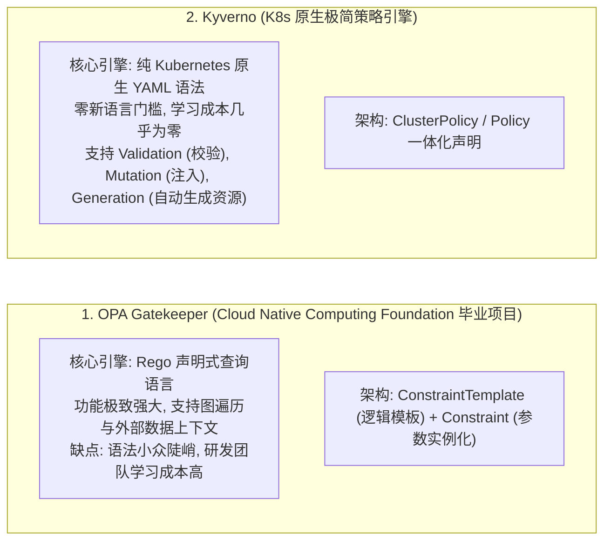
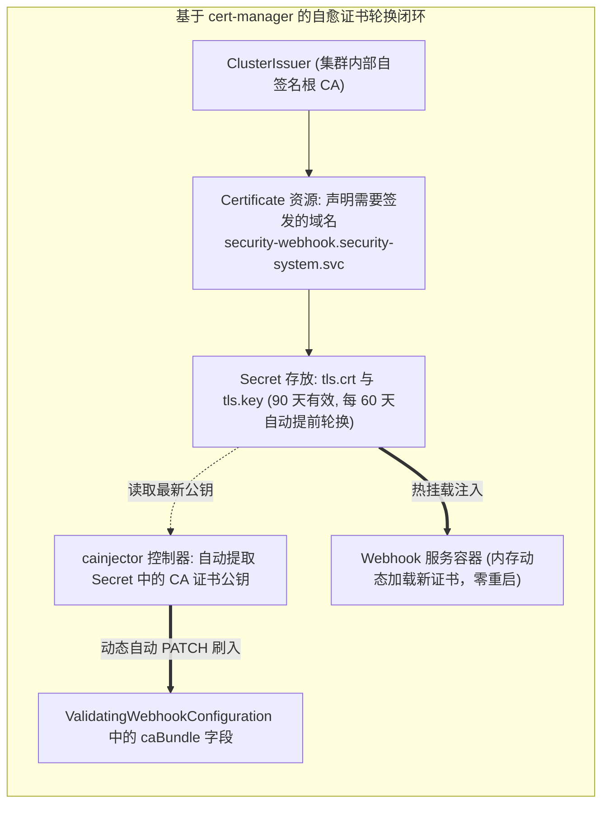
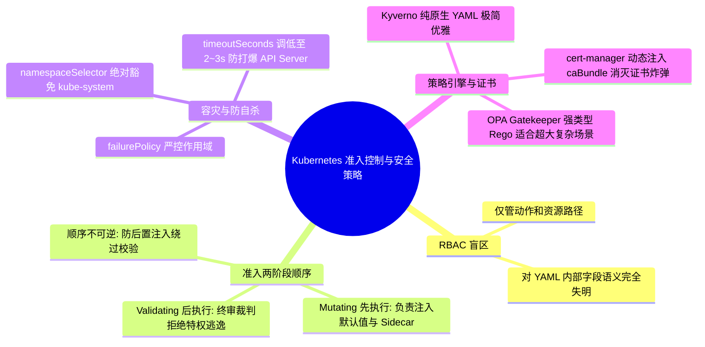

**TL;DR：** 许多安全团队误以为配置了细粒度的 **RBAC（基于角色的访问控制）** 就能高枕无忧，却在安全审计时惊恐地发现：**研发人员只要拥有向特定命名空间创建 Pod 的权限，就能随意提交包含 `privileged: true`、挂载宿主机根目录 `/`、甚至共享宿主机 `hostPID/hostNetwork` 的高危特权容器**。RBAC 只能管控“谁能对哪种资源执行什么动词（Who can do What）”，但对 YAML 内部具体的字段内容与业务语义**完全失明**。捍卫集群合规防线的终极护城河是 **Admission Webhook（准入控制 Webhook）**。API Server 严格遵循两阶段流水线：先由 **Mutating Webhook** 执行字段默认值补齐或 Sidecar 动态注入；再经由 **Validating Webhook** 执行终审拦截。然而，Webhook 的引入也打开了巨大的可用性单点风险：一旦 Webhook 服务发生网络闪断或自身崩溃，配置了 `failurePolicy: Fail` 的集群将瞬间陷入**“无法创建任何 Pod、连修复自身的救灾 Pod 也被自己挂死拦截”**的死锁深渊。科学的解法是利用 `namespaceSelector` 严格排除核心系统空间、使用 `cert-manager` 彻底消灭证书过期炸弹，并选用如 **OPA Gatekeeper** 或 **Kyverno** 构筑开箱即用的声明式策略防火墙。

---

## 一、 面试现场：从“生产被偷渡特权容器”到“Webhook 宕机引发瘫痪”的连环追问

```text
面试官提问：
  "我们在生产集群配置了严格的 RBAC，只给研发开放了特定命名空间的 Pod 创建权限。
   为什么依然无法阻止有人在 YAML 里写 privileged: true 逃逸提权？
   kube-apiserver 的 Mutating 与 Validating Webhook 是怎么协作拦截的？为什么两者的执行顺序绝对不能颠倒？
   如果你们线上部署的自定义准入 Webhook 自身突发崩溃或网络超时，会导致整个集群所有 Pod 都无法创建吗？如何设计高可用兜底？"
```

### 1.1 初级候选人的典型翻车点

在考察云原生安全架构与高可用容灾的硬核面试中，初级候选人常暴露以下技术断层：
- **混淆 RBAC 鉴权与 Admission 准入控制的边界**：以为 RBAC 能够检查“某个字段的值是不是 true”，完全不知道 RBAC 只能在 URL 路径维度校验资源类型（如 `api/v1/namespaces/default/pods`），对请求体的 JSON/YAML 内部字段毫无感知能力；
- **分不清 Mutating 与 Validating 的时序必然性**：误以为两个 Webhook 是并行执行的，无法解释为什么如果先跑 Validating 再跑 Mutating，会被恶意客户端利用后置注入绕过安全检查；
- **对 `failurePolicy` 的灾难性后果缺乏实战敬畏**：只知道设置 `failurePolicy: Fail`（严格拦截），完全没有意识到当 Webhook 自身宕机时，整个集群将拒绝一切写请求，甚至连运维想要部署救灾修复 Pod 时也会被挂掉的 Webhook 自杀式拦截；
- **不知道 Webhook 依赖 TLS 握手且证书会过期**：不知道 API Server 强制要求 Webhook 服务必须开启 HTTPS 且校验 `caBundle`，许多团队在生产运行 1 年后因为自签名证书到期导致集群瞬间只读瘫痪。

### 1.2 资深工程师的破局切入点

资深云原生安全架构师面对这一连串追问，能够以**“请求准入物理管道 $\to$ 顺序因果律 $\to$ 生产自杀防御与策略引擎”**层层递进深度破局：
1. **揭秘安全失控根因**：RBAC 仅负责“身份与粗粒度资源准入（Subject-Verb-Resource）”，对象内部字段的合规性必须由准入控制器（Admission Controller）终审；
2. **绘制 API Server 核心准入管道时序图**：
   - Phase 1: 严格串行执行 Mutating Webhooks（支持自动注入 Sidecar、默认加上非 Root 用户安全上下文）；
   - Phase 2: Schema 结构校验；
   - Phase 3: 并行执行 Validating Webhooks（终审裁判，严禁修改任何数据，只出 `Allowed` 或 `Denied` 判决）；
3. **推导为什么顺序不可颠倒**：若先验证后修改，Mutating 注入的代码可能会推翻 Validating 的安全断言（如注入了一个有安全漏洞的未审查镜像），因此 Mutating 产生的新对象必须再次经过完整的 Validating 审判；
4. **设计“零死锁”生产级容灾逃生通道**：
   - 科学配置 `failurePolicy: Fail` 仅针对核心业务命名空间；
   - 核心系统空间强制通过 `namespaceSelector`（如 `kubernetes.io/metadata.name: kube-system`）绝对豁免；
   - 配置合理且短暂的 `timeoutSeconds: 3`，防止 API Server 线程池被卡死拖垮；
5. **策略引擎工业化落地**：深度对比基于 Rego 强类型语言的 OPA Gatekeeper 与纯 Kubernetes 原生 YAML 声明的 Kyverno，并阐述 `cert-manager` 动态注入 `caBundle` 的自动化运维闭环。

---

## 二、 API Server 准入控制全景拓扑与两阶段流水线

当客户端（kubectl 或 CI/CD）向 `kube-apiserver` 发起一个写请求（`POST/PUT/DELETE`）时，请求在落盘进入 etcd 之前，必须在 API Server 内部穿过三道精密的安全闸门。



### 2.1 为什么 Mutating 必须在 Validating 之前？

这是 Kubernetes 架构设计中一个极其精妙的**因果防御机制**：
1. **Mutating 拥有“修改权力”**：它可以修改请求对象的内容，比如将开发提交的镜像地址自动改写为内部安全镜像源，或者为没有配置资源配额的 Pod 强行注入默认的 `requests.cpu: 500m`；
2. **Validating 拥有“否决权力”**：它对已经定型的最终对象进行合规性审查。
3. **因果顺序不可逆**：如果允许在 Validating 审查通过之后，再调用 Mutating 去篡改对象，那么被篡改后的新内容（比如被恶意或带 Bug 的 Mutating Webhook 注入了一个特权容器属性）将绕过所有安全审计直接写入 etcd，整个集群安全底线将瞬间崩塌！

因此，Kubernetes 强制规定：**所有 Mutating 全部执行完毕，对象状态完全冻结后，才能进入 Validating 审查；如果在 Validating 审查中有任何一个插件返回拒绝，整个请求立即被枪毙，绝不落盘！**

---

## 三、 生产大陷阱：Webhook 自身崩溃导致集群无法创建任何 Pod

在生产实践中，很多团队自研了准入 Webhook，或者部署了第三方开源安全插件，由于未做高可用隔离，引发了灾难级的**“全集群死锁”**事故。



### 3.1 工业级“防自杀”避坑四守则

为了防止上述“自己把自己锁死在门外”的惨剧，生产环境配置 Webhook 必须严格遵守以下四大黄金纪律：

#### 1. 绝对豁免系统核心命名空间（`namespaceSelector`）
必须在 `ValidatingWebhookConfiguration` 中配置命名空间排除规则，**坚决不对 `kube-system` 以及部署 Webhook 自身的命名空间进行任何准入拦截**：

```yaml
apiVersion: admissionregistration.k8s.io/v1
kind: ValidatingWebhookConfiguration
metadata:
  name: strict-security-policy
webhooks:
- name: check-privileged.security.example.com
  rules:
  - apiGroups: [""]
    apiVersions: ["v1"]
    operations: ["CREATE", "UPDATE"]
    resources: ["pods"]
  # 关键逃生通道: 严格排除 kube-system 与监控安全基础空间
  namespaceSelector:
    matchExpressions:
    - key: kubernetes.io/metadata.name
      operator: NotIn
      values: ["kube-system", "kube-node-lease", "security-system"]
  failurePolicy: Fail
  timeoutSeconds: 3 # 严格设置超时为 3 秒，坚决不能使用默认的 10 秒甚至 30 秒!
```

#### 2. 超时时间调低（`timeoutSeconds: 2~3`）
默认情况下，若 Webhook 无响应，API Server 会阻塞等待 **10 秒**（旧版甚至高达 30 秒）。在并发创建几百个 Pod 时，API Server 的并发工作协程会被瞬间耗尽，导致整台 Master 节点的 API Server 彻底失去响应。必须显式将 `timeoutSeconds` 设置为 2 或 3 秒。

#### 3. 部署高可用与反亲和（Anti-Affinity）
准入 Webhook 服务自身必须至少部署 **3 副本**，配置跨可用区/跨节点的 Pod 硬反亲和性（`PodAntiAffinity`），并分配 **Guaranteed QoS**（CPU/Memory Requests == Limits），赋予其 `-997` 的免死金牌，坚决杜绝因宿主机内存紧缺被 OOM Killer 杀掉。

---

## 四、 策略引擎双雄对决：OPA Gatekeeper vs Kyverno

为了不重复手写低级的 Webhook HTTP Go 服务，业界诞生了两大统治级的云原生声明式策略引擎。



### 4.1 核心对比矩阵与选型决策

| 评估维度 | OPA Gatekeeper | Kyverno (现代化推荐) |
| --- | --- | --- |
| **策略语言** | **Rego**（类似 Datalog 的声明式逻辑语言） | **纯原生 YAML**（使用熟悉的 K8s 语法表达式） |
| **上手门槛** | 极高（需要专门学习 Rego 复杂语法与调试技巧） | **极低（普通开发与运维 10 分钟即可上手）** |
| **变更修改支持 (Mutation)** | 较弱（早期主要专注 Validation，近期支持 Mutation） | **原生极强（支持 patchStrategicMerge 与 JSON6902）** |
| **资源自动生成 (Generation)** | 不支持（只能校验与修改已有的请求） | **原生支持（创建 Namespace 时自动为其生成默认 NetworkPolicy 与 LimitRange）** |
| **生态成熟度** | 国际大厂多年积淀，金融合规库极全 | 云原生新星，增长极度迅猛，中小型与互联网企业首选 |

### 4.2 拦截特权容器策略代码实战（Kyverno 示例）

在 Kyverno 中，禁止任何 Pod 运行 `privileged: true` 的策略直观得如同普通 YAML 资源：

```yaml
apiVersion: kyverno.io/v1
kind: ClusterPolicy
metadata:
  name: disallow-privileged-containers
spec:
  validationFailureAction: Enforce # 严格拦截模式 (Audit 为仅审计不拦截)
  background: true                 # 自动对集群已有存量存活 Pod 实施后台审计
  rules:
  - name: validate-privileged
    match:
      any:
      - resources:
          kinds:
          - Pod
    validate:
      message: "生产安全规范红线拦截: 严禁在生产环境运行 privileged 特权容器!"
      pattern:
        spec:
          containers:
          - =(securityContext):
              =(privileged): "false" # 必须明确等于 false，任何包含 true 的请求直接 403 拒绝!
```

---

## 五、 生产级动态证书热轮换与自愈闭环

API Server 规定：**任何向外发起的准入 Webhook 调用，必须通过严格的 TLS 双向/单向加密传输**。API Server 在调用 Webhook 时，会拿着 `ValidatingWebhookConfiguration` 中的 `caBundle` 字段去校验 Webhook 证书的合法性。

许多自研 Webhook 的初学者用 `openssl` 手工签发了一张为期 1 年的证书：
- 1 年后的某个午夜，证书悄无声息过期；
- API Server 与 Webhook 的 TLS 握手瞬间失败报错 `x509: certificate has expired`；
- 若恰好配了 `failurePolicy: Fail`，全集群所有业务在几秒内无法发版、无法弹性扩容，酿成一级重大生产事故！



通过部署标准的 **`cert-manager`** 并利用注解 `cert-manager.io/inject-ca-from: security-system/security-webhook-cert`，`cainjector` 控制器会在后台监听证书轮换，自动把最新的根 CA 编码为 Base64 刷入 API Server 的配置中，彻底抹平人工维护证书的人为灾难。

---

## 六、 面试通关复盘与架构师高分回答模板



### 6.1 现场 2 分钟极速电梯演讲（高分答题模板）

> **面试官问：**“如何从根源杜绝研发提交特权容器与危险配置？如果准入 Webhook 挂了会不会导致全集群瘫痪？”

**高分应答结构（递进式穿透）：**

> “**第一层（RBAC 盲区与准入两阶段因果律）：**
> RBAC 只能做到粗粒度的权限鉴权（‘谁能不能创建 Pod’），但对对象内部的具体字段（如 `privileged: true`、`hostPID`、`hostPath` 逃逸挂载）完全没有拦截能力。必须在 API Server 的**准入控制（Admission Control）**阶段通过 Webhook 实施细粒度审查。
> 整个准入流水线严格划分为两阶段：
> 1. **Mutating Webhook**：负责前置修改与默认值注入（如注入非 Root 用户上下文、补齐配额）；
> 2. **Validating Webhook**：负责终审裁决。
> **两者的顺序绝对不能颠倒**。如果允许先验证后修改，恶意客户端或带 Bug 的组件可能通过后置修改破坏先前的合规性断言。
>
> **第二层（生产死锁风险与防自杀逃生设计）：**
> 准入 Webhook 是控制面的强依赖。若配置了 `failurePolicy: Fail`，一旦 Webhook 服务发生 OOM 崩溃或网络超时，API Server 会将一切写请求视作高危并报错拒绝，甚至导致救灾修复 Pod 也被拦截的死锁灾难。
> 工业级防自杀方案必须同时落地四重保护：
> 1. **核心命名空间绝对豁免**：配置 `namespaceSelector`，强制对 `kube-system` 等系统空间跳过拦截；
> 2. **降低超时窗口**：将 `timeoutSeconds` 显式调低至 2~3 秒，坚决防止拖垮 API Server 线程池；
> 3. **底座高可用**：Webhook 自身多副本跨 AZ 部署，配置反亲和性并锁定 Guaranteed QoS（`-997` 免死）；
> 4. **消除证书炸弹**：使用 `cert-manager` 自动化管理 TLS 证书，并通过 `cainjector` 动态更新 `caBundle`，杜绝手动签发证书到期导致的只读事故。
>
> **第三层（策略引擎选型与现代落地）：**
> 生产环境坚决不推荐自研 Webhook 业务代码。针对团队协作推荐采用 **Kyverno**（纯 Kubernetes 原生 YAML 声明式语法，零学习成本，一键支持特权拦截与存量审计）；而在需要跨外部数据源多维关联的超大型复杂金融场景下，可选用 **OPA Gatekeeper** 结合 Rego 语言构建企业级策略中台。”

### 6.2 生产面试关键避坑守则

1. **绝对不要直接对全部 Namespace 盲目配置 `failurePolicy: Fail`**：这是引发集群全局死锁的第一诱因，必须强调 `namespaceSelector` 的排除隔离机制；
2. **切记说明 Webhook 必须使用 HTTPS**：API Server 拒绝任何普通 HTTP 明文通信，且通信必须保证双向信任证书（`caBundle` 对齐）；
3. **区分 `Enforce` 与 `Audit` 灰度模式**：在生产上线任何新的安全准入策略时，必须先在 `Audit`（仅打日志告警，不拦截业务）模式下运行至少 1~2 周，排查存量历史服务的阻断情况，确认无误后才能切换为 `Enforce` 强拦截模式；
4. **阐述存量已有 Pod 的处理机制**：Webhook 默认只在对象发生创建（CREATE）或更新（UPDATE）时触发，对集群中已经运行的老旧违规 Pod 毫无感知。现代引擎（如 Kyverno/Gatekeeper）具备 Background Scan 后台定期巡检能力，能即时暴露历史存量风险。

---

## 参考资料与权威规范

1. **Kubernetes API Documentation**: *A Guide to Kubernetes Admission Controllers & Webhook Configuration* (kubernetes.io/docs/reference/access-authn-authz/admission-controllers/).
2. **Open Policy Agent (OPA)**: *Gatekeeper: Policy and Governance for Kubernetes* (open-policy-agent.github.io/gatekeeper/).
3. **Kyverno Official Documentation**: *Cloud Native Policy Management for Kubernetes* (kyverno.io/docs/).
4. **cert-manager Documentation**: *Securing Kubernetes Admission Webhooks with cert-manager* (cert-manager.io/docs/).
5. **NIST SP 800-190**: *Application Container Security Guide & Admission Enforcement* (csrc.nist.gov).
