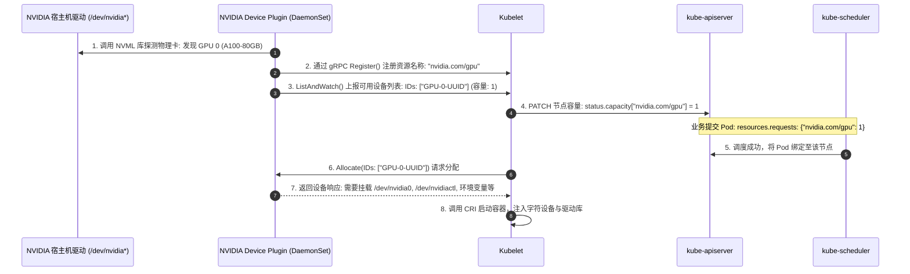
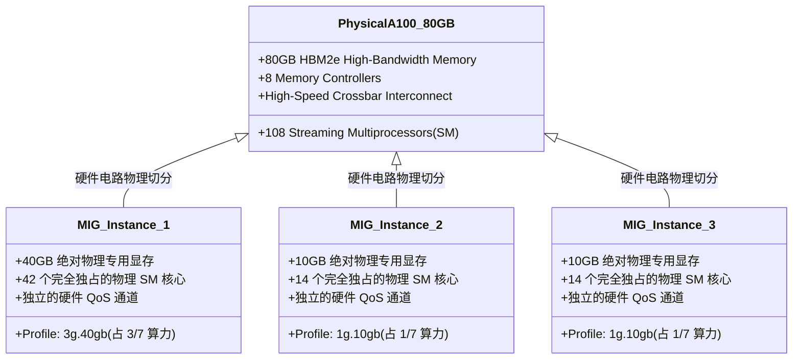
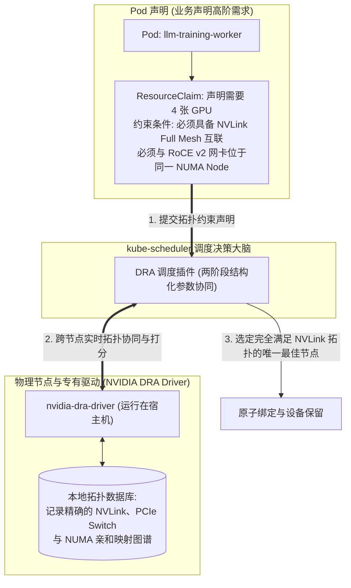
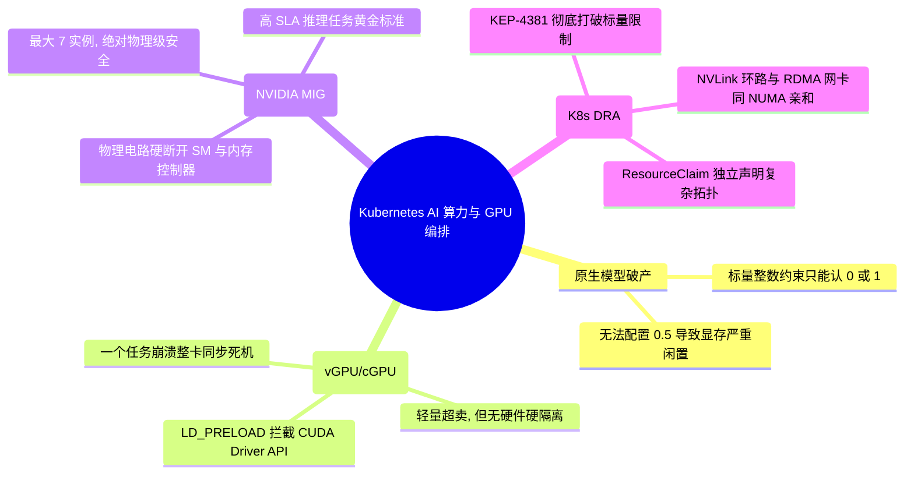

**TL;DR：** 在当下大模型（LLM）训练与微调如火如荼的时代，一张 NVIDIA A100/H100 80GB 显卡售价高达数万美元。然而在现实工程中，许多轻量级模型推理、嵌入向量提取（Embedding）或开发调试任务，仅需 10GB 显存和 20% 的算力；若按照原生 Kubernetes 的方式调度，该容器将**独占整张 80GB 显卡，导致剩余 70GB 显存与 80% 算力被常年白白浪费，算力成本极其沉重**。造成这一局限的物理根源在于：Kubernetes 原生的 **Device Plugin 框架** 仅支持**标量整数（Scalar Integer）**记账，只认 `0` 或 `1`，根本无法感知显卡内部的显存与计算核心拓扑。为了破除这一经济学困境，业界历经了三代架构演进：从初期的 **软件级虚拟化（通过 `LD_PRELOAD` 或驱动模块拦截 CUDA API 强制限额，但缺乏硬隔离且易被旁路崩溃）**；演进到 **NVIDIA MIG（多实例 GPU）在硬件物理电路层级将一张物理卡硬切分为最多 7 个相互完全隔离、拥有独立显存通道与 SM 处理器的实体 GPU）**；最终收官于 Kubernetes 官方的颠覆性架构革命——**DRA（Dynamic Resource Allocation，动态资源分配）**，通过 `ResourceClaim` 彻底突破标量限制，实现 GPU、NVLink 拓扑与 RDMA 网络的一体化高阶编排。

---

## 一、 面试现场：从“万元显卡算力闲置”到“GPU 硬件级虚拟化切分”的连环追问

```text
面试官提问：
  "我们公司采购了一批 80GB 的 NVIDIA A100 显卡搭建 AI 推理集群。
   为什么开发在 Pod YAML 里声明 resources.requests: { 'nvidia.com/gpu': '0.5' } 时，Kubernetes 会直接拒绝报错？
   如果多个轻量推理 Pod 想要共享同一张物理 GPU，业界有哪些主流切分方案？
   基于 CUDA 劫持的软件切分与 NVIDIA 硬件级 MIG 切分有什么根本区别？
   K8s 最新的 DRA（Dynamic Resource Allocation）是如何解决复杂 AI 拓扑（比如跨卡 NVLink 互联）调度难题的？"
```

### 1.1 初级候选人的典型翻车点

在考察当下极其热门的 AI 平台工程（AI Platform Engineering）面试中，初级候选人常暴露以下技术断层：
- **完全不知道 Kubernetes 扩展资源的整数硬约束**：误以为像配 CPU `500m` 一样可以随心所欲配小数 `0.5`，不知道扩展资源（Extended Resources）在 API Server 的 Schema 校验中写死只支持整数（Integer）；
- **以为 GPU 虚拟化和 CPU/内存隔离是一回事**：误以为 Linux cgroups 可以直接限制 GPU 显存，不知道 Linux 内核对于专有 GPU 硬件完全失控，容器内的 GPU 限制必须依赖 NVIDIA 专有驱动体系；
- **分不清软件截获与硬件切分的物理边界**：以为装个开源 vGPU 插件就能安全生产混部，完全不知道软件 CUDA 截获方案存在“无法限制算力抢占”、“不支持统一内存架构”、“一个任务发生 CUDA Panic 会拖垮整机所有共享任务”的致命安全漏洞；
- **对 MIG 硬件切片与 DRA 架构毫无认知**：只知道整卡调度，讲不出 A100 的 7 个硬件实例切分原理，对 K8s 官方最新的 DRA 资源声明模型闻所未闻。

### 1.2 资深工程师的破局切入点

资深 AI 基础设施架构师面对此类考题，能够以**“硬件物理约束 $\to$ 软件截获演进 $\to$ 硬件物理切片 $\to$ 声明式 DRA 终局”**四个层次系统作答：
1. **揭秘整卡独占的物理机制**：拆解 NVIDIA Device Plugin 如何通过 `ListAndWatch` 发现 `/dev/nvidia0` 并向 Kubelet 上报整数标量，说明 API Server 扩展资源仅支持整数记账的 Schema 限制；
2. **推导软件级虚拟化（vGPU/cGPU）的原理与死穴**：
   - 机制：在宿主机或容器内通过动态链接注入（`LD_PRELOAD`）拦截 `libcuda.so` 的 `cuMemAlloc` 系统调用，在应用层做显存配额记账；
   - 死穴：无法强隔离 GPU 核心（SM）计算资源，且无法防御绕过 CUDA 的直接系统调用，稳定性欠佳；
3. **深入推导 NVIDIA MIG（Multi-Instance GPU）硬件物理切片**：
   - 物理本质：在硅片硬件电路上将 GPU 的流式多处理器（SM）、显存控制器（Memory Controller）、Crossbar 总线与二级缓存做物理隔离；
   - 极限能力：将一张 80GB A100 切割为 7 个独立的 GPU 实例（如 `1g.10gb`），每个实例拥有独立的故障域（Fault Domain），一个 Pod 发生段错误不会波及其他实例；
4. **剖析 Kubernetes DRA（Dynamic Resource Allocation）革命**：
   - 说明为什么标量资源模型在 AI 时代破产（无法表达 NVLink 拓扑、NUMA 亲和性、RDMA 网卡关联）；
   - 展示 DRA 如何通过 `ResourceClaim` 与结构化参数（Structured Parameters）让调度器与驱动动态协商分配最复杂的异构拓扑。

---

## 二、 原生架构局限：NVIDIA Device Plugin 与整卡独占模型

在传统的 Kubernetes 集群中，要让 Pod 能使用 GPU，必须在宿主机部署 **NVIDIA K8s Device Plugin**（以 DaemonSet 形式运行）。



### 2.1 为什么声明 `0.5` 个 GPU 会报错？

在 Kubernetes 资源模型中：
- 官方内置的核心资源（`cpu`、`memory`）支持非整数和复合单位（如 `500m` 表示 0.5 核，`1Gi` 表示内存字节）；
- **所有通过 Device Plugin 机制注册的资源，全部归类为“扩展资源（Extended Resources）”**！
- Kubernetes 官方 API 规约明确规定：**扩展资源的数量必须为绝对整数（Integer）**。如果输入 `0.5`，API Server 在反序列化与 Schema 校验阶段会直接抛出字段类型错误，根本无法提交！

这就造成了一个荒谬的算力黑洞：即便一个 Pod 只需要 2GB 显存跑一个微型的 ResNet 模型，它也必须独占一整张价值数万美元、拥有 80GB 显存的 A100/H100 显卡。

---

## 三、 软件虚拟化方案：CUDA Driver API 截获与显存超卖

为了打破整卡独占的限制，各大云厂商和开源界（如阿里 cGPU、腾讯云 qGPU、开源 vGPU）开发了**软件级截获方案**。

```mermaid
flowchart TD
    subgraph ContainerSpace["业务容器 Pod 内部"]
        direction TB
        AppCode["AI 训练 / 推理代码 (PyTorch / TensorFlow)"]
        HookLib["劫持库: libcuda.so (动态替换注入或 LD_PRELOAD)"]
        AppCode -->|调用 cudaMalloc(10GB)| HookLib
    end

    subgraph UserKernelBarrier["用户态 / 内核态边界"]
        direction TB
        VirtualQuota{"软件显存记账器 (Token Bucket):<br/>当前已用: 6GB + 申请: 10GB = 16GB<br/>是否超过分配配额 (16GB Limit) ?"}
        Pass["放行通过，调用真实底层驱动 ioctl"]
        Reject["抛出 Out of Memory 异常，拦截分配!"]
    end

    subgraph PhysicalGPU["物理硬件层 (单张物理 GPU)"]
        HostDriver["宿主机 NVIDIA 内核驱动 (nvidia.ko)"]
        Hardware["NVIDIA 物理芯片 (80GB 显存全部物理暴露)"]
    end

    HookLib --> VirtualQuota
    VirtualQuota -- "未超配" --> Pass --> HostDriver --> Hardware
    VirtualQuota -- "超配" --> Reject
```

### 3.1 软件截获的核心机理与生产死穴

- **显存隔离机制**：拦截 `cuMemAlloc`、`cuMemAllocManaged` 等底层驱动 API，在用户态维护一个属于当前 Pod 的内存计数器。一旦该容器使用的显存总量触顶，立即截断并伪造 `CUDA_ERROR_OUT_OF_MEMORY` 报错；
- **算力隔离机制**：使用时间片轮转（Time-Slicing）算法，拦截任务提交的 CUDA Stream 队列，按比例让不同 Pod 轮流向硬件提交计算核函数（Kernel）。

#### 致命缺陷（生产严禁用于不可信多租户）：
1. **零硬件故障隔离（No Fault Isolation）**：由于底层物理芯片是完全共享的，如果容器 A 的某个未经测试的模型跑出了一个非法的内存访问或触发了驱动级的硬件异常（如 Xid 错误），**整个物理 GPU 将陷入内核死锁，同一张卡上的容器 B、C、D 会瞬间同步雪崩崩溃！**
2. **算力抢占无法硬限制**：GPU 是高度并发的计算设备，软件时间片很难精确控制已在 SM（流多处理器）内部运行的计算核。某个复杂计算可能会长时间霸占计算单元，导致高优先级的在线推理任务发生严重的延迟抖动。

---

## 四、 硬件级物理硬隔离：NVIDIA MIG（Multi-Instance GPU）深度剖析

针对软件虚拟化缺乏物理隔离的硬伤，NVIDIA 从 Ampere 架构（A100、H100 等）开始，在硅片电路上引入了划时代的 **MIG（Multi-Instance GPU）技术**。



### 4.1 MIG 为什么具备绝对的安全性？

与软件切分有着天壤之别，MIG 是在**硬件硅片制造层面完成了物理断开**：
1. **显存通道与缓存物理切割**：A100 内部拥有 8 个显存控制器。创建 MIG 实例时，硬件会为每个实例直接绑定专属的内存控制器与独立的 Crossbar 总线通道。**这意味着即使容器 A 的代码被黑客注入了越界指针，从物理上它根本无法向容器 B 的显存通道发出任何电信号！**
2. **绝对的故障容灾隔离（Fault Isolation）**：如果某个模型在 `MIG_Instance_1` 中发生了致命的硬件段错误（CUDA Kernel Crash），只有该实例会重启，其他运行在不同 MIG 实例上的业务连 1 微秒的性能抖动都不会感知；
3. **确定性算力保证**：每个实例拥有固定物理数量的 SM 计算核心，无论邻居实例在进行何等狂暴的矩阵乘法，本机实例的吞吐与延迟曲线平直如尺，真正满足高 SLA 金融级推理要求。

在 Kubernetes 中，开启 MIG 模式后，NVIDIA Device Plugin 会向集群暴露细粒度的资源类型：
```yaml
# 业务 Pod 只需申请所需规格的 MIG 物理实例
spec:
  containers:
  - name: llm-inference
    image: vllm:latest
    resources:
      limits:
        # 精准申请拥有 40GB 显存的 3/7 A100 实例
        nvidia.com/mig-3g.40gb: 1
```

---

## 五、 K8s 官方终局演进：DRA（Dynamic Resource Allocation）革命

即使有了 MIG，在大模型分布式训练与异构集群中，又遭遇了更加严峻的**拓扑编排危机**：
- 一个包含 8 张 H100 的节点，卡与卡之间通过 **NVLink** 高速互联（双向 900GB/s），而有些卡之间只能走慢速的 PCIe；
- 一个分布式训练 Pod 如果需要 4 张卡，**调度器必须把这 4 张卡选在拥有直连 NVLink 环路的一侧**，否则全分布式训练吞吐会暴跌 80%；
- 传统的标量资源记账模型（`requests: { nvidia.com/gpu: 4 }`）完全无法表达“这 4 张卡必须具有 NVLink 亲和性，且必须与同一 NUMA 节点的 RDMA 网卡绑定”这一高阶拓扑需求！

为了终结这一困境，Kubernetes 在 1.26+ 孵化并在 1.30+ 全面演进推出了 **DRA（Dynamic Resource Allocation）**。



### 5.1 DRA 的三大核心范式革新

1. **解耦资源声明与 Pod 容器**：引入了一等公民资源 **`ResourceClaim`**（类似于存储领域的 PVC）。资源的声明不再被硬编码在容器内部，而是可以独立声明、在多个容器间共享，甚至跨 Pod 共享；
2. **结构化参数（Structured Parameters）**：允许设备驱动向调度器暴露底层的硬件属性（如显存带宽、NVLink 拓扑连通矩阵、功耗等级），调度器通过 CEL（Common Expression Language）表达式直接在调度阶段完成最优硬件图匹配；
3. **彻底终结自定义调度器**：以前为了实现 GPU 拓扑感知，各大企业必须自己写专有调度器。DRA 将这一能力标准化，让官方标准调度器通过插件机制直接掌控最复杂的 AI 异构算力。

---

## 六、 面试通关复盘与架构师高分回答模板



### 6.1 现场 2 分钟极速电梯演讲（高分答题模板）

> **面试官问：**“AI 大模型时代，K8s 如何安全高效切分一张 80GB 的 A100/H100 显卡？软件虚拟化与 MIG 有何区别？DRA 解决了什么？”

**高分应答结构（递进式穿透）：**

> “**第一层（原生局限与经济学痛点）：**
> 原生 Kubernetes 无法配置 `nvidia.com/gpu: 0.5`，因为 Device Plugin 暴露的资源属于**扩展资源（Extended Resources）**，API 规约强制要求其必须为整数。如果只跑轻量模型推理，一个 Pod 会独占整张卡，造成高达 70% 的显存与算力闲置。
>
> **第二层（软件截获 vs 硬件 MIG 切分）：**
> 针对切分复用，业界主要有两条技术路线：
> 1. **软件级虚拟化（如阿里 cGPU、开源 vGPU）**：通过在用户态注入 `libcuda.so` 拦截 `cuMemAlloc` 等系统调用进行显存限额，并配合时间片轮转。**优点是灵活性高、支持超卖；致命缺陷是零硬件隔离**——无法真正限制 SM 计算核心抢占，且一旦某个容器发生底层的 CUDA 硬件级非法访问，整张卡上的所有共存容器会同步被内核重置死机；
> 2. **硬件级物理切片（NVIDIA MIG）**：A100/H100 从硅片制造层面支持硬件硬切分。它在物理上将 GPU 的流式多处理器（SM）和显存控制器（Memory Controller）彻底物理隔开，最多切为 7 个独立实例（如 `1g.10gb`、`3g.40gb`）。每个实例拥有**绝对独立的显存总线与硬件故障域**，一个实例崩溃对其他实例零影响，延迟平直确定，是金融级与多租户安全混部的唯一标准解法。
>
> **第三层（官方架构终局：DRA 动态资源分配）：**
> 在大模型训练时代，标量资源模型已彻底破产，因为它无法表达‘4 张卡必须具有 NVLink 全互联，且与同一 NUMA 节点的 RoCE 网卡绑定’的拓扑需求。Kubernetes 1.30+ 推行了 **DRA（Dynamic Resource Allocation）**，引入类似于存储 PVC 的 **`ResourceClaim`** 抽象，并结合结构化参数让标准调度器直接能够根据 GPU 的 NVLink 拓扑矩阵做出毫秒级最优硬件装箱决策，彻底重塑了 AI 算力底座的编排标准。”

### 6.2 生产面试关键避坑守则

1. **绝对不要说“用 cgroups 可以直接限制 GPU 显存”**：Linux 内核 cgroups 目前只能限制宿主机 CPU、普通内存和磁盘 IO，GPU 显存必须依赖 NVIDIA 专有驱动体系；
2. **明确 MIG 的硬件门槛**：MIG 是一项硬件特性，只在 NVIDIA Ampere 及之后的高端数据中心卡（A100、A30、H100）上支持；普通的消费级显卡（如 RTX 3090/4090）或老旧的 T4/V100 **完全不支持 MIG**，只能依赖软件截获方案；
3. **区分训练与推理的选型差异**：大模型训练通常追求极致算力，必须整卡甚至多节点跨卡调度，核心是关注 NVLink 拓扑；而大模型推理由于并发请求与显存需求多样，是 MIG 和 DRA 动态切分最典型的收益场景；
4. **警惕 MIG 模式切换代价**：在物理宿主机上启用或重新切分 MIG 规格时，必须重启或重载 NVIDIA 驱动，这意味着**切分不能在有在飞业务时随意动态调整**，生产通常采用预设固定规格池（如固定划分为 3g.40gb + 1g.10gb 组合）。

---

## 参考资料与权威规范

1. **NVIDIA Documentation**: *NVIDIA Multi-Instance GPU (MIG) User Guide* (docs.nvidia.com/datacenter/tesla/mig-user-guide/).
2. **Kubernetes Enhancement Proposal (KEP)**: *KEP-4381: Dynamic Resource Allocation (DRA) with Structured Parameters* (enhancements.k8s.io).
3. **Kubernetes Official Guidance**: *Schedule GPUs & Dynamic Resource Allocation* (kubernetes.io/docs/concepts/scheduling-eviction/dynamic-resource-allocation/).
4. **NVIDIA Kubernetes Device Plugin**: *Design, Architecture and Configuration* (github.com/NVIDIA/k8s-device-plugin).
5. **ACM ASPLOS**: *Characterizing and Orchestrating AI Workloads on Large-Scale GPU Clusters* (2023).
