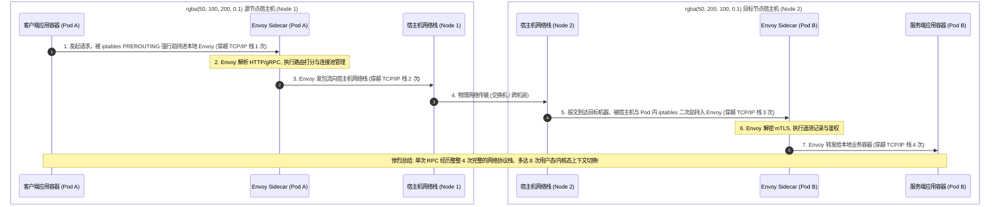
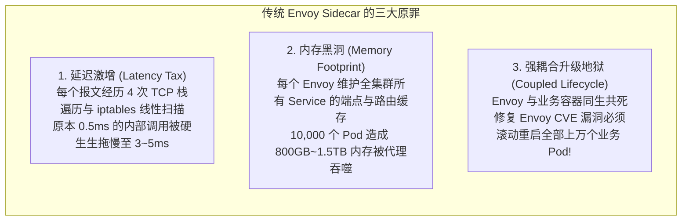
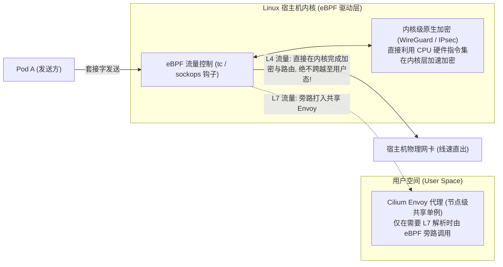
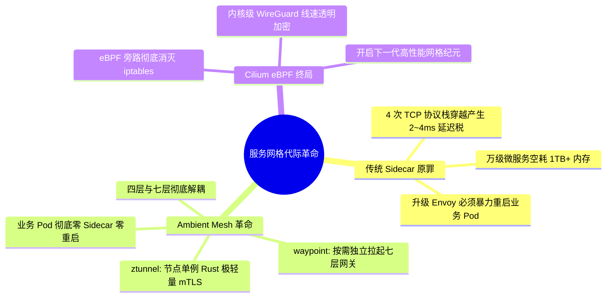

**TL;DR：** 曾几何时，在 Kubernetes 中为每个 Pod 注入一个 **Envoy Sidecar** 容器被奉为微服务治理的黄金圣经。然而当集群规模突破数千甚至上万个 Pod 时，许多平台团队陷入了灾难性的质疑：**原本只有 0.5ms 的服务间内部 RPC，上了 Mesh 之后莫名暴涨至 3~5ms；为了支撑这数万个 Envoy 代理，集群平白无故被吞噬了数百 GB 乃至数 TB 的常驻内存；更要命的是，每次升级 Envoy 补丁，全集群所有业务 Pod 都必须强制重启！** 这一工程痛点的物理本质在于：Sidecar 模式强行将“四层安全传输”与“七层应用路由”揉碎在每一个 Pod 内部，不仅破坏了应用边界，更让网络报文在单个宿主机内经历了 **4 次漫长冗余的 Linux 协议栈穿越**。为了彻底打破这一枷锁，云原生网格掀起了 **“无 Sidecar（Sidecarless）”代际革命**：以 **Istio Ambient Mesh** 为代表，将四层基础 mTLS 安全下沉至节点级单例轻量 Rust 守护进程 **`ztunnel`**，将七层业务代理剥离为独立演进的 **`waypoint proxy`**；而 **Cilium Service Mesh** 则更进一步，直接借助 **eBPF** 在内核协议栈旁路实现纳秒级短路直通，开创了云原生零信任与微服务治理的高性能新纪元。

---

## 一、 面试现场：从“Sidecar 内存雪崩被研发痛骂”到“无 Sidecar 架构革命”的连环追问

```text
面试官提问：
  "几年前大家都在推崇 Istio，给每个业务 Pod 强行注入一个 Envoy Sidecar。
   为什么现在大厂普遍把这种模式称为‘反人类设计’？单次网络请求在 Sidecar 架构下到底走了几遍内核协议栈？
   以 Istio Ambient Mesh 和 Cilium 为代表的‘无 Sidecar（Sidecarless）’架构是怎么彻底解决这一问题的？
   Ambient 的 ztunnel 与 waypoint proxy 是怎么分工的？如何做到网格代理升级而业务 Pod 零感知不重启？"
```

### 1.1 初级候选人的典型翻车点

在考察服务网格（Service Mesh）与前沿云原生演进的资深面试中，初级候选人常暴露以下视野短板：
- **只会背 Sidecar 的好处，不知其物理代价**：只知道“解耦了微服务、统一了流量与遥测”，但对“每次 RPC 经过几遍 TCP 栈”、“每个 Envoy 占用多少内存”、“万级实例下 xDS 下发如何打爆内存”等物理代价毫无概念；
- **分不清四层传输与七层业务的区别**：以为所有的微服务治理都必须依赖七层 HTTP 解析，不知道 80% 的服务间流量其实只需要四层透明 mTLS 加密与身份鉴权；
- **对无 Sidecar 的实现原理一片模糊**：以为 Ambient Mesh 只是“把 Envoy 藏起来了”，讲不清楚轻量级四层代理 `ztunnel` 是如何通过 HBONE 隧道通信的，更不知道 `waypoint proxy` 为什么能与业务生命周期完全解耦；
- **对 eBPF 与网格结合一知半解**：只知道 Cilium 很快，说不清 eBPF 是在哪个内核环节接管流量、以及为什么它能绕过 iptables。

### 1.2 资深工程师的破局切入点

资深平台架构师面对这一连串追问，能够以**“协议栈物理穿越代价 $\to$ 职责分层革命 $\to$ 生产生命周期解耦”**为主线层层击穿：
1. **逆向还原传统 Sidecar 物理性能灾难**：
   - 绘制数据包流转图，清晰指出 1 次端到端通信包含了 **4 次完整的 Linux 网络协议栈穿越**（Client App $\to$ Client Envoy $\to$ Host $\to$ Target Host $\to$ Target Envoy $\to$ Target App），单次调用带来 2~4ms 延迟增长；
   - 精算内存成本：10,000 个 Pod $\times$ 每个 Envoy 最小 80MB = 800GB 内存空耗；
   - 指出升级阵痛：Envoy 与业务容器共享 Pod，升级代理必须重建 Pod，极大侵扰业务；
2. **推导 Istio Ambient Mesh 的分层解耦哲学**：
   - **L4 安全底座（ztunnel）**：以 DaemonSet 形式每节点运行一个极简的 Rust 单例程序，仅负责建立 mTLS 与零信任身份验证，整节点内存仅需十几 MB，延迟损耗微秒级；
   - **L7 业务路由（waypoint proxy）**：按 Namespace 或服务按需独立拉起标准的 Envoy 实例，仅在需要复杂路由或鉴权时由 ztunnel 重定向过去；
3. **展现生命周期完全解耦的巨大红利**：业务 Pod 永远不需要注入 Sidecar，升级网关只需滚动发布 waypoint，实现真正的业务零重启与故障域隔离；
4. **深入 Cilium eBPF 内核级终极演进**：对比 Cilium 如何通过 `sockops` 套接字重定向抹平内核协议栈开销，给出在 Linux 5.10+ 下的大厂演进路线。

---

## 二、 经典 Sidecar 模式的物理代价：协议栈穿越与资源牢笼

为了理解为什么无 Sidecar 是历史必然，我们必须先看清传统 Envoy Sidecar 是如何在操作系统层面肆虐算力的。



### 2.1 传统 Sidecar 模式的三大不可承受之重



在超大规模集群中，**90% 的内部调用其实只需要实现两台机器之间的双向 mTLS 加密与零信任身份鉴权，根本不需要解析复杂的七层 HTTP 路径重写！** 为了一点点传输加密，却让每一个 Pod 背负一个沉重的七层代理，这是巨大的架构失衡。

---

## 三、 Istio Ambient Mesh：分层解耦的无 Sidecar 革命

Google 与 Isovalent、Solo.io 在 2022 年底联合推出了 **Ambient Mesh**。它的核心设计哲学是：**“四层传输层与七层业务层彻底分家”**！

```mermaid
flowchart TB
    subgraph AmbientArch["Istio Ambient Mesh 分层解耦全景拓扑"]
        direction TB

        subgraph WorkerNode1["工作节点 Node 1"]
            PodA1["业务 Pod A1 (纯裸容器, 无任何 Sidecar!)"]
            PodA2["业务 Pod A2 (纯裸容器, 无任何 Sidecar!)"]
            Ztunnel1["ztunnel (Zero-Trust Tunnel)<br/>每节点单例 DaemonSet / 采用极速 Rust 编写<br/>仅处理 L4 mTLS 握手、HBONE 隧道与身份识别<br/>单节点内存消耗仅 ~15MB!"]
            PodA1 -. 自动透明重定向 .-> Ztunnel1
            PodA2 -. 自动透明重定向 .-> Ztunnel1
        end

        subgraph WorkerNode2["工作节点 Node 2"]
            PodB1["业务 Pod B1 (纯裸容器, 无任何 Sidecar!)"]
            Ztunnel2["ztunnel (Node 2 单例 DaemonSet)"]
            PodB1 -.-> Ztunnel2
        end

        subgraph Layer7Plane["按需独立的七层治理层 (L7 Processing Plane)"]
            Waypoint["waypoint proxy (标准的 Envoy 实例)<br/>按 Namespace 或 Service 独立按需拉起<br/>仅在需要高级路由/灰度/WAF 时才介入<br/>完全脱离业务 Pod 独立演进与无损升级!"]
        end

        Ztunnel1 ==="HBONE 协议 (基于 HTTP/2 承载的双向 mTLS 隧道 / 端口 15008)"===> Ztunnel2
        Ztunnel1 -. "若目标服务声明了 L7 策略" .-> Waypoint
        Waypoint -.-> Ztunnel2
    end
```

### 3.1 核心组件分工：ztunnel vs waypoint

#### 1. `ztunnel`（Zero-Trust Tunnel，零信任安全通道）
- **形态与语言**：每个 Node 节点以 DaemonSet 运行一个实例，采用现代 **Rust 语言**重写（抛弃了庞大的 C++ Envoy），内存占用从几百 MB 骤降到 **15MB** 左右；
- **物理职责**：只做四层（L4）的事情——监听节点网络，与对端节点的 `ztunnel` 建立基于 HTTP/2 的 **HBONE（HTTP-Based Overlay Network Environment）** 双向 mTLS 加密隧道，并执行基于 SPIFFE ID 的零信任四层授权；
- **透明拦截**：利用 Linux 内核的路由表（`geneve` 隧道或 eBPF），在宿主机层面对流量进行透明导流，**业务容器内完全不需要注入任何代码或网卡**！

#### 2. `waypoint proxy`（按需七层业务代理）
- **形态**：它依然是一个功能完整的标准 Envoy 容器，但它**不再存在于业务 Pod 内部**，而是以普通的 Deployment 形式独立运行在集群中；
- **按需分配**：如果整个命名空间只需要 mTLS 加密，那就根本不需要创建 waypoint，开销为零；只有当运维配置了 `VirtualService` 需要执行金丝雀按权重分流（如 90% 流量给 v1，10% 给 v2）时，才为该命名空间声明一个 waypoint；
- **真正的零侵扰升级**：升级 waypoint 网关时，只需要对它的 Deployment 执行正常的滚动更新，**后端的业务 Pod 完全感知不到，更不需要重启**！

---

## 四、 Cilium Service Mesh：基于 eBPF 的内核级终极形态

既然 Ambient Mesh 依然需要在用户态跑一个 `ztunnel` 进程，那能否把四层网络治理**彻底做进 Linux 内核本身**？

这就是 **Cilium Service Mesh** 给出的终极答案。



### 4.1 Cilium eBPF 网格的物理降维打击

1. **消灭所有 iptables 劫持**：所有流量在离开 Socket 的瞬间直接被 eBPF `sockops` 截获，改写包头并重定向，完全不需要经过 Netfilter 框架；
2. **内核态原生加密（In-Kernel Encryption）**：摒弃了用户态 TLS 握手的上下文拷贝，直接在 Linux 内核中使用 **WireGuard** 或 **IPsec** 进行全节点透明加密，利用 CPU 的 AES-NI 指令集实现物理线速无损加密；
3. **节点级 Envoy 共享**：只有当必须解析 HTTP Header 或执行 L7 复杂策略时，eBPF 程序才会把数据包送入用户态由单个共享 Envoy 处理，实现了最极致的算力节约。

---

## 五、 三代服务网格架构横向对比与选型决策

| 架构维度 | 经典 Sidecar 模式 (Istio with Envoy) | Istio Ambient Mesh (无 Sidecar) | Cilium Service Mesh (eBPF) |
| --- | --- | --- | --- |
| **代理驻留位置** | 每个 Pod 内独占注入一个容器 | 节点级共享 `ztunnel` + 按需 `waypoint` | 内核级 eBPF + 节点级共享 Envoy |
| **TCP 协议栈穿越** | **4 次完整穿越（极慢）** | 2 次完整穿越（快） | **0~1 次内核旁路（极快，接近裸机）** |
| **内存开销模型** | 线性膨胀：$N \times 80\text{MB}$（数千 Pod 吞噬 1TB+） | **极低：每节点固定 ~15MB** + 按需少量 L7 | **极低：纯内核 Map 记账** + 按需少量 L7 |
| **网关升级对业务影响** | **必须强制重启全部业务 Pod！** | **零影响！业务 Pod 完全不重启** | **零影响！热加载 eBPF 字节码** |
| **业务入侵程度** | 强入侵（YAML 注入、Init 容器修改 iptables） | **零入侵（纯网络层透明接管）** | **零入侵（纯内核层接管）** |
| **技术成熟度** | 绝对成熟（已被业界检验多年） | **GA 成熟（Istio 官方主推方向）** | 极具未来潜力（需要 Linux 5.10+ 内核支持） |

---

## 六、 面试通关复盘与架构师高分回答模板



### 6.1 现场 2 分钟极速电梯演讲（高分答题模板）

> **面试官问：**“给每个 Pod 强行塞一个 Envoy 带来多大内存与延迟灾难？为什么无 Sidecar（Ambient 与 Cilium）是必然趋势？”

**高分应答结构（递进式穿透）：**

> “**第一层（传统 Sidecar 的三大物理代价）：**
> 传统 Istio 为每个 Pod 注入 Envoy 带来了极其严重的‘网格延迟税’与‘资源黑洞’：
> 1. **延迟激增**：每个跨节点 RPC 必须经历客户端应用 $\to$ 本地 Envoy $\to$ 宿主机网络栈 $\to$ 对端宿主机 $\to$ 对端 Envoy $\to$ 对端应用，**在单次通信中穿越了整整 4 次完整的 Linux TCP/IP 协议栈**并伴随多次上下文切换，硬生生增加 2~4ms 延迟；
> 2. **内存雪崩**：每个 Envoy 维持全集群的服务发现与路由端点，单实例至少消耗 50~150MB。在万级 Pod 的大厂集群中，纯代理中间件就会常年霸占 **500GB 到 1.5TB 的物理内存**；
> 3. **运维灾难**：Envoy 与业务容器同属一个 Pod，每次升级安全补丁都必须强行重启全集群所有业务 Pod，造成巨大的发布风险与业务抗拒。
>
> **第二层（Istio Ambient Mesh 的分层解耦革命）：**
> Ambient Mesh 的核心哲学是**‘四层安全传输与七层业务路由彻底分家’**：
> 1. **L4 安全底座（ztunnel）**：每个工作节点仅运行一个极简的 Rust 单例守护进程，专门负责全集群透明的 mTLS 加密、零信任身份验证与 HBONE 隧道。它直接接管节点流量，**节点级内存消耗仅 ~15MB，延迟降至微秒级**；
> 2. **L7 独立网关（waypoint proxy）**：仅在特定业务真正需要金丝雀流量切分、熔断或七层鉴权时，才按需以独立的 Deployment 拉起标准的 Envoy 实例。
> 最关键的是：**业务 Pod 实现了绝对的零 Sidecar 注入；网关组件升级对业务完全无感，真正实现了业务 Pod 的零重启！**
>
> **第三层（Cilium eBPF 的内核态终极形态）：**
> 针对更高性能要求的金融级与大数据场景，**Cilium Service Mesh** 彻底越过了 iptables 和用户态代理，直接通过 Linux 内核的 **eBPF `sockops`** 在套接字层完成流量截获重定向，并在内核直接结合 WireGuard 实施硬件指令级加速加密，将服务网格的物理损耗彻底压缩至极限，代表了云原生微服务治理不可逆转的代际终局。”

### 6.2 生产面试关键避坑守则

1. **绝对不要全盘否定 Sidecar 模式**：必须客观说明：在中小规模集群（几百个 Pod）或需要极度精细的本地应用级协议解析场景下，经典 Sidecar 依旧是最成熟稳定、排障工具链最全的选择；
2. **切记说明 HBONE 协议的物理本质**：很多候选人答不出 Ambient 节点间是如何通信的。必须点出 **HBONE（HTTP-Based Overlay Network Environment）**，它在四层将原始 TCP 包包裹在 HTTP/2 的 CONNECT 隧道中，并在端口 `15008` 上运行双向 mTLS；
3. **澄清 waypoint proxy 依然是 Envoy**：Ambient 并不是‘完全消灭了 Envoy’，而是将 Envoy 从‘Pod 强绑定’解放为‘按需独立微服务’；
4. **指出 Cilium eBPF 的内核版本依赖**：全功能的 Cilium Service Mesh 需要较新的 Linux 内核（建议 Linux 5.10 或 5.15+），在老旧的 CentOS 7 系统上强推会遭遇内核能力缺失。

---

## 参考资料与权威规范

1. **Istio Official Documentation**: *Ambient Mesh Architecture, ztunnel, and Waypoint Design* (istio.io/latest/docs/ops/ambient/architecture/).
2. **Cilium Official Documentation**: *Cilium Service Mesh and Ingress with eBPF* (docs.cilium.io/en/stable/overview/service-mesh/).
3. **Solo.io Technical Whitepaper**: *Understanding Ambient Mesh and the Future of Sidecarless Architecture* (solo.io).
4. **RFC 9113**: *HTTP/2 Protocol - The CONNECT Method for Tunneling TCP* (datatracker.ietf.org/doc/html/rfc9113).
5. **ACM SIGCOMM**: *Demystifying the Overhead of Service Mesh in Microservice Architectures* (2021).
