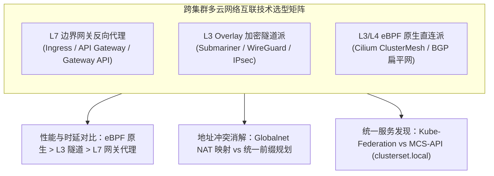
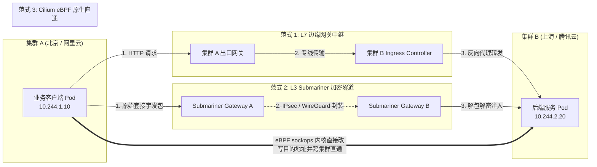
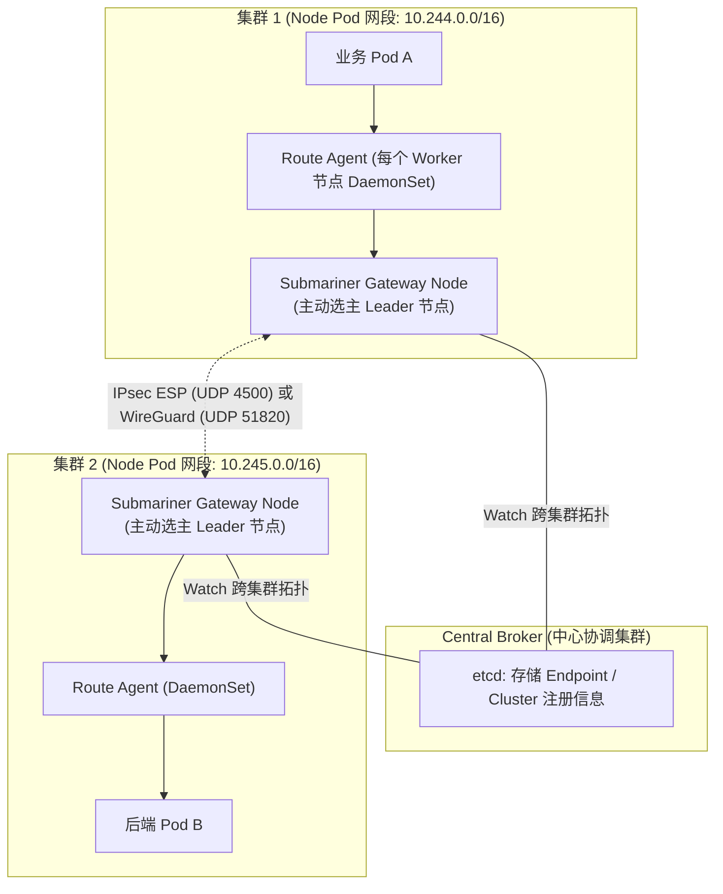
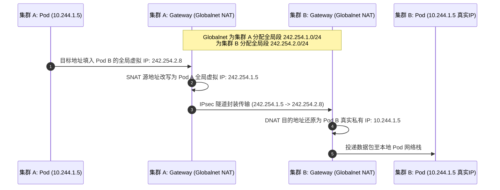
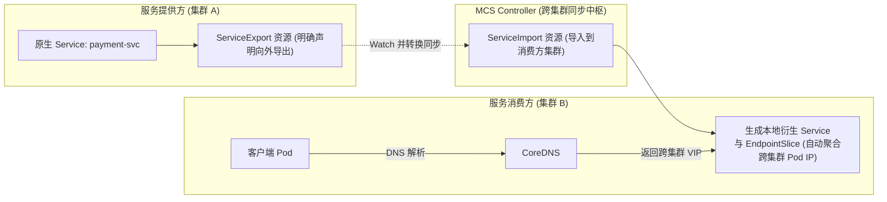

**TL;DR：** 随着业务规模跨越单数据中心与多公有云边界，依赖单一 Kubernetes 超大集群不仅会使控制面 etcd 承受巨大的并发写入压力，而且无法防范区域级故障引发的“全网雪崩”。**多集群架构（Multi-Cluster Architecture）** 因而成为现代大厂控制爆炸半径、实现两地三中心容灾的必经之路。然而，跨越异构网络隔离的数十个独立 K8s 集群，其底层 Pod IP 与 Service CIDR 通常互相冲突或不可路由。依赖传统的“L7 Ingress / Gateway 反向代理”会带来双倍跳数与序列化性能损耗；而基于底层打通的方案则分裂为两大派系：以 **Submariner** 为代表的“Overlay 隧道加密派”（基于 IPsec/WireGuard 与 Globalnet 虚拟 NAT 映射），与以 **Cilium ClusterMesh** 为代表的“eBPF 纯直通路由派”（跨集群共享控制平面与 eBPF 内核级短路转发表）。同时，Kubernetes SIG 推出的官方多集群服务规范 **MCS-API（`ServiceExport` / `ServiceImport`）** 通过统一的 `*.clusterset.local` 命名空间，从控制面上彻底终结了服务发现标准撕裂。

---

## 一、 面试现场：从“单集群爆炸半径”到“跨云 ClusterMesh”的连环追问

```text
面试官提问：
  "你们团队目前拥有跨越阿里云、腾讯云和自建机房的 20 多个 K8s 集群。业务提出了一个刚需：
   北京机房的订单服务 Pod，需要以毫秒级延迟直接调用上海机房的风控服务 Pod。
   请问：
   1. 为什么不能简单地在上海机房给风控暴露一个 Ingress 或 NodePort，然后让北京的 Pod 走公网/专线 HTTP 域名调用？
   2. 如果要实现底层 Pod-to-Pod 的透明直通互联，不同集群之间的 Pod IP 网段如果发生重叠冲突，网络包如何路由？
   3. 对比业界主流方案（Submariner vs Cilium ClusterMesh），底层网络拓扑与转发性能有何本质差异？官方 MCS-API 规范是如何解决服务发现的？"
```

### 1.1 初级候选人的典型翻车点

许多初级或未经历过大规模混合云改造的候选人，往往会给出以下典型“降级”回答：
- **方案一（暴露出公网 Ingress）**：“直接在被调用集群部署 Ingress Controller，解析为公开或内网域名，调用方直接用 HTTP Client 请求域名。”
  - **翻车点**：这种方案将内部微服务调用强制转化为外部入口流量。一次简单的内部 RPC 调用经过了“业务 Pod $\to$ 本地 CoreDNS $\to$ 跨机房专线 $\to$ 对端 Ingress Nginx / ALB $\to$ 对端 iptables/IPVS $\to$ 最终 Pod”，经历了 **4 次 L4/L7 协议栈封装与加解密**，不仅 P99 延迟飙升 300% 以上，而且丢失了源 Pod 的真实 IP（Client IP Passthrough 失效），导致审计与精细化 mTLS 双向认证体系彻底瓦解。
- **方案二（以为只要打通物理专线就行）**：“各个公有云之间拉一条高速专线，配一下交换机 BGP 路由，Pod 之间就能 ping 通。”
  - **翻车点**：完全忽视了 **Pod CIDR 地址重叠（IP Collision）** 的残酷现实。绝大多数企业的集群在初始化时，CNI 默认都是 `10.244.0.0/16`。当集群 A 的 Pod（`10.244.1.5`）试图向集群 B 的 Pod（`10.244.1.5`）发包时，Linux 内核网络栈会直接判定为本地回环或同网段广播，数据包根本走不出本机网卡！

### 1.2 资深工程师的破局切入点

系统级架构师在被问及该场景时，必须能够从**控制面抽象解耦**、**数据面网络拓扑演进**与**地址冲突消解算法**三个维度自顶向下剖析：



---

## 二、 跨集群网络的物理本质：解密连通性三大范式

为了让数十个独立集群的 Pod 能够互相通信，架构设计上存在三种完全不同的抽象层次：



### 2.1 三大连通范式的架构权衡

| 维度 | L7 边缘网关中继 (Ingress / Envoy) | L3 加密隧道 (Submariner) | L3/L4 eBPF 原生直通 (Cilium ClusterMesh) |
| --- | --- | --- | --- |
| **通信层次** | 仅支持 HTTP/gRPC / L7 协议 | 纯 L3/L4，全协议透明（TCP/UDP/SCTP） | 纯 L3/L4，全协议透明 + L7 深度观测 |
| **额外跳数** | 至少增加 2 跳应用层反向代理 | 增加 1 跳（经过各集群的 Gateway 节点） | **0 额外跳数**（源节点直发对端节点） |
| **网络吞吐与 CPU** | CPU 消耗极大（用户态上下文切换 + TLS 编解码） | 中等（内核态 IPsec/WireGuard 硬件加速） | **极限性能**（eBPF sockops 绕过协议栈） |
| **底座要求** | 零要求（有公网/内网 HTTP 连通性即可） | 任意 CNI 兼容（Flannel/Calico/Weave） | 必须全集群统一采用 Cilium CNI |
| **CIDR 冲突防御** | 天然规避（跨越 L7，无视底层 IP） | 支持 **Globalnet** 虚拟 NAT 映射 | 要求集群间 Pod/Node CIDR **完全无重叠** |

---

## 三、 Submariner 架构深度逆向：跨云隧道与 Gateway 引擎

Submariner 是 CNCF 旗下专门解决跨 Kubernetes 集群网络互联与服务发现的项目。它最大的设计哲学是**对底层 CNI 无侵入**（Non-intrusive），无论集群 A 跑 Flannel、集群 B 跑 Calico，Submariner 均能建立安全隧道。

### 3.1 核心组件与数据面流向



1. **Central Broker**：依托于某一个集群的 API Server，存放各集群导出的 `Cluster` 和 `Endpoint` 自定义资源（CRD）；
2. **Gateway Engine**：集群内部选出的一台或多台高可用节点，负责维护与外部集群的 **IPsec（强加密，政企金融首选）** 或 **WireGuard（高性能轻量级，Linux 5.6+ 内核集成）** 隧道；
3. **Route Agent**：以 DaemonSet 形式运行在每个非 Gateway 节点上。它拦截发往远程集群的 Pod 流量，通过内核路由规则将其导向本集群的 Gateway 节点。

### 3.2 破解网段冲突：Globalnet 虚拟 IP 映射机制

如果集群 A 和集群 B 的 Pod CIDR 均为 `10.244.0.0/16`，Submariner 会激活 **Globalnet Controller**：



通过这套双向 NAT 映射，在跨集群传输时使用完全不重叠的 **GlobalIP**，成功在两端真实私网 IP 100% 撞车的情况下完成了跨集群通信。

---

## 四、 Cilium ClusterMesh：基于 eBPF 的高性能全局服务编排

如果企业在建设多云集群之初就进行了严密的网络网段规划，保证了所有集群的 **Node CIDR 与 Pod CIDR 绝不重叠**，并且全量统一采用了 Cilium CNI，那么 **Cilium ClusterMesh** 则是无可匹敌的终极性能方案。

### 4.1 架构拓扑：消除 Gateway 单点瓶颈

Submariner 的架构中，所有跨集群流量必须经过 Gateway 节点做集中汇聚与路由转发，容易形成单点带宽瓶颈与多跳抖动。而 Cilium ClusterMesh 彻底消除了“专用 Gateway 节点”：

```mermaid
flowchart TB
    subgraph ControlPlane["ClusterMesh 控制面 (kvstore mesh)"]
        etcdMesh["各集群 Cilium etcd 实例建立互信双向拉取 (TLS mTLS)"]
    end

    subgraph ClusterWest["集群 West (Pod: 10.200.0.0/16)"]
        NodeW1["Worker Node W1 (eBPF)"]
        NodeW2["Worker Node W2 (eBPF)"]
    end

    subgraph ClusterEast["集群 East (Pod: 10.201.0.0/16)"]
        NodeE1["Worker Node E1 (eBPF)"]
        NodeE2["Worker Node E2 (eBPF)"]
    end

    ControlPlane -.->|"实时同步 Endpoints 与 Service 拓扑"| NodeW1
    ControlPlane -.->|"实时同步 Endpoints 与 Service 拓扑"| NodeE1

    NodeW1 ==="底层专线直接建立 eBPF 路由通道 (Pod 到 Pod 纯直连)"=== NodeE1
```

### 4.2 eBPF 内核级短路：跨集群负载均衡实现

在 Cilium ClusterMesh 中，跨集群服务并不是通过传统的 kube-proxy 维护 iptables 规则，而是直接将远程集群的后端 Endpoint 注入到本地节点的 eBPF BPF Map 中（如 `cilium_lb4_services_v2` 与 `cilium_lb4_backends_v2`）。

当本地 Pod 发起连接时，eBPF `sockops` 程序在系统调用 `connect(2)` 阶段直接将目的 IP 重写为对端集群的真实 Pod IP：

```c
// 伪代码：Cilium 跨集群 eBPF 查找逻辑
struct lb4_key key = { .address = vip, .port = vport };
struct lb4_service *svc = map_lookup_elem(&cilium_lb4_services, &key);
if (svc && svc->flags & CLUSTER_MESH_SHARED) {
    // 根据负载均衡权重算法，命中本地后端或跨集群远程后端
    __u32 backend_id = select_backend(svc, ctx);
    struct lb4_backend *backend = map_lookup_elem(&cilium_lb4_backends, &backend_id);
    
    // 直接改写内核 socket 的目的地址为远端 Pod IP (如 10.201.3.15)
    ctx->user_ip4 = backend->address;
    ctx->user_port = backend->port;
}
```

**物理零额外跳数**：跨集群的网络包从宿主机物理网卡发出后，直达对端物理主机，不经过任何隧道解包中继节点！

---

## 五、 官方统一标准：Kubernetes MCS-API 与跨集群服务发现

解决了网络打通，紧接着是服务治理问题：客户端 Pod 如何发现远程集群的服务？
以往方案中，CoreDNS 插件百花齐放，配置极其晦涩。Kubernetes 官方 SIG-Multicluster 制定了 **KEP-1645: Multi-Cluster Services API (MCS-API)**，正式将跨集群服务纳入原生声明式规范。

### 5.1 MCS-API 双核心 CRD：ServiceExport 与 ServiceImport



#### 1. 导出服务 (`ServiceExport`)
在集群 A 中，若希望将 `payment-svc` 共享给其他集群，仅需提交一个极简的 CRD：

```yaml
apiVersion: multicluster.x-k8s.io/v1alpha1
kind: ServiceExport
metadata:
  name: payment-svc
  namespace: finance
```

#### 2. 跨集群 DNS 解析规范：`*.clusterset.local`
消费方集群中的 Pod 调用该服务时，DNS 查询格式统一为：
```text
<service-name>.<namespace>.svc.clusterset.local
# 例如：
payment-svc.finance.svc.clusterset.local
```
CoreDNS 会自动拦截 `clusterset.local` 顶级域，并返回跨集群聚合后的虚拟 IP 或对端集群 Pod IP 列表，完美兼顾了跨可用区就近访问（Topology Aware Hints）。

---

## 六、 面试通关复盘与架构师高分回答模板

### 6.1 现场 2 分钟极速电梯演讲

> “面试官，在面对跨机房、多公有云的 K8s 多集群互联时，我们坚决反对将内部微服务通过公网 Ingress 反向代理暴露，因为这不仅引入了 4 次冗余的协议栈与加解密损耗，而且丢弃了真实源 IP。
> 
> 在架构落地时，我们严格区分两类场景：
> 1. **在存在历史网段冲突、异构混合 CNI 的过渡场景**，选用 **Submariner**。它通过中心 Broker 协同，在各集群选出 Gateway 节点搭建 IPsec/WireGuard 加密隧道，并借助 **Globalnet** 虚拟双向 NAT 映射，彻底化解 Pod CIDR 重合困境；
> 2. **在统一规划了非冲突 IP、追求极致低延迟的高并发生产底座**，选用 **Cilium ClusterMesh**。各集群 Cilium 节点共享控制面拓扑，利用 eBPF `sockops` 在内核层直接改写服务路由，实现真正的跨集群 Pod-to-Pod 纯物理直通，达到零跳数转发与内核级观测；
> 
> 在服务发现层，全面对齐 Kubernetes SIG 官方的 **MCS-API** 标准，通过声明式 `ServiceExport` 和统一的 `clusterset.local` 域名解析，终结私有化跨集群 DNS 混乱，真正实现业务代码对跨云物理拓扑的无感访问。”

### 6.2 生产面试关键避坑守则

1. **死守网络规划第一防线**：在搭建企业第一个 K8s 集群时，就必须强制划分全局不冲突的 `/16` 预留网段（如 Cluster-1 占 `10.200.0.0/16`，Cluster-2 占 `10.201.0.0/16`）。依赖 NAT（如 Globalnet）虽然能救命，但会带来额外的 NAT 映射状态开销与排障黑盒；
2. **警惕隧道 MTU 导致的静默丢包**：启用 Submariner IPsec 隧道时，由于外层封装增加了 50~80 字节的包头，必须严格将 Pod 虚拟网卡的 MTU 调小（例如从 1500 调为 1420），否则会引发大包分片甚至因为 TCP握手正常但传输大包时静默卡死（Black Hole）；
3. **Gateway 单点带宽与灾备演练**：使用隧道网关方案时，跨集群的大吞吐流量会全部汇聚到 Gateway 机器。必须配置双 Gateway Active-Passive 故障秒级漂移，或结合 ECMP 实现跨节点的隧道负载均衡；
4. **跨集群服务跨域拓扑感知（Topology Aware）**：跨机房跨地域调用延迟物理上不可跨越（北京到上海约 25ms）。必须在 MCS-API 中配置本地集群优先路由策略，仅在本地实例全部宕机时才触发跨机房灾备容灾。

---

## 参考资料与权威规范

1. Kubernetes SIG-Multicluster. *KEP-1645: Multi-Cluster Services API (MCS-API) Specification*.
2. Submariner.io. *Architecture & Globalnet IP Address Conflict Resolution*. CNCF Sandbox Project Documentation.
3. Cilium Authors. *Cilium ClusterMesh: Multi-Cluster eBPF Routing and Service Discovery*.
4. IETF RFC 4301. *Security Architecture for the Internet Protocol (IPsec ESP & AH)*.
5. Jason A. Donenfeld. *WireGuard: Fast, Modern, Secure VPN Tunnel*. ACM CCS 2017.
