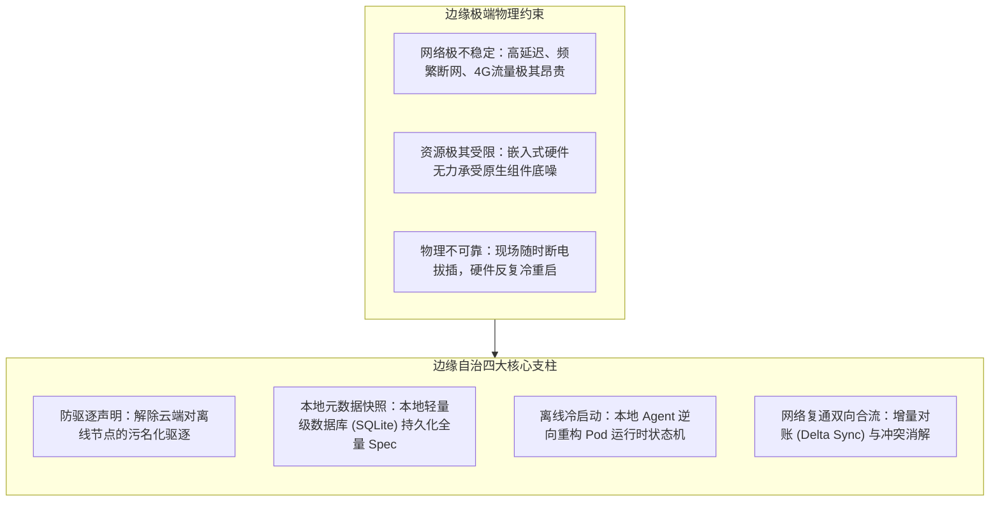
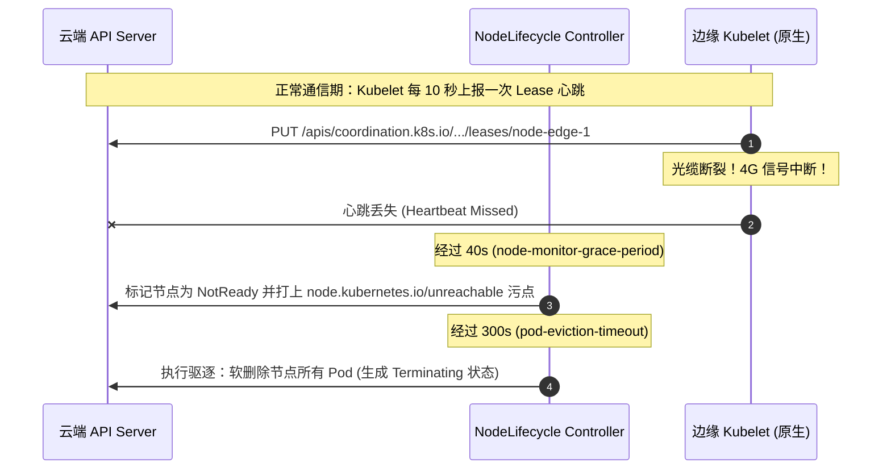
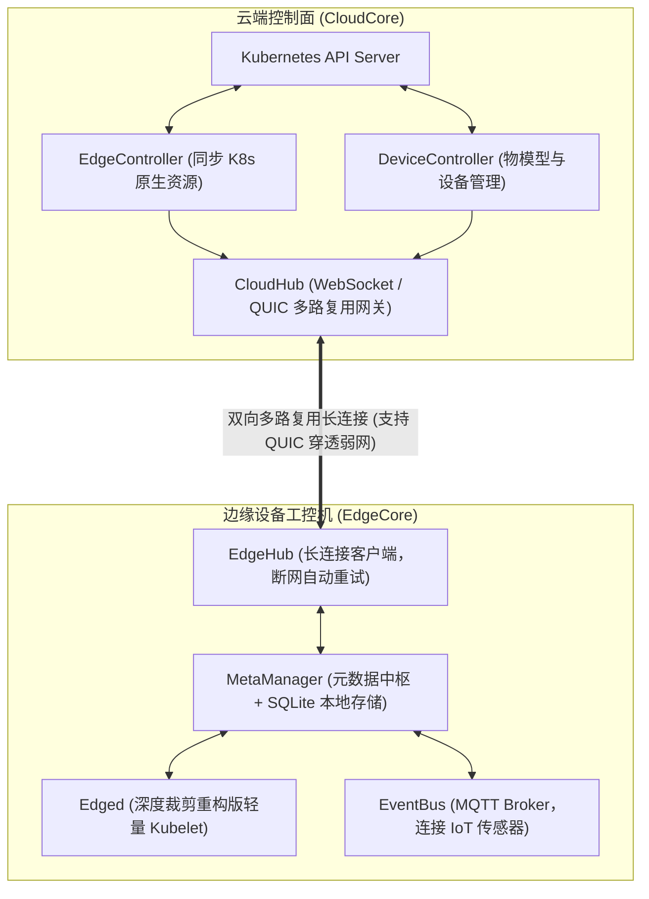
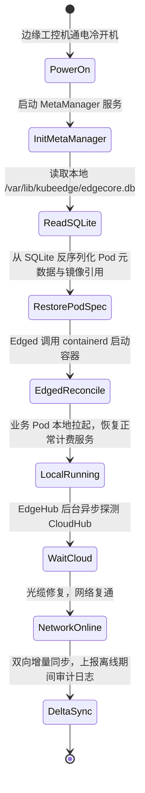

**TL;DR：** 标准 Kubernetes 是为数据中心内部“高带宽、低延迟、网络绝对可靠”的经典环境量身定制的。一旦将其直接搬到高速公路收费站、边缘无人机、智慧工厂或加油站等**边缘计算（Edge Computing）**场景，其默认假设便会全面崩溃：边缘与云端通过昂贵、脆弱的 4G/5G 或卫星通信互联，断网脱机往往长达数小时乃至数天。原生 K8s 在心跳丢失 40 秒（`node-monitor-grace-period`）后会将节点标记为 `NotReady`，并在 5 分钟后触发 Controller-Manager 的**暴力 Pod 驱逐**；更致命的是，一旦边缘工控机在断网期间遭遇断电重启，因无法连接云端 API Server，节点上的所有 Pod 将彻底瘫痪。为了攻克这一物理绝境，两大云原生边缘计算流派应运而生：以 **KubeEdge** 为代表的“深度裁剪重构派”（采用 CloudHub/EdgeHub 轻量级 WebSocket 异步通道与 SQLite 元数据持久化），以及以 **OpenYurt** 为代表的“云原生零侵入代理派”（保留原生 Kubelet，利用本地 YurtHub 反向代理透明劫持并缓存全量状态）。两者共同构建起边缘离线冷启动与网络复通双向合流的**极端自治状态机**。

---

## 一、 面试现场：从“断网 5 分钟业务被杀光”到“边缘脱机自主自治”的连环追问

```text
面试官提问：
  "我们在全国各地的 3000 多个加油站部署了基于 K8s 的边缘节点，运行着本地车牌识别与油枪计费程序。
   上周某省遭遇暴风雨光缆被挖断，当地 50 个加油站断网脱网了 4 个小时。
   结果云端控制面直接把这 50 个节点的 Pod 全驱逐了；而工控机在断电重启后，本地计费程序完全无法启动，加油站瞬间瘫痪。
   请问：
   1. 从 Kubernetes 内核状态机剖析，为什么原生 K8s 会做出这种‘自杀式驱逐’？简单调大心跳超时参数能彻底解决吗？
   2. 如果断网期间边缘设备意外重启，在没有任何网络连接 API Server 的情况下，本地节点如何把业务 Pod 重新拉起来？
   3. 对比业界主流方案（KubeEdge vs OpenYurt），它们在架构设计、侵入性与离线对账上有何异同？"
```

### 1.1 初级候选人的典型翻车点

许多没有真实边缘物联网运维经验的候选人，常常给出浮于表面的调参建议：
- **致命翻车一（以为调参就能治本）**：“把控制面 `kube-controller-manager` 的 `--pod-eviction-timeout` 改成 24 小时，节点就不会驱逐 Pod 了。”
  - **真相**：调大参数只能治标不治本。即使云端不执行驱逐，但如果边缘节点在断网期间**发生了硬件故障重启或断电复位**，原生 Kubelet 在启动时必须向云端 API Server 发起 `List-Watch` 同步 Pod 清单。此时由于无法联网，Kubelet 内存中没有任何数据，**它根本不知道本地应该运行哪些 Pod，节点将沦为空机，业务依旧死亡！**
- **致命翻车二（建议在每个加油站独立部署完整集群）**：“每个加油站直接部署一套微型 K3s 或单节点集群，自己管自己的 etcd。”
  - **真相**：极大地增加了运维复杂度与硬件成本。边缘工控机通常是 2 核 4GB 甚至 1 核 512MB 的嵌入式设备，跑不起完整的 etcd 集群；而且全国数千个独立小集群的镜像分发、配置升级、监控采集与安全合规将彻底沦为运维黑洞。必须坚持**“云端集中管控，边缘分布式自治”**的统一纳管模式。

### 1.2 资深工程师的破局切入点

资深边缘架构师必须能够画出云边网络断裂时的**时序冲突与四级防御模型**：



---

## 二、 云边协同的物理挑战：为什么原生 K8s 在边缘必然崩溃？

原生 Kubernetes 的设计哲学是**“强中心化与强一致性”**，这在边缘网络下产生了三处根本性的物理冲突：



1. **带宽耗尽灾难**：原生 K8s 使用 HTTP/2 流式长连接进行全量/增量 List-Watch。当边缘有数千节点时，网络微小震荡引发的大规模重新 List（Full Relist）会产生数百 MB 的元数据流量，瞬间挤爆昂贵的 4G 蜂窝计费网络；
2. **驱逐自杀逻辑**：云端控制器无法区分“节点网络断开但硬件正在正常运行”与“节点彻底报废”。在网络中断时，业务 Pod 本可以靠本地状态继续营业，但原生控制面强制判定死亡并将其杀掉；
3. **元数据无持久化缓存**：标准 Kubelet 不具备独立的本地数据库，所有的 Pod Spec、Secret、ConfigMap 均缓存在进程内存中。一旦断电重启，内存归零，节点立即陷入“失忆症”。

---

## 三、 KubeEdge 深度拆解：重构边缘运行时与轻量通信

KubeEdge 作为 CNCF 孵化的首个专门针对边缘计算的顶级项目，其核心哲学是**“云边解耦、彻底裁剪、重构边缘控制面”**。



### 3.1 核心组件的物理职能

1. **CloudHub & EdgeHub**：用基于 WebSocket 或 **QUIC（抗丢包与弱网连接迁移）** 的长连接通道替代原生的多端口 HTTP 轮询，支持数据压缩，相比原生节省 90% 以上的带宽；
2. **MetaManager 与本地 SQLite 数据库**：这是 KubeEdge 能够实现**极端自主自治的心脏**。所有云端下发的 Pod、ConfigMap、Secret、DeviceTwin 数据，首先被写入本地 SQLite 嵌入式数据库。
3. **Edged**：裁剪了原生 Kubelet 中与云端直接交互的冗余模块，转而只向本地 MetaManager 查询状态。

### 3.2 离线冷重启状态机

当加油站断电断网并重新来电时，KubeEdge 的冷恢复完全不依赖云端：



---

## 四、 OpenYurt 深度拆解：零侵入的 Yurt-Hub 本地代理哲学

与 KubeEdge“重构并替换 Kubelet”的激进路线不同，阿里巴巴主导开源的 **OpenYurt** 选择了完全不同的架构哲学——**“零侵入（Non-intrusive），拥抱原生”**。它保留了社区官方原汁原味的 Kubelet 二进制文件，在 Kubelet 与操作系统之间无缝注入了一个本地透明代理：**YurtHub**。

### 4.1 YurtHub 透明反向代理链路

在 OpenYurt 体系下，边缘节点上的标准 Kubelet、kube-proxy 以及各类 CNI 插件，不再直接访问云端的 `https://<api-server>:6443`，而是将 Master 地址配置为本地环回地址：`http://127.0.0.1:10261`（即 YurtHub 监听的端口）。

```mermaid
flowchart TB
    subgraph EdgeNode["边缘节点 Worker"]
        direction TB
        Kubelet["原生 Kubelet (未做任何代码修改)"]
        KubeProxy["原生 kube-proxy"]
        
        subgraph YurtHub["YurtHub (节点本地反向代理守护进程)"]
            ProxyRouter["反向代理路由引擎"]
            CacheManager["Cache Manager (本地文件/BoltDB 存储)"]
            FilterEngine["响应动态过滤器 (剔除无用字段节省带宽)"]
        end
        
        Kubelet -->|"请求发送至 127.0.0.1:10261"| ProxyRouter
        KubeProxy -->|"请求发送至 127.0.0.1:10261"| ProxyRouter
        ProxyRouter <--> CacheManager
        ProxyRouter <--> FilterEngine
    end

    subgraph CloudAPIServer["云端 Kubernetes API Server"]
        RemoteAPIS["kube-apiserver (6443)"]
    end

    ProxyRouter ==="正常模式：透明转发 + 异步落盘缓存Spec\n离线模式：阻断报错，直接从本地 Cache 构造响应"===> RemoteAPIS
```

### 4.2 YurtHub 双工作模式逆向

YurtHub 内部维护着严格的双模式切换状态机：

1. **在线模式（Cloud-Edge Connected）**：
   - 收到 Kubelet 的 `GET /api/v1/pods` 请求时，YurtHub 正常透传至云端 API Server；
   - 在 API Server 返回响应时，YurtHub 拦截数据流，将其异步序列化并持久化到本地磁盘（如 `/var/lib/yurthub/cache/` 下的 BoltDB）；
   - 同时内置 **Filter 机制**（如 `NodeSelectorFilter`），自动裁剪跨节点的无用 Endpoints，使下发到单个边缘节点的数据量缩小 80% 以上。
2. **断网离线模式（Offline Autonomy Mode）**：
   - 当探测到云端 API Server 超过阈值无法访问时，YurtHub 瞬间切换为**离线代理模式**；
   - 此时 Kubelet 发起的任何 List-Watch 请求，YurtHub 不会返回连接错误（如 502/Connection Refused），而是直接从本地 BoltDB 读取最后一次成功的快照，伪造并包装成合法的 K8s HTTP JSON 响应返回给 Kubelet；
   - **Kubelet 根本感知不到网络已经断开！** 它坚信 API Server 一直在线，因此绝不会做出异常行为。

### 4.3 单元化与节点池（NodePool）运维

OpenYurt 引入了 **NodePool（节点池）** 与 **YurtAppSet** 抽象：
将属于同一个加油站的 3 台工控机划为一个 NodePool。服务发现与流量调度被严格限制在 NodePool 内部闭环，彻底避免了跨区域公网调用与流量外溢。

---

## 五、 两大架构方案多维深度选型矩阵

在大厂 Staff / 资深架构师面试中，给出具体技术选型的因果边界是决定评级的关键：

| 评估维度 | 原生 Kubernetes (裸跑) | KubeEdge (重构派) | OpenYurt (零侵入派) |
| --- | --- | --- | --- |
| **底层 Kubelet 兼容性** | 100% 官方标准 | **深度重构**（使用裁剪版 Edged，与原生 Kubelet 存在版本落差） | **100% 原生无缝**（直接使用官方 Kubelet 二进制） |
| **本地状态存储引擎** | 无持久化（纯内存，断电即失忆） | **SQLite** 数据库（轻量级嵌入式关系存储） | **BoltDB / 本地文件**（以 URL Hash 为 Key 的 KV 缓存） |
| **硬件资源底噪** | 内存要求 $\ge 1\text{GB}$ | **极低**（EdgeCore 运行仅需 $\sim 70\text{MB}$ 内存） | **中等**（原生 Kubelet + YurtHub $\sim 150\text{MB}$ 内存） |
| **南向物联网协议支持** | 仅支持标准容器 | **原生支持**（内置 MQTT Broker、DMI、Modbus/BACnet 物模型驱动） | 侧重标准容器化编排，物联网协议需自行接入 |
| **架构升级维护风险** | 零边缘适配风险 | 升级需同步维护 KubeEdge 社区版本，生态绑定较深 | **极低**，随时可以卸载 YurtHub 退化为纯原生 K8s |
| **典型落地场景** | 仅适合同机房有专线的本地集群 | 小型化 IoT 硬件、车载边缘设备、变电站嵌入式网关 | 大规模 CDN 边缘节点、大型智慧园区、传统多数据中心改造 |

---

## 六、 面试通关复盘与架构师高分回答模板

### 6.1 现场 2 分钟极速电梯演讲

> “面试官，标准 Kubernetes 在边缘断网场景下的‘自杀式驱逐’，本质是其强一致性假设与边缘物理约束的错配所致。
> 
> 在架构治理上，必须建立完整的**‘四级边缘自治防线’**：
> 1. **控制面防驱逐兜底**：在云端通过自定义 Admission Webhook 或配置 `node-lifecycle-controller`，为边缘节点打上自主标记，当处于断网 `NotReady` 时强制屏蔽污点驱逐；
> 2. **数据面元数据持久化**：这是边缘冷启动的核心。我们必须打破 Kubelet 无持久化缓存的缺陷。选型上我们分为两类方案：
>    - 对于硬件资源极度受限（< 512MB）、且需要管理南向 MQTT 物联网传感器的场景，选择 **KubeEdge**。它基于 QUIC 双向复用通道与本地 SQLite，彻底重构轻量 Edged，实现单机 70MB 的极致底噪与断网冷自愈；
>    - 对于希望保持与原生 K8s 社区 100% 兼容、无侵入升级的场景，选择 **OpenYurt**。利用本地 **YurtHub** 代理透明拦截 Kubelet 请求，在断网时以 BoltDB 本地快照伪造 API Server 响应，使原生 Kubelet 完全无感维持本地运行；
> 3. **网络恢复后的双向合流状态机**：当云边重新通网后，边缘代理以 ResourceVersion 增量断点续传（Delta Sync）方式对账，避免百万长连接瞬间击垮云端 API Server。”

### 6.2 生产面试关键避坑守则

1. **镜像本地持久化策略（Image Pull Policy）**：边缘所有 Pod 的 `imagePullPolicy` 必须强制配置为 **`IfNotPresent`**，绝不能配为 `Always`！否则一旦在断网期间 Pod 异常崩溃，Kubelet 会固执地尝试去公网 Registry 拉取镜像，直接导致重启失败并挂死在 `ImagePullBackOff`；
2. **边缘存储的 HostPath 锁定**：边缘设备断网时无法挂载云盘（如 AWS EBS / 阿里云网盘）。边缘状态必须依赖本地存储（`hostPath` 或基于本地盘的 Local PV），并在调度时利用节点亲和性（NodeAffinity）牢牢固定拓扑；
3. **证书离线长效期设计**：原生 K8s 节点证书默认 1 年自动轮换。在边缘极端弱网下，必须将边缘本地客户端证书有效期适当拉长，或在 YurtHub/EdgeHub 中内嵌离线证书自签与自动热加载逻辑，严防由于断网跨过证书过期窗口导致无法重连；
4. **防并发惊群雪崩**：当大型暴风雨过后数千个边缘节点同时通网时，若所有节点同时向云端拉取配置，会直接打爆云端 etcd。EdgeHub/YurtHub 必须配置**全抖动指数退避重连算法（Full Jitter Backoff）**，实现优雅削峰错峰接入。

---

## 参考资料与权威规范

1. KubeEdge Documentation. *Edge-Cloud Communication & Offline Autonomy Architecture*. CNCF Graduated Project.
2. OpenYurt Authors. *YurtHub: Node-Daemon for Edge Autonomous Computing*. CNCF Incubating Project.
3. Kubernetes Enhancement Proposal. *KEP-557: Node-Lease Architecture and Controller-Manager Heartbeat Optimization*.
4. CNCF IoT-Edge Working Group. *Cloud Native Edge Computing Whitepaper*.
5. SQLite Consortium. *SQLite Architecture and In-Process ACID Guarantees on Embedded Linux*.
