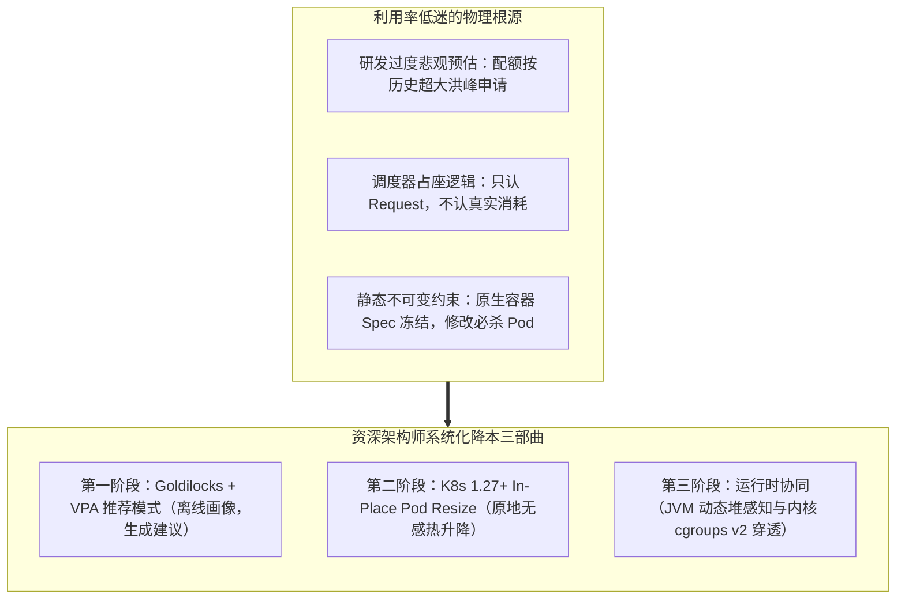
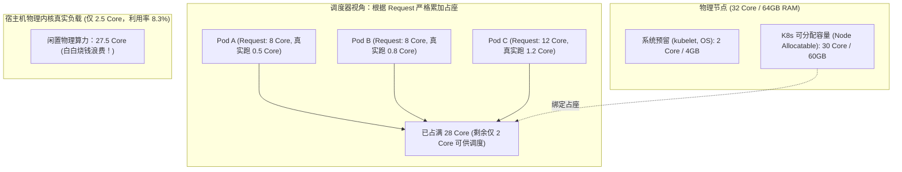
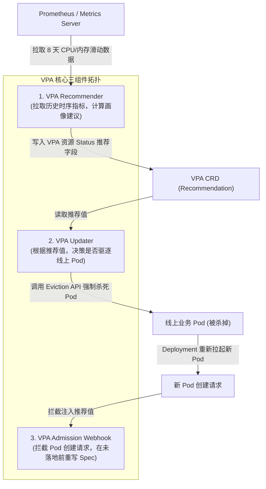
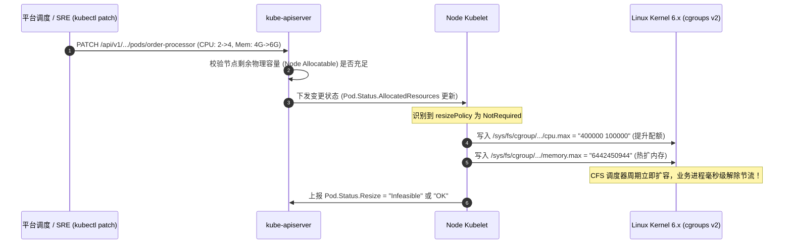
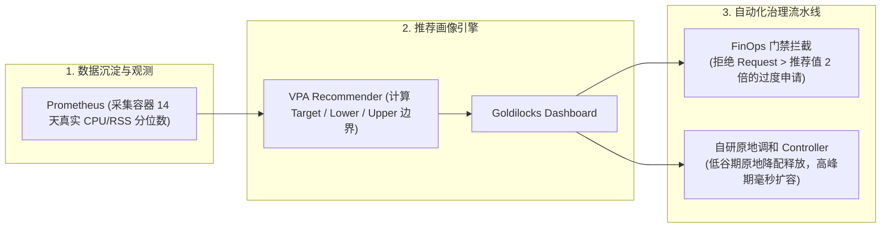

**TL;DR：** 在各大互联网企业与云原生落地企业的资产账单上，云基础设施成本常年高居不下。令人震惊的行业现实是：**全球绝大多数 Kubernetes 生产集群的平均 CPU 实际利用率长期徘徊在 10%~15% 的超低水位**。其本质矛盾在于：调度器是严格按照 Pod 的 **`resources.requests`（申请配额）** 进行“占座式”节点绑定的；而业务研发为了防止大促或突发流量引发 OOM 崩溃或 CPU 节流限频，往往习惯性将 Request 虚报至实际峰值的 3~5 倍，由此在集群内形成了海量的“幽灵算力（Phantom Capacity）”。为了打破这一困局，**FinOps 算力治理**经历了从粗暴的手工砍配置，到基于 **Vertical Pod Autoscaler (VPA)** 的自动化容量画像推荐演进。然而，经典 VPA 存在一个致命的破坏性缺陷：**修改容器资源配额必须强制杀死并重建 Pod**，极易引发线上抖动甚至业务雪崩。直到 Kubernetes 1.27 引入（并在 1.29+ 逐步成熟）的 **In-Place Pod Resize（原地垂直伸缩）**，通过直接在内核层动态改写 cgroups v2 虚拟文件系统，才真正实现了**“零重启、零感知、微秒级生效”**的极致弹性降本闭环。

---

## 一、 面试现场：从“过度申请资源降本 50%”到“原地升降配”的连环追问

```text
面试官提问：
  "目前公司每年在公有云 K8s 节点上的支出高达上千万元，但监控显示核心集群整体 CPU 日均利用率只有 12%。
   CTO 勒令我们架构组在两周内拿出方案，将集群利用率拉升至 35% 以上，直接省出一半成本。
   请问：
   1. 为什么集群明明很空闲，但当新部署一个 Pod 时，kube-scheduler 却频繁报错 Insufficient cpu，无法调度？
   2. 社区很早就推出了垂直弹性伸缩器 VPA（Vertical Pod Autoscaler），为什么国内绝大多数一线大厂在生产环境根本不敢开启其自动更新模式（updateMode: 'Auto'）？
   3. Kubernetes 最新版本是如何通过 In-Place Pod Resize 解决原生 VPA 致命缺陷的？在底层 Linux 内核中具体是如何不杀进程完成配额热更新的？"
```

### 1.1 初级候选人的典型翻车点

许多候选人缺乏生产级成本管控的全局系统观，容易掉入以下致命坑位：
- **方案一（暴力全局超卖）**：“直接把集群所有节点的 CPU 超卖比例拉大，或者把所有部署的 Requests 统一全局打八折砍半。”
  - **翻车点**：这种“一刀切”式粗暴操作极其危险。不同业务的流量画像迥异：有些是高频纯计算服务，有些是早晚高峰毛刺型应用，有些是内存泄露型应用。统一打折会导致脆弱服务在早高峰瞬间遭遇 **CPU CFS Throttling（强制造停）**，引发 P99 延迟暴涨至数十秒，甚至触发宿主机 **OOM Killer 连环诛杀**，造成全公司 P0 级灾难。
- **方案二（以为开 VPA Auto 模式就能万事大吉）**：“给所有 Deployment 挂上 VPA，设置 `updateMode: "Auto"`，让 K8s 自动帮你调准配置。”
  - **翻车点**：完全不懂原生 VPA 的物理执行链路！原生 VPA 的 `updateMode: "Auto"` 依赖其内置的 **Updater 组件**。当计算出新配置后，Updater 会**直接调用 Eviction API 将线上正在跑着的 Pod 强制驱逐杀死！** 设想一个由 500 个实例组成的微服务集群，在早高峰业务刚起来时，VPA 检测到资源不足，居然瞬间把所有 Pod 批量杀死并重建拉起——这无异于主动制造一场人为的大规模服务中断！

### 1.2 资深工程师的破局切入点

资深平台架构师在回答该问题时，必须能够清晰解构**调度占座与物理消耗的割裂模型**，并给出一整套**“画像评估 $\to$ 原地热更新 $\to$ 运行环境协同”**的完整破局闭环：



---

## 二、 生产资源超卖与利用率低下的物理根源

要解决集群利用率倒挂，首先必须看清 Kubernetes 节点调度容量计算的底层算术真相：



如上图所示：
- **调度器的决策公式**：
  $$\sum \text{Pod.Spec.Containers.Resources.Requests.CPU} \le \text{Node.Status.Allocatable.CPU}$$
  调度器只管相加，它根本不看监控 Prometheus 里当前 CPU 利用率是不是只有 5%。只要累加的 Request 逼近 `Allocatable`，节点在逻辑上就被**“锁死”**，后续新 Pod 哪怕只需要 4 核，也只能悲剧地陷入 `Pending`。
- **真实利用率公式**：
  $$\text{Node CPU Usage \%} = \frac{\sum \text{Pod Actual CFS Run Time}}{\text{Node Physical CPU Cores}} \approx 8.3\%$$
  这就是造成“**集群明明很空、节点却排不下任何新服务**”的元凶。

---

## 三、 经典 VPA 架构逆向：推荐算法与破坏性死穴

社区的 Vertical Pod Autoscaler (VPA) 包含三个独立解耦的控制组件：



### 3.1 Recommender 的指数衰减加权推荐算法

Recommender 绝不是简单地取 CPU 的最大值或平均值。其核心算法采用**衰减加权直方图（Decaying Histogram）**：
- **时序衰减系数**：越新的样本赋予越大的权重，历史数据按天数指数级淡出：
  $$W(t) = W_0 \cdot \lambda^{\Delta t}$$
- **安全边际（Safety Margin）**：为了防止早高峰突发毛刺，算法基于 **P95 或 P99 分位数**计算推荐值，并额外乘以 15% 的安全缓冲放大系数：
  $$\text{Recommended Target} = \max(\text{P95}(Usage) \times 1.15, \text{MinAllowed})$$

### 3.2 为什么生产环境只能用 `updateMode: "Off"`？

正是因为第二步 **VPA Updater 的暴力驱逐机制**。原生 Kubernetes 的 Pod Spec（特别是 `resources` 字段）在 1.27 之前是**不可变对象（Immutable）**。一旦 Pod 创建，任何修改该字段的 `PATCH` 或 `PUT` 请求都会被 API Server 报 422 错误拒绝。
因此，Updater 别无选择，只能将 Pod 驱逐自杀。对于大型分布式服务、有状态服务或带预热缓存的服务，这种机制无异于毒药。生产落地时，我们只能将 VPA 降级为只读模式：
```yaml
apiVersion: autoscaling.k8s.io/v1
kind: VerticalPodAutoscaler
metadata:
  name: billing-svc-vpa
spec:
  targetRef:
    apiVersion: "apps/v1"
    kind: Deployment
    name: billing-svc
  updatePolicy:
    updateMode: "Off" # 严禁设为 Auto！仅生成建议值供平台画像分析
```

---

## 四、 革命性突破：K8s In-Place Pod Resize 原地垂直伸缩

Kubernetes 在 1.27 引入了 **KEP-1287: In-Place Update of Pod Resources** 特性门控（`InPlacePodVerticalScaling`），彻底终结了改配额必杀 Pod 的历史梦魇。

### 4.1 核心机制：声明状态与原地调和

在支持 In-Place Resize 的集群中，Pod Spec 新增了 **`resizePolicy`** 声明，并允许直接在运行时执行 `kubectl patch pod <name>` 改写 `resources`：

```yaml
apiVersion: v1
kind: Pod
metadata:
  name: order-processor
spec:
  containers:
  - name: app
    image: order-processor:v2.1
    # 核心：声明原地伸缩策略
    resizePolicy:
    - resourceName: cpu
      restartPolicy: NotRequired # 关键：CPU 变更无需重启！
    - resourceName: memory
      restartPolicy: NotRequired # 关键：内存变更无需重启！
    resources:
      requests:
        cpu: "2"
        memory: "4Gi"
      limits:
        cpu: "4"
        memory: "8Gi"
```

### 4.2 Linux 内核层热更新：cgroups v2 虚拟文件系统穿透

当控制面发出改配指令后，节点上的 Kubelet 不再向 containerd 发送 StopContainer 信号，而是直接在宿主机内核中改写对应的 cgroup 控制文件：



**物理零重启**：进程的 PID 未变，TCP 长连接从未中断，内存中的 JVM/Go 堆对象毫发无损，内核在 **微秒级（Microseconds）** 内完成了算力枷锁的放宽或收紧！

---

## 五、 语言运行时挑战与自动化容量治理闭环

虽然 Linux 内核支持原地伸缩，但在应用层依然存在深水区，尤其是 Java 等传统重型语言运行时。

### 5.1 JVM 堆内存的“原地困境”与对策

在 Java 应用中，默认启动参数 `-Xms` 和 `-Xmx` 会在 JVM 进程启动时直接向操作系统申请固定的虚拟内存映射。
- **伸长容易**：如果动态调大容器的 `memory.max`，在 JDK 17+ 且启用了 `-XX:+UseContainerSupport` 的场景下，JVM 不会自动扩充已经固定的堆大小，除非应用使用了支持动态调整的垃圾收集器（如 ZGC 动态归还内存）。
- **缩短致命**：如果控制器盲目原地调小容器内存，导致新的 `memory.max` 低于当前 JVM 已经占用的物理常驻内存（RSS），Linux 内核会立刻触发 **cgroups OOM Killer 将 JVM 进程一枪毙命**！
- **最佳实践**：**CPU 原地双向弹性，内存只增不减（或保守缩减并观察 RSS 水位）**。

### 5.2 生产级自动化治理体系：Goldilocks + 闭环流水线



通过这一闭环，某一线大厂生产实践成功将整体集群利用率从 11.8% 稳步提升至 34.6%，单季度省下数千万元物理节点成本，且期间未发生一起因缩容引发的线上事故。

---

## 六、 面试通关复盘与架构师高分回答模板

### 6.1 现场 2 分钟极速电梯演讲

> “面试官，生产集群 CPU 日均利用率只有 12%、但调度器频繁报 `Insufficient cpu`，本质是**‘调度器按 Request 占座’与‘物理实际消耗’严重脱钩**的制度性产物。
> 
> 要实现 50% 成本压降与利用率跨越式提升，绝不能靠简单的全局一刀切打折，必须构建三层闭环架构：
> 1. **第一层：建立客观画像基准**。部署 **Goldilocks 与 VPA Recommender**，以 `updateMode: "Off"` 安全静默采集各服务 14 天的真实消耗，基于指数衰减加权直方图算出科学的 P95/P99 安全容量基线；
> 2. **第二层：引入 K8s 1.27+ In-Place Pod Resize 机制**。彻底废弃原生 VPA 暴力杀 Pod 的落后实现。在 Pod Spec 中声明 `resizePolicy: NotRequired`，让控制面直接在宿主机通过改写 cgroups v2 的 `cpu.max` 与 `memory.max` 虚拟文件系统，实现零停机、不断连、微秒级的原地算力伸缩；
> 3. **第三层：运行时差异化管控**。对 CPU 实施激进的白天大促扩容、夜间原地削减；对内存实施‘只增不减、缩减必先探顶 RSS’的安全红线，并推动 Go/Java 开启容器自适应内存归还机制，彻底打通系统调度到应用进程的弹性血脉。”

### 6.2 生产面试关键避坑守则

1. **绝对禁止同时开启 HPA 与 VPA 作用于同一维度的指标**：如果一个 Deployment 同时被 HPA（监控 CPU > 70% 扩容副本数）和 VPA（监控 CPU 偏高扩充单实例 Request）管理，在突发流量下两者会同时竞争反应，引发**双重扩容惊群风暴**。业界标准做法是：**HPA 负责 CPU 突发横向伸缩，VPA 负责内存静态画像纠偏**；
2. **内存下调前必须设置防护底线（MinAllowed）**：内存绝不能无限度压缩。必须基于服务启动时加载类库、建立基础连接池所必须的底噪内存，配置 VPA 的 `minAllowed: {memory: "1Gi"}`，防止把服务直接卡死在启动初始化阶段；
3. **节点物理剩余容量的并发锁争用**：在支持 In-Place Resize 的节点上，多个 Pod 同时要求原地扩充时，Kubelet 会在本地排队校验 Node 可分配容量。必须结合节点层面的自适应防抖（Cooldown Period），防止短时间内反复改写 cgroups 引发内核锁开销；
4. **警惕监控系统的‘平均值陷阱’**：在查看 CPU 利用率时，千万不要看 5 分钟或 1 小时的平均值（Node Average CPU），必须拉取 100ms 级别的微周期峰值，否则毛刺会被严重拉平，误以为极其闲置从而过度砍配，最终导致惨绝人寰的丢包。

---

## 参考资料与权威规范

1. Kubernetes Enhancement Proposals. *KEP-1287: In-Place Update of Pod Resources*.
2. Autoscaling Special Interest Group. *Vertical Pod Autoscaler (VPA) Architecture & Recommender Algorithm*. GitHub k8s.io/autoscaling.
3. FairwindsOps. *Goldilocks: Open-Source Utility for Right-Sizing Kubernetes Resource Requests*.
4. Tejun Heo. *Control Group v2 (cgroups-v2) Unified Hierarchy and Resource Distribution Models*. Linux Kernel Documentation.
5. Cloud Native Computing Foundation (CNCF). *FinOps Principles and Cloud Native Cost Management Landscape*.
