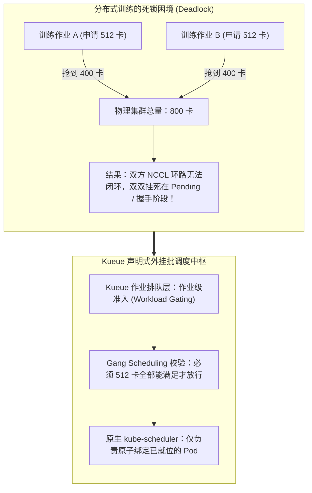
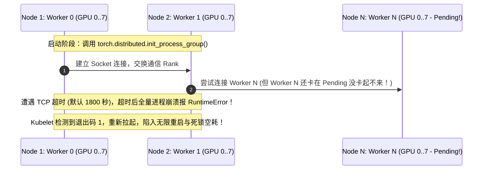
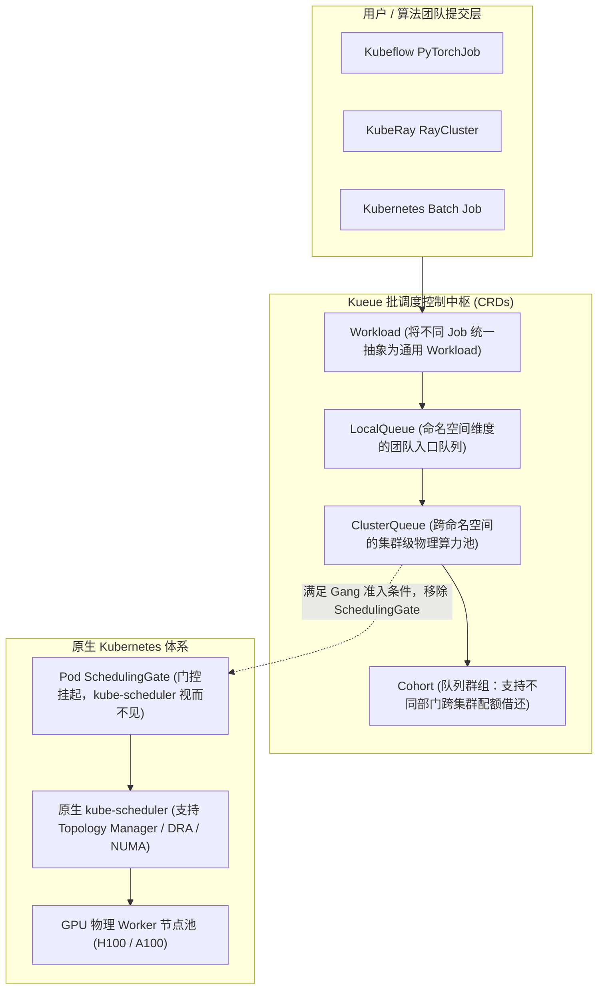
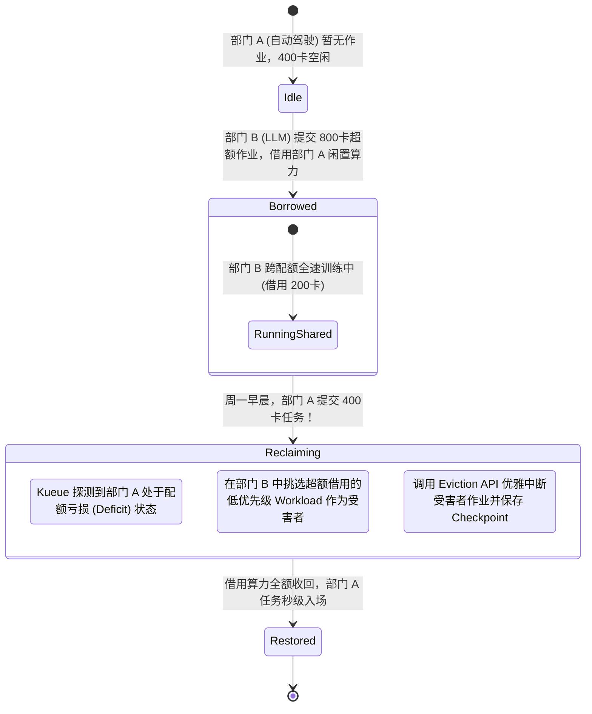

**TL;DR：** 标准 Kubernetes 调度器（kube-scheduler）从第一天起就是为了**微服务无状态应用**设计的——其核心假设是“每个 Pod 都是独立的，先来先调度，能起几个算几个”。然而，在进入 2024~2026 年大模型百亿/千亿参数分布式训练时代后，这一假设引发了灾难性的**调度死锁（Deadlock）**：分布式训练作业（如 64 个 Worker、共需 512 张 GPU 卡）必须**全部同时就位**才能建立 NCCL AllReduce 通信环；如果作业 A 抢到了 300 张卡，作业 B 抢到了 250 张卡，两者各执一半且互不相让，集群便彻底陷入“零产出、空烧钱”的资源冻结状态。为了终结这一乱象，Kubernetes 官方联合 CNCF 推出了新一代批调度中枢——**Kueue（k8s.io/kueue）**。Kueue 在不侵入替换底层 kube-scheduler 的前提下，从更上层的**作业控制平面（Job-level Orchestration）** 引入了 **Gang Scheduling（全有或全无调度）**、**层级队列（LocalQueue / ClusterQueue）** 与 **Cohort 跨团队算力借用/抢占（Borrowing & Preemption）状态机**，成为现代万卡 AI 智算中心最核心的算力中枢。

---

## 一、 面试现场：从“万卡集群空转死锁”到“Kueue 算力中枢”的连环追问

```text
面试官提问：
  "我们在千卡 H100 集群上同时运行算法团队的多个分布式大模型预训练作业（如 PyTorchJob 和 Ray 集群）。
   上周五晚上两个团队同时提交了 512 卡训练作业，结果到了周六早晨一看：
   两个作业一个都没跑起来，各自卡死在 init_process_group 握手阶段，1000 多张卡空转烧了整整一晚上！
   请问：
   1. 原生 Kubernetes 为什么会在这种批处理场景下发生经典的‘哲学家就餐式死锁’？
   2. 业界有 Volcano、YuniKorn 和官方推进的 Kueue，为什么现代大厂越来越倾向于在 kube-scheduler 之上外挂 Kueue 架构？
   3. 深入拆解 Kueue 的核心调度机制：它是如何实现全有或全无（Gang Scheduling）的？队列群组（Cohort）是如何实现跨部门算力‘闲时借用、忙时归还/抢占’的？"
```

### 1.1 初级候选人的典型翻车点

初中级候选人往往停留在“增加资源配额（ResourceQuota）”或“手工排期”的浅层经验：
- **方案一（以为设 ResourceQuota 就能防死锁）**：“在每个团队的 Namespace 上配置 `ResourceQuota: 512 GPUs`，卡住总量。”
  - **翻车点**：完全不懂 ResourceQuota 的物理执行逻辑。ResourceQuota 是静态累加硬拦截；如果团队 A 提交了 400 卡作业，团队 B 提交了 400 卡作业，集群总共有 512 卡，两个作业的 Pod 都能通过 API Server 校验成功创建。接下来 kube-scheduler 开始逐个节点调度，最终导致两个作业分别有部分 Pod 调度成功绑卡、另一部分 Pod 处于 Pending——**死锁依旧 100% 发生！**
- **方案二（推倒原生调度器换 Volcano）**：“原生调度器不行，必须全盘废弃 kube-scheduler，换成第三方专用的 Volcano 或 YuniKorn 替换调度器。”
  - **翻车点**：这种侵入式替换带来了极大的架构迁移风险。替换调度器会导致原生生态（如 Karpenter 自动扩容、Cluster Autoscaler、Topology Manager 亲和性插件、DRA 动态资源分配）全部失效或严重割裂，版本升级困难重重。

### 1.2 资深工程师的破局切入点

资深平台架构师在被问及该场景时，必须能够清晰解构**作业级编排与单 Pod 绑定的分层模型**，推导 Kueue 的优雅解耦范式：



---

## 二、 分布式训练的物理本质：为什么必须“全有或全无”？

在大模型分布式训练中（如基于 NVIDIA Megatron-LM 或 DeepSeek-V3），进程之间并非各自独立处理业务，而是通过 **NCCL（NVIDIA Collective Communications Library）** 组织成跨节点的物理通信环路（Ring AllReduce / Tree AllReduce）。



**物理铁律**：对于分布式训练作业，**可用性是离散布尔值（0 或 1）**。拿到 99% 的资源等于 0，少跑一个 Pod，整个千卡作业都无法产生任何梯度迭代！因此，必须在**作业（Job / Workload）维度**实现原子准入控制——即 **Gang Scheduling（成组调度）**。

---

## 三、 Kueue 核心架构与解耦哲学：零侵入的高维编排

与直接替换 `kube-scheduler` 的传统批调度器不同，**Kueue（k8s.io/kueue）** 的设计哲学是**“正交解耦（Orthogonal & Non-Intrusive）”**：
- **上层 Kueue 负责“何时放行作业（When to admit a Job）”**；
- **底层 kube-scheduler 负责“把具体 Pod 放置在哪台宿主机（Where to bind a Pod）”**。



### 3.1 核心原语：SchedulingGates 巧妙化解抢跑

Kueue 之所以能够不修改 kube-scheduler 源码就实现防死锁，核心在于利用了 Kubernetes 原生特性——**SchedulingGates（调度门控）**。
1. 当研发提交一个 `PyTorchJob` 时，Kueue 的 Webhook 会在所有的 Pod Spec 中注入一个门控：
   ```yaml
   spec:
     schedulingGates:
     - name: kueue.x-k8s.io/admission
   ```
2. 原生的 `kube-scheduler` 看到这个 Pod 带有未解开的 SchedulingGate，会**完全忽略该 Pod，根本不会尝试为其寻找节点或抢占资源**；
3. Kueue 内部的控制器开始在 `ClusterQueue` 中排队计算：只有当集群中有足够的空闲配额满足整个作业全部 512 张卡时，Kueue 才会发出原子指令，批量解开该作业所有 Pod 的门控；
4. `kube-scheduler` 瞬间接管这批完全就绪的 Pod，并在几秒钟内完成物理节点的绑定！

---

## 四、 队列群组（Cohort）与算力借用/抢占状态机

在真实企业中，最昂贵的莫过于算力闲置。比如：自动驾驶部门分配了 400 张卡，大语言模型部门分配了 600 张卡。周日白天自动驾驶部门没有任何训练任务，这 400 张卡能否借给大模型部门跑紧急任务？周一自动驾驶团队上班提交任务时，又如何平滑收回？

Kueue 引入了 **Cohort（队列群组）** 模型，定义了严密的**算力借用与抢占（Borrowing & Preemption）状态机**：



### 4.1 借用机制（Borrowing）的数学表达

在 `ClusterQueue` 配置中，可以定义基础名义配额（`nominalQuota`）与借用上限（`borrowingLimit`）：

$$\text{Max Capacity} = \text{nominalQuota} + \text{borrowingLimit}$$

```yaml
apiVersion: kueue.x-k8s.io/v1beta1
kind: ClusterQueue
metadata:
  name: llm-team-cq
spec:
  cohort: ai-super-cohort # 加入统一的算力联邦
  resourceGroups:
  - coveredResources: ["nvidia.com/gpu"]
    flavors:
    - name: "h100-flavor"
      resources:
      - name: "nvidia.com/gpu"
        nominalQuota: 600       # 基础保底卡数
        borrowingLimit: 400     # 允许最多向兄弟部门借 400 卡
  preemption:
    reclaimWithinCohort: Any    # 当本部门缺卡时，允许从 Cohort 中回收算力
    withinClusterQueue: LowerPriority # 允许本队列内高优先级抢占低优先级
```

---

## 五、 2025/2026 演进新篇：Kueue 与全拓扑感知的化学反应

在 2025 年的生产实践中，Kueue 不仅管“数量”，更进一步与 **Topology-Aware Scheduling（拓扑感知调度）** 和 **DRA（动态资源分配）** 深度融合：
1. **多层机架拓扑绑定（Multi-Rack Topology）**：大模型训练不仅要 512 张卡，更要求这 512 张卡必须收敛在**同一个 NVLink 交换机（NVLink Switch）域或同一组 Spine 交换机下**，否则跨机房网络延迟会拖垮全局速度。Kueue 能够感知拓扑结构，直接在 Workload 准入阶段确保整机分配；
2. **容灾断点续训（Checkpoint-Aware Eviction）**：当发生借用抢占（Preemption）时，Kueue 会向受害者容器发送 `SIGTERM`，并预留充足的 `terminationGracePeriodSeconds: 180`，确保受侵害的 PyTorch 任务将最新的权重权重写入分布式存储，实现 100% 无损断点续训。

---

## 六、 面试通关复盘与架构师高分回答模板

### 6.1 现场 2 分钟极速电梯演讲

> “面试官，大模型分布式训练场景下发生‘哲学家就餐式死锁’，本质是因为**Kubernetes 原生调度器基于单 Pod 独立贪心决策，无法满足分布式训练对资源‘全有或全无（All-or-Nothing）’的硬性离散要求**。
> 
> 在千卡集群的生产治理中，我们坚决反对推倒原生调度器的重型方案，而是采用 CNCF 官方推崇的新一代批调度中枢 **Kueue** 构建两层解耦架构：
> 1. **在调度准入层引入 Gang Scheduling**：利用原生 `SchedulingGates` 将所有 Pod 挂起，由 Kueue 在上层统一管理作业级生命周期。只有当全量 512 张 GPU 物理配额全部满足时，才原子化解开门控放行给 `kube-scheduler`，从数学上 100% 根除局部死锁；
> 2. **在团队资源层构建 Cohort 弹性借还体系**：通过将多部门的 `ClusterQueue` 编入同一个 Cohort，在业务低谷期自动允许兄弟团队借用闲置算力，将集群整体 GPU 利用率拉升至 85% 以上；
> 3. **在抢占收回层配套无损降级**：当原属部门提交任务时，触发确定性抢占状态机，精准剔除借用配额的低优先级任务，并预留 3 分钟优雅停机窗口让训练框架完成 Checkpoint 刷盘，实现企业级算力利用率与研发体验的完美共赢。”

### 6.2 生产面试关键避坑守则

1. **绝对禁止作业中不同 Pod 填错数量申明**：Gang 调度依赖 Workload 准确声明预期 Pod 数量。如果在 PyTorchJob 中期望 64 个节点，但配置失误写成了 65，Kueue 会永远等待第 65 个节点而导致整个作业无限期挂起（Hang）；
2. **严防抢占抖动（Preemption Churn）**：配置借用策略时，必须配置 `reclaimWithinCohort` 的冷却防抖窗口（Cooldown），避免两个作业在临界点反复互相杀死对方的 Pod，造成网络流量暴增与算力归零；
3. **区分训练任务与推理任务的队列隔离**：推理服务（Serving）具有严格的 SLA 与实时性，必须绑定在专有独立队列，严禁与支持抢占的 Batch 训练任务混排在同一个无优先级的 Cohort 中；
4. **底层与 DRA 动态资源协同**：在启用 Kubernetes 1.31+ 的 DRA（动态资源分配）场景下，确保 Kueue 的版本升级至 v0.8+，使其原生理解 ResourceClaimTemplate，避免由于底层驱动资源未申报导致上层队列虚假放行。

---

## 参考资料与权威规范

1. Kubernetes SIG-Scheduling. *Kueue: Kubernetes-native Job Queueing Controller Documentation*. k8s.io/kueue.
2. Kubernetes Enhancement Proposal. *KEP-3521: Pod Scheduling Readiness and Scheduling Gates*.
3. NVIDIA Corporation. *PyTorch Distributed Training & NCCL Architecture Reference*.
4. CNCF Batch Working Group. *Cloud Native Batch & Distributed AI Scheduling Whitepaper*.
5. Kuadrant & Kueue Authors. *Multi-Cluster Quota and Resource Borrowing in Modern AI Clusters*.
