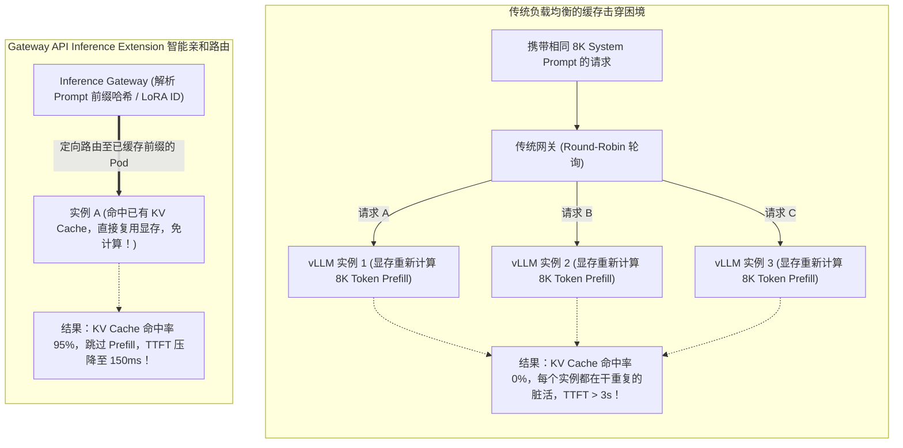
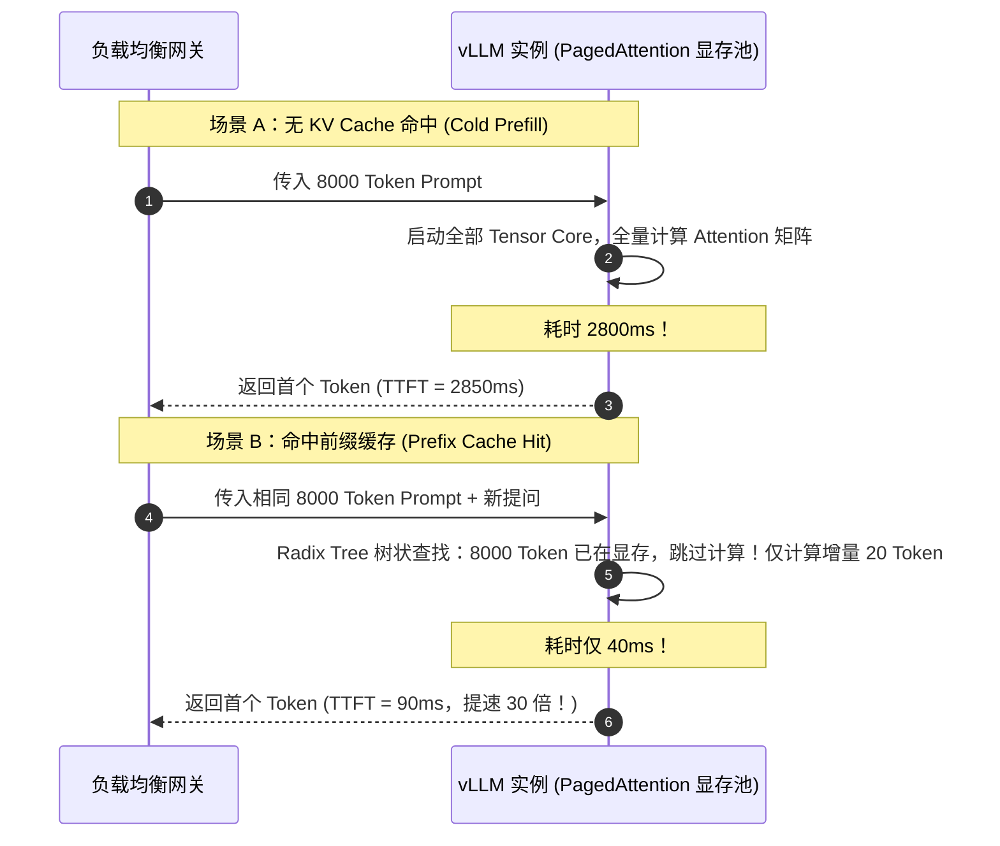
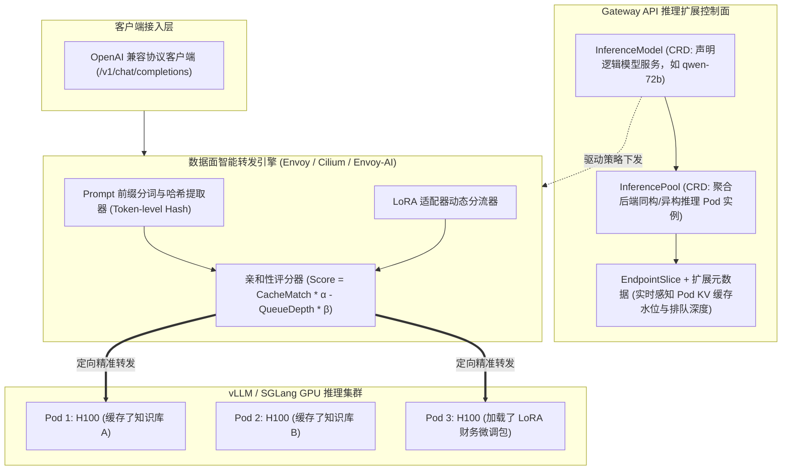
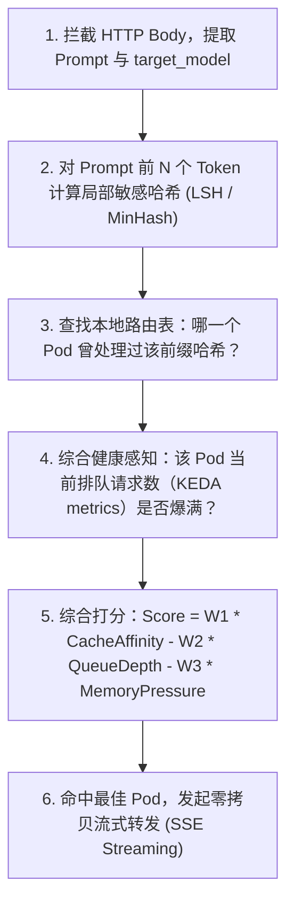

**TL;DR：** 随着以 vLLM、SGLang、TGI 为代表的现代高吞吐大模型推理引擎成为生产标配，Kubernetes 网络架构正经历自 Ingress 诞生以来最深刻的一场范式转移。传统的通用反向代理（Nginx、Envoy、HAProxy）完全不理解大模型推理的底层物理特性：在生成式 AI 场景下，**首字延迟（TTFT - Time to First Token）绝大多数消耗在 Prompt 的 Prefill（预填充计算）阶段**；而 Prefill 计算可以通过 **KV Cache 前缀缓存（Prefix Caching / PagedAttention）** 避免多达 90% 的重复计算！如果上游网络网关采用传统的轮询（Round-Robin）或最少连接（Least-Conn）策略，会将携带相同 System Prompt 的请求随机分发到不同的 GPU 实例上，**导致后端实例的显存 KV Cache 命中率直接跌入冰点**。为此，Kubernetes SIG-Network 正式孵化了专为大模型量身定制的下一代标准——**Gateway API Inference Extension（`gateway-api-inference-extension`）**。该扩展引入了 **模型感知路由（Model-aware Routing）**、**前缀缓存亲和性算法（Prefix-Cache-Aware Load Balancing）** 与 **动态 LoRA 适配器感知分流**，彻底打破了传统网络网关与 GPU 显存物理状态之间的信息孤岛。

---

## 一、 面试现场：从“首字延迟飙升 3 秒”到“前缀缓存路由”的连环追问

```text
面试官提问：
  "我们在 K8s 集群中部署了由 30 个 Pod 组成的 vLLM 推理服务，跑着 Qwen-72B 模型，上游挂载标准 Gateway API 网关。
   业务反馈：用户对话包含长达 8000 Token 的系统设定（System Prompt）和长篇知识库。
   单个 Pod 本地压测时，首字延迟（TTFT）仅需 200 毫秒；但一旦上线接入网关多实例集群后，TTFT 瞬间暴涨到 3.5 秒！
   请问：
   1. 从大模型注意力机制与 GPU 显存物理视角分析，为什么标准七层负载均衡会导致 TTFT 发生断崖式暴跌？
   2. 为什么简单的 IP 哈希（IP-Hash）或会话保持（Sticky Session）无法解决长文本多轮对话与知识库 RAG 的路由痛点？
   3. Kubernetes 官方最新的 Gateway API Inference Extension 是如何设计的？它的底层路由算法是如何感知后端 Pod 的 KV Cache 命中状态与 LoRA 适配器的？"
```

### 1.1 初级候选人的典型翻车点

许多缺乏底层大模型推理系统认知、只懂传统 Web 后端的候选人，通常会给出以下无效方案：
- **方案一（怪 GPU 算力不够或建议扩容）**：“30 个 Pod 并发太大把 GPU 跑满了，建议把并发限制调小，或者申请采购更多 8 卡 H100 节点。”
  - **翻车点**：完全误诊！监控显示 GPU 算力利用率并不高，核心瓶颈在于网关没有做**缓存本地化亲和（Cache Locality）**。30 个 Pod 每次被随机轮询分发，每个 Pod 都被迫对这 8000 Token 从零执行完整的注意力矩阵计算，大量算力被白白浪费在重复的预填充阶段！
- **方案二（以为开 Cookie / IP 会话保持就能搞定）**：“在网关上配置基于用户 IP 或 Session Cookie 的会话保持，把同一个用户的请求固定在同一个 Pod 上。”
  - **翻车点**：只知其一不知其二。首先，在企业级 API 调用中，成千上万的客户端请求往往通过同一个集中式 API 网关转发而来，IP 极其单一（引发严重的单节点热点打死）；其次，很多应用是**无状态的 RAG 知识库检索或同模态的多智能体协同**，不同的用户可能查询相同的长文档。如果无法基于 **Prompt 内容哈希（Content Hash）** 做亲和，仅仅基于用户身份无法共享跨用户的巨额系统缓存。

### 1.2 资深工程师的破局切入点

资深云原生与 AI 架构师必须能够画出**从网络数据包解析到 GPU PagedAttention 显存池的端到端调用链**：



---

## 二、 LLM 推理的物理本质：为什么传统七层负载均衡彻底破产？

在大模型推理过程中，计算严格划分为两大异构阶段：
1. **Prefill（预填充阶段）**：将输入的 Prompt（可能长达数万 Token）转换为 Key-Value 向量矩阵，写入 GPU 高速显存（HBM），这是一个典型的**计算密集型（Compute-Bound）**过程；
2. **Decode（自回归生成阶段）**：逐个生成下一个 Token，每次生成依赖前面的 KV 向量，这是一个典型的**显存带宽密集型（Memory-Bound）**过程。

$$\text{TTFT (Time to First Token)} = T_{\text{Network}} + T_{\text{Queue}} + T_{\text{Prefill}}$$



**物理结论**：**大模型推理的性能胜负，全由上游网关能否将请求精准送达“已经持有该段 KV 缓存的特定 GPU 显存实例”决定！** 传统网关对内容一无所知，把大模型当成了无状态的 Java/Go 接口，必然导致全盘溃败。

---

## 三、 Gateway API Inference Extension：核心架构与 CRD 体系

为了终结各个大模型推理框架各自为政开发专用反向代理的混乱局面，Kubernetes 官方联合 Google、Microsoft、Red Hat 等社区巨头，在 **Gateway API（`gateway.networking.k8s.io`）** 体系下推出了官方标准扩展——**Inference Extension**。



### 3.1 核心 CRD 声明实战

#### 1. 声明推理池 (`InferencePool`)
`InferencePool` 替代了传统的标准 K8s `Service`，专门用于定义一组运行相同大模型镜像的异构 Pod，并声明与后端推理引擎的指标交互方式：

```yaml
apiVersion: inference.networking.k8s.io/v1alpha1
kind: InferencePool
metadata:
  name: qwen-72b-pool
  namespace: ai-serving
spec:
  modelName: "Qwen/Qwen2.5-72B-Instruct"
  selector:
    app: vllm-qwen-72b
  targetPortNumber: 8000
  # 声明感知指标端点 (用于拉取 vLLM 的 KV Cache 显存使用率与排队深度)
  metricsConnection:
    path: "/metrics"
    port: 8000
```

#### 2. 声明推理模型路由策略 (`InferenceModel`)
在路由层面，通过声明式规则定义流量优先级、模型别名与 LoRA 适配器映射：

```yaml
apiVersion: inference.networking.k8s.io/v1alpha1
kind: InferenceModel
metadata:
  name: qwen-customer-service
spec:
  modelName: "qwen-72b"
  targetPool:
    name: qwen-72b-pool
  criticality: Production # 生产级高优先级流量
  loraRules:
  - loraName: "finance-adapter"
    targetPool:
      name: qwen-72b-lora-pool
```

---

## 四、 核心调度算法逆向：Prefix-Cache 亲和性与动态评分模型

数据面网关在收到一个 POST 请求时，其底层路由不再是简单的加权轮询，而是执行精密的多维评分函数：



### 4.1 综合决策评分方程

网关对候选的 $M$ 个后端 Pod $i$ 计算分值：

$$\text{Score}_i = \alpha \cdot \text{CacheHitRatio}_i - \beta \cdot \frac{\text{ActiveRequests}_i}{\text{MaxConcurrency}_i} - \gamma \cdot \text{KVCacheMemoryUsage}_i$$

- **$\text{CacheHitRatio}_i$**：网关内部维护的 LRU 历史请求前缀树与 Pod 的映射。如果该 Pod 刚刚处理过相同上下文，该项为 1.0；
- **$\text{ActiveRequests}_i$**：从后端拉取到的实时正飞航（In-Flight）请求数，防止将所有请求无脑砸向同一个 Pod 导致显存爆掉；
- **$\text{KVCacheMemoryUsage}_i$**：后端暴露的 Prometheus 指标 `vllm:gpu_cache_usage_factor`（显存利用率）。如果利用率超过 95%，说明正在发生 Eviction（缓存剔除），此时强行路由过去也会被驱逐，分值扣减。

---

## 五、 LoRA 动态适配器分流：打破显存碎片化

在大模型微调场景下，企业通常基于同一个底座模型挂载数十个不同的 **LoRA（Low-Rank Adaptation）** 适配器（如财务客服、法律审查、代码补全）。
传统的做法是：为每个 LoRA 独立部署一套 Pod。这导致 30 个 LoRA 需要占用 30 组昂贵的 GPU 卡，显存浪费率高达 80%！
而在 Gateway API Inference Extension 支持下：
1. 底座模型共享相同的 Pod 集群，后端通过 vLLM 动态加载 LoRA 权重；
2. 网关自动解析请求中的 `model: "qwen-72b:finance-lora"`；
3. 将同一 LoRA 的请求聚拢到已经预热过该权重文件的特定 Pod 集合上，彻底避免不同 LoRA 权重在 GPU 显存中反复换入换出（Thrashing）。

---

## 六、 面试通关复盘与架构师高分回答模板

### 6.1 现场 2 分钟极速电梯演讲

> “面试官，在大模型长文本与 RAG 场景下，接入通用七层网关导致首字延迟（TTFT）从 200ms 暴涨至 3.5s，本质是因为**通用负载均衡完全忽略了大模型推理的计算特性，将请求随机打散，摧毁了后端 vLLM 实例的 PagedAttention KV Cache 局部性**，导致每个实例都在重复执行昂贵的 Prefill 计算。
> 
> 在 2025/2026 年现代 AI 基础设施建设中，我们全面引入 Kubernetes 官方标准 **Gateway API Inference Extension** 进行破局：
> 1. **在模型服务层采用 InferenceModel / InferencePool CRD**：取代传统的模糊 Service 抽象，直接将模型元数据（Model Name、Criticality、LoRA ID）升格为 Kubernetes 网络路由的一等公民；
> 2. **在数据面落地 Prefix-Cache 亲和路由**：网关在解析 Prompt 前缀哈希后，定向路由至已持有对应 KV 显存缓存的特定 Pod，将全集群 Cache 命中率从不足 10% 提升至 85% 以上，使得 Prefill 计算耗时瞬间缩短 80%；
> 3. **融合实时负载反馈闭环**：通过实时监控后端 Pod 的 `gpu_cache_usage_factor` 和队列深度，动态平衡缓存命中与计算热点，防止单实例因为缓存聚集而被打死，实现首字极速响应与集群吞吐的最大化平衡。”

### 6.2 生产面试关键避坑守则

1. **谨防网关解析 Prompt 带来的 CPU 瓶颈**：如果让网关对每一个 32K 长度的完整 Prompt 执行复杂的正则匹配或完整 Tokenizer 分词，网关自身的 CPU 会成为新瓶颈。工业级标准做法是：**仅对请求头部（如前 512 Token 的 System Prompt MD5）提取前缀指纹**，实现微秒级哈希提取；
2. **长连接 SSE 流式中断处理（Mid-Stream Disconnect）**：大模型生成可能持续数分钟。网关必须能够感知客户端主动断开（Client Hangup）并即刻向后端发送通知中断推理，否则 GPU 仍会在后台默默生成完毕，造成严重的算力盗刷与浪费；
3. **结合 KEDA 外部指标进行模型维度自动伸缩**：由于普通 CPU 监控完全无法反映大模型负载，必须配置 KEDA 监听 `InferencePool` 维度的实时等待队列数（Waiting Queue Depth），当平均等待请求超过 5 个时秒级触发冷备 GPU 节点扩容；
4. **LoRA 显存锁死防范**：在启用动态 LoRA 路由时，必须在后端限制单个 Pod 同时加载的 LoRA 最大数量（`--max-loras 4`），避免并发请求将多种冷门 LoRA 同时塞入显存引发 OOM 崩溃。

---

## 参考资料与权威规范

1. Kubernetes SIG-Network. *Gateway API Inference Extension Specification & Design Documents*. k8s.io/gateway-api-inference-extension.
2. Woosuk Kwon et al. *Efficient Memory Management for Large Language Model Serving with PagedAttention (vLLM)*. SOSP 2023.
3. Lianmin Zheng et al. *SGLang: Fast Serving Framework for Large Language Models and Complex Workflows*.
4. CNCF Cloud Native AI Working Group. *Cloud Native Artificial Intelligence (CNAI) Architecture Whitepaper*.
5. Envoy Proxy Project. *Envoy AI Gateway & LLM Routing Capabilities Landscape*.
