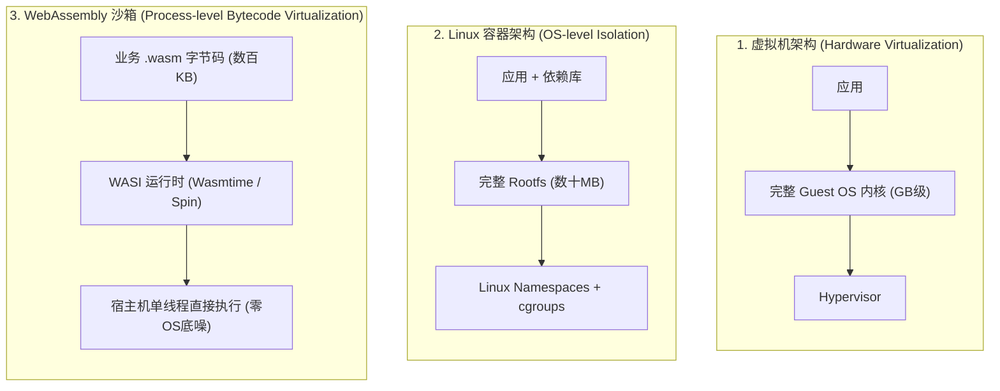
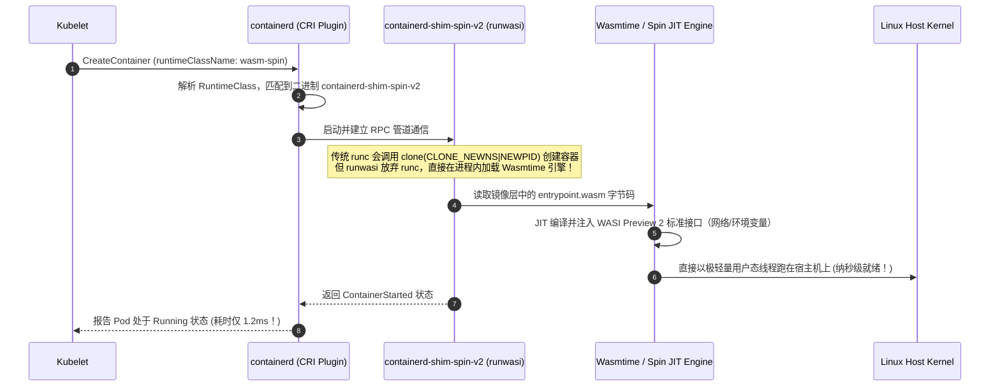
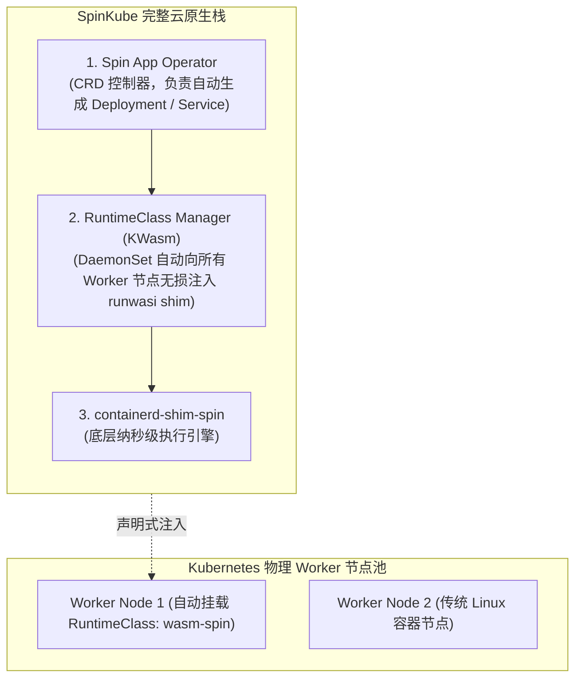

**TL;DR：** 2019 年，Docker 联合创始人 Solomon Hykes 曾发推断言：“*如果 WASM+WASI 在 2008 年就存在，我们就不需要创建 Docker 了。WebAssembly 在服务端的重要性就是这么大。*” 在进入 2025～2026 年后，这一预言正在云原生生态加速变为现实。传统的 Linux 容器虽然强大，但其本质是重型的操作系统级虚拟化——拉取数十 MB 的 Linux 发行版镜像、配置 Namespaces 障眼法与 cgroups 枷锁，导致其**冷启动延迟普遍在数百毫秒至数秒，单实例内存底噪通常在 30MB~100MB**，在极端的高并发 Serverless、AI 边缘轻量推理与高密度微服务场景下显露出沉重的性能税。**WebAssembly (Wasm)** 配合 **WASI Preview 2（WebAssembly System Interface）** 则带来了颠覆性的范式：**零操作系统依赖、字节码原生沙箱隔离、0.5 毫秒极限冷启动与 2MB 极小内存足迹**。通过 CNCF 的 **`runwasi`** 项目与 **SpinKube** 架构，Kubernetes 实现了将 Wasm 模块伪装为标准 OCI 镜像，利用 `RuntimeClass` 在现有集群中与传统 Linux 容器无缝混排，开创了纳秒级高密算力编排的新纪元。

---

## 一、 面试现场：从“Wasm 能否干掉 Docker”到“runwasi 底层调度”的连环追问

```text
面试官提问：
  "最近行业都在聊 WebAssembly（Wasm）和服务端轻量级计算。
   1. 从底层操作系统原理出发，Wasm 和我们天天用的 Linux 容器（Docker/containerd）到底有什么本质物理差异？它真的能‘杀死’容器吗？
   2. 在 Kubernetes 集群中，Kubelet 是如何调度一个 Wasm 模块的？底层究竟需不需要为它创建 Linux Namespaces 和 cgroups？
   3. 深度逆向分析 containerd runwasi 与 SpinKube 的工作链路：一个后缀为 .wasm 的二进制文件，是如何被打包成 OCI 镜像并在 K8s 中毫秒级拉起的？"
```

### 1.1 初级候选人的典型翻车点

许多没有接触过底层系统级编译与运行时的工程师，往往给出两个极端的错误判断：
- **极端认知一（盲目神化 Wasm）**：“Wasm 性能远超容器，未来两年内所有的微服务和有状态应用都会全盘重构为 Wasm，彻底废弃 Docker 和 containerd。”
  - **翻车点**：完全脱离工业现实。Wasm 采用能力受限的线性内存沙箱模型，默认**不支持任意的底层 Linux 系统调用、无法使用原始的 POSIX 套接字、缺少对复杂 C/C++ 共享动态库的兼容**。让一个运行了十年的大型 Spring Boot 单体或 MySQL 跑在 Wasm 里不仅极其痛苦，而且得不偿失。Wasm 的主战场是**极端无状态的 Serverless 函数、毫秒级扩缩容的网关插件、以及资源受限的高密边缘计算**。
- **极端认知二（以为 Wasm 必须用专门的非 K8s 调度系统）**：“K8s 只能调度标准 Linux 容器，Wasm 必须用专门的轻量级调度器，没法放在一个集群里跑。”
  - **翻车点**：完全忽视了 2024~2026 年云原生的标准融合演进。Kubernetes 早已通过 **`RuntimeClass` + `containerd-shim`** 将 Wasm 彻底纳入了 OCI 规范生态体系。

### 1.2 资深工程师的破局切入点

资深系统架构师在被问及该场景时，必须能够清晰画出**硬件指令集模拟、操作系统进程沙箱与 WASI 字节码虚拟机的三层物理隔离对比图**：



---

## 二、 物理性能鸿沟：容器 vs WebAssembly 核心指标决战

为了看清为什么 Wasm 在特定场景下具有降维打击优势，我们拉出底层的量化物理对比：

| 评估维度 | 传统 Linux 容器 (containerd + runc) | WebAssembly 沙箱 (containerd + runwasi / Spin) | 物理成因与代际差距 |
| --- | --- | --- | --- |
| **冷启动延迟 (Cold Start)** | **$300\text{ms} \sim 2000\text{ms}$** | **$0.5\text{ms} \sim 2\text{ms}$** | **300倍性能飞跃**：Wasm 无需 `fork/clone` 系统调用，无需设置挂载点，直接内存加载 JIT 执行 |
| **空载内存底噪 (Footprint)** | **$30\text{MB} \sim 80\text{MB}$** | **$1\text{MB} \sim 3\text{MB}$** | 容器包含基础发行版系统库（glibc、systemd 依赖）；Wasm 仅加载精简字节码 |
| **单节点部署密度 (Density)** | 单机支撑 $\sim 100$ 个容器实例 | 单机轻松压榨 **$5,000 \sim 10,000$ 个实例** | 内存与进程文件描述符消耗压降 95% 以上 |
| **安全沙箱机制 (Isolation)** | 共享宿主机内核，依赖 Capabilities/seccomp 围堵 | **基于能力的安全模型（Capability-based）** | Wasm 默认完全无权限，访问文件或网络必须由宿主机显式授权注入 |
| **指令跨架构移植性** | 镜像绑定体系结构（AMD64 / ARM64 需多架构构建） | **一次编译，处处执行（Write Once, Run Anywhere）** | Wasm 是中间字节码（IR），可在 x86/ARM/RISC-V 宿主机即时编译 |

---

## 三、 containerd runwasi 架构深度逆向：Wasm 是如何骗过 Kubelet 的？

在原生的 Kubernetes 体系中，Kubelet 与底层运行时的交互遵循 **CRI（Container Runtime Interface）** 规范。Kubelet 根本不在乎底层跑的是不是 Docker，它只管向 containerd 发送 `RunPodSandbox` 与 `CreateContainer` gRPC 请求。

### 3.1 runwasi 的垫片（Shim）接管链路

CNCF 旗下的 **`runwasi`** 项目，通过编写专有的 **`containerd-shim`**，在不修改 containerd 核心代码的前提下，完成了对容器执行引擎的“偷天换日”：



### 3.2 OCI 兼容：Wasm 模块的镜像化打包

为了复用全球现有的 Docker Registry（如 Harbor、GitHub Packages、Docker Hub），Wasm 模块严格封装为 **OCI 镜像标准规范（OCI Artifacts）**：

```dockerfile
# 现代 Wasm 的 OCI 打包方式 (使用 Scratch 基础层，体积仅 1.5MB)
FROM scratch
COPY target/wasm32-wasip2/release/payment_handler.wasm /payment_handler.wasm
ENTRYPOINT ["/payment_handler.wasm"]
```

当该镜像被 `docker push` 到镜像仓库时，其 Manifest 的 `mediaType` 会被标记为：
`application/vnd.wasm.content.layer.v1+wasm`。containerd 拉取该镜像后，直接解压出 `.wasm` 文件交付给 `runwasi` 引擎。

---

## 四、 SpinKube：2025/2026 生产级 Kubernetes Wasm 编排底座

在过去，开发者必须手工在每台 Worker 节点上安装各类繁杂的 `wasmtime` 驱动和 Shim 链接，运维体验极其破碎。
**SpinKube（由 Fermyon 联合 CNCF 社区打造的开源标准）** 在 2024~2026 年成为 Kubernetes 编排 Wasm 的绝对行业标准。



### 4.1 声明式配置：在 K8s 中部署 Wasm 应用

研发人员在 K8s 中运行一个 Wasm 应用，只需在 Pod Spec 中指定 **`runtimeClassName: wasm-spin`**：

```yaml
apiVersion: apps/v1
kind: Deployment
metadata:
  name: image-watermark-svc
  namespace: serverless-workloads
spec:
  replicas: 10
  selector:
    matchLabels:
      app: watermark-svc
  template:
    metadata:
      labels:
        app: watermark-svc
    spec:
      # 核心：声明由 runwasi 垫片执行，绕过 runc
      runtimeClassName: wasm-spin
      containers:
      - name: watermark-processor
        image: ghcr.io/my-org/wasm-watermark:v1.0.0
        resources:
          requests:
            cpu: "10m"     # 仅需 0.01 核
            memory: "4Mi"   # 仅需 4MB 内存！
          limits:
            cpu: "1000m"
            memory: "32Mi"
```

**弹性威力**：在结合 KEDA 面对万级流量洪峰时，该应用可以实现从 **0 副本到 500 副本仅需 300 毫秒** 的瞬时暴增，而传统 Java 容器启动 500 个副本需要数分钟且会瞬间吃掉上百 GB 内存！

---

## 五、 WASI Preview 2 与组件模型（Component Model）的工程落地

早期 Wasm 无法在生产落地的最大瓶颈是：**WASI 标准太简陋，无法发起网络连接，只能做本地文件计算**。
在 2024 年底至 2025 年正式稳定的 **WASI Preview 2（wasip2）** 彻底改变了这一局面：
1. **组件模型（Component Model & WIT IDL）**：允许不同语言编译的 Wasm 模块像搭积木一样拼装（例如用 Rust 写的加密模块，无缝嵌入 Python 写的 Wasm 服务中，无需跨语言 RPC）；
2. **标准网络套接字（`wasi:sockets`）**：原生支持基于 TCP/UDP 的异步非阻塞高并发通信，使得 Wasm 模块能够自由地对外发起 HTTP 请求或连接 Postgres/Redis。

---

## 六、 面试通关复盘与架构师高分回答模板

### 6.1 现场 2 分钟极速电梯演讲

> “面试官，关于‘WebAssembly 是否会终结容器’，资深视角的结论是：**Wasm 不会杀死容器，而是与容器形成深刻的互补与共存**。
> 
> 传统 Linux 容器是‘操作系统级虚拟化’，适合复杂的全功能有状态应用、深耦合内核调用或历史遗留单体；而 WebAssembly 是‘进程级字节码沙箱’，凭借 **0.5ms 冷启动与 2MB 极致内存足迹**，在 **高密 Serverless 扩缩容、事件驱动任务、AI 边缘轻量推理与网关动态插件** 场景下具备压倒性的物理优势。
> 
> 在生产落地层面，我们通过 **SpinKube + containerd runwasi** 构建云原生统一编排底盘：
> 1. **在底层运行时**：利用 `runwasi` 提供的 `containerd-shim-spin`，在 containerd 层面截获 Wasm OCI 镜像，直接在宿主机进程内利用 Wasmtime 引擎加载执行，彻底省去 runc 创建 Linux 命名空间和文件系统挂载的开销；
> 2. **在集群调度层**：通过定义原生的 `RuntimeClass: wasm-spin`，让 Kubelet 像调度常规 Pod 一样将 Wasm 模块编排到指定 Worker 节点上，实现与传统微服务的统一网络打通与统一监控；
> 3. **在接口标准层**：全面对齐 **WASI Preview 2 组件模型**，实现安全的能力受限访问与标准异步网络通信，使企业既享受到了容器生态的成熟度，又榨干了 Wasm 带来的 300 倍启动提速与极低算力成本。”

### 6.2 生产面试关键避坑守则

1. **严禁在 Wasm 模块中盲目使用多线程阻塞系统调用**：虽然 WASI 支持线程，但不同宿主机运行时的多线程支持深度不一。优先编写基于事件循环的异步非阻塞逻辑（如 Rust async / Tokio）；
2. **警惕文件系统权限限制**：Wasm 遵循严格的能力受限安全模型，容器代码内试图访问 `/tmp` 或 `/etc` 时，如果宿主机未在 Pod Spec 中通过卷挂载显式映射沙箱路径，代码会直接抛出 `PermissionDenied` 崩溃；
3. **节点 CPU 架构对 Wasm JIT 编译器的影响**：Wasm 字节码在宿主机由 Wasmtime 实时编译为物理机器码。生产集群应尽量保障同构的 CPU 指令集支持（如 AVX-512），并在容器启动时预热编译缓存，防止大规模并发拉起时的瞬时 CPU 编译峰值。

---

## 参考资料与权威规范

1. Solomon Hykes. *Historical Tweet on WASM+WASI and Container Virtualization (2019)*.
2. CNCF containerd Project. *runwasi: Running WebAssembly / WASI Workloads in containerd*. GitHub containerd/runwasi.
3. Bytecode Alliance. *WASI Preview 2 (wasip2) & Component Model Specification*.
4. Fermyon & SpinKube Project. *SpinKube: Running WebAssembly at Scale on Kubernetes*.
5. Kubernetes Documentation. *RuntimeClass & Alternative Container Runtimes Reference*.
