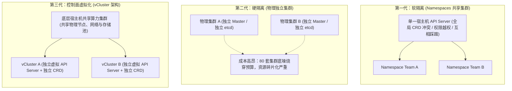
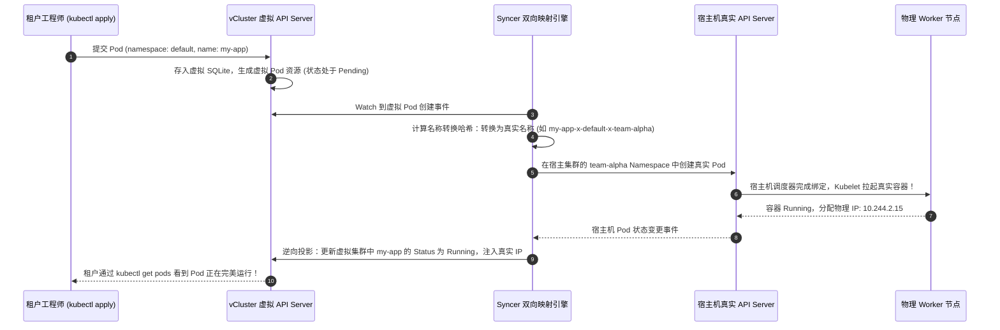

**TL;DR：** 在企业级 Kubernetes 平台落地过程中，平台团队常年面临一个**两难的“租户困境”**：一方面，如果采用原生的 **命名空间（Namespace）软隔离**，由于 CRD（自定义资源）、Webhook、ClusterRole、StorageClass 等关键资源天然是全局共享的，团队 A 安装了一个 `cert-manager v1.12`，就会直接破坏团队 B 的 `cert-manager v1.15`，研发人员完全没有 `cluster-admin` 权限，开发体验极差；另一方面，如果为每个业务线或研发团队都去公有云**独立购买整套物理/托管集群（EKS/ACK/GKE）**，集群控制面底噪、固定节点浪费以及多集群生命周期管理会直接让企业 IT 基础设施账单失控暴增数十倍。为了斩断这一恶性循环，以 **vCluster（虚拟 Kubernetes 集群）** 为代表的**控制平面虚拟化技术（Control Plane Virtualization）** 在 2025～2026 年成为云原生平台工程的事实标准：通过在底层宿主集群的一个常规 Namespace 中运行一套极轻量的虚拟控制面（API Server + SQLite），让租户获得 100% 独立的 `cluster-admin` 自治权与独立的 CRD 命名空间，底层核心工作负载由 **Syncer 双向状态投影组件** 透明投射至物理集群节点，完美实现了**“硬隔离体验 + 共享池成本”**的终极平衡。

---

## 一、 面试现场：从“Namespace 隔离翻车”到“vCluster 控制面虚拟化”的连环追问

```text
面试官提问：
  "目前公司有 80 多个研发与算法业务线。如果把大家都放在同一个大 K8s 集群里用不同的 Namespace 隔离：
   1. 为什么一旦某个团队尝试部署自定义的 CRD（如定制版 RayCluster 或 Istio），整个集群的其他租户就会被影响甚至报错？Namespace 到底欠缺了哪些维度的隔离？
   2. 如果为了解决冲突给 80 个团队各自拉一套物理集群，运维成本和资源成本会面临什么灾难？
   3. 深入拆解 vCluster 的底层物理架构：它是如何在底层宿主集群完全不感知的情况下，给租户凭空‘造’出一个功能完备、拥有完整独立 cluster-admin 权限的虚拟集群的？其核心 Syncer 组件是如何做双向资源映射的？"
```

### 1.1 初级候选人的典型翻车点

初中级候选人往往将 Kubernetes 的 Namespace 视作类似 Linux Namespaces 的隔离墙：
- **方案一（以为配置 RBAC + NetworkPolicy 就是完美多租户）**：“在每个 Namespace 配上严密的 RBAC 角色限制，加上 NetworkPolicy 禁止跨命名空间访问，就是标准的企业级多租户。”
  - **翻车点**：完全不懂 Kubernetes 资源模型的全局边界！
    - **CRD 是集群全局唯一的（Cluster-scoped）**：如果团队 A 的实验算法需要安装包含 `spec.foo` 字段的新版 CRD，而团队 B 依赖旧版，两者在全局 API Server 中直接发生版本覆写冲突，全集群只能保留一份 schema；
    - **ValidatingWebhook 是全局拦截的**：团队 A 部署了一个有 Bug 的准入 Webhook，其规则误配了全局拦截，会导致全集群所有租户连正常的 Pod 都无法创建；
    - **租户永远没有集群管理权**：租户团队无法安装依赖 ClusterRole 的 Helm 库，只能天天提工单让平台管理员排期，研发效能降至冰点。
- **方案二（以为只要有钱就狂建物理集群）**：“既然冲突，那就给每个部门自动化拉独立的 ACK/EKS 集群。”
  - **翻车点**：成本直接原地起飞。80 个独立集群意味着 80 套 etcd 控制面底噪、80 组冗余的网络与安全守护进程（DaemonSet）、80 份被各自碎裂占用的物理 Master 预留，公有云每个托管集群每月还要白白多扣成千上万的基础管控费！

### 1.2 资深工程师的破局切入点

资深平台架构师在回答该问题时，必须能够清晰呈现**单体物理集群、Namespace 软隔离与控制面虚拟化（vCluster）的三代架构演进矩阵**：



---

## 二、 原生 Namespace 的七大物理隔离盲区

在深水区面试中，必须精准点出原生 Kubernetes Namespace 无法实现真正多租户的根本原因：

| 隔离失效维度 | 原生 Namespace 软隔离的表现 | 资深生产灾难实录 |
| --- | --- | --- |
| **自定义资源 (CRD)** | **全局共享**（Non-namespaced） | 团队 A 升级 Operator CRD schema，导致全集群使用旧版本的业务 Pod 序列化解析全部崩溃 |
| **准入控制 (Webhooks)** | **作用域全局穿透** | 某个团队配置了 `failurePolicy: Fail` 且规则覆盖全局的 Webhook，当其自身崩溃时引发全集群宕机 |
| **集群角色与绑定** | `ClusterRole` / `ClusterRoleBinding` 全局可见 | 无法向租户开放集群管理员权限，租户无法独立调试集群级系统插件 |
| **API 版本兼容性** | 整个集群强绑定同一 K8s 大版本（如 v1.28） | 业务团队无法自主验证更高版本（如在租户内测试 v1.31 的新特性），升级推进寸步难行 |
| **网络策略与 DNS** | 默认 CoreDNS 全局扁平 | 任何租户都可以向 `<service>.<other-namespace>.svc` 发送嗅探探测，容易引发数据越权泄漏 |
| **持久化存储类** | `StorageClass` 全局可见 | 无法针对不同部门设定专属的加密存储或动态 QoS 挂载参数 |
| **调度器与优先级** | `PriorityClass` 全局竞争 | 恶意或失控的租户设置了 1,000,000 的最高优先级，可以直接跨命名空间抢占驱逐核心业务 Pod |

---

## 三、 vCluster 底层架构深度逆向：控制面与数据面的精妙投影

vCluster（由 Loft Labs 开源并被广泛采纳）的核心哲学是：**“虚拟控制面常驻租户 Namespace，真实工作负载投影至物理底座”**。

```mermaid
flowchart TB
    subgraph HostCluster["底层物理宿主集群 (Host Cluster)"]
        direction TB
        HostKubelet["物理 Worker 节点池 (Kubelet / CNI / CSI / 物理网络)"]
        HostAPIServer["宿主机 kube-apiserver"]

        subgraph TenantNamespace["租户命名空间 (Namespace: team-alpha)"]
            direction TB
            subgraph vClusterPod["vCluster 虚拟集群 Pod"]
                vAPIServer["虚拟 API Server (基于 K3s 裁剪)"]
                vStorage["虚拟存储 (内置嵌入式 SQLite / 独立 etcd)"]
                SyncerEngine["核心大脑：Syncer 状态投影引擎"]
                vAPIServer <--> vStorage
                vAPIServer <--> SyncerEngine
            end
            
            RealPod1["真实执行 Pod 1<br>(由 Syncer 在宿主机创建，名字带前缀)"]
            RealPod2["真实执行 Pod 2<br>(由 Syncer 在宿主机创建)"]
        end

        SyncerEngine -->|"同步调度请求"| HostAPIServer
        HostAPIServer -->|"实际编排运行"| HostKubelet
    end

    TenantUser["租户研发 / 运维 (持有独立的 kubeconfig)"]
    TenantUser ==="使用 cluster-admin 直连虚拟集群"===> vAPIServer
```

### 3.1 核心大脑：Syncer 双向状态投影引擎

vCluster 之所以轻量（单个虚拟集群底噪仅需数十 MB 内存与 0.1 核 CPU），是因为它**彻底舍弃了虚拟机的宿主机操作系统，也没有虚拟出一张虚拟网卡，甚至没有运行专用的调度器（kube-scheduler）！**

所有的魔法都发生在这个名为 **Syncer** 的 Go 语言控制器中：



### 3.2 资源投影的“保留与过滤”原则

Syncer 并不是无脑把所有东西都同步给宿主机，它遵循严格的过滤原则：
- **只在虚拟集群存在、绝不上报宿主机的资源**：
  - **CRD（自定义资源定义）**：租户在虚拟集群随便装 100 个 CRD，全部存放在虚拟集群的 SQLite 中，**宿主机根本不知道它们的存在，彻底杜绝全局冲突**！
  - **Namespace**：租户在虚拟集群内部可以随意创建 `dev`、`test`、`prod` 等命名空间；
  - **ServiceAccount、Role、RoleBinding**：租户拥有虚拟集群内部最高管理员权限。
- **必须双向映射到宿主机的物理资源**：
  - **Pod**：需要物理宿主机的 CPU/内存去执行；
  - **PersistentVolumeClaim (PVC)**：需要宿主机的 CSI 驱动去真实分配底层云盘；
  - **Service / Ingress**：需要宿主机的 CNI/网络网关去分配物理路由与端口。

---

## 四、 2025/2026 前沿演化：从纯软件虚拟化到算力硬隔离

进入 2025 年后，随着 AI 大模型训练与金融核心业务进驻 Kubernetes，纯软件级的 Syncer 映射在某些严苛场景下遇到了“算力扰乱”瓶颈。为此，vCluster 社区推出了三大代际重磅特性：

### 4.1 Private Nodes（专用物理节点隔离）
在过去，所有租户的 Pod 混跑在共享的物理 Worker 节点上，容易发生“吵闹邻居（Noisy Neighbors）”。
vCluster 引入了 **Private Nodes 机制**：
- 平台管理员将一组专属的高性能物理节点（如 8 台配备 H100 的 GPU 节点）打上专属污点与标签；
- 该租户的 vCluster 中的虚拟节点池与这批物理机器 1:1 独占绑定；
- 租户在虚拟集群内享有专属算力，其他任何宿主集群租户绝对无法调度上去，实现了**算力物理硬隔离与控制面轻量虚拟化的统一**。

### 4.2 Auto Nodes（基于 Karpenter 的按需即时交付）
结合 Karpenter 弹性引擎，vCluster 支持 **Auto Nodes 模式**：
当虚拟集群内没有任何工作负载时，底层物理节点自动缩容到 0；一旦租户工程师在虚拟集群内执行大规模任务，vCluster 联动宿主机的 Karpenter 秒级拉起物理虚拟机，任务结束后自动回收，企业算力闲置浪费彻底被压缩到极致。

---

## 五、 企业级多租户方案深度选型对决矩阵

| 评估维度 | 方案 A: 物理独立集群 (EKS / ACK 裸建) | 方案 B: 原生 Namespace 软隔离 | 方案 C: vCluster 控制面虚拟化 |
| --- | --- | --- | --- |
| **隔离强度** | **物理级绝对硬隔离** | **极弱**（仅限 Pod 名字隔离，集群级资源全裸） | **极高**（控制面完全独立隔离，数据面支持节点独占） |
| **CRD 与 API 独立性** | 100% 独立 | **0% 隔离**（强行共享，互相覆写冲突） | **100% 独立**（租户可任意安装任意版本 CRD） |
| **租户自治权限** | 拥有完整的 `cluster-admin` | 仅拥有普通非特权 `Role`，处处受限 | **拥有虚拟集群完整的 `cluster-admin` 权限** |
| **创建与销毁耗时** | **5 分钟 $\sim$ 20 分钟**（拉云资源极其缓慢） | 秒级 | **1 秒 $\sim$ 3 秒**（仅拉起一个轻量 Pod） |
| **集群资源底噪与成本** | 极高（每个集群独占多台 Master 与系统底噪） | **零额外底噪** | **极低**（单个 vCluster 内存消耗 $\sim 50\text{MB}$，底噪压降 99%） |
| **多集群运维复杂度** | 灾难级（80 个独立集群需分别维护网络、升级） | 简单（单集群运维） | **极其优雅**（以单集群底座统一维护，租户自主管理业务） |

---

## 六、 面试通关复盘与架构师高分回答模板

### 6.1 现场 2 分钟极速电梯演讲

> “面试官，在企业级规模化 Kubernetes 落地中，‘单集群 Namespace 软隔离’之所以无法满足生产多租户诉求，根本原因在于**Kubernetes 的资源模型存在大量全局非命名空间资源（Cluster-scoped）——尤其是 CRD、准入 Webhook 与 ClusterRole，一旦多团队混排，极易引发 Schema 覆写、恶意拦截与权限缺失灾难**；而给每个团队拉独立物理集群，又会导致基础设施账单和多集群运维成本失控爆炸。
> 
> 在 2025/2026 年现代平台工程建设中，最优雅的解法是引入**以 vCluster 为代表的控制面虚拟化架构**：
> 1. **在控制面实现绝对隔离**：在宿主集群的租户 Namespace 内拉起一套轻量级虚拟控制面（K3s API Server + 嵌入式 SQLite），租户在内部享有 100% 独立的 `cluster-admin` 权限，可以自由安装任何版本的 CRD 和 Operator，对宿主集群完全零感知、零污染；
> 2. **在数据面通过 Syncer 极致复用**：利用核心的 Syncer 引擎，将虚拟集群中创建的 Pod 和 PVC 按照前缀规则低损耗投影至物理宿主集群，由宿主机调度器和 CNI 统一管理，创建耗时仅需 2 秒，单集群底噪不足 50MB 内存；
> 3. **结合 Private Nodes 升级硬隔离**：对于核心 AI 训练或金融计费等高敏租户，通过开启 Private Nodes 将底层特定物理机绑定独占，完美做到了‘以共享集群的成本，交付独立物理集群的硬隔离体验’。”

### 6.2 生产面试关键避坑守则

1. **宿主集群网络策略对虚拟集群的穿透防范**：虚拟集群的 Pod 实际上是在宿主机的 Namespace 中运行的。必须在宿主机该 Namespace 上配置强硬的 `NetworkPolicy`，封杀其访问宿主机物理云厂商元数据 API（如 AWS IMDS `169.254.169.254`）和宿主机 kube-apiserver 的通道，防止提权越狱；
2. **虚拟集群 SQLite 存储并发瓶颈与高可用容灾**：默认单节点 vCluster 使用内存 SQLite，适合开发测试与中小型租户。对于生产级万人大租户，必须配置 vCluster 的后端存储为**外部独立 etcd 或高可用 PostgreSQL（借助 K3s Kine 引擎）**，并开启多副本虚拟 API Server；
3. **CoreDNS 跨虚拟集群隔离**：确保在 vCluster 配置中启用了独立的虚拟 CoreDNS 映射，防止虚拟集群内部的服务名解析泄漏到宿主机全局 CoreDNS 中造成服务嗅探；
4. **严格限制宿主机 Node 资源的可视性**：租户在虚拟集群执行 `kubectl get nodes` 时，默认可能会看到宿主机所有的物理机信息。生产环境必须开启 `--fake-nodes=true`，只向租户暴露虚拟的节点名字，隐藏底层云服务器真实的物理拓扑和私网 IP。

---

## 参考资料与权威规范

1. Loft Labs & vCluster Project. *vCluster Architecture: Virtual Kubernetes Clusters Under the Hood*. vcluster.com/docs.
2. Kubernetes Multi-Tenancy Working Group. *Multi-Tenancy Benchmarks & Hierarchical Namespaces (HNC) Exploration*.
3. CNCF Platform Engineering Working Group. *Cloud Native Platform Engineering & Multi-Tenant Architecture Whitepaper*.
4. Darren Shepherd. *K3s Architecture: Minimal Kubernetes with SQLite Kine Engine*. Rancher Labs.
5. AWS Architecture Center. *EKS Multi-Tenancy: Hard Isolation vs Virtual Clusters Trade-offs*.
