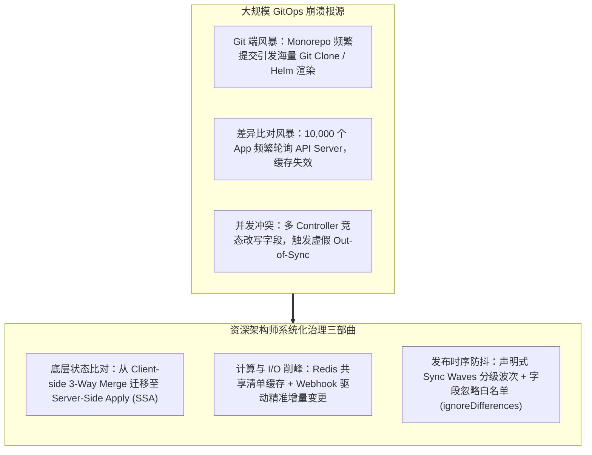
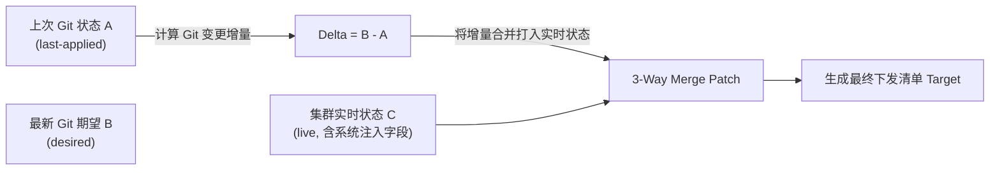
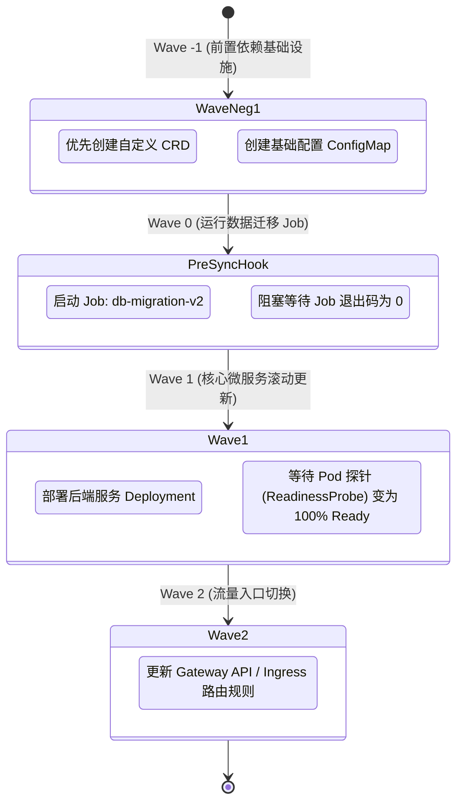
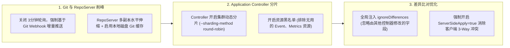

**TL;DR：** **GitOps** 已成为现代云原生持续交付（CD）的工业基石：以 Git 仓库作为系统运行状态的“单一真实来源（Single Source of Truth）”，声明式驱动 Kubernetes 集群的自动调和与自愈。然而，绝大多数工程师仅在十几个微服务的玩具级 Demo 中跑通过 **ArgoCD**，一旦将应用规模推向**数千乃至上万个、跨越数十个异构集群的生产深水区**时，这套看似优雅的声明式闭环便会遭遇前所未有的物理冲击：Git 仓库遭遇每秒数百次的并发拉取触发 GitHub/GitLab 的 API 限流风暴；ArgoCD 的 Application Controller 产生巨大的内存占用并频繁陷入死锁；集群内部频繁爆发虚假的 **`Out of Sync` 状态漂移风暴**；当多个控制器同时改写同一个资源时，低版本客户端合并直接将生产配置覆写抹除。要彻底驯服这一复杂系统，资深架构师必须深入其底层内核，透视其**期望状态与实时状态的差分算法（Diffing Algorithm）**、**三路合并补丁（3-Way Merge Patch）与 Server-Side Apply 的冲突消解**、以及基于 **Sync Waves / Hooks** 的严密时序编排状态机。

---

## 一、 面试现场：从“Git 提交即部署”到“万级应用雪崩”的连环追问

```text
面试官提问：
  "我们平台统一推行 GitOps，目前在 ArgoCD 中纳管了 30 多个集群、共计 12,000 多个微服务应用。
   上周核心基础库发版触发了 Monorepo 的批量更新，结果 ArgoCD 瞬间瘫痪：
   1. 所有应用全部陷入 Out of Sync 告警风暴，甚至很多线上正常的 Pod 被错误地批量重新触发滚动重启；
   2. ArgoCD 的 Repo Server 内存直接撑爆 OOM 挂掉，下游 Kubernetes API Server 的 QPS 暴涨 50 倍濒临雪崩。
   请问：
   从 ArgoCD 的内部架构与 Kubernetes API 调和机制出发，这起事故的底层物理成因是什么？
   ArgoCD 究竟是如何比对 Git 期望状态和 K8s 实时状态差异的？为什么必须用 3-Way Merge Patch 或 Server-Side Apply（SSA）？在大规模集群下如何从架构层面实现全链路削峰与防抖？"
```

### 1.1 初级候选人的典型翻车点

许多没有操盘过万人研发协作平台的候选人，容易给出极其片面的运维建议：
- **方案一（怪 Git 仓库或者建议拉长刷新时间）**：“把 ArgoCD 的自动同步（Auto-Sync）全部关掉，刷新检测间隔（Reconciliation Timeout）从 3 分钟改到 30 分钟，大家改完手动点按钮同步。”
  - **翻车点**：直接倒退回命令式手动运维时代，违背了 GitOps 自动化自愈的核心初心。而且单纯拉长轮询时间无法解决“突发批量提交时瞬时涌入的计算峰值”。
- **方案二（以为 Out-of-Sync 是因为网络丢包）**：“状态频繁报 Out of Sync 肯定是因为海外集群网络抖动，加重试次数就能好。”
  - **翻车点**：完全不懂 **字段所有权（Field Ownership）与动态注入冲突**！
    - 例如：HPA（水平弹性伸缩）会自动动态改写 Deployment 的 `spec.replicas`；
    - 各种准入 Webhook（如 Istio 注入 sidecar、链路追踪注入环境变量）会自动在 Live Object 中追加 fields；
    - 如果 ArgoCD 不懂利用 `ignoreDifferences` 或 SSA 来界定字段权属，它会固执地认为线上状态与 Git 仓库里写的静态 YAML 不一致，从而判定为 `Out of Sync` 并反复执行错误的“覆写修正”，直接把 HPA 扩出来的 Pod 强行砍回默认副本数！

### 1.2 资深工程师的破局切入点

资深平台架构师在回答该问题时，必须能够清晰呈现**ArgoCD 三大核心组件架构图**、**差分比对数学模型**与**大规模工程削峰解耦链路**：



---

## 二、 ArgoCD 控制器内部架构深度逆向：三大组件协同

要理解大规模雪崩，首先必须剖析 ArgoCD 核心守护进程的物理分工：

```mermaid
flowchart TB
    subgraph GitRepo["单一真实来源 (Git Repositories)"]
        Repo1["GitLab / GitHub (Helm Charts / Kustomize / Raw YAML)"]
    end

    subgraph ArgoCDCore["ArgoCD 控制面集群"]
        direction TB
        RepoServer["1. argocd-repo-server<br>(负责 git clone/fetch，调用 helm template 渲染清单)"]
        RedisCache["2. Redis Cache<br>(缓存 Git 提交 SHA、已解析的 Manifests 与集群快照)"]
        AppController["3. argocd-application-controller<br>(核心大脑：Watch 集群实时状态，比对 Diff，驱动同步)"]
        APIServer["4. argocd-server<br>(对外提供 UI / API / RBAC 控制)"]

        RepoServer <--> RedisCache
        AppController <--> RedisCache
        AppController <--> RepoServer
    end

    subgraph ManagedClusters["目标受管集群 (Managed K8s Clusters)"]
        direction TB
        Cluster1["生产集群 A (kube-apiserver)"]
        Cluster2["生产集群 B (kube-apiserver)"]
    end

    GitRepo -->|"Webhook 触发或定时轮询"| RepoServer
    AppController ==="Watch 实时集群事件 (Informers 双向长连)"===> Cluster1
    AppController ==="Watch 实时集群事件"===> Cluster2
```

1. **`argocd-repo-server`**：纯无状态计算组件。它负责将 Git 仓库拉取到本地，并执行 `helm template` 或 `kustomize build` 将模板转化为纯粹的 Kubernetes JSON/YAML 声明。当有万级应用共用同一个 Monorepo 时，该进程会发生严重的多进程 CPU 争用与内存暴涨；
2. **`argocd-application-controller`**：这是整个系统最沉重的**“调和引擎（Reconciliation Engine）”**。它在内存中为每个托管集群维护全量的 client-go Informer 缓存，持续比对每个资源在 Git 中的定义与集群内运行状态；
3. **`Redis Cache`**：整个系统的性能缓冲垫，缓存已解析的 Manifests 和各集群资源的哈希指纹。

---

## 三、 状态差异算法的物理本质：从 3-Way Merge 到 Server-Side Apply

为什么不能简单地用文本 `diff` 比较 Git YAML 和集群当前的 YAML？
因为 Kubernetes 是一个**“声明式系统”**：API Server 和各类控制器会自动给资源补上默认值（如 `spec.dnsPolicy: ClusterFirst`）、系统状态（`status`）、时间戳（`creationTimestamp`）以及由 HPA 动态修改的副本数。

### 3.1 经典三路合并补丁（3-Way Merge Patch）的局限

传统 ArgoCD 默认使用基于客户端的 **三路合并补丁（3-Way Merge Patch）**：
- **$A$（Last-Applied State）**：上次通过 GitOps 成功应用的配置（记录在注记 `kubectl.kubernetes.io/last-applied-configuration` 中）；
- **$B$（Desired State）**：当前 Git 仓库中最新的 YAML 声明；
- **$C$（Live State）**：当前物理集群中实际运行的对象。

$$\text{Patch} = \text{Diff}(A \to B) \quad \text{Applied onto} \quad C$$



**致命缺陷**：
如果多个控制器（如 ArgoCD 和外部的 Istio Operator）都在尝试修改同一字段，或者数组列表（List）中发生元素顺序变动时，三路合并补丁极易引发**死锁覆盖（Fight for fields）**，控制器 A 刚改完，控制器 B 瞬间改回，导致集群每秒触发几十次无休止的滚动更新！

### 3.2 终极救赎：全面拥抱 Server-Side Apply (SSA)

在现代 Kubernetes 生产体系中，必须将 ArgoCD 切换为 **Server-Side Apply (SSA)** 模式：
```yaml
apiVersion: argoproj.io/v1alpha1
kind: Application
spec:
  syncPolicy:
    syncOptions:
    - ServerSideApply=true # 核心：强制由 API Server 协调字段所有权
```
- **字段所有权机制（Field Management）**：API Server 在底层通过 `managedFields` 元数据严格记录“这个字段是谁声明的”；
- 比如：`replicas` 属于 HPA 管理，`image` 属于 ArgoCD 管理。当 ArgoCD 同步时，API Server 只校验 ArgoCD 所拥有的字段，绝不触碰 HPA 动态修改的值，**从内核层面 100% 杜绝了虚假 Out-of-Sync 状态**！

---

## 四、 复杂依赖交付利器：Sync Waves 与 Hooks 编排状态机

在真实企业微服务架构中，一次版本发布绝不能将所有 YAML “全并发、无脑推向集群”：
必须先执行数据库结构迁移（Flyway/Liquibase Job），待迁移成功后才能拉起新版后端 Pod，最后才能更新 Ingress 切换流量。

ArgoCD 提供了工业级编排原语——**Sync Waves（同步波次）** 与 **Resource Hooks**：



### 4.1 声明式配置语法

在资源 YAML 的元数据中注入注记即可实现严格定序：
```yaml
# 1. 先跑数据库迁移 Job
apiVersion: batch/v1
kind: Job
metadata:
  name: db-migration
  annotations:
    argocd.argoproj.io/hook: PreSync            # 必须在主同步之前执行
    argocd.argoproj.io/hook-delete-policy: HookSucceeded # 执行成功后自动清理 Job
---
# 2. 数据库成功后，再更新业务 Deployment
apiVersion: apps/v1
kind: Deployment
metadata:
  name: order-service
  annotations:
    argocd.argoproj.io/sync-wave: "1"           # 在 Wave 1 执行，确保数据库已 Ready
```

---

## 五、 万级应用规模化实战：高可用调优全景闭环

当应用规模从 100 跨越至 10,000 时，必须执行以下关键架构调优：



1. **彻底关闭定时轮询，采用 Git Webhook 增量触发**：
   默认情况下，ArgoCD 每 3 分钟会轮询一次所有 Git 仓库。10,000 个应用意味着每 180 秒产生 10,000 次网络请求！在 GitLab/GitHub 上配置 Push Event Webhook，收到精准事件才触发指定 App 的刷新，**将后台无效 I/O 削减 98%**；
2. **Controller 多集群分片（Sharding）**：
   通过启动参数 `--replicas 5` 开启 Application Controller 的 StatefulSet 分片集群，通过一致性哈希将不同托管集群均摊到不同的控制器 Pod 上，单个 Controller 内存占用从 32GB 骤降至 4GB；
3. **禁用全局资源全量缓存**：
   在 `argocd-cm` 中配置资源排除规则，告诉 ArgoCD 绝对不要 Watch 集群内的 `Event`、`PodMetrics` 等高频但与 CD 完全无关的瞬态资源，大幅降低 client-go Informer 的网络带宽与内存占用。

---

## 六、 面试通关复盘与架构师高分回答模板

### 6.1 现场 2 分钟极速电梯演讲

> “面试官，在大规模 GitOps 落地中，万级微服务导致 ArgoCD 瘫痪并爆发 Out-of-Sync 状态风暴，本质是**‘高频集中轮询打爆 Git/API 基础设施’与‘多控制器竞争修改字段导致客户端 3-Way Merge 冲突’两大物理瓶颈交织的结果**。
> 
> 在操盘万级应用的平台治理时，我们推行了三层系统化重构方案：
> 1. **在差异计算与冲突消解层：全面切向 Server-Side Apply (SSA)**。废弃陈旧的客户端 3-Way Merge Patch，利用 Kubernetes 原生的 `managedFields` 界定字段所有权，彻底屏蔽 HPA 副本动态调整与外部 Webhook 注入带来的虚假状态漂移；
> 2. **在交付时序与编排层：引入 Sync Waves 与 Pre/Post Hooks**。为有状态依赖链建立声明式发布波次，先迁移数据库，再探针验证核心应用，最后切换网关流量，保障千万级调用链路的零中断交付；
> 3. **在架构扩展与高可用层：实施‘Webhook 驱动 + Controller 分片 + 资源剪裁’三大杀招**。封杀 3 分钟盲目全量 Git 轮询，改由 Git Commit Webhook 精准驱动增量刷新；对 Application Controller 实施多节点一致性哈希分片，并在 Informer 中剔除 Event 等瞬时资源，使单集群支撑能力从 500 个平滑扩展至 15,000 个应用，实现超大规模 GitOps 的坚若磐石。”

### 6.2 生产面试关键避坑守则

1. **绝对禁止在 Git 中提交由 Operator 动态生成的随机值**：很多开发者把 Helm 自动生成的随机密码（如 `randAlphaNum`）写进模板，导致每次 GitOps 调和算出的哈希都不同，引发永远停不下来的自动同步死循环；
2. **严防自动删除引发全量业务抹除（Prune Cascade）**：开启 `prune: true` 固然能保证环境干净，但如果某位工程师误操作提交了一个空的 Git 提交，ArgoCD 会在数秒内调用 Cascade 级联删除清空整个生产命名空间！生产环境必须配置防护注记：`argocd.argoproj.io/sync-options: Prune=false`，或在核心命名空间开启终极终结锁；
3. **针对 CRD 类型的特殊等待（Custom Health Check）**：很多第三方 CRD 资源（如 PrometheusRule、VaultSecret），原生 ArgoCD 不理解其健康状态判定逻辑，容易误判为 `Progressing` 挂死。必须在 `argocd-cm` 中编写基于 Lua 的自定义健康检查脚本；
4. **资源跟踪注记冲突（Tracking Method）**：默认 ArgoCD 使用 Annotation 记录资源归属。当应用发生跨 App 迁移时，旧 App 会把新 App 的同名资源误删。在大规模场景下，推荐将 `trackingMethod` 切换为 **`annotation+label`** 双重保护机制。

---

## 参考资料与权威规范

1. CNCF Argo Project. *Argo CD Architecture: Deep Dive into Application Controller & Repo Server*. argo-cd.readthedocs.io.
2. Alexis Richardson. *GitOps: Operations by Pull Request*. Weaveworks Original Manifesto.
3. Kubernetes Enhancement Proposals. *KEP-555: Server-Side Apply (SSA) & Managed Fields*.
4. Red Hat & Intuit. *Scaling Argo CD to 10,000+ Applications: Production Engineering Post-Mortem*.
5. Kubernetes Documentation. *API Machinery: Three-Way Merge Patch Internal Mechanics*.
