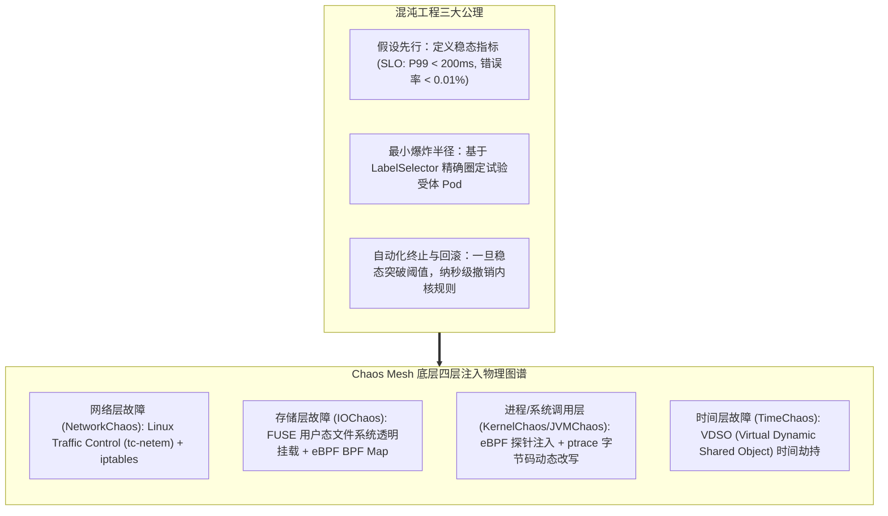
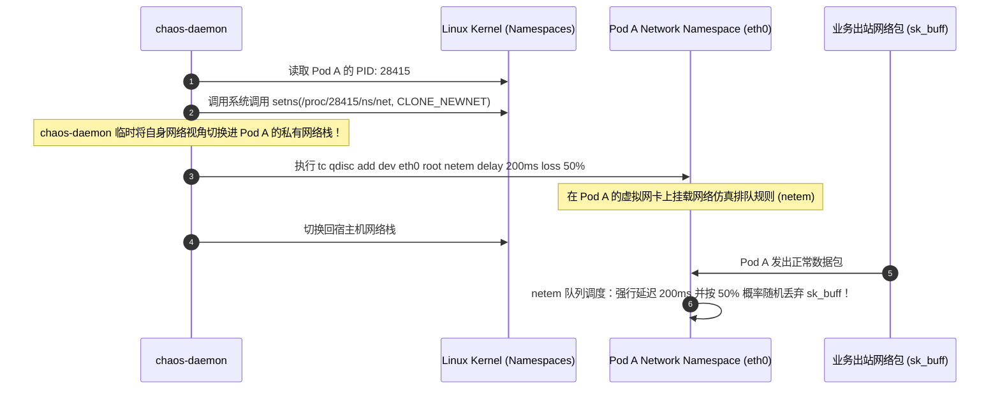
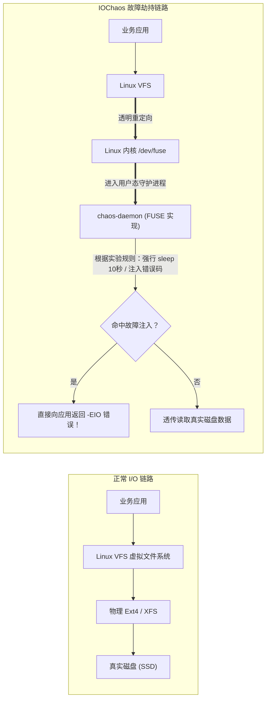
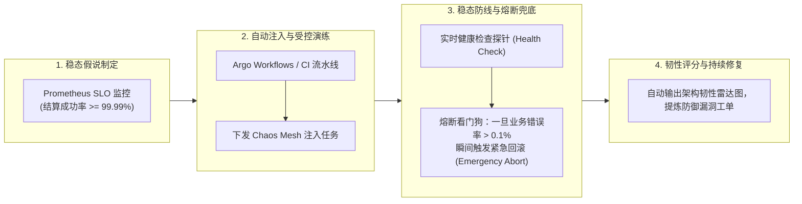

**TL;DR：** 在分布式系统领域，墨菲定律（Murphy's Law）是不可违逆的物理铁律：**“任何可能出错的环节，在百亿级请求的冲刷下，必然会在最糟糕的时刻彻底崩溃。”** 绝大多数团队声称其 Kubernetes 生产集群具备“高可用、多活容灾、自愈弹性”，但这种信心往往建立在脆弱的纸面架构图和没有经过真实火炼的假设之上。一旦突发物理专线闪断、跨机房网卡产生 30% 丢包、或者某个云盘由于存储后端压力产生 10 秒的 I/O 挂起停顿，原本设计好的超时重试、熔断降级与主从切换状态机往往发生剧烈的**级联崩溃（Cascading Failure）**。为了在事故发生前主动暴露系统隐患，以 **Chaos Mesh（CNCF 顶级毕业项目）** 为代表的云原生**混沌工程（Chaos Engineering）** 成为一线大厂验收集群弹性的最高准则。Chaos Mesh 通过深度结合 Linux 内核原语——**Traffic Control (`tc-netem`)**、**iptables/IPVS**、**eBPF 系统调用拦截** 与 **FUSE（用户空间文件系统）I/O 注入**，将混乱与灾难转化为声明式的 Kubernetes CRD，构建起确定性验证系统韧性的数字化靶场。

---

## 一、 面试现场：从“盲目迷信集群高可用”到“内核级混沌注入”的连环追问

```text
面试官提问：
  "下个月我们要把一套价值数十亿的实时交易结算核心系统迁移到新的 K8s 集群。
   你在架构方案上写了‘服务具备多可用区容灾、具备网络抖动自愈、具备零 502 滚动更新能力’。
   请问：
   1. 你如何向 CTO 和业务负责人证明，当跨可用区网卡突然产生 50% 丢包、或者某节点磁盘写延迟飙升至 5 秒时，业务真的不会崩？
   2. 如果采用 Chaos Mesh 做确定性故障注入，它在底层究竟是如何做到精准只让某个特定 Pod 丢包，而不影响同节点其他邻居 Pod 的？
   3. 深度逆向分析 Chaos Mesh 的底层物理实现：网络故障（NetworkChaos）、磁盘 I/O 挂起（IOChaos）与内核级故障（KernelChaos）分别依赖了 Linux 操作系统的哪些底层机制？"
```

### 1.1 初级候选人的典型翻车点

许多没有主导过全链路故障演练的候选人，常常给出危险甚至破坏性的操作思路：
- **方案一（手工粗暴执行暴力命令）**：“演练时我直接通过 SSH 连上某台 Worker 节点，把网卡 `ifconfig eth0 down` 拔掉，或者把机器直接强行 `reboot` 重启。”
  - **翻车点**：这种手段极其原始且不可控（Blast Radius 爆炸半径无法收敛）。拔掉宿主机网卡会瞬间影响该宿主机上**所有的租户与不相干业务**；一旦发生非预期死锁，没有自动回滚机制（Rollback），极易将演练现场直接演变成真实的 P0 级生产特大事故！
- **方案二（以为只要看单元测试和压力测试就行）**：“我们在测试环境压测过 10 万 QPS，指标一切正常，说明系统非常健壮。”
  - **翻车点**：完全混淆了**容量测试（Stress Test）** 与 **韧性测试（Resilience Test）**。压力测试是在网络和硬件“完美理想状态”下测算系统的吞吐上限；而真实生产事故 80% 是由于“灰度故障（Gray Failures）”引发的——比如网卡不是彻底断开，而是**每隔 100ms 产生 15% 的随机丢包**，导致 TCP 频繁重传并锁死连接池；或者分布式 Raft 集群中单节点物理时钟偏斜（Clock Skew），引发选主震荡。这些复杂非确定性故障，传统压测根本测不出来！

### 1.2 资深工程师的破局切入点

资深稳定性与架构专家在回答该问题时，必须能够清晰呈现**混沌工程的科学实验原则**与**Chaos Mesh 在 Linux 内核空间的四层注入机制拓扑**：



---

## 二、 Chaos Mesh 架构深度逆向：控制面与 Agent 协作

Chaos Mesh 是专门针对 Kubernetes 原生环境构建的声明式故障编排框架，其架构解耦为**全局控制器**与**节点守护进程**：

```mermaid
flowchart TB
    subgraph ControlPlane["Kubernetes 控制面"]
        UserCRD["用户声明 Chaos CRD (NetworkChaos / IOChaos)"]
        ChaosController["chaos-controller-manager<br>(Watch CRD 变更，解析目标 Pod 并调度故障)"]
        UserCRD --> ChaosController
    end

    subgraph WorkerNode1["Worker 节点 1"]
        direction TB
        ChaosDaemon1["chaos-daemon (DaemonSet / 特权特化进程)<br>(直接操作宿主机 Linux 内核、Netns 与文件描述符)"]
        TargetPodA["目标 Pod A (业务支付服务)"]
        NormalPodB["普通 Pod B (不受任何影响！)"]
        
        ChaosDaemon1 -.->|"通过 setns 切换进入 Pod A 的命名空间"| TargetPodA
    end

    subgraph WorkerNode2["Worker 节点 2"]
        direction TB
        ChaosDaemon2["chaos-daemon"]
        TargetPodC["目标 Pod C"]
        ChaosDaemon2 -.-> TargetPodC
    end

    ChaosController ==="通过 gRPC 安全下发故障注入指令"===> ChaosDaemon1
    ChaosController ==="通过 gRPC 下发指令"===> ChaosDaemon2
```

1. **`chaos-controller-manager`**：运行在集群控制面，负责监听用户提交的 `NetworkChaos`、`IOChaos` 等 CRD，计算匹配的目标 Pod 列表，并根据配置的生命周期定时器（Duration / Cron）调度实验；
2. **`chaos-daemon`**：以 DaemonSet 形式运行在每个 Worker 节点上，拥有高特权（具备 `CAP_SYS_ADMIN`、`CAP_NET_ADMIN`）。它接收控制面的 gRPC 指令，调用底层 Linux 内核工具执行精准的物理手术。

---

## 三、 核心故障类型的底层内核实现揭秘

面试的高分分水岭，在于你能否精准说出每一个故障在 Linux 内核层究竟被翻译成了什么系统命令或内核调用。

### 3.1 网络故障（NetworkChaos）：`setns` 与 `tc-netem`

为什么注入丢包只影响目标 Pod A，而不会污染同宿主机的 Pod B？



通过 **`setns(2)` 系统调用**，`chaos-daemon` 悄无声息地潜入 Pod 独占的 Network Namespace，在虚拟网卡 `eth0` 的出口挂载 **Linux Traffic Control (`tc`)** 的 `netem`（Network Emulator）队列，精准将故障牢牢封印在目标容器内！

### 3.2 存储故障（IOChaos）：FUSE 用户态文件系统透明劫持

如何在不弄坏真实物理磁盘的前提下，让业务读取某个文件时随机遭遇 10 秒 I/O 挂起或返回 `EIO`（Input/output error）？
传统的手段需要改写底层驱动，风险极高。Chaos Mesh 创造性地利用了 **FUSE（Filesystem in Userspace）** 技术：



通过在运行时利用 `mount --bind` 将业务容器的数据目录替换为 FUSE 虚拟挂载点，应用发起的每一次 `read(2)`、`write(2)`、`fsync(2)` 系统调用，都会被拦截并交由 Chaos Mesh 的状态机裁决，轻松模拟**磁盘坏道、I/O 吞吐卡顿与脏数据损坏**。

### 3.3 时间扭曲（TimeChaos）：VDSO 运行时时间劫持

在分布式一致性协议（如 Google Spanner、TrueTime 或分布式租约锁）中，时钟回拨与偏斜（Clock Skew）是极端致命的杀手。
但如果在宿主机上修改系统时间（`date -s`），整台机器所有的系统服务全会崩溃。
Chaos Mesh 利用 Linux 的 **VDSO（Virtual Dynamic Shared Object）** 注入技术：
- 当应用调用 `clock_gettime(CLOCK_REALTIME)` 时，Linux 内核为了性能优化，通常不进行陷入内核的系统调用，而是直接在用户态通过 VDSO 共享内存段读取时间；
- Chaos Mesh 通过 `ptrace` 动态拦截目标 Pod 内进程的 VDSO 内存映射，**改写其时间偏移量计算逻辑**，实现只有目标 Pod “穿越”到了 3 小时之后，而物理宿主机时间依然分秒不差！

---

## 四、 声明式韧性验证：Chaos Mesh CRD 实战

在 CI/CD 自动化流水线或日常大促演练中，所有的灾难都被标准化为纯声明式的 YAML：

```yaml
apiVersion: chaos-mesh.org/v1alpha1
kind: NetworkChaos
metadata:
  name: payment-cross-az-jitter
  namespace: e-commerce
spec:
  action: delay # 动作：网络延迟注入
  mode: fixed-percent
  value: "30%"  # 随机选择该服务 30% 的 Pod 进行破坏
  selector:
    namespaces:
      - e-commerce
    labelSelectors:
      app: payment-gateway
  delay:
    latency: "300ms"
    jitter: "50ms"
    correlation: "25"
  direction: to # 仅对发往风控服务的流量生效
  target:
    selector:
      namespaces:
        - e-commerce
      labelSelectors:
        app: risk-engine
  duration: "10m" # 严格限定演练时间 10 分钟，到期自动撤销内核规则
  scheduler:
    cron: "@daily" # 支持每日定时演练
```

---

## 五、 企业级混沌工程自动化闭环体系



某头部大厂通过在预发布与生产影子环境常态化运行 Chaos Mesh，在 1 年内提前捕获并排除了 14 起由于“超时配置未级联传递”、“熔断器阈值失效”和“重试风暴引发数据库连接池被打死”的深水区隐患，成功抵御了数次真实物理机架断电事故。

---

## 六、 面试通关复盘与架构师高分回答模板

### 6.1 现场 2 分钟极速电梯演讲

> “面试官，在核心金融系统上线前，‘证明系统具备自愈与零中断能力’绝不能建立在口头承诺上，必须基于科学的**混沌工程（Chaos Engineering）体系**进行受控、可量化的物理实证。
> 
> 在生产落地中，我们基于 CNCF 顶级项目 **Chaos Mesh** 构筑了端到端的确定性韧性验证闭环：
> 1. **在技术底层坚持‘非侵入内核级注入’**：
>    - 对于**网络抖动**：利用 `setns` 潜入目标 Pod 的独立网络空间，通过 Linux `tc-netem` 和 iptables 精确注入 50% 丢包与 300ms 延迟，物理隔离同宿主机其他 Pod；
>    - 对于**磁盘挂载**：借助 FUSE（用户态文件系统）透明劫持读写调用，安全模拟跨可用区存储 5 秒挂起，逼出超时熔断漏洞；
>    - 对于**分布式一致性**：通过 VDSO 劫持纳秒级模拟物理时钟偏斜（Clock Skew），验证 Raft 与分布式分布式锁租约的边界有效性；
> 2. **在业务层面坚守‘最小爆炸半径与看门狗兜底’**：每次演练必须绑定明确的 Prometheus 稳态业务指标（如支付成功率 $\ge 99.99\%$）。一旦指标突破告警红线，看门狗机制在 1 秒内原子化清空所有内核注入规则，保障演练绝不演变成真正的生产灾难；
> 3. **将混沌常态化融入 CI/CD 门禁**：通过 Argo Workflows 将混沌演练自动化编排进每一次重大版本发布前夕，用受控的物理灾难打造坚不可摧的云原生防线。”

### 6.2 生产面试关键避坑守则

1. **绝对禁止在无看门狗（Dead-man's Switch）保护下进行生产演练**：如果控制面 `chaos-controller-manager` 自身意外崩溃，节点上的 `chaos-daemon` 可能会失去联络，导致注入的 50% 丢包规则永远残留在内核中无法自动清理！生产演练必须配置带超时的本地定时器（Timer），即使控制器断联，本地守护进程也能在达到 `duration` 时强制自我清理；
2. **严防全链路重试风暴（Retry Storm）击穿下游数据库**：在注入下游网络延迟时，客户端微服务如果没有配置指数抖动退避算法（Full Jitter Backoff），会导致成千上万个线程同时发起重发，演练一开下游数据库连接池瞬间被打穿。演练前必须校验网关与 RPC 框架的重试熔断策略；
3. **区分生产影子环境（Shadow Traffic）与真实生产流量**：针对核心交易与资金账户服务，优先利用 Envoy 流量镜像（Traffic Mirroring）将真实流量复制一份打入被混沌注入的影子集群，在零资金风险的前提下验证系统的极致抗压表现；
4. **小心云原生 CNI 的 eBPF 兼容性冲突**：如果底层集群已经采用了 Cilium eBPF 旁路加速（绕过了传统的 iptables 与 tc），传统的 iptables 注入可能会静默失效。在 Cilium 环境下，必须升级 Chaos Mesh 至最新版本，启用基于 eBPF 的网络故障注入驱动。

---

## 参考资料与权威规范

1. CNCF Chaos Mesh Project. *Chaos Mesh Architecture & Linux Kernel Injection Mechanics*. chaos-mesh.org/docs.
2. Netflix Technology Blog. *Chaos Engineering: Upgrading the Principles of Controlled Chaos*.
3. Linux Foundation. *tc-netem(8): Network Emulator & Traffic Control Queueing Disciplines Manual*.
4. FUSE Development Team. *Filesystem in Userspace (FUSE) Architecture and Kernel VFS Handshake*.
5. Casey Rosenthal & Nora Jones. *Chaos Engineering: System Resiliency in Practice*. O'Reilly Media.
