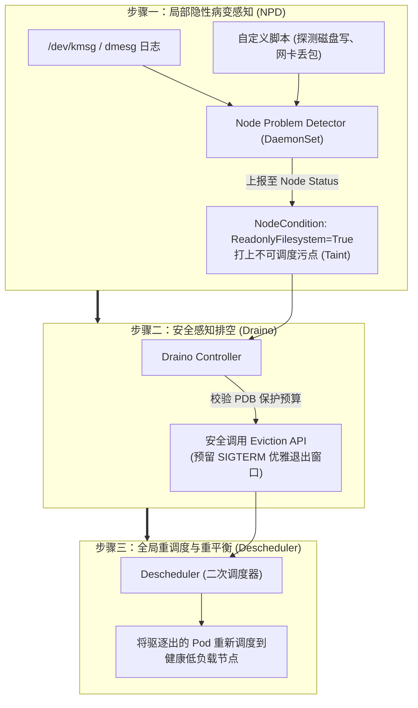
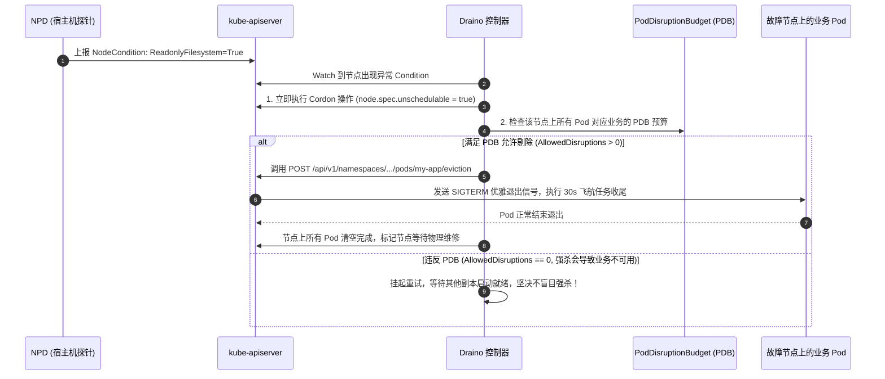
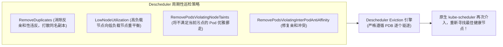
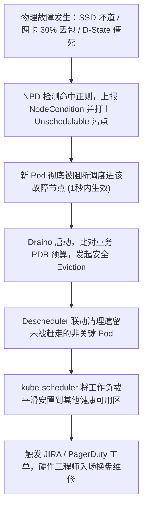

**TL;DR：** 在很多工程师的朴素认知中，Kubernetes 只要配置了健康检查与节点探针，节点坏了就会“自动自愈”。然而在真实百亿级生产集群中，最致命的故障从来不是“机器直接宕机断电（Black Failure）”，而是**“节点半死不活（Gray Failure）”**：由于底层物理硬件异常，宿主机根磁盘变为只读（Read-Only）、网卡驱动发生偶发丢包震荡、或者 Linux 内核陷入 D-state 僵死，**但此时负责上报心跳的 Kubelet 守护进程依然活着，且每隔 10 秒向控制面汇报 `NodeReady`！** 控制面误以为节点健康，继续将源源不断的新 Pod 调度上去，导致业务遭遇大面积 500 报错。为了攻克这一静默杀手，工业界演进出了完整的自愈三部曲：利用 **Node Problem Detector (NPD)** 深入内核日志（dmesg/journald）与硬件探针捕获隐性病变并打上 Node Condition；利用 **Draino** 感知 PodDisruptionBudget (PDB) 优雅执行节点的自动封锁（Cordon）与安全排空（Drain）；并由 **Descheduler（二次重调度器）** 打破调度器“一旦绑定终身不移”的物理限制，在节点亚健康或负载失衡时执行确定性的主动迁移。

---

## 一、 面试现场：从“节点明明 Ready 业务却全崩”到“确定性自愈”的连环追问

```text
面试官提问：
  "某核心生产集群在上周凌晨发生了一起 P1 级重大故障：
   某台 Worker 节点的物理 SSD 突然发生底层硬件坏道，Linux 内核出于保护直接将根文件系统 remount 为只读（Read-only file system）。
   由于 Kubelet 进程常驻在内存中，它依然每 10 秒正常向 API Server 上报 Lease 心跳，节点在控制面显示 100% Ready。
   但只要调度到这台机器上的 Pod，写入临时文件或创建容器时全量秒退挂死；更可怕的是，由于其他节点正常，HPA 扩容出来的 Pod 还被连续调度到该故障节点上，引发雪崩！
   请问：
   1. 为什么原生的 Kubelet 心跳机制完全无法发现这种‘局部坏死’？
   2. 如何设计一套端到端的闭环系统，在磁盘只读或网卡半死的 10 秒内，自动停止向该节点派发新流量，并把老 Pod 毫发无损地迁移出去？
   3. 深度逆向分析 Node Problem Detector、Draino 与 Descheduler 三者的分工与协作时序图。"
```

### 1.1 初级候选人的典型翻车点

许多初级工程师习惯性把希望寄托在“调整 Kubelet 参数”上：
- **翻车点一（以为调小心跳时间就能解决）**：“把 Kubelet 的 `node-status-update-frequency` 调成 2 秒，心跳快一点就能发现。”
  - **真相**：逻辑根本不成立！Kubelet 的心跳上报仅仅证明 **Kubelet 进程自身能跟 API Server 建立 TCP 连接并发送 PUT 请求**。哪怕整台宿主机磁盘已只读、网卡丢包 90%、内核到处是 Kernel Panic 堆栈，只要 Kubelet 的进程内循环没崩，心跳永远是正常的！
- **翻车点二（主张直接用脚本调用 `kubectl delete pod --force` 暴力清空）**：“巡检查到报错，直接在监控报警里配一个自动化脚本，执行强制删除 Pod。”
  - **真相**：极度危险。暴力删除会无视业务的 **PDB（PodDisruptionBudget）** 预算防线。如果一个关键支付集群总共只有 3 个副本，强杀可能会导致最后唯一的健康副本同时被杀，瞬间造成业务不可用；同时缺少优雅停机窗口，正在处理的飞航请求（In-Flight Requests）会全部丢弃。

### 1.2 资深工程师的破局切入点

资深平台架构师在回答该问题时，会从**内核观测（Kernel Observation）**、**控制面污名化（Condition Marking）**、**优雅排空（Eviction Pipeline）** 与 **集群重平衡（Rebalancing）** 四个步骤，一步一步清晰推导：



---

## 二、 隐性故障感知器：Node Problem Detector (NPD) 深度逆向

**Node Problem Detector（NPD）** 是 Kubernetes 官方孵化用于专门捕获宿主机不可见故障的守护进程。

```mermaid
flowchart TB
    subgraph HostOperatingSystem["物理宿主机 Linux 内核与硬件"]
        Dmesg["1. 内核环形缓冲区 (/dev/kmsg, journald)"]
        SysFS["2. 系统状态 (/proc, /sys, cgroups)"]
        CustomScript["3. 用户自定义诊断脚本 (如检查 NTP 偏斜、SSD 坏道)"]
    end

    subgraph NPDAgent["Node Problem Detector (DaemonSet 运行在每台宿主机)"]
        direction TB
        LogMonitor["KernelLogMonitor (正则匹配内核 Call Trace / Read-only / OOM)"]
        SystemLogMonitor["SystemLogMonitor (监控 systemd, containerd 崩溃)"]
        CustomPluginMonitor["CustomPluginMonitor (周期性执行脚本并获取退出码)"]
        
        LogMonitor <--> ConditionGenerator["状态与事件生成器"]
        SystemLogMonitor <--> ConditionGenerator
        CustomPluginMonitor <--> ConditionGenerator
    end

    HostOperatingSystem --> NPDAgent
    ConditionGenerator ==="向 API Server 注入 NodeCondition 或 NodeEvent"===> KubeAPIServer["kube-apiserver"]
```

### 2.1 NPD 如何捕获“磁盘只读”？

Linux 内核在检测到文件系统严重 I/O 错误时，会打印标准的内核日志：
`EXT4-fs error (device sda1): remounting filesystem read-only`。

NPD 的 `KernelLogMonitor` 通过直接监听内核设备 `/dev/kmsg`，利用正则规则毫秒级匹配：

```json
{
  "plugin": "kmsg",
  "logPath": "/dev/kmsg",
  "lookback": "5m",
  "rules": [
    {
      "type": "temporary",
      "reason": "OOMKilling",
      "pattern": "Kill process \\d+ \\(.*\\) score \\d+ or sacrifice child"
    },
    {
      "type": "permanent",
      "condition": "ReadonlyFilesystem",
      "reason": "FilesystemIsReadOnly",
      "pattern": "remounting filesystem read-only"
    }
  ]
}
```

一旦匹配到 `FilesystemIsReadOnly`，NPD 会立即向 API Server 提交 `PATCH /api/v1/nodes/<node>/status`，在 Node 的 `conditions` 数组中注入：
```yaml
conditions:
- type: ReadonlyFilesystem
  status: "True"
  reason: FilesystemIsReadOnly
  message: "EXT4-fs error: remounting filesystem read-only"
```
同时可联动设置自动为节点打上污点：`node.kubernetes.io/unschedulable:NoSchedule`，新 Pod 在 1 秒内被严禁调度进该机器！

---

## 三、 优雅自动排空控制器：Draino 的安全闭环

节点被打上 `ReadonlyFilesystem` 污点后，新 Pod 进不来了，但**已经在该节点上苟延残喘的存量 Pod 怎么办？**
如果让 SRE 人工登录执行 `kubectl drain`，在数万台节点的规模下根本来不及反应。
**Draino（Planet Labs 开源并被社区广泛采纳的自动排空组件）** 担当了这一自动清理执行官：



**资深设计亮点**：Draino 绝不直接调用 `DELETE /pods`，而是严格调用 **Kubernetes Eviction API**。Eviction API 在底层强制遵循 PDB 契约，如果剔除会导致业务存活副本数低于安全红线，操作会被 API Server 拒绝，从而在自动自愈与业务稳定性之间构筑起不可逾越的安全防火墙。

---

## 四、 二次调度器：Descheduler 破解“调度终身制”困局

Kubernetes 原生调度器（kube-scheduler）有一个著名的**“静态不可逆物理缺陷”**：
**kube-scheduler 只在 Pod 创建时做一次放置决策；一旦 Pod 绑定到了某台宿主机，除非 Pod 自身死亡或被手动删除，否则它将永远在这台宿主机上运行下去，死生不复相移！**

但在长周期运行后，集群必然面临以下失衡：
1. **热点聚集与资源倾斜**：某些节点 CPU 利用率高达 95%，而某些节点利用率只有 5%；
2. **反亲和性被破坏**：发布时由于某些节点维护，同一个服务的两个副本被临时塞在同一台宿主机上，单机故障会引发全局单点崩溃；
3. **节点污点追加后旧 Pod 不会挪走**：当节点被打了 `NoSchedule` 污点，只有新 Pod 不会被排进来，已经存在的 Pod 会继续留在故障节点上。

**Descheduler（官方孵化的二次调度器）** 彻底打破了这一诅咒：



### 4.1 生产级配置实战

```yaml
apiVersion: "descheduler/v1alpha2"
kind: "DeschedulerPolicy"
profiles:
  - name: default
    strategies:
      # 策略一：剔除违反节点污点的遗留 Pod
      RemovePodsViolatingNodeTaints:
        enabled: true
      # 策略二：剔除同节点重复部署的副本，强制跨机架打散
      RemoveDuplicates:
        enabled: true
      # 策略三：高负载节点向低负载节点迁移削峰
      LowNodeUtilization:
        enabled: true
        params:
          nodeResourceUtilizationThresholds:
            thresholds:
              "cpu": 20
              "memory": 20
            targetThresholds:
              "cpu": 70
              "memory": 70
```

---

## 五、 企业级灰度故障全自动自愈闭环流程图



---

## 六、 面试通关复盘与架构师高分回答模板

### 6.1 现场 2 分钟极速电梯演讲

> “面试官，在生产集群中，Kubelet 心跳正常但节点实际已经‘半死’（如磁盘只读、网络单通、D-state 进程堆积），本质是因为**原生 Kubelet 的心跳仅代表自身进程与 API Server 的控制连通性，完全无法感知宿主机底层复杂的局部物理病变**；若无外部干预，会导致新 Pod 继续被推入火坑。
> 
> 要彻底攻克这一隐性故障杀手，我们构建了工业级的**‘感知 $\to$ 封锁 $\to$ 排空 $\to$ 重平衡’四级自愈闭环体系**：
> 1. **在节点感知层（NPD）**：通过 DaemonSet 部署 Node Problem Detector，直接监听 `/dev/kmsg` 并挂载硬件探测脚本，在发生磁盘只读或驱动报错的 500ms 内，主动向控制面注入自定义 `NodeCondition` 并打上 `NoSchedule` 污点，秒级封死新流量；
> 2. **在自动排空层（Draino）**：部署 Draino 控制器监听异常 Condition，在保证业务 PDB（PodDisruptionBudget）不被击穿的前提下，调用 Eviction API 向存量 Pod 发送 SIGTERM 执行优雅断连与流量切除，杜绝暴力强杀引发的生产事故；
> 3. **在全局重平衡层（Descheduler）**：引入二次调度器打破原生调度‘一旦放置终身不移’的局限，周期性执行碎片整理与拓扑重排，彻底消灭单机热点与亲和性破坏，实现上万台异构节点的大规模自愈与韧性维稳。”

### 6.2 生产面试关键避坑守则

1. **绝对禁止 NPD 脚本陷入死循环占用 100% CPU**：NPD 的自定义监控脚本必须设置硬超时（Timeout，如 5 秒）。如果宿主机磁盘 I/O 已经彻底死锁，执行脚本自身的 `touch` 测试也会被挂死在 D-state，导致 NPD 产生数千个僵尸进程；
2. **严防全集群大面积误判触发批量排空雪崩**：如果 NPD 的正则规则配置过于宽松（例如把无害的 Warning 日志误判为硬件致命错误），一次内核微小变动可能导致全集群 500 台机器同时打上污点并全量自动 Drain，瞬间引发集群无可用节点！必须在 Draino 中配置**全集群最大并发排空比例（如 `--max-graceful-drain 5%`）**，设置熔断兜底红线；
3. **区分 DaemonSet 与普通 Pod**：在配置 Draino 和 Descheduler 时，必须显式跳过 `daemonset`、`kube-system` 基础组件以及拥有本地未备份存储（如 EmptyDir）的关键应用，防止将监控采集与存储 Agent 误杀。

---

## 参考资料与权威规范

1. Kubernetes SIG-Node. *Node Problem Detector (NPD) Architecture & Plugin Manual*. GitHub kubernetes/node-problem-detector.
2. Planet Labs. *Draino: A Kubernetes Controller for Automated & Safe Node Draining*. GitHub planetlabs/draino.
3. Kubernetes SIG-Scheduling. *Descheduler for Kubernetes: Strategies & Architecture*. GitHub kubernetes-sigs/descheduler.
4. Google SRE Team. *Site Reliability Engineering: Addressing Gray Failures in Distributed Infrastructures*.
5. Kubernetes Documentation. *Disruptions & Pod Disruption Budgets (PDB) Implementation*.
