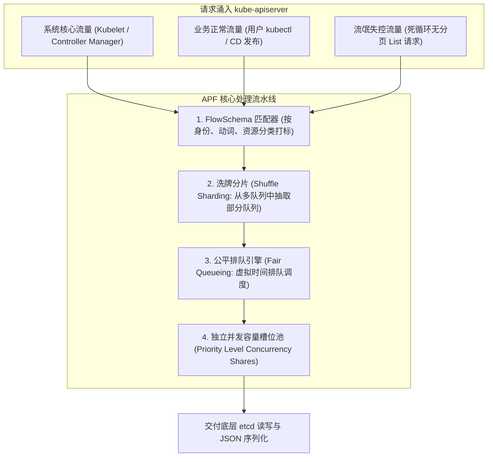
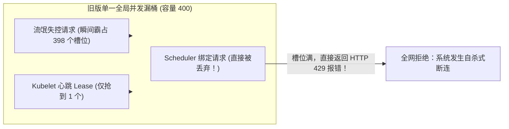
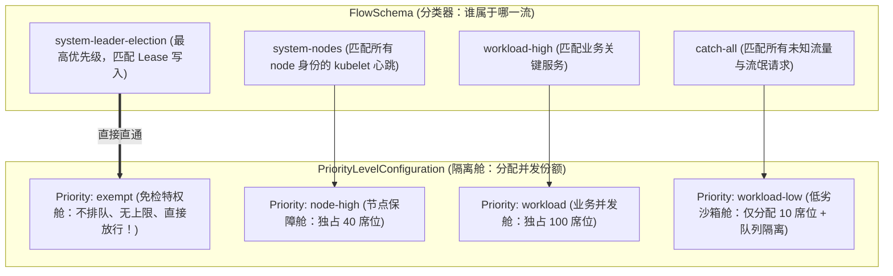
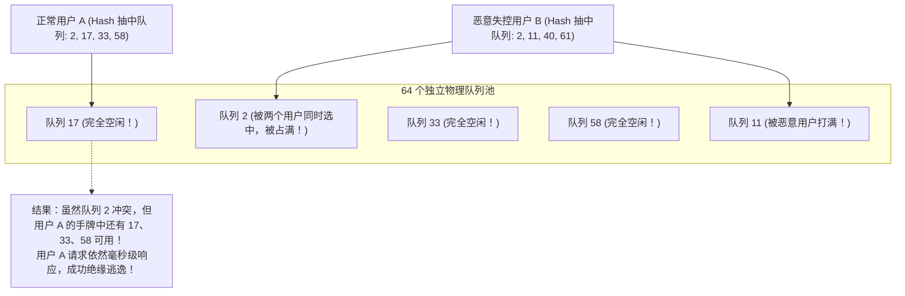

**TL;DR：** **`kube-apiserver`** 是整个 Kubernetes 集群唯一的流量入口与绝对中枢。在大规模生产环境中，它每秒可能面对成千上万个控制器、监控 Agent、自研脚本以及数十万 Pod 发起的海量并发请求。在过去，K8s 依赖两个全局粗暴的启动参数：`--max-requests-inflight` 与 `--max-mutating-requests-inflight` 进行简单的计数限流。这种朴素的“漏桶”在遭遇突发风暴时极具毁灭性：一旦某位研发人员写了一个未带限速的死循环脚本（如每秒发起 50,000 次没有分页的 `LIST /api/v1/pods`），全局并发槽位瞬间被全部耗尽，**导致 kubelet 的心跳上报、kube-controller-manager 的选举以及 kube-scheduler 的核心请求全部被 429（Too Many Requests）无差别粗暴拒绝，整个控制面在几秒内陷入脑裂自杀**！为了彻底终结这一脆弱机制，Kubernetes 在 1.20 推出、并在 1.29+ 进一步深化为核心标准的 **API Priority and Fairness（APF）** 带来了真正的工业级救赎：通过声明式 **`FlowSchema`** 将请求精细分类，借助 **`PriorityLevelConfiguration`** 划分独立受保护的并发池，并利用计算机网络领域顶级的 **公平排队算法（Fair Queueing）** 与 **洗牌分片（Shuffle Sharding）**，实现了**“哪怕流氓流量再狂暴，也只能在自己的单槽隔离舱内自生自灭，核心系统与无辜业务流量 100% 毫秒级直通”**的终极防御城墙。

---

## 一、 面试现场：从“一次失控脚本拖垮全集群”到“APF 精细隔离”的连环追问

```text
面试官提问：
  "某天下午，集群里某个实习生在调试新功能时，不小心写了一个带有死循环重试的 Python 自动化脚本，
   每秒并发向 API Server 发送 30,000 次没有带 ResourceVersion 的全量 List Pods 请求。
   结果在 10 秒钟内，API Server 的 CPU 瞬间拉到 100%，不仅所有工程师的 kubectl 连不上，
   更可怕的是：Kubelet 的心跳全部丢失，控制面误以为全集群几千个节点全部挂了，触发了连环驱逐风暴！
   请问：
   1. 为什么早期 Kubernetes 基于 max-requests-inflight 的防线在面对这种场景时会直接破产？
   2. Kubernetes 官方是如何通过 APF（API Priority and Fairness）彻底解决这个问题的？它在底层究竟是如何区分好流量与坏流量的？
   3. 深度逆向分析 APF 的排队算法：什么是洗牌分片（Shuffle Sharding）？它是如何从数学概率上杜绝哈希冲突打死正常请求的？"
```

### 1.1 初级候选人的典型翻车点

许多没有接触过底层 API-Machinery 源码的候选人，常常给出治标不治本的错误应对：
- **翻车点一（建议调大全局并发限制参数）**：“把 API Server 的 `--max-requests-inflight` 从默认的 400 调大到 40,000，扛住这个并发。”
  - **真相**：这是典型的“加速死亡”！未带分页的全量 List 请求是极其沉重的内存与 CPU 绞肉机（单个 10,000 Pod 的 List 响应可能高达 50MB，几十个并发序列化就会吃光几十 GB 内存并触发 Full GC 停顿）。盲目调大槽位只会让 API Server 在 2 秒内因为内存耗尽（OOM）直接物理崩溃，雪崩得更快更彻底！
- **翻车点二（以为只靠 Nginx 或网关在外部限流就能搞定）**：“在 API Server 前面挂一个 Nginx，按照客户端 IP 做 Rate Limiting 限流。”
  - **真相**：外部网关根本无法理解 Kubernetes 内核语义！所有跑在集群 Worker 节点上的 Pod，发包经过 NAT 后源 IP 往往全部是宿主机 IP；更关键的是，外部 Nginx 根本不知道哪个请求是紧急的 Kubelet 心跳（Lease 续约），哪个是无所谓的离线报表拉取，外部限流必定会误杀最关键的系统心跳。

### 1.2 资深工程师的破局切入点

资深平台架构师在回答该问题时，会从**分类（FlowSchema）**、**分池（PriorityLevel）**、**算法（Shuffle Sharding & Fair Queueing）** 三个层次，一层一层拆解这道精密的控制面水利工程：



---

## 二、 传统限流的物理破产：为什么全局计数器是灾难？

在 Kubernetes 1.20 之前，API Server 仅有两个粗糙的控制阀门：
- `max-requests-inflight`（针对只读请求，默认 400）；
- `max-mutating-requests-inflight`（针对写操作，默认 200）。



**物理致命伤**：**所有流量在同一个池子里无差别竞争！** 谁的 QPS 高、谁发得快，谁就能抢占全部槽位。低频但性命攸关的系统请求（如每 10 秒一次的 Lease 续约）瞬间被流氓流量淹没，控制面因此被彻底瘫痪。

---

## 三、 APF 架构内核逆向：FlowSchema 与 PriorityLevelConfiguration

APF 的核心哲学是：**“彻底打破大锅饭，实施精细分类与独立资源配额隔离”**。它完全基于两个原生声明式 CRD 构建：



### 3.1 豁免通道（Exempt）：核心脑裂防线

对于 `kube-system` 下核心控制器的选主与系统心跳，APF 提供了 **`exempt` 级别**：
```yaml
apiVersion: flowcontrol.apiserver.k8s.io/v1
kind: PriorityLevelConfiguration
metadata:
  name: exempt
spec:
  type: Exempt # 绝对特权：不计入并发槽位，不经过排队，零延迟立即执行！
```
无论集群遭遇了多么恐怖的 DDoS 攻击或死循环流量，核心 Lease 选举和心跳永远走独立绿色通道，**彻底杜绝了控制面因过载而发生选主脑裂与节点误判！**

---

## 四、 核心算法深度揭秘：洗牌分片与公平排队（Fair Queueing）

当成千上万个请求被归入同一个 `PriorityLevel` 时，如果该级别内部只有一个普通队列，那么单个恶意用户依然会把这个队列占满。
APF 引入了顶级的网络算法组合：**洗牌分片（Shuffle Sharding）** 与 **公平排队（Fair Queueing）**。

### 4.1 洗牌分片（Shuffle Sharding）的数学降维打击

假设某个 PriorityLevel 拥有 **64 个排队队列（Queues）**：
- 普通哈希分片：计算 `Hash(User) % 64`。如果恶意用户哈希到队列 3，普通用户也恰好哈希到队列 3，冲突概率为：
  $$P(\text{Collision}) = \frac{1}{64} \approx 1.56\%$$
- **洗牌分片（Shuffle Sharding）**：APF 为每个用户从 64 个队列中**随机抽取 4 个队列组成一个“队列手牌（Hand of 4）”**，用户请求只在这 4 个队列中选择当前长度最短的入队！



**数学奇迹**：两个不同用户抽中完全相同的 4 个队列的概率为：
$$P(\text{Full Collision}) = \frac{1}{\binom{64}{4}} = \frac{1}{635,376} \approx 0.000157\%$$
**冲突概率骤降了整整一万倍！** 流氓用户无论怎么狂发请求，最多只能把属于他自己的那 4 个队列塞满，其他 60 个队列依然风平浪静！

### 4.2 公平排队算法（Fair Queueing）：按处理成本动态倒序

在出队执行时，APF 不采用朴素的 FIFO（先进先出），而是根据请求的**“计算复杂度/估算耗时”**，为每个请求计算一个**虚拟完成时间（Virtual Finish Time）**：
- 消耗内存少、耗时短的轻量 GET 请求，虚拟时间推进慢，获得极高的出队优先级；
- 消耗数十 MB 内存的笨重全量 LIST 请求，虚拟时间推进极快，被自动罚排在队列后方！
这使得轻量级查询能够自由穿透笨重查询，实现了微秒级的流量塑形。

---

## 五、 生产级调优实战：惩治无分页大 List 灾难

在生产运维中，最容易引发灾难的莫过于大批量未带分页的 List。我们可以通过自定义 `FlowSchema` 对其进行精准“降权进沙箱”：

```yaml
apiVersion: flowcontrol.apiserver.k8s.io/v1
kind: FlowSchema
metadata:
  name: heavy-list-sandbox
spec:
  priorityLevelConfiguration:
    name: catch-all-low-priority # 导流至低权重隔离舱
  rules:
  - subjects:
    - kind: Group
      group:
        name: system:authenticated # 针对所有已认证用户
    resourceRules:
    - verbs: ["list"]           # 仅拦截 list 动词
      apiGroups: [""]
      resources: ["pods", "configmaps", "secrets"]
```

通过这一配置，哪怕研发写出再逆天的死循环 List 脚本，其请求会被强制分流到只有 5 个并发槽位的低效隔离舱，在内部排队超时返回 429，而整个集群的其他业务和管理操作丝毫感受不到任何波动！

---

## 六、 面试通关复盘与架构师高分回答模板

### 6.1 现场 2 分钟极速电梯演讲

> “面试官，在拥有十万级 Pod 的生产集群中，API Server 面对死循环流氓请求依然能保持坚若磐石，核心在于其放弃了早期陈旧粗暴的全局计数器，全面升级为**工业级的 API Priority and Fairness（APF）多维流控中枢**。
> 
> 在底层机制上，APF 构筑了三重不可逾越的隔离防线：
> 1. **第一重：声明式流量分类与独立隔离舱（FlowSchema & PriorityLevel）**。通过细粒度规则将请求解耦，为核心 Lease 心跳与选举开辟绝对优先的 `exempt` 豁免直通舱，确保控制面在任何极端洪峰下绝不发生自杀式脑裂；
> 2. **第二重：洗牌分片（Shuffle Sharding）数学级防穿透**。利用 64 个队列结合随机 4 手牌机制，将不同用户哈希冲突概率从 1.5% 暴力压降至六十万分之一，流氓用户的并发请求被牢牢封死在自身的手牌队列中，绝不外溢污染邻居；
> 3. **第三重：基于虚拟完成时间的公平排队（Fair Queueing）**。打破传统 FIFO 限制，惩罚消耗大量 CPU/内存的重型无分页 List，让轻量 GET 请求快速穿透，实现整个控制面的极速高吞吐自愈。”

### 6.2 生产面试关键避坑守则

1. **绝对禁止随意调大流氓隔离舱的并发份额**：发现有应用频繁被 429 拦截时，第一反应绝对不是给它的 `PriorityLevel` 加槽位，而必须通过审计日志（Audit Log）抓出是谁在发未经分页的暴力请求，要求其必须通过 `limit` 和 `continue` 机制改为分批拉取；
2. **警惕 Watch 请求长期占用并发席位**：Watch 请求与长连接长轮询在握手成功并切入流式传输后，会主动释放其占用的 APF 并发座位（Seats），转为后台事件流推送。但在建立连接瞬间依然需要消耗槽位，必须合理设置 `queuing` 中的 `handSize` 与 `queueLengthLimit`；
3. **监控关键指标避免隐性死锁**：生产环境必须持续监控 Prometheus 指标：
   - `apiserver_flowcontrol_rejected_requests_total`（被拒绝的请求数）；
   - `apiserver_flowcontrol_current_inqueue_requests`（当前排队深度）；
   - `apiserver_flowcontrol_request_wait_duration_seconds`（排队等待耗时）；
   当发现核心业务的排队等待时长超过 100ms 时，秒级预警介入排查。

---

## 参考资料与权威规范

1. Kubernetes SIG-API Machinery. *API Priority and Fairness (APF) Technical Architecture & Design*. k8s.io/docs.
2. Kubernetes Enhancement Proposals. *KEP-1040: Coordinated API Priority and Fairness in Kube-apiserver*.
3. Amazon Web Services. *Shuffle Sharding: Massive Multi-Tenant Isolation with Little Overhead*. AWS Architecture Center.
4. Alan Demers, Srinivasan Keshav, Scott Shenker. *Analysis and Simulation of a Fair Queueing Algorithm*. ACM SIGCOMM 1989.
5. Mike Spreitzer. *API Priority and Fairness in Kubernetes 1.29+: Production Tuning Guide*.
