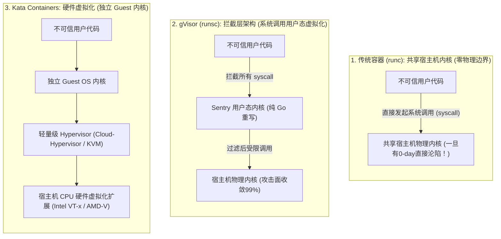
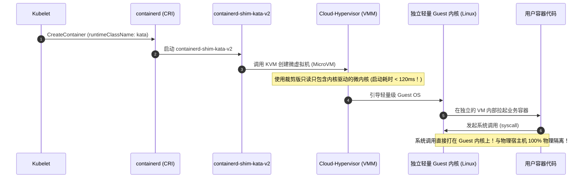

**TL;DR：** 传统的 Linux 容器（Docker、containerd + runc）在操作系统层面本质是**“软隔离”**：无论你配置了多么严苛的 Capabilities 剪裁、seccomp 系统调用白名单还是非 root 运行，**容器内进程物理上始终在与宿主机及其他容器共享同一个 Linux 内核**。一旦 Linux 内核本身曝出高危 0-day 提权漏洞（如著名的 Dirty COW、Dirty Pipe 或 eBPF 验证器逃逸漏洞），黑客只需在容器内执行一段精心构造的 C 汇编利用代码，就能利用内核自身的特权直接覆写宿主机内核内存，在纳秒级完成物理越狱！在公有云 Serverless 函数计算、AI 智能体自主代码执行（Code Interpreter 沙箱）以及多租户公有算力池场景下，共享内核意味着致命的“单点穿透、全网沦陷”。为了铸就不可逾越的物理防线，云原生演进出了两大**安全沙箱容器（Sandbox Containers）**流派：以 Google **gVisor（`runsc`）** 为代表的“应用内核流派”（在用户态用 Go 语言重写了一个微型 Linux 内核 Sentry 拦截系统调用），与以 **Kata Containers** 为代表的“硬件级微虚机流派”（利用 KVM/Cloud-Hypervisor 在毫秒级拉起一个独立的轻量 Guest OS 内核）。

---

## 一、 面试现场：从“0-day 内核逃逸”到“沙箱容器硬隔离”的连环追问

```text
面试官提问：
  "我们正在做一个面向公众用户的‘AI Code Interpreter’代码沙箱平台，允许用户上传任意 Python 代码并在我们的 K8s 集群中即时运行。
   上周安全团队提交了严重安全红线：某恶意用户上传了利用 Linux 内核 0-day 提权（如 Dirty Pipe）的利用代码，直接突破了容器，拿到了物理宿主机的最高 root 权限！
   请问：
   1. 为什么我们已经配置了 runAsNonRoot: true 和只读根文件系统，依然挡不住内核 0-day 提权逃逸？
   2. 业界两大安全沙箱标准（Google gVisor vs Kata Containers），它们在底层架构上是如何消灭内核共享漏洞的？
   3. 在大模型实时代码执行的高并发场景下，如何根据冷启动延迟（Cold Start）、系统调用损耗（Syscall Overhead）和内存底噪，对两者进行科学选型？"
```

### 1.1 初级候选人的典型翻车点

许多没有深入过 Linux 内核底层的工程师，容易陷入对容器隔离机制的盲信：
- **翻车点一（以为给容器配全安全限制就能防内核漏洞）**：“配置严格的 AppArmor Profile，把所有危险的 Capabilities 全部 Drop，开启只读根文件系统，就能防住一切攻击。”
  - **真相**：逻辑根本防不住！这些防线防的是“容器内用户态二进制滥用特权”；而内核 0-day 漏洞利用的是**合法系统调用路径中的内核逻辑缺陷**（例如利用合法的 `splice(2)` 或 `pipe(2)` 触发内核页缓存脏数据竞争）。进程只需要发起最普通的系统调用，就能直接攻击正在执行该调用的宿主机内核本身，用户态限制在内核级漏洞面前瞬间沦为纸老虎！
- **翻车点二（主张为每个用户代码拉一台完整公有云虚拟机）**：“在 AWS/阿里云上通过 API 每次动态开一台云服务器跑用户代码，绝对安全。”
  - **真相**：完全脱离商业实际。公有云开机耗时通常在 30 秒至 1 分钟以上，单台虚机成本极高，根本无法支撑用户在 Web 界面要求“1 秒内运行 Python 脚本并出图”的秒级交互 SLA。必须依赖容器化轻量沙箱技术。

### 1.2 资深工程师的破局切入点

资深云原生安全架构师在回答该问题时，会直接拆解**传统容器、用户态内核沙箱（gVisor）与硬件级微虚机沙箱（Kata）的三层物理隔离拓扑**：



---

## 二、 Google gVisor（runsc）深度逆向：用户态进程当内核

gVisor 是 Google 内部用来运行 Google Cloud Run 和 App Engine 的核心基石。它的终极目标是：**“彻底不给不可信代码直接接触宿主机物理内核的机会！”**

```mermaid
flowchart TB
    subgraph SandboxBoundary["gVisor 安全沙箱沙盒边界"]
        App["不可信用户应用 (如 Python 脚本)"]
        
        subgraph SentryEngine["Sentry 核心引擎 (运行在普通非特权用户态)"]
            SyscallTable["实现 300+ Linux 系统调用的 Go 语言逻辑 (内存管理、调度、网络栈)"]
            Netstack["Go 语言重写的用户态 TCP/IP 协议栈"]
        end

        subgraph GoferEngine["Gofer 文件访问代理 (隔离进程)"]
            FileAccess["受控的 9P / virtio-fs 文件操作"]
        end

        App ==="所有的系统调用被 ptrace / KVM 陷入 Sentry"===> SentryEngine
        SentryEngine <--> GoferEngine
    end

    subgraph HostLinuxKernel["物理宿主机 Linux 内核"]
        HostSyscall["宿主机极少数基础调用 (futex, epoll, madvise)"]
    end

    SentryEngine -->|"仅发起安全的白名单系统调用"| HostSyscall
    GoferEngine -->|"安全代读宿主机文件"| HostLinuxKernel
```

### 2.1 核心组件分工

1. **Sentry**：gVisor 的大脑。它是一个用内存安全的 Go 语言编写的**“伪 Linux 内核”**，实现了超过 300 个核心 Linux 系统调用（如虚拟内存管理、进程信号、线程调度）。应用在容器内调用 `open`、`read`、`fork` 时，根本没有陷入宿主机内核，而是在这个 Go 程序内部被解析消化！
2. **Gofer**：文件系统代理。Sentry 自身运行在严格的 seccomp 沙箱中，被剥夺了任何文件打开权限。当应用需要读写文件时，必须通过 IPC 请求通知独立的 Gofer 进程协助代理，实现了严苛的最小特权分离。

### 2.2 物理代价：Syscall 开销的取舍

- **优势**：**极速冷启动（约 50ms~100ms）**，内存开销极低（单个容器底噪约 15MB~20MB）；
- **致命软肋**：**系统调用密集型应用性能严重暴跌**。由于每一次系统调用都会引发从应用到 Sentry 的上下文切换与内存拷贝，对于重度依赖磁盘 I/O 或高频网络收发的应用（如 Redis、Kafka），吞吐可能会暴跌 **30%~60%**！

---

## 三、 Kata Containers 深度逆向：硬件级微虚拟机

Kata Containers（由 OpenInfra 基金会主导的顶级项目）代表了完全不同的哲学——**“既然软件模拟有代价，那就直接借用 CPU 的硬件虚拟化（Intel VT-x / AMD-V）！”**



### 3.1 核心架构特征

1. **硬件级强制隔离（MMU 隔离）**：利用 CPU 提供的二级地址转换（EPT / NPT），容器内存被硬件级定界在虚拟机的物理地址空间内。黑客哪怕在 Guest 内核中把系统黑翻天、触发了内核崩溃（Kernel Panic），死的仅仅是属于他自己的那个微型 VM，宿主机和其他租户连一根毫毛都不会动！
2. **Cloud-Hypervisor 的极致精简**：抛弃了陈旧笨重的传统 QEMU，使用由 Rust 编写的专用云原生虚拟机管理器 **Cloud-Hypervisor**，删除了所有冗余的软驱、IDE、声卡模拟，将虚拟机引导时间压缩至 **100ms 级别**。

---

## 四、 Kubernetes 原生编排：RuntimeClass 混排实战

在同一个 Kubernetes 集群中，我们绝不能“一刀切”将所有服务都塞进沙箱。企业级标准做法是：**内部受信任的业务微服务跑在高性能的 runc 上；外部不可信的用户代码与 AI 脚本动态编排进沙箱！**

通过 Kubernetes 原生的 **`RuntimeClass`**，开发者仅需一行声明即可完成运行时的安全升维：

```yaml
# 1. 平台管理员注册运行时
apiVersion: node.k8s.io/v1
kind: RuntimeClass
metadata:
  name: gvisor
handler: runsc # 对应 containerd 配置中的 containerd-shim-runsc-v1
---
apiVersion: node.k8s.io/v1
kind: RuntimeClass
metadata:
  name: kata
handler: kata  # 对应 containerd-shim-kata-v2
---
# 2. 研发部署不可信代码沙箱
apiVersion: v1
kind: Pod
metadata:
  name: untrusted-ai-executor
spec:
  # 核心：将该 Pod 隔离在 gVisor 沙箱中运行！
  runtimeClassName: gvisor
  containers:
  - name: code-runner
    image: python:3.11-slim
    command: ["python", "-c", "exec(open('user_code.py').read())"]
```

---

## 五、 沙箱容器技术三维深度选型对决矩阵

| 评估维度 | 传统容器 (runc) | Google gVisor (runsc) | Kata Containers (Cloud-Hypervisor) |
| --- | --- | --- | --- |
| **隔离级别** | **软隔离**（共享宿主机内核） | **用户态系统调用拦截**（伪内核隔离） | **硬件级硬隔离**（CPU 虚拟化扩展） |
| **防御 0-day 内核逃逸** | **完全无法防御** | **极高**（攻击流量仅能破坏用户态 Sentry） | **绝对免疫**（突破 Guest OS 依然被困在 VM 内） |
| **冷启动耗时** | **50ms** | **80ms $\sim$ 150ms**（快速） | **120ms $\sim$ 300ms**（极轻量微虚机） |
| **单实例内存底噪** | $\sim 5\text{MB}$ | **15MB $\sim$ 25MB** | **40MB $\sim$ 80MB**（包含精简 Guest OS 内核） |
| **系统调用性能损耗** | **0% 损耗**（原生执行） | **高（损耗 20% $\sim$ 50%）** | **低（损耗 2% $\sim$ 8%）** |
| **嵌套虚拟化依赖** | 无依赖 | **无依赖**（任意云服务器裸金属均可直接跑） | **必须依赖底层硬件虚拟化（Nested VT-x）** |
| **典型落地场景** | 内部受信任微服务、高性能计算 | **AI Code Interpreter、Serverless 短平快函数** | **多租户裸金属容器云、长期运行的大模型推理** |

---

## 六、 面试通关复盘与架构师高分回答模板

### 6.1 现场 2 分钟极速电梯演讲

> “面试官，在公有云跑不可信用户代码时，哪怕配置了只读根文件系统和非 root，依然防不住内核 0-day 逃逸，本质是因为**传统容器在物理层面上始终与宿主机共享同一个 Linux 内核，攻击者利用合法系统调用的逻辑漏洞即可直接打穿底层物理内存**。
> 
> 在多租户与 AI 代码执行沙箱的建设中，我们坚决引入**安全沙箱运行时（Sandbox Containers）构建零信任隔离底盘**：
> 1. **针对短平快、高并发、秒级扩缩容的 AI 代码解释器与轻量无状态函数**：选型 **Google gVisor（`runsc`）**。利用纯 Go 编写的 Sentry 用户态内核全量拦截应用系统调用，将宿主机物理内核调用面收敛 99%，在不依赖嵌套虚拟化（Nested Virtualization）的前提下，实现 80ms 极速冷启动与坚固的软件防线；
> 2. **针对计算密集型、I/O 吞吐要求极高、或运行长期不可信工作负载的场景**：选型 **Kata Containers**。借助 Cloud-Hypervisor 与 KVM 硬件虚拟化扩展，在 150ms 内拉起轻量独立 Guest 内核，将系统调用直接交由专用微虚机消化，以硬件级 MMU 边界实现对物理宿主机的 100% 绝对免疫；
> 3. **统一基于 Kubernetes `RuntimeClass` 实现按需混部**：核心受信业务跑原生 `runc`，外部不可信代码动态按需调度至 `gvisor` 或 `kata` 节点，兼顾极高计算性能与金融级安全隔离。”

### 6.2 生产面试关键避坑守则

1. **公有云环境务必警惕嵌套虚拟化（Nested Virtualization）陷阱**：在 AWS/阿里云部署 Kata Containers 时，所选的 Worker 节点虚拟机必须显式支持并开启嵌套虚拟化（如 AWS 的 `.metal` 实例或带有嵌套支持的实例族），否则 Kata 会因为无法获取 `/dev/kvm` 导致 Pod 拉起失败；而 gVisor 完全基于纯软件拦截，无此限制；
2. **严防 gVisor 中的未实现系统调用导致业务崩溃**：虽然 Sentry 实现了绝大多数常用 POSIX 系统调用，但对于极冷门的硬件交互调用（如特殊的 `ioctl`、底层性能剖析工具 `perf`）可能返回 `ENOSYS`。上线前必须在预发环境进行充分的全系统调用覆盖扫描；
3. **Kata 内存自动膨胀与 Virtio-balloon 调优**：每个 Kata Pod 都会启动一个 Guest OS，其内存底噪不可忽视。生产环境必须开启 **Virtio-mem 或 Virtio-balloon** 特性，允许宿主机在容器闲置时动态回收虚拟机的未占用内存，防止物理集群发生大面积内存碎裂与浪费。

---

## 参考资料与权威规范

1. Google Cloud. *gVisor Architecture: How Sentry & Gofer Secure Container Workloads*. gvisor.dev/docs.
2. OpenInfra Foundation. *Kata Containers Architecture: Secure Containers with Lightweight Virtual Machines*. katacontainers.io.
3. Linux Foundation. *CVE-2022-0847 (Dirty Pipe) & Linux Kernel Privilege Escalation Vulnerability Analysis*.
4. Kubernetes Documentation. *RuntimeClass: Orchestrating Heterogeneous Container Runtimes*.
5. Cloud Native Security Special Interest Group. *CNCF Multi-Tenant Isolation & Sandbox Container Landscape*.
