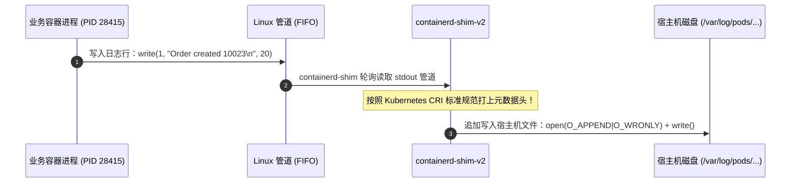
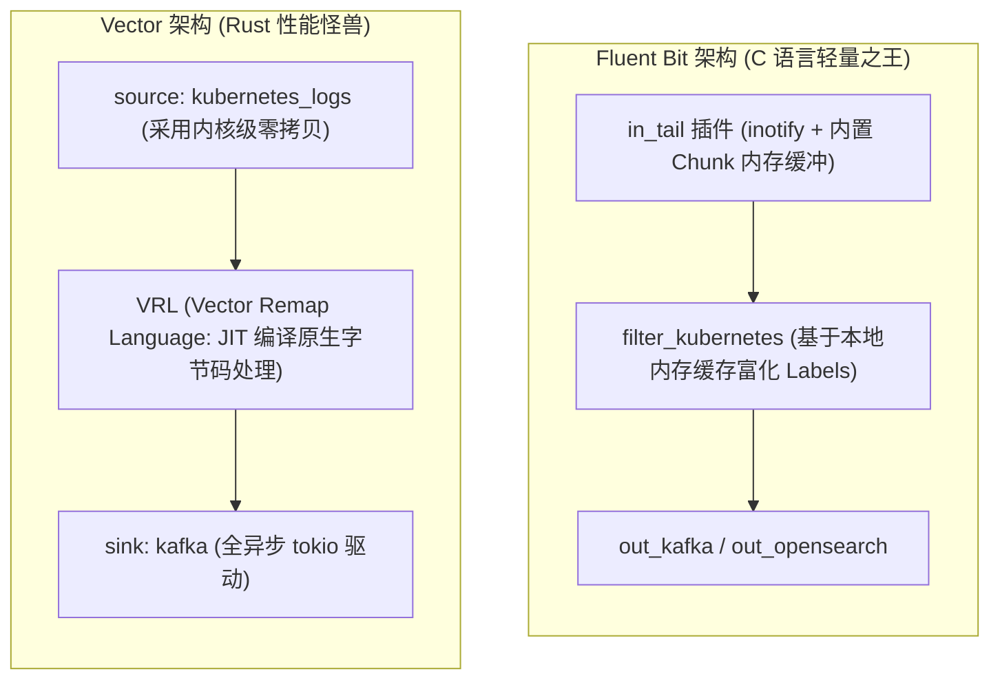

**TL;DR：** 在很多初中级工程师的方案设计中，采集微服务日志最“省事”的方案莫过于在 Deployment 中塞一个 **Sidecar 容器（如 Filebeat 或 Logstash）**，让它读取业务挂载的共享卷。然而，一旦集群规模跨越至万级 Pod、日产日志突破 **100TB（每秒数十万至数百万事件 EPS）** 时，Sidecar 模式会瞬间沦为可怕的**资源黑洞与性能杀手**：10,000 个 Sidecar 容器白白吃掉超过 **300GB 宝贵内存**，向操作系统注册数十万个 `inotify` 句柄导致 Linux 内核表锁死，且发布时与业务容器的生命周期竞态频发导致日志大面积截断丢失。为了构筑真正工业级的可观测底座，现代大厂全面拥抱**“节点级 DaemonSet 共享采集架构（Node-level Logging Agent）”**。深入理解容器标准输出（stdout/stderr）是如何在 **containerd CRI** 层面写入宿主机 `/var/log/pods/` 物理目录，并结合新一代用 C 编写的 **Fluent Bit** 与用 Rust 编写的 **Vector**，利用 **内核零拷贝（Zero-Copy）、内存映射（mmap）与元数据缓存异步富化（Metadata Enrichment）**，才是在百亿级洪峰下保障日志“零丢失、低延迟、极低 CPU 底噪”的终极架构分水岭。

---

## 一、 面试现场：从“Sidecar 内存雪崩”到“内核零拷贝日志管道”的连环追问

```text
面试官提问：
  "目前公司核心生产集群拥有 1,500 台 Worker 节点、运行着 15,000 多个 Pod，每天产生超过 100TB 日志。
   过去某业务线为了排障方便，给每个业务 Pod 都强行挂了一个 Filebeat Sidecar 采集落盘日志。
   上周大促期间，集群大面积发生节点 OOM 与句柄耗尽崩溃，平台直接叫停了该方案。
   请问：
   1. 为什么在超大规模集群中，Sidecar 日志采集方案在物理上注定会走向崩溃？
   2. 现代 Kubernetes 是如何处理容器的 stdout/stderr 标准输出的？containerd 在宿主机上留下的物理日志文件格式到底长什么样？
   3. 对比业界主流方案（Fluent Bit vs Vector），它们在内存管理、CPU 开销与内核 I/O（如 inotify、mmap）上有何本质差异？如何做到不丢日志且单机百万 EPS 极限吞吐？"
```

### 1.1 初级候选人的典型翻车点

许多没有操盘过百 TB 级日志架构的候选人，常常给出浮于表面的理由：
- **翻车点一（以为 Sidecar 仅仅是稍微占了点内存）**：“Sidecar 内存用得多，把每个 Sidecar 的 memory limits 压小到 20MB 不就行了吗？”
  - **真相**：完全忽视了 **操作系统的内核级物理瓶颈**！
    - **Linux inotify 实例耗尽**：每个采集器在监听多文件时，都会向内核注册 `inotify_add_watch`。15,000 个进程并发轮询，直接击穿 Linux 的 `/proc/sys/fs/inotify/max_user_watches` 全局上限，导致全节点的系统服务连正常的文件变更都无法监听；
    - **磁盘 I/O 调度争用与上下文切换暴涨**：15,000 个进程同时向宿主机磁盘发起高频 `read(2)` 系统调用，触发天文数字般的内核态/用户态上下文切换，CPU 算力全部被白白烧在 I/O 等待（iowait）上！
- **翻车点二（以为节点采集 Agent 必须拉取 API Server 查元数据）**：“每采集一条日志，Agent 向 Kubernetes API Server 发起请求，查出这个 Pod 的 Labels 和 Namespace 贴在日志上。”
  - **真相**：这是典型的“瞬间打崩控制面”！每天 100TB 日志意味着每秒涌入数百万条日志事件。如果让每个节点的 Agent 都去频繁向 API Server 查询元数据，`kube-apiserver` 的 etcd 和网络连接会在 3 秒内被瞬间冲垮！

### 1.2 资深工程师的破局切入点

资深平台架构师在回答该问题时，会清晰解构**业务进程、CRI 运行时、宿主机文件系统、DaemonSet 采集引擎与集中式检索集群的端到端数据流动管道**：

```mermaid
flowchart TD
    subgraph ContainerRuntime["1. 容器内与 CRI 物理落盘"]
        App["业务进程 (fmt.Println / console.log)"] --> Pipe["stdout/stderr FIFO 管道"]
        Pipe --> Shim["containerd-shim-v2"]
        Shim --> LogFile["宿主机物理落盘文件:<br>/var/log/pods/<ns>_<pod>_<uid>/<container>/0.log"]
    end

    subgraph LoggingAgent["2. 节点级 DaemonSet 极速流式采集 (Vector / Fluent Bit)"]
        direction TB
        LogFile --> FileWatcher["内核 inotify 监听 + 块级零拷贝 (mmap)"]
        FileWatcher --> Parser["CRI Log Format 极速解析 (时间戳 + 流标识)"]
        Parser --> MetaCache["本地内存轻量 Informer (只读本地 Node 维度的 Pod 缓存)"]
        MetaCache --> Batcher["批量压缩微批 (Chunked Compression - ZSTD/GZIP)"]
    end

    subgraph StoragePipeline["3. 集中式管道与下游存储"]
        Batcher ==="高性能长连接 (HTTP/2 / gRPC)"===> Kafka["Kafka / Pulsar 消息缓冲削峰池"]
        Kafka --> Engine["ClickHouse / Elasticsearch / VictoriaLogs"]
    end
```

---

## 二、 容器日志的物理本质：stdout 是如何落盘到宿主机的？

在 Kubernetes 中，业务应用执行 `System.out.println` 或 `printf` 时，它并没有写到任何本地磁盘文件中，而是写到了进程的 **文件描述符 1（`stdout`）** 或 **文件描述符 2（`stderr`）**。

### 2.1 containerd 的管道捕获与落盘链路



### 2.2 CRI 日志文件的真实格式逆向

在宿主机上，进入 `/var/log/pods/` 目录，你会看到以下标准化结构：
`/var/log/pods/<namespace>_<pod-name>_<pod-uid>/<container-name>/<retry-count>.log`

打开这个文本文件，其物理格式严格遵循 **CRI Log Format 规范**：

```text
2026-07-11T10:15:30.123456789+08:00 stdout F {"order_id": 10023, "action": "checkout", "cost_ms": 42}
2026-07-11T10:15:30.124567890+08:00 stderr F Error connecting to payment gateway: timeout
```

每一行严格由三部分构成：
1. **RFC3339Nano 纳秒级时间戳**（2026-07-11T...）；
2. **输出流标识**（`stdout` 或 `stderr`）；
3. **日志截断标识**：
   - **`F`（Full）**：整行日志完整无截断；
   - **`P`（Partial）**：日志单行超过了 CRI 默认的 16KB 上限，被 containerd 强制拆解为多行，采集器必须负责将其自动**重拼还原（Multi-line Reassembly）**！

---

## 三、 节点级采集引擎决战：Fluent Bit vs Vector 架构逆向

在 2024~2026 年的现代集群中，陈旧笨重基于 JVM 的 Logstash 和 Ruby 编写的 Fluentd 已被彻底淘汰，战场收敛为用 C 语言编写的 **Fluent Bit** 与用 Rust 编写的 **Vector**：



### 3.1 内存与 I/O 模型的底层对决

1. **Fluent Bit（极致轻量）**：
   - 用纯 C 语言编写，单节点 DaemonSet 运行时内存消耗通常**仅需 30MB~50MB**；
   - 内部实现了专有的二进制 Chunk 内存管理系统，支持当消费端积压时将内存日志自动安全刷盘至临时目录（`storage.type: filesystem`），杜绝 OOM；
2. **Vector（极致吞吐与灵活转换）**：
   - 由 Datadog 主导、用 Rust 语言编写，内存安全且天然防数据竞争；
   - 内置强大的 **VRL（Vector Remap Language）**：通过 JIT 即时编译为机器码执行字段解析与脱敏，解析速度比 Fluent Bit 正则快 3~5 倍；
   - 内存消耗略高（约 80MB~150MB），但在单机吞吐上可轻松压榨至 **200,000+ EPS**。

---

## 四、 核心优化技巧：元数据富化绝不拖垮 API Server

为什么采集器能给日志贴上 `pod_name`、`namespace`、`app_label`，但 API Server 却完全不卡顿？

**物理机制：Node-Local Informer 缓存机制**
优秀的采集器（无论是 Fluent Bit 还是 Vector）的 `kubernetes` 过滤器，在启动时绝对不执行全量 List-Watch，而是使用 **`FieldSelector` 限制仅监听本节点**：

```go
// 伪代码：日志采集器的高效元数据过滤
opts := metav1.ListOptions{
    FieldSelector: fmt.Sprintf("spec.nodeName=%s", currentHostNodeName),
}
// 仅缓存当前宿主机上的十几个 Pod，内存占用不足 500KB！
podInformer := client.CoreV1().Pods("").NewFilteredInformer(..., opts, ...)
```

采集器直接从文件名 `/var/log/pods/<ns>_<pod>_<uid>/...` 解析出 UID，然后在极其微型的**本地只读内存哈希表（Local In-memory Hash Table）** 中执行 $O(1)$ 查找，整个解析富化过程 **0 外部网络 I/O 开销**！

---

## 五、 百 TB 日志大厂生产选型与拓扑全景图

| 评估维度 | 方案 A: Pod 独占 Sidecar 模式 | 方案 B: 宿主机 Fluent Bit DaemonSet | 方案 C: 宿主机 Vector DaemonSet |
| --- | --- | --- | --- |
| **单节点内存开销** | **暴增数十倍**（100 个 Pod 吃掉 3GB 内存） | **极小（约 40MB）** | **低（约 100MB）** |
| **内核 inotify 句柄消耗** | 极其严重（数千进程并发监听） | **极小（单进程集中监听）** | **极小（单进程集中监听）** |
| **最大吞吐上限 (EPS)** | 单实例极低 | **极高（单机约 100,000 EPS）** | **极致性能（单机可达 300,000+ EPS）** |
| **复杂清洗与脱敏能力** | 依赖外部管道二次处理 | 中等（内置基础过滤器） | **极强（支持 VRL JIT 脚本原生地清洗）** |
| **多租户业务隔离性** | 业务完全独立，互不影响 | 共享 Agent，需防止单一流氓日志刷爆通道 | 共享 Agent，内置严格的背压与磁盘缓冲 |

---

## 六、 面试通关复盘与架构师高分回答模板

### 6.1 现场 2 分钟极速电梯演讲

> “面试官，在日产 100TB 日志的超大规模 Kubernetes 集群中，‘给每个 Pod 挂 Sidecar 采日志’是典型的自杀式架构，其本质是因为**数万个独立的采集进程会无情瓜分几百 GB 的内存底噪，向操作系统注册天文数字的 inotify 句柄导致内核表锁死，且频繁引发高频上下文切换与磁盘 I/O 争用**。
> 
> 在现代工业级日志底座建设中，我们坚决推行**基于 containerd 标准输出的‘节点级 DaemonSet 共享流水线’**：
> 1. **在物理落盘层：规范业务一律输出至 stdout/stderr**。由 containerd-shim-v2 统一管道捕获并落盘至宿主机 `/var/log/pods/` 目录，严格遵循纳秒级 CRI Log Format 规范，从物理上解耦业务生命周期与采集逻辑；
> 2. **在节点采集层：选型高性能 Fluent Bit 或 Vector**。单节点仅需一个轻量守护进程，利用 Linux `inotify` 集中监听目录，通过 `mmap` 与内存切片实现零拷贝读取，将整机内存底噪从几 GB 压缩至 50MB 以内；
> 3. **在元数据富化层：实施 Node-Local 极简缓存过滤**。采集器仅与 API Server 建立基于 `spec.nodeName` 的本地单节点 Pod Informer，在本地内存中通过哈希比对微秒级完成标签注入，彻底消除对 API Server 的网络风暴冲击，实现单机数十万 EPS、全集群百 TB 级的极速低延迟吞吐。”

### 6.2 生产面试关键避坑守则

1. **绝对禁止容器产生无休止的日志刷屏（Log Flooding）打爆宿主机磁盘**：必须在 containerd 的 `config.toml` 或 Kubelet 中强制配置日志轮转策略：
   ```yaml
   containerLogMaxSize: "50Mi" # 单文件最大 50MB
   containerLogMaxFiles: 5     # 最多保留 5 个备份文件，自动覆盖旧日志！
   ```
   严防某个死循环报错将物理宿主机根分区写到 100% 触发磁盘只读与节点 Eviction 崩溃；
2. **正确处理 Partial 日志的多行重拼（Multi-line Reassembly）**：Java 的大型堆栈报错（Exception Stacktrace）可能长达数千行。必须在 Fluent Bit / Vector 中启用 `multiline.parser`，依据 CRI 的 `P` 与 `F` 标记将其准确拼装为单一事件，防止下游分词索引时被撕裂成几千条孤立无头日志；
3. **引入独立 Kafka / Pulsar 消息队列实施削峰填谷**：在节点 Agent 与底层存储（ClickHouse / ES）之间，必须强制架设高吞吐消息队列。当发生全网故障引发日志量暴涨 10 倍时，队列负责阻断洪峰，保障下游存储引擎绝不被活活压垮。

---

## 参考资料与权威规范

1. Kubernetes Documentation. *Logging Architecture: Cluster-level Logging & Node-level Agents*.
2. CNCF Fluent Bit Project. *Fluent Bit: High Performance Log Processor & Forwarder Architecture*. fluentbit.io.
3. Datadog & Vector Project. *Vector Architecture: Building High-Capacity Observability Data Pipelines in Rust*. vector.dev.
4. Containerd Community. *CRI Logging Specification & /var/log/pods Directory Structure*.
5. Brendan Gregg. *Systems Performance: Enterprise and the Cloud (Linux I/O & inotify Profiling)*.
