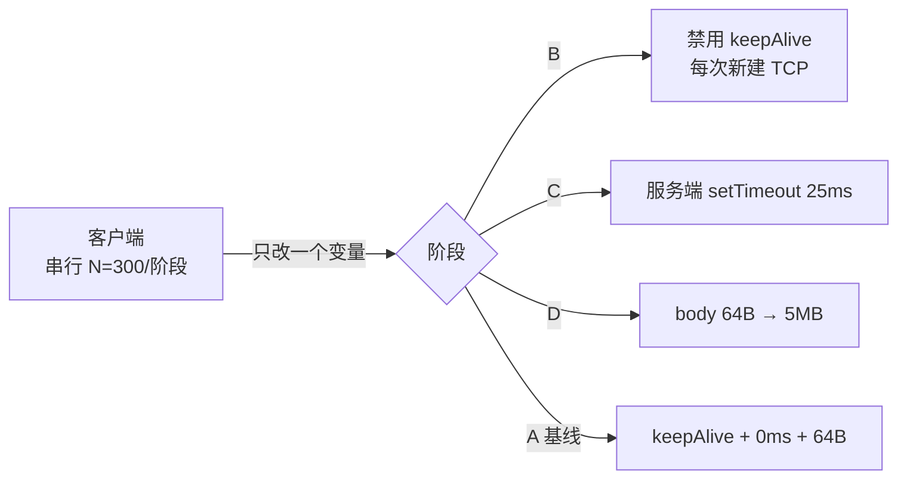

**TL;DR：** 延迟问题最忌讳端到端猜。本文用零依赖 Node 实验（`experiments/latency-attribution/`）演示三段归因法：锁死串行与机器，每轮只改一个变量，用相邻阶段的分布**差值**给连接建立、服务端思考、响应传输各段记账。本机 loopback 实测：连接段 +0.19ms、思考段把 `setTimeout(25)` 放大到 **+27.0ms**（p95 达 29.6ms）、传输 5MB 段 +3.4ms；重复一轮方向与量级一致。两个直接教训：定时器时长不是延迟契约；loopback 的绝对值不可外推到公网——可外推的是方法。

## 一、别猜了：延迟问题先做减法

"接口 p99 高了"之后最常见的动作是加缓存、换框架、调参数——在不知道延迟由哪几段构成之前，这些都是掷骰子。正确的第一步是**分解**：客户端观测到的总延迟，物理上只有三个来源：

1. **连接建立**：TCP 握手（公网上再加 TLS 往返），复用连接时近似为零；
2. **服务端思考**：从请求到达 handler 到开始回写的时间，包括你的业务逻辑和它等的一切；
3. **响应传输**：字节从服务端缓冲区走到客户端完成解析的搬运时间。

归因方法是一个受控实验：固定机器、串行化请求排除排队干扰，然后**每一轮只放行一个变量**，其余全部锁死。某段的成本就等于"放行它的那轮"与基线轮的分布差值。[单变量纪律](/writing/benchmark-one-variable)在基准测试里防的是 min 统计掩盖变量；在这里防的是"同时调了连接池和超时参数，最后不知道谁起了作用"。

## 二、实验设计：一台机器拆三段

实现只有 73 行零依赖代码（`experiments/latency-attribution/measure.mjs`）：同一个进程里起 HTTP 服务，四个阶段依次跑，每阶段独立 Agent 加一条预热请求。两个容易被忽略的设计：

- **串行**（`maxSockets=1`）：并发会引入排队延迟，让"思考"和"传输"混进等待，差值法失效；
- **每阶段预热**：第一条请求承担 JIT、首连等一次性成本，不进统计。

## 三、三段的数字与各自的教训

本机原始输出（完整两轮见 `evidence/latency-attribution/2026-08-23-local/`）：

| 阶段 | mean(ms) | p50(ms) | p95(ms) | 归因(均值差) |
| --- | --- | --- | --- | --- |
| A 基线：复用连接+0ms+64B | 0.386 | 0.235 | 1.038 | — |
| B 每次新建连接 | 0.576 | 0.372 | 1.878 | 连接段 **+0.190** |
| C 服务端思考 25ms | 27.383 | 26.536 | 29.561 | 思考段 **+26.997** |
| D 传输 5MB body | 3.826 | 3.029 | 5.867 | 传输段 **+3.439** |

重复一轮的三段差值为 +0.142 / +26.531 / +3.946ms——方向一致，量级一致，具体数字不同。这正是要诚实记录的形态：**归因结论是方向性的，单次数字属于本轮环境**。

**教训一：定时器不是契约。** 服务端写 `setTimeout(send, 25)`，语义是"至少 25ms 后进入回调队列"，不是"25ms 后响应到达"。实测均值放大到 27ms，p95 到 29.6ms——中间是定时器精度、事件循环排队和两次跨进程网络栈搬运。如果你拿 `setTimeout(30)` 模拟下游来定上游的超时预算，这 2~5ms 的系统性过冲就是事故余量。

**教训二：loopback 数字不许出门。** 本机新建连接只贵 0.14~0.19ms，因为环回没有真实 RTT。公网上一次新连接 = TCP 握手至少 1 个 RTT，加 TLS 再 1~2 个 RTT——RTT 40ms 时就是 40~120ms，比 loopback 大三个数量级。同理，5MB 传输段折算的有效吞吐约 1.5GB/s，这是内存带宽不是网卡带宽。**可外推的是差值法本身，不可外推的是任何一段的绝对值。**

## 四、方法的边界

这套实验回答的是"单个请求的延迟构成"，有三条明确的边界：

1. **它是串行诊断，不是容量测试**。生产环境的高延迟常常来自排队（并发争用 CPU、连接池、锁），串行测量天然看不见排队。定位排队要用分段打点（handler 进出、连接获取前后各自计时），而不是端到端猜测；
2. **三段之外还有第四段**：客户端自身的解析与 GC 开销在本实验里被计入总账却未单独建模，需要时可以同样用"改一个变量"的方式把它剥出来；
3. **差值依赖分布而不依赖单点**。看 mean 和 p95 的联合变化，不要只看一轮 min——那正是[基准统计陷阱](/writing/benchmark-one-variable)的老路。

## 五、结论：归因靠差值，不靠直觉

延迟优化的正确顺序是先记账再花钱：先用受控差值弄清三段各占多少，再决定钱花在哪。本次实测的账目上，三段增量合计约 30.6ms，其中思考段 27.0ms 占 88%——此刻任何针对连接池或压缩的优化都是在给剩下的 12% 动手术。

下一步可执行的事：给你服务里最慢的那个接口做一次同样的四阶段测量（基线 / 关 keepalive / 注入已知 think / 放大 body），半小时就能知道该优化哪一段——以及更重要的是，**不该**优化哪一段。

## 参考资料

- 本篇实验与原始输出：`experiments/latency-attribution/measure.mjs`、`evidence/latency-attribution/2026-08-23-local/`
- Node.js 定时器语义（"至少"而非"精确"）：[Timers in Node.js](https://nodejs.org/en/learn/asynchronous-work/event-loop-timers-and-nexttick#timers)
- 站内相关：[benchmark 只改一个变量：min 统计会把第二个变量藏起来](/writing/benchmark-one-variable)、[Nagle 与延迟 ACK](/writing/tcp-nagle-delayed-ack)
