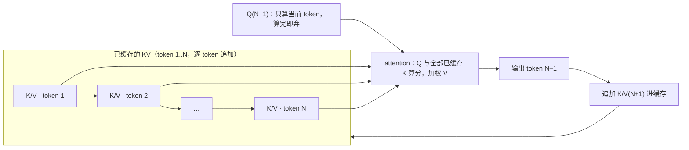
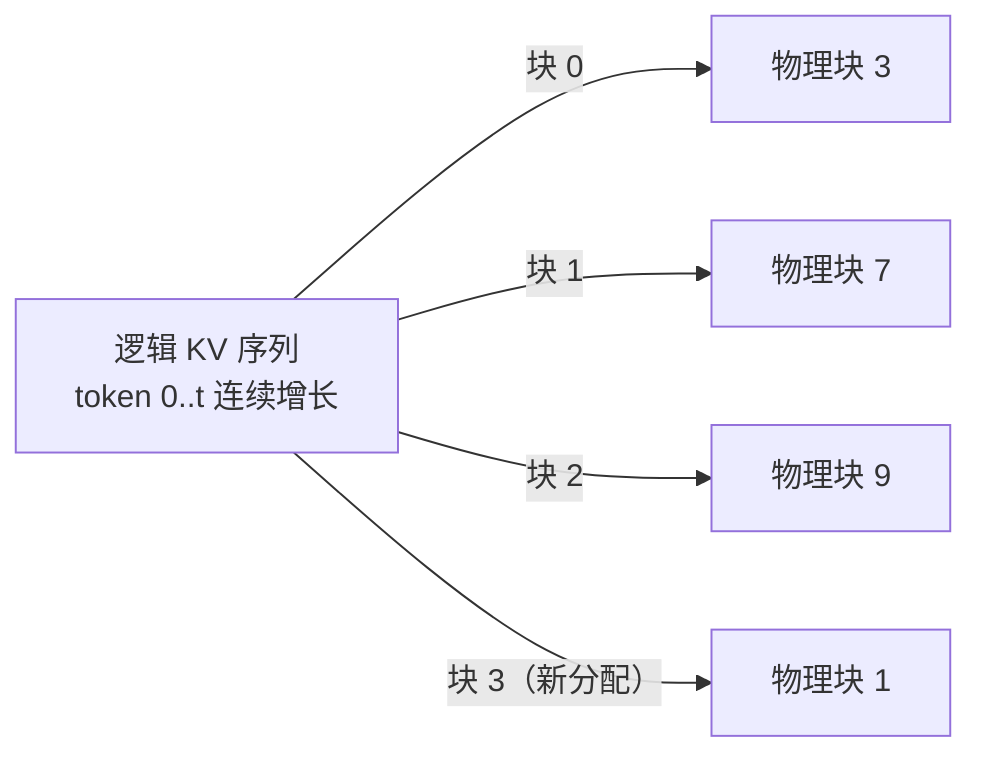

**TL;DR：** 长上下文 + 高并发的推理成本大头不是算力，是 KV cache 显存。每 token 每层要缓存 2（K 与 V）× kv_heads × head_dim × 字节数（fp16 为 2）字节：Llama-3-8B 是 128 KiB/token，4K 上下文一个请求就要 0.5 GiB、32K 要 4 GiB，一张 40GB 卡减去约 16GB 权重和约 4GB 固定开销后，4K/8K/32K 分别只能撑约 40/20/5 个并发；换 MHA 的 Llama-2-7B，同样一张卡只剩 11/5/1——参数差不多，KV 差四倍。MHA 换 GQA 把 KV 成本降到 1/4 到 1/8；PagedAttention 用固定大小的块按需分配，把连续预分配造成的 60%-80% 浪费基本抹平（vLLM 博客/论文报告）；KV 量化（fp8）再把字节减半，但质量损失不能从字节公式推出，本文不伪造该数字。一张卡能撑几个并发 =（显存 − 权重 − 固定开销）÷ 每 token KV 字节 ÷ 上下文长度，这是一道部署前就该心算的算术题。

## 一、 KV cache 从哪来：Q 是一次性的，K/V 才要逐 token 攒

Attention 的解码是逐 token 推进的：模型每生成一个新 token，都要让它和之前所有 token 做一次注意力。这里有个常被跳过的机制细节，它决定了缓存的对象——**Q 是一次性的，K 和 V 不是**。

第 N+1 步做的事是：取当前 token 的 query Q₍N+1₎，与已生成 1..N 个 token 的 key K₁..K_N 逐一算相似度，softmax 之后加权 value V₁..V_N。注意 K₁..K_N 和 V₁..V_N 是之前每一步算好的，这一步还要用；而 Q₍N+1₎ 只服务于当前这一步，用完即弃。所以缓存的对象天然是 K 和 V——每个头、每一层、每个已生成的 token 各一份。新 token 生成后，它的 K 和 V 被追加进缓存，下一轮就要参与别的 token 的注意力。



KV cache 因此是逐 token 增长的：每解码一步，全部层的 K/V 数组各多一行，而且这是持续占用的量——生成多少 token 就存多少行，对话不结束、显存不释放。

算力不在这条链上。decode 每步只推一个新 token 的前向，投影与 FFN 的计算量不随上下文涨；attention 那一步每步确实要扫一遍已缓存的 K/V，计算量随上下文线性涨，但那是瞬时计算，算完即释放。真正按上下文长度线性增长、并长期占住显存不还的是 KV cache——vLLM 论文（Kwon et al., SOSP 2023）正是把它的显存浪费当成 serving 的核心问题提出的：它"巨大且动态地增长和收缩"，权重是一次性装载的静态量，KV cache 才是负载一高就吃光活跃内存的动态量。这也解释了那个反直觉现象：模型没换、算力没换，为什么长对话跑着跑着，同一张卡能并发服务的请求数越来越少——KV cache 一直在把显存吃进去。

## 二、 字节账公式：代入四个真实模型，40GB 卡各撑几个并发

### 2.1 公式，一步能心算

KV cache 的大小由模型结构决定，跟输入内容无关。每层每 token 的字节数是固定的：

```
per_token_per_layer = 2（K 与 V） × kv_heads × head_dim × bytes_per_element
```

- 2：K 和 V 各一份；
- kv_heads：KV head 数。MHA 下等于 Q head 数，GQA/MQA 下小于 Q head 数（第三节展开）；
- head_dim：每个 head 的维度（下面四个模型都是 128）；
- bytes_per_element：fp16/bf16 为 2 字节，fp8/int8 为 1 字节。

再乘三层就得到单个请求的总 KV，以及并发上限：

```
per_token    = per_token_per_layer × num_layers
单请求 KV    = per_token × seq_len
并发上限     = (显存 − 权重 − 固定开销) ÷ 单请求 KV
```

权重是静态的，一次加载占住；固定开销是 CUDA context、激活与预填充峰值——本文取 4 GB，这是估算余量不是引擎实测（实验入口的边界一节说清）。

### 2.2 代入真实模型 config，逐项核对

配置来自 Hugging Face 上 meta-llama 系列公开 config.json（核对日期 2026-08-16）。head_dim 不在 config 里显式给出，等于 hidden_size ÷ num_attention_heads（如 Llama-3-8B：4096 ÷ 32 = 128）。四个模型的逐项数字：

| 模型 | 层数 | Q heads | KV heads | head_dim | 注意力结构 | 每 token KV | 4K 上下文 KV |
| --- | --- | --- | --- | --- | --- | --- | --- |
| Llama-2-7B | 32 | 32 | 32 | 128 | MHA | 512 KiB | 2 GiB |
| Llama-2-13B | 40 | 40 | 40 | 128 | MHA | 800 KiB | 3.125 GiB |
| Llama-2-70B | 80 | 64 | 8 | 128 | GQA | 320 KiB | 1.25 GiB |
| Llama-3-8B | 32 | 32 | 8 | 128 | GQA | 128 KiB | 0.5 GiB |

以 Llama-3-8B 把每一步写出来：每层每 token = 2 × 8 × 128 × 2 = 4096 B = 4 KiB；再乘 32 层 = 128 KiB/token。4K 上下文 = 128 KiB × 4096 = 512 MiB = 0.5 GiB，8K = 1.0 GiB，32K = 4.0 GiB。权重 fp16 约 16 GB（8B × 2 字节），减去固定开销后可用给 KV 的约 20 GB。于是：

| 上下文长度 | 单请求 KV | 并发上限（40GB 卡） |
| --- | --- | --- |
| 4096 | 0.5 GiB | 40 |
| 8192 | 1.0 GiB | 20 |
| 32768 | 4.0 GiB | 5 |

对照 Llama-2-7B（MHA）：每层每 token = 2 × 32 × 128 × 2 = 16 KiB，×32 层 = 512 KiB/token，4K 单请求 = 2 GiB。同一张 40GB 卡，权重约 14 GB、余量约 22 GiB，4K/8K/32K 分别只能撑 11/5/1 个并发。

上下文从 4K 拉到 32K，同一张卡从 40 个并发掉到 5 个。注意"4K→32K"只涨了 8 倍，但它乘到每个并发上：并发数反比于 seq_len。总 KV = 每 token KV × seq_len × batch，乘积增长——seq_len 翻倍、batch 再翻倍，KV 变四倍。严格说这不是指数，但方向性的结论比"指数"这个词更重要：**在固定显存里，长上下文和多并发只能二选一，余量被乘积吃掉。** 这就是长上下文 + 高并发是显存杀手的原因。以上数字用 `experiments/llm-kv` 计算器可直接复现，全部手算可复核。

## 三、 MHA 与 GQA/MQA：KV heads 的数量才是账单分母

### 3.1 参数大小不决定 KV 成本

看 2.2 的表，最容易漏掉的判断：KV 成本与总参数无关。Llama-2-7B 和 Llama-3-8B 参数量几乎一样，每 token KV 却差 4 倍（512 KiB vs 128 KiB）——因为 7B 用 MHA（kv_heads=32），8B 用 GQA（kv_heads=8）。70B 更反直觉：比 13B 大 5 倍参数，每 token KV（320 KiB）反而比 13B（800 KiB）少一半还多。KV 成本由 kv_heads × head_dim × layers 决定，前馈层、embedding、甚至 Q head 的数量都不在分母上。

### 3.2 三种注意力结构，KV 成本各差一档

- **MHA**：每个 Q head 各带一份 K/V，kv_heads = q_heads。KV 成本 = 2 × q_heads × head_dim × layers。Llama-2-7B/13B 走这条。
- **GQA**（Grouped-Query Attention，Ainslie et al. 2023）：把 q_heads 分成若干组，每组共享一份 K/V。Llama-2-70B 把 64 个 Q head 分成 8 组（kv_heads=8），KV 成本直接除以 8。
- **MQA**（Multi-Query Attention，Shazeer 2019）：所有 Q head 共享一份 K/V（kv_heads=1），KV 成本除以 q_heads，最省。

为什么主流落点是 GQA 而不是更省内存的 MQA：MQA 把 KV 压到极限，但质量有可见损失——一份 K/V 被所有 Q head 共享，注意力表达的多样性下降，GQA 论文报告 MQA 相比 MHA 掉质量，而中等分组数（如 8 组）的 GQA 在多数任务上接近 MHA。所以今天的主流开源模型（Llama-2-70B、Llama-3 全系、Mistral）清一色 GQA 且 kv_heads=8：这是"用最少的 KV 字节保住 MHA 质量"的工程共识。代价也写清楚：KV heads 是共享的，模型在长距离记忆上的区分度理论上弱于每个 query 独立 KV 的 MHA，长上下文与量化场景下仍有差距——只是显存账划算到让多数场景接受。选模型时，kv_heads 是 config 里一个能直接查的维度，比看参数总量更能预判部署成本。

## 四、 PagedAttention：动态增长的内存，连续分配为什么放不下

字节账算出来的是"理想下限"。真实 serving 的浪费来自一个更具体的问题：**decode 阶段 KV cache 是逐 token 增长的，但分配内存必须预先规划。** 早年实现（以及 vLLM 论文对比的 FasterTransformer、Orca 等基线）给每个请求预分配一块等于"最大序列长度"的连续内存，随用随填。这套做法有三笔浪费：

1. **预分配空转（内部碎片）**：请求实际只生成 100 token，却占着 32K 的配额。vLLM 博客的表述是，现有系统因碎片化与过度预留浪费掉 60%-80% 的 KV 内存；论文 Fig. 2 的 profiling 显示，实际用于存 token 状态的只有 20.4%-38.2%。
2. **外部碎片**：请求在不同时刻结束，释放出大小不一的空洞，连续分配器很难把新请求塞进去。
3. **无法共享**：同一份系统提示词，每个请求都从头算一遍、各存一份。

PagedAttention 的解法是把 KV cache 当操作系统的内存来管：切成固定大小的块（vLLM 引擎默认每块 16 个 token），用一张 block table 记录逻辑位置到物理块的映射，块按需分配、用完即还。物理上不要求连续，任何等大小的空洞都能装下任意块，外部碎片随之消失；块从左到右填满、满了才分配新块，论文的表述是 vLLM 把单个请求的全部内存浪费限制在一个块以内（只有最后一个块可能不满）：



块级引用计数还带来零拷贝共享：并行采样、beam search 与共享同一前缀的多个请求，相同的 KV 块直接复用、写才复制。论文 §6.3 在 OPT-13B + Alpaca 轨迹上报告的共享收益：parallel sampling 省 6.1%-9.8%，beam search 省 37.6%-55.2%（块共享数 ÷ 不共享时的总块数）。前缀共享在论文 §6 的共享前缀实验里被单独验证（Fig 16-17，WMT16/ShareGPT 轨迹上的前缀复用）——prompt 部分的 KV 只留一份。

论文报告的吞吐收益（SOSP 2023 摘要口径）：相对 FasterTransformer 与 Orca，"with the same level of latency，吞吐提升 2-4×"，且序列越长、模型越大收益越明显；vLLM 官方博客给出相对 HuggingFace Transformers 最高 24×、相对 TGI 最高 3.5× 的对比（A10G 跑 LLaMA-7B、A100 40GB 跑 LLaMA-13B）。这些是论文/博客当时环境的结果，不是本机测得——本仓库还没跑过 vLLM 基准（见实验入口）。

两种方案的语义承诺差异：连续预分配卖的是"实现简单、布局可预期"，代价是内存不确定性的全部成本由浪费承担；PagedAttention 卖的是"按需精确分配 + 块级共享"，代价是多一层 block table 的间接访问与块调度逻辑。为什么值得：KV 占用是 serving 里最不确定的量，把不确定性从"内存浪费"变成"调度问题"，正是分页的意义——总量没变，但每一字节都花在刀刃上。这一节的主语是内存管理，不是加速；吞吐数字来自论文和官方博客的特定硬件/负载，本机尚未验证，不能写成分页的通用倍数。

## 五、 生产账：长上下文乘出来的贵，prefix caching 与 KV 量化的省

### 5.1 长上下文是乘出来的贵

单请求 KV = per_token × seq_len，并发上限 = 余量 ÷ 单请求 KV。两个结论直接可算：上下文翻倍，单请求 KV 翻倍，并发减半；批大小和上下文长度共享同一份显存。连续批处理（见[LLM 推理的排队税：从静态批到 continuous batching](/writing/llm-continuous-batching-throughput)）能把 decode 容量填得更满，但批的上限先被 KV 显存卡住——那篇讲排队税，这篇讲排队之前一张卡能装多少人的硬顶。长上下文本身不贵，贵在它占住了卡、把并发压没了：算力上多算几个点积，显存上却是一整条必须全部缓存的历史。这就是"显存不是算力"的本义。

有个细节要单独说：对 8B 这类中档模型，40GB 卡上卡住并发的是 KV 而不是权重（16GB 权重绰绰有余）；对 70B 这类大模型，权重本身就把 40GB 撑爆（fp16 约 140GB），得先张量并行分多卡——那时 KV 预算是"每张卡分到的那份"。两张账独立，别混在一起估。

### 5.2 prefix caching：共享前缀的 KV 直接复用

PagedAttention 的块加引用计数让前缀共享水到渠成：两个请求的前 N 个 token 完全一致，前 N 个 token 的 KV 块直接复用，新请求只计算并存储差异部分。省的是两笔账：共享前缀的 prefill 计算（不必重算注意力），以及共享前缀的 KV 显存（不必每请求各存一份）。vLLM 的 automatic prefix caching 就是这个机制的工程化，文档明确它在 block 粒度上做缓存与命中。

算术式可以量化：共享前缀 KV = 前缀长度 × 每 token KV 字节（全并发只存一份，而不是 N 份）。Llama-3-8B 一个 3000-token 的系统提示词，每 token 128 KiB，前缀 KV = 384,000 KiB ≈ 375 MiB ≈ 0.37 GiB。20 个并发共享这个前缀：未命中时要存 20 份（375 MiB × 20 ≈ 7.3 GiB），命中后只占一份（≈ 0.37 GiB），另省下 19 次请求里每次 3000 token 的预填充算力。命中率越高、并发越大，这页账越划算——和供应商侧前缀计费的折扣同源，见[AI 应用的后端没有魔法](/writing/ai-backend-no-magic)。它也共享同一句纪律：静态内容在前、动态内容在后。前缀缓存在**块粒度**上匹配（vLLM 默认 16 token/块）：块内任一 token 不同，整块不命中、其后所有块随之失效——时间戳、请求 ID、用户名塞进系统提示词，等于每个请求都在换缓存键。这不是配置问题，是 prompt 结构维护问题。

### 5.3 KV 量化（fp8/int8）：字节减半，精度另算

把公式里的 bytes_per_element 从 2 降到 1，KV 显存减半、并发翻倍。用计算器跑 KV-only fp8（权重保持 fp16）：Llama-3-8B 每 token 从 128 KiB 降到 64 KiB，40GB 卡并发从 40/20/5 变 80/40/10。vLLM 支持 `--kv-cache-dtype fp8_e4m3` / `fp8_e5m2`，还提供 `--kv-cache-dtype-skip-layers` 让敏感层（如 sliding-window attention）留在原精度——这个开关本身就说明精度有代价。

代价是什么：K/V 是注意力分数的输入，量化误差直接进 softmax，并随序列长度累积，长上下文下比短上下文更容易漂。所以 KV 量化的判断必须落到"固定评估集 + 同一模型 fp16 vs fp8 各跑一遍"的对比，而不是看几个样例。本仓库没做过这个对比，本文只保留评估方法，不给质量损失数字。把 KV 量化和向量索引里的 PQ 放一起看，是同一种交易：用精度换字节数，见[向量检索不是算相似度：HNSW 的图、IVF 的桶与 PQ 的量化](/writing/vector-index-hnsw-ivf-pq)。另一个边界要分清：权重量化（GPTQ/AWQ 之类 4bit）省的是权重那份，KV 量化省的是 KV 那份，两者独立、可叠加，别把"量化到 4bit 了内存够了"想当然。这张按层、按头、按 token 累乘出来的字节账，和[LSM 与 B-tree 的读写放大](/writing/lsm-vs-btree-io-amplification)里拆写放大是同一类字节账——它拆 I/O 放大，这里拆显存放大，都能先用纸面公式估个量级再动手。

## 六、 实验入口：把公式跑成本地计算器，外部运行证据另行补测

公式只是一张纸，跑成工具才能随手复用。`experiments/llm-kv/kv_cache_budget.py` 用纯标准库实现第二节的账（Python 3，无需安装），从仓库根目录运行：

```bash
python3 experiments/llm-kv/kv_cache_budget.py --model llama3-8b
python3 experiments/llm-kv/kv_cache_budget.py --model llama2-7b
python3 experiments/llm-kv/kv_cache_budget.py --model llama2-70b   # fp16 在 40GB 上放不下，脚本会提示
python3 experiments/llm-kv/kv_cache_budget.py --model llama3-8b --kv-dtype fp8
```

第一个命令的输出（与正文数字一致）：

```
$ python3 experiments/llm-kv/kv_cache_budget.py --model llama3-8b
模型: Llama-3-8B  权重 dtype: fp16  KV dtype: fp16  层数=32  kv_heads=8  head_dim=128
每层每 token K/V: 4096 B  (4 KiB)
每 token 全层 K/V: 131072 B = 128.0 KiB
权重(估算): 16.0 GB  固定开销: 4 GB  可用给 KV: 20.0 GB

 seq_len       单请求 KV   batch=1 总 KV       并发上限      并发时 KV 上限
------------------------------------------------------------------
    4096     0.500 GiB        0.500 GiB         40      20.000 GiB
    8192     1.000 GiB        1.000 GiB         20      20.000 GiB
   32768     4.000 GiB        4.000 GiB          5      20.000 GiB
```

手算复核任一行：2 × 8 × 128 × 2 × 32 层 = 131,072 B = 128 KiB；128 KiB × 4096 ÷ 2³⁰ ≈ 0.5 GiB；20 ÷ 0.5 = 40，全链可验。支持 `--model llama2-7b/llama2-13b/llama2-70b/llama3-8b`、`--vram`、`--dtype`（权重）、`--kv-dtype`（KV，缺省同权重）、`--seq`、`--overhead`。模型配置来自公开 config.json，权重按 参数 × 字节 估算，README 里写清了边界与完整示例。

当前没有取得两类外部运行证据：

1. **KV 量化精度**：同一评估集、同一模型，fp16 vs fp8 KV 各跑一遍对比。vLLM 命令模板（尚未在本机执行）：
```bash
vllm serve meta-llama/Llama-3-8B-Instruct \
  --max-model-len 32768 --gpu-memory-utilization 0.9 --kv-cache-dtype fp16
vllm serve meta-llama/Llama-3-8B-Instruct \
  --max-model-len 32768 --gpu-memory-utilization 0.9 --kv-cache-dtype fp8_e4m3
```
2. **本机 vLLM 实际可撑并发**：受 GPU 型号、张量并行、CPU 调度与 SLO 影响，本文只给了内存上界，没有本机基准。

边界承认：并发上限是"理想分页、按需精确分配"的内存上界；固定开销 4 GB 是估算余量，不是引擎实测；模型没放进 decode 算力、scheduler 与 SLO。

## 七、 结论：部署前的算术，不是压测后的惊讶

把五章收成一句判断：LLM serving 的成本瓶颈已经从算力迁移到显存账，而这张账能在部署前用公开 config 心算出来——**一张卡能撑几个并发 =（显存 − 权重 − 固定开销）÷（每 token KV 字节 × seq_len）**。四个杠杆各管一段：GQA 压低每 token KV（常数项），PagedAttention 把浪费的 60%-80% 要回来（效率项），prefix caching 砍重复部分（复用项），KV 量化减半（精度项，待实测）。三个可执行结论：

1. 选模型先看 kv_heads，而不是只看参数：GQA 把 KV 成本从"跟参数走"变成"跟 kv_heads 走"，Llama-3-8B 与 Llama-2-7B 参数量相近、KV 差 4 倍。
2. PagedAttention 抹平浪费，但总量没变：20 GB 余量就是 20 GB，分页只是让每字节都花在刀刃上。真要把 32K 撑到高并发，得回到字节账本身——GQA 化、KV 量化、prefix caching，而不是无脑换更大的卡。
3. 每次上线长上下文模型前，把线上模型的 config 代入计算器跑一遍并发上限，比压测后的惊讶便宜得多。

局限也认：这是内存上界，不含 decode 算力、调度与 SLO；固定开销是估算；KV 量化的精度代价和本机 vLLM 并发数尚未验证。取得固定评估集、GPU、引擎版本和原始输出后，这张账才从"可心算"变成"可验收"。

## 八、 参考资料

- vLLM 论文（SOSP 2023）：Kwon et al., "Efficient Memory Management for Large Language Model Serving with PagedAttention"，arXiv:2309.06180（2-4× 吞吐、20.4%-38.2% 有效利用率、§6.3 块共享 6.1%-9.8% / 37.6%-55.2% 均出自该文），https://arxiv.org/abs/2309.06180
- vLLM 官方博客（2023-06-20）：60%-80% 浪费、相对 HF 24× 与相对 TGI 3.5× 吞吐对比，https://blog.vllm.ai/2023/06/20/vllm.html
- GQA：Ainslie et al., "GQA: Training Generalized Multi-Query Transformer Models from Multi-Head Checkpoints"，arXiv:2305.13245
- MQA：Shazeer, "Fast Transformer Decoding: One Write-Head is All You Need"，arXiv:1911.02150
- Llama-2 论文（70B 用 GQA、8 个 KV head）：Touvron et al., "Llama 2: Open Foundation and Fine-Tuned Chat Models"，arXiv:2307.09288
- Llama-3 发布公告（8B/70B 用 GQA）：Meta 官方，2024-04
- 模型 config：meta-llama 系列 config.json（Hugging Face，gated；经非 gated 镜像交叉核对，核对日期 2026-08-16）
- vLLM 文档：Quantized KV Cache（`kv_cache_dtype` fp8_e4m3/fp8_e5m2、skip-layers），https://docs.vllm.ai/en/latest/features/quantization/quantized_kvcache/
- vLLM 文档：Automatic Prefix Caching，https://docs.vllm.ai/en/latest/features/automatic_prefix_caching.html

> 延伸阅读：KV cache 是显存账，连续批处理是这张卡的时间账，见[LLM 推理的排队税：从静态批到 continuous batching](/writing/llm-continuous-batching-throughput)；按字节算账的另一张对照表在向量检索，见[向量检索不是算相似度：HNSW 的图、IVF 的桶与 PQ 的量化](/writing/vector-index-hnsw-ivf-pq)。
