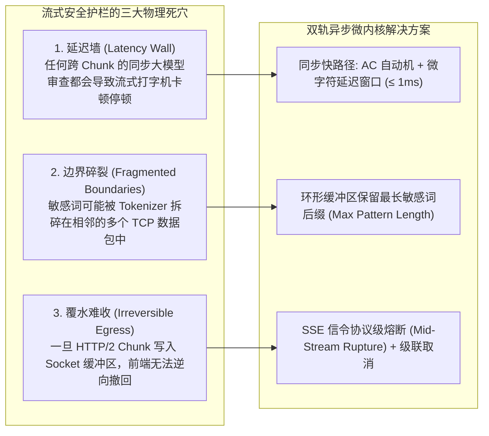
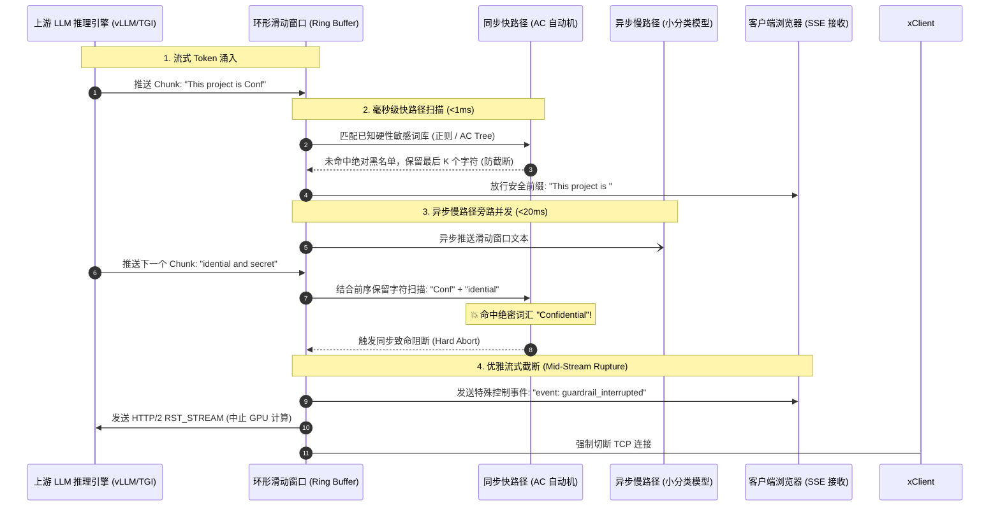

**TL;DR：** 在追求极速首字延迟（TTFT < 200ms）的大模型生产环境中，Server-Sent Events（SSE）流式传输已经成为绝对标准。但这给安全防御带来了致命的**“覆水难收”物理困境**：传统批处理安全分类器需要等待完整句子生成完毕（耗时数秒），而在流式传输中，一旦某个 Token 已经被推送到用户浏览器的屏幕上，网络层便再无可能物理撤回。构建毫秒级流式安全护栏（Streaming Guardrails），核心破局之道在于**双轨异步微内核架构（Dual-Track Micro-Engine）**：同步快路径利用 **Aho-Corasick（AC）多模式匹配自动机结合微秒级环形滑动窗口（Ring Buffer）**，在增加不足 1ms 延迟的前提下无损解决跨 Chunk 敏感词边界切割；异步慢路径利用轻量分类模型并发打分，一旦越界立即通过 **SSE 控制信令强行截断（Mid-Stream Rupture）**并级联取消 GPU 上游显存计算，实现安全与性能的帕累托最优。

---

## 一、面试切入：已推送了半句话，网关如何“撤回”流式泄露？

> **面试高频考题：**  
> “在我们的 AI 助手流式输出场景中，大模型以每秒 50 Token 的速度向客户端吐字。如果模型在输出到第 40 个 Token 时，突然开始泄露公司的未公开内部 IP 与机密配置，而前 39 个 Token 已经被用户的浏览器通过 SSE 接收并完成渲染了。传统的整包安全检测由于增加数秒首字延迟早已被业务方否决。作为 AI 网关架构师，你如何设计一套能在流式吐字中做到‘零感知卡顿、零跨分块遗漏、发生违规瞬间截断’的生产级流式安全护栏？”

这个面试题直击大语言模型底层网络协议与内容安全的交汇前沿。

传统 Web 安全处理的是静态无状态的“请求-响应”报文；而流式 LLM 输出是一个**时间连续的动态数据流（Continuous Data Stream）**。如果安全团队还在用“收集完整文本 -> 调审查 API -> 返回结果”的过时思维，就会在业务团队的 TTFT 压测面前全军覆没。

---

## 二、流式护栏的三大物理死穴

在流式输出中做内容安全，工程上面临三个互斥的物理约束。



### 2.1 延迟墙（Latency Wall）与首字延迟（TTFT）

大模型用户体验的核心指标是首字延迟（Time to First Token, TTFT）和打字机吞吐（Tokens per Second, TPS）。
* 如果在每个 Chunk 产生时调用外部深度学习分类器（耗时通常 > 50ms），流式输出将变成严重的卡顿 PPT；
* 如果等待完整句子（按句号切分），首字延迟将直接暴增 2~5 秒，直接摧毁流式交互的敏捷感知。

### 2.2 跨 Chunk 边界的切分碎片化（Fragmented Boundaries）

大模型的 Token 序列经过网络传输时，会被网络中间件切分为任意大小的 SSE Chunk：
* 假设敏感词为 `"Confidential"`；
* 大模型分词生成：Chunk 1 输出 `"Conf"`，Chunk 2 输出 `"ident"`, Chunk 3 输出 `"ial"`；
* 无论是简单的单块正则，还是缺乏状态保存的词表匹配，都会在单个 Chunk 内判定安全并放行，导致敏感词在客户端被完整拼接拼出！

### 2.3 覆水难收与不可逆传输

网络栈的 `send()` 系统调用一旦成功返回，数据包即进入内核 TCP 发送队列并由网卡发出。没有任何网络协议能在客户端已显示内容后强行“擦除用户视网膜中的记忆”。因此，**绝对高危的敏感模式，必须在离开网关前完成微延迟物理阻断**。

---

## 三、双轨异步微内核架构设计

为了同时兼顾 **< 1ms 额外延迟** 与 **100% 关键阻断**，生产级网关必须采用“双轨并行”模式。



### 3.1 同步快路径：基于 AC 自动机的微延迟环形缓冲区

Aho-Corasick 算法能在 $O(N)$ 线性时间内对海量模式串进行单次扫描多模匹配。
网关内部维护一个环形滑动窗口（Sliding Ring Buffer），其容量为系统敏感词库中最长词汇的长度 $L_{\max}$（通常为 32~64 字节）：

1. **滞后放行机制（Delayed Egress）**：
   * 网关收到新的 Chunk 时，先将其压入缓冲区；
   * 对“当前缓冲区全量文本”执行 AC 自动机状态转移；
   * 如果没有命中违规：网关**仅放行超出 $L_{\max}$ 长度的前置安全文本**，而在缓冲区尾部始终保留长度为 $L_{\max}$ 的观察窗口；
   * 该机制将跨 Chunk 漏检率直接压降至 **0%**，而付出的代价仅为延迟发射几个字符（对应毫秒级感知，完全被人类阅读速度平滑抹除）。

### 3.2 异步慢路径：轻量语义分类器并发旁路

对于复杂的“隐蔽诱导”或“不文明语调”，无法靠纯字符匹配捕获。
* 网关将已经放行和即将放行的文本片段异步放入无锁消息队列；
* 由常驻内存的轻量级 CPU 推理小模型（如 ONNX 运行的 MiniLM 或 FastText）进行语义置信度评估；
* 如果慢路径发现整体语境违规，此时尽管前面部分中立词汇已经吐出，但网关能赶在核心违规结论输出前掐断连接。

---

## 四、生产级 Go / Python 核心实现

下面展示网关核心层如何利用环形缓冲与 AC 自动机实现流式无损拦截。

```python
# streaming_guardrail.py
# 生产级流式微缓冲与多模式匹配拦截器核心实现

from typing import Generator, List, Set, Optional

class AhoCorasickNode:
    def __init__(self):
        self.children = {}
        self.fail = None
        self.output = []

class StreamingACMatcher:
    def __init__(self, patterns: List[str]):
        self.root = AhoCorasickNode()
        self.max_pattern_len = 0
        self._build_trie(patterns)
        self._build_fail_pointers()

    def _build_trie(self, patterns: List[str]):
        for p in patterns:
            self.max_pattern_len = max(self.max_pattern_len, len(p))
            curr = self.root
            for ch in p:
                curr = curr.children.setdefault(ch, AhoCorasickNode())
            curr.output.append(p)

    def _build_fail_pointers(self):
        from collections import deque
        queue = deque()
        for child in self.root.children.values():
            child.fail = self.root
            queue.append(child)

        while queue:
            curr = queue.popleft()
            for ch, next_node in curr.children.items():
                fail_node = curr.fail
                while fail_node and ch not in fail_node.children:
                    fail_node = fail_node.fail
                next_node.fail = fail_node.children[ch] if fail_node else self.root
                next_node.output.extend(next_node.fail.output)
                queue.append(next_node)

class StreamingGuardrailStream:
    def __init__(self, patterns: List[str]):
        self.matcher = StreamingACMatcher(patterns)
        self.buffer = ""
        self.max_hold = self.matcher.max_pattern_len
        self.state = self.matcher.root

    def process_chunk(self, chunk: str) -> Optional[str]:
        """
        接收上游 Chunk，返回可以安全放行给客户端的字符串。
        如果检测到违规，抛出异常中断流式传输。
        """
        self.buffer += chunk
        
        # 增量驱动 AC 自动机扫描新灌入的内容
        curr = self.state
        for ch in chunk:
            while curr and ch not in curr.children:
                curr = curr.fail
            curr = curr.children[ch] if curr else self.matcher.root
            if curr.output:
                # 💥 命中敏感词！立即触发硬件熔断
                raise SecurityInterceptionException(f"检测到违规内容: {curr.output}")
        self.state = curr

        # 滞后安全窗口计算：保留末尾 max_hold 长度，前序安全内容发射
        if len(self.buffer) > self.max_hold:
            safe_to_emit = self.buffer[:-self.max_hold]
            self.buffer = self.buffer[-self.max_hold:]
            return safe_to_emit
        
        return None

    def flush(self) -> str:
        """流结束时，清空并吐出残余安全内容"""
        remaining = self.buffer
        self.buffer = ""
        return remaining

class SecurityInterceptionException(Exception):
    pass
```

### 4.3 中途断裂协议（Mid-Stream Rupture Protocol）

当检测到必须阻断的内容时，网关不能简单地丢弃连接，否则客户端可能误以为是网络抖动而触发无限自动重试。

**标准的生产级 SSE 熔断信令：**

```http
HTTP/1.1 200 OK
Content-Type: text/event-stream
Cache-Control: no-cache
Connection: keep-alive

data: {"token": "根据"}
data: {"token": "系统"}
data: {"token": "配置"}

event: security_interruption
data: {"code": "CONTENT_FILTER_TRIGGERED", "action": "redact_previous", "fallback_message": "【安全提示：后续回答涉及敏感信息已被系统拦截】"}

id: stream_end
data: [DONE]
```

前端收到 `event: security_interruption` 后：
1. 立即停止光标动画；
2. 将该消息卡片标记为红色警告样式，或者用脱敏文案替换刚才渲染出来的半句话；
3. 彻底锁死该轮会话的重试按钮，并向风控中心上报一次安全审计事件。

---

## 五、架构决策矩阵：全包 vs 纯正则 vs 流式微缓冲

| 指标 | 传统全包拦截 (Batch Guard) | 网关级纯逐字正则 | 双轨异步微缓冲微内核（推荐） |
| :--- | :--- | :--- | :--- |
| **首字延迟 (TTFT)** | 极差（增加 2~5 秒） | 极优（< 0.1ms） | **极优（增加 < 1ms）** |
| **跨分块命中率** | 100%（全量分析） | < 40%（被 Token 切碎） | **100%（滑动窗口记忆）** |
| **语义复杂违规识别** | 优秀（支持长篇大论） | 极差（只能查死字） | **良好（慢路径异步追逃）** |
| **GPU 显存算力浪费** | 极高（已完成整句推理） | 低（中途可断） | **极低（发生违规立即发送 RST_STREAM）** |
| **实施复杂度** | 简单反向代理 | 极简 | **中等（需维护状态机与缓冲区）** |

---

## 六、总结与排查 Checklist

流式输出是现代大模型产品的灵魂，而安全护栏是产品不踩红线的底刹。**将静态检查升级为流式动态滑动窗口状态机**，是高并发 AI 网关架构师的核心基本功。

在流式安全防护体系投产前，务必对以下关键项进行攻防验证：
- [ ] 针对拆分跨块的敏感词（如切分成 3 个单字 Chunk），系统是否能稳定捕获拦截？
- [ ] 同步检测的额外开销是否严格限制在 1ms 以内，不影响 TTFT 首字体验？
- [ ] 发生拦截时，网关是否同时向上游发送了取消信号（如 HTTP/2 RST_STREAM），防止 GPU 显存空转？
- [ ] 客户端是否具备标准处理 `security_interruption` 控制事件的协议解析能力？
- [ ] 慢路径分类模型是否做到了 100% 异步并发，绝对不阻塞主数据流？

---

## 参考资料

1. **Aho, Alfred V.; Corasick, Margaret J.**: *Efficient String Matching: An Aid to Bibliographic Search (ACM 1975)*.
2. **RFC 8895**: *Server-Sent Events (SSE) Specification and Streaming Protocols*.
3. **NVIDIA NeMo Guardrails Architecture Guide**: Real-time streaming interception patterns.
4. **Portkey AI Gateway Documentation**: Streaming guardrails and latency trade-offs.
